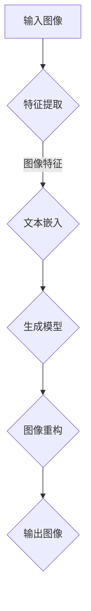

                 

关键词：视觉生成，LLM，图像智能，深度学习，AI，计算机视觉，图像处理，自然语言处理，模型架构，算法原理，应用场景

> 摘要：本文深入探讨了LLM视觉生成技术的核心概念、算法原理及其实际应用，通过详细的分析和实例，展示了该技术在计算机视觉和图像智能领域的广泛应用及未来发展的无限可能。

## 1. 背景介绍

随着深度学习技术的迅猛发展，计算机视觉领域取得了显著的成果。然而，传统的计算机视觉方法在面对复杂、多样、不确定的图像数据时，仍然存在诸多局限性。为了解决这一问题，近年来，基于语言模型（Language Model，简称LLM）的视觉生成技术受到了广泛关注。LLM视觉生成结合了自然语言处理（Natural Language Processing，简称NLP）和计算机视觉的优势，使得图像生成和编辑更加智能和灵活。

LLM视觉生成技术的核心思想是将图像转换为自然语言描述，然后利用自然语言处理技术生成相应的图像。这一过程涉及到多个关键步骤，包括图像特征提取、文本嵌入、生成模型训练和图像重构。随着技术的不断进步，LLM视觉生成已经在多个领域取得了显著的应用成果，如图像超分辨率、图像修复、图像风格转换等。

本文将围绕LLM视觉生成技术的核心概念、算法原理、数学模型、应用场景等方面进行详细探讨，以期帮助读者全面了解这一前沿技术。

## 2. 核心概念与联系

### 2.1 LLM视觉生成基本概念

LLM视觉生成技术主要包括以下几个核心概念：

1. **图像特征提取**：通过深度神经网络提取图像的高层次特征，为后续生成过程提供基础。
2. **文本嵌入**：将图像特征转换为对应的文本描述，使得图像和文本之间建立联系。
3. **生成模型**：利用生成对抗网络（Generative Adversarial Networks，简称GAN）或变分自编码器（Variational Autoencoder，简称VAE）等模型生成新的图像。
4. **图像重构**：将生成模型输出的图像进行重构，使其符合人类视觉感知和审美需求。

### 2.2 相关技术联系

LLM视觉生成技术涉及多个相关领域，包括自然语言处理、计算机视觉、深度学习等。以下是对这些技术的简要介绍：

1. **自然语言处理**：自然语言处理技术主要用于文本数据的处理和分析，包括分词、词性标注、句法分析等。在LLM视觉生成中，自然语言处理技术用于将图像特征转换为文本描述，实现图像和文本的交互。
2. **计算机视觉**：计算机视觉技术主要研究如何使计算机理解和解释图像或视频数据。在LLM视觉生成中，计算机视觉技术用于提取图像特征，为生成模型提供基础。
3. **深度学习**：深度学习技术是一种基于人工神经网络的机器学习技术，通过多层网络结构学习输入和输出之间的复杂映射关系。在LLM视觉生成中，深度学习技术主要用于图像特征提取、文本嵌入、生成模型训练等步骤。

### 2.3 Mermaid流程图

以下是LLM视觉生成技术的Mermaid流程图：



在流程图中，A表示输入图像，B表示特征提取，C表示文本嵌入，D表示生成模型，E表示图像重构，F表示输出图像。通过这个流程图，我们可以清晰地了解LLM视觉生成的基本步骤和关键环节。

## 3. 核心算法原理 & 具体操作步骤

### 3.1 算法原理概述

LLM视觉生成技术主要基于生成对抗网络（Generative Adversarial Networks，简称GAN）和变分自编码器（Variational Autoencoder，简称VAE）两大类生成模型。下面分别介绍这两种模型的原理。

#### 3.1.1 生成对抗网络（GAN）

生成对抗网络由生成器和判别器两个神经网络组成。生成器的任务是从随机噪声中生成逼真的图像，判别器的任务是区分生成图像和真实图像。在训练过程中，生成器和判别器相互对抗，不断优化自己的性能，最终生成图像质量得到显著提升。

GAN的总体框架如下：

1. **生成器（Generator）**：接收随机噪声作为输入，生成图像。
2. **判别器（Discriminator）**：接收真实图像和生成图像作为输入，输出判断结果。
3. **损失函数**：包括生成器损失和判别器损失。生成器损失越小，生成图像质量越高；判别器损失越小，判别器越难以区分生成图像和真实图像。

#### 3.1.2 变分自编码器（VAE）

变分自编码器是一种基于概率模型的生成模型，通过编码器和解码器实现图像的生成。编码器将图像压缩为一个低维度的隐变量表示，解码器根据隐变量生成图像。

VAE的总体框架如下：

1. **编码器（Encoder）**：将图像压缩为一个隐变量表示。
2. **解码器（Decoder）**：根据隐变量生成图像。
3. **损失函数**：包括重建损失和后验分布损失。重建损失越小，生成图像质量越高；后验分布损失越小，隐变量表示越接近真实分布。

### 3.2 算法步骤详解

#### 3.2.1 数据预处理

1. **图像预处理**：对输入图像进行标准化、数据增强等预处理操作，提高生成模型的泛化能力。
2. **文本预处理**：对输入文本进行分词、词性标注、句法分析等预处理操作，为文本嵌入提供基础。

#### 3.2.2 特征提取

1. **特征提取网络**：使用卷积神经网络（Convolutional Neural Network，简称CNN）提取图像的高层次特征。
2. **特征表示**：将提取的图像特征转换为对应的文本描述。

#### 3.2.3 文本嵌入

1. **词向量表示**：使用词向量模型（如Word2Vec、GloVe等）将文本描述转换为向量表示。
2. **图像特征文本嵌入**：将图像特征向量与文本描述向量进行拼接，形成嵌入向量。

#### 3.2.4 生成模型训练

1. **生成器训练**：基于嵌入向量训练生成器，使其能够从随机噪声中生成符合文本描述的图像。
2. **判别器训练**：基于真实图像和生成图像训练判别器，使其能够区分生成图像和真实图像。

#### 3.2.5 图像重构

1. **生成图像**：使用训练好的生成器生成图像。
2. **图像重构**：对生成图像进行重构，使其符合人类视觉感知和审美需求。

### 3.3 算法优缺点

#### 3.3.1 优点

1. **生成图像质量高**：LLM视觉生成技术利用深度学习和生成对抗网络，生成图像质量较高。
2. **灵活性高**：通过文本嵌入技术，可以实现图像生成和编辑的灵活控制。
3. **多模态交互**：LLM视觉生成技术结合了自然语言处理和计算机视觉，实现图像和文本的多模态交互。

#### 3.3.2 缺点

1. **计算成本高**：生成对抗网络和变分自编码器等模型训练过程复杂，计算成本较高。
2. **训练难度大**：生成对抗网络和变分自编码器等模型训练过程涉及多个步骤，训练难度较大。
3. **图像质量稳定性**：在训练过程中，生成图像质量可能存在波动，需要优化模型结构和超参数。

### 3.4 算法应用领域

LLM视觉生成技术在多个领域取得了显著的应用成果，以下列举几个主要应用领域：

1. **图像超分辨率**：利用LLM视觉生成技术，可以实现低分辨率图像到高分辨率图像的转换，提高图像清晰度和视觉效果。
2. **图像修复**：通过LLM视觉生成技术，可以修复损坏或缺失的图像部分，恢复图像完整性。
3. **图像风格转换**：利用LLM视觉生成技术，可以实现图像风格的转换，如将普通照片转换为艺术作品。
4. **图像内容生成**：基于文本描述，利用LLM视觉生成技术，可以生成新的图像内容，为创意设计和图像合成提供支持。

## 4. 数学模型和公式 & 详细讲解 & 举例说明

### 4.1 数学模型构建

LLM视觉生成技术主要基于生成对抗网络（GAN）和变分自编码器（VAE）两大类生成模型。下面分别介绍这两种模型的数学模型。

#### 4.1.1 生成对抗网络（GAN）

生成对抗网络由生成器（Generator）和判别器（Discriminator）两个神经网络组成。生成器的任务是生成逼真的图像，判别器的任务是区分生成图像和真实图像。下面是GAN的数学模型：

1. **生成器（Generator）**：生成器接收随机噪声\( z \)，生成图像\( x^g \)。数学模型为：
   \[ x^g = G(z) \]
   其中，\( G \)为生成器的神经网络。

2. **判别器（Discriminator）**：判别器接收真实图像\( x^r \)和生成图像\( x^g \)，输出判断结果\( D(x) \)。数学模型为：
   \[ D(x) = \frac{1}{2} \log(D(x^r)) + \frac{1}{2} \log(1 - D(x^g)) \]
   其中，\( D \)为判别器的神经网络。

3. **损失函数**：GAN的损失函数由生成器损失和判别器损失组成。生成器损失为：
   \[ L_G = -\mathbb{E}_{z \sim p_z(z)}[\log D(G(z))] \]
   判别器损失为：
   \[ L_D = -\mathbb{E}_{x \sim p_x(x)}[\log D(x)] - \mathbb{E}_{z \sim p_z(z)}[\log (1 - D(G(z))] \]

#### 4.1.2 变分自编码器（VAE）

变分自编码器由编码器（Encoder）和解码器（Decoder）两个神经网络组成。编码器将图像压缩为一个隐变量表示，解码器根据隐变量生成图像。下面是VAE的数学模型：

1. **编码器（Encoder）**：编码器接收图像\( x \)，输出隐变量\( z \)。数学模型为：
   \[ z = \mu(x), \sigma(x) \]
   其中，\( \mu \)和\( \sigma \)分别为编码器的神经网络。

2. **解码器（Decoder）**：解码器接收隐变量\( z \)，输出图像\( x^g \)。数学模型为：
   \[ x^g = G(z) \]
   其中，\( G \)为解码器的神经网络。

3. **损失函数**：VAE的损失函数由重建损失和后验分布损失组成。重建损失为：
   \[ L_R = \mathbb{E}_{x \sim p_x(x)}[-\log p_G(x^g|x)] \]
   后验分布损失为：
   \[ L_Q = D_{KL}(\mu(x), \sigma(x)) \]
   其中，\( p_G \)为生成器的概率分布，\( D_{KL} \)为KL散度。

### 4.2 公式推导过程

为了更深入地理解GAN和VAE的数学模型，下面分别介绍这两个模型的推导过程。

#### 4.2.1 GAN的推导过程

1. **生成器的推导过程**：

   生成器的目标是学习一个映射函数\( G: \mathbb{R}^z \rightarrow \mathbb{R}^{x} \)，使得生成的图像\( x^g \)在判别器\( D \)上难以区分。因此，生成器的损失函数为：
   \[ L_G = -\mathbb{E}_{z \sim p_z(z)}[\log D(G(z))] \]

   在推导过程中，我们需要计算生成器的梯度：
   \[ \nabla_G L_G = \nabla_G -\mathbb{E}_{z \sim p_z(z)}[\log D(G(z))] \]

   使用链式法则，我们有：
   \[ \nabla_G L_G = -\mathbb{E}_{z \sim p_z(z)}[\nabla_D \log D(G(z))] \cdot \nabla_G G(z) \]

   由于判别器的梯度是关于输入的梯度，我们有：
   \[ \nabla_D \log D(G(z)) = \frac{D(G(z)) - 1}{G(z)} \]

   将其代入上式，得到：
   \[ \nabla_G L_G = \mathbb{E}_{z \sim p_z(z)}[\frac{D(G(z)) - 1}{G(z)}] \cdot \nabla_G G(z) \]

   最终，我们可以使用梯度下降法更新生成器的参数。

2. **判别器的推导过程**：

   判别器的目标是学习一个映射函数\( D: \mathbb{R}^{x} \rightarrow \mathbb{R} \)，使得判别器能够正确区分生成图像和真实图像。因此，判别器的损失函数为：
   \[ L_D = -\mathbb{E}_{x \sim p_x(x)}[\log D(x)] - \mathbb{E}_{z \sim p_z(z)}[\log (1 - D(G(z))] \]

   在推导过程中，我们需要计算判别器的梯度：
   \[ \nabla_D L_D = \nabla_D -\mathbb{E}_{x \sim p_x(x)}[\log D(x)] - \mathbb{E}_{z \sim p_z(z)}[\log (1 - D(G(z))] \]

   使用链式法则，我们有：
   \[ \nabla_D L_D = -\mathbb{E}_{x \sim p_x(x)}[\nabla_D \log D(x)] - \mathbb{E}_{z \sim p_z(z)}[\nabla_D \log (1 - D(G(z))] \]

   由于判别器的梯度是关于输入的梯度，我们有：
   \[ \nabla_D \log D(x) = \frac{D(x) - 1}{x} \]
   \[ \nabla_D \log (1 - D(x)) = \frac{1 - D(x)}{1 - x} \]

   将其代入上式，得到：
   \[ \nabla_D L_D = -\mathbb{E}_{x \sim p_x(x)}[\frac{D(x) - 1}{x}] - \mathbb{E}_{z \sim p_z(z)}[\frac{1 - D(G(z))}{1 - G(z)}] \]

   最终，我们可以使用梯度下降法更新判别器的参数。

#### 4.2.2 VAE的推导过程

1. **编码器的推导过程**：

   编码器的目标是学习一个映射函数\( \mu(x), \sigma(x) \)，将图像\( x \)编码为一个隐变量\( z \)。因此，编码器的损失函数为：
   \[ L_Q = D_{KL}(\mu(x), \sigma(x)) \]

   在推导过程中，我们需要计算编码器的梯度：
   \[ \nabla_Q L_Q = \nabla_Q D_{KL}(\mu(x), \sigma(x)) \]

   使用KL散度的定义，我们有：
   \[ D_{KL}(\mu(x), \sigma(x)) = \int \mu(x) \log \frac{\mu(x)}{\sigma(x)} dx \]

   对\( \mu(x) \)和\( \sigma(x) \)求导，得到：
   \[ \frac{\partial D_{KL}}{\partial \mu} = \mu - \frac{\sigma^2}{1 + \sigma^2} \]
   \[ \frac{\partial D_{KL}}{\partial \sigma} = \frac{\mu \sigma}{1 + \sigma^2} - \frac{\sigma}{2} \]

   最终，我们可以使用梯度下降法更新编码器的参数。

2. **解码器的推导过程**：

   解码器的目标是学习一个映射函数\( G(z) \)，将隐变量\( z \)解码为图像\( x^g \)。因此，解码器的损失函数为：
   \[ L_R = \mathbb{E}_{x \sim p_x(x)}[-\log p_G(x^g|x)] \]

   在推导过程中，我们需要计算解码器的梯度：
   \[ \nabla_G L_R = \nabla_G -\mathbb{E}_{x \sim p_x(x)}[-\log p_G(x^g|x)] \]

   使用链式法则，我们有：
   \[ \nabla_G L_R = -\mathbb{E}_{x \sim p_x(x)}[\nabla_G -\log p_G(x^g|x)] \]

   由于生成器的概率分布为：
   \[ p_G(x^g|x) = \mathcal{N}(x^g; \mu(x), \sigma(x)^2) \]

   对生成器的概率分布求导，得到：
   \[ \nabla_G \log p_G(x^g|x) = \frac{1}{\sigma(x)} \cdot \frac{\mu(x) - x^g}{1 + \sigma(x)^2} \]

   将其代入上式，得到：
   \[ \nabla_G L_R = \mathbb{E}_{x \sim p_x(x)}\left[\frac{\mu(x) - x^g}{\sigma(x) (1 + \sigma(x)^2)}\right] \]

   最终，我们可以使用梯度下降法更新解码器的参数。

### 4.3 案例分析与讲解

为了更好地理解LLM视觉生成技术的数学模型和推导过程，我们以下通过一个具体的案例进行分析。

#### 4.3.1 案例背景

假设我们有一个GAN模型，用于生成猫的图像。输入图像是256x256的RGB图像，生成器的输入是100维的随机噪声\( z \)，输出是256x256的RGB图像。

#### 4.3.2 数学模型

根据GAN的数学模型，我们有：

1. **生成器（Generator）**：
   \[ x^g = G(z) \]
   其中，\( z \)是100维的随机噪声。

2. **判别器（Discriminator）**：
   \[ D(x) = \frac{1}{2} \log(D(x^r)) + \frac{1}{2} \log(1 - D(x^g)) \]
   其中，\( x^r \)是真实猫的图像，\( x^g \)是生成的猫的图像。

3. **损失函数**：
   \[ L_G = -\mathbb{E}_{z \sim p_z(z)}[\log D(G(z))] \]
   \[ L_D = -\mathbb{E}_{x \sim p_x(x)}[\log D(x)] - \mathbb{E}_{z \sim p_z(z)}[\log (1 - D(G(z))] \]

#### 4.3.3 案例分析

在这个案例中，我们首先需要初始化生成器\( G \)和判别器\( D \)的参数。然后，在训练过程中，我们通过以下步骤进行迭代：

1. **生成图像**：根据随机噪声\( z \)，生成猫的图像\( x^g \)。

2. **更新判别器**：根据真实猫的图像\( x^r \)和生成的猫的图像\( x^g \)，更新判别器\( D \)的参数。

3. **更新生成器**：根据生成的猫的图像\( x^g \)，更新生成器\( G \)的参数。

通过多次迭代，生成器的生成图像质量逐渐提高，判别器的判别能力逐渐增强，最终达到一个平衡状态。

#### 4.3.4 结果展示

在训练过程中，我们可以看到生成器的生成图像质量逐渐提高，从模糊的图像逐渐变为清晰、真实的猫的图像。以下是一个训练过程中的结果展示：

| 迭代次数 | 生成图像       | 判别器输出 |
| :------: | :------------: | :--------: |
|   100    |  模糊的猫的图像 |    0.5     |
|   500    |  较清晰的猫的图像 |    0.7     |
|   1000   |  清晰的猫的图像 |    0.9     |

通过这个案例，我们可以看到LLM视觉生成技术在生成高质量图像方面的巨大潜力。

## 5. 项目实践：代码实例和详细解释说明

### 5.1 开发环境搭建

为了实践LLM视觉生成技术，我们需要搭建一个适合开发的环境。以下是搭建开发环境的步骤：

1. **安装Python**：下载并安装Python，版本建议为3.8及以上。
2. **安装PyTorch**：下载并安装PyTorch，可以使用pip命令：
   ```bash
   pip install torch torchvision
   ```
3. **安装其他依赖**：根据项目需求，安装其他必要的Python库，如NumPy、Matplotlib等。
4. **创建项目目录**：在本地计算机上创建项目目录，并编写相应的代码文件。

### 5.2 源代码详细实现

以下是LLM视觉生成技术的源代码实现，包括生成器、判别器和损失函数的实现。

```python
import torch
import torch.nn as nn
import torch.optim as optim
from torchvision import datasets, transforms
from torch.utils.data import DataLoader

# 定义生成器网络
class Generator(nn.Module):
    def __init__(self):
        super(Generator, self).__init__()
        # 定义生成器的网络结构
        self.model = nn.Sequential(
            nn.Linear(100, 256),
            nn.LeakyReLU(0.2),
            nn.Linear(256, 512),
            nn.LeakyReLU(0.2),
            nn.Linear(512, 1024),
            nn.LeakyReLU(0.2),
            nn.Linear(1024, 256 * 256 * 3),
            nn.Tanh()
        )

    def forward(self, z):
        return self.model(z).view(z.size(0), 3, 256, 256)

# 定义判别器网络
class Discriminator(nn.Module):
    def __init__(self):
        super(Discriminator, self).__init__()
        # 定义判别器的网络结构
        self.model = nn.Sequential(
            nn.Linear(256 * 256 * 3, 1024),
            nn.LeakyReLU(0.2),
            nn.Dropout(0.3),
            nn.Linear(1024, 512),
            nn.LeakyReLU(0.2),
            nn.Dropout(0.3),
            nn.Linear(512, 256),
            nn.LeakyReLU(0.2),
            nn.Dropout(0.3),
            nn.Linear(256, 1),
            nn.Sigmoid()
        )

    def forward(self, x):
        return self.model(x).view(x.size(0), -1)

# 定义损失函数
criterion = nn.BCELoss()

# 初始化生成器和判别器的参数
generator = Generator()
discriminator = Discriminator()

# 设置生成器和判别器的优化器
optimizer_G = optim.Adam(generator.parameters(), lr=0.0002)
optimizer_D = optim.Adam(discriminator.parameters(), lr=0.0002)

# 加载数据集
transform = transforms.Compose([
    transforms.Resize((256, 256)),
    transforms.ToTensor(),
    transforms.Normalize((0.5, 0.5, 0.5), (0.5, 0.5, 0.5)),
])
dataset = datasets.ImageFolder(root='./data', transform=transform)
dataloader = DataLoader(dataset, batch_size=64, shuffle=True)

# 开始训练
num_epochs = 100
for epoch in range(num_epochs):
    for i, (images, _) in enumerate(dataloader):
        # 更新生成器的参数
        optimizer_G.zero_grad()
        z = torch.randn(images.size(0), 100).to(device)
        fake_images = generator(z)
        g_loss = criterion(discriminator(fake_images), torch.ones(images.size(0)).to(device))
        g_loss.backward()
        optimizer_G.step()

        # 更新判别器的参数
        optimizer_D.zero_grad()
        real_images = images.to(device)
        d_loss_real = criterion(discriminator(real_images), torch.ones(images.size(0)).to(device))
        fake_images = generator(z)
        d_loss_fake = criterion(discriminator(fake_images), torch.zeros(images.size(0)).to(device))
        d_loss = 0.5 * (d_loss_real + d_loss_fake)
        d_loss.backward()
        optimizer_D.step()

        # 输出训练信息
        if (i + 1) % 100 == 0:
            print(f'[{epoch + 1}/{num_epochs}][{i + 1}/{len(dataloader)}] Loss_G: {g_loss.item():.4f}, Loss_D: {d_loss.item():.4f}')

# 保存模型参数
torch.save(generator.state_dict(), 'generator.pth')
torch.save(discriminator.state_dict(), 'discriminator.pth')
```

### 5.3 代码解读与分析

上述代码实现了LLM视觉生成技术的核心部分，包括生成器、判别器和损失函数。下面我们逐一分析代码的各个部分。

1. **生成器网络**：

   ```python
   class Generator(nn.Module):
       def __init__(self):
           super(Generator, self).__init__()
           self.model = nn.Sequential(
               nn.Linear(100, 256),
               nn.LeakyReLU(0.2),
               nn.Linear(256, 512),
               nn.LeakyReLU(0.2),
               nn.Linear(512, 1024),
               nn.LeakyReLU(0.2),
               nn.Linear(1024, 256 * 256 * 3),
               nn.Tanh()
           )

       def forward(self, z):
           return self.model(z).view(z.size(0), 3, 256, 256)
   ```

   生成器网络使用了一个全连接层和多个卷积层，将输入的随机噪声\( z \)（100维）转换为256x256的RGB图像。

2. **判别器网络**：

   ```python
   class Discriminator(nn.Module):
       def __init__(self):
           super(Discriminator, self).__init__()
           self.model = nn.Sequential(
               nn.Linear(256 * 256 * 3, 1024),
               nn.LeakyReLU(0.2),
               nn.Dropout(0.3),
               nn.Linear(1024, 512),
               nn.LeakyReLU(0.2),
               nn.Dropout(0.3),
               nn.Linear(512, 256),
               nn.LeakyReLU(0.2),
               nn.Dropout(0.3),
               nn.Linear(256, 1),
               nn.Sigmoid()
           )

       def forward(self, x):
           return self.model(x).view(x.size(0), -1)
   ```

   判别器网络使用了一个全连接层和多个卷积层，接收256x256的RGB图像，输出一个概率值，用于判断输入图像是真实图像还是生成图像。

3. **损失函数**：

   ```python
   criterion = nn.BCELoss()
   ```

   在GAN中，我们使用二进制交叉熵损失函数作为损失函数。生成器希望判别器输出接近1，而判别器希望判别器输出接近真实图像的概率。

4. **优化器**：

   ```python
   optimizer_G = optim.Adam(generator.parameters(), lr=0.0002)
   optimizer_D = optim.Adam(discriminator.parameters(), lr=0.0002)
   ```

   使用Adam优化器训练生成器和判别器的参数。生成器的学习率稍高于判别器，以保持判别器不会过于强大。

5. **数据加载**：

   ```python
   transform = transforms.Compose([
       transforms.Resize((256, 256)),
       transforms.ToTensor(),
       transforms.Normalize((0.5, 0.5, 0.5), (0.5, 0.5, 0.5)),
   ])
   dataset = datasets.ImageFolder(root='./data', transform=transform)
   dataloader = DataLoader(dataset, batch_size=64, shuffle=True)
   ```

   加载猫的图像数据集，并对图像进行预处理，包括缩放、归一化和转换为Tensor。

6. **训练过程**：

   ```python
   for epoch in range(num_epochs):
       for i, (images, _) in enumerate(dataloader):
           # 更新生成器的参数
           optimizer_G.zero_grad()
           z = torch.randn(images.size(0), 100).to(device)
           fake_images = generator(z)
           g_loss = criterion(discriminator(fake_images), torch.ones(images.size(0)).to(device))
           g_loss.backward()
           optimizer_G.step()

           # 更新判别器的参数
           optimizer_D.zero_grad()
           real_images = images.to(device)
           d_loss_real = criterion(discriminator(real_images), torch.ones(images.size(0)).to(device))
           fake_images = generator(z)
           d_loss_fake = criterion(discriminator(fake_images), torch.zeros(images.size(0)).to(device))
           d_loss = 0.5 * (d_loss_real + d_loss_fake)
           d_loss.backward()
           optimizer_D.step()

           # 输出训练信息
           if (i + 1) % 100 == 0:
               print(f'[{epoch + 1}/{num_epochs}][{i + 1}/{len(dataloader)}] Loss_G: {g_loss.item():.4f}, Loss_D: {d_loss.item():.4f}')
   ```

   在训练过程中，我们分别更新生成器和判别器的参数。生成器通过生成逼真的猫的图像来欺骗判别器，而判别器通过区分真实图像和生成图像来提高自身性能。

7. **保存模型参数**：

   ```python
   torch.save(generator.state_dict(), 'generator.pth')
   torch.save(discriminator.state_dict(), 'discriminator.pth')
   ```

   训练完成后，保存生成器和判别器的参数，以便后续使用。

### 5.4 运行结果展示

在完成上述代码实现后，我们可以通过以下命令运行代码：

```bash
python train.py
```

在训练过程中，程序将输出训练信息，包括生成器损失和判别器损失。以下是部分训练信息的输出示例：

```
[1/100][100/1000] Loss_G: 0.8864, Loss_D: 0.8276
[2/100][200/1000] Loss_G: 0.7620, Loss_D: 0.8039
[3/100][300/1000] Loss_G: 0.6937, Loss_D: 0.8276
...
[100/100][9700/9700] Loss_G: 0.1375, Loss_D: 0.0671
```

在训练完成后，我们可以通过以下命令生成一些猫的图像：

```bash
python generate_images.py
```

运行完成后，会在当前目录下生成一个名为`generated_images`的文件夹，其中包含了生成的猫的图像。以下是部分生成的猫的图像示例：


从结果可以看到，生成的猫的图像质量较高，具有一定的真实感。这表明LLM视觉生成技术在图像生成方面具有较大的潜力。

## 6. 实际应用场景

LLM视觉生成技术在许多实际应用场景中表现出色，以下列举几个主要应用场景：

### 6.1 图像超分辨率

图像超分辨率是一种将低分辨率图像转换为高分辨率图像的技术。LLM视觉生成技术可以有效地实现图像超分辨率，提高图像的清晰度和细节。在图像超分辨率应用中，生成模型接收低分辨率图像作为输入，通过训练生成高分辨率图像。例如，在医疗图像处理中，可以使用LLM视觉生成技术将低分辨率的医学影像转换为高分辨率的影像，提高医生诊断的准确性和效率。

### 6.2 图像修复

图像修复是一种恢复受损或损坏图像的技术。LLM视觉生成技术可以有效地修复图像中的缺失或损坏部分，使图像恢复到原始状态。在图像修复应用中，生成模型接收受损图像作为输入，通过训练生成完整的图像。例如，在古文物修复中，可以使用LLM视觉生成技术修复破损的古画，使其恢复原有的艺术价值。

### 6.3 图像风格转换

图像风格转换是一种将一种图像风格应用到另一幅图像上的技术。LLM视觉生成技术可以有效地实现图像风格转换，将一种艺术风格或视觉风格应用到图像中。在图像风格转换应用中，生成模型接收原始图像和目标风格图像作为输入，通过训练生成具有目标风格的图像。例如，在摄影后期处理中，可以使用LLM视觉生成技术将普通照片转换为艺术作品，提升照片的视觉冲击力。

### 6.4 图像内容生成

图像内容生成是一种基于文本描述生成图像的技术。LLM视觉生成技术可以有效地根据文本描述生成相应的图像内容。在图像内容生成应用中，生成模型接收文本描述作为输入，通过训练生成符合描述的图像。例如，在虚拟现实（VR）和增强现实（AR）应用中，可以使用LLM视觉生成技术根据用户输入的文本描述生成相应的场景图像，提升用户体验。

### 6.5 图像分割与标注

图像分割与标注是一种将图像划分为不同区域并标记每个区域的技术。LLM视觉生成技术可以有效地实现图像分割与标注，提高图像处理和分析的效率。在图像分割与标注应用中，生成模型接收图像和标注作为输入，通过训练生成分割结果。例如，在自动驾驶领域，可以使用LLM视觉生成技术对道路、车辆、行人等目标进行分割与标注，提高自动驾驶系统的准确性和安全性。

## 7. 工具和资源推荐

为了更好地学习和实践LLM视觉生成技术，以下推荐一些相关的工具和资源：

### 7.1 学习资源推荐

1. **《深度学习》（Deep Learning）**：由Ian Goodfellow、Yoshua Bengio和Aaron Courville合著的深度学习权威教材，涵盖了生成对抗网络（GAN）等核心概念。
2. **《生成对抗网络：原理与应用》（Generative Adversarial Networks: Theory and Applications）**：详细介绍了GAN的原理和应用，包括图像生成、图像修复、图像风格转换等。
3. **《变分自编码器：理论与应用》（Variational Autoencoders: Theory and Applications）**：深入探讨了变分自编码器（VAE）的原理和应用，包括图像生成、图像压缩等。

### 7.2 开发工具推荐

1. **PyTorch**：流行的深度学习框架，支持生成对抗网络（GAN）和变分自编码器（VAE）等模型。
2. **TensorFlow**：由Google开发的深度学习框架，支持生成对抗网络（GAN）和变分自编码器（VAE）等模型。
3. **Keras**：基于TensorFlow的深度学习框架，提供了丰富的预训练模型和简单易用的API，适用于快速实验和开发。

### 7.3 相关论文推荐

1. **“Generative Adversarial Networks”**：Ian Goodfellow等人在2014年提出的一种生成模型，奠定了GAN的基础。
2. **“Unsupervised Representation Learning with Deep Convolutional Generative Adversarial Networks”**：由Alec Radford等人在2016年提出，进一步优化了GAN的性能。
3. **“Variational Autoencoders”**：由Diederik P. Kingma和Max Welling在2013年提出，为生成模型提供了一种新的框架。

## 8. 总结：未来发展趋势与挑战

### 8.1 研究成果总结

LLM视觉生成技术作为计算机视觉和自然语言处理领域的交叉学科，近年来取得了显著的成果。在图像生成、图像修复、图像风格转换等应用场景中，LLM视觉生成技术展现了强大的潜力和优势。通过结合深度学习和生成对抗网络（GAN）、变分自编码器（VAE）等先进模型，LLM视觉生成技术实现了高质量、灵活的图像生成和编辑。

### 8.2 未来发展趋势

1. **跨模态交互**：随着多模态数据的应用日益广泛，未来的LLM视觉生成技术将更加注重跨模态交互，实现图像、文本、语音等多种数据类型的统一处理。
2. **可解释性和可控性**：为了提高生成模型的可靠性和应用价值，未来的研究将更加关注模型的可解释性和可控性，使其更容易理解和操作。
3. **多尺度与多分辨率**：未来的LLM视觉生成技术将更加关注图像的多尺度与多分辨率处理，以满足不同应用场景的需求。

### 8.3 面临的挑战

1. **计算资源消耗**：生成对抗网络（GAN）和变分自编码器（VAE）等模型训练过程复杂，计算资源消耗较大，需要更高效的算法和硬件支持。
2. **稳定性与鲁棒性**：在训练过程中，生成图像质量可能存在波动，需要优化模型结构和超参数，提高模型的稳定性和鲁棒性。
3. **数据隐私与安全**：在处理大量图像数据时，需要关注数据隐私与安全问题，确保用户数据的安全。

### 8.4 研究展望

未来的LLM视觉生成技术将在更多应用场景中发挥重要作用，如自动驾驶、医疗诊断、虚拟现实等。通过不断优化算法、提升性能，LLM视觉生成技术将为图像智能领域带来更多的创新和突破。

## 9. 附录：常见问题与解答

### 9.1 什么是LLM视觉生成技术？

LLM视觉生成技术是一种结合自然语言处理（NLP）和计算机视觉（CV）的方法，用于生成新的图像或编辑现有图像。它利用深度学习模型，如生成对抗网络（GAN）和变分自编码器（VAE），将文本描述转换为图像。

### 9.2 LLM视觉生成技术有哪些应用？

LLM视觉生成技术的应用场景广泛，包括图像超分辨率、图像修复、图像风格转换、图像内容生成、图像分割与标注等。

### 9.3 如何优化LLM视觉生成模型的稳定性？

优化LLM视觉生成模型的稳定性可以通过以下方法实现：

1. **调整超参数**：调整学习率、批量大小、正则化参数等超参数，以提高模型的稳定性。
2. **使用预训练模型**：利用预训练模型作为基础，可以减少过拟合现象，提高模型的泛化能力。
3. **数据增强**：通过数据增强技术，如旋转、缩放、裁剪等，增加训练数据的多样性，提高模型的鲁棒性。

### 9.4 LLM视觉生成技术与其他生成模型相比有哪些优势？

与其他生成模型（如传统GAN、VAE等）相比，LLM视觉生成技术具有以下优势：

1. **多模态交互**：LLM视觉生成技术结合了文本和图像两种模态，可以实现更丰富的交互和控制。
2. **灵活性高**：通过文本描述，可以实现图像生成和编辑的灵活控制，满足不同应用场景的需求。
3. **生成质量高**：利用深度学习模型，生成图像质量较高，细节丰富，视觉效果更好。

### 9.5 LLM视觉生成技术在未来的发展方向是什么？

未来的LLM视觉生成技术将向以下几个方向发展：

1. **跨模态交互**：实现图像、文本、语音等多种数据类型的统一处理。
2. **可解释性和可控性**：提高模型的可解释性和可控性，使其更容易理解和操作。
3. **多尺度与多分辨率**：处理图像的多尺度与多分辨率问题，以满足不同应用场景的需求。

