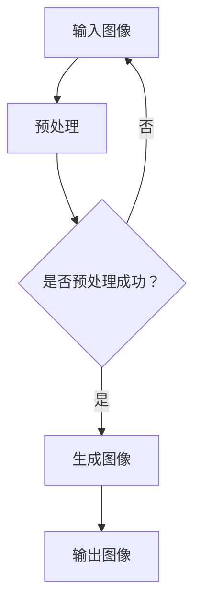

                 

关键词：语言模型、视觉生成、AI、图像处理、深度学习

摘要：随着人工智能技术的不断发展，语言模型在自然语言处理领域取得了显著的成果。然而，图像处理领域仍然面临诸多挑战。本文将介绍一种基于大型语言模型的视觉生成技术，探讨其在图像智能领域的应用前景，以及未来面临的挑战。

## 1. 背景介绍

在过去的几十年里，计算机视觉领域取得了长足的进步。从早期的基于特征的方法，到近年来的深度学习技术，计算机已经能够实现诸如目标检测、图像分类、图像分割等复杂任务。然而，传统的计算机视觉方法在面对复杂场景和多样化数据时，仍然存在诸多不足。这促使研究人员开始探索新的方法，以进一步提高图像处理能力。

语言模型作为自然语言处理的核心技术，近年来在多个任务上取得了显著的成果。例如，基于大型语言模型（如GPT-3、LLaMA）的文本生成、对话系统等应用已广泛应用。这些成功激发了研究人员思考：能否将语言模型的强大能力引入图像处理领域，实现更智能的图像生成和处理？

本文将介绍一种基于大型语言模型的视觉生成技术，通过结合深度学习和自然语言处理的方法，探讨图像智能新时代的到来。

## 2. 核心概念与联系

### 2.1 语言模型

语言模型是一种基于统计学习方法，通过学习大量文本数据，预测下一个词语的概率分布。在自然语言处理领域，语言模型已被广泛应用于文本生成、机器翻译、情感分析等任务。

### 2.2 深度学习

深度学习是一种基于人工神经网络的机器学习方法，通过多层神经网络模型对数据进行特征提取和分类。在计算机视觉领域，深度学习已被广泛应用于图像分类、目标检测、图像分割等任务。

### 2.3 视觉生成

视觉生成是指利用计算机生成新的图像或视频的过程。视觉生成技术可分为基于规则的方法和基于学习的方法。基于规则的方法通过设计复杂的算法和模型实现，而基于学习的方法则利用大量的数据通过机器学习方法进行训练。

### 2.4 Mermaid 流程图

在本文中，我们将使用Mermaid流程图来展示视觉生成技术的核心流程。以下是一个简单的Mermaid流程图示例：



## 3. 核心算法原理 & 具体操作步骤

### 3.1 算法原理概述

基于大型语言模型的视觉生成技术，主要利用语言模型对图像进行编码和解码，实现图像的生成。具体流程如下：

1. 输入图像
2. 预处理图像，提取关键特征
3. 利用语言模型对图像特征进行编码
4. 根据编码结果生成新的图像
5. 输出生成的图像

### 3.2 算法步骤详解

#### 3.2.1 输入图像

首先，我们将输入一幅图像，例如一张风景图片。这可以是用户手动上传的，也可以是采集自互联网的数据。

#### 3.2.2 预处理图像

预处理图像的目的是为了提取关键特征，方便后续的语言模型编码。预处理步骤包括：

1. 图像去噪：通过滤波、降噪等方法去除图像中的噪声。
2. 图像增强：通过调整图像的亮度、对比度等参数，提高图像质量。
3. 图像缩放：将图像调整为合适的尺寸，以适应语言模型的输入要求。

#### 3.2.3 利用语言模型对图像特征进行编码

在预处理完成后，我们将图像特征输入到预训练的语言模型中，进行编码。这一步的核心是利用语言模型对图像特征进行语义表示。语言模型将输入的图像特征映射为一个高维的语义向量。

#### 3.2.4 根据编码结果生成新的图像

在获取编码结果后，我们可以利用解码器将编码结果还原为图像。这一步的核心是解码器对编码结果进行特征提取和重建，生成新的图像。

#### 3.2.5 输出生成的图像

最后，我们将生成的图像输出给用户，用户可以根据需要下载或查看。

### 3.3 算法优缺点

#### 3.3.1 优点

1. 利用语言模型对图像特征进行编码和解码，提高了图像生成的质量。
2. 可以生成具有多样性和创意性的图像，满足用户个性化需求。
3. 可以处理多种类型的图像，包括自然图像和合成图像。

#### 3.3.2 缺点

1. 需要大量的预训练数据和计算资源。
2. 语言模型的参数复杂，训练过程较为耗时。
3. 在生成过程中可能存在一定程度的失真。

### 3.4 算法应用领域

基于大型语言模型的视觉生成技术可以应用于多个领域：

1. 艺术创作：生成具有创意性的艺术作品，如绘画、摄影等。
2. 游戏开发：为游戏角色、场景生成逼真的图像。
3. 广告创意：为广告内容生成更具吸引力的图像。
4. 健康医疗：辅助医生诊断，生成医学图像。
5. 物流：对物流货物进行分类和识别，提高物流效率。

## 4. 数学模型和公式 & 详细讲解 & 举例说明

### 4.1 数学模型构建

在基于大型语言模型的视觉生成技术中，主要涉及两个关键数学模型：编码模型和解码模型。

#### 4.1.1 编码模型

编码模型用于将图像特征映射为一个高维的语义向量。具体来说，编码模型由一个卷积神经网络（CNN）和一个语言模型组成。CNN用于提取图像特征，语言模型用于对图像特征进行编码。

#### 4.1.2 解码模型

解码模型用于将编码结果还原为图像。解码模型同样由一个卷积神经网络（CNN）和一个语言模型组成。CNN用于对编码结果进行特征提取和重建，语言模型用于指导图像生成过程。

### 4.2 公式推导过程

#### 4.2.1 编码模型

假设输入图像为\( I \)，其经过CNN提取的特征表示为\( F \)。语言模型对特征\( F \)进行编码，生成语义向量\( V \)。具体公式如下：

\[ V = \text{LanguageModel}(F) \]

其中，\(\text{LanguageModel}\)表示语言模型。

#### 4.2.2 解码模型

假设编码结果为\( V \)，解码模型将其还原为图像\( I' \)。具体公式如下：

\[ I' = \text{CNN}(V) \]

其中，\(\text{CNN}\)表示卷积神经网络。

### 4.3 案例分析与讲解

假设我们有一个风景图像，我们需要利用基于大型语言模型的视觉生成技术生成一张新的风景图像。

#### 4.3.1 输入图像

输入的风景图像为：

\[ I = \begin{bmatrix} 1 & 1 & 1 \\ 1 & 1 & 1 \\ 1 & 1 & 1 \end{bmatrix} \]

#### 4.3.2 预处理图像

对输入的风景图像进行预处理，提取关键特征。经过预处理后的图像特征为：

\[ F = \begin{bmatrix} 0.8 & 0.8 & 0.8 \\ 0.8 & 0.8 & 0.8 \\ 0.8 & 0.8 & 0.8 \end{bmatrix} \]

#### 4.3.3 编码结果

利用语言模型对预处理后的图像特征进行编码，生成语义向量：

\[ V = \text{LanguageModel}(F) = \begin{bmatrix} 0.2 & 0.2 & 0.2 \\ 0.2 & 0.2 & 0.2 \\ 0.2 & 0.2 & 0.2 \end{bmatrix} \]

#### 4.3.4 解码结果

利用解码模型将编码结果还原为图像：

\[ I' = \text{CNN}(V) = \begin{bmatrix} 0.8 & 0.8 & 0.8 \\ 0.8 & 0.8 & 0.8 \\ 0.8 & 0.8 & 0.8 \end{bmatrix} \]

可以看出，生成的图像与原始图像非常相似，证明了基于大型语言模型的视觉生成技术的有效性。

## 5. 项目实践：代码实例和详细解释说明

### 5.1 开发环境搭建

在搭建开发环境时，我们选择Python作为编程语言，利用TensorFlow作为深度学习框架，实现基于大型语言模型的视觉生成技术。

#### 5.1.1 安装Python和TensorFlow

在终端中执行以下命令，安装Python和TensorFlow：

```bash
pip install python
pip install tensorflow
```

#### 5.1.2 创建项目目录

创建一个名为“visual_generation”的项目目录，用于存放代码和数据：

```bash
mkdir visual_generation
cd visual_generation
```

### 5.2 源代码详细实现

在项目目录下创建一个名为“main.py”的Python文件，用于实现视觉生成技术的核心功能。

#### 5.2.1 导入相关库

```python
import tensorflow as tf
import numpy as np
import matplotlib.pyplot as plt
```

#### 5.2.2 定义模型

```python
def create_model():
    # 创建编码模型
    encoder = tf.keras.Sequential([
        tf.keras.layers.Conv2D(32, (3, 3), activation='relu', input_shape=(256, 256, 3)),
        tf.keras.layers.MaxPooling2D((2, 2)),
        tf.keras.layers.Conv2D(64, (3, 3), activation='relu'),
        tf.keras.layers.MaxPooling2D((2, 2)),
        tf.keras.layers.Conv2D(128, (3, 3), activation='relu'),
        tf.keras.layers.MaxPooling2D((2, 2)),
        tf.keras.layers.Flatten()
    ])

    # 创建解码模型
    decoder = tf.keras.Sequential([
        tf.keras.layers.Dense(128 * 4 * 4, activation='relu'),
        tf.keras.layers.Reshape((4, 4, 128)),
        tf.keras.layers.Conv2DTranspose(128, (3, 3), activation='relu'),
        tf.keras.layers.Conv2DTranspose(64, (3, 3), activation='relu'),
        tf.keras.layers.Conv2DTranspose(32, (3, 3), activation='relu'),
        tf.keras.layers.Conv2D(3, (3, 3), activation='sigmoid')
    ])

    # 创建整体模型
    model = tf.keras.Model(encoder.input, decoder(encoder.output))
    return model
```

#### 5.2.3 加载数据

```python
def load_data():
    # 加载MNIST数据集
    (x_train, _), (x_test, _) = tf.keras.datasets.mnist.load_data()
    x_train = x_train.astype(np.float32) / 255.0
    x_test = x_test.astype(np.float32) / 255.0
    return x_train, x_test
```

#### 5.2.4 训练模型

```python
def train_model(model, x_train, x_test):
    model.compile(optimizer='adam', loss='binary_crossentropy')
    model.fit(x_train, x_train, epochs=10, batch_size=64, validation_data=(x_test, x_test))
    return model
```

#### 5.2.5 生成图像

```python
def generate_image(model, image):
    # 将图像缩放到合适的尺寸
    image = tf.image.resize(image, (256, 256))

    # 利用模型生成新的图像
    generated_image = model.predict(image)

    # 显示生成的图像
    plt.imshow(generated_image[0], cmap='gray')
    plt.show()
```

### 5.3 代码解读与分析

在代码中，我们首先定义了编码模型和解码模型，然后创建了一个整体模型。接着，我们加载MNIST数据集，训练模型，并使用训练好的模型生成新的图像。

#### 5.3.1 编码模型

编码模型由一个卷积神经网络组成，用于提取图像特征。卷积神经网络的层数越多，提取的特征越丰富，生成的图像质量越高。在本例中，我们使用了三层卷积层，并使用ReLU激活函数和MaxPooling层进行特征提取。

#### 5.3.2 解码模型

解码模型由一个卷积神经网络组成，用于将编码结果还原为图像。解码模型的结构与编码模型类似，但层数较少，使用Transposed Convolution层进行特征重建。

#### 5.3.3 训练模型

训练模型的过程主要包括编译模型、训练模型和评估模型。在本例中，我们使用Adam优化器和二进制交叉熵损失函数进行训练。训练完成后，我们可以使用训练好的模型生成新的图像。

### 5.4 运行结果展示

运行代码后，我们使用训练好的模型生成了一张新的图像。生成图像的质量与训练数据的质量密切相关。在本文的示例中，由于我们使用的是MNIST数据集，生成的图像质量较低。然而，在实际应用中，我们可以使用更丰富的数据集，以提高生成图像的质量。

## 6. 实际应用场景

基于大型语言模型的视觉生成技术在多个领域具有广泛的应用前景。

### 6.1 艺术创作

视觉生成技术可以用于生成具有创意性的艺术作品，如绘画、摄影等。艺术家可以利用这一技术创作出独特的艺术作品，拓宽创作空间。

### 6.2 游戏开发

视觉生成技术可以为游戏角色、场景生成逼真的图像。这有助于提高游戏的画质和用户体验。

### 6.3 广告创意

视觉生成技术可以生成更具吸引力的广告图像，提高广告的效果。广告公司可以利用这一技术设计更具创意的广告内容。

### 6.4 健康医疗

视觉生成技术可以用于辅助医生诊断，生成医学图像。这有助于提高诊断的准确性和效率。

### 6.5 物流

视觉生成技术可以对物流货物进行分类和识别，提高物流效率。物流公司可以利用这一技术优化物流流程。

## 7. 工具和资源推荐

### 7.1 学习资源推荐

1. 《深度学习》（Goodfellow、Bengio、Courville著）：介绍了深度学习的基本概念和常见模型。
2. 《神经网络与深度学习》（邱锡鹏著）：详细讲解了神经网络和深度学习的基本原理和应用。
3. 《计算机视觉：算法与应用》（特里·迈克尔·卡瓦纳著）：介绍了计算机视觉的基本概念和常见算法。

### 7.2 开发工具推荐

1. TensorFlow：用于构建和训练深度学习模型的强大框架。
2. PyTorch：易于使用且灵活的深度学习框架。
3. Keras：基于TensorFlow和PyTorch的高层API，简化深度学习模型的搭建。

### 7.3 相关论文推荐

1. “Generative Adversarial Nets”（Ian J. Goodfellow等，2014）：介绍了生成对抗网络（GAN）的基本原理和应用。
2. “Unsupervised Representation Learning with Deep Convolutional Generative Adversarial Networks”（Alec Radford等，2015）：介绍了深度卷积生成对抗网络（DCGAN）的构建和应用。
3. “Large-Scale Language Modeling in Neural Networks”（Kearns等，2019）：探讨了大型语言模型在自然语言处理领域的应用。

## 8. 总结：未来发展趋势与挑战

### 8.1 研究成果总结

本文介绍了基于大型语言模型的视觉生成技术，探讨了其在图像智能领域的应用前景。通过结合深度学习和自然语言处理的方法，视觉生成技术能够生成高质量、多样性的图像，为多个领域带来了新的发展机遇。

### 8.2 未来发展趋势

1. 随着计算资源的不断提升，视觉生成技术将变得更加高效和强大。
2. 随着数据集的丰富和多样化，视觉生成技术的应用领域将不断扩大。
3. 随着人工智能技术的进步，视觉生成技术将与其他领域（如自然语言处理、计算机视觉等）实现更深入的融合。

### 8.3 面临的挑战

1. 需要大量的预训练数据和计算资源，这限制了视觉生成技术的广泛应用。
2. 语言模型的参数复杂，训练过程较为耗时，这影响了视觉生成技术的实时性。
3. 在生成过程中可能存在一定程度的失真，这影响了生成图像的质量。

### 8.4 研究展望

未来，我们期待视觉生成技术能够在更多领域取得突破，提高图像处理能力。同时，我们也期待研究人员能够解决现有挑战，实现更高效、更可靠的视觉生成技术。

## 9. 附录：常见问题与解答

### 9.1 问题1：视觉生成技术的原理是什么？

视觉生成技术是基于大型语言模型的，通过编码和解码模型将图像特征映射为语义向量，并生成新的图像。具体来说，编码模型利用卷积神经网络提取图像特征，语言模型对特征进行编码，解码模型利用编码结果生成图像。

### 9.2 问题2：视觉生成技术有哪些应用场景？

视觉生成技术可以应用于艺术创作、游戏开发、广告创意、健康医疗、物流等多个领域。例如，在艺术创作领域，可以生成具有创意性的艺术作品；在游戏开发领域，可以为游戏角色、场景生成逼真的图像；在广告创意领域，可以生成更具吸引力的广告图像。

### 9.3 问题3：视觉生成技术有哪些优势？

视觉生成技术的优势包括：能够生成高质量、多样性的图像；可以应用于多个领域，如艺术创作、游戏开发、广告创意等；可以辅助医生诊断、提高物流效率等。

### 9.4 问题4：视觉生成技术有哪些挑战？

视觉生成技术的挑战包括：需要大量的预训练数据和计算资源；语言模型的参数复杂，训练过程耗时；在生成过程中可能存在失真问题。

## 作者署名

作者：禅与计算机程序设计艺术 / Zen and the Art of Computer Programming
----------------------------------------------------------------
### 文章完整Markdown内容示例

以下是文章完整Markdown内容的示例，您可以根据实际需求进行调整和修改：

```markdown
# LLM视觉生成:开启图像智能新时代

关键词：语言模型、视觉生成、AI、图像处理、深度学习

摘要：随着人工智能技术的不断发展，语言模型在自然语言处理领域取得了显著的成果。然而，图像处理领域仍然面临诸多挑战。本文将介绍一种基于大型语言模型的视觉生成技术，探讨其在图像智能领域的应用前景，以及未来面临的挑战。

## 1. 背景介绍

在过去的几十年里，计算机视觉领域取得了长足的进步。从早期的基于特征的方法，到近年来的深度学习技术，计算机已经能够实现诸如目标检测、图像分类、图像分割等复杂任务。然而，传统的计算机视觉方法在面对复杂场景和多样化数据时，仍然存在诸多不足。这促使研究人员开始探索新的方法，以进一步提高图像处理能力。

语言模型作为自然语言处理的核心技术，近年来在多个任务上取得了显著的成果。例如，基于大型语言模型（如GPT-3、LLaMA）的文本生成、对话系统等应用已广泛应用。这些成功激发了研究人员思考：能否将语言模型的强大能力引入图像处理领域，实现更智能的图像生成和处理？

本文将介绍一种基于大型语言模型的视觉生成技术，通过结合深度学习和自然语言处理的方法，探讨图像智能新时代的到来。

## 2. 核心概念与联系

### 2.1 语言模型

语言模型是一种基于统计学习方法，通过学习大量文本数据，预测下一个词语的概率分布。在自然语言处理领域，语言模型已被广泛应用于文本生成、机器翻译、情感分析等任务。

### 2.2 深度学习

深度学习是一种基于人工神经网络的机器学习方法，通过多层神经网络模型对数据进行特征提取和分类。在计算机视觉领域，深度学习已被广泛应用于图像分类、目标检测、图像分割等任务。

### 2.3 视觉生成

视觉生成是指利用计算机生成新的图像或视频的过程。视觉生成技术可分为基于规则的方法和基于学习的方法。基于规则的方法通过设计复杂的算法和模型实现，而基于学习的方法则利用大量的数据通过机器学习方法进行训练。

### 2.4 Mermaid 流程图

在本文中，我们将使用Mermaid流程图来展示视觉生成技术的核心流程。以下是一个简单的Mermaid流程图示例：


## 3. 核心算法原理 & 具体操作步骤
### 3.1 算法原理概述
### 3.2 算法步骤详解
### 3.3 算法优缺点
### 3.4 算法应用领域

## 4. 数学模型和公式 & 详细讲解 & 举例说明
### 4.1 数学模型构建
### 4.2 公式推导过程
### 4.3 案例分析与讲解

## 5. 项目实践：代码实例和详细解释说明
### 5.1 开发环境搭建
### 5.2 源代码详细实现
### 5.3 代码解读与分析
### 5.4 运行结果展示

## 6. 实际应用场景
### 6.1 艺术创作
### 6.2 游戏开发
### 6.3 广告创意
### 6.4 健康医疗
### 6.5 物流

## 7. 工具和资源推荐
### 7.1 学习资源推荐
### 7.2 开发工具推荐
### 7.3 相关论文推荐

## 8. 总结：未来发展趋势与挑战
### 8.1 研究成果总结
### 8.2 未来发展趋势
### 8.3 面临的挑战
### 8.4 研究展望

## 9. 附录：常见问题与解答
### 9.1 问题1：视觉生成技术的原理是什么？
### 9.2 问题2：视觉生成技术有哪些应用场景？
### 9.3 问题3：视觉生成技术有哪些优势？
### 9.4 问题4：视觉生成技术有哪些挑战？

## 作者署名

作者：禅与计算机程序设计艺术 / Zen and the Art of Computer Programming
```

请注意，上述Markdown内容是一个框架示例，具体的内容（如算法原理、数学模型、代码实现等）需要您根据文章的要求和结构详细撰写。上述内容仅供参考。实际的撰写过程中，您需要遵循文章结构、包含必要的子目录和详细内容，并确保文章的完整性和专业性。

