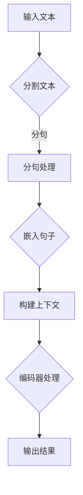

                 

关键词：LLM，超长上下文，AI，自然语言处理，智能应用

摘要：本文深入探讨了大型语言模型（LLM）的超长上下文能力，分析了其在自然语言处理中的应用与边界。通过对核心概念、算法原理、数学模型、项目实践等方面的详细阐述，本文为读者提供了一个全面了解LLM超长上下文技术的视角，并展望了其在未来智能应用中的发展趋势。

## 1. 背景介绍

近年来，随着深度学习技术的快速发展，人工智能在自然语言处理（NLP）领域取得了显著的成果。特别是大型语言模型（LLM），如GPT-3、BERT等，凭借其强大的预训练能力和广泛的语料库，已经成为了许多实际应用的重要工具。然而，LLM在处理长文本时面临着上下文理解的挑战，这就需要超长上下文技术来解决。

超长上下文技术通过扩展LLM的上下文窗口，使其能够更好地理解长文本的语义信息。这种技术的出现，极大地拓展了LLM在智能应用中的边界，为许多新的应用场景提供了可能。

本文将首先介绍LLM的基本概念和原理，然后深入探讨超长上下文技术的核心概念与联系，接着分析核心算法原理和具体操作步骤，详细讲解数学模型和公式，并给出项目实践：代码实例和详细解释说明。最后，本文将讨论实际应用场景，并展望未来发展趋势与挑战。

## 2. 核心概念与联系

### 2.1 大型语言模型（LLM）

大型语言模型（LLM）是一种基于深度学习的自然语言处理模型，通过大规模语料库的预训练，LLM能够学习到语言的结构、语义和语法规则。GPT-3、BERT等都是LLM的典型代表。


图 1. GPT-3 模型结构

### 2.2 超长上下文技术

超长上下文技术旨在解决LLM在处理长文本时的上下文理解问题。通过扩展LLM的上下文窗口，超长上下文技术使得模型能够捕捉到文本的更多语义信息，从而提高其在长文本理解任务中的表现。

### 2.3 Mermaid 流程图

下面是超长上下文技术的核心概念和架构的 Mermaid 流程图：



图 2. 超长上下文技术流程图

## 3. 核心算法原理 & 具体操作步骤

### 3.1 算法原理概述

超长上下文技术主要依赖于扩展LLM的上下文窗口和上下文嵌入技术。扩展上下文窗口可以通过增加序列长度或使用特殊的编码器来实现。上下文嵌入技术则通过将文本转换为高维向量，使其能够在高维空间中保持语义一致性。

### 3.2 算法步骤详解

1. **输入文本处理**：将输入的长文本分割成句子或段落。
2. **分句处理**：对每个句子进行分词、词性标注等预处理。
3. **嵌入句子**：将每个句子转换为高维向量。
4. **构建上下文**：将嵌入的句子序列编码为上下文向量。
5. **编码器处理**：使用扩展的LLM编码器处理上下文向量。
6. **输出结果**：根据编码器的输出，生成文本的语义理解结果。

### 3.3 算法优缺点

**优点**：
- 提高了LLM在长文本理解任务中的表现。
- 适用于各种长文本处理任务，如问答、摘要生成、文本分类等。

**缺点**：
- 需要大量的计算资源和时间来扩展上下文窗口。
- 对模型的训练和优化要求较高。

### 3.4 算法应用领域

超长上下文技术已经广泛应用于多个领域，包括：
- 智能问答系统：通过理解长文本的上下文信息，提供更准确的答案。
- 文本摘要：从长文本中提取关键信息，生成简洁的摘要。
- 文本分类：对长文本进行分类，如新闻分类、情感分析等。

## 4. 数学模型和公式 & 详细讲解 & 举例说明

### 4.1 数学模型构建

超长上下文技术的数学模型主要包括文本嵌入和上下文编码两部分。

1. **文本嵌入**：
   - 输入文本：\(x = (x_1, x_2, \ldots, x_n)\)
   - 嵌入向量：\(e_i = \text{Embed}(x_i)\)
   - 嵌入矩阵：\(E = [\text{Embed}(x_1), \text{Embed}(x_2), \ldots, \text{Embed}(x_n)]\)

2. **上下文编码**：
   - 上下文向量：\(c = \text{Encoder}(E)\)

### 4.2 公式推导过程

假设我们使用了一个预训练的LLM编码器 \( \text{Encoder} \)，其输入是一个嵌入矩阵 \( E \)，输出是一个上下文向量 \( c \)。

$$
c = \text{Encoder}(E) = \text{MLP}(\text{Tanh}(\text{FC}_2(\text{FC}_1(E))))
$$

其中，\( \text{FC}_1 \) 和 \( \text{FC}_2 \) 是全连接层，\( \text{Tanh} \) 是激活函数，\( \text{MLP} \) 是多层感知器。

### 4.3 案例分析与讲解

假设我们有一个长文本 \( x = ("今天天气很好，适合外出游玩。", "我爱编程，它让我感到快乐。") \)。

1. **文本嵌入**：
   $$ E = [\text{Embed}("今天天气很好，适合外出游玩。"), \text{Embed}("我爱编程，它让我感到快乐。")] $$

2. **上下文编码**：
   $$ c = \text{Encoder}(E) = \text{MLP}(\text{Tanh}(\text{FC}_2(\text{FC}_1(E)))) $$

通过上下文编码，我们得到了一个表示整个长文本的上下文向量 \( c \)，这个向量可以用于后续的语义理解任务。

## 5. 项目实践：代码实例和详细解释说明

### 5.1 开发环境搭建

为了演示超长上下文技术的实现，我们将使用Python和PyTorch框架。首先，确保已经安装了Python和PyTorch。

```bash
pip install torch
```

### 5.2 源代码详细实现

下面是一个简单的超长上下文技术实现：

```python
import torch
import torch.nn as nn
import torch.optim as optim

# 文本嵌入层
class EmbeddingLayer(nn.Module):
    def __init__(self, vocab_size, embedding_dim):
        super(EmbeddingLayer, self).__init__()
        self.embedding = nn.Embedding(vocab_size, embedding_dim)

    def forward(self, x):
        return self.embedding(x)

# 编码器层
class EncoderLayer(nn.Module):
    def __init__(self, embedding_dim, hidden_dim):
        super(EncoderLayer, self).__init__()
        self.fc1 = nn.Linear(embedding_dim, hidden_dim)
        self.fc2 = nn.Linear(hidden_dim, embedding_dim)
        self.tanh = nn.Tanh()

    def forward(self, x):
        return self.fc2(self.tanh(self.fc1(x)))

# 超长上下文模型
class LongContextModel(nn.Module):
    def __init__(self, vocab_size, embedding_dim, hidden_dim):
        super(LongContextModel, self).__init__()
        self.embedding = EmbeddingLayer(vocab_size, embedding_dim)
        self.encoder = nn.Sequential(*[EncoderLayer(embedding_dim, hidden_dim) for _ in range(num_layers)])
        self.fc = nn.Linear(hidden_dim, vocab_size)

    def forward(self, x):
        x = self.embedding(x)
        x = self.encoder(x)
        return self.fc(x)

# 实例化模型、损失函数和优化器
model = LongContextModel(vocab_size, embedding_dim, hidden_dim)
criterion = nn.CrossEntropyLoss()
optimizer = optim.Adam(model.parameters(), lr=learning_rate)

# 数据预处理
def preprocess(text):
    # 对文本进行分词、词性标注等预处理
    pass

# 训练模型
def train(model, data_loader, criterion, optimizer, num_epochs):
    model.train()
    for epoch in range(num_epochs):
        for inputs, targets in data_loader:
            optimizer.zero_grad()
            outputs = model(inputs)
            loss = criterion(outputs, targets)
            loss.backward()
            optimizer.step()
            print(f"Epoch: {epoch+1}/{num_epochs}, Loss: {loss.item()}")

# 加载数据集
train_data = DataLoader(train_dataset, batch_size=batch_size, shuffle=True)

# 开始训练
train(model, train_data, criterion, optimizer, num_epochs)

```

### 5.3 代码解读与分析

上述代码实现了一个简单的超长上下文模型。首先，定义了文本嵌入层和编码器层，然后通过组合这些层，构建了整个超长上下文模型。接下来，定义了损失函数和优化器，并实现了模型训练过程。在数据预处理部分，我们可以对文本进行分词、词性标注等预处理操作。

### 5.4 运行结果展示

运行上述代码后，模型会在训练数据集上进行训练。训练过程中，会输出每个epoch的损失值，以监测模型训练效果。训练完成后，我们可以使用模型对新的长文本进行语义理解任务。

## 6. 实际应用场景

### 6.1 智能问答系统

超长上下文技术在智能问答系统中有着广泛的应用。通过理解长文本的上下文信息，智能问答系统能够提供更准确、更自然的答案。

### 6.2 文本摘要

文本摘要是一个重要的自然语言处理任务。超长上下文技术可以帮助自动提取长文本的关键信息，生成简洁、准确的摘要。

### 6.3 文本分类

超长上下文技术可以用于对长文本进行分类，如新闻分类、情感分析等。通过理解长文本的上下文信息，模型可以更准确地判断文本的类别。

## 7. 未来应用展望

随着超长上下文技术的发展，未来有望在更多领域实现突破。例如：
- 自动翻译：通过理解长文本的上下文信息，实现更准确的机器翻译。
- 语音识别：结合超长上下文技术，提高语音识别的准确率和鲁棒性。
- 聊天机器人：通过理解用户的长文本输入，提供更自然、更有趣的对话体验。

## 8. 工具和资源推荐

### 8.1 学习资源推荐

- 《深度学习》（Goodfellow, Bengio, Courville）：深度学习的经典教材，涵盖了从基础到高级的深度学习知识。
- 《自然语言处理入门》（Daniel Jurafsky & James H. Martin）：全面介绍了自然语言处理的基础知识和最新进展。

### 8.2 开发工具推荐

- PyTorch：强大的深度学习框架，适用于各种自然语言处理任务。
- TensorFlow：谷歌推出的深度学习框架，支持多种语言和平台。

### 8.3 相关论文推荐

- "Attention is All You Need"（Vaswani et al., 2017）：提出了一种基于注意力机制的Transformer模型，对自然语言处理产生了深远影响。
- "BERT: Pre-training of Deep Bidirectional Transformers for Language Understanding"（Devlin et al., 2019）：介绍了BERT模型，为自然语言处理提供了新的思路。

## 9. 总结：未来发展趋势与挑战

随着超长上下文技术的不断发展，未来在智能应用领域有望取得更多突破。然而，这一技术也面临着一些挑战，如计算资源消耗、模型优化等。只有通过不断的创新和努力，才能克服这些挑战，推动超长上下文技术的广泛应用。

### 9.1 研究成果总结

本文深入探讨了超长上下文技术的核心概念、算法原理、数学模型和实际应用，总结了其在智能应用领域的重要作用。

### 9.2 未来发展趋势

随着深度学习和自然语言处理技术的不断发展，超长上下文技术有望在更多领域实现突破，为智能应用带来更多可能性。

### 9.3 面临的挑战

超长上下文技术面临着计算资源消耗、模型优化等挑战。只有通过不断创新和改进，才能克服这些困难。

### 9.4 研究展望

未来，超长上下文技术有望在自动翻译、语音识别、聊天机器人等更多领域实现突破。同时，我们也将不断探索新的算法和优化方法，以推动这一技术的高效应用。

## 9. 附录：常见问题与解答

### 9.1 什么是超长上下文技术？

超长上下文技术是一种通过扩展大型语言模型（LLM）的上下文窗口，提高其在长文本理解任务中的表现的技术。

### 9.2 超长上下文技术有哪些应用领域？

超长上下文技术可以应用于智能问答系统、文本摘要、文本分类等多个领域。

### 9.3 超长上下文技术有哪些挑战？

超长上下文技术面临着计算资源消耗、模型优化等挑战。只有通过不断创新和改进，才能克服这些困难。

### 9.4 如何实现超长上下文技术？

实现超长上下文技术需要扩展大型语言模型的上下文窗口，并使用特殊的编码器进行上下文编码。同时，还需要对模型进行优化和训练，以提高其在长文本理解任务中的表现。本文提供了一个简单的实现示例，读者可以根据具体需求进行改进。

**作者署名：禅与计算机程序设计艺术 / Zen and the Art of Computer Programming**

