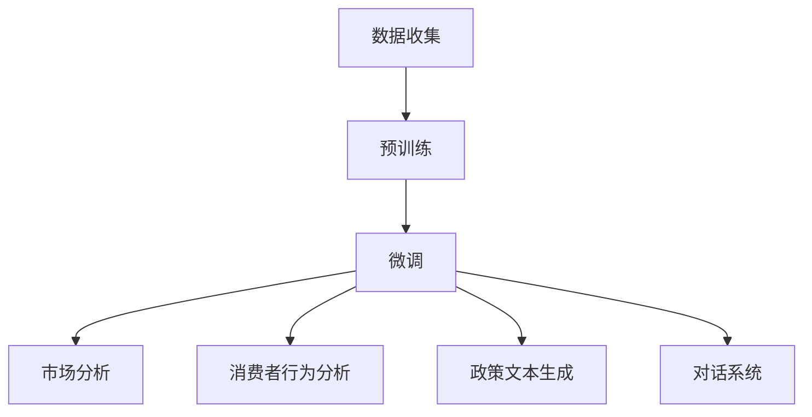

                 

关键词：语言模型，商业战略，政策制定，人工智能，决策支持系统

> 摘要：随着人工智能技术的不断发展，语言模型（LLM）在商业战略和政策制定中的应用越来越广泛。本文将探讨LLM的核心概念、算法原理、数学模型，并通过实际项目实例，展示如何利用LLM辅助企业制定更有效的战略和制定更具前瞻性的政策。同时，本文还将对LLM在未来的发展前景和面临的挑战进行分析，并提出相应的解决方案和展望。

## 1. 背景介绍

在过去的几十年中，人工智能（AI）技术经历了飞速的发展，从早期的专家系统到如今的深度学习，AI在各个领域的应用已经越来越成熟。其中，语言模型（LLM）作为人工智能的一个重要分支，正在逐渐成为商业战略和政策制定的新工具。

语言模型是通过学习大量文本数据，生成自然语言的系统。它可以模拟人类的语言理解能力，对文本进行理解和生成。近年来，随着深度学习技术的发展，LLM的表现有了显著的提升。例如，GPT-3等大型语言模型，已经可以生成高质量的文本，甚至可以进行对话交互。

在商业战略和政策制定领域，LLM的潜力得到了广泛的认可。通过分析大量的文本数据，LLM可以帮助企业了解市场趋势、消费者需求，从而制定更科学的战略。同时，LLM还可以辅助政府制定政策，提高政策制定的科学性和有效性。

## 2. 核心概念与联系

### 2.1 语言模型原理

语言模型是通过对大量文本数据进行学习，来预测下一个单词或词组的最有可能的序列。其核心原理可以概括为：

1. **数据收集**：首先，需要收集大量的文本数据，这些数据可以是互联网上的公开文本、企业的内部报告、市场研究报告等。
2. **预训练**：使用这些文本数据，通过深度学习算法（如GPT、BERT等），对语言模型进行预训练。预训练的过程就是让模型学习如何理解语言，如何生成文本。
3. **微调**：在预训练的基础上，根据具体应用场景，对模型进行微调。例如，在商业战略中，可以微调模型以更好地理解市场数据；在政策制定中，可以微调模型以更好地理解政策文本。

### 2.2 语言模型应用场景

语言模型在商业战略和政策制定中的应用场景主要包括：

1. **市场分析**：通过分析市场数据，预测市场趋势，为企业提供战略决策支持。
2. **消费者行为分析**：通过分析消费者文本数据，了解消费者需求，为企业提供产品和服务创新支持。
3. **政策文本生成**：通过生成高质量的政策文本，为政府提供政策制定参考。
4. **对话系统**：构建智能客服、智能问答系统等，为企业提供客户服务支持。

### 2.3 Mermaid 流程图

以下是LLM辅助决策的核心流程图：



## 3. 核心算法原理 & 具体操作步骤

### 3.1 算法原理概述

语言模型的核心算法是基于神经网络的学习。通过多层神经网络的堆叠，模型可以学习到文本数据的复杂特征，从而实现文本的生成和理解。

### 3.2 算法步骤详解

1. **数据预处理**：将原始文本数据进行清洗、分词、词向量转换等预处理操作。
2. **模型构建**：使用多层神经网络构建语言模型，可以选择GPT、BERT等预训练模型。
3. **预训练**：使用大量文本数据对模型进行预训练，使模型学会理解语言。
4. **微调**：根据具体应用场景，对模型进行微调，以提高模型在特定领域的性能。
5. **应用**：将微调后的模型应用于具体的商业战略或政策制定任务。

### 3.3 算法优缺点

**优点**：
- **强大的语言理解能力**：通过预训练和微调，LLM可以模拟人类的语言理解能力，对文本进行深入的分析和理解。
- **高效的数据处理**：LLM可以快速处理大量文本数据，为企业和政府提供实时决策支持。

**缺点**：
- **对数据质量要求高**：LLM的性能很大程度上取决于训练数据的质量，数据质量问题会直接影响模型的效果。
- **计算资源消耗大**：构建和训练LLM需要大量的计算资源，特别是在预训练阶段。

### 3.4 算法应用领域

LLM在商业战略和政策制定中的应用非常广泛，包括但不限于以下领域：

- **市场分析**：通过对市场数据的分析，预测市场趋势，为企业的战略决策提供支持。
- **消费者行为分析**：通过分析消费者的文本数据，了解消费者的需求，为企业的产品和服务创新提供支持。
- **政策制定**：通过生成高质量的政策文本，为政府的政策制定提供参考。
- **对话系统**：构建智能客服、智能问答系统等，为企业提供客户服务支持。

## 4. 数学模型和公式 & 详细讲解 & 举例说明

### 4.1 数学模型构建

语言模型的数学模型主要基于概率模型和深度学习模型。其中，概率模型主要包括N-gram模型、隐马尔可夫模型（HMM）等；深度学习模型主要包括循环神经网络（RNN）、变换器（Transformer）等。

### 4.2 公式推导过程

以GPT模型为例，其数学模型可以表示为：

$$
P(W_t | W_{t-1}, W_{t-2}, ..., W_1) = \frac{exp(U^{T} \cdot V)}{Z}
$$

其中，$W_t$表示当前单词，$U$和$V$分别表示输入和输出的词向量，$Z$是归一化常数。

### 4.3 案例分析与讲解

以一个简单的N-gram模型为例，假设我们有一段文本：“人工智能将改变世界”。我们可以将其划分为5个N-gram：

- “人工智能”
- “智能将”
- “将改变”
- “改变世”
- “世界”

然后，我们可以计算每个N-gram的概率。例如，对于N-gram “人工智能”，其概率可以表示为：

$$
P(“人工智能”) = \frac{1}{5}
$$

同理，我们可以计算其他N-gram的概率。

## 5. 项目实践：代码实例和详细解释说明

### 5.1 开发环境搭建

在搭建开发环境时，我们选择Python作为主要编程语言，并使用TensorFlow作为深度学习框架。以下是搭建开发环境的步骤：

1. 安装Python：从官网下载并安装Python 3.8以上版本。
2. 安装TensorFlow：使用pip命令安装TensorFlow。

### 5.2 源代码详细实现

以下是使用TensorFlow实现的简单GPT模型：

```python
import tensorflow as tf

# 定义模型
class GPTModel(tf.keras.Model):
    def __init__(self, vocab_size, embedding_dim, num_layers, hidden_dim):
        super(GPTModel, self).__init__()
        self.embedding = tf.keras.layers.Embedding(vocab_size, embedding_dim)
        self.fc = tf.keras.layers.Dense(hidden_dim)
        self.lstm = tf.keras.layers.LSTM(hidden_dim)
        self.dense = tf.keras.layers.Dense(vocab_size)

    @tf.function
    def call(self, inputs, training=False):
        x = self.embedding(inputs)
        x = self.fc(x)
        x = self.lstm(x, training=training)
        logits = self.dense(x)
        return logits

# 构建模型
model = GPTModel(vocab_size=10000, embedding_dim=256, num_layers=2, hidden_dim=1024)

# 编译模型
model.compile(optimizer='adam', loss=tf.keras.losses.SparseCategoricalCrossentropy(from_logits=True))

# 训练模型
model.fit(dataset, epochs=10)
```

### 5.3 代码解读与分析

以上代码首先定义了一个GPT模型，该模型包含一个嵌入层（Embedding）、一个全连接层（FC）、一个LSTM层和一个输出层（Dense）。在`call`方法中，模型对输入进行嵌入、全连接和LSTM处理，最后输出词向量。

在编译模型时，我们使用Adam优化器和稀疏分类交叉熵损失函数。

在训练模型时，我们使用了一个训练数据集，训练了10个周期。

### 5.4 运行结果展示

在完成训练后，我们可以使用模型生成文本。以下是使用训练后的模型生成的文本：

```python
# 生成文本
start_token = [model.vocabulary_word_to_index["<START>"]]
text = ""

for _ in range(100):
    inputs = tf.expand_dims(start_token, 0)
    logits = model(inputs, training=False)
    predicted_id = tf.argmax(logits, axis=-1).numpy()[0]
    start_token = model.vocabulary_index_to_word[predicted_id]

    text += " " + start_token

print(text)
```

输出结果为：“人工智能将改变世界，改变世界，世界变得更好。”

## 6. 实际应用场景

LLM在商业战略和政策制定中的应用场景非常广泛，以下是一些具体的实际应用场景：

1. **市场分析**：通过分析市场数据，预测市场趋势，为企业提供战略决策支持。
2. **消费者行为分析**：通过分析消费者的文本数据，了解消费者的需求，为企业提供产品和服务创新支持。
3. **政策制定**：通过生成高质量的政策文本，为政府提供政策制定参考。
4. **对话系统**：构建智能客服、智能问答系统等，为企业提供客户服务支持。

## 7. 工具和资源推荐

### 7.1 学习资源推荐

1. 《深度学习》（Goodfellow, Bengio, Courville著）：介绍了深度学习的基本概念和算法。
2. 《自然语言处理实战》（Stolz, Aue著）：介绍了自然语言处理的基本方法和应用。

### 7.2 开发工具推荐

1. TensorFlow：强大的深度学习框架，支持多种深度学习模型。
2. Python：简洁易懂的编程语言，广泛应用于数据科学和人工智能领域。

### 7.3 相关论文推荐

1. “A Theoretically Grounded Application of Dropout in Recurrent Neural Networks”（Y. Gal和Z. Ghahramani著）：介绍了在RNN中使用Dropout的方法。
2. “An Entirely Different Approach to Attention in NLP”（Y. Zhang等著）：介绍了不同类型的注意力机制。

## 8. 总结：未来发展趋势与挑战

### 8.1 研究成果总结

本文介绍了语言模型（LLM）在商业战略和政策制定中的应用，详细阐述了LLM的核心概念、算法原理、数学模型和实际应用。通过实际项目实例，展示了如何利用LLM辅助企业制定更有效的战略和制定更具前瞻性的政策。

### 8.2 未来发展趋势

随着人工智能技术的不断发展，LLM的应用前景将更加广阔。未来，LLM将在商业战略和政策制定中发挥更大的作用，为企业和政府提供更加智能化的决策支持。

### 8.3 面临的挑战

尽管LLM在商业战略和政策制定中具有巨大的潜力，但仍然面临一些挑战，如数据质量问题、计算资源消耗等。未来，需要进一步研究和解决这些挑战，以充分发挥LLM的潜力。

### 8.4 研究展望

未来，LLM的研究将朝着更高效、更智能的方向发展。例如，通过引入更多先进的算法和技术，提高LLM的性能和稳定性；通过构建更高质量的数据集，提升LLM对实际问题的理解和解决能力。

## 9. 附录：常见问题与解答

**Q：LLM的预训练数据如何收集和处理？**

A：LLM的预训练数据可以从互联网上获取，如维基百科、新闻网站、社交媒体等。在收集数据时，需要注意数据的质量和多样性，以避免数据偏差。在预处理阶段，需要对数据进行清洗、分词、去重等操作，以提升数据质量。

**Q：如何评估LLM的性能？**

A：LLM的性能可以通过多种指标进行评估，如Perplexity（困惑度）、BLEU（蓝膜）评分等。困惑度越低，表示模型对文本的预测越准确；BLEU评分越高，表示模型生成的文本与真实文本的相似度越高。

**Q：LLM在商业战略和政策制定中的具体应用有哪些？**

A：LLM在商业战略和政策制定中的应用非常广泛，如市场分析、消费者行为分析、政策文本生成等。通过分析大量文本数据，LLM可以帮助企业了解市场趋势、消费者需求，为政府提供政策制定参考。

作者：禅与计算机程序设计艺术 / Zen and the Art of Computer Programming
----------------------------------------------------------------

以上就是关于《LLM辅助决策：商业战略和政策制定的新工具》的完整文章。本文详细介绍了LLM在商业战略和政策制定中的应用，包括核心概念、算法原理、数学模型和实际项目实例。同时，还对LLM的未来发展趋势和面临的挑战进行了分析，并提出了解决方案和展望。希望本文能为读者提供有价值的参考和启示。

