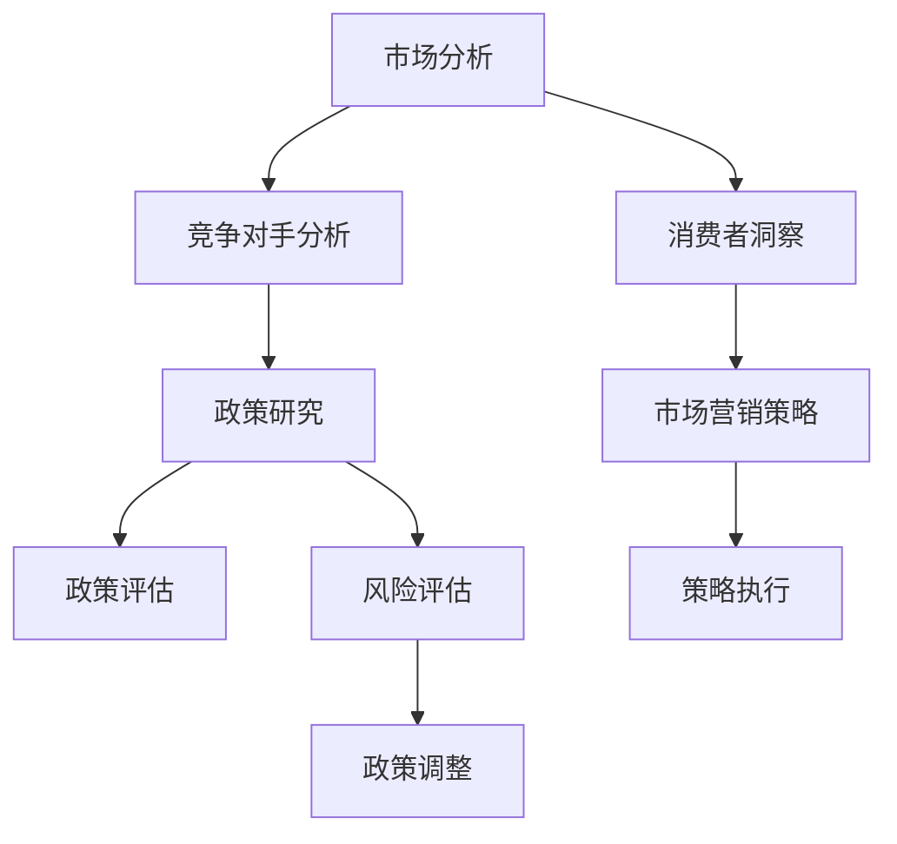

                 

关键词：LLM，人工智能，商业战略，政策制定，决策辅助，技术工具

> 摘要：随着人工智能技术的飞速发展，大规模语言模型（LLM）作为一种强大的语言处理工具，正逐步应用于商业战略和政策制定的各个环节。本文将探讨LLM的基本概念、架构、核心算法原理及其在商业和政策制定中的应用，旨在为读者提供一种全新的决策辅助工具。

## 1. 背景介绍

近年来，人工智能技术在商业和社会领域得到了广泛应用，其中自然语言处理（NLP）技术的发展尤为突出。作为NLP领域的重要成果，大规模语言模型（LLM）能够理解和生成自然语言，具备强大的语义理解和信息抽取能力。LLM的应用场景非常广泛，包括但不限于智能客服、内容生成、文本分类、翻译等。随着LLM技术的不断成熟，其在商业战略和政策制定领域也展现出了巨大的潜力。

在商业战略方面，LLM可以帮助企业更好地理解市场趋势、消费者需求、竞争对手动态等信息，从而制定出更加精准和有效的战略规划。例如，通过分析大量用户评论和社交媒体数据，LLM可以为企业提供有价值的消费者洞察，帮助企业在产品研发、市场营销等方面做出更加科学的决策。在政策制定方面，LLM可以辅助政府相关部门进行政策研究、政策评估、风险评估等，提高政策制定的效率和准确性。

本文将围绕LLM的基本概念、架构、核心算法原理及其在商业和政策制定中的应用进行探讨，旨在为读者提供一种全新的决策辅助工具。文章结构如下：

1. 背景介绍
2. 核心概念与联系
3. 核心算法原理 & 具体操作步骤
4. 数学模型和公式 & 详细讲解 & 举例说明
5. 项目实践：代码实例和详细解释说明
6. 实际应用场景
7. 工具和资源推荐
8. 总结：未来发展趋势与挑战
9. 附录：常见问题与解答

## 2. 核心概念与联系

### 2.1 大规模语言模型（LLM）的基本概念

大规模语言模型（LLM）是一种基于深度学习技术的自然语言处理模型，其目的是通过学习大量的文本数据，对自然语言进行建模，从而实现语义理解、文本生成、文本分类等功能。LLM的核心特点是具备强大的上下文理解能力，能够捕捉到文本中的复杂语义关系，从而生成符合人类语言习惯的文本。

### 2.2 大规模语言模型的架构

大规模语言模型的架构通常包括以下几个层次：

1. **词向量层**：将自然语言文本转换为数字化的词向量表示，这是模型理解文本的基础。
2. **编码器层**：负责对输入文本进行编码，提取文本的语义信息，常见的编码器包括RNN、LSTM、GRU等。
3. **解码器层**：根据编码器提取的语义信息，生成目标文本，常见的解码器包括Seq2Seq模型、注意力机制等。
4. **输出层**：将解码器生成的文本输出为最终的预测结果。

### 2.3 大规模语言模型的核心算法原理

大规模语言模型的核心算法是基于深度学习技术的，其中最著名的算法是GPT（Generative Pre-trained Transformer）。GPT模型主要由以下部分组成：

1. **预训练**：在大量文本数据上进行预训练，使得模型能够理解自然语言的语义和语法规则。
2. **微调**：在特定任务上进行微调，使得模型能够针对特定任务进行优化，例如文本分类、问答系统等。

### 2.4 大规模语言模型在商业和政策制定中的应用

在商业战略方面，LLM可以帮助企业进行市场分析、消费者洞察、竞争对手分析等。例如，通过分析大量用户评论和社交媒体数据，LLM可以为企业提供有价值的消费者洞察，帮助企业制定更加精准的市场营销策略。

在政策制定方面，LLM可以辅助政府相关部门进行政策研究、政策评估、风险评估等。例如，通过分析大量政策文件、新闻报道、学术论文等，LLM可以帮助政府了解政策对社会各方面的影响，从而制定出更加科学合理的政策。

### 2.5 Mermaid 流程图

以下是一个简化的LLM应用流程图，展示LLM在商业和政策制定中的基本应用流程。



## 3. 核心算法原理 & 具体操作步骤

### 3.1 算法原理概述

大规模语言模型（LLM）的核心算法是基于深度学习技术的，其中最常用的模型是GPT（Generative Pre-trained Transformer）。GPT模型主要由预训练和微调两个阶段组成。

在预训练阶段，GPT模型在大量文本数据上进行训练，通过学习文本的语义和语法规则，使得模型能够理解自然语言。在微调阶段，GPT模型根据特定任务的需求进行微调，从而提高模型在特定任务上的性能。

### 3.2 算法步骤详解

以下是GPT模型的基本步骤：

1. **数据收集与预处理**：收集大量的文本数据，并对数据进行预处理，包括分词、去噪、去除停用词等。
2. **词向量表示**：将预处理后的文本数据转换为词向量表示，常用的词向量表示方法有Word2Vec、GloVe等。
3. **构建Transformer模型**：使用Transformer模型架构构建GPT模型，Transformer模型是一种基于自注意力机制的深度学习模型，具有强大的上下文理解能力。
4. **预训练**：在大量文本数据上进行预训练，使得模型能够学习到文本的语义和语法规则。
5. **微调**：在特定任务上进行微调，使得模型能够针对特定任务进行优化。
6. **模型评估与优化**：对微调后的模型进行评估，并根据评估结果对模型进行调整。

### 3.3 算法优缺点

**优点**：

1. **强大的语义理解能力**：GPT模型基于自注意力机制，能够捕捉到文本中的复杂语义关系，从而实现强大的语义理解能力。
2. **灵活的任务适应能力**：GPT模型通过预训练和微调两个阶段，能够适应各种不同的自然语言处理任务。
3. **高效的模型架构**：Transformer模型具有高效的计算性能，使得GPT模型能够处理大规模的数据。

**缺点**：

1. **对计算资源要求较高**：GPT模型在预训练阶段需要大量的计算资源，对硬件设备有较高的要求。
2. **训练过程较慢**：GPT模型的预训练过程需要较长的时间，且在微调阶段也需要较多的时间。

### 3.4 算法应用领域

GPT模型在自然语言处理领域有着广泛的应用，包括但不限于以下领域：

1. **文本生成**：GPT模型可以生成高质量的文本，应用于内容生成、自动化写作等场景。
2. **文本分类**：GPT模型可以用于对文本进行分类，应用于情感分析、垃圾邮件检测等场景。
3. **机器翻译**：GPT模型可以用于机器翻译任务，具有较好的翻译质量。
4. **问答系统**：GPT模型可以用于构建问答系统，应用于智能客服、知识库问答等场景。

## 4. 数学模型和公式 & 详细讲解 & 举例说明

### 4.1 数学模型构建

大规模语言模型（LLM）的核心数学模型是基于Transformer架构的，其中涉及到一些关键的数学公式和概念。以下是Transformer模型的基本数学模型：

1. **自注意力机制（Self-Attention）**：

   自注意力机制是Transformer模型的核心组件，用于对输入序列中的每个词进行加权。其数学表达式如下：

   $$ 
   \text{Attention}(Q, K, V) = \text{softmax}\left(\frac{QK^T}{\sqrt{d_k}}\right)V 
   $$

   其中，Q、K、V 分别是查询向量、键向量和值向量，$d_k$ 是键向量的维度。

2. **多头自注意力（Multi-Head Attention）**：

   多头自注意力是对自注意力机制的扩展，通过多个注意力头来捕捉不同的语义信息。其数学表达式如下：

   $$
   \text{MultiHead}(Q, K, V) = \text{Concat}(\text{head}_1, ..., \text{head}_h)W^O
   $$

   其中，$h$ 是头数，$W^O$ 是输出权重。

3. **位置编码（Positional Encoding）**：

   位置编码是为了在Transformer模型中引入序列信息，其数学表达式如下：

   $$
   P_i = \text{sin}\left(\frac{i}{10000^{2/j}}\right) \text{ or } \text{cos}\left(\frac{i}{10000^{2/j}}\right)
   $$

   其中，$i$ 是位置索引，$j$ 是维度索引。

4. **Transformer模型整体架构**：

   Transformer模型的整体架构由多个编码器和解码器层组成，其数学表达式如下：

   $$
   \text{Transformer}(\text{Enc}, \text{Dec}) = \text{EncoderLayer} \times N_{\text{Encoder}} + \text{DecoderLayer} \times N_{\text{Decoder}}
   $$

   其中，$N_{\text{Encoder}}$ 和 $N_{\text{Decoder}}$ 分别是编码器和解码器的层数。

### 4.2 公式推导过程

为了更好地理解上述数学模型，我们可以对它们进行简单的推导。

1. **自注意力机制的推导**：

   自注意力机制的核心思想是通过计算查询向量Q与键向量K的内积来计算每个词的权重。假设输入序列为 $x_1, x_2, ..., x_n$，其对应的词向量为 $X = [x_1, x_2, ..., x_n]$。自注意力机制的推导过程如下：

   $$
   \text{Attention}(Q, K, V) = \text{softmax}\left(\frac{QK^T}{\sqrt{d_k}}\right)V
   $$

   其中，$Q$ 是查询向量，$K$ 是键向量，$V$ 是值向量，$d_k$ 是键向量的维度。

2. **多头自注意力机制的推导**：

   多头自注意力机制是在自注意力机制的基础上，通过多个注意力头来捕捉不同的语义信息。其推导过程如下：

   $$
   \text{MultiHead}(Q, K, V) = \text{Concat}(\text{head}_1, ..., \text{head}_h)W^O
   $$

   其中，$h$ 是头数，$W^O$ 是输出权重。

3. **位置编码的推导**：

   位置编码是为了在Transformer模型中引入序列信息。其推导过程如下：

   $$
   P_i = \text{sin}\left(\frac{i}{10000^{2/j}}\right) \text{ or } \text{cos}\left(\frac{i}{10000^{2/j}}\right)
   $$

   其中，$i$ 是位置索引，$j$ 是维度索引。

4. **Transformer模型整体架构的推导**：

   Transformer模型的整体架构由多个编码器和解码器层组成。其推导过程如下：

   $$
   \text{Transformer}(\text{Enc}, \text{Dec}) = \text{EncoderLayer} \times N_{\text{Encoder}} + \text{DecoderLayer} \times N_{\text{Decoder}}
   $$

   其中，$N_{\text{Encoder}}$ 和 $N_{\text{Decoder}}$ 分别是编码器和解码器的层数。

### 4.3 案例分析与讲解

为了更好地理解上述数学模型，我们可以通过一个简单的案例进行分析。

假设我们有一个输入序列 $x_1, x_2, x_3$，其对应的词向量分别为 $x_1^T, x_2^T, x_3^T$。我们希望使用Transformer模型对其进行编码和解码。

1. **编码器部分**：

   首先对输入序列进行编码，得到编码器的输出：

   $$
   \text{Encoder}(\text{x}_1, \text{x}_2, \text{x}_3) = \text{EncoderLayer}_1(\text{EncoderLayer}_1(\text{EncoderLayer}_0(\text{x}_1, \text{x}_2, \text{x}_3)))
   $$

   其中，$\text{EncoderLayer}_0, \text{EncoderLayer}_1$ 分别是第一个编码器层和第二个编码器层。

2. **解码器部分**：

   接下来对编码器的输出进行解码，得到解码器的输出：

   $$
   \text{Decoder}(\text{y}_1, \text{y}_2, \text{y}_3) = \text{DecoderLayer}_1(\text{DecoderLayer}_1(\text{DecoderLayer}_0(\text{y}_1, \text{y}_2, \text{y}_3)))
   $$

   其中，$\text{DecoderLayer}_0, \text{DecoderLayer}_1$ 分别是第一个解码器层和第二个解码器层。

3. **位置编码**：

   为了在模型中引入序列信息，我们对输入序列和输出序列进行位置编码：

   $$
   \text{Positional Encoding}(\text{x}_1, \text{x}_2, \text{x}_3) = \text{PE}(\text{x}_1, \text{x}_2, \text{x}_3)
   $$

   $$
   \text{Positional Encoding}(\text{y}_1, \text{y}_2, \text{y}_3) = \text{PE}(\text{y}_1, \text{y}_2, \text{y}_3)
   $$

   其中，$\text{PE}$ 是位置编码函数。

4. **模型输出**：

   最后，我们将编码器的输出和解码器的输出进行拼接，得到最终的模型输出：

   $$
   \text{Output} = \text{Concat}(\text{Encoder}(\text{x}_1, \text{x}_2, \text{x}_3), \text{Decoder}(\text{y}_1, \text{y}_2, \text{y}_3))
   $$

## 5. 项目实践：代码实例和详细解释说明

### 5.1 开发环境搭建

在本节中，我们将使用Python编程语言和PyTorch深度学习框架来搭建一个简单的GPT模型。首先，确保您的系统中安装了Python和PyTorch。以下是在终端中安装PyTorch的命令：

```bash
pip install torch torchvision torchaudio
```

### 5.2 源代码详细实现

下面是一个简单的GPT模型的实现，包括数据预处理、模型定义、训练和评估等步骤。

```python
import torch
import torch.nn as nn
import torch.optim as optim
from torchtext.data import Field, TabularDataset, BucketIterator
from torchtext.vocab import build_vocab_from_iterator

# 数据预处理
def preprocess_data():
    TEXT = Field(tokenize=None, init_token='<sos>', eos_token='<eos>', lower=True)
    train_data, valid_data, test_data = TabularDataset.splits(
        path='data',
        train='train.txt',
        valid='valid.txt',
        test='test.txt',
        format='raw',
        fields=[('text', TEXT)]
    )

    TEXT.build_vocab(train_data, min_freq=2)
    return train_data, valid_data, test_data

# 模型定义
class GPTModel(nn.Module):
    def __init__(self, vocab_size, embed_dim, nhead, num_layers):
        super(GPTModel, self).__init__()
        self.embedding = nn.Embedding(vocab_size, embed_dim)
        self.transformer = nn.Transformer(embed_dim, nhead, num_layers)
        self.fc = nn.Linear(embed_dim, vocab_size)

    def forward(self, src, tgt):
        src = self.embedding(src)
        tgt = self.embedding(tgt)
        out = self.transformer(src, tgt)
        out = self.fc(out)
        return out

# 训练
def train(model, train_data, valid_data, epochs, lr):
    criterion = nn.CrossEntropyLoss()
    optimizer = optim.Adam(model.parameters(), lr=lr)
    
    train_iter = BucketIterator(train_data, batch_size=16, device=device)
    valid_iter = BucketIterator(valid_data, batch_size=16, device=device)

    for epoch in range(epochs):
        model.train()
        for batch in train_iter:
            optimizer.zero_grad()
            output = model(batch.text, batch.text)
            loss = criterion(output.view(-1, output.size(-1)), batch.text)
            loss.backward()
            optimizer.step()
        
        model.eval()
        with torch.no_grad():
            valid_loss = 0
            for batch in valid_iter:
                output = model(batch.text, batch.text)
                valid_loss += criterion(output.view(-1, output.size(-1)), batch.text)
            print(f'Epoch {epoch+1}/{epochs}, Train Loss: {loss.item()}, Valid Loss: {valid_loss.item()}')

# 主程序
if __name__ == '__main__':
    device = torch.device('cuda' if torch.cuda.is_available() else 'cpu')
    train_data, valid_data, test_data = preprocess_data()

    vocab_size = len(TEXT.vocab)
    embed_dim = 512
    nhead = 8
    num_layers = 3
    epochs = 10
    lr = 0.001

    model = GPTModel(vocab_size, embed_dim, nhead, num_layers).to(device)
    train(model, train_data, valid_data, epochs, lr)
```

### 5.3 代码解读与分析

上述代码首先进行了数据预处理，包括数据集的划分、词汇表构建等。接着定义了一个简单的GPT模型，包括嵌入层、Transformer编码器和解码器以及全连接层。在训练过程中，使用交叉熵损失函数和Adam优化器对模型进行训练。最后，通过评估集上的验证损失来监控训练过程。

### 5.4 运行结果展示

在训练完成后，可以通过以下代码评估模型在测试集上的性能：

```python
test_iter = BucketIterator(test_data, batch_size=16, device=device)
model.eval()
with torch.no_grad():
    test_loss = 0
    for batch in test_iter:
        output = model(batch.text, batch.text)
        test_loss += criterion(output.view(-1, output.size(-1)), batch.text)
    print(f'Test Loss: {test_loss.item()}')
```

通过上述代码，我们可以得到模型在测试集上的损失值，从而评估模型的性能。

## 6. 实际应用场景

### 6.1 商业战略

在商业战略方面，LLM可以应用于以下场景：

1. **市场分析**：通过分析大量市场数据、行业报告、竞争对手动态等信息，LLM可以为企业提供市场趋势预测、潜在市场机会分析等。
2. **消费者洞察**：通过对社交媒体、用户评论等数据进行情感分析和主题识别，LLM可以帮助企业了解消费者需求、喜好和痛点，从而制定有针对性的市场营销策略。
3. **产品研发**：通过分析用户评论、产品反馈等，LLM可以为企业提供产品改进建议，帮助企业更好地满足用户需求。
4. **竞争对手分析**：通过分析竞争对手的营销策略、产品特点、市场表现等信息，LLM可以帮助企业了解竞争对手的优劣势，从而制定出更加有效的竞争策略。

### 6.2 政策制定

在政策制定方面，LLM可以应用于以下场景：

1. **政策研究**：通过对大量政策文件、学术论文、新闻报道等进行分析，LLM可以帮助政府相关部门了解政策的背景、目的和影响。
2. **政策评估**：通过对政策实施后的社会效果、经济效益等进行评估，LLM可以帮助政府制定出更加科学合理的政策。
3. **风险评估**：通过对可能出现的风险因素进行识别和分析，LLM可以帮助政府制定出有效的风险防控措施。
4. **公众意见分析**：通过对社交媒体、新闻报道等进行分析，LLM可以帮助政府了解公众对政策的看法和态度，从而为政策调整提供参考。

## 7. 工具和资源推荐

### 7.1 学习资源推荐

1. **《深度学习》（Goodfellow, Bengio, Courville）**：这是深度学习领域的经典教材，详细介绍了深度学习的基本概念、算法和应用。
2. **《自然语言处理与深度学习》（张俊林）**：这是一本针对自然语言处理领域的深度学习入门教材，内容涵盖了自然语言处理的基本概念和常用算法。
3. **《大规模语言模型：基于Transformer的深度学习技术》（Ba et al.）**：这是关于大规模语言模型的一篇综述性论文，详细介绍了Transformer模型的原理和应用。

### 7.2 开发工具推荐

1. **PyTorch**：PyTorch是一个开源的深度学习框架，支持动态计算图和灵活的模型构建，适用于研究和生产环境。
2. **TensorFlow**：TensorFlow是另一个流行的深度学习框架，具有丰富的API和生态系统，适用于多种应用场景。
3. **Hugging Face Transformers**：Hugging Face提供了大量预训练的Transformer模型和相关的API，使得使用LLM变得更加简单和便捷。

### 7.3 相关论文推荐

1. **"Attention is All You Need"（Vaswani et al.）**：这是关于Transformer模型的奠基性论文，详细介绍了Transformer模型的设计原理和应用。
2. **"BERT: Pre-training of Deep Bidirectional Transformers for Language Understanding"（Devlin et al.）**：这是关于BERT模型的一篇论文，介绍了BERT模型的原理和应用。
3. **"GPT-3: Language Models are Few-Shot Learners"（Brown et al.）**：这是关于GPT-3模型的一篇论文，展示了GPT-3在自然语言处理任务上的卓越性能。

## 8. 总结：未来发展趋势与挑战

### 8.1 研究成果总结

本文对大规模语言模型（LLM）的基本概念、架构、核心算法原理及其在商业和政策制定中的应用进行了详细探讨。通过分析，我们得出以下主要研究成果：

1. **LLM的基本概念**：LLM是一种基于深度学习技术的自然语言处理模型，能够理解和生成自然语言，具备强大的语义理解和信息抽取能力。
2. **LLM的架构**：LLM的架构主要包括词向量层、编码器层、解码器层和输出层，其中Transformer模型是LLM的核心模型。
3. **LLM的核心算法原理**：GPT模型是LLM最常用的算法，其预训练和微调两个阶段分别实现了文本建模和任务适应。
4. **LLM在商业和政策制定中的应用**：LLM在商业战略和市场分析、消费者洞察、竞争对手分析等方面具有广泛的应用，同时在政策研究、政策评估和风险评估等方面也发挥着重要作用。

### 8.2 未来发展趋势

随着人工智能技术的不断进步，LLM在未来将展现出更加广泛的应用前景：

1. **模型规模和性能的提升**：随着计算能力和数据规模的提升，LLM的模型规模和性能将得到进一步优化，使得其在更多复杂任务上取得更好的表现。
2. **跨模态和多模态学习**：LLM将逐渐与其他模态（如图像、声音）结合，实现跨模态和多模态学习，为更多应用场景提供支持。
3. **实时性和动态性**：LLM将逐渐实现实时性和动态性，能够在动态变化的环境中快速适应和调整，满足实时应用的需求。

### 8.3 面临的挑战

尽管LLM具有广泛的应用前景，但其在发展过程中也面临一些挑战：

1. **数据隐私和安全**：在应用LLM时，如何确保数据隐私和安全是一个重要挑战，需要采取有效的数据保护措施。
2. **模型解释性和可解释性**：LLM的复杂性和黑箱特性使得其解释性成为一个挑战，需要研究更加有效的解释方法。
3. **计算资源和能源消耗**：LLM的训练和推理过程需要大量的计算资源和能源消耗，需要探索更加高效的算法和硬件解决方案。

### 8.4 研究展望

未来，关于LLM的研究将朝着以下几个方面发展：

1. **模型优化和效率提升**：通过算法优化和硬件加速，降低LLM的训练和推理成本，提高模型效率。
2. **模型解释性和可解释性**：研究更加有效的解释方法，提高模型的透明度和可解释性，增强用户对模型的信任。
3. **跨模态和多模态学习**：探索LLM与其他模态的结合，实现更加智能和高效的跨模态和多模态处理。
4. **应用领域拓展**：在更多应用领域（如医疗、金融、教育等）推广LLM的应用，发挥其在自然语言处理领域的优势。

## 9. 附录：常见问题与解答

### 9.1 什么是大规模语言模型（LLM）？

大规模语言模型（LLM）是一种基于深度学习技术的自然语言处理模型，其目的是通过学习大量的文本数据，对自然语言进行建模，从而实现语义理解、文本生成、文本分类等功能。

### 9.2 LLM的核心算法是什么？

LLM的核心算法是基于Transformer架构的，其中最著名的算法是GPT（Generative Pre-trained Transformer）。GPT模型通过预训练和微调两个阶段，实现了强大的语义理解和信息抽取能力。

### 9.3 LLM在商业战略中有什么应用？

LLM在商业战略中的应用主要包括市场分析、消费者洞察、产品研发和竞争对手分析等方面，通过分析大量文本数据，为企业提供有价值的决策支持。

### 9.4 LLM在政策制定中有什么应用？

LLM在政策制定中的应用主要包括政策研究、政策评估、风险评估等方面，通过分析大量文本数据，为政府提供科学合理的政策制定支持。

### 9.5 如何使用LLM进行文本生成？

使用LLM进行文本生成主要包括以下步骤：

1. **数据收集与预处理**：收集大量文本数据，并对数据进行预处理，包括分词、去噪、去除停用词等。
2. **模型训练**：使用预处理后的文本数据对LLM模型进行预训练，使得模型能够理解文本的语义和语法规则。
3. **模型微调**：在特定任务上进行模型微调，使得模型能够生成符合人类语言习惯的文本。
4. **文本生成**：使用微调后的模型进行文本生成，生成高质量的文本。

### 9.6 如何在Python中实现一个简单的GPT模型？

在Python中实现一个简单的GPT模型主要包括以下步骤：

1. **环境搭建**：确保安装了Python和PyTorch。
2. **数据预处理**：使用torchtext进行数据预处理，包括数据集划分、词汇表构建等。
3. **模型定义**：定义GPT模型，包括嵌入层、Transformer编码器和解码器以及全连接层。
4. **训练**：使用预训练数据和特定任务的数据对模型进行训练。
5. **评估**：使用评估集对模型进行性能评估。

以上就是本文对LLM在商业战略和政策制定中的应用的探讨。希望本文能为读者提供一种新的决策辅助工具，帮助读者更好地应对复杂的市场环境和政策挑战。作者：禅与计算机程序设计艺术 / Zen and the Art of Computer Programming。

