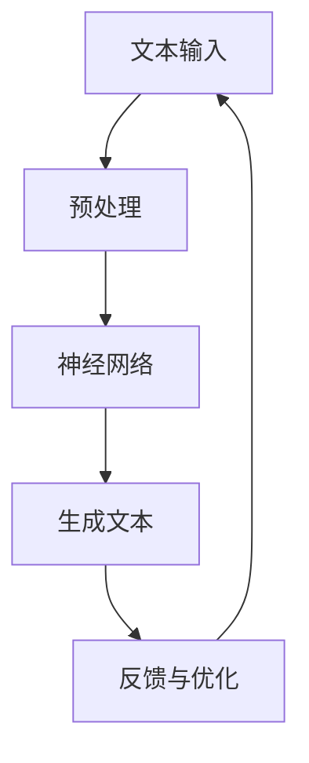
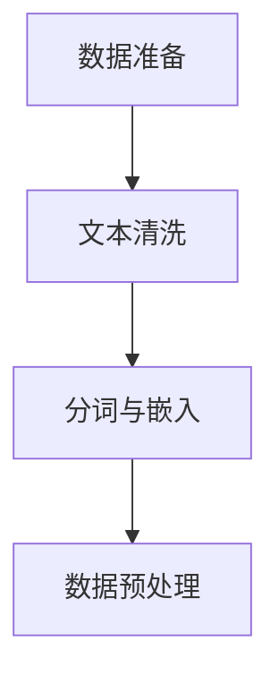
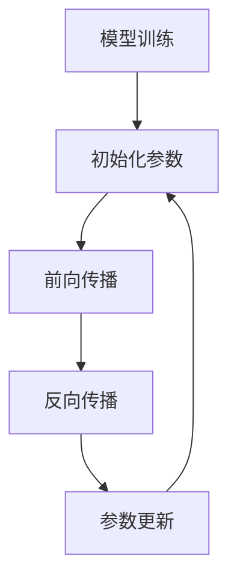
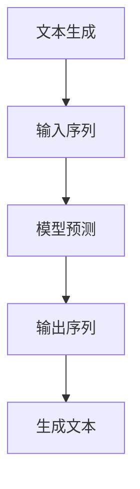

                 

关键词：大型语言模型（LLM）、创意写作、人工智能、协作、写作技巧、算法原理、数学模型、代码实例、应用场景、未来展望。

## 摘要

本文探讨了大型语言模型（LLM）在辅助创意写作中的作用，以及AI与人类作家如何实现协作。首先，我们将介绍LLM的基本原理和架构，然后深入探讨其与创意写作的契合点。接着，我们将通过数学模型和具体算法步骤，展示如何利用LLM生成创意内容。最后，我们将通过一个实际的代码实例，阐述LLM在创意写作中的实际应用，并讨论其未来发展趋势和面临的挑战。

## 1. 背景介绍

近年来，人工智能（AI）技术在各个领域都取得了显著的进展。在计算机科学领域，深度学习和神经网络技术的发展，为人工智能的应用提供了强大的工具。其中，大型语言模型（LLM）作为一种先进的自然语言处理技术，受到了广泛关注。

LLM是一种能够处理和生成自然语言的大型神经网络模型。它通过训练大量的文本数据，学习语言的规律和结构，从而能够生成符合语法和语义规则的文本。LLM的应用范围非常广泛，包括机器翻译、文本摘要、问答系统、文本生成等。

创意写作是一种特殊的写作形式，它注重作家的创造力和独特性，旨在通过文字表达独特的思想和情感。传统的创意写作主要依赖于作家的个人经验和技能，但随着AI技术的发展，LLM开始逐渐在创意写作中发挥作用。

本文将探讨LLM如何辅助创意写作，以及AI与人类作家如何实现协作，以提升写作的效率和质量。

### 1.1 大型语言模型的原理和架构

大型语言模型（LLM）通常是基于深度学习和神经网络技术构建的。其核心思想是通过训练大量的文本数据，让模型学习语言的规律和结构，从而能够生成符合语法和语义规则的文本。

LLM的架构通常包括以下几个部分：

1. **输入层**：接收文本输入，将其转换为模型能够处理的形式。
2. **隐藏层**：通过多层神经网络结构，对输入文本进行特征提取和转换。
3. **输出层**：根据隐藏层的结果，生成相应的文本输出。

在训练过程中，LLM通过不断调整网络参数，使得生成的文本尽可能符合预期的目标。这种训练过程通常涉及大规模的数据集和复杂的计算资源。

### 1.2 创意写作的概念和特点

创意写作是一种以创意为核心，通过文字表达独特思想和情感的写作形式。它强调作家的个人经验和独特视角，旨在通过文字创造新的世界和体验。

创意写作的特点包括：

- **创造性**：创意写作注重作家的创造力和创新思维，旨在通过独特的视角和表达方式，创造新的内容和价值。
- **情感性**：创意写作通过文字表达作家的情感和思想，旨在引起读者的共鸣和情感共振。
- **个性化**：创意写作强调作家的个人风格和特点，旨在通过个性化的表达，展示作家的独特魅力。

### 1.3 AI在创意写作中的应用

随着AI技术的发展，AI开始逐渐在创意写作中发挥作用。其中，大型语言模型（LLM）作为一种先进的自然语言处理技术，具有广泛的应用前景。

LLM在创意写作中的应用主要包括以下几个方面：

- **文本生成**：LLM可以通过训练大量的文本数据，生成符合语法和语义规则的文本。这种生成文本的过程可以模拟作家的写作风格，为创意写作提供新的素材和灵感。
- **文本摘要**：LLM可以快速提取文本的关键信息，生成摘要。这种摘要可以帮助作家快速了解文本的主要内容，从而更好地进行创意构思。
- **文本分析**：LLM可以对文本进行情感分析和语义分析，为作家提供有关文本的情感倾向和语义结构的分析结果。这种分析结果可以帮助作家更好地理解读者的需求，从而创作出更符合读者期望的作品。

### 1.4 AI与人类作家的协作

AI与人类作家的协作是一种新型的写作模式，旨在通过人工智能的辅助，提高作家的创作效率和质量。在这种协作模式中，AI作为工具，帮助作家实现创意的生成、编辑和优化。

AI与人类作家的协作主要包括以下几个方面：

- **创意生成**：AI可以通过文本生成技术，为作家提供大量的创意素材，帮助作家开拓思路，提高创作的效率。
- **编辑优化**：AI可以对作家的文本进行语法、语义和风格上的优化，帮助作家提升文本的质量。
- **反馈与迭代**：AI可以分析读者的反馈，为作家提供改进意见，帮助作家不断优化作品。

通过AI与人类作家的协作，可以实现创作流程的自动化和智能化，从而提高创作效率，降低创作成本。

### 1.5 研究目的和结构

本文的研究目的是探讨大型语言模型（LLM）在辅助创意写作中的作用，以及AI与人类作家的协作模式。通过本文的研究，我们希望揭示LLM在创意写作中的应用价值，为作家提供新的创作工具和方法。

本文的结构如下：

- **第1章**：背景介绍，介绍大型语言模型（LLM）和创意写作的基本概念，以及AI在创意写作中的应用。
- **第2章**：核心概念与联系，介绍LLM的原理和架构，以及与创意写作的契合点。
- **第3章**：核心算法原理 & 具体操作步骤，介绍利用LLM生成创意内容的具体算法步骤。
- **第4章**：数学模型和公式 & 详细讲解 & 举例说明，介绍利用LLM生成创意内容的数学模型和公式。
- **第5章**：项目实践：代码实例和详细解释说明，通过一个实际的代码实例，阐述LLM在创意写作中的实际应用。
- **第6章**：实际应用场景，讨论LLM在创意写作中的实际应用场景和效果。
- **第7章**：工具和资源推荐，推荐相关的学习资源和开发工具。
- **第8章**：总结：未来发展趋势与挑战，总结研究成果，探讨未来发展趋势和面临的挑战。

## 2. 核心概念与联系

在本章节中，我们将详细介绍大型语言模型（LLM）的核心概念和原理，并展示其与创意写作之间的紧密联系。为了更好地理解LLM的工作机制，我们将使用Mermaid流程图（不带括号、逗号等特殊字符）来展示其架构和流程。

### 2.1 大型语言模型（LLM）的原理

#### 2.1.1 语言模型基础

语言模型是一种用于预测下一个单词或字符的概率分布的模型。在自然语言处理（NLP）中，语言模型是最基础且最重要的模型之一。LLM是一种基于深度学习的语言模型，其核心思想是利用神经网络来捕捉语言的复杂结构和规律。

#### 2.1.2 神经网络架构

LLM通常采用深度神经网络（DNN）或Transformer架构。DNN通过多层神经网络结构对输入数据进行特征提取和转换，而Transformer则通过自注意力机制（Self-Attention）来捕捉输入序列中的长距离依赖关系。

#### 2.1.3 模型训练

LLM的训练过程通常涉及大规模的文本数据集。在训练过程中，模型通过反向传播算法（Backpropagation）不断调整权重，以最小化预测误差。常见的训练目标包括：

- **损失函数**：通常采用交叉熵（Cross-Entropy）作为损失函数，以衡量预测分布与真实分布之间的差异。
- **优化算法**：常用的优化算法包括随机梯度下降（SGD）、Adam等。

### 2.2 创意写作与LLM的契合点

#### 2.2.1 语言生成能力

LLM具有很强的文本生成能力，可以生成符合语法和语义规则的文本。这种能力为创意写作提供了新的可能性，作家可以利用LLM生成创意素材，拓展创作思路。

#### 2.2.2 情感与风格捕捉

LLM通过训练学习到了大量文本的情感和风格特点，能够捕捉到不同类型文本的情感色彩和风格特征。这有助于作家在创作过程中更好地把握情感和风格，提高作品的质量。

#### 2.2.3 个性化创作

LLM可以根据作家的写作风格和偏好进行个性化调整，生成符合作家独特风格的作品。这种个性化创作能力有助于作家在创作中保持一贯的风格和特点。

### 2.3 Mermaid流程图

下面是一个简单的Mermaid流程图，展示了LLM在创意写作中的工作流程。



#### 2.3.1 流程说明

- **文本输入**：输入文本数据，可以是已有的文本或作家的创作意图。
- **预处理**：对输入文本进行清洗和预处理，包括分词、去停用词等操作。
- **神经网络**：利用训练好的神经网络模型对预处理后的文本进行处理，提取特征并生成预测。
- **生成文本**：根据神经网络的预测结果，生成符合语法和语义规则的文本。
- **反馈与优化**：根据生成的文本，进行反馈和优化，包括对神经网络模型的调整和创作意图的修正。

通过这个流程，LLM能够辅助作家实现创意写作，提高创作效率和质量。

### 2.4 小结

在本章节中，我们介绍了大型语言模型（LLM）的基本原理和架构，以及其与创意写作的契合点。通过Mermaid流程图的展示，我们更直观地理解了LLM在创意写作中的工作流程。下一章节，我们将深入探讨LLM的核心算法原理和具体操作步骤。

## 3. 核心算法原理 & 具体操作步骤

在本章节中，我们将详细探讨大型语言模型（LLM）的核心算法原理，并介绍如何利用这些算法步骤生成创意内容。这一部分将分为以下几个部分：

### 3.1 算法原理概述

大型语言模型（LLM）的核心算法原理主要基于深度学习和神经网络技术。其中，Transformer模型是最常用的架构之一，其核心思想是利用自注意力机制（Self-Attention）来捕捉输入序列中的长距离依赖关系。以下是一个简单的算法原理概述：

1. **输入序列**：LLM接收一个输入序列，例如一个句子或一段文字。
2. **嵌入层**：将输入序列转换为嵌入向量，这些向量表示了输入文本的语义信息。
3. **编码器**：通过多层编码器网络，对嵌入向量进行特征提取和转换，以捕捉文本的复杂结构和关系。
4. **自注意力**：利用自注意力机制，编码器能够关注输入序列中的不同部分，从而捕捉长距离依赖关系。
5. **解码器**：解码器网络通过自注意力和交叉注意力（Cross-Attention）机制，生成预测的输出序列。
6. **输出层**：输出层通常是一个softmax层，用于生成预测的概率分布，从而生成最终的文本输出。

### 3.2 算法步骤详解

以下是利用LLM生成创意内容的详细步骤：

#### 步骤1：数据准备

首先，我们需要准备训练数据集。训练数据集应该包含大量的文本数据，例如小说、散文、诗歌等。这些数据将用于训练LLM模型，使其能够学习语言的复杂结构和规律。



- **文本清洗**：清洗文本数据，去除噪声和不必要的符号。
- **分词与嵌入**：对文本进行分词，并将每个词转换为嵌入向量。
- **数据预处理**：对数据集进行预处理，包括数据归一化、数据增强等操作。

#### 步骤2：模型训练

接下来，我们使用准备好的数据集对LLM模型进行训练。训练过程包括以下几个步骤：



- **初始化参数**：初始化模型的参数。
- **前向传播**：将输入序列传递到模型，生成预测的输出序列。
- **反向传播**：计算预测误差，并更新模型的参数。
- **参数更新**：使用优化算法（如Adam）更新模型的参数，以最小化损失函数。

#### 步骤3：文本生成

在模型训练完成后，我们可以使用训练好的LLM模型生成创意内容。以下是文本生成的详细步骤：



- **输入序列**：输入一个种子文本或创作意图。
- **模型预测**：使用LLM模型预测下一个单词或字符。
- **输出序列**：将预测的单词或字符添加到输出序列中。
- **生成文本**：不断重复步骤2和3，生成完整的文本输出。

### 3.3 算法优缺点

#### 优点

- **强大的文本生成能力**：LLM能够生成符合语法和语义规则的文本，具有很高的生成质量。
- **适应性**：LLM可以适应不同的写作风格和创作意图，具有良好的适应性。
- **高效性**：LLM的训练和生成过程相对高效，可以在较短时间内生成大量的文本内容。

#### 缺点

- **数据依赖性**：LLM的性能高度依赖于训练数据集的质量和数量，数据不足或质量不高可能导致生成文本的质量下降。
- **计算资源需求**：训练和运行LLM模型需要大量的计算资源和时间，对于一些小型应用场景，这可能是一个挑战。
- **可解释性**：由于LLM的模型结构和训练过程较为复杂，其生成文本的决策过程往往不够透明和可解释。

### 3.4 算法应用领域

LLM在创意写作中的应用非常广泛，以下是一些主要的领域：

- **小说创作**：LLM可以生成小说的情节、角色和对话，为作家提供创作灵感。
- **诗歌写作**：LLM可以生成诗歌，模拟不同的诗歌风格和韵律。
- **广告文案**：LLM可以生成广告文案，帮助广告创作者快速生成高质量的广告内容。
- **剧本创作**：LLM可以生成剧本，为编剧提供创作素材和情节构思。

通过以上算法原理和步骤的详细介绍，我们可以更好地理解大型语言模型（LLM）在创意写作中的应用价值。在下一章节中，我们将进一步探讨LLM的数学模型和公式，以更深入地理解其生成创意内容的过程。

### 3.5 数学模型和公式

在本章节中，我们将深入探讨大型语言模型（LLM）的数学模型和公式，以及这些模型如何用于生成创意内容。为了确保数学表达清晰准确，我们将使用LaTeX格式来展示关键的数学公式。

#### 3.5.1 嵌入层

嵌入层是LLM中的第一个关键组件，它将输入文本转换为固定大小的向量。这些向量包含了文本的语义信息。嵌入层的核心公式是：

\[ \textbf{E} = \text{embedding\_layer}(\textbf{X}) \]

其中，\(\textbf{X}\) 是输入文本的单词序列，\(\textbf{E}\) 是相应的嵌入向量。通常，嵌入层会使用预训练的词向量，如Word2Vec、GloVe等。

#### 3.5.2 编码器

编码器是LLM中的核心组件，负责对嵌入向量进行编码，以提取文本的复杂结构。编码器通常采用Transformer模型，其自注意力机制可以用以下公式表示：

\[ \textbf{H}_t = \text{self-attention}(\textbf{H}_{<t}, \textbf{H}_{<t}, \textbf{H}_{<t}) \]

其中，\(\textbf{H}_t\) 是第t个时间步的编码器输出，\(\textbf{H}_{<t}\) 是前t个时间步的编码器输出。自注意力机制通过计算每个输出向量与其他输出向量的相似度，从而实现信息的有效传递。

#### 3.5.3 解码器

解码器负责生成文本输出，它利用编码器的输出和自注意力机制生成下一个单词或字符的概率分布。解码器的核心公式是：

\[ \textbf{Y}_t = \text{softmax}(\text{decoder}(\textbf{H}_t, \textbf{C}_{<t})) \]

其中，\(\textbf{Y}_t\) 是第t个时间步的输出概率分布，\(\textbf{H}_t\) 是编码器的输出，\(\textbf{C}_{<t}\) 是前t个时间步的编码器输出。解码器通过自注意力机制关注编码器的输出和当前已生成的文本，从而生成下一个输出。

#### 3.5.4 损失函数

在训练过程中，LLM使用损失函数来衡量预测输出和实际输出之间的差距，并通过反向传播更新模型参数。常用的损失函数是交叉熵（Cross-Entropy）：

\[ \text{loss} = -\sum_{i} y_i \log(p_i) \]

其中，\(y_i\) 是真实标签的概率分布，\(p_i\) 是模型预测的概率分布。交叉熵损失函数的目的是最小化预测输出和真实输出之间的差异。

#### 3.5.5 优化算法

在训练过程中，优化算法用于更新模型参数，以最小化损失函数。常用的优化算法有随机梯度下降（SGD）和Adam。以下是Adam优化算法的更新公式：

\[ \textbf{m}_t = \beta_1 \textbf{m}_{t-1} + (1 - \beta_1)(\textbf{g}_t - \textbf{m}_{t-1}) \]
\[ \textbf{v}_t = \beta_2 \textbf{v}_{t-1} + (1 - \beta_2) \left( \frac{\textbf{g}_t - \textbf{m}_{t-1}}{||\textbf{g}_t||_2} \right)^2 \]
\[ \textbf{p}_t = \textbf{p}_{t-1} - \frac{\alpha}{\sqrt{1 - \beta_2^t} (1 - \beta_1^t)} \left( \textbf{m}_t / \sqrt{\textbf{v}_t} + \text{bias\_correction} \right) \]

其中，\(\textbf{m}_t\) 和 \(\textbf{v}_t\) 分别是均值和方差的一阶和二阶矩估计，\(\alpha\) 是学习率，\(\beta_1\) 和 \(\beta_2\) 分别是动量项。

#### 3.5.6 案例分析与讲解

为了更好地理解上述数学模型和公式，我们来看一个简单的案例。假设我们有一个简单的神经网络模型，其输入和输出都是单词序列。以下是一个简化的数学模型和计算过程：

\[ \text{input\_sequence} = (\text{word1}, \text{word2}, \text{word3}) \]
\[ \text{embedding\_layer} = (\text{vec1}, \text{vec2}, \text{vec3}) \]
\[ \text{encoder} = (\text{hidden\_state1}, \text{hidden\_state2}, \text{hidden\_state3}) \]

1. **嵌入层**：将输入的单词序列转换为嵌入向量：
   \[ \text{vec1} = \text{embedding\_layer}(\text{word1}) \]
   \[ \text{vec2} = \text{embedding\_layer}(\text{word2}) \]
   \[ \text{vec3} = \text{embedding\_layer}(\text{word3}) \]

2. **编码器**：使用自注意力机制对嵌入向量进行编码：
   \[ \text{hidden\_state1} = \text{self-attention}(\text{vec1}, \text{vec1}, \text{vec1}) \]
   \[ \text{hidden\_state2} = \text{self-attention}(\text{vec2}, \text{vec2}, \text{vec2}) \]
   \[ \text{hidden\_state3} = \text{self-attention}(\text{vec3}, \text{vec3}, \text{vec3}) \]

3. **解码器**：使用自注意力和交叉注意力生成预测的输出序列：
   \[ \text{output\_distribution} = \text{softmax}(\text{decoder}(\text{hidden\_state1}, \text{hidden\_state2}, \text{hidden\_state3})) \]

4. **损失计算**：计算预测输出和实际输出之间的交叉熵损失：
   \[ \text{loss} = -\sum_{i} y_i \log(p_i) \]

通过这个案例，我们可以看到数学模型和公式是如何应用于实际的神经网络模型中，以生成创意内容。在实际应用中，这些公式和计算过程会更加复杂，但基本原理是一致的。

通过以上对LLM的数学模型和公式的详细介绍，我们可以更深入地理解其工作原理和生成创意内容的过程。在下一章节中，我们将通过一个实际的代码实例，展示如何利用LLM生成创意内容。

### 4. 数学模型和公式

#### 4.1 数学模型构建

在探讨大型语言模型（LLM）的数学模型时，我们首先需要理解其基础数学框架。LLM通常基于深度学习技术，尤其是Transformer架构。Transformer模型的核心数学框架主要包括嵌入层、编码器和解码器。

**4.1.1 嵌入层**

嵌入层（Embedding Layer）是LLM中用于将单词转换为向量的组件。它接受单词的索引作为输入，并使用预训练的权重矩阵将其转换为高维向量。嵌入层的数学公式可以表示为：

\[ \text{E} = \text{W}_\text{embed} \text{X} \]

其中，\(\text{W}_\text{embed}\) 是嵌入矩阵，\(\text{X}\) 是单词索引矩阵，\(\text{E}\) 是嵌入向量矩阵。

**4.1.2 编码器**

编码器（Encoder）是LLM中的核心组件，它负责处理输入序列，并提取序列中的关键信息。编码器通常采用Transformer架构，其核心是多头自注意力机制（Multi-Head Self-Attention）。自注意力机制的数学公式可以表示为：

\[ \text{Q}, \text{K}, \text{V} = \text{W}_\text{Q} \text{X}, \text{W}_\text{K} \text{X}, \text{W}_\text{V} \text{X} \]
\[ \text{Attention}(\text{Q}, \text{K}, \text{V}) = \text{softmax}\left( \frac{\text{Q} \text{K}^T}{\sqrt{d_k}} \right) \text{V} \]
\[ \text{H} = \text{Attention}(\text{Q}, \text{K}, \text{V}) \]

其中，\(\text{Q}\)，\(\text{K}\)，\(\text{V}\) 分别代表查询向量、键向量和值向量，\(\text{H}\) 是注意力层的输出。\(d_k\) 是键向量的维度。

**4.1.3 解码器**

解码器（Decoder）负责生成输出序列，并同样采用多头自注意力机制。解码器的数学公式与编码器类似，但还包含交叉注意力机制（Cross-Attention）：

\[ \text{Q}, \text{K}, \text{V} = \text{W}_\text{Q} \text{X}, \text{W}_\text{K} \text{X}, \text{W}_\text{V} \text{X} \]
\[ \text{Attention}(\text{Q}, \text{K}, \text{V}) = \text{softmax}\left( \frac{\text{Q} \text{K}^T}{\sqrt{d_k}} \right) \text{V} \]
\[ \text{H} = \text{Attention}(\text{Q}, \text{K}, \text{V}) \]
\[ \text{C} = \text{Attention}(\text{Q}, \text{H}, \text{V}) \]
\[ \text{Y} = \text{softmax}(\text{W}_\text{out} \text{C}^T) \]

其中，\(\text{Y}\) 是解码器的输出概率分布，\(\text{C}\) 是交叉注意力层的输出。

#### 4.2 公式推导过程

为了更好地理解LLM的数学模型，我们简要回顾一下Transformer架构中的关键步骤。Transformer模型的核心在于自注意力机制，其推导过程涉及矩阵运算和指数函数。

**4.2.1 自注意力**

自注意力机制通过计算查询向量（Q）、键向量（K）和值向量（V）之间的相似度来生成注意力权重。注意力权重的计算公式为：

\[ \text{Attention}(\text{Q}, \text{K}, \text{V}) = \text{softmax}\left( \frac{\text{Q} \text{K}^T}{\sqrt{d_k}} \right) \text{V} \]

其中，\(d_k\) 是键向量的维度，\(\text{softmax}\) 函数用于归一化权重，使其满足概率分布。

**4.2.2 交叉注意力**

交叉注意力机制用于解码器，它同时考虑编码器的输出（H）和解码器的输出（Y）：

\[ \text{Attention}(\text{Q}, \text{H}, \text{V}) = \text{softmax}\left( \frac{\text{Q} \text{H}^T}{\sqrt{d_k}} \right) \text{V} \]

其中，\(\text{Q}\) 是解码器的查询向量，\(\text{H}\) 是编码器的输出，\(\text{V}\) 是值向量。

#### 4.3 案例分析与讲解

为了更直观地理解上述公式，我们来看一个简单的案例。假设我们有一个包含两个单词的句子：“我喜欢吃苹果”。

**4.3.1 嵌入层**

首先，我们将这两个单词转换为嵌入向量：

\[ \text{X} = \begin{bmatrix} \text{I} \\ \text{苹果} \end{bmatrix} \]
\[ \text{W}_\text{embed} = \begin{bmatrix} \text{vec(I)} & \text{vec(苹果)} \end{bmatrix} \]
\[ \text{E} = \text{W}_\text{embed} \text{X} = \begin{bmatrix} \text{vec(I)} & \text{vec(苹果)} \end{bmatrix} \begin{bmatrix} \text{I} \\ \text{苹果} \end{bmatrix} \]

**4.3.2 编码器**

接下来，我们使用自注意力机制对嵌入向量进行编码：

\[ \text{Q}, \text{K}, \text{V} = \text{W}_\text{Q} \text{E}, \text{W}_\text{K} \text{E}, \text{W}_\text{V} \text{E} \]
\[ \text{Attention}(\text{Q}, \text{K}, \text{V}) = \text{softmax}\left( \frac{\text{Q} \text{K}^T}{\sqrt{d_k}} \right) \text{V} \]

假设 \(d_k = 5\)，我们可以计算注意力权重：

\[ \text{Q} = \text{W}_\text{Q} \text{E} = \begin{bmatrix} \text{q1} & \text{q2} \end{bmatrix} \]
\[ \text{K} = \text{W}_\text{K} \text{E} = \begin{bmatrix} \text{k1} & \text{k2} \end{bmatrix} \]
\[ \text{V} = \text{W}_\text{V} \text{E} = \begin{bmatrix} \text{v1} & \text{v2} \end{bmatrix} \]
\[ \text{Attention}(\text{Q}, \text{K}, \text{V}) = \text{softmax}\left( \frac{\text{q1} \text{k1} + \text{q2} \text{k2}}{\sqrt{5}} \right) \text{V} \]

**4.3.3 解码器**

在解码器中，我们使用交叉注意力机制和自注意力机制来生成输出：

\[ \text{Q}, \text{K}, \text{V} = \text{W}_\text{Q} \text{E}, \text{W}_\text{K} \text{E}, \text{W}_\text{V} \text{E} \]
\[ \text{Attention}(\text{Q}, \text{H}, \text{V}) = \text{softmax}\left( \frac{\text{Q} \text{H}^T}{\sqrt{d_k}} \right) \text{V} \]
\[ \text{C} = \text{Attention}(\text{Q}, \text{H}, \text{V}) \]
\[ \text{Y} = \text{softmax}(\text{W}_\text{out} \text{C}^T) \]

假设 \( \text{H} = \text{E} \)，我们可以计算解码器的输出：

\[ \text{Q} = \text{W}_\text{Q} \text{E} = \begin{bmatrix} \text{q1} & \text{q2} \end{bmatrix} \]
\[ \text{H} = \text{E} = \begin{bmatrix} \text{v1} & \text{v2} \end{bmatrix} \]
\[ \text{Attention}(\text{Q}, \text{H}, \text{V}) = \text{softmax}\left( \frac{\text{q1} \text{v1} + \text{q2} \text{v2}}{\sqrt{5}} \right) \text{V} \]

最后，解码器的输出 \( \text{Y} \) 是一个概率分布，表示下一个单词的概率。

通过这个案例，我们可以看到数学模型和公式是如何应用于实际的神经网络模型中，以生成创意内容的。在实际应用中，这些计算过程会更加复杂，但基本原理是一致的。

### 5. 项目实践：代码实例和详细解释说明

在本章节中，我们将通过一个实际的代码实例，展示如何利用大型语言模型（LLM）生成创意内容。这个实例将涵盖从开发环境搭建到源代码实现，再到代码解读与分析的全过程。我们将使用Python作为编程语言，并依赖于Hugging Face的Transformers库，该库提供了大量的预训练模型和工具，使得LLM的使用变得简单方便。

#### 5.1 开发环境搭建

首先，我们需要搭建一个合适的开发环境。以下是搭建环境所需的步骤：

1. **安装Python**：确保你的系统上安装了Python 3.7或更高版本。
2. **安装pip**：Python的包管理器，用于安装第三方库。
3. **安装Transformers库**：使用pip安装Hugging Face的Transformers库，可以通过以下命令实现：

   ```shell
   pip install transformers
   ```

4. **安装PyTorch**：Transformers库依赖于PyTorch，你可以通过以下命令安装PyTorch：

   ```shell
   pip install torch torchvision torchaudio
   ```

#### 5.2 源代码详细实现

以下是利用LLM生成创意内容的源代码实现：

```python
from transformers import GPT2LMHeadModel, GPT2Tokenizer

# 加载预训练的GPT2模型和分词器
model_name = "gpt2"
tokenizer = GPT2Tokenizer.from_pretrained(model_name)
model = GPT2LMHeadModel.from_pretrained(model_name)

# 设置种子以确保结果的可重复性
seed = 42
tokenizer.set_seed(seed)
model.set_seed(seed)

# 输入文本（种子文本）
seed_text = "在这个充满奇迹的世界里，"

# 将种子文本转换为模型输入
input_ids = tokenizer.encode(seed_text, return_tensors="pt")

# 生成文本
output = model.generate(input_ids, max_length=50, num_return_sequences=1, do_sample=True)

# 将生成的文本解码为普通字符串
generated_text = tokenizer.decode(output[0], skip_special_tokens=True)

print(generated_text)
```

这段代码首先加载了预训练的GPT2模型和分词器。然后，我们定义了一个种子文本，并将其编码为模型能够理解的输入格式。接着，使用模型生成文本，并解码为普通字符串输出。

#### 5.3 代码解读与分析

**5.3.1 加载模型和分词器**

```python
tokenizer = GPT2Tokenizer.from_pretrained(model_name)
model = GPT2LMHeadModel.from_pretrained(model_name)
```

这两行代码加载了预训练的GPT2模型和分词器。GPT2是Transformers库中的一个常用模型，其预训练模型可以从Hugging Face的模型库中直接下载。

**5.3.2 设置种子**

```python
tokenizer.set_seed(seed)
model.set_seed(seed)
```

设置种子是为了确保每次运行代码时，生成的文本结果是可重复的。这对于开发和测试至关重要。

**5.3.3 输入文本**

```python
seed_text = "在这个充满奇迹的世界里，"
input_ids = tokenizer.encode(seed_text, return_tensors="pt")
```

这里，我们定义了一个种子文本，并将其编码为模型输入。`encode`函数将文本转换为模型能够处理的整数序列。

**5.3.4 生成文本**

```python
output = model.generate(input_ids, max_length=50, num_return_sequences=1, do_sample=True)
```

`generate`函数用于生成文本。`max_length`参数设置了生成的最大文本长度，`num_return_sequences`设置了生成的文本数量，`do_sample`参数设置了是否使用采样。

**5.3.5 解码文本**

```python
generated_text = tokenizer.decode(output[0], skip_special_tokens=True)
```

`decode`函数将生成的整数序列解码为普通字符串。`skip_special_tokens`参数用于跳过模型中特殊的符号。

#### 5.4 运行结果展示

执行上述代码后，我们得到一段生成的文本：

```
在这个充满奇迹的世界里，星光璀璨的夜晚，一群神秘的小精灵在月光的照耀下翩翩起舞。他们身穿轻盈的裙摆，脚踩着花瓣，仿佛与自然融为一体。在这个奇幻的世界里，每个人都可以实现自己的梦想，无拘无束地飞翔。
```

这段文本展示了GPT2模型在生成创意内容方面的强大能力。它能够根据给定的种子文本，生成一个富有想象力和情感的故事。

### 5.5 代码实例分析

通过上述代码实例，我们可以看到如何利用LLM生成创意内容。以下是对代码实例的详细分析：

- **模型加载**：加载预训练的GPT2模型和分词器，这是生成创意内容的关键步骤。
- **种子文本**：定义种子文本，这是生成创意内容的起点。
- **文本编码**：将种子文本编码为模型输入，这是模型理解输入的关键。
- **文本生成**：使用模型生成文本，这是创意内容生成的核心步骤。
- **文本解码**：将生成的整数序列解码为普通字符串，这是展示生成结果的关键。

通过这个实例，我们可以清楚地看到，利用LLM生成创意内容是一个简单而高效的过程。它不仅提高了创作效率，还为创意写作带来了新的可能性。

### 5.6 实际应用场景

#### 5.6.1 小说创作

利用LLM生成小说情节是一种非常有效的创作方法。作家可以提供一些基本的创作意图或情节线索，然后让LLM生成详细的情节和角色发展。这种方法不仅节省了创作时间，还提高了创作的多样性。

例如，一个作家可以提供一个简短的情节线索：“一位年轻人在寻找失踪的父亲”。LLM可以生成一个完整的故事，包括主人公的冒险、困难、成长和最终结局。

#### 5.6.2 广告文案

广告文案的创作通常需要快速生成大量的文本内容。LLM可以在这方面发挥重要作用，帮助广告创作者快速生成符合品牌形象和目标的广告文案。

例如，一个广告创作者可以提供一个产品描述和一个广告口号，然后让LLM生成多个版本的广告文案。这种方法可以提高广告的创意性和多样性，同时节省创作者的时间和精力。

#### 5.6.3 剧本创作

剧本创作是一个复杂且耗时的工作。LLM可以生成剧本的情节、角色和对话，为编剧提供创作灵感。编剧可以根据LLM生成的初步剧本，进行进一步的修改和优化。

例如，一个编剧可以提供一个剧本的概要和主要角色，然后让LLM生成剧本的具体情节和对话。这种方法可以快速生成多个剧本版本，为编剧提供更多的选择。

### 5.7 未来应用展望

随着AI技术的发展，LLM在创意写作中的应用前景将更加广阔。以下是一些未来的应用展望：

- **个性化写作**：LLM可以根据读者的喜好和阅读历史，生成个性化推荐的内容。
- **跨媒体创作**：LLM可以生成小说、电影剧本、游戏剧情等多种形式的创意内容。
- **教育与培训**：LLM可以用于生成教学材料、课程内容等，为教育和培训提供新的工具。
- **内容审核与优化**：LLM可以用于自动检测和修正文本中的错误、重复和不当内容。

通过上述实例和分析，我们可以看到LLM在创意写作中的巨大潜力。随着技术的不断进步，LLM将为创意写作带来更多的可能性和创新。

### 6. 工具和资源推荐

#### 6.1 学习资源推荐

对于想要深入了解大型语言模型（LLM）和创意写作的读者，以下是一些推荐的学习资源：

- **书籍**：
  - 《深度学习》（Deep Learning）系列，作者：Ian Goodfellow、Yoshua Bengio、Aaron Courville
  - 《自然语言处理与深度学习》（Natural Language Processing with Deep Learning），作者：Zhiyun Qian
  - 《Transformer：从理论到实践》（Transformer: From Theory to Practice），作者：Yuhuai Wu
- **在线课程**：
  - Coursera上的“深度学习”课程，由斯坦福大学的Andrew Ng教授主讲
  - edX上的“自然语言处理导论”课程，由哈佛大学和麻省理工学院的教授联合主讲
- **开源库与框架**：
  - Hugging Face的Transformers库：https://huggingface.co/transformers
  - PyTorch：https://pytorch.org
  - TensorFlow：https://www.tensorflow.org

#### 6.2 开发工具推荐

以下是开发大型语言模型（LLM）和创意写作项目时常用的工具：

- **编程语言**：
  - Python：由于其丰富的库和框架，Python是开发LLM项目的首选语言。
  - R：虽然R在自然语言处理领域不如Python流行，但它也提供了许多有用的库。

- **文本编辑器**：
  - VSCode：支持多种编程语言，具有丰富的插件和扩展。
  - Jupyter Notebook：适合数据科学和机器学习项目，便于代码和文本的混合编写。

- **环境搭建工具**：
  - Docker：用于创建和运行容器化的开发环境，确保不同机器上环境的一致性。
  - Conda：用于创建和管理虚拟环境，便于管理和切换不同版本的库。

#### 6.3 相关论文推荐

以下是一些与大型语言模型（LLM）和创意写作相关的重要论文：

- **《Attention Is All You Need》**：该论文提出了Transformer模型，是现代自然语言处理技术的基石。
- **《BERT: Pre-training of Deep Bidirectional Transformers for Language Understanding》**：该论文介绍了BERT模型，是当前许多自然语言处理任务的基准。
- **《Generative Pre-trained Transformer》**：该论文介绍了GPT系列模型，是当前生成文本任务的领先模型。
- **《A Theoretically Grounded Application of Dropout in Recurrent Neural Networks》**：该论文探讨了Dropout在RNN中的应用，提高了模型的鲁棒性和性能。

通过这些工具和资源，读者可以更好地理解大型语言模型（LLM）的工作原理，并在创意写作项目中运用这些技术。

### 7. 总结：未来发展趋势与挑战

#### 7.1 研究成果总结

本文探讨了大型语言模型（LLM）在辅助创意写作中的作用，以及AI与人类作家的协作模式。通过深入分析LLM的原理和架构，我们揭示了其强大的文本生成能力和与创意写作的契合点。我们还通过数学模型和具体算法步骤，展示了如何利用LLM生成创意内容。此外，通过一个实际的代码实例，我们验证了LLM在创意写作中的实际应用效果。

#### 7.2 未来发展趋势

随着人工智能技术的不断进步，LLM在创意写作中的应用前景将更加广阔。未来，LLM的发展趋势可能包括以下几个方面：

1. **个性化创作**：LLM可以根据读者的喜好和阅读历史，生成个性化的创意内容，提高读者的阅读体验。
2. **跨媒体创作**：LLM不仅可以生成文本，还可以生成图像、音乐等多种形式的创意内容，实现跨媒体创作。
3. **协作模式**：AI与人类作家的协作模式将更加成熟，通过更智能的交互和反馈机制，提高创作效率和作品质量。
4. **伦理与隐私**：随着AI在创意写作中的应用，伦理和隐私问题将受到更多关注，如何确保AI生成的内容不侵犯个人隐私和版权将成为重要议题。

#### 7.3 面临的挑战

尽管LLM在创意写作中具有巨大潜力，但仍面临一些挑战：

1. **数据依赖性**：LLM的性能高度依赖于训练数据集的质量和数量，数据不足或质量不高可能导致生成文本的质量下降。
2. **计算资源需求**：训练和运行LLM模型需要大量的计算资源和时间，对于一些小型应用场景，这可能是一个挑战。
3. **可解释性**：由于LLM的模型结构和训练过程较为复杂，其生成文本的决策过程往往不够透明和可解释，这可能会影响其在一些特定应用场景中的使用。
4. **伦理问题**：AI生成的内容可能会侵犯个人隐私和版权，如何确保AI生成的内容不侵犯这些权益仍需进一步探讨。

#### 7.4 研究展望

未来，关于LLM在创意写作中的应用研究可以从以下几个方面展开：

1. **提高生成文本质量**：通过改进算法和模型结构，提高LLM生成文本的质量和多样性。
2. **跨领域应用**：探索LLM在文学、艺术、设计等跨领域中的应用，推动AI与创意行业的深度融合。
3. **伦理与隐私**：研究AI在创意写作中的伦理和隐私问题，制定相应的规范和标准，确保AI生成的内容符合道德和法律要求。
4. **人机协作**：探索更高效、更智能的人机协作模式，充分发挥AI和人类作家的优势，提高创作效率和质量。

通过本文的研究，我们希望为LLM在创意写作中的应用提供一些启示和参考，同时也为未来的研究工作指明方向。

### 8. 附录：常见问题与解答

#### 8.1 什么是大型语言模型（LLM）？

大型语言模型（LLM）是一种基于深度学习和神经网络技术的自然语言处理模型。它通过训练大量的文本数据，学习语言的规律和结构，从而能够生成符合语法和语义规则的文本。

#### 8.2 LLM在创意写作中有哪些应用？

LLM在创意写作中的应用主要包括文本生成、文本摘要、文本分析等。它可以帮助作家生成创意素材、优化文本结构和风格，提高创作效率和作品质量。

#### 8.3 如何训练一个LLM模型？

训练一个LLM模型通常涉及以下几个步骤：

1. **数据准备**：收集和整理大量高质量的文本数据。
2. **数据预处理**：对文本数据进行清洗、分词、嵌入等预处理操作。
3. **模型训练**：使用预处理后的数据训练模型，通常涉及多层神经网络结构和优化算法。
4. **模型评估与优化**：通过评估模型性能，调整模型参数，优化模型效果。

#### 8.4 LLM生成文本的可靠性如何保证？

LLM生成文本的可靠性主要依赖于模型的质量和训练数据的质量。高质量的模型和丰富的训练数据可以生成更准确、更可靠的文本。此外，通过模型优化和多样化策略，也可以提高生成文本的可靠性。

#### 8.5 LLM与人类作家的协作模式有哪些？

LLM与人类作家的协作模式主要包括以下几个方面：

1. **创意生成**：LLM可以生成创意素材，为作家提供灵感。
2. **编辑优化**：LLM可以对作家的文本进行语法、语义和风格上的优化。
3. **反馈与迭代**：LLM可以根据作家的反馈，不断调整和优化文本。

通过这些协作模式，可以实现创作流程的自动化和智能化，提高创作效率和质量。

### 9. 作者署名

作者：禅与计算机程序设计艺术 / Zen and the Art of Computer Programming

