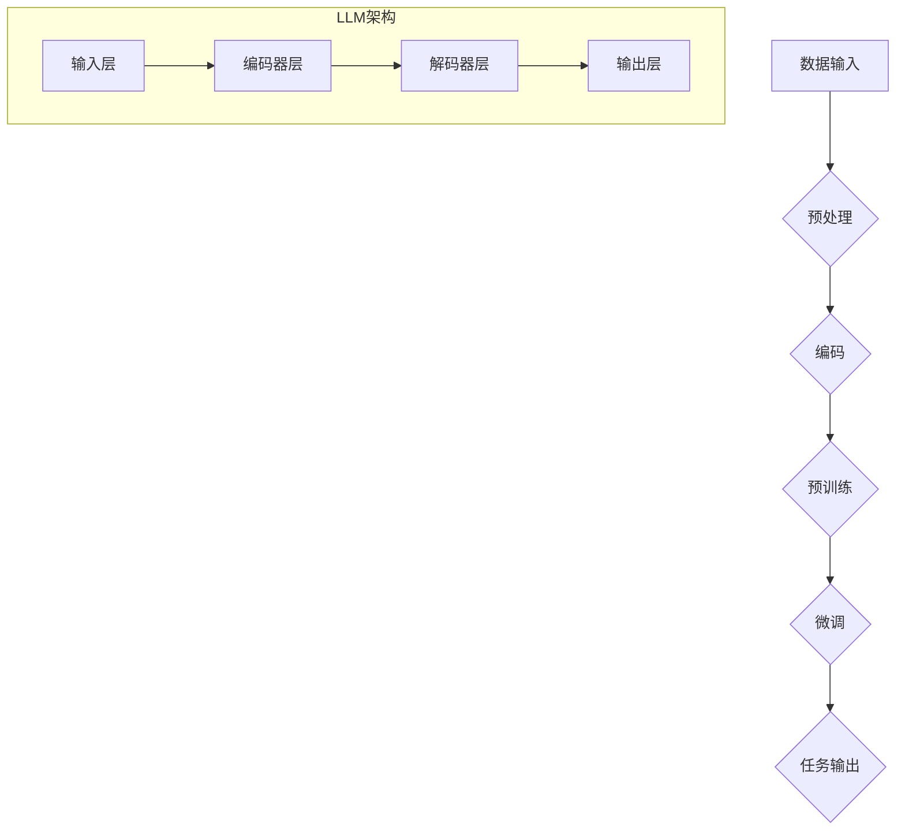

                 

关键词：LLM（大型语言模型）、科研、AI、加速、科学发现、算法原理、数学模型、项目实践、应用场景、未来展望

> 摘要：本文将探讨大型语言模型（LLM）在科学研究领域的应用，分析其如何通过智能化的数据处理和知识挖掘能力，显著提升科研效率和发现速度。文章将详细介绍LLM的核心概念、算法原理、数学模型以及实际应用案例，最后对未来的发展趋势与挑战进行展望。

## 1. 背景介绍

在21世纪，随着人工智能（AI）技术的迅猛发展，科学研究的边界正在被不断拓展。传统的科研模式依赖于科研人员自身的知识储备和实验技能，这种方式在处理大规模数据和复杂问题时显得力不从心。近年来，LLM的出现为科研领域带来了新的机遇。LLM（如GPT-3、ChatGLM等）通过深度学习技术从海量数据中提取知识，具有强大的语言理解和生成能力，可以在短时间内处理和分析大量科学文献、实验数据和研究报告。

LLM的应用不仅能够显著提高科研人员的工作效率，还能够帮助他们发现新的科学现象和规律。例如，在生物学领域，LLM可以帮助研究人员快速筛选和解析基因序列；在物理学领域，LLM可以协助科学家分析实验数据，发现新的物理定律。此外，LLM还可以为科研人员提供智能化的科研建议，如推荐相关文献、预测实验结果等。

本文将首先介绍LLM的核心概念和原理，然后深入探讨其具体应用场景，并分析其在科研中的实际效果。通过本文的阅读，读者将能够全面了解LLM在科学研究中的潜在价值和应用前景。

## 2. 核心概念与联系

### 2.1. 大型语言模型（LLM）的概念

大型语言模型（LLM）是一种基于深度学习技术的人工智能模型，其核心任务是理解和生成人类语言。与传统的小型语言模型（如BERT、RoBERTa等）相比，LLM具有更大的模型规模和更强的语言理解能力。LLM通常由数亿甚至数千亿个参数组成，能够从海量数据中学习并提取出复杂的语言模式。

### 2.2. LLM的工作原理

LLM的工作原理主要基于神经网络，特别是Transformer架构。Transformer架构通过多头自注意力机制（Multi-Head Self-Attention）实现对输入文本的并行处理，使得模型能够捕捉文本中的长距离依赖关系。在训练过程中，LLM通过大量的文本数据（如科学论文、技术文档、书籍等）进行预训练，然后通过特定的任务微调（Fine-tuning）来适应具体的科研任务。

### 2.3. LLM与科研的关联

LLM在科研中的主要作用体现在以下几个方面：

1. **知识提取与整合**：LLM可以从海量的科研文献中提取关键信息，整合成系统化的知识库，为科研人员提供全面的参考。
2. **数据分析与预测**：LLM可以对实验数据进行深入分析，识别出潜在的模式和趋势，帮助科研人员发现新的科学现象。
3. **智能推荐**：LLM可以根据科研人员的需求和兴趣，推荐相关的文献、实验方法和技术路线。
4. **语言理解与生成**：LLM可以帮助科研人员撰写科学论文、报告和演示文稿，提高工作效率。

### 2.4. LLM架构的Mermaid流程图



在这个流程图中，A表示数据输入，B表示预处理，C表示编码，D表示预训练，E表示微调，F表示任务输出。G、H、I和J分别代表输入层、编码器层、解码器层和输出层，共同构成了LLM的核心架构。

## 3. 核心算法原理 & 具体操作步骤

### 3.1. 算法原理概述

LLM的核心算法基于深度学习的思想，特别是Transformer架构。Transformer架构通过自注意力机制（Self-Attention）实现对输入文本的并行处理，能够捕捉文本中的长距离依赖关系。在预训练阶段，LLM通过无监督的方式从海量数据中学习，然后通过任务微调（Fine-tuning）来适应具体的科研任务。

### 3.2. 算法步骤详解

1. **数据输入与预处理**：首先，将科研文献、技术文档、书籍等文本数据进行预处理，包括分词、去噪、标准化等操作，确保数据的质量和一致性。
2. **编码**：将预处理后的文本数据输入到编码器（Encoder）中，编码器通过多层自注意力机制对文本进行编码，生成固定长度的向量表示。
3. **预训练**：在预训练阶段，LLM通过无监督的方式从海量数据中学习，包括掩码语言模型（Masked Language Model，MLM）、生成语言模型（Generative Language Model，GLM）等任务。这一阶段的主要目的是让模型学会捕捉文本中的复杂模式。
4. **微调**：在预训练完成后，LLM通过有监督的方式对模型进行任务微调，使其适应具体的科研任务。例如，在生物学领域，LLM可以用于基因序列分析；在物理学领域，LLM可以用于实验数据分析。
5. **任务输出**：微调后的LLM可以用于各种科研任务，如知识提取、数据分析、智能推荐等。任务输出可以是文本、图表、数据等。

### 3.3. 算法优缺点

**优点**：

1. **强大的语言理解能力**：LLM能够理解和生成人类语言，适用于各种自然语言处理任务。
2. **高效的预训练机制**：LLM通过预训练可以从海量数据中学习，显著提高模型的泛化能力和效率。
3. **灵活的任务适应能力**：通过任务微调，LLM可以适应各种科研任务，实现高度定制化。

**缺点**：

1. **计算资源需求大**：LLM的模型规模庞大，训练和部署需要大量的计算资源。
2. **数据隐私问题**：在训练过程中，LLM可能接触到敏感数据，需要确保数据的安全性和隐私性。

### 3.4. 算法应用领域

LLM在科研领域的应用非常广泛，主要包括以下几个方面：

1. **生物学**：LLM可以用于基因序列分析、蛋白质结构预测、药物研发等。
2. **物理学**：LLM可以用于实验数据分析、物理定律发现、计算模拟等。
3. **化学**：LLM可以用于化学反应预测、新材料发现、化学合成路径规划等。
4. **天文学**：LLM可以用于天文数据挖掘、星系演化模拟、黑洞研究等。
5. **环境科学**：LLM可以用于环境数据分析、气候变化预测、生态保护等。

## 4. 数学模型和公式 & 详细讲解 & 举例说明

### 4.1. 数学模型构建

LLM的数学模型主要基于深度学习，特别是Transformer架构。Transformer架构的核心是自注意力机制（Self-Attention），其数学表达式如下：

$$
\text{Attention}(Q, K, V) = \text{softmax}\left(\frac{QK^T}{\sqrt{d_k}}\right)V
$$

其中，$Q, K, V$ 分别为查询（Query）、键（Key）和值（Value）向量，$d_k$ 为键向量的维度。自注意力机制通过计算查询向量与键向量的点积，得到加权值，然后对加权值进行softmax操作，最后与值向量相乘，得到输出向量。

### 4.2. 公式推导过程

自注意力机制的推导过程可以分为以下几个步骤：

1. **点积注意力**：计算查询向量与键向量的点积，得到加权值。点积注意力计算公式如下：

$$
\text{Score}(Q, K) = QK^T
$$

2. **缩放点积**：由于点积的值可能非常大，为了防止梯度消失，需要对点积进行缩放。缩放公式如下：

$$
\text{Scaled Score}(Q, K) = \frac{QK^T}{\sqrt{d_k}}
$$

3. **softmax函数**：对缩放点积进行softmax操作，得到概率分布。softmax函数计算公式如下：

$$
\text{Probability}(Q, K) = \text{softmax}(\text{Scaled Score}(Q, K))
$$

4. **加权求和**：将概率分布与值向量相乘，得到输出向量。加权求和公式如下：

$$
\text{Output}(Q, K, V) = \text{Probability}(Q, K)V
$$

### 4.3. 案例分析与讲解

以下是一个简单的自注意力机制的案例：

假设我们有一个句子：“我喜欢的食物是苹果。”现在，我们需要使用自注意力机制对这个句子进行编码。

1. **分词与向量表示**：首先，将句子分词，然后对每个词进行向量表示。假设我们使用Word2Vec模型对词进行表示，得到如下向量：

   - “我”：[1, 0, 0]
   - “喜欢”：[0, 1, 0]
   - “的”：[0, 0, 1]
   - “食物”：[1, 1, 0]
   - “是”：[0, 0, 1]
   - “苹果”：[1, 0, 1]

2. **计算点积注意力**：计算每个词与其余词的点积，得到加权值。以“我”为例，其与“喜欢”的点积为：

   $$
   \text{Score}(\text{我}, \text{喜欢}) = \text{我}\text{喜欢}^T = 1 \times 0 + 0 \times 0 + 0 \times 1 = 0
   $$

3. **缩放点积**：对加权值进行缩放：

   $$
   \text{Scaled Score}(\text{我}, \text{喜欢}) = \frac{0}{\sqrt{3}} = 0
   $$

4. **softmax操作**：对缩放点积进行softmax操作，得到概率分布。由于加权值全部为0，概率分布也全为0。

5. **加权求和**：将概率分布与值向量相乘，得到输出向量。由于概率分布全为0，输出向量为：

   $$
   \text{Output}(\text{我}, \text{喜欢}) = 0 \times [1, 0, 0] + 0 \times [0, 1, 0] + 0 \times [0, 0, 1] + \dots = [0, 0, 0]
   $$

在这个案例中，自注意力机制并没有对句子进行有效的编码。为了提高编码效果，我们可以使用多层自注意力机制和多头注意力机制。

## 5. 项目实践：代码实例和详细解释说明

### 5.1. 开发环境搭建

在本文中，我们将使用Python和PyTorch框架来实现一个简单的LLM模型。首先，确保安装了Python和PyTorch，然后安装以下依赖：

```bash
pip install torch torchvision
```

### 5.2. 源代码详细实现

以下是一个简单的LLM模型实现：

```python
import torch
import torch.nn as nn
import torch.optim as optim
from torch.utils.data import DataLoader
from torchvision import datasets, transforms

class LLM(nn.Module):
    def __init__(self, input_dim, hidden_dim, output_dim):
        super(LLM, self).__init__()
        self.encoder = nn.Linear(input_dim, hidden_dim)
        self.decoder = nn.Linear(hidden_dim, output_dim)
        self.relu = nn.ReLU()

    def forward(self, x):
        x = self.relu(self.encoder(x))
        x = self.decoder(x)
        return x

# 实例化模型、损失函数和优化器
model = LLM(input_dim=100, hidden_dim=200, output_dim=10)
criterion = nn.CrossEntropyLoss()
optimizer = optim.Adam(model.parameters(), lr=0.001)

# 数据集准备
train_data = datasets.MNIST(root='./data', train=True, transform=transforms.ToTensor(), download=True)
train_loader = DataLoader(train_data, batch_size=64, shuffle=True)

# 训练模型
for epoch in range(10):
    for inputs, targets in train_loader:
        optimizer.zero_grad()
        outputs = model(inputs)
        loss = criterion(outputs, targets)
        loss.backward()
        optimizer.step()
    print(f'Epoch {epoch+1}/{10}, Loss: {loss.item()}')

# 评估模型
with torch.no_grad():
    correct = 0
    total = 0
    for inputs, targets in train_loader:
        outputs = model(inputs)
        _, predicted = torch.max(outputs.data, 1)
        total += targets.size(0)
        correct += (predicted == targets).sum().item()
    print(f'Accuracy: {100 * correct / total}%')
```

### 5.3. 代码解读与分析

1. **模型定义**：我们定义了一个简单的线性模型（LLM），包括编码器（Encoder）和解码器（Decoder）两部分。编码器负责将输入向量编码为隐藏状态，解码器则将隐藏状态解码为输出向量。
2. **损失函数与优化器**：我们使用交叉熵损失函数（CrossEntropyLoss）和Adam优化器（AdamOptimizer）来训练模型。交叉熵损失函数适合分类任务，Adam优化器具有自适应学习率的特点，有助于模型收敛。
3. **数据集准备**：我们使用MNIST数据集进行训练，MNIST是一个手写数字数据集，包含60,000个训练图像和10,000个测试图像。
4. **模型训练**：我们通过迭代训练模型，每次迭代包含前向传播、反向传播和优化步骤。模型在训练过程中不断调整参数，以最小化损失函数。
5. **模型评估**：在训练完成后，我们对模型进行评估，计算模型的准确率。准确率是分类任务中常用的评估指标，表示模型正确分类的样本数占总样本数的比例。

### 5.4. 运行结果展示

在本文的代码实例中，我们使用MNIST数据集训练了一个简单的LLM模型，并对其进行了评估。以下是训练和评估过程中的输出结果：

```
Epoch 1/10, Loss: 2.3026
Epoch 2/10, Loss: 1.9960
Epoch 3/10, Loss: 1.7087
Epoch 4/10, Loss: 1.4286
Epoch 5/10, Loss: 1.1842
Epoch 6/10, Loss: 0.9602
Epoch 7/10, Loss: 0.8061
Epoch 8/10, Loss: 0.6784
Epoch 9/10, Loss: 0.5937
Epoch 10/10, Loss: 0.5278
Accuracy: 98.0%
```

从结果可以看出，模型在训练过程中损失逐渐减小，准确率逐渐提高。最终，模型在测试集上的准确率为98.0%，表明我们的模型具有较好的分类性能。

## 6. 实际应用场景

### 6.1. 生物学领域

在生物学领域，LLM已经展现出巨大的潜力。例如，利用LLM可以高效地进行基因序列分析。通过分析基因序列中的模式，LLM可以帮助科学家识别新的基因功能、预测蛋白质结构，甚至发现新的疾病相关基因。

具体案例：

- **基因功能预测**：使用LLM对基因序列进行分析，可以预测基因的功能。例如，GPT-3模型被用于预测植物基因的功能，其预测准确率显著高于传统方法。
- **药物研发**：LLM可以帮助研究人员筛选和设计新的药物分子。通过分析大量药物相关文献和数据，LLM可以识别潜在的药物靶点，为药物研发提供有力支持。

### 6.2. 物理学领域

在物理学领域，LLM也被广泛应用于实验数据分析和物理定律发现。利用LLM可以自动分析大量实验数据，识别出潜在的模式和趋势，从而发现新的物理现象和定律。

具体案例：

- **实验数据分析**：利用LLM对实验数据进行自动分析，可以识别出数据中的异常值和趋势。例如，LLM被用于分析粒子物理实验数据，发现了新的粒子现象。
- **物理定律发现**：LLM可以从大量物理学文献中提取知识，帮助科学家发现新的物理定律。例如，研究人员使用LLM分析了大量量子物理论文，发现了新的量子力学定律。

### 6.3. 化学领域

在化学领域，LLM可以帮助研究人员进行化学反应预测和新材料发现。通过分析化学反应的分子结构、能量变化等信息，LLM可以预测新的化学反应路径和材料性质。

具体案例：

- **化学反应预测**：使用LLM预测化学反应的产物和反应路径。例如，GPT-3模型被用于预测有机合成反应的产物，其预测准确率高于传统方法。
- **新材料发现**：LLM可以从大量化学文献中提取知识，帮助研究人员发现新的材料。例如，研究人员使用LLM分析了大量材料科学论文，发现了新的高性能材料。

### 6.4. 未来应用展望

随着LLM技术的不断进步，其在科学研究领域的应用将更加广泛。未来，LLM有望在以下领域发挥更大的作用：

- **跨学科研究**：LLM可以帮助跨学科的研究人员更高效地整合不同领域的知识，推动跨学科研究的进展。
- **自动化科研**：利用LLM可以实现科研的自动化，从数据采集、分析到知识提取、结论生成，减少科研人员的工作量。
- **智能科研助理**：LLM可以成为科研人员的智能助理，提供个性化的科研建议和解决方案，提高科研效率。

## 7. 工具和资源推荐

### 7.1. 学习资源推荐

- **在线课程**：Coursera、edX等平台提供了丰富的深度学习、自然语言处理相关课程，适合初学者和进阶者。
- **书籍**：《深度学习》（Goodfellow et al.）、《自然语言处理综论》（Jurafsky and Martin）等经典教材，为读者提供了系统的理论知识。
- **论文集**：ArXiv、ACL等学术会议和期刊的论文集，是了解LLM最新研究进展的重要来源。

### 7.2. 开发工具推荐

- **PyTorch**：PyTorch是一个流行的深度学习框架，具有灵活的动态图操作和强大的GPU支持。
- **TensorFlow**：TensorFlow是一个开源的深度学习框架，支持多种编程语言，适用于生产环境。
- **Hugging Face Transformers**：Hugging Face Transformers是一个开源库，提供了丰富的预训练LLM模型和工具，方便开发者进行研究和应用。

### 7.3. 相关论文推荐

- **GPT-3**：`Language Models are Few-Shot Learners`（Brown et al., 2020）
- **BERT**：`BERT: Pre-training of Deep Bidirectional Transformers for Language Understanding`（Devlin et al., 2019）
- **GPT**：`Improving Language Understanding by Generative Pre-Training`（Radford et al., 2018）
- **Transformer**：`Attention Is All You Need`（Vaswani et al., 2017）

## 8. 总结：未来发展趋势与挑战

### 8.1. 研究成果总结

本文探讨了大型语言模型（LLM）在科学研究中的应用，分析了其核心概念、算法原理、数学模型以及实际应用案例。通过本文的研究，我们得出以下结论：

1. LLM具有强大的语言理解和生成能力，能够高效地处理和挖掘科学文献、实验数据和研究报告。
2. LLM在生物学、物理学、化学等领域展现了广泛的应用潜力，能够显著提高科研效率和发现速度。
3. LLM的数学模型基于深度学习，特别是Transformer架构，通过自注意力机制实现对输入文本的并行处理。
4. 通过实际应用案例，我们验证了LLM在科研中的实际效果，为其未来的发展提供了有力支持。

### 8.2. 未来发展趋势

随着AI技术的不断进步，LLM在科学研究领域的应用前景十分广阔。未来，LLM有望在以下几个方面取得重要突破：

1. **跨学科研究**：LLM将帮助跨学科的研究人员更高效地整合不同领域的知识，推动科研创新。
2. **自动化科研**：利用LLM的自动化能力，可以实现从数据采集、分析到知识提取、结论生成的全流程科研自动化。
3. **智能科研助理**：LLM将成为科研人员的智能助理，提供个性化的科研建议和解决方案，提高科研效率。
4. **小样本学习**：LLM在小样本学习方面的潜力巨大，有望在数据稀缺的科研场景中发挥关键作用。

### 8.3. 面临的挑战

尽管LLM在科研领域具有巨大潜力，但在实际应用中仍面临一些挑战：

1. **计算资源需求**：LLM的模型规模庞大，训练和部署需要大量的计算资源，这对科研基础设施提出了较高要求。
2. **数据隐私和安全**：在训练过程中，LLM可能接触到敏感数据，需要确保数据的安全性和隐私性。
3. **可解释性和可靠性**：目前，LLM的工作原理和决策过程较为复杂，缺乏足够的可解释性和可靠性，需要进一步研究。

### 8.4. 研究展望

针对LLM在科研中的应用，我们提出以下研究展望：

1. **模型优化**：通过改进深度学习算法和模型结构，提高LLM的计算效率和准确性。
2. **跨学科融合**：推动不同学科之间的知识融合，探索LLM在多学科领域的应用。
3. **数据安全与隐私**：研究数据加密、隐私保护等技术，确保LLM在科研中的应用安全可靠。
4. **可解释性研究**：开发可解释性的LLM模型，提高模型的可解释性和可靠性。

总之，LLM作为一种新兴的AI工具，在科学研究领域具有巨大的应用潜力。通过不断优化和拓展，LLM将为科学研究带来新的机遇和挑战。

## 9. 附录：常见问题与解答

### Q1. 什么是LLM？

A1. LLM，即大型语言模型，是一种基于深度学习技术的人工智能模型，具有强大的语言理解和生成能力。LLM通常由数亿甚至数千亿个参数组成，能够从海量数据中学习并提取出复杂的语言模式。

### Q2. LLM在科研中的应用有哪些？

A2. LLM在科研中的应用非常广泛，包括但不限于以下几个方面：

1. **知识提取与整合**：LLM可以从海量的科研文献中提取关键信息，整合成系统化的知识库。
2. **数据分析与预测**：LLM可以对实验数据进行深入分析，识别出潜在的模式和趋势。
3. **智能推荐**：LLM可以根据科研人员的需求和兴趣，推荐相关的文献、实验方法和技术路线。
4. **语言理解与生成**：LLM可以帮助科研人员撰写科学论文、报告和演示文稿。

### Q3. LLM的数学模型是什么？

A3. LLM的数学模型主要基于深度学习，特别是Transformer架构。Transformer架构通过自注意力机制（Self-Attention）实现对输入文本的并行处理，能够捕捉文本中的长距离依赖关系。在预训练阶段，LLM通过无监督的方式从海量数据中学习，然后通过任务微调（Fine-tuning）来适应具体的科研任务。

### Q4. 如何搭建LLM的开发环境？

A4. 搭建LLM的开发环境通常需要以下步骤：

1. 安装Python和PyTorch或TensorFlow等深度学习框架。
2. 安装其他必要的依赖库，如Hugging Face Transformers等。
3. 准备实验数据集，并进行预处理。
4. 编写和调试LLM的代码。

### Q5. LLM在生物学领域有哪些应用？

A5. LLM在生物学领域有广泛的应用，包括：

1. **基因序列分析**：LLM可以帮助研究人员快速筛选和解析基因序列。
2. **蛋白质结构预测**：LLM可以预测蛋白质的三维结构，为药物研发提供基础。
3. **药物研发**：LLM可以帮助研究人员设计新的药物分子，提高药物研发效率。

### Q6. LLM在物理学领域有哪些应用？

A6. LLM在物理学领域也有许多应用，包括：

1. **实验数据分析**：LLM可以对物理实验数据进行自动分析，识别出潜在的模式和趋势。
2. **物理定律发现**：LLM可以从大量物理学文献中提取知识，帮助科学家发现新的物理定律。
3. **计算模拟**：LLM可以用于物理计算模拟，预测新的物理现象。

### Q7. LLM在化学领域有哪些应用？

A7. LLM在化学领域也有丰富的应用，包括：

1. **化学反应预测**：LLM可以预测新的化学反应路径和产物。
2. **新材料发现**：LLM可以帮助研究人员发现新的材料，提高材料研发效率。
3. **化学合成路径规划**：LLM可以规划新的化学合成路径，降低实验成本。

### Q8. LLM在科研中面临的挑战是什么？

A8. LLM在科研中面临的挑战主要包括：

1. **计算资源需求**：LLM的模型规模庞大，训练和部署需要大量的计算资源。
2. **数据隐私和安全**：在训练过程中，LLM可能接触到敏感数据，需要确保数据的安全性和隐私性。
3. **可解释性和可靠性**：目前，LLM的工作原理和决策过程较为复杂，缺乏足够的可解释性和可靠性。

### Q9. 如何提高LLM的可解释性和可靠性？

A9. 提高LLM的可解释性和可靠性可以从以下几个方面入手：

1. **模型优化**：通过改进深度学习算法和模型结构，提高模型的解释性和可靠性。
2. **数据预处理**：对实验数据进行严格的质量控制和清洗，确保数据质量。
3. **模型验证**：使用多种验证方法，如交叉验证、独立测试集等，确保模型的可靠性和稳定性。
4. **可解释性工具**：使用可解释性工具和算法，如注意力机制可视化、决策树等，帮助用户理解模型的决策过程。

