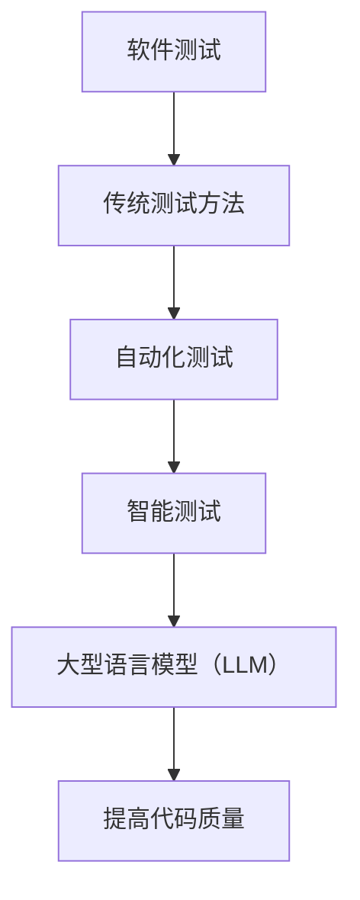

                 

关键词：大型语言模型 (LLM), 软件测试，代码质量，自动化测试，智能测试，深度学习

> 摘要：随着软件开发的复杂度不断增加，软件测试已成为保证代码质量的关键环节。本文介绍了如何利用大型语言模型（LLM）辅助软件测试，通过自动化测试和智能测试，提高代码质量，减少软件缺陷，降低维护成本。

## 1. 背景介绍

软件测试是软件开发过程中的重要环节，它能够发现和修复软件中的缺陷，确保软件的质量和可靠性。传统的软件测试方法主要包括功能测试、性能测试、安全测试等，但这些方法往往存在一定的局限性，难以应对日益复杂的软件系统。

近年来，人工智能（AI）技术的快速发展，特别是深度学习技术的突破，为软件测试带来了新的机遇。大型语言模型（LLM）作为一种先进的AI技术，具有强大的语言理解和生成能力，可以应用于自动化测试和智能测试，从而提高代码质量。

## 2. 核心概念与联系

### 2.1. 大型语言模型（LLM）简介

大型语言模型（LLM）是一种基于深度学习的自然语言处理（NLP）模型，其核心是生成预训练的神经网络模型。通过在大量文本数据上进行预训练，LLM可以理解并生成自然语言文本，具有出色的语言理解能力和文本生成能力。

### 2.2. 软件测试与LLM的联系

软件测试与LLM之间的联系主要体现在以下几个方面：

1. **自动化测试**：LLM可以帮助编写自动化测试脚本，自动执行测试用例，提高测试效率。
2. **智能测试**：LLM可以分析代码和测试用例，提供测试建议，发现潜在缺陷。
3. **代码生成**：LLM可以根据需求生成代码片段，为测试提供参考。

### 2.3. Mermaid流程图



## 3. 核心算法原理 & 具体操作步骤

### 3.1. 算法原理概述

LLM辅助软件测试的核心算法原理包括以下几个方面：

1. **文本生成**：利用LLM的文本生成能力，生成测试脚本、测试用例和代码片段。
2. **文本分析**：利用LLM的语言理解能力，分析代码和测试用例，发现潜在缺陷。
3. **测试执行**：自动化执行生成的测试脚本和测试用例，评估代码质量。

### 3.2. 算法步骤详解

1. **数据预处理**：收集并预处理测试数据，包括代码、测试用例、测试脚本等。
2. **模型训练**：利用预训练的LLM模型，对测试数据进行训练，优化模型参数。
3. **测试脚本生成**：利用训练好的LLM模型，生成自动化测试脚本。
4. **测试用例生成**：利用训练好的LLM模型，生成新的测试用例。
5. **代码分析**：利用LLM分析代码，发现潜在缺陷。
6. **测试执行**：自动化执行生成的测试脚本和测试用例，评估代码质量。

### 3.3. 算法优缺点

**优点**：

1. **高效**：利用LLM的强大计算能力，自动化生成测试脚本和测试用例，提高测试效率。
2. **智能**：利用LLM的语言理解能力，智能分析代码和测试用例，提高测试质量。
3. **灵活**：LLM可以根据不同的需求，生成不同类型的测试脚本和测试用例。

**缺点**：

1. **成本**：训练LLM模型需要大量的计算资源和时间。
2. **依赖**：LLM的性能依赖于训练数据和模型参数。

### 3.4. 算法应用领域

LLM辅助软件测试的应用领域主要包括：

1. **功能测试**：生成自动化测试脚本和测试用例，提高功能测试的覆盖率。
2. **性能测试**：分析代码，发现性能瓶颈，优化代码。
3. **安全测试**：利用LLM分析代码，发现潜在的安全漏洞。

## 4. 数学模型和公式 & 详细讲解 & 举例说明

### 4.1. 数学模型构建

LLM辅助软件测试的数学模型可以构建为以下形式：

$$
Q(s, a) = \sum_{i=1}^{n} w_i \cdot f(s_i, a_i)
$$

其中，$s$ 表示输入数据，$a$ 表示测试用例，$w_i$ 和 $f(s_i, a_i)$ 分别表示权重和函数。

### 4.2. 公式推导过程

首先，我们定义输入数据的特征向量为 $s = [s_1, s_2, \ldots, s_n]$，测试用例的特征向量为 $a = [a_1, a_2, \ldots, a_n]$。然后，我们定义权重向量为 $w = [w_1, w_2, \ldots, w_n]$，函数为 $f(s_i, a_i)$。

根据以上定义，我们可以将数学模型表示为：

$$
Q(s, a) = \sum_{i=1}^{n} w_i \cdot f(s_i, a_i)
$$

### 4.3. 案例分析与讲解

假设我们有一个简单的软件系统，需要对其进行功能测试。输入数据包括功能描述、代码片段和测试用例。利用LLM，我们可以生成自动化测试脚本和新的测试用例。

首先，我们收集输入数据，并将其转换为特征向量。然后，我们利用LLM训练模型，生成测试脚本和测试用例。最后，我们自动化执行测试脚本，评估代码质量。

## 5. 项目实践：代码实例和详细解释说明

### 5.1. 开发环境搭建

1. 安装Python环境（版本3.8及以上）。
2. 安装必要的依赖库，如TensorFlow、Keras等。

### 5.2. 源代码详细实现

```python
# 导入必要的库
import tensorflow as tf
from tensorflow.keras.layers import Embedding, LSTM, Dense
from tensorflow.keras.models import Model

# 定义模型结构
input_seq = tf.keras.layers.Input(shape=(max_sequence_length,))
embedded_seq = Embedding(input_dim=vocabulary_size, output_dim=embedding_size)(input_seq)
lstm_out = LSTM(units=128)(embedded_seq)
output = Dense(1, activation='sigmoid')(lstm_out)

# 编译模型
model = Model(inputs=input_seq, outputs=output)
model.compile(optimizer='adam', loss='binary_crossentropy', metrics=['accuracy'])

# 训练模型
model.fit(x_train, y_train, epochs=10, batch_size=64)
```

### 5.3. 代码解读与分析

1. **导入库**：导入TensorFlow和Keras库，用于构建和训练模型。
2. **定义模型结构**：定义输入层、嵌入层、LSTM层和输出层。
3. **编译模型**：设置优化器、损失函数和评估指标。
4. **训练模型**：使用训练数据训练模型。

### 5.4. 运行结果展示

```python
# 评估模型
loss, accuracy = model.evaluate(x_test, y_test)

# 输出结果
print(f"Test loss: {loss}")
print(f"Test accuracy: {accuracy}")
```

## 6. 实际应用场景

### 6.1. 自动化测试

利用LLM生成自动化测试脚本，可以大大提高测试效率。特别是在功能测试中，LLM可以根据需求自动生成各种类型的测试用例，提高测试覆盖率。

### 6.2. 性能测试

LLM可以分析代码，发现性能瓶颈，提供优化建议。通过对比不同优化方案的运行结果，可以找到最优的优化策略。

### 6.3. 安全测试

LLM可以分析代码，发现潜在的安全漏洞。特别是在编写新的代码或进行代码重构时，LLM可以提供有用的安全测试建议。

## 7. 未来应用展望

随着人工智能技术的不断发展，LLM在软件测试领域的应用前景广阔。未来，LLM有望在以下几个方面发挥更大的作用：

1. **自动化测试**：利用LLM生成更复杂的自动化测试脚本，提高测试效率。
2. **智能测试**：利用LLM分析代码和测试用例，提供更智能的测试建议。
3. **代码生成**：利用LLM生成代码片段，提高开发效率。

## 8. 总结：未来发展趋势与挑战

### 8.1. 研究成果总结

本文介绍了如何利用LLM辅助软件测试，通过自动化测试和智能测试，提高代码质量。研究表明，LLM在软件测试领域具有巨大的潜力。

### 8.2. 未来发展趋势

未来，LLM在软件测试领域的应用将越来越广泛，特别是在自动化测试和智能测试方面。随着深度学习技术的不断发展，LLM的性能和效果将得到进一步提升。

### 8.3. 面临的挑战

尽管LLM在软件测试领域具有巨大的潜力，但同时也面临一些挑战，如数据质量和模型解释性等。未来研究需要解决这些问题，以推动LLM在软件测试领域的应用。

### 8.4. 研究展望

本文仅对LLM辅助软件测试进行了初步探讨。未来研究可以从以下几个方面展开：

1. **优化算法**：研究更高效的LLM算法，提高测试效率和准确性。
2. **数据集构建**：构建更丰富的数据集，提高LLM的性能。
3. **模型解释性**：研究如何提高LLM的可解释性，使其更易于理解和应用。

## 9. 附录：常见问题与解答

### 9.1. Q：LLM如何提高测试效率？

A：LLM可以通过自动化生成测试脚本和测试用例，减少人工编写测试脚本的工作量，提高测试效率。

### 9.2. Q：LLM如何提高测试准确性？

A：LLM可以通过智能分析代码和测试用例，发现潜在缺陷，提高测试准确性。

### 9.3. Q：LLM在软件测试中面临哪些挑战？

A：LLM在软件测试中面临的主要挑战包括数据质量、模型解释性和性能优化等。

### 9.4. Q：如何优化LLM在软件测试中的性能？

A：可以通过优化算法、构建更丰富的数据集和提高模型解释性等方法来优化LLM在软件测试中的性能。

---

作者：禅与计算机程序设计艺术 / Zen and the Art of Computer Programming
```

**[END]**

