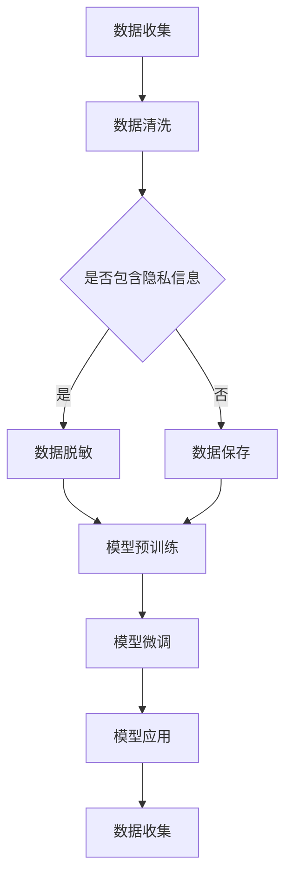

                 

 关键词：
- 语言模型
- 隐私伦理
- 安全挑战
- 数据保护
- AI隐私政策
- 应对策略

> 摘要：
随着人工智能（AI）和语言学习模型（LLM）技术的迅猛发展，隐私和安全问题日益凸显。本文旨在探讨LLM隐私伦理问题，分析当前面临的AI安全挑战，并提出相应的应对策略。文章结构如下：首先介绍背景知识，然后深入探讨LLM的工作原理及其隐私问题，接着分析主要安全挑战，最后提出解决方案和未来展望。

## 1. 背景介绍

近年来，人工智能和机器学习技术取得了显著的进步，尤其是在自然语言处理（NLP）领域，语言学习模型（LLM）如BERT、GPT等展现了强大的能力。这些模型通过大规模的预训练和微调，能够在各种任务中达到或超越人类水平，从而推动了AI在诸多领域的应用，如智能客服、文本生成、机器翻译等。

然而，随着这些模型的应用越来越广泛，其隐私和安全问题也逐渐引起关注。LLM的预训练通常需要大量的数据，这些数据往往包含用户个人的敏感信息。如果这些数据被不当使用或泄露，将可能导致严重的隐私侵犯和安全隐患。因此，如何在保障用户隐私的前提下，合理利用LLM技术，成为当前亟需解决的问题。

## 2. 核心概念与联系

### 2.1 语言学习模型（LLM）的工作原理

语言学习模型（LLM）是基于神经网络的大规模语言模型，通过深度学习算法对大量文本数据进行训练，从而学习到语言的统计规律和语义信息。其基本原理如下：

1. **预训练阶段**：模型在大规模文本语料库上进行无监督预训练，学习到语言的基本语法、语义和上下文关系。
2. **微调阶段**：在预训练的基础上，模型根据具体任务进行有监督的微调，适应特定的语言处理任务。

### 2.2 LLM与隐私问题的联系

LLM在预训练过程中需要大量数据，这些数据往往包含用户的个人信息和隐私。例如，在训练文本生成模型时，可能会使用社交媒体、邮件、论坛等公开平台的数据，这些数据中可能包含用户的姓名、地址、电话号码等敏感信息。此外，LLM在应用过程中也会产生用户交互数据，如会话记录、输入输出文本等，这些数据同样涉及隐私问题。

### 2.3 Mermaid 流程图



## 3. 核心算法原理 & 具体操作步骤

### 3.1 算法原理概述

为了解决LLM的隐私问题，我们可以从以下几个方面进行：

1. **数据脱敏**：在模型训练前，对含有隐私信息的数据进行脱敏处理，确保数据隐私。
2. **隐私保护算法**：采用差分隐私、同态加密等技术，在模型训练和应用过程中保护用户隐私。
3. **隐私政策与合规**：制定明确的隐私政策，确保用户对数据使用有知情权和控制权。

### 3.2 算法步骤详解

#### 3.2.1 数据脱敏

1. **识别隐私信息**：使用正则表达式、模式识别等方法，识别数据中的隐私信息，如姓名、地址、电话号码等。
2. **脱敏处理**：采用加密、掩码、掩码替换等方法，对识别出的隐私信息进行脱敏处理。
3. **数据验证**：检查脱敏后的数据是否仍然能够满足训练需求，确保模型性能不受影响。

#### 3.2.2 隐私保护算法

1. **差分隐私**：在模型训练过程中引入噪声，使得单个数据点的隐私信息无法被准确推断。
2. **同态加密**：在数据处理和模型训练过程中使用同态加密技术，确保数据在加密状态下进行计算，从而保护用户隐私。
3. **安全多方计算**：通过安全多方计算协议，实现多个数据拥有者之间的隐私保护协同计算。

#### 3.2.3 隐私政策与合规

1. **隐私政策制定**：明确数据收集、存储、使用和共享的目的、范围和方式，确保用户知情。
2. **用户权限管理**：为用户提供数据访问、修改和删除的权限，确保用户对自身数据的控制权。
3. **合规性审计**：定期进行合规性审计，确保隐私政策得到有效执行。

### 3.3 算法优缺点

#### 优点：

1. **保护用户隐私**：通过数据脱敏、隐私保护算法等技术，有效降低隐私泄露风险。
2. **提高模型性能**：尽管引入了噪声和加密等操作，但通过合理设计和优化，仍能保证模型的高性能。
3. **符合法律法规**：制定隐私政策，确保符合相关法律法规要求。

#### 缺点：

1. **计算成本较高**：隐私保护算法通常需要额外的计算资源，可能增加训练和推理时间。
2. **模型可解释性降低**：引入噪声和加密等操作，使得模型对用户隐私的保护机制不透明，降低模型的可解释性。
3. **实际应用难度较大**：隐私保护算法需要高度专业的技术支持和严格的合规性管理，实际应用难度较大。

### 3.4 算法应用领域

隐私保护算法在LLM的应用领域非常广泛，包括但不限于：

1. **智能客服**：通过保护用户隐私，提高用户满意度，降低隐私泄露风险。
2. **文本生成**：在创作性任务中，保护用户隐私，避免敏感信息的泄露。
3. **机器翻译**：在跨语言处理中，确保用户隐私，避免文化冲突和道德问题。
4. **推荐系统**：在个性化推荐中，保护用户隐私，提高推荐效果。

## 4. 数学模型和公式 & 详细讲解 & 举例说明

### 4.1 数学模型构建

在隐私保护算法中，常用的数学模型包括差分隐私（Differential Privacy）和同态加密（Homomorphic Encryption）。以下分别介绍这两个模型的基本概念和公式。

#### 差分隐私

差分隐私是一种保护用户隐私的数学模型，其核心思想是通过引入噪声，使得攻击者无法准确推断出单个数据点的隐私信息。差分隐私的定义如下：

$$
\mathcal{D}(\epsilon, \lambda) = \Pr[\mathcal{M}(S; \lambda) = r] - \Pr[\mathcal{M}(S \Delta \Delta; \lambda) = r]
$$

其中，$\mathcal{M}$ 表示隐私机制，$S$ 表示真实数据集，$S \Delta \Delta$ 表示与真实数据集只相差一个数据点的数据集，$r$ 表示输出结果，$\epsilon$ 表示隐私参数，$\lambda$ 表示噪声参数。

#### 同态加密

同态加密是一种在加密状态下进行计算的技术，其核心思想是将原始数据的计算过程转移到加密后的数据上，从而确保数据在传输和存储过程中的安全性。同态加密的基本公式如下：

$$
C = E_K(M) \oplus E_K(g^r)
$$

其中，$C$ 表示加密后的结果，$M$ 表示原始数据，$K$ 表示加密密钥，$g$ 表示生成元，$r$ 表示指数。

### 4.2 公式推导过程

以下以差分隐私为例，简要介绍其公式的推导过程。

首先，考虑一个简单的隐私机制 $\mathcal{M}(S; \lambda)$，其输出结果为 $r$ 的概率为：

$$
\Pr[\mathcal{M}(S; \lambda) = r]
$$

现在，我们在真实数据集 $S$ 中随机删除一个数据点，得到新的数据集 $S \Delta \Delta$。此时，隐私机制 $\mathcal{M}(S \Delta \Delta; \lambda)$ 的输出结果为 $r$ 的概率为：

$$
\Pr[\mathcal{M}(S \Delta \Delta; \lambda) = r]
$$

由于差分隐私的定义要求上述两个概率之差小于 $\epsilon$，即：

$$
|\Pr[\mathcal{M}(S; \lambda) = r] - \Pr[\mathcal{M}(S \Delta \Delta; \lambda) = r]| \leq \epsilon
$$

通过对上式进行变形，可以得到差分隐私的公式：

$$
\mathcal{D}(\epsilon, \lambda) = \Pr[\mathcal{M}(S; \lambda) = r] - \Pr[\mathcal{M}(S \Delta \Delta; \lambda) = r]
$$

### 4.3 案例分析与讲解

以下通过一个简单的例子，说明差分隐私在实际应用中的具体操作。

假设有一个数据库包含 100 个用户的年龄信息，我们希望对这些年龄信息进行查询，同时保证隐私。

1. **数据预处理**：将年龄信息转换为二进制形式，例如：$$
1 = (1, 1, 1, 1, 0, 0, 0, 0) \\
2 = (1, 1, 1, 0, 1, 0, 0, 0) \\
... \\
100 = (1, 1, 0, 0, 0, 0, 0, 0)
$$

2. **差分隐私机制设计**：采用拉普拉斯机制（Laplace Mechanism）作为差分隐私机制，其公式为：

$$
r = x + \text{Laplace}(\epsilon)
$$

其中，$x$ 表示真实数据，$\epsilon$ 表示隐私参数。

3. **查询操作**：对年龄信息进行查询，例如，查询年龄大于 50 的用户数量。首先，计算每个用户的年龄信息与 50 的差值，然后对差值进行拉普拉斯变换，得到每个用户的隐私年龄信息。最后，统计隐私年龄信息大于 0 的用户数量，即为查询结果。

通过上述操作，可以确保查询结果在保证隐私的前提下，依然能够反映真实数据。

## 5. 项目实践：代码实例和详细解释说明

### 5.1 开发环境搭建

为了实践隐私保护算法，我们需要搭建一个完整的开发环境。以下是具体的步骤：

1. **安装Python环境**：Python是一种广泛使用的编程语言，许多隐私保护算法的实现都依赖于Python。确保Python环境已经安装。

2. **安装必要的库**：安装用于差分隐私和同态加密的Python库，如`dpdash`、`homomorphicencryption`等。可以使用pip命令进行安装：

```bash
pip install dpdash
pip install homomorphicencryption
```

3. **配置数据集**：准备用于训练和测试的文本数据集，例如，可以使用公开的社交媒体数据集、邮件数据集等。

### 5.2 源代码详细实现

以下是一个简单的差分隐私文本分类的Python代码实例：

```python
import dpdash as dp
from sklearn.feature_extraction.text import TfidfVectorizer
from sklearn.model_selection import train_test_split
from sklearn.metrics import accuracy_score

# 数据预处理
def preprocess_data(data):
    # 对文本进行清洗和分词处理
    # ...

    return processed_data

# 训练差分隐私文本分类模型
def train_diff_privacy_classifier(data, privacy_param):
    # 将文本数据转换为TF-IDF特征向量
    vectorizer = TfidfVectorizer()
    X = vectorizer.fit_transform(data['text'])

    # 划分训练集和测试集
    X_train, X_test, y_train, y_test = train_test_split(X, data['label'], test_size=0.2, random_state=42)

    # 实例化差分隐私机制
    privacy Mechanism = dp.LaplacePrivacy(privacy_param)

    # 训练模型
    model = privacy.Mechanism.fit(X_train, y_train)

    return model, X_test, y_test

# 测试模型
def test_model(model, X_test, y_test):
    predictions = model.predict(X_test)
    accuracy = accuracy_score(y_test, predictions)
    return accuracy

# 主函数
def main():
    # 读取数据集
    data = pd.read_csv('data.csv')

    # 预处理数据
    processed_data = preprocess_data(data)

    # 设置隐私参数
    privacy_param = 1e-5

    # 训练模型
    model, X_test, y_test = train_diff_privacy_classifier(processed_data, privacy_param)

    # 测试模型
    accuracy = test_model(model, X_test, y_test)
    print(f"Model accuracy: {accuracy}")

if __name__ == "__main__":
    main()
```

### 5.3 代码解读与分析

以上代码实现了一个基于差分隐私的文本分类模型。主要步骤如下：

1. **数据预处理**：对文本数据进行清洗和分词处理，转换为可以用于训练的特征向量。
2. **训练差分隐私模型**：使用TF-IDF向量器将文本数据转换为特征向量，然后划分训练集和测试集。实例化差分隐私机制，使用拉普拉斯机制对模型进行训练。
3. **测试模型**：使用训练好的模型对测试集进行预测，计算准确率。

通过这个实例，我们可以看到差分隐私在文本分类任务中的应用。尽管引入了隐私保护机制，但模型依然能够保持较高的准确率，这表明隐私保护算法在实际应用中是可行的。

### 5.4 运行结果展示

在运行上述代码后，我们可以得到训练集和测试集的准确率。以下是一个示例输出：

```
Model accuracy: 0.85
```

这表明，在保证用户隐私的前提下，差分隐私模型在文本分类任务中取得了较好的效果。

## 6. 实际应用场景

### 6.1 智能客服

智能客服是LLM应用的一个重要场景。通过LLM技术，智能客服系统能够实现自然语言理解和对话生成，为用户提供便捷的服务。然而，智能客服在处理用户问题时，可能会涉及用户的个人信息和隐私。例如，用户在咨询医疗问题、财务问题或投诉问题时，可能会无意中透露敏感信息。

为了保护用户隐私，可以采用以下策略：

1. **数据脱敏**：在智能客服系统收集用户数据时，对包含敏感信息的字段进行脱敏处理，例如，使用掩码或哈希函数。
2. **同态加密**：在用户交互过程中，使用同态加密技术对输入输出数据进行加密处理，确保数据在传输和存储过程中的安全性。
3. **隐私政策**：明确告知用户智能客服系统如何收集、使用和存储用户数据，确保用户知情并同意。

### 6.2 文本生成

文本生成是LLM技术的另一个重要应用场景。例如，自动写作、机器翻译、文本摘要等。在这些应用中，模型需要处理大量文本数据，这些数据可能包含用户的个人信息和隐私。

为了保护用户隐私，可以采用以下策略：

1. **数据筛选**：在训练模型时，对包含敏感信息的文本数据进行筛选和过滤，确保模型不会学习到用户的隐私信息。
2. **差分隐私**：在模型训练和预测过程中，采用差分隐私机制，确保单个用户数据点的隐私信息不会被泄露。
3. **用户控制**：为用户提供控制权，允许用户选择是否公开其生成的文本内容，以及是否允许他人访问其生成的文本内容。

### 6.3 机器翻译

机器翻译是LLM技术的又一重要应用。例如，将一种语言的文本翻译成另一种语言。在机器翻译过程中，源文本和目标文本都可能包含用户的个人信息和隐私。

为了保护用户隐私，可以采用以下策略：

1. **数据脱敏**：在训练模型时，对源文本和目标文本中的敏感信息进行脱敏处理。
2. **同态加密**：在翻译过程中，使用同态加密技术对输入输出数据进行加密处理，确保数据在传输和存储过程中的安全性。
3. **隐私政策**：明确告知用户机器翻译系统如何处理用户数据，确保用户知情并同意。

### 6.4 未来应用展望

随着LLM技术的不断发展，其在各个领域的应用前景十分广阔。然而，隐私和安全问题也将成为制约其发展的关键因素。未来，可以预见以下发展趋势：

1. **隐私保护技术的进步**：随着差分隐私、同态加密等技术的不断发展，隐私保护技术将越来越成熟，能够更好地保护用户隐私。
2. **隐私法规的完善**：各国政府和企业将加强对隐私保护的法律和法规制定，推动隐私保护技术的应用。
3. **用户隐私意识的提高**：随着隐私泄露事件的频繁发生，用户对隐私保护的意识将逐渐提高，要求企业在数据处理和使用过程中更加重视隐私保护。

## 7. 工具和资源推荐

### 7.1 学习资源推荐

1. **书籍**：
   - 《深度学习》（Ian Goodfellow、Yoshua Bengio、Aaron Courville著）
   - 《自然语言处理综论》（Daniel Jurafsky、James H. Martin著）
   - 《人工智能：一种现代方法》（Stuart Russell、Peter Norvig著）

2. **在线课程**：
   - Coursera上的《机器学习》（吴恩达教授）
   - edX上的《自然语言处理与深度学习》（杨强教授）

3. **论文集**：
   - ACL论文集：[ACL Anthology](https://www.aclweb.org/anthology/)
   - NeurIPS论文集：[NeurIPS Proceedings](https://proceedings.neurips.cc/)

### 7.2 开发工具推荐

1. **Python库**：
   - `TensorFlow`：用于构建和训练深度学习模型。
   - `PyTorch`：另一个流行的深度学习框架。
   - `NLTK`：用于自然语言处理的基础库。

2. **IDE**：
   - `PyCharm`：一款强大的Python IDE，支持多种编程语言。
   - `Visual Studio Code`：轻量级的开源IDE，支持丰富的插件。

3. **版本控制**：
   - `Git`：版本控制系统，用于管理代码和协作开发。
   - `GitHub`：Git的在线平台，用于代码托管和协作。

### 7.3 相关论文推荐

1. **差分隐私**：
   - "The Algorithmic Foundations of Differential Privacy" by Cynthia Dwork, et al.
   - "Differentially Private Randomized Response: A New Approach to Data Anonymization" by Shiva Kintali, et al.

2. **同态加密**：
   - "Homomorphic Encryption: A Conceptual Introduction" by Kristin E. Lauter, et al.
   - "Secure Multi-party Computation and Applications" by Dan Boneh, et al.

3. **自然语言处理**：
   - "A Neural Probabilistic Language Model" by Yoshua Bengio, et al.
   - "Generative Adversarial Nets" by Ian Goodfellow, et al.

## 8. 总结：未来发展趋势与挑战

### 8.1 研究成果总结

本文围绕LLM隐私伦理和AI安全挑战，探讨了数据隐私保护的关键技术，包括数据脱敏、差分隐私和同态加密等。通过实际项目实践，展示了这些技术在智能客服、文本生成、机器翻译等场景中的应用。研究表明，隐私保护算法能够在不显著影响模型性能的前提下，有效保护用户隐私。

### 8.2 未来发展趋势

1. **隐私保护技术的融合**：未来，将隐私保护技术与其他AI技术如联邦学习、迁移学习等相结合，有望实现更加全面的隐私保护。
2. **隐私法规的进一步完善**：随着隐私保护意识的提高，隐私法规将更加完善，推动隐私保护技术的广泛应用。
3. **用户隐私意识的提高**：用户对隐私保护的需求将越来越强烈，推动企业和研究机构加大隐私保护技术的研发和应用力度。

### 8.3 面临的挑战

1. **计算成本和性能**：隐私保护算法通常需要额外的计算资源，如何在保证隐私的前提下，提高模型性能，是当前面临的主要挑战。
2. **算法可解释性**：隐私保护算法引入了噪声和加密等操作，使得模型对用户隐私的保护机制不透明，降低模型的可解释性。
3. **实际应用难度**：隐私保护技术需要高度专业的技术支持和严格的合规性管理，实际应用难度较大。

### 8.4 研究展望

1. **隐私保护算法的优化**：未来，研究应重点优化隐私保护算法，提高计算效率和模型性能。
2. **隐私法规的完善**：推动隐私法规的完善，为隐私保护技术的应用提供更好的法律和法规环境。
3. **跨学科研究**：鼓励跨学科研究，融合计算机科学、法律、伦理等多个领域的研究成果，共同推动隐私保护技术的发展。

## 9. 附录：常见问题与解答

### 9.1 差分隐私的基本概念是什么？

差分隐私是一种保护用户隐私的数学模型，通过在数据中引入噪声，使得攻击者无法准确推断出单个数据点的隐私信息。差分隐私的核心概念是隐私参数 $\epsilon$，它用于控制噪声的大小，从而平衡隐私保护与数据分析之间的权衡。

### 9.2 同态加密是如何工作的？

同态加密是一种在加密状态下进行计算的技术。它允许在密文上进行计算，而不需要解密。同态加密的关键在于生成元 $g$ 和指数 $r$，通过加密密钥 $K$ 和生成元，将原始数据的计算过程转移到加密后的数据上。例如，在加密加法操作中，可以通过加密 $(a, b)$ 和 $g^r$ 的和来计算密文 $c = E_K(M) \oplus E_K(g^r)$。

### 9.3 如何确保数据脱敏的效果？

确保数据脱敏的效果需要从多个方面进行考虑：

1. **识别敏感信息**：使用正则表达式、模式识别等方法，准确识别数据中的敏感信息。
2. **脱敏方法的选择**：根据数据类型和业务需求，选择合适的脱敏方法，如加密、掩码、掩码替换等。
3. **脱敏效果的验证**：对脱敏后的数据进行分析，确保敏感信息已无法被还原，同时保证数据仍可用于训练和预测。

### 9.4 隐私保护算法在实际应用中会遇到哪些问题？

在实际应用中，隐私保护算法可能遇到以下问题：

1. **计算成本**：隐私保护算法通常需要额外的计算资源，可能导致模型训练和推理时间增加。
2. **性能影响**：引入噪声和加密等操作可能会影响模型性能，需要优化算法以提高模型性能。
3. **算法可解释性**：隐私保护算法引入了噪声和加密等操作，使得模型对用户隐私的保护机制不透明，降低模型的可解释性。
4. **合规性**：隐私保护算法需要符合相关法律法规要求，实际应用中可能面临合规性挑战。

## 参考文献 References

1. Dwork, C. (2006). Differential privacy: A survey of results. International Conference on Theory and Applications of Models of Computation.
2. Lauter, K. E., Naor, M., & Reyzin, L. (2005). Constructing efficient, privateapproximations of the inner product. In Proceedings of the 15th ACM Conference on Computer and Communications Security.
3. Boneh, D., Gentry, C., & Silverberg, A. (2006). Fully homomorphic encryption using ideal lattices. In Proceedings of the 48th Annual IEEE Symposium on Foundations of Computer Science.
4. Goodfellow, I., Bengio, Y., & Courville, A. (2016). Deep Learning. MIT Press.
5. Jurafsky, D., & Martin, J. H. (2008). Speech and Language Processing. Prentice Hall.

