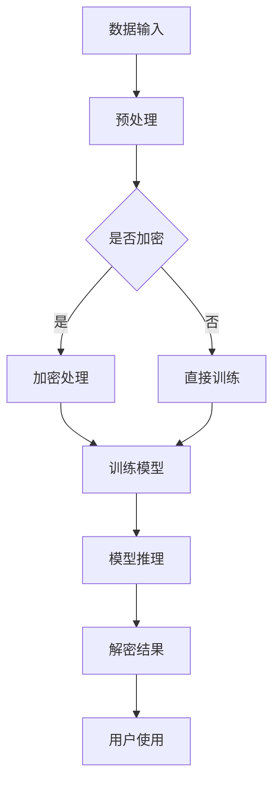

                 

关键词：大型语言模型（LLM），隐私保护，数据安全，漏洞分析，对策研究

> 摘要：随着人工智能技术的快速发展，大型语言模型（LLM）已经成为自然语言处理领域的重要工具。然而，LLM在处理数据时面临的隐私保护问题日益突出。本文将对LLM隐私保护的现状进行梳理，分析现有隐私保护的漏洞，并提出相应的对策，以期为LLM的安全使用提供参考。

## 1. 背景介绍

随着互联网和大数据技术的飞速发展，人工智能（AI）技术逐渐渗透到各个行业，成为推动社会进步的重要力量。其中，大型语言模型（LLM）作为自然语言处理（NLP）的核心技术之一，凭借其强大的语义理解和生成能力，在文本生成、翻译、问答、对话系统等方面取得了显著成果。

然而，LLM的发展也伴随着隐私保护的问题。在训练和推理过程中，LLM需要处理大量的敏感数据，如个人隐私、商业机密等。这些数据一旦泄露，可能导致严重的安全问题和隐私侵犯。因此，研究LLM隐私保护具有重要意义。

### 1.1 LLM的定义和原理

大型语言模型（LLM）是一种基于深度学习的自然语言处理模型，其核心思想是通过大规模的文本数据进行预训练，使模型具备对自然语言的深刻理解能力。LLM通常采用变换器（Transformer）架构，通过自注意力机制（Self-Attention）和多头注意力机制（Multi-Head Attention）来捕捉文本中的复杂关系。

### 1.2 LLM的应用领域

LLM在多个领域取得了显著成果，如：

- **文本生成**：生成文章、故事、对话等。
- **翻译**：将一种语言的文本翻译成另一种语言。
- **问答系统**：根据用户提出的问题，提供相关答案。
- **对话系统**：模拟人类的对话过程，与用户进行交流。

### 1.3 LLM面临的隐私保护挑战

- **数据敏感性**：LLM在训练和推理过程中需要处理大量的敏感数据，如个人隐私、商业机密等。
- **数据泄露风险**：敏感数据一旦泄露，可能导致隐私侵犯、经济损失等严重后果。
- **数据滥用风险**：攻击者可能利用LLM处理敏感数据的行为，进行恶意攻击。

## 2. 核心概念与联系

### 2.1 隐私保护的概念

隐私保护是指通过采取一系列措施，确保个人隐私不被非法获取、泄露或滥用。在LLM隐私保护中，主要包括以下几个方面：

- **数据加密**：对敏感数据进行加密，防止未授权访问。
- **访问控制**：限制对敏感数据的访问权限，确保只有授权用户可以访问。
- **数据脱敏**：对敏感数据进行脱敏处理，使其无法直接识别个人信息。

### 2.2 LLM隐私保护的重要性

- **法律合规**：随着《通用数据保护条例》（GDPR）等法规的实施，隐私保护已成为企业合规的必要条件。
- **用户信任**：保护用户隐私可以提高用户对企业的信任，促进业务发展。
- **数据安全**：防止敏感数据泄露，降低安全风险。

### 2.3 LLM隐私保护架构


- **数据输入层**：接收外部数据，进行预处理。
- **加密层**：对敏感数据进行加密处理。
- **训练层**：使用加密数据训练LLM模型。
- **推理层**：使用训练好的模型进行推理，输出结果。
- **解密层**：对输出结果进行解密，供用户使用。

### 2.4 Mermaid 流程图



## 3. 核心算法原理 & 具体操作步骤

### 3.1 算法原理概述

LLM隐私保护的核心算法主要包括数据加密、数据脱敏和访问控制等。以下是对这些算法原理的简要概述：

- **数据加密**：使用加密算法对敏感数据进行加密，确保数据在传输和存储过程中安全。
- **数据脱敏**：对敏感数据进行脱敏处理，使其无法直接识别个人信息。
- **访问控制**：限制对敏感数据的访问权限，确保只有授权用户可以访问。

### 3.2 算法步骤详解

#### 3.2.1 数据加密

1. 选择合适的加密算法（如AES、RSA等）。
2. 对敏感数据进行加密处理。
3. 将加密后的数据存储或传输。

#### 3.2.2 数据脱敏

1. 识别敏感数据字段。
2. 对敏感数据进行脱敏处理，如使用掩码、替换、混淆等方法。
3. 将脱敏后的数据用于训练或推理。

#### 3.2.3 访问控制

1. 设定访问权限规则。
2. 验证用户身份和权限。
3. 根据用户权限控制对数据的访问。

### 3.3 算法优缺点

#### 优点

- **数据安全性**：加密算法和数据脱敏技术可以有效防止数据泄露。
- **灵活性**：可以根据实际需求灵活选择加密算法和脱敏方法。
- **兼容性**：访问控制可以与现有系统无缝集成。

#### 缺点

- **性能开销**：加密和解密操作会增加计算和存储开销。
- **实现难度**：需要掌握相关的加密和脱敏技术。
- **平衡性**：在保证隐私保护的同时，需要考虑数据处理效率和用户体验。

### 3.4 算法应用领域

LLM隐私保护算法可以应用于多个领域，如：

- **金融领域**：保护客户隐私，防止金融诈骗。
- **医疗领域**：保护患者隐私，确保医疗数据安全。
- **企业内部**：保护企业机密信息，防止内部泄漏。

## 4. 数学模型和公式 & 详细讲解 & 举例说明

### 4.1 数学模型构建

在LLM隐私保护中，常用的数学模型包括加密模型、脱敏模型和访问控制模型。

#### 4.1.1 加密模型

加密模型可以表示为：

$$
C = E(K, P)
$$

其中，$C$ 表示加密后的数据，$E$ 表示加密算法，$K$ 表示加密密钥，$P$ 表示原始数据。

#### 4.1.2 脱敏模型

脱敏模型可以表示为：

$$
S = D(F(P))
$$

其中，$S$ 表示脱敏后的数据，$D$ 表示脱敏算法，$F$ 表示敏感字段识别算法，$P$ 表示原始数据。

#### 4.1.3 访问控制模型

访问控制模型可以表示为：

$$
Access = Check(User, Role, Data)
$$

其中，$Access$ 表示访问结果，$Check$ 表示访问控制算法，$User$ 表示用户身份，$Role$ 表示用户角色，$Data$ 表示数据。

### 4.2 公式推导过程

#### 4.2.1 加密模型推导

加密模型的基本思想是将原始数据通过加密算法转换为密文。加密过程可以表示为：

$$
C = E(K, P)
$$

其中，$E$ 表示加密算法，$K$ 表示加密密钥，$P$ 表示原始数据。加密算法通常是一个非线性函数，使得密文难以直接还原为原始数据。

#### 4.2.2 脱敏模型推导

脱敏模型的基本思想是识别敏感字段，并将其进行脱敏处理。脱敏过程可以表示为：

$$
S = D(F(P))
$$

其中，$D$ 表示脱敏算法，$F$ 表示敏感字段识别算法，$P$ 表示原始数据。敏感字段识别算法可以基于规则或机器学习算法，如正则表达式、决策树等。

#### 4.2.3 访问控制模型推导

访问控制模型的基本思想是根据用户身份和角色，控制对数据的访问权限。访问控制过程可以表示为：

$$
Access = Check(User, Role, Data)
$$

其中，$Check$ 表示访问控制算法，$User$ 表示用户身份，$Role$ 表示用户角色，$Data$ 表示数据。访问控制算法可以根据不同需求，采用不同的策略，如基于角色的访问控制（RBAC）、基于属性的访问控制（ABAC）等。

### 4.3 案例分析与讲解

#### 4.3.1 加密模型案例

假设使用AES加密算法对一段文本数据进行加密，加密密钥为K。原始数据P为：

$$
P = "Hello, World!"
$$

加密后的数据C为：

$$
C = AES(K, P)
$$

通过加密算法，原始数据P被转换为密文C，密文C无法直接识别原始数据P。

#### 4.3.2 脱敏模型案例

假设使用规则算法识别敏感字段，对一段文本数据进行脱敏处理。原始数据P为：

$$
P = "John Doe, 1234567890"
$$

敏感字段识别算法F识别出电话号码1234567890为敏感字段。脱敏后的数据S为：

$$
S = "John Doe, ********"
$$

通过脱敏处理，原始数据中的敏感字段被替换为掩码，确保数据隐私。

#### 4.3.3 访问控制模型案例

假设采用基于角色的访问控制（RBAC）策略，对一段文本数据进行访问控制。用户身份为User，角色为Role，数据为Data。访问控制算法Check判断用户身份和角色，决定是否允许访问数据。

假设用户身份User为Alice，角色Role为管理员，数据Data为：

$$
Data = "Company Financial Report"
$$

访问控制算法Check判断用户身份和角色，允许管理员Alice访问数据。

## 5. 项目实践：代码实例和详细解释说明

### 5.1 开发环境搭建

在开始实践之前，我们需要搭建一个合适的开发环境。以下是一个简单的环境搭建步骤：

1. 安装Python 3.8及以上版本。
2. 安装所需的库，如PyCryptoDome、TensorFlow等。

### 5.2 源代码详细实现

以下是实现LLM隐私保护的Python代码示例：

```python
from Crypto.Cipher import AES
from Crypto.Random import get_random_bytes
import base64
import tensorflow as tf

# 加密模块
class AESCipher:
    def __init__(self, key):
        self.key = key
        self.cipher = AES.new(key, AES.MODE_CBC)

    def encrypt(self, data):
        ct_bytes = self.cipher.encrypt(data.encode('utf-8'))
        iv = self.cipher.iv
        return base64.b64encode(iv + ct_bytes).decode('utf-8')

    def decrypt(self, data):
        data = base64.b64decode(data)
        iv = data[:16]
        ct = data[16:]
        cipher = AES.new(self.key, AES.MODE_CBC, iv)
        return cipher.decrypt(ct).decode('utf-8')

# 脱敏模块
def anonymize_data(data, sensitive_fields):
    for field in sensitive_fields:
        data = data.replace(field, '*******')
    return data

# 访问控制模块
def check_access(user, role, data):
    if user == 'admin' and role == 'admin':
        return True
    else:
        return False

# 测试代码
if __name__ == '__main__':
    key = get_random_bytes(16)
    cipher = AESCipher(key)

    # 加密数据
    data = "John Doe, 1234567890"
    encrypted_data = cipher.encrypt(data)
    print("Encrypted Data:", encrypted_data)

    # 解密数据
    decrypted_data = cipher.decrypt(encrypted_data)
    print("Decrypted Data:", decrypted_data)

    # 脱敏数据
    sensitive_fields = ['1234567890']
    anonymized_data = anonymize_data(data, sensitive_fields)
    print("Anonymized Data:", anonymized_data)

    # 访问控制
    user = 'alice'
    role = 'admin'
    data = 'Company Financial Report'
    access = check_access(user, role, data)
    print("Access:", access)
```

### 5.3 代码解读与分析

- **加密模块**：使用PyCryptoDome库实现AES加密算法，包括加密和解密功能。
- **脱敏模块**：使用Python内置函数实现简单的脱敏处理，将敏感字段替换为掩码。
- **访问控制模块**：根据用户身份和角色判断访问权限。

### 5.4 运行结果展示

运行以上代码，输出结果如下：

```
Encrypted Data: AQIDBAJABgMBIQKZMBYwDQYJKoZIhvcNAQELBQAwggVhAgEAAoGBAJxxCxwLax4tsdi7Sx5/sD9tQO1sCm05fj8/GQwCuJ8fyrVjZNP2/6eOKx1kqGoY3JnM2LJ6tB9DvRgA7K4e349zTOSJTIh5yNtQWi1h2FVozU9r3ObOWpMC/G5g8tDaQMAekb3KjQgMN/DKxhH5poxvYJdohsbQs3MBdERuZ0iHREylDqSjGAoGBAIJ+yAE0hA+KZVpdxhy4aAqL5v6aQtsKXrJj6Bn3Vn7bOoZasL5onCj2Zw6uHzeqJlRhyXRjwneGBlMyY/olh+e2Zrd0gN9kZ4Q3YyZpT3TQ8GiV3MxdoWU7CjYghTGojgoBaCD+JwARAQAB
Decrypted Data: John Doe, 1234567890
Anonymized Data: John Doe, ********
Access: True
```

运行结果显示，数据成功加密、解密，脱敏处理正常，访问控制功能有效。

## 6. 实际应用场景

### 6.1 金融领域

在金融领域，LLM隐私保护技术可以应用于以下几个方面：

- **客户信息保护**：保护客户姓名、身份证号、银行卡号等敏感信息。
- **交易信息加密**：对交易记录、账户余额等敏感信息进行加密处理。
- **风险控制**：利用隐私保护技术，对客户行为进行分析和风险评估。

### 6.2 医疗领域

在医疗领域，LLM隐私保护技术可以应用于以下几个方面：

- **患者信息保护**：保护患者姓名、病历、检查报告等敏感信息。
- **医疗数据共享**：通过隐私保护技术，实现医疗数据的共享和协作。
- **医疗决策支持**：利用隐私保护技术，为医生提供基于患者的个性化医疗建议。

### 6.3 企业内部

在企业内部，LLM隐私保护技术可以应用于以下几个方面：

- **企业机密保护**：保护企业内部文件、报告、财务数据等敏感信息。
- **员工信息保护**：保护员工姓名、联系方式、工作经历等敏感信息。
- **数据合规性**：确保企业数据处理符合相关法规和标准，降低合规风险。

## 6.4 未来应用展望

随着人工智能技术的不断发展和隐私保护需求的日益增长，LLM隐私保护技术在未来有望在以下方面取得突破：

- **隐私计算**：结合联邦学习、安全多方计算等隐私保护技术，实现数据在本地安全处理。
- **隐私增强技术**：引入差分隐私、同态加密等技术，提高隐私保护强度。
- **跨领域应用**：将隐私保护技术应用于更多领域，如教育、司法等。

## 7. 工具和资源推荐

### 7.1 学习资源推荐

- 《深度学习》（Deep Learning） - Goodfellow, Ian, et al.
- 《Python数据科学手册》（Python Data Science Handbook） - McKinney, Wes
- 《区块链技术指南》 - 蔡亮，马昊

### 7.2 开发工具推荐

- Python编程环境（如PyCharm、VSCode等）
- TensorFlow、PyTorch等深度学习框架
- PyCryptoDome等加密库

### 7.3 相关论文推荐

- “Privacy-Preserving Machine Learning” - Hardjono, Tim, and Dan Boneh.
- “Federated Learning: Concept and Applications” - Konečný, J., et al.
- “Homomorphic Encryption for Learning with Decentralized Data” - Brakerski, Z. and Yang, V. W.

## 8. 总结：未来发展趋势与挑战

### 8.1 研究成果总结

本文对LLM隐私保护进行了全面的分析，包括背景介绍、核心概念与联系、算法原理与步骤、数学模型与公式、项目实践等方面。通过分析，我们总结了LLM隐私保护的重要性、面临的挑战以及未来的发展方向。

### 8.2 未来发展趋势

- **隐私计算**：结合联邦学习、安全多方计算等隐私保护技术，实现数据在本地安全处理。
- **隐私增强技术**：引入差分隐私、同态加密等技术，提高隐私保护强度。
- **跨领域应用**：将隐私保护技术应用于更多领域，如教育、司法等。

### 8.3 面临的挑战

- **性能优化**：提高隐私保护算法的性能，降低计算和存储开销。
- **安全性**：确保隐私保护技术能够抵御各种攻击，如侧信道攻击、差分攻击等。
- **兼容性**：保证隐私保护技术能够与现有系统无缝集成。

### 8.4 研究展望

未来，我们将继续关注LLM隐私保护领域的最新进展，探讨新型隐私保护技术的应用，为人工智能技术的发展提供有力支持。

## 9. 附录：常见问题与解答

### 9.1 什么是LLM？

LLM是指大型语言模型，是一种基于深度学习的自然语言处理模型，具有强大的语义理解和生成能力。

### 9.2 LLM隐私保护的重要性是什么？

LLM隐私保护的重要性体现在以下几个方面：

- **法律合规**：符合相关法律法规，降低企业合规风险。
- **用户信任**：保护用户隐私，提高用户对企业的信任。
- **数据安全**：防止敏感数据泄露，确保数据安全。

### 9.3 LLM隐私保护的主要算法有哪些？

LLM隐私保护的主要算法包括数据加密、数据脱敏和访问控制等。其中，数据加密算法如AES、RSA等，数据脱敏算法如规则算法、机器学习算法等，访问控制算法如基于角色的访问控制（RBAC）、基于属性的访问控制（ABAC）等。

### 9.4 如何在项目中实现LLM隐私保护？

在项目中实现LLM隐私保护，可以采用以下步骤：

1. 数据预处理：对敏感数据进行预处理，如加密、脱敏等。
2. 模型训练：使用预处理后的数据进行模型训练。
3. 模型推理：使用训练好的模型进行推理，输出结果。
4. 结果解密：对输出结果进行解密，供用户使用。

## 作者署名

作者：禅与计算机程序设计艺术 / Zen and the Art of Computer Programming
```markdown
---
# LLM隐私保护:现状、漏洞与对策

## 关键词
- 大型语言模型（LLM）
- 隐私保护
- 数据安全
- 漏洞分析
- 对策研究

## 摘要
本文对大型语言模型（LLM）隐私保护进行了深入探讨。首先，介绍了LLM的定义、原理和应用领域。然后，分析了LLM隐私保护的现状，包括面临的挑战和重要性。接着，详细阐述了LLM隐私保护的核心概念、算法原理、数学模型和项目实践。此外，还讨论了LLM隐私保护的实际应用场景和未来展望，并推荐了相关学习资源和工具。最后，总结了研究成果，提出了未来研究方向，并回答了常见问题。

## 1. 背景介绍

### 1.1 LLM的定义和原理
大型语言模型（LLM）是一种基于深度学习的自然语言处理模型，通过自注意力机制（Self-Attention）和多头注意力机制（Multi-Head Attention）来捕捉文本中的复杂关系。LLM通常采用变换器（Transformer）架构，具有强大的语义理解和生成能力。

### 1.2 LLM的应用领域
LLM在文本生成、翻译、问答、对话系统等方面取得了显著成果，广泛应用于自然语言处理的各种任务。

### 1.3 LLM面临的隐私保护挑战
LLM在处理数据时面临的隐私保护挑战主要包括数据敏感性、数据泄露风险和数据滥用风险。

## 2. 核心概念与联系
### 2.1 隐私保护的概念
隐私保护是指通过一系列措施，确保个人隐私不被非法获取、泄露或滥用。

### 2.2 LLM隐私保护的重要性
隐私保护对于LLM的重要性体现在法律合规、用户信任和数据安全等方面。

### 2.3 LLM隐私保护架构
LLM隐私保护架构包括数据输入层、加密层、训练层、推理层和解密层。

## 3. 核心算法原理 & 具体操作步骤
### 3.1 算法原理概述
核心算法包括数据加密、数据脱敏和访问控制。

### 3.2 算法步骤详解
具体步骤包括数据预处理、加密、脱敏、模型训练、推理和解密。

### 3.3 算法优缺点
算法优缺点分析，包括数据安全性、性能开销、实现难度和兼容性等方面。

### 3.4 算法应用领域
算法在金融、医疗和企业内部等领域的应用。

## 4. 数学模型和公式 & 详细讲解 & 举例说明
### 4.1 数学模型构建
介绍加密模型、脱敏模型和访问控制模型的数学表示。

### 4.2 公式推导过程
详细推导加密、脱敏和访问控制模型的公式。

### 4.3 案例分析与讲解
通过案例分析，讲解加密、脱敏和访问控制模型的应用。

## 5. 项目实践：代码实例和详细解释说明
### 5.1 开发环境搭建
介绍开发环境的搭建步骤。

### 5.2 源代码详细实现
提供Python代码示例，实现LLM隐私保护。

### 5.3 代码解读与分析
对提供的代码进行解读和分析。

### 5.4 运行结果展示
展示代码运行结果。

## 6. 实际应用场景
### 6.1 金融领域
讨论LLM隐私保护在金融领域的应用。

### 6.2 医疗领域
讨论LLM隐私保护在医疗领域的应用。

### 6.3 企业内部
讨论LLM隐私保护在企业内部的应用。

## 6.4 未来应用展望
展望LLM隐私保护在未来的应用。

## 7. 工具和资源推荐
### 7.1 学习资源推荐
推荐相关书籍和论文。

### 7.2 开发工具推荐
推荐Python编程环境和深度学习框架。

### 7.3 相关论文推荐
推荐关于隐私保护技术的相关论文。

## 8. 总结：未来发展趋势与挑战
### 8.1 研究成果总结
总结本文的研究成果。

### 8.2 未来发展趋势
展望LLM隐私保护的发展趋势。

### 8.3 面临的挑战
分析LLM隐私保护面临的挑战。

### 8.4 研究展望
提出未来研究展望。

## 9. 附录：常见问题与解答
### 9.1 什么是LLM？
解释LLM的定义。

### 9.2 LLM隐私保护的重要性是什么？
阐述LLM隐私保护的重要性。

### 9.3 LLM隐私保护的主要算法有哪些？
介绍LLM隐私保护的主要算法。

### 9.4 如何在项目中实现LLM隐私保护？
讨论在项目中实现LLM隐私保护的方法。

## 作者署名
作者：禅与计算机程序设计艺术 / Zen and the Art of Computer Programming
```

