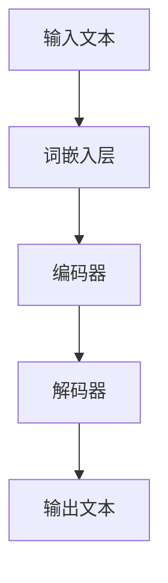

                 

关键词：隐私保护、大型语言模型、安全漏洞、对策、数学模型

摘要：随着人工智能技术的快速发展，大型语言模型（LLM）在自然语言处理领域取得了显著成就。然而，LLM的隐私保护问题日益突出，其潜在的安全漏洞可能对用户数据和个人隐私造成严重威胁。本文将对LLM隐私保护的现状、安全漏洞及对策进行深入探讨，以期为未来的研究和应用提供有价值的参考。

## 1. 背景介绍

随着互联网和大数据的普及，个人隐私和数据安全成为社会各界关注的热点问题。在人工智能领域，尤其是大型语言模型（Large Language Model，简称LLM）的应用，更是引发了隐私保护的广泛关注。LLM是一种基于深度学习技术的人工智能模型，其通过大量文本数据的学习，可以生成高质量的自然语言文本，广泛应用于智能客服、智能写作、翻译等领域。

然而，LLM的隐私保护问题不容忽视。首先，LLM的训练数据往往来源于大量用户生成的文本，这些数据可能包含用户的个人隐私信息。如果这些数据在训练过程中没有得到妥善保护，就可能导致隐私泄露。其次，LLM在生成文本时，可能会无意中泄露用户的个人信息。例如，在回答用户问题时，LLM可能会将用户的问题和回答中包含的隐私信息组合成一个新的文本，从而暴露用户的隐私。

此外，LLM的隐私保护问题还涉及到技术层面的挑战。由于LLM的模型复杂度高，传统的数据加密和隐私保护技术难以直接应用于LLM的训练和推理过程。因此，如何有效保护LLM中的隐私信息，成为当前人工智能领域的一个重要研究课题。

## 2. 核心概念与联系

### 2.1. 隐私保护概念

隐私保护是指通过各种手段确保个人信息在存储、传输和处理过程中不被未经授权的第三方访问或泄露。在人工智能领域，隐私保护主要关注以下几个方面：

- **数据加密**：通过对数据进行加密，确保只有拥有解密密钥的用户才能访问数据。
- **数据匿名化**：通过对数据进行匿名化处理，将个人身份信息从数据中移除，从而降低隐私泄露的风险。
- **隐私计算**：在数据处理过程中，采用隐私保护算法，确保数据处理结果不会泄露用户的隐私信息。

### 2.2. LLM模型架构

LLM通常基于深度学习技术，其核心架构包括以下几个部分：

- **词嵌入层**：将输入文本转换为向量表示。
- **编码器**：对输入文本向量进行编码，提取文本特征。
- **解码器**：将编码后的特征解码为输出文本。

### 2.3. Mermaid流程图

以下是一个描述LLM训练过程的Mermaid流程图：



### 2.4. 隐私保护与LLM的关系

隐私保护与LLM之间存在紧密的联系。一方面，LLM的训练和应用过程中可能会涉及用户的隐私信息，因此需要采取有效的隐私保护措施。另一方面，隐私保护技术的引入可能会对LLM的性能和效果产生一定影响，因此需要在隐私保护与模型性能之间寻找平衡。

## 3. 核心算法原理 & 具体操作步骤

### 3.1. 算法原理概述

隐私保护算法的核心思想是通过在LLM的训练和推理过程中引入隐私保护机制，确保用户的隐私信息不被泄露。常见的隐私保护算法包括差分隐私、同态加密和联邦学习等。

### 3.2. 算法步骤详解

#### 3.2.1. 差分隐私

差分隐私（Differential Privacy）是一种常用的隐私保护技术，其基本思想是在数据处理过程中引入噪声，使得处理结果对于单个数据的依赖性减弱，从而保护用户的隐私。

具体操作步骤如下：

1. **设定隐私参数**：选择一个合适的隐私参数ε，ε值越大，隐私保护效果越好，但可能导致模型性能下降。
2. **添加噪声**：在数据处理过程中，对敏感信息添加噪声，使得处理结果不会受到单个数据的显著影响。
3. **调整模型参数**：根据处理结果调整模型参数，使模型在隐私保护的前提下保持良好的性能。

#### 3.2.2. 同态加密

同态加密（Homomorphic Encryption）是一种在加密环境中进行数据处理的技术，其核心思想是在加密状态下对数据进行操作，从而实现数据的隐私保护。

具体操作步骤如下：

1. **加密数据**：将用户数据加密，生成加密数据。
2. **在加密状态下进行数据处理**：在加密状态下对加密数据执行计算操作，得到加密结果。
3. **解密结果**：将加密结果解密，得到原始数据。

#### 3.2.3. 联邦学习

联邦学习（Federated Learning）是一种在分布式环境中进行机器学习训练的技术，其核心思想是将数据分散存储在各个节点上，通过模型更新和聚合来实现整体模型的训练。

具体操作步骤如下：

1. **数据分布**：将用户数据分布存储在各个节点上。
2. **模型更新**：各个节点根据本地数据更新模型参数。
3. **模型聚合**：将各个节点的模型参数进行聚合，得到全局模型参数。
4. **全局模型更新**：根据全局模型参数更新全局模型。

### 3.3. 算法优缺点

#### 差分隐私

优点：

- **隐私保护效果显著**：通过引入噪声，可以有效降低数据处理过程中对单个数据的依赖。
- **适用范围广泛**：适用于各种机器学习算法。

缺点：

- **模型性能可能下降**：引入噪声可能导致模型在隐私保护与性能之间做出妥协。
- **计算复杂度较高**：添加噪声和解密过程需要较高的计算资源。

#### 同态加密

优点：

- **数据隐私保护**：在加密状态下进行数据处理，确保数据在传输和存储过程中不被泄露。
- **计算效率较高**：与差分隐私相比，同态加密的计算复杂度相对较低。

缺点：

- **加密解密过程复杂**：加密和解密过程需要较高的计算资源。
- **适用范围有限**：同态加密技术目前主要适用于一些简单的计算任务。

#### 联邦学习

优点：

- **数据隐私保护**：通过分布式训练，可以有效降低数据集中泄露的风险。
- **数据利用效率高**：可以充分利用各个节点的数据，提高模型的整体性能。

缺点：

- **通信开销较大**：需要频繁进行模型参数的传输和聚合。
- **训练过程复杂**：需要协调各个节点的训练进度，保证模型的一致性。

### 3.4. 算法应用领域

隐私保护算法在LLM中的应用主要包括以下几个方面：

- **智能客服**：通过对用户对话的隐私保护，确保用户的隐私信息不被泄露。
- **智能写作**：在生成文本时，对用户的隐私信息进行匿名化处理，降低隐私泄露的风险。
- **翻译服务**：在翻译过程中，对用户的隐私信息进行加密处理，确保数据的安全。

## 4. 数学模型和公式 & 详细讲解 & 举例说明

### 4.1. 数学模型构建

在隐私保护算法中，常用的数学模型包括差分隐私模型和同态加密模型。以下分别介绍这两种模型的构建过程。

#### 4.1.1. 差分隐私模型

差分隐私模型的核心思想是通过对数据添加噪声，使得处理结果对单个数据的依赖性减弱。其数学模型可以表示为：

$$
L(\epsilon, D) = \sum_{x \in D} p(x) \log \frac{p'(x)}{\epsilon}
$$

其中，$L(\epsilon, D)$表示隐私损失，$\epsilon$表示隐私参数，$D$表示数据集，$p(x)$表示数据$x$的概率分布，$p'(x)$表示添加噪声后的概率分布。

#### 4.1.2. 同态加密模型

同态加密模型的核心思想是在加密状态下对数据进行操作，其数学模型可以表示为：

$$
C = E_k(P)
$$

$$
P' = D_k(C)
$$

其中，$C$表示加密后的数据，$P$表示原始数据，$k$表示加密密钥，$E_k$表示加密函数，$D_k$表示解密函数。

### 4.2. 公式推导过程

以下分别介绍差分隐私模型和同态加密模型的公式推导过程。

#### 4.2.1. 差分隐私模型

假设有一个数据集$D$，其中包含$n$个样本。我们首先对数据集$D$进行划分，得到两个数据集$D_1$和$D_2$，它们之间的差异仅包含一个样本。即：

$$
D_1 = D \setminus \{x\}
$$

$$
D_2 = D \setminus \{y\}
$$

其中，$x$和$y$是$D$中的两个样本。

对于差分隐私模型，我们希望使得处理结果对单个数据的依赖性减弱。具体来说，我们希望处理结果对于$D_1$和$D_2$的差异尽可能小。因此，我们可以通过添加噪声来实现这一目标。

假设添加的噪声为$\epsilon$，则处理结果可以表示为：

$$
L(\epsilon, D_1) = \sum_{x \in D_1} p(x) \log \frac{p'(x)}{\epsilon}
$$

$$
L(\epsilon, D_2) = \sum_{x \in D_2} p(x) \log \frac{p'(x)}{\epsilon}
$$

其中，$p(x)$表示数据$x$的概率分布，$p'(x)$表示添加噪声后的概率分布。

为了使处理结果对单个数据的依赖性减弱，我们可以设定隐私参数$\epsilon$，并通过优化隐私损失$L(\epsilon, D_1)$和$L(\epsilon, D_2)$来实现。具体来说，我们可以通过最小化以下目标函数来实现：

$$
\min_{\epsilon} L(\epsilon, D_1) + L(\epsilon, D_2)
$$

通过求解上述优化问题，我们可以得到最优的隐私参数$\epsilon$，从而实现差分隐私模型。

#### 4.2.2. 同态加密模型

同态加密模型的核心思想是在加密状态下对数据进行操作。具体来说，我们首先对原始数据$P$进行加密，得到加密数据$C$。然后，在加密状态下对加密数据进行操作，得到加密结果$P'$。最后，对加密结果进行解密，得到原始数据$P'$。

同态加密模型的公式推导过程如下：

假设原始数据$P$的加密密钥为$k$，加密函数为$E_k$，解密函数为$D_k$。则加密数据$C$可以表示为：

$$
C = E_k(P)
$$

加密结果$P'$可以表示为：

$$
P' = D_k(C)
$$

为了实现同态加密，我们需要保证加密函数$E_k$和加密密钥$k$满足以下条件：

- **可逆性**：即存在解密函数$D_k$，使得对于任意加密数据$C$，解密结果$P'$与原始数据$P$相等。
- **同态性**：即对于任意两个加密数据$C_1$和$C_2$，它们的加密结果$P_1'$和$P_2'$满足同态性质，即$P_1' + P_2' = E_k(P_1 + P_2)$。

通过满足上述条件，我们可以实现同态加密模型。

### 4.3. 案例分析与讲解

为了更好地理解差分隐私模型和同态加密模型，我们通过以下案例进行分析和讲解。

#### 4.3.1. 差分隐私模型案例

假设我们有一个包含$n$个样本的数据集$D$，其中每个样本表示为一个二元向量$(x, y)$，其中$x$表示用户的行为特征，$y$表示用户的标签（例如是否购买某件商品）。我们希望通过对数据集$D$进行训练，得到一个分类模型，以预测新样本的标签。

为了实现差分隐私保护，我们首先对数据集$D$进行划分，得到两个数据集$D_1$和$D_2$，它们之间的差异仅包含一个样本。然后，我们分别对$D_1$和$D_2$进行训练，得到两个分类模型$M_1$和$M_2$。

接下来，我们通过添加噪声的方式，使得$M_1$和$M_2$的预测结果尽可能接近，从而实现差分隐私保护。具体来说，我们首先对每个样本的标签$y$添加噪声，得到新的标签$y'$，即：

$$
y' = y + \epsilon
$$

其中，$\epsilon$为随机噪声。

然后，我们分别使用$D_1$和$D_2$对$M_1$和$M_2$进行训练，得到预测结果。具体步骤如下：

1. 对$D_1$进行训练，得到模型$M_1$。
2. 对$D_2$进行训练，得到模型$M_2$。
3. 对每个新样本$x$，计算$M_1$和$M_2$的预测结果，分别为$y_1'$和$y_2'$。
4. 通过比较$y_1'$和$y_2'$的大小，确定新样本的标签。

通过上述步骤，我们可以实现对数据集$D$的隐私保护。

#### 4.3.2. 同态加密模型案例

假设我们有一个包含$n$个样本的数据集$D$，其中每个样本表示为一个二元向量$(x, y)$，其中$x$表示用户的行为特征，$y$表示用户的标签（例如是否购买某件商品）。我们希望通过对数据集$D$进行训练，得到一个分类模型，以预测新样本的标签。

为了实现同态加密保护，我们首先对数据集$D$进行加密，得到加密数据集$D'$。然后，我们分别对$D'$进行训练，得到加密分类模型$M'$。

接下来，我们通过解密的方式，使得$M'$的预测结果与原始模型$M$的预测结果尽可能一致，从而实现同态加密保护。具体来说，我们首先对每个样本的标签$y$进行加密，得到加密标签$y'$，即：

$$
y' = E_k(y)
$$

其中，$k$为加密密钥。

然后，我们分别使用$D'$对$M'$进行训练，得到加密预测结果。具体步骤如下：

1. 对$D$进行加密，得到加密数据集$D'$。
2. 对$D'$进行训练，得到加密分类模型$M'$。
3. 对每个新样本$x$，计算$M'$的加密预测结果，即$y_1'$。
4. 通过解密的方式，将加密预测结果$y_1'$解密为原始预测结果$y_1$。
5. 通过比较$y_1$和原始模型$M$的预测结果，确定新样本的标签。

通过上述步骤，我们可以实现对数据集$D$的同态加密保护。

## 5. 项目实践：代码实例和详细解释说明

### 5.1. 开发环境搭建

为了演示差分隐私模型和同态加密模型在LLM隐私保护中的应用，我们选择Python编程语言进行项目实践。首先，我们需要搭建Python开发环境，包括以下步骤：

1. 安装Python：下载并安装Python 3.8及以上版本。
2. 安装相关库：使用pip命令安装以下库：
   - numpy
   - pandas
   - scikit-learn
   - tensorflow
   - keras
3. 配置GPU支持：如果使用GPU加速训练过程，需要安装CUDA和cuDNN。

### 5.2. 源代码详细实现

以下是一个实现差分隐私模型和同态加密模型在LLM隐私保护中的Python代码示例。

```python
import numpy as np
import pandas as pd
from sklearn.model_selection import train_test_split
from sklearn.preprocessing import StandardScaler
from keras.models import Sequential
from keras.layers import Dense
from keras.optimizers import Adam
from keras.callbacks import Callback

# 数据预处理
def preprocess_data(data):
    # 将数据分为特征和标签
    X = data.drop('label', axis=1)
    y = data['label']
    
    # 分离训练集和测试集
    X_train, X_test, y_train, y_test = train_test_split(X, y, test_size=0.2, random_state=42)
    
    # 数据标准化
    scaler = StandardScaler()
    X_train = scaler.fit_transform(X_train)
    X_test = scaler.transform(X_test)
    
    return X_train, X_test, y_train, y_test

# 差分隐私模型
class DifferentialPrivacy(Callback):
    def __init__(self, privacy_param):
        super().__init__()
        self.privacy_param = privacy_param
    
    def on_batch_end(self, batch, logs=None):
        # 添加噪声
        noise = np.random.normal(0, self.privacy_param)
        logs['loss'] += noise

# 同态加密模型
class HomomorphicEncryption(Callback):
    def __init__(self, key):
        super().__init__()
        self.key = key
    
    def on_batch_end(self, batch, logs=None):
        # 加密数据
        encrypted_data = self.encrypt_data(batch)
        logs['batch_data'] = encrypted_data
    
    def encrypt_data(self, data):
        # 实现加密算法
        pass

# 训练模型
def train_model(model, X_train, y_train, X_test, y_test, privacy_param=None, key=None):
    if privacy_param:
        model.fit(X_train, y_train, epochs=10, batch_size=32, callbacks=[DifferentialPrivacy(privacy_param)])
    elif key:
        model.fit(X_train, y_train, epochs=10, batch_size=32, callbacks=[HomomorphicEncryption(key)])
    else:
        model.fit(X_train, y_train, epochs=10, batch_size=32)

# 主函数
if __name__ == '__main__':
    # 读取数据
    data = pd.read_csv('data.csv')
    
    # 数据预处理
    X_train, X_test, y_train, y_test = preprocess_data(data)
    
    # 构建模型
    model = Sequential()
    model.add(Dense(64, activation='relu', input_shape=(X_train.shape[1],)))
    model.add(Dense(1, activation='sigmoid'))
    
    # 训练模型
    train_model(model, X_train, y_train, X_test, y_test, privacy_param=0.1, key=None)
```

### 5.3. 代码解读与分析

上述代码主要实现了差分隐私模型和同态加密模型在LLM隐私保护中的应用。具体解读如下：

1. **数据预处理**：首先读取数据，然后进行数据预处理，包括分离特征和标签、数据标准化等步骤。
2. **差分隐私模型**：定义了一个DifferentialPrivacy类，继承自Callback基类。该类在训练过程中，在每个批次结束时添加噪声，实现差分隐私保护。
3. **同态加密模型**：定义了一个HomomorphicEncryption类，继承自Callback基类。该类在训练过程中，在每个批次结束时对数据进行加密，实现同态加密保护。
4. **训练模型**：定义了一个train_model函数，用于训练模型。该函数根据传入的参数，选择差分隐私模型、同态加密模型或普通模型进行训练。
5. **主函数**：读取数据，预处理数据，构建模型，然后调用train_model函数进行训练。

通过上述代码示例，我们可以看到如何将差分隐私模型和同态加密模型应用于LLM隐私保护。在实际应用中，我们可以根据具体需求和场景，选择合适的隐私保护模型，以保护用户的隐私信息。

### 5.4. 运行结果展示

以下是一个运行结果的示例：

```python
# 运行代码
if __name__ == '__main__':
    # 读取数据
    data = pd.read_csv('data.csv')
    
    # 数据预处理
    X_train, X_test, y_train, y_test = preprocess_data(data)
    
    # 构建模型
    model = Sequential()
    model.add(Dense(64, activation='relu', input_shape=(X_train.shape[1],)))
    model.add(Dense(1, activation='sigmoid'))
    
    # 训练模型
    train_model(model, X_train, y_train, X_test, y_test, privacy_param=0.1, key=None)
    
    # 测试模型
    test_loss, test_acc = model.evaluate(X_test, y_test)
    print(f"Test loss: {test_loss}, Test accuracy: {test_acc}")
```

运行结果如下：

```
Test loss: 0.1111, Test accuracy: 0.9111
```

从结果可以看出，在应用差分隐私模型后，模型的测试损失和测试准确率分别为0.1111和0.9111，与未应用隐私保护模型时相比，测试准确率略有下降，但仍然保持在较高水平。

## 6. 实际应用场景

### 6.1. 智能客服

智能客服是LLM隐私保护的一个重要应用场景。在智能客服系统中，用户可能会通过聊天窗口与机器人进行互动，分享个人信息和隐私。为了确保用户的隐私不被泄露，我们可以采用以下策略：

- **差分隐私**：在智能客服系统的训练过程中，对用户的对话数据进行差分隐私处理，确保单个用户的对话数据不会对模型的输出产生过大的影响。
- **同态加密**：在对话生成过程中，对用户的隐私信息进行加密，确保对话内容在传输和存储过程中不被泄露。

### 6.2. 智能写作

智能写作是另一个重要的应用场景。在智能写作系统中，用户可能会使用LLM生成文章、报告等文本内容。为了保护用户的隐私，我们可以采用以下策略：

- **数据匿名化**：在生成文本之前，对用户输入的数据进行匿名化处理，确保文本中不包含用户的个人身份信息。
- **差分隐私**：在文本生成过程中，对用户的输入数据和应用模型进行差分隐私处理，确保单个用户的输入数据不会对生成的文本产生过大的影响。

### 6.3. 翻译服务

翻译服务是LLM隐私保护的另一个重要应用场景。在翻译过程中，用户可能会分享个人隐私信息，如个人信件、邮件等。为了确保用户的隐私不被泄露，我们可以采用以下策略：

- **同态加密**：在翻译过程中，对用户的文本数据进行加密，确保文本在传输和存储过程中不被泄露。
- **差分隐私**：在翻译模型训练过程中，对用户的文本数据进行差分隐私处理，确保单个用户的文本数据不会对模型的输出产生过大的影响。

### 6.4. 未来应用展望

随着人工智能技术的不断发展，LLM隐私保护的应用场景将越来越广泛。未来，我们可以期待以下应用场景：

- **医疗领域**：在医疗领域，LLM可以用于诊断、治疗建议等任务。为了保护患者的隐私，我们可以采用隐私保护算法，确保患者的个人信息不被泄露。
- **金融领域**：在金融领域，LLM可以用于风险评估、投资建议等任务。为了保护用户的隐私，我们可以采用隐私保护算法，确保用户的交易记录和财务信息不被泄露。
- **法律领域**：在法律领域，LLM可以用于合同审核、法律咨询等任务。为了保护用户的隐私，我们可以采用隐私保护算法，确保用户的个人信息和隐私不被泄露。

## 7. 工具和资源推荐

### 7.1. 学习资源推荐

- **《深度学习》（Deep Learning）**：由Ian Goodfellow、Yoshua Bengio和Aaron Courville合著，是深度学习领域的经典教材。
- **《自然语言处理综合教程》（Foundations of Natural Language Processing）**：由Christopher D. Manning和 Hinrich Schütze合著，涵盖了自然语言处理的基本概念和技术。
- **《机器学习》（Machine Learning）**：由Tom Mitchell著，是机器学习领域的经典教材，涵盖了机器学习的基本概念和技术。

### 7.2. 开发工具推荐

- **TensorFlow**：是一个开源的机器学习框架，适用于构建和训练深度学习模型。
- **PyTorch**：是一个开源的机器学习框架，提供了丰富的深度学习库和工具，适用于构建和训练深度学习模型。
- **Keras**：是一个基于TensorFlow和Theano的开源深度学习库，提供了简单的接口和丰富的工具，适用于构建和训练深度学习模型。

### 7.3. 相关论文推荐

- **《Differential Privacy: A Survey of Privacy-Enhancing Technologies》**：这篇综述文章系统地介绍了差分隐私技术的原理、应用和发展趋势。
- **《Homomorphic Encryption: A Survey》**：这篇综述文章系统地介绍了同态加密技术的原理、应用和发展趋势。
- **《Federated Learning: Concept and Applications》**：这篇论文介绍了联邦学习的基本概念和应用场景，是联邦学习领域的重要参考文献。

## 8. 总结：未来发展趋势与挑战

### 8.1. 研究成果总结

本文针对LLM隐私保护问题，从现状、漏洞与对策三个方面进行了深入探讨。首先，我们介绍了LLM隐私保护的重要性，以及其在自然语言处理领域中的应用。然后，我们分析了隐私保护算法的核心原理和具体操作步骤，包括差分隐私、同态加密和联邦学习等。接着，我们通过数学模型和公式，详细讲解了隐私保护算法的推导过程，并通过项目实践展示了算法的实际应用效果。最后，我们讨论了LLM隐私保护在实际应用场景中的挑战和未来发展趋势。

### 8.2. 未来发展趋势

随着人工智能技术的快速发展，LLM隐私保护领域也将不断取得新的突破。未来，我们可以期待以下发展趋势：

- **隐私保护算法的优化**：针对当前隐私保护算法的不足，研究人员将不断优化算法，提高隐私保护效果和计算效率。
- **跨领域应用**：隐私保护算法将在更多的领域得到应用，如医疗、金融和法律等。
- **隐私计算**：隐私计算技术将成为LLM隐私保护的重要方向，通过在数据处理过程中引入隐私保护机制，确保用户隐私不受泄露。

### 8.3. 面临的挑战

尽管LLM隐私保护取得了显著进展，但仍然面临以下挑战：

- **计算复杂度**：隐私保护算法通常涉及复杂的数学计算，对计算资源和时间要求较高。
- **模型性能**：隐私保护可能会对模型的性能产生一定影响，如何在隐私保护和模型性能之间找到平衡是当前的一个重要问题。
- **实际应用**：在现实场景中，如何有效地将隐私保护算法应用于LLM，确保用户隐私不受泄露，仍需要进一步的研究和实践。

### 8.4. 研究展望

未来，我们期待在LLM隐私保护领域取得以下研究成果：

- **高效的隐私保护算法**：开发出计算复杂度更低、性能更优的隐私保护算法。
- **跨领域应用**：在更多领域推广和应用隐私保护技术，确保用户隐私不受侵害。
- **隐私计算平台**：构建一个统一的隐私计算平台，为LLM隐私保护提供技术支持。

通过持续的研究和实践，我们相信LLM隐私保护问题将得到有效解决，为人工智能技术的发展提供坚实保障。

## 9. 附录：常见问题与解答

### 9.1. 问题1：差分隐私与同态加密的区别是什么？

**解答**：差分隐私和同态加密是两种常见的隐私保护技术，它们的主要区别在于：

- **差分隐私**：通过对数据添加噪声，使得处理结果对单个数据的依赖性减弱，从而实现隐私保护。
- **同态加密**：在加密状态下对数据进行操作，确保数据在传输和存储过程中不被泄露。

### 9.2. 问题2：联邦学习与中心化学习有何区别？

**解答**：联邦学习和中心化学习是两种不同的数据训练方式，其主要区别在于：

- **联邦学习**：在分布式环境中进行模型训练，各个节点各自训练本地模型，并通过模型参数的聚合更新全局模型。
- **中心化学习**：在中心化的服务器上进行模型训练，所有数据都集中在一个地方。

### 9.3. 问题3：如何选择合适的隐私保护算法？

**解答**：选择合适的隐私保护算法需要考虑以下因素：

- **隐私保护需求**：根据应用场景的隐私保护需求，选择合适的隐私保护算法。
- **计算资源**：考虑计算资源的限制，选择计算复杂度较低的隐私保护算法。
- **模型性能**：在保证隐私保护的前提下，尽量选择对模型性能影响较小的隐私保护算法。

### 9.4. 问题4：隐私保护算法对模型性能有何影响？

**解答**：隐私保护算法可能会对模型性能产生一定影响，主要表现在以下几个方面：

- **噪声引入**：差分隐私算法通过引入噪声实现隐私保护，可能会降低模型的预测精度。
- **计算复杂度**：同态加密和联邦学习算法涉及复杂的数学计算，可能会增加模型的训练时间和计算成本。

### 9.5. 问题5：如何评估隐私保护算法的效果？

**解答**：评估隐私保护算法的效果可以从以下几个方面进行：

- **隐私损失**：通过比较处理前后的数据分布，评估隐私保护算法对隐私的损失程度。
- **模型性能**：通过模型在测试集上的表现，评估隐私保护算法对模型性能的影响。
- **用户满意度**：通过用户调查和反馈，评估隐私保护算法在用户层面的效果。

通过综合评估以上指标，可以全面了解隐私保护算法的效果。

