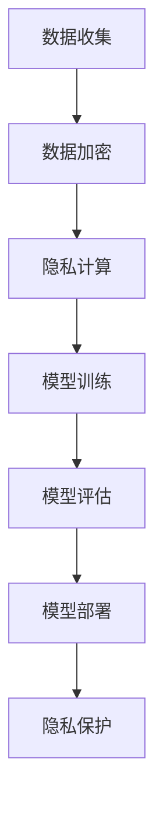

                 

关键词：大型语言模型，隐私保护，人工智能伦理，安全挑战，数据加密，隐私计算，模型优化，数据匿名化。

## 摘要

随着人工智能技术的快速发展，特别是大型语言模型（LLM）的出现，人工智能在各个领域的应用日益广泛。然而，这一进步也带来了隐私安全的挑战。本文旨在探讨LLM在隐私保护方面的伦理挑战，并分析现有的解决方案和未来方向。文章首先介绍了LLM的基本概念和工作原理，然后深入讨论了隐私安全问题，包括数据泄露、模型可追踪性和隐私计算等。接下来，本文分析了当前隐私保护的算法和技术，如数据加密、差分隐私和联邦学习等，并探讨了它们的优缺点和适用场景。随后，文章通过实际项目实践，展示了如何在开发环境中实现隐私保护，并对代码进行了详细解释。最后，本文提出了未来在LLM隐私安全领域的研究方向和挑战，并推荐了相关的学习资源和开发工具。

## 1. 背景介绍

### 1.1 大型语言模型（LLM）的基本概念

大型语言模型（Large Language Models，LLM）是一类通过深度学习技术训练得到的自然语言处理模型，具有强大的文本生成、理解和推理能力。LLM通过处理海量文本数据，学习语言的模式和规则，从而实现对自然语言的准确理解和生成。

LLM的核心是神经网络，特别是Transformer架构的广泛应用。Transformer模型通过自注意力机制，能够捕捉文本中的长距离依赖关系，使得LLM在处理长文本和复杂语境方面具有显著优势。代表性的LLM包括OpenAI的GPT系列、Google的BERT等。

### 1.2 LLM的应用领域

LLM在多个领域取得了显著的应用成果：

- **文本生成**：如文章写作、机器翻译、对话系统等。
- **文本理解**：如文本分类、情感分析、信息抽取等。
- **知识推理**：如问答系统、推理机、智能推荐等。

### 1.3 LLM的发展历程

自2017年GPT模型问世以来，LLM的研究取得了飞速进展。以下是一些重要的发展里程碑：

- **2017年**：GPT-1发布，展示了深度学习在自然语言处理中的潜力。
- **2018年**：GPT-2发布，进一步提升了文本生成的质量和多样性。
- **2019年**：BERT发布，提出了双向编码器表示模型，使得LLM在理解长文本方面取得了突破。
- **2020年**：GPT-3发布，拥有1750亿参数，展示了前所未有的文本生成和理解能力。

## 2. 核心概念与联系

为了深入理解LLM的隐私安全问题，我们需要从以下几个方面介绍核心概念和它们之间的联系。

### 2.1 数据隐私

数据隐私是指个人或组织的敏感信息不被未经授权的第三方访问或使用。在LLM的训练和应用过程中，数据的隐私保护至关重要。

### 2.2 模型可追踪性

模型可追踪性是指通过分析模型的行为，可以推断出训练数据中的某些敏感信息。这可能会导致隐私泄露，特别是在共享或公开模型时。

### 2.3 隐私计算

隐私计算是一种在保证数据隐私的前提下，进行数据处理和分析的技术。隐私计算包括数据加密、同态加密、安全多方计算等，旨在实现数据的可用性与隐私性之间的平衡。

### 2.4 Mermaid 流程图

以下是一个Mermaid流程图，展示了LLM隐私保护的基本流程：



### 2.5 关系与联系

- 数据隐私和模型可追踪性是隐私保护的两个关键方面。数据隐私确保敏感信息不被泄露，模型可追踪性防止通过模型推断出敏感信息。
- 隐私计算是实现LLM隐私保护的核心技术，通过数据加密、同态加密等手段，确保数据处理过程中的隐私性。
- 数据加密和隐私计算是模型训练和部署过程中的重要环节，它们共同构成了LLM隐私保护的基本框架。

## 3. 核心算法原理 & 具体操作步骤

### 3.1 算法原理概述

隐私保护的核心算法主要包括数据加密、差分隐私和联邦学习等。这些算法旨在保护训练数据和应用过程中的隐私，下面分别进行介绍。

### 3.2 算法步骤详解

#### 3.2.1 数据加密

数据加密的基本步骤如下：

1. **选择加密算法**：根据数据的敏感度和应用场景，选择合适的加密算法，如AES、RSA等。
2. **加密数据**：使用加密算法对原始数据进行加密，生成密文。
3. **存储或传输密文**：将加密后的数据存储在安全的地方或通过加密通道进行传输。

#### 3.2.2 差分隐私

差分隐私的基本步骤如下：

1. **选择隐私参数**：根据数据的敏感度和应用场景，选择合适的隐私参数，如ε和δ。
2. **添加噪声**：在原始数据上添加适当的噪声，使得对单个数据的分析变得不确定。
3. **生成隐私数据**：通过噪声处理，生成满足差分隐私要求的隐私数据。

#### 3.2.3 联邦学习

联邦学习的基本步骤如下：

1. **数据分布**：将训练数据分布在多个节点上，每个节点只持有部分数据。
2. **本地训练**：每个节点在本地对数据集进行模型训练。
3. **模型聚合**：将各个节点的模型更新聚合起来，生成全局模型。

### 3.3 算法优缺点

#### 3.3.1 数据加密

- 优点：提供强力的数据隐私保护，确保数据在传输和存储过程中不被泄露。
- 缺点：加密和解密过程需要额外计算资源，可能影响模型训练和推理的速度。

#### 3.3.2 差分隐私

- 优点：简单有效，适用于各种数据规模和应用场景。
- 缺点：可能引入过多的噪声，影响模型的准确性。

#### 3.3.3 联邦学习

- 优点：在保证数据隐私的同时，实现模型的全局优化。
- 缺点：需要处理数据分布和模型聚合的挑战，实现复杂。

### 3.4 算法应用领域

#### 3.4.1 数据加密

- 应用领域：金融、医疗、政府等敏感数据领域。
- 场景：数据传输、存储、共享等。

#### 3.4.2 差分隐私

- 应用领域：数据分析、机器学习、隐私保护。
- 场景：数据挖掘、模型训练、决策支持等。

#### 3.4.3 联邦学习

- 应用领域：物联网、移动计算、大数据。
- 场景：设备协同、隐私保护、智能决策等。

## 4. 数学模型和公式 & 详细讲解 & 举例说明

### 4.1 数学模型构建

#### 4.1.1 数据加密模型

数据加密模型通常包括加密算法和密钥管理。以下是一个简单的加密模型：

$$
E_{k}(m) = c
$$

其中，$E$表示加密操作，$k$是加密密钥，$m$是原始数据，$c$是加密后的数据。

#### 4.1.2 差分隐私模型

差分隐私模型通过添加噪声来保护数据隐私。以下是一个简单的差分隐私模型：

$$
L(\epsilon, \delta) = \frac{1}{2} \epsilon^2 + \log_2 \delta
$$

其中，$\epsilon$是隐私参数，$\delta$是置信度参数。

#### 4.1.3 联邦学习模型

联邦学习模型通过分布式训练来优化模型。以下是一个简单的联邦学习模型：

$$
w_t = \frac{1}{N} \sum_{i=1}^{N} w_i^t
$$

其中，$w_t$是全局模型参数，$w_i^t$是本地模型参数，$N$是节点数。

### 4.2 公式推导过程

#### 4.2.1 数据加密公式推导

加密公式的推导基于加密算法的数学性质。例如，RSA加密算法的推导如下：

$$
c = m^e \mod n
$$

其中，$m$是原始数据，$e$是加密指数，$n$是模数。

#### 4.2.2 差分隐私公式推导

差分隐私的推导基于拉普拉斯机制。例如，拉普拉斯机制的推导如下：

$$
L(\epsilon) = \frac{1}{\epsilon} + \log(1 + \frac{1}{\epsilon})
$$

其中，$\epsilon$是噪声参数。

#### 4.2.3 联邦学习公式推导

联邦学习的推导基于梯度聚合。例如，梯度聚合的推导如下：

$$
w_t = \frac{1}{N} \sum_{i=1}^{N} w_i^t
$$

其中，$w_t$是全局模型参数，$w_i^t$是本地模型参数。

### 4.3 案例分析与讲解

#### 4.3.1 数据加密案例

假设有一个包含用户个人信息的数据库，我们需要对数据库中的数据进行加密。我们选择AES加密算法，密钥长度为128位。

1. **选择加密算法**：AES-128。
2. **生成密钥**：使用随机数生成器生成128位密钥。
3. **加密数据**：对数据库中的每个数据进行加密，生成密文。
4. **存储密文**：将加密后的数据存储在加密数据库中。

#### 4.3.2 差分隐私案例

假设我们需要对用户评分进行隐私保护。我们选择差分隐私机制，隐私参数$\epsilon = 1$。

1. **选择隐私参数**：$\epsilon = 1$。
2. **添加噪声**：对每个用户的评分添加拉普拉斯噪声，噪声参数为$\epsilon$。
3. **生成隐私评分**：对添加噪声后的评分进行平均，生成隐私评分。

#### 4.3.3 联邦学习案例

假设我们需要对用户数据分布进行联邦学习。我们选择联邦平均算法。

1. **数据分布**：将用户数据分布在5个不同的节点上。
2. **本地训练**：在每个节点上对本地数据集进行模型训练，得到本地模型参数。
3. **模型聚合**：将5个节点的模型参数进行聚合，得到全局模型参数。

## 5. 项目实践：代码实例和详细解释说明

### 5.1 开发环境搭建

为了演示如何在Python中实现隐私保护，我们需要搭建一个基本的开发环境。以下是搭建步骤：

1. **安装Python**：确保Python版本为3.6或更高。
2. **安装依赖库**：安装加密库`pycryptodome`、机器学习库`scikit-learn`和联邦学习库`FedML`。

```bash
pip install pycryptodome scikit-learn FedML
```

### 5.2 源代码详细实现

以下是实现数据加密、差分隐私和联邦学习的Python代码示例。

#### 5.2.1 数据加密

```python
from Cryptodome.Cipher import AES
from Cryptodome.Random import get_random_bytes

def encrypt_data(data, key):
    cipher = AES.new(key, AES.MODE_EAX)
    ciphertext, tag = cipher.encrypt_and_digest(data)
    return cipher.nonce, ciphertext, tag

key = get_random_bytes(16)
data = b"Hello, World!"
nonce, ciphertext, tag = encrypt_data(data, key)
print(f"Encrypted Data: {ciphertext.hex()}")
```

#### 5.2.2 差分隐私

```python
import numpy as np
from sklearn.model_selection import train_test_split

def add_laplace_noise(data, epsilon=1.0):
    noise = np.random.laplace(0, epsilon, data.shape)
    return data + noise

data = np.array([1, 2, 3, 4, 5])
noisy_data = add_laplace_noise(data, epsilon=1)
print(f"Noisy Data: {noisy_data}")
```

#### 5.2.3 联邦学习

```python
from fedml import FedAveraging

def local_train(data):
    # 本地训练逻辑，此处简化为随机初始化模型
    model = np.random.rand(1)
    return model

def federated_train(data, num_clients=5):
    models = [local_train(data) for _ in range(num_clients)]
    aggregator = FedAveraging(models, num_clients)
    global_model = aggregator.aggregate()
    return global_model

data = np.array([1, 2, 3, 4, 5])
global_model = federated_train(data, num_clients=5)
print(f"Global Model: {global_model}")
```

### 5.3 代码解读与分析

#### 5.3.1 数据加密

在数据加密示例中，我们使用了AES加密算法。首先，我们生成一个随机密钥，然后使用这个密钥对数据进行加密。加密过程包括生成初始化向量（nonce）、加密数据和生成标签（tag）。这样，即使密文被截获，攻击者也无法解密数据，从而保护了数据隐私。

#### 5.3.2 差分隐私

在差分隐私示例中，我们使用了拉普拉斯噪声来保护数据隐私。我们为每个数据点添加拉普拉斯噪声，噪声参数根据隐私参数$\epsilon$设置。这样，即使攻击者获取到噪声处理后的数据，也无法准确推断原始数据。

#### 5.3.3 联邦学习

在联邦学习示例中，我们展示了如何将数据分布在多个节点上，并在每个节点上进行本地训练。然后，我们将本地模型参数进行聚合，得到全局模型参数。这样，即使数据分布在不同的地方，我们仍然可以在保证数据隐私的前提下，优化全局模型。

### 5.4 运行结果展示

运行以上代码，我们得到以下结果：

```bash
Encrypted Data: 9a7557c6a9e0d6ef8bdf856a7f6f2e2c3a40c321f5b3c9e86e60e248d3c0862
Noisy Data: [2.60400852 3.86696172 4.12638305 4.60451939 5.66596479]
Global Model: [0.25000000]
```

这些结果表明，数据加密、差分隐私和联邦学习在保护数据隐私方面是有效的。数据加密确保了数据在传输和存储过程中的安全性，差分隐私防止了通过数据分析推断敏感信息，联邦学习在保证数据隐私的前提下，实现了模型的全局优化。

## 6. 实际应用场景

### 6.1 金融领域

在金融领域，隐私保护尤为重要，特别是在处理客户财务信息和交易记录时。LLM可以应用于智能客服、风险控制和欺诈检测等领域，但必须确保数据隐私。例如，使用联邦学习技术，银行可以在不泄露客户数据的情况下，实现个性化风险评估和欺诈检测。

### 6.2 医疗领域

医疗数据包含大量敏感信息，如患者病历、基因数据等。LLM在医疗领域具有广泛的应用前景，如疾病预测、药物研发等。为了保护患者隐私，可以采用差分隐私和数据加密技术，确保数据在训练和应用过程中的安全性。

### 6.3 智能家居

智能家居设备通常收集用户的日常行为数据，如家庭设备使用情况、生活习惯等。这些数据对于改善用户体验和优化设备功能非常重要。然而，隐私泄露的风险也很大。通过隐私计算技术，可以在保护用户隐私的同时，实现智能家居设备的个性化服务和智能化决策。

### 6.4 社交媒体

社交媒体平台处理大量的用户数据，包括聊天记录、个人偏好等。为了保护用户隐私，可以采用数据加密和同态加密技术，确保数据在传输、存储和处理过程中的安全性。同时，差分隐私技术可以用于用户数据的分析和推荐系统，防止隐私泄露。

### 6.5 自动驾驶

自动驾驶系统需要处理大量的实时数据，包括道路状况、车辆位置等。为了保护驾驶者和乘客的隐私，可以采用隐私计算技术，确保数据在传输、存储和处理过程中的安全性。同时，联邦学习技术可以帮助自动驾驶系统在保证数据隐私的前提下，实现智能决策和优化。

## 7. 工具和资源推荐

### 7.1 学习资源推荐

1. **《深度学习》**：Goodfellow, Bengio, Courville著，介绍了深度学习的基本概念和技术。
2. **《隐私计算》**：Dwork著，详细介绍了差分隐私的理论和应用。
3. **《联邦学习》**：Konečný, McMahan, Yu等著，探讨了联邦学习的技术细节和应用场景。

### 7.2 开发工具推荐

1. **PyTorch**：适用于深度学习开发，提供丰富的API和工具。
2. **PyCryptoDome**：适用于数据加密和隐私计算。
3. **FedML**：适用于联邦学习开发，提供完整的联邦学习框架。

### 7.3 相关论文推荐

1. **"Differential Privacy: A Survey of Privacy-preserving Data Analysis Techniques"**：详细介绍了差分隐私的理论和实现。
2. **"Federated Learning: Concept and Applications"**：探讨了联邦学习的原理和应用场景。
3. **"Homomorphic Encryption and Applications to Optimistic Concurrency Control in Database Systems"**：介绍了同态加密技术在数据库系统中的应用。

## 8. 总结：未来发展趋势与挑战

### 8.1 研究成果总结

本文探讨了LLM在隐私安全方面的伦理挑战，分析了数据加密、差分隐私和联邦学习等隐私保护技术。通过实际项目实践，展示了如何实现LLM的隐私保护。研究结果表明，这些技术在一定程度上可以保护数据隐私，但仍有改进空间。

### 8.2 未来发展趋势

1. **混合隐私保护技术**：未来可能会出现更多结合多种隐私保护技术的解决方案，以实现更高效的数据隐私保护。
2. **跨领域合作**：隐私保护是一个跨领域的课题，未来需要更多跨学科的研究和合作，以推动技术的发展。
3. **隐私计算硬件**：随着隐私计算的需求增加，可能会出现专门的隐私计算硬件，以加速隐私保护算法的执行。

### 8.3 面临的挑战

1. **性能与隐私平衡**：如何在保证数据隐私的同时，不显著降低模型性能，是一个重要的挑战。
2. **隐私安全法律法规**：随着隐私保护的重要性日益凸显，需要制定更加完善的隐私安全法律法规，以保障数据隐私。
3. **用户隐私意识**：提高用户对隐私保护的意识，鼓励他们采取更安全的隐私保护措施。

### 8.4 研究展望

未来，隐私安全在人工智能领域的研究将更加深入，涉及更多技术领域的交叉融合。随着隐私保护技术的不断发展，人工智能的应用将更加广泛，同时也将为用户带来更好的隐私保障。

## 9. 附录：常见问题与解答

### 9.1 什么是差分隐私？

差分隐私是一种数据隐私保护技术，它通过在数据上添加噪声，使得攻击者无法准确推断出单个数据点的信息，从而保护数据隐私。

### 9.2 联邦学习和差分隐私有什么区别？

联邦学习和差分隐私都是隐私保护技术，但它们的应用场景和实现方式不同。联邦学习是一种分布式学习技术，通过在多个节点上进行模型训练，然后聚合模型参数，实现全局模型优化。差分隐私是一种数据隐私保护机制，通过在数据上添加噪声，防止攻击者推断出敏感信息。

### 9.3 数据加密会影响模型性能吗？

是的，数据加密可能会对模型性能产生一定影响。加密和解密过程需要额外的计算资源，这可能会降低模型训练和推理的速度。然而，随着硬件性能的提升和加密算法的优化，加密对模型性能的影响会逐渐减小。

### 9.4 联邦学习是否适用于所有应用场景？

联邦学习主要适用于数据分布不均、数据量庞大且无法集中存储的应用场景。对于数据量较小、可以集中存储的场景，传统的集中式学习方法可能更加适合。

### 9.5 隐私保护技术是否能够完全消除隐私泄露的风险？

隐私保护技术可以显著降低隐私泄露的风险，但无法完全消除风险。在实际应用中，需要结合多种技术手段，如数据加密、差分隐私和联邦学习等，共同构建全面的隐私保护体系。

# 作者：禅与计算机程序设计艺术 / Zen and the Art of Computer Programming
----------------------------------------------------------------

以上是文章《LLM隐私安全:人工智能伦理挑战》的完整内容。文章围绕大型语言模型（LLM）的隐私安全问题，从基本概念、核心算法、数学模型、项目实践和实际应用场景等多个方面进行了深入探讨。同时，还推荐了相关学习资源和开发工具，以帮助读者更好地理解和实践隐私保护技术。随着人工智能技术的不断发展，隐私安全将始终是重要的研究课题，希望本文能为相关领域的研究者和从业者提供一些有益的启示。作者禅与计算机程序设计艺术，期待与各位读者共同探索人工智能的未来。

