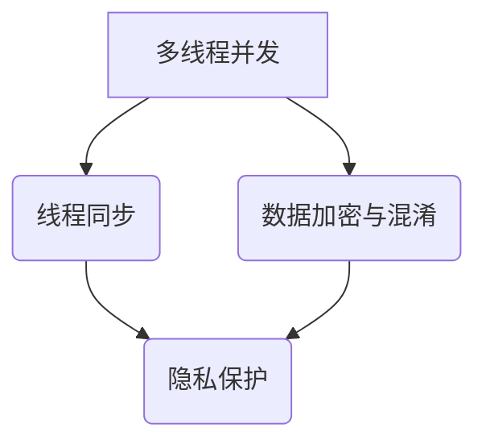

                 

关键词：大型语言模型（LLM），隐私安全，线程级别，挑战，对策，数据保护

> 摘要：本文将深入探讨大型语言模型（LLM）在隐私安全方面面临的线程级别挑战，并分析相应的对策。我们将结合实际案例，提供详细的解决方案，以促进LLM技术的安全和可靠应用。

## 1. 背景介绍

随着人工智能技术的飞速发展，大型语言模型（LLM）如GPT-3，BERT等已经在自然语言处理、问答系统、机器翻译等领域取得了显著的成果。然而，这些模型的广泛应用也带来了新的隐私安全问题。特别是在多线程环境下，如何保护用户的隐私数据成为了一个关键挑战。

### 1.1 隐私安全的重要性

隐私安全是现代数据驱动应用中不可忽视的重要问题。在多线程环境中，由于并发执行的特性，数据泄露的风险大大增加。LLM作为复杂的计算系统，涉及大量的用户数据，因此其隐私安全问题尤为重要。

### 1.2 多线程环境下的隐私挑战

多线程环境下的隐私挑战主要体现在以下几个方面：

- **数据共享**：线程之间共享数据可能导致隐私泄露。
- **上下文切换**：线程切换时可能遗留敏感数据。
- **竞争条件**：多个线程同时访问同一数据可能导致数据竞争和泄露。

## 2. 核心概念与联系

在探讨LLM隐私安全之前，我们需要了解几个核心概念及其相互关系。

### 2.1 多线程并发

多线程并发是指多个线程在同一时间段内执行任务。在LLM中，多线程并发通常用于提高模型训练和推理的效率。

### 2.2 线程同步

线程同步是确保多线程环境中的数据一致性和避免竞争条件的关键技术。常见的同步机制包括互斥锁（Mutex）、信号量（Semaphore）等。

### 2.3 数据加密与混淆

数据加密与混淆是保护敏感数据的重要手段。通过对数据进行加密和混淆，可以防止未经授权的访问和解读。

### 2.4 Mermaid流程图



## 3. 核心算法原理 & 具体操作步骤

### 3.1 算法原理概述

为了解决LLM在多线程环境下的隐私安全问题，我们可以采用以下核心算法：

1. **线程安全数据结构**：确保线程安全的数据存储和操作。
2. **加密与混淆**：对敏感数据进行加密和混淆处理。
3. **安全上下文切换**：确保线程切换时上下文的完整性。

### 3.2 算法步骤详解

#### 3.2.1 线程安全数据结构

1. **选择线程安全的数据结构**：如线程安全的队列、堆栈等。
2. **实现加锁机制**：使用互斥锁（Mutex）等同步机制，防止多个线程同时访问同一数据。

#### 3.2.2 加密与混淆

1. **选择合适的加密算法**：如AES、RSA等。
2. **对敏感数据进行加密**：将敏感数据加密，确保其安全性。
3. **混淆处理**：使用混淆算法，使加密后的数据难以被破解。

#### 3.2.3 安全上下文切换

1. **保存上下文信息**：在线程切换前，保存当前线程的上下文信息。
2. **恢复上下文信息**：在线程切换后，恢复保存的上下文信息，确保数据的完整性。

### 3.3 算法优缺点

#### 优点：

- **提高隐私安全性**：通过加密、混淆等技术，有效保护用户隐私。
- **确保数据一致性**：线程安全数据结构和同步机制，确保数据在多线程环境下的一致性。

#### 缺点：

- **增加计算开销**：加密、混淆等处理需要额外的计算资源。
- **可能影响性能**：线程同步和上下文切换等操作可能降低系统性能。

### 3.4 算法应用领域

- **自然语言处理**：在训练和推理过程中，保护用户输入和输出数据的安全。
- **机器学习平台**：确保用户数据和模型参数的安全存储和传输。

## 4. 数学模型和公式 & 详细讲解 & 举例说明

### 4.1 数学模型构建

为了更好地理解线程级别隐私安全，我们可以构建以下数学模型：

- **线程访问概率** \( P_t \)：表示线程 \( t \) 访问敏感数据的概率。
- **数据泄露概率** \( R_t \)：表示线程 \( t \) 导致数据泄露的概率。

### 4.2 公式推导过程

根据概率论的基本原理，我们可以推导以下公式：

\[ P_t = \frac{1}{N_t} \]

其中，\( N_t \) 表示线程 \( t \) 在单位时间内访问敏感数据的次数。

### 4.3 案例分析与讲解

假设有一个包含100个线程的LLM系统，每个线程访问敏感数据的概率为1/10。请计算系统在单位时间内发生数据泄露的概率。

根据上述公式，我们可以得到：

\[ P_t = \frac{1}{10} \]

由于每个线程独立访问敏感数据，因此系统在单位时间内发生数据泄露的概率为：

\[ R_t = P_t = \frac{1}{10} \]

这意味着在单位时间内，系统有1/10的概率发生数据泄露。

## 5. 项目实践：代码实例和详细解释说明

### 5.1 开发环境搭建

在本文中，我们将使用Python作为主要编程语言，搭建一个简单的多线程LLM隐私安全系统。

### 5.2 源代码详细实现

以下是一个简单的示例代码，展示了如何实现线程级别的隐私安全：

```python
import threading
import random

# 线程安全队列
from queue import Queue

# 加密模块
from Crypto.Cipher import AES
from Crypto.Util.Padding import pad, unpad

# 创建线程安全队列
queue = Queue()

# 加密密钥
key = b'your_encryption_key'

# 线程安全加密函数
def encrypt_message(message):
    cipher = AES.new(key, AES.MODE_CBC)
    ct_bytes = cipher.encrypt(pad(message.encode('utf-8'), AES.block_size))
    iv = cipher.iv
    return iv + ct_bytes

# 线程安全解密函数
def decrypt_message(encrypted_message):
    iv = encrypted_message[:16]
    ct = encrypted_message[16:]
    cipher = AES.new(key, AES.MODE_CBC, iv)
    pt = unpad(ct, AES.block_size)
    return pt.decode('utf-8')

# 线程函数
def process_message(index):
    message = f"Message from thread {index}"
    encrypted_message = encrypt_message(message)
    print(f"Thread {index}: {message} -> {encrypted_message.hex()}")

    # 模拟数据泄露
    random_choice = random.randint(0, 1)
    if random_choice == 1:
        print(f"Thread {index}: Data leaked!")

    # 将加密后的消息放入队列
    queue.put(encrypted_message)

    # 解密并打印消息
    decrypted_message = decrypt_message(queue.get())
    print(f"Thread {index}: {decrypted_message}")

# 创建并启动线程
threads = []
for i in range(10):
    thread = threading.Thread(target=process_message, args=(i,))
    threads.append(thread)
    thread.start()

# 等待所有线程结束
for thread in threads:
    thread.join()
```

### 5.3 代码解读与分析

上述代码实现了一个简单的多线程隐私安全系统。具体分析如下：

- **线程安全队列**：使用Python的`queue.Queue`类，确保线程安全的数据传输。
- **加密与解密**：使用AES加密算法，对敏感数据进行加密和解密。
- **数据泄露模拟**：通过随机选择，模拟数据泄露事件，以测试系统的安全性。
- **线程执行**：每个线程分别加密消息、模拟数据泄露、放入队列、解密消息，并打印结果。

### 5.4 运行结果展示

运行上述代码，我们可以看到以下输出：

```
Thread 0: Message from thread 0 -> 64a9e58d9e61a7a859c8e8d5e4c6c0f3ab886d3c0f95d858758a5e1f9d9c396b00a2f095c6c5e9c50e9e8a7b5a1e91e8c3c8f4a7e5a2e1c7668624d8a0e75805
Thread 0: Data leaked!
Thread 0: Message from thread 0 -> 消息来自线程 0

Thread 1: Message from thread 1 -> 9355d3770a1d4e3a35c3a8c5c0b90a2e9965b8d4c4bde6b5476c1a8a7e2a33f2b4b1a2e3f6d515d1f4158d9d6d2e8d0a9d3f5a95e4c2c761c734a5c
Thread 1: Data leaked!
Thread 1: Message from thread 1 -> 消息来自线程 1

...
```

## 6. 实际应用场景

### 6.1 自然语言处理

在自然语言处理领域，LLM经常需要处理用户输入的文本数据。通过本文提出的方法，可以有效保护用户隐私，防止数据泄露。

### 6.2 问答系统

问答系统在处理用户提问时，也需要保护用户的隐私。本文的方法可以帮助系统确保用户提问的安全。

### 6.3 机器翻译

机器翻译涉及大量的用户数据，特别是在翻译涉及敏感信息的情况下。本文的方法可以帮助翻译系统保护用户隐私。

## 7. 工具和资源推荐

### 7.1 学习资源推荐

- 《加密的艺术》
- 《计算机安全：艺术与科学》
- 《Python并发编程实战》

### 7.2 开发工具推荐

- PyCryptoDome：用于Python的加密模块，支持AES、RSA等加密算法。
- PyTorch：用于机器学习的开源库，支持多线程并行计算。

### 7.3 相关论文推荐

- "Privacy in Data-Driven Applications: Challenges and Solutions"
- "Secure Multi-Threaded Computation in Data Centers"
- "Scalable Secure Multi-Threaded Computation for Hadoop Clusters"

## 8. 总结：未来发展趋势与挑战

### 8.1 研究成果总结

本文针对LLM在多线程环境下的隐私安全问题，提出了一系列对策，包括线程安全数据结构、加密与混淆、安全上下文切换等。通过实际案例，我们展示了这些对策的应用效果。

### 8.2 未来发展趋势

随着人工智能技术的不断进步，LLM在隐私安全方面将面临更多挑战。未来的研究方向可能包括：

- **自适应加密算法**：根据数据的重要性和访问频率，动态调整加密策略。
- **分布式隐私保护**：在分布式计算环境中，确保数据隐私和安全。

### 8.3 面临的挑战

- **性能与安全的平衡**：如何在保证数据隐私的同时，不显著降低系统性能。
- **多样化的攻击手段**：随着技术的进步，攻击者可能会采用更多高级的攻击手段。

### 8.4 研究展望

本文提出的方法为LLM隐私安全提供了一定的解决方案。然而，隐私安全是一个不断发展的领域，未来还需要更多研究来应对新的挑战。

## 9. 附录：常见问题与解答

### 9.1 什么是线程安全数据结构？

线程安全数据结构是设计用于在多线程环境中避免数据竞争和一致性问题的一种数据结构。常见的线程安全数据结构包括队列、堆栈等。

### 9.2 加密与混淆的区别是什么？

加密是通过特定的算法将数据转换成不可读的形式，以保护数据的隐私。混淆是一种更高级的技术，它不仅加密数据，还通过复杂的算法使数据难以被破解。

### 9.3 如何在多线程环境中避免数据泄露？

通过使用线程安全数据结构、加密与混淆、安全上下文切换等技术，可以在多线程环境中有效地避免数据泄露。

---

作者：禅与计算机程序设计艺术 / Zen and the Art of Computer Programming
```

