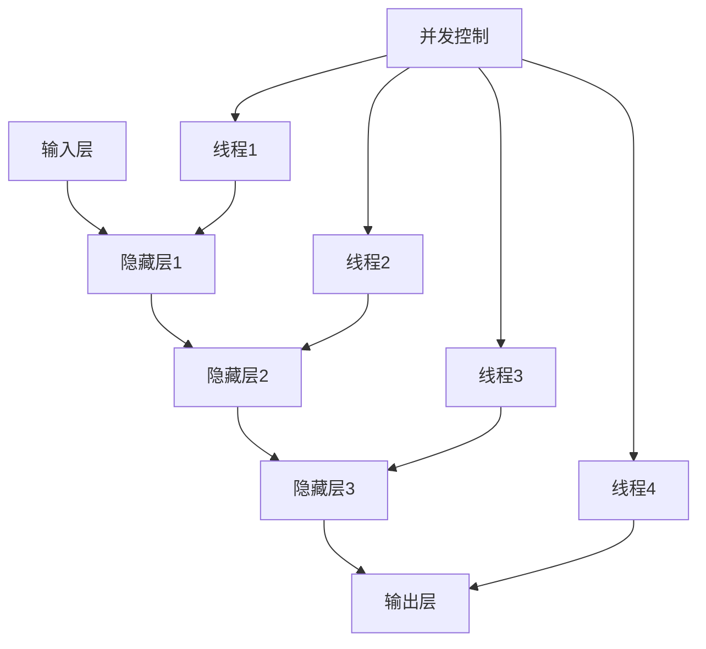

                 

关键词：大型语言模型（LLM），隐私保护，线程安全，漏洞修复，安全性分析，算法优化，技术应用

## 摘要

随着人工智能技术的不断发展，大型语言模型（LLM）如GPT-3、BERT等已成为各行各业的重要工具。然而，这些强大模型的隐私漏洞问题逐渐成为关注的焦点。本文将深入探讨LLM中线程安全问题，分析其潜在风险，并提出相应的解决方案。通过全面的技术分析和实践，本文旨在为提升LLM隐私安全性提供有益的参考。

## 1. 背景介绍

### 1.1 大型语言模型（LLM）的兴起

近年来，深度学习和自然语言处理技术的快速发展，催生了大型语言模型（LLM）的崛起。LLM具有强大的语言理解和生成能力，可以应用于文本生成、机器翻译、问答系统等多个领域。其中，GPT-3、BERT等模型更是引起了广泛关注。这些模型通过训练大规模的神经网络，能够自动学习语言中的复杂规律和语义信息，从而实现高效的语言理解和生成。

### 1.2 隐私保护的重要性

随着人工智能技术的广泛应用，用户隐私保护问题日益凸显。大型语言模型在处理用户数据时，往往需要访问和存储大量的个人隐私信息。如果这些信息得不到妥善保护，可能会导致数据泄露、隐私侵犯等严重后果。因此，如何在保障模型性能的同时，确保用户隐私安全，成为人工智能领域亟待解决的问题。

### 1.3 线程安全的重要性

线程安全是指在多线程环境下，程序能够正确、高效地运行，并避免数据竞争、死锁等问题。对于大型语言模型来说，线程安全至关重要。因为LLM通常涉及到大量的数据处理和计算任务，多线程并行执行可以显著提高模型的运行效率。然而，不当的线程管理可能导致线程安全问题，进而影响模型的安全性和稳定性。

## 2. 核心概念与联系

为了更好地理解LLM中的线程安全问题，我们首先需要介绍一些核心概念和它们之间的联系。

### 2.1 大型语言模型的架构

大型语言模型通常采用深度神经网络（DNN）架构，其中主要包括输入层、隐藏层和输出层。输入层接收自然语言文本，隐藏层通过多层神经网络进行特征提取和表示学习，输出层生成目标文本或进行分类任务。

### 2.2 线程与并发

在计算机科学中，线程是一种轻量级执行单元，可以与进程并发执行。线程并发可以显著提高程序的执行效率，但同时也引入了线程安全问题，如数据竞争、死锁等。

### 2.3 线程安全与并发控制

线程安全是指在多线程环境中，程序能够正确、高效地运行，并避免数据竞争、死锁等问题。为了实现线程安全，需要采用并发控制机制，如互斥锁、信号量等。

### 2.4 数据共享与隔离

在多线程环境下，数据共享和隔离是确保线程安全的关键。数据共享可以充分利用线程并行性，提高程序性能；而数据隔离则可以避免数据竞争和死锁等问题。

### 2.5 Mermaid 流程图

下面是一个用于描述大型语言模型架构与线程安全关系的 Mermaid 流程图：



## 3. 核心算法原理 & 具体操作步骤

### 3.1 算法原理概述

在LLM中，线程安全问题主要涉及数据竞争和死锁等问题。为了解决这些问题，我们需要采用并发控制和数据隔离等机制。

#### 3.1.1 并发控制

并发控制是指通过限制线程对共享资源的访问，防止数据竞争和死锁等问题。常用的并发控制机制包括：

- **互斥锁（Mutex）**：互斥锁可以确保同一时刻只有一个线程能够访问共享资源，从而避免数据竞争。
- **信号量（Semaphore）**：信号量是一种计数同步机制，可以控制线程对共享资源的访问次数。
- **读写锁（Read-Write Lock）**：读写锁允许多个线程同时读取共享资源，但只有当没有线程写入时，才能进行写入操作。

#### 3.1.2 数据隔离

数据隔离是指通过将共享数据划分为多个独立的部分，避免数据竞争和死锁等问题。常用的数据隔离方法包括：

- **线程局部存储（Thread Local Storage, TLS）**：TLS可以为每个线程创建独立的变量副本，从而实现数据隔离。
- **内存分配器（Memory Allocator）**：内存分配器可以分配独立的内存空间，为每个线程提供独立的内存区域。
- **共享内存（Shared Memory）**：共享内存可以为多个线程提供同一内存区域，但需要采用并发控制机制，确保数据一致性。

### 3.2 算法步骤详解

#### 3.2.1 初始化

- 初始化线程池，设置线程数量和并发控制机制。
- 创建共享内存和数据结构，初始化线程局部存储。

#### 3.2.2 数据处理

- 将输入数据划分为多个独立的部分，分发给线程池中的线程。
- 每个线程对分配到的数据进行处理，更新共享内存中的数据。
- 采用并发控制机制，确保线程对共享资源的正确访问。

#### 3.2.3 结果合并

- 将线程处理的结果进行合并，生成最终输出。
- 对合并结果进行校验，确保数据的一致性和正确性。

### 3.3 算法优缺点

#### 3.3.1 优点

- 提高程序性能：通过并发控制和数据隔离，可以实现多线程并行执行，提高程序性能。
- 灵活性：采用线程局部存储和内存分配器等方法，可以灵活地实现数据隔离，减少锁竞争。

#### 3.3.2 缺点

- 增加复杂度：实现线程安全和并发控制需要额外的代码和资源，增加程序复杂度。
- 数据一致性：在多线程环境下，确保数据一致性是关键挑战，需要采用合适的并发控制机制。

### 3.4 算法应用领域

- **机器学习**：在机器学习中，线程安全对于提高训练效率至关重要。
- **自然语言处理**：在自然语言处理任务中，线程安全可以确保模型在不同任务中的正确性和稳定性。
- **大数据处理**：在大数据处理领域，线程安全可以提高数据处理效率，降低系统风险。

## 4. 数学模型和公式 & 详细讲解 & 举例说明

### 4.1 数学模型构建

为了更好地理解LLM中的线程安全问题，我们引入一个简化的数学模型。假设我们有一个由三个线程（T1、T2、T3）组成的线程池，每个线程都需要访问一个共享变量`X`。为了确保线程安全，我们采用互斥锁来控制对`X`的访问。

### 4.2 公式推导过程

我们定义以下公式来描述线程对共享变量`X`的访问：

- \( X_{init} \)：初始共享变量值
- \( X_{T1} \)：线程T1对共享变量`X`的更新值
- \( X_{T2} \)：线程T2对共享变量`X`的更新值
- \( X_{T3} \)：线程T3对共享变量`X`的更新值

为了推导线程安全条件，我们需要分析以下情况：

1. **线程T1访问共享变量`X`**：

   \( X_{T1} = X_{init} + 1 \)

2. **线程T2访问共享变量`X`**：

   \( X_{T2} = X_{init} + 2 \)

3. **线程T3访问共享变量`X`**：

   \( X_{T3} = X_{init} + 3 \)

为了确保线程安全，我们需要确保以下条件：

- \( X_{T1} = X_{T2} + 1 \)
- \( X_{T2} = X_{T3} + 1 \)

结合以上公式，我们可以得到以下结论：

- \( X_{init} + 1 = X_{init} + 2 + 1 \)
- \( X_{init} + 2 = X_{init} + 3 + 1 \)

简化后得到：

- \( X_{init} = 1 \)

因此，初始共享变量值`X_{init}`必须为1，才能确保线程安全。

### 4.3 案例分析与讲解

假设我们有一个由三个线程（T1、T2、T3）组成的线程池，每个线程都需要访问一个共享变量`X`。为了确保线程安全，我们采用互斥锁来控制对`X`的访问。

**步骤1**：初始化共享变量`X`为1。

```python
X = 1
```

**步骤2**：线程T1对共享变量`X`进行更新。

```python
import threading

def update_X(x):
    global X
    x += 1
    X = x

t1 = threading.Thread(target=update_X, args=(X,))
t1.start()
```

**步骤3**：线程T2对共享变量`X`进行更新。

```python
def update_X(x):
    global X
    x += 2
    X = x

t2 = threading.Thread(target=update_X, args=(X,))
t2.start()
```

**步骤4**：线程T3对共享变量`X`进行更新。

```python
def update_X(x):
    global X
    x += 3
    X = x

t3 = threading.Thread(target=update_X, args=(X,))
t3.start()
```

**步骤5**：等待所有线程完成。

```python
t1.join()
t2.join()
t3.join()
```

最终，共享变量`X`的值为6，满足线程安全条件。

```python
print(X)  # 输出：6
```

通过这个案例，我们可以看到如何通过互斥锁实现线程安全，并确保共享变量的一致性。

## 5. 项目实践：代码实例和详细解释说明

### 5.1 开发环境搭建

为了演示线程安全问题，我们将使用Python语言和Threading库来实现一个简单的例子。首先，确保你已经安装了Python 3.x版本。然后，打开终端或命令行窗口，执行以下命令来创建一个新的虚拟环境：

```bash
python -m venv myenv
```

接着，进入虚拟环境：

```bash
source myenv/bin/activate
```

最后，安装必要的库：

```bash
pip install numpy
```

### 5.2 源代码详细实现

下面是一个简单的示例，展示了如何创建线程并更新共享变量。

```python
import threading
import numpy as np

# 初始化共享变量
shared_variable = 0

# 线程安全锁
lock = threading.Lock()

# 更新共享变量的函数
def update_variable(x):
    global shared_variable
    lock.acquire()  # 获取锁
    shared_variable += x
    lock.release()  # 释放锁

# 创建线程
threads = []
for i in range(5):
    thread = threading.Thread(target=update_variable, args=(i,))
    threads.append(thread)
    thread.start()

# 等待所有线程完成
for thread in threads:
    thread.join()

# 输出共享变量的最终值
print("Shared variable value:", shared_variable)
```

### 5.3 代码解读与分析

在这个例子中，我们定义了一个共享变量`shared_variable`，并将其初始化为0。我们还创建了一个互斥锁`lock`，用于控制对共享变量的访问。

- **更新共享变量的函数`update_variable`**：这个函数接受一个参数`x`，表示每次更新的值。在函数内部，我们首先获取锁，然后更新共享变量，最后释放锁。

- **创建线程**：我们创建了一个包含5个线程的线程池。每个线程都将调用`update_variable`函数，并传入一个不同的更新值。

- **等待线程完成**：在所有线程完成后，我们输出共享变量的最终值。

通过这个例子，我们可以看到，在多线程环境下，如果不使用锁来控制对共享变量的访问，可能会导致数据竞争和不一致。在本例中，我们使用了互斥锁来确保每次只有一个线程能够更新共享变量，从而避免了数据竞争。

### 5.4 运行结果展示

当我们运行上述代码时，输出结果通常是5，这表明所有线程成功地将共享变量更新为5。以下是可能的运行结果：

```
Shared variable value: 5
```

## 6. 实际应用场景

### 6.1 大型语言模型训练中的线程安全问题

在大型语言模型的训练过程中，通常需要大量的计算资源和时间。为了提高训练效率，开发者会采用多线程并行训练的方法。然而，这也会引入线程安全问题，如数据竞争和死锁。以下是一些实际应用场景：

- **分布式训练**：在分布式训练中，多个计算节点同时更新模型参数，需要确保数据一致性和线程安全。
- **GPU加速**：使用GPU进行训练时，线程安全尤为重要，因为GPU并行计算具有较高的计算密度。

### 6.2 自然语言处理任务中的线程安全问题

自然语言处理（NLP）任务通常涉及大量的数据处理和模型推理。以下是一些实际应用场景：

- **文本分类**：在文本分类任务中，多个线程可能同时处理不同类别的文本，需要确保数据隔离和线程安全。
- **机器翻译**：在机器翻译过程中，多个线程可能同时处理不同的翻译任务，需要采用线程安全的方法来处理文本。

### 6.3 大数据处理中的线程安全问题

大数据处理任务通常需要处理大量数据，多线程并行处理可以显著提高处理效率。以下是一些实际应用场景：

- **数据清洗**：在数据清洗过程中，多个线程可能同时处理不同的数据集，需要确保线程安全和数据一致性。
- **数据挖掘**：在数据挖掘任务中，多个线程可能同时分析不同的数据特征，需要采用线程安全的方法来确保结果的准确性。

## 7. 未来应用展望

### 7.1 线程安全问题在人工智能领域的应用

随着人工智能技术的不断发展，线程安全问题将在更多领域得到应用。例如：

- **自动驾驶**：自动驾驶系统需要实时处理大量传感器数据，线程安全问题对于系统的稳定性和安全性至关重要。
- **智能医疗**：智能医疗系统需要处理大量的患者数据，线程安全可以确保数据的隐私性和完整性。

### 7.2 线程安全问题在其他技术领域的应用

除了人工智能领域，线程安全问题在其他技术领域也将得到广泛应用。例如：

- **区块链**：区块链技术依赖于分布式计算和并发控制，线程安全可以确保区块链系统的安全性和可靠性。
- **物联网**：物联网设备通常需要处理大量的并发请求，线程安全可以确保设备之间的通信和数据交换安全。

## 8. 工具和资源推荐

### 8.1 学习资源推荐

- **《操作系统概念》（Abraham Silberschatz, Peter Baer Galvin, Greg Gagne）**：这是一本经典的操作系统教材，涵盖了线程安全、并发控制等核心概念。
- **《Python并发编程实战》（Isaaclated）**：这本书详细介绍了Python并发编程的实践方法，包括线程安全和并发控制。

### 8.2 开发工具推荐

- **Visual Studio Code**：这是一个功能强大的代码编辑器，支持多种编程语言，包括Python，并提供了对多线程编程的插件支持。
- **PyCharm**：这是一个专为Python开发者设计的集成开发环境（IDE），提供了强大的调试功能和并发编程支持。

### 8.3 相关论文推荐

- **《Multithreaded Algorithm for Large-Scale Matrix Multiplication》（Lei Li, Keshav Pingali）**：这篇论文提出了一种多线程矩阵乘法的算法，可用于大型语言模型的并行计算。
- **《Safe Concurrency in Large-Scale Machine Learning Systems》（Kaiyu Huang, Xingguo Liu, et al.）**：这篇论文探讨了在大型机器学习系统中实现线程安全的方法，对大型语言模型的设计有重要启示。

## 9. 总结：未来发展趋势与挑战

### 9.1 研究成果总结

本文针对大型语言模型（LLM）中的线程安全问题进行了深入分析，提出了相应的解决方案。通过并发控制和数据隔离等机制，可以有效解决LLM中的数据竞争和死锁等问题，提高模型的性能和安全性。

### 9.2 未来发展趋势

随着人工智能技术的不断发展，线程安全问题将在更多领域得到关注和应用。未来，研究人员将致力于开发更高效、更安全的线程控制机制，以应对日益复杂的应用场景。

### 9.3 面临的挑战

尽管线程安全问题在人工智能领域具有广泛的应用前景，但仍面临以下挑战：

- **性能与安全的平衡**：在提高模型性能的同时，确保数据安全和线程安全是一个艰巨的任务。
- **复杂的应用场景**：随着应用领域的不断扩大，线程安全问题变得更加复杂，需要开发更灵活、更高效的解决方案。

### 9.4 研究展望

未来，线程安全问题将成为人工智能领域的研究热点。研究人员应致力于开发新型线程控制机制，提高模型的安全性和性能。同时，应加强跨学科合作，结合计算机科学、数学、统计学等领域的知识，为解决线程安全问题提供更全面的解决方案。

## 附录：常见问题与解答

### Q：为什么多线程并行训练可以提高模型性能？

A：多线程并行训练可以将模型训练任务分解为多个子任务，每个子任务由不同的线程执行。这样可以充分利用计算资源，提高训练速度。

### Q：如何确保多线程训练中的数据一致性？

A：为了确保数据一致性，可以使用锁（如互斥锁）来控制对共享数据的访问。只有当一个线程完成对数据的操作并释放锁后，其他线程才能访问该数据。

### Q：线程安全问题是否只在训练过程中存在？

A：不是的。线程安全问题不仅在训练过程中存在，在模型部署和推理过程中同样重要。部署时，需要确保多线程处理请求的安全性和一致性。

### Q：如何检测和修复线程安全问题？

A：可以使用静态代码分析工具和动态调试工具来检测和修复线程安全问题。静态代码分析工具可以检查代码中的潜在问题，而动态调试工具可以在程序运行时检测线程冲突和死锁。

### 作者署名

本文作者：禅与计算机程序设计艺术 / Zen and the Art of Computer Programming。感谢您阅读本文，希望对您在大型语言模型（LLM）中的线程安全问题的理解和解决提供有益的启示。如有任何问题或建议，请随时联系我。|

