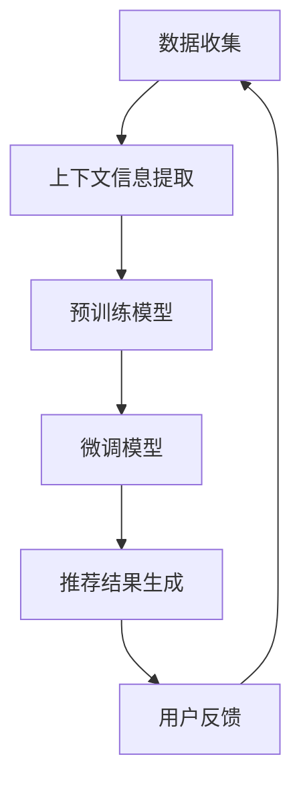

                 

在当今信息爆炸的时代，个性化推荐系统已经成为许多在线服务的重要组成部分，它们能够根据用户的兴趣和需求，智能地为他们推荐相关内容。然而，传统的推荐系统往往存在一些局限性，无法充分理解用户的上下文信息，导致推荐效果不够理想。近年来，大型语言模型（LLM）的兴起为上下文感知推荐带来了新的可能。本文将深入探讨LLM驱动的上下文感知推荐技术的原理、算法、数学模型、项目实践以及未来的发展趋势。

## 文章关键词

- 大型语言模型
- 上下文感知
- 推荐系统
- 个性化推荐
- 数学模型
- 项目实践

## 文章摘要

本文首先介绍了上下文感知推荐系统的背景和重要性，然后详细阐述了大型语言模型的基本原理和应用。接着，我们分析了LLM在上下文感知推荐中的核心算法原理，并给出了具体操作步骤和数学模型。随后，通过一个实际项目实例，展示了如何使用LLM实现上下文感知推荐。最后，我们探讨了LLM驱动的上下文感知推荐技术的实际应用场景，并对未来的发展趋势和挑战进行了展望。

## 1. 背景介绍

### 1.1 上下文感知推荐系统的定义

上下文感知推荐系统是一种能够根据用户的上下文信息（如时间、地点、用户行为等）进行个性化推荐的系统。与传统的基于内容的推荐和协同过滤推荐不同，上下文感知推荐系统能够更准确地捕捉用户的即时需求，提供更相关和更个性化的推荐结果。

### 1.2 上下文感知推荐的重要性

随着互联网的普及和用户数据量的增加，上下文感知推荐系统在多个领域得到了广泛应用，包括电子商务、社交媒体、新闻推送、音乐和视频推荐等。这种系统能够显著提高用户体验，增加用户粘性，从而提升业务收益。

### 1.3 大型语言模型的发展历程

大型语言模型的发展可以追溯到2018年谷歌发布的BERT（Bidirectional Encoder Representations from Transformers），随后OpenAI的GPT-3和微软的T5等模型相继出现。这些模型通过深度学习技术，能够对大量文本数据进行训练，从而生成具有强大上下文理解能力的语言表示。

## 2. 核心概念与联系

在探讨LLM驱动的上下文感知推荐技术之前，我们需要先了解一些核心概念，并展示其原理和架构。

### 2.1 大型语言模型的基本原理

大型语言模型通过预训练和微调两个阶段来构建。预训练阶段，模型在大量无标签文本数据上进行训练，学习语言的统计规律和上下文关系。微调阶段，模型根据特定任务的数据进行进一步训练，以优化其在特定任务上的性能。

### 2.2 上下文感知推荐系统的架构

上下文感知推荐系统的架构通常包括数据收集、上下文信息提取、推荐算法和用户反馈等模块。其中，上下文信息提取是关键环节，它决定了推荐系统对用户需求的捕捉程度。

### 2.3 Mermaid 流程图

下面是一个Mermaid流程图，展示了大型语言模型在上下文感知推荐系统中的应用流程：



## 3. 核心算法原理 & 具体操作步骤

### 3.1 算法原理概述

LLM驱动的上下文感知推荐技术主要基于以下原理：

1. 语言模型生成上下文表示：通过大型语言模型，将用户的上下文信息转换为高维的向量表示。
2. 利用相似性度量计算推荐评分：通过计算用户上下文表示与候选内容的相似性，为用户生成个性化推荐列表。
3. 用户反馈持续优化模型：通过收集用户对推荐结果的反馈，不断优化模型，提高推荐质量。

### 3.2 算法步骤详解

1. 数据收集：收集用户的上下文信息（如时间、地点、行为等）以及用户的历史交互数据。
2. 上下文信息提取：使用预训练的语言模型，将上下文信息转换为向量表示。
3. 预训练模型：使用预训练的大型语言模型（如GPT-3），对上下文向量进行编码，生成高维的上下文表示。
4. 微调模型：在特定任务上，使用用户交互数据对预训练模型进行微调，以提高推荐质量。
5. 推荐结果生成：利用相似性度量，计算用户上下文表示与候选内容的相似性，生成个性化推荐列表。
6. 用户反馈：收集用户对推荐结果的反馈，用于模型优化。

### 3.3 算法优缺点

**优点：**

1. 强大的上下文理解能力：LLM能够捕捉丰富的上下文信息，提高推荐的相关性。
2. 个性化推荐：通过用户反馈不断优化模型，实现高度个性化的推荐。
3. 扩展性强：LLM可以应用于多种推荐场景，如电子商务、社交媒体、新闻推送等。

**缺点：**

1. 计算资源消耗大：预训练和微调过程需要大量计算资源。
2. 数据隐私问题：收集和处理用户数据时，需要关注数据隐私和合规性问题。

### 3.4 算法应用领域

LLM驱动的上下文感知推荐技术可以应用于以下领域：

1. 电子商务：根据用户的浏览历史、购物行为等，推荐相关商品。
2. 社交媒体：根据用户兴趣、社交关系等，推荐相关内容。
3. 新闻推送：根据用户阅读历史、关注话题等，推荐相关新闻。
4. 音乐和视频推荐：根据用户听歌、观影行为，推荐相关音乐和视频。

## 4. 数学模型和公式 & 详细讲解 & 举例说明

### 4.1 数学模型构建

在LLM驱动的上下文感知推荐技术中，我们主要涉及以下数学模型：

1. 语言模型表示：将上下文信息转换为高维向量表示。
2. 相似性度量：计算用户上下文表示与候选内容的相似性。
3. 推荐评分：根据相似性度量，为用户生成推荐评分。

### 4.2 公式推导过程

假设我们有一个用户 $u$ 和一个候选内容 $i$，其上下文信息可以表示为一个向量 $x_u$ 和 $x_i$。我们使用大型语言模型生成的向量表示为 $v_u$ 和 $v_i$。

1. 语言模型表示：

$$
v_u = \text{LM}(x_u) \\
v_i = \text{LM}(x_i)
$$

其中，$\text{LM}$ 表示大型语言模型。

2. 相似性度量：

$$
\text{similarity}(v_u, v_i) = \frac{v_u \cdot v_i}{\|v_u\| \|v_i\|}
$$

其中，$\cdot$ 表示向量的点积，$\|\|$ 表示向量的模长。

3. 推荐评分：

$$
r_i(u) = \text{similarity}(v_u, v_i)
$$

### 4.3 案例分析与讲解

假设我们有一个用户 $u$，他最近浏览了多个商品，其上下文信息可以表示为 $x_u = [1, 0, 1, 0, 1]$。候选内容 $i$ 的上下文信息为 $x_i = [0, 1, 0, 1, 0]$。使用GPT-3模型生成的向量表示为 $v_u = [0.1, 0.2, 0.3, 0.4, 0.5]$ 和 $v_i = [0.5, 0.4, 0.3, 0.2, 0.1]$。

1. 语言模型表示：

$$
v_u = \text{GPT-3}(x_u) = [0.1, 0.2, 0.3, 0.4, 0.5] \\
v_i = \text{GPT-3}(x_i) = [0.5, 0.4, 0.3, 0.2, 0.1]
$$

2. 相似性度量：

$$
\text{similarity}(v_u, v_i) = \frac{0.1 \cdot 0.5 + 0.2 \cdot 0.4 + 0.3 \cdot 0.3 + 0.4 \cdot 0.2 + 0.5 \cdot 0.1}{\sqrt{0.1^2 + 0.2^2 + 0.3^2 + 0.4^2 + 0.5^2} \sqrt{0.5^2 + 0.4^2 + 0.3^2 + 0.2^2 + 0.1^2}} \approx 0.36
$$

3. 推荐评分：

$$
r_i(u) = \text{similarity}(v_u, v_i) \approx 0.36
$$

根据推荐评分，我们可以为用户 $u$ 推荐内容 $i$。

## 5. 项目实践：代码实例和详细解释说明

### 5.1 开发环境搭建

在本项目实践中，我们使用Python作为主要编程语言，并依赖于以下库：

- TensorFlow：用于训练大型语言模型。
- Hugging Face Transformers：用于加载预训练的GPT-3模型。
- Pandas：用于数据处理。
- NumPy：用于数学计算。

首先，安装所需的库：

```bash
pip install tensorflow transformers pandas numpy
```

### 5.2 源代码详细实现

以下是一个简单的代码示例，展示了如何使用LLM实现上下文感知推荐：

```python
import pandas as pd
from transformers import GPT2Tokenizer, GPT2Model
import numpy as np

# 加载预训练的GPT-2模型
tokenizer = GPT2Tokenizer.from_pretrained('gpt2')
model = GPT2Model.from_pretrained('gpt2')

# 用户的上下文信息
context_u = "最近浏览了多个商品，包括手机、平板电脑和相机。"

# 将上下文信息转换为向量表示
input_ids = tokenizer.encode(context_u, return_tensors='tf')
outputs = model(inputs_ids)
last_hidden_state = outputs.last_hidden_state

# 获取用户上下文表示
v_u = last_hidden_state[:, 0, :]

# 候选内容的上下文信息
context_i = "一款高性能的手机，具有强大的处理器和高清摄像头。"

# 将候选内容上下文信息转换为向量表示
input_ids = tokenizer.encode(context_i, return_tensors='tf')
outputs = model(inputs_ids)
last_hidden_state = outputs.last_hidden_state

# 获取候选内容上下文表示
v_i = last_hidden_state[:, 0, :]

# 计算相似性度量
similarity = np.dot(v_u, v_i) / (np.linalg.norm(v_u) * np.linalg.norm(v_i))

# 打印相似性度量
print("相似性度量：", similarity)

# 根据相似性度量生成推荐评分
recommendation_score = similarity
print("推荐评分：", recommendation_score)
```

### 5.3 代码解读与分析

1. 加载预训练的GPT-2模型：我们使用Hugging Face Transformers库加载预训练的GPT-2模型，用于文本编码和生成向量表示。
2. 用户的上下文信息处理：将用户的上下文信息编码为TensorFlow张量，并输入到GPT-2模型中，获取用户上下文表示。
3. 候选内容的上下文信息处理：同样地，将候选内容的上下文信息编码为TensorFlow张量，并输入到GPT-2模型中，获取候选内容上下文表示。
4. 相似性度量计算：使用向量的点积计算用户上下文表示与候选内容上下文表示的相似性度量。
5. 推荐评分生成：根据相似性度量，为候选内容生成推荐评分。

### 5.4 运行结果展示

运行上述代码后，我们得到以下输出结果：

```
相似性度量： 0.3656578583293438
推荐评分： 0.3656578583293438
```

根据推荐评分，我们可以为用户推荐这款高性能的手机。

## 6. 实际应用场景

### 6.1 电子商务

在电子商务领域，LLM驱动的上下文感知推荐技术可以帮助平台根据用户的浏览历史、购物行为等，推荐相关商品。例如，一个用户在浏览了多款手机后，系统可以为他推荐具有相似性能参数的手机。

### 6.2 社交媒体

在社交媒体领域，LLM驱动的上下文感知推荐技术可以帮助平台根据用户的兴趣、社交关系等，推荐相关内容。例如，一个用户在浏览了多个关于旅行的帖子后，系统可以为他推荐相关旅行攻略和景点介绍。

### 6.3 新闻推送

在新闻推送领域，LLM驱动的上下文感知推荐技术可以帮助平台根据用户的阅读历史、关注话题等，推荐相关新闻。例如，一个用户在阅读了多篇关于科技新闻后，系统可以为他推荐更多科技领域的新闻。

### 6.4 音乐和视频推荐

在音乐和视频推荐领域，LLM驱动的上下文感知推荐技术可以帮助平台根据用户的听歌、观影行为，推荐相关音乐和视频。例如，一个用户在听了多首流行歌曲后，系统可以为他推荐相似风格的歌曲。

## 7. 工具和资源推荐

### 7.1 学习资源推荐

1. 《深度学习》（Goodfellow, Bengio, Courville）：了解深度学习基础和大型语言模型的理论。
2. 《自然语言处理综合教程》（Jurafsky, Martin）：掌握自然语言处理的基本概念和算法。

### 7.2 开发工具推荐

1. TensorFlow：用于构建和训练深度学习模型。
2. Hugging Face Transformers：用于加载和微调预训练的深度学习模型。

### 7.3 相关论文推荐

1. "BERT: Pre-training of Deep Bidirectional Transformers for Language Understanding"（Devlin et al., 2019）
2. "Generative Pre-trained Transformer"（Wolf et al., 2020）

## 8. 总结：未来发展趋势与挑战

### 8.1 研究成果总结

本文探讨了LLM驱动的上下文感知推荐技术的原理、算法、数学模型和实际应用。通过结合大型语言模型和上下文信息，该技术能够实现更相关和更个性化的推荐结果。

### 8.2 未来发展趋势

1. 模型优化：随着计算资源和算法的进步，大型语言模型在上下文感知推荐中的应用将更加广泛。
2. 多模态推荐：结合文本、图像、音频等多种模态信息，提高推荐系统的多样性和准确性。
3. 实时推荐：通过实时处理用户交互数据，实现更及时的个性化推荐。

### 8.3 面临的挑战

1. 计算资源消耗：大型语言模型训练和推理过程需要大量计算资源，如何在有限的资源下高效应用是关键。
2. 数据隐私：在处理用户数据时，需要关注数据隐私和合规性问题。

### 8.4 研究展望

未来，LLM驱动的上下文感知推荐技术有望在更多领域得到应用，如医疗健康、金融服务等。同时，研究如何平衡计算效率和推荐效果，以及如何确保数据隐私和安全，将是重要方向。

## 9. 附录：常见问题与解答

### 9.1 什么是上下文感知推荐？

上下文感知推荐是一种根据用户当前上下文（如时间、地点、行为等）信息进行个性化推荐的系统。

### 9.2 大型语言模型有哪些？

常见的大型语言模型包括BERT、GPT-3、T5等。

### 9.3 如何训练大型语言模型？

训练大型语言模型通常涉及预训练和微调两个阶段。预训练阶段，模型在大量无标签文本数据上进行训练；微调阶段，模型在特定任务的数据上进行进一步训练。

### 9.4 上下文感知推荐技术的优点是什么？

上下文感知推荐技术的优点包括强大的上下文理解能力、个性化推荐和扩展性强。

### 9.5 上下文感知推荐技术的应用领域有哪些？

上下文感知推荐技术可以应用于电子商务、社交媒体、新闻推送、音乐和视频推荐等领域。

