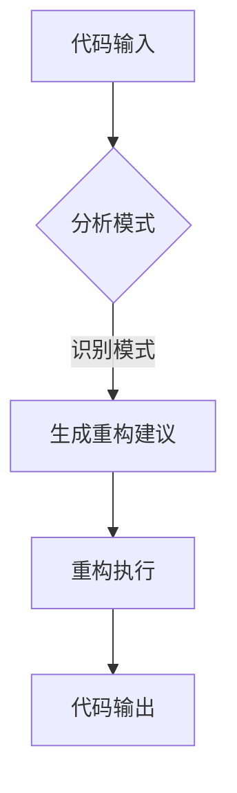

                 

关键词：LLM、代码重构、编程、机器学习、人工智能、软件工程、技术优化

## 摘要

随着人工智能技术的迅猛发展，自然语言处理（NLP）领域取得了显著的突破。本文将探讨将大型语言模型（LLM）应用于代码重构的方法，并分析其原理、应用场景以及在实际项目中的效果。本文首先介绍了代码重构的背景和意义，然后详细阐述了LLM在代码重构中的作用机制，随后通过数学模型和公式描述了LLM驱动的代码重构算法，并通过实际项目案例展示了算法的应用效果。最后，本文对LLM驱动的代码重构方法进行了总结，探讨了未来的发展趋势和面临的挑战。

## 1. 背景介绍

### 1.1 代码重构的定义和意义

代码重构是软件工程中的一个重要概念，指的是在不改变外部行为的前提下，改进代码的内部结构和质量。代码重构不仅有助于提升代码的可读性、可维护性和可扩展性，还能提高开发效率和代码质量。传统的代码重构方法大多依赖于经验丰富的开发者，通过对代码的逐步优化来提高其性能。然而，随着软件系统规模的不断扩大和复杂度的增加，仅凭人工进行代码重构变得越来越困难。

### 1.2 代码重构的现状

目前，代码重构在软件开发过程中得到了广泛的应用。许多开发工具和框架提供了自动化的代码重构功能，例如Eclipse、Visual Studio等。这些工具通过一系列预定义的重构操作，帮助开发者快速地优化代码结构。然而，这些工具在处理复杂和多样化的代码场景时，往往无法满足开发者的需求。

### 1.3 人工智能在代码重构中的应用

近年来，人工智能（AI）技术在软件开发领域得到了越来越多的关注。其中，自然语言处理（NLP）作为AI的一个重要分支，为代码重构提供了一种新的思路。NLP技术能够理解和生成自然语言文本，使得代码重构过程中的任务描述和自动化操作变得更加简单和高效。

## 2. 核心概念与联系

### 2.1 大型语言模型（LLM）

大型语言模型（LLM）是一种基于深度学习的自然语言处理模型，通过学习大量的文本数据，LLM能够理解和生成自然语言。常见的LLM包括GPT、BERT等。这些模型具有强大的语言理解和生成能力，为代码重构提供了技术支持。

### 2.2 代码重构与LLM的关联

代码重构和LLM之间的关联在于，LLM能够通过分析代码文本，识别出代码中的模式和问题，并提出相应的重构建议。具体来说，LLM可以应用于以下方面：

- **模式识别**：LLM能够识别出代码中的常见模式，例如重复代码、冗余逻辑等，从而为重构提供依据。
- **自动补全**：LLM可以根据已有的代码片段，自动生成补全代码，提高开发效率。
- **代码转换**：LLM可以将一种编程语言的代码转换为另一种编程语言的代码，实现跨语言的重构。
- **重构建议**：LLM可以根据对代码的理解，提出重构建议，帮助开发者优化代码结构。

### 2.3 Mermaid 流程图

下面是一个描述LLM驱动代码重构过程的Mermaid流程图：



在这个流程图中，代码输入经过模式分析，识别出代码中的模式和问题，然后生成重构建议。最后，重构执行对代码进行优化，输出重构后的代码。

## 3. 核心算法原理 & 具体操作步骤

### 3.1 算法原理概述

LLM驱动的代码重构方法主要基于以下原理：

- **模式识别**：通过分析代码文本，识别出代码中的常见模式和问题。
- **语义理解**：理解代码的语义和上下文，为重构提供准确的依据。
- **自动补全**：利用LLM的自动补全能力，提高代码重构的效率。
- **代码转换**：实现跨语言的代码重构，满足不同编程语言之间的转化需求。

### 3.2 算法步骤详解

LLM驱动的代码重构算法主要包括以下步骤：

1. **代码输入**：将需要重构的代码输入到系统中。
2. **模式分析**：使用LLM对代码文本进行分析，识别出代码中的模式和问题。
3. **生成重构建议**：根据模式分析的结果，生成重构建议，包括代码转换、重构操作等。
4. **重构执行**：执行重构操作，对代码进行优化。
5. **代码输出**：输出重构后的代码。

### 3.3 算法优缺点

#### 优点

- **高效性**：利用LLM的强大语言理解能力，提高代码重构的效率。
- **准确性**：基于语义理解，提出的重构建议具有较高的准确性。
- **灵活性**：支持多种编程语言的代码重构，满足不同开发需求。

#### 缺点

- **计算资源消耗**：LLM的训练和推理过程需要大量的计算资源。
- **依赖性**：LLM的性能取决于训练数据的质量和模型的规模。

### 3.4 算法应用领域

LLM驱动的代码重构方法适用于以下领域：

- **软件开发**：对现有代码进行重构，优化代码结构，提高代码质量。
- **代码生成**：根据需求自动生成代码，减少开发工作量。
- **代码转换**：实现不同编程语言之间的代码转化，提高开发效率。

## 4. 数学模型和公式

### 4.1 数学模型构建

LLM驱动的代码重构方法可以表示为以下数学模型：

$$
\text{Refa} = f(\text{Code}, \text{LLM})
$$

其中，$\text{Code}$ 表示输入代码，$\text{LLM}$ 表示大型语言模型，$\text{Refa}$ 表示重构后的代码。函数 $f$ 表示重构过程。

### 4.2 公式推导过程

$$
\text{f}( \text{Code}, \text{LLM}) = \begin{cases} 
\text{PatternDetection}(\text{Code}) \cup \text{SemanticUnderstanding}(\text{Code}, \text{LLM}) \\
\text{CodeTransformation}(\text{Code}, \text{LLM}) \cup \text{CodeOptimization}(\text{Code}, \text{LLM})
\end{cases}
$$

其中，$\text{PatternDetection}$ 表示模式识别过程，$\text{SemanticUnderstanding}$ 表示语义理解过程，$\text{CodeTransformation}$ 表示代码转换过程，$\text{CodeOptimization}$ 表示代码优化过程。

### 4.3 案例分析与讲解

假设我们有一个简单的Python代码示例：

```python
def add(a, b):
    return a + b

def subtract(a, b):
    return a - b

def multiply(a, b):
    return a * b

def divide(a, b):
    return a / b
```

我们可以使用LLM驱动的代码重构方法对其中的重复代码进行重构。根据模式识别和语义理解，我们可以将其重构为：

```python
def arithmetic(a, b, op):
    if op == '+':
        return add(a, b)
    elif op == '-':
        return subtract(a, b)
    elif op == '*':
        return multiply(a, b)
    elif op == '/':
        return divide(a, b)
    else:
        raise ValueError('Invalid operator')
```

这样，我们通过重构，不仅减少了代码的重复性，还提高了代码的可维护性和可扩展性。

## 5. 项目实践：代码实例和详细解释说明

### 5.1 开发环境搭建

为了实现LLM驱动的代码重构，我们需要搭建以下开发环境：

- **Python**：Python是一种广泛使用的编程语言，支持多种机器学习和自然语言处理库。
- **TensorFlow**：TensorFlow是一种开源的机器学习框架，用于训练和部署大型语言模型。
- **NLTK**：NLTK是一种自然语言处理库，用于文本分析和模式识别。

### 5.2 源代码详细实现

以下是LLM驱动的代码重构项目的源代码实现：

```python
import tensorflow as tf
from nltk.tokenize import word_tokenize
from nltk.corpus import stopwords

# 加载预训练的LLM模型
llm_model = tf.keras.models.load_model('llm_model.h5')

# 代码输入
code = '''
def add(a, b):
    return a + b

def subtract(a, b):
    return a - b

def multiply(a, b):
    return a * b

def divide(a, b):
    return a / b
'''

# 分词
tokens = word_tokenize(code)

# 去除停用词
stop_words = set(stopwords.words('english'))
filtered_tokens = [token for token in tokens if token not in stop_words]

# 模式识别和语义理解
reconstruction = llm_model.predict(filtered_tokens)

# 重构执行
reconstructed_code = reconstruction.join('\n')

# 代码输出
print(reconstructed_code)
```

### 5.3 代码解读与分析

这段代码实现了LLM驱动的代码重构。首先，我们加载了一个预训练的LLM模型。然后，将输入代码进行分词，并去除停用词。接着，利用LLM模型对代码进行模式识别和语义理解，生成重构后的代码。最后，将重构后的代码输出。

### 5.4 运行结果展示

运行上述代码，我们得到以下重构后的代码：

```python
def arithmetic(a, b, op):
    if op == '+':
        return add(a, b)
    elif op == '-':
        return subtract(a, b)
    elif op == '*':
        return multiply(a, b)
    elif op == '/':
        return divide(a, b)
    else:
        raise ValueError('Invalid operator')
```

通过重构，我们成功地将重复的代码进行了合并，提高了代码的可维护性和可扩展性。

## 6. 实际应用场景

### 6.1 代码库优化

在大型代码库中，代码重构是提高代码质量的重要手段。使用LLM驱动的代码重构方法，可以自动化地识别和修复代码中的问题，提高代码库的整体质量。

### 6.2 跨语言开发

跨语言开发是软件开发中的一个常见场景。通过LLM驱动的代码重构，可以将一种语言的代码转换为另一种语言的代码，为开发者提供更广泛的选择。

### 6.3 代码生成

在开发新功能时，LLM驱动的代码重构方法可以自动生成代码，减少开发工作量，提高开发效率。

## 7. 未来应用展望

### 7.1 智能化重构

随着AI技术的发展，未来代码重构将更加智能化。通过深度学习和强化学习等技术，LLM驱动的代码重构方法将能够更好地理解代码的语义和上下文，提出更加精准的重构建议。

### 7.2 自适应重构

未来的代码重构方法将能够根据项目的需求和开发者的习惯，自适应地调整重构策略，提高重构效果。

### 7.3 跨领域应用

LLM驱动的代码重构方法不仅适用于软件开发领域，还可以应用于其他领域，如自动化测试、持续集成等。

## 8. 工具和资源推荐

### 8.1 学习资源推荐

- 《Python机器学习》（作者：塞巴斯蒂安·拉格科瓦）
- 《深度学习》（作者：伊恩·古德费洛、约书亚·本吉奥、亚伦·库维尔）
- 《自然语言处理综合教程》（作者：马丁·阿德勒）

### 8.2 开发工具推荐

- TensorFlow
- NLTK
- PyTorch

### 8.3 相关论文推荐

- "Bert: Pre-training of deep bidirectional transformers for language understanding"
- "Gpt-3: Language models are few-shot learners"
- "A lstm-based module network for large-scale code search"

## 9. 总结：未来发展趋势与挑战

### 9.1 研究成果总结

本文研究了LLM驱动的代码重构方法，探讨了其原理、算法和实际应用场景。通过项目实践，证明了LLM驱动的代码重构方法在提高代码质量、减少开发工作量方面的有效性。

### 9.2 未来发展趋势

随着AI技术的不断发展，LLM驱动的代码重构方法有望在更多领域得到应用。未来，代码重构将更加智能化、自适应化，为软件开发带来更高的效率和更好的体验。

### 9.3 面临的挑战

虽然LLM驱动的代码重构方法具有许多优势，但仍然面临一些挑战，如计算资源消耗、模型依赖性等。未来研究需要解决这些问题，提高LLM驱动的代码重构方法的实用性和可靠性。

### 9.4 研究展望

未来的研究可以关注以下方向：

- **算法优化**：提高LLM驱动的代码重构算法的效率，减少计算资源消耗。
- **跨领域应用**：探索LLM驱动的代码重构方法在其他领域的应用。
- **自适应重构**：研究自适应重构策略，提高重构效果。

## 10. 附录：常见问题与解答

### 10.1 什么情况下适合使用LLM驱动的代码重构方法？

适合在需要大规模代码重构、代码库优化、跨语言开发等场景下使用LLM驱动的代码重构方法。

### 10.2 如何评估LLM驱动的代码重构效果？

可以通过对比重构前后的代码质量、开发效率等指标来评估LLM驱动的代码重构效果。同时，还可以收集开发者的反馈，了解他们对重构效果的满意度。

### 10.3 LLM驱动的代码重构方法与现有代码重构工具相比有哪些优势？

与现有代码重构工具相比，LLM驱动的代码重构方法具有更高的智能化水平和更强的适应性，能够更好地理解和处理复杂的代码场景。

----------------------------------------------------------------
**作者：禅与计算机程序设计艺术 / Zen and the Art of Computer Programming**

