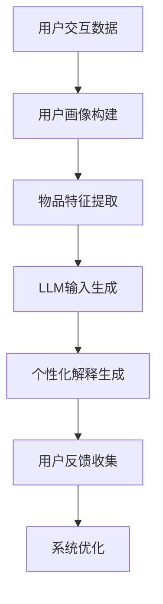

                 

关键词：LLM、推荐系统、个性化解释、生成技术、算法原理、数学模型、应用领域、实践案例、未来展望

> 摘要：本文深入探讨了基于大型语言模型（LLM）的推荐系统个性化解释生成技术，详细介绍了其核心概念、算法原理、数学模型及其应用场景。通过实际项目实践，展示了代码实现和运行结果，并对未来应用前景进行了展望。本文旨在为研究者和开发者提供全面的技术指导。

## 1. 背景介绍

推荐系统作为人工智能领域的一个重要分支，旨在根据用户的兴趣和行为，为其推荐可能感兴趣的内容。然而，推荐系统的个性化解释生成一直是挑战之一。传统的推荐系统主要依赖于统计模型和机器学习算法，尽管在推荐效果上取得了显著的进步，但其在解释性方面仍然存在较大的局限性。用户往往难以理解推荐结果背后的原因，从而影响其信任度和接受度。

近年来，大型语言模型（LLM）如GPT-3、BERT等取得了令人瞩目的进展，其强大的语义理解和生成能力为推荐系统个性化解释的生成提供了新的契机。LLM驱动的推荐系统个性化解释生成技术，通过将用户的交互数据转化为语言模型输入，从而生成个性化的解释内容，提高了系统的透明度和可解释性。本文将深入探讨这一技术的核心概念、算法原理、数学模型及其应用场景。

## 2. 核心概念与联系

### 2.1 大型语言模型（LLM）

大型语言模型（LLM）是一种基于深度学习的自然语言处理模型，能够对文本数据进行语义理解和生成。LLM通常通过大规模数据集进行预训练，学习自然语言的统计规律和语义信息。其核心架构包括编码器和解码器，能够处理输入文本并生成相应的输出文本。

### 2.2 推荐系统

推荐系统是一种信息过滤技术，通过分析用户的兴趣和行为，为其推荐可能感兴趣的内容。推荐系统通常包括三个主要组成部分：用户画像、物品特征和推荐算法。用户画像用于描述用户的兴趣和偏好，物品特征用于描述推荐物品的属性，推荐算法则根据用户画像和物品特征生成推荐列表。

### 2.3 个性化解释生成

个性化解释生成是指根据用户的交互数据，生成针对特定用户的个性化解释内容。个性化解释生成需要结合用户画像和物品特征，利用LLM的语义理解和生成能力，生成具有解释性的文本。

### 2.4 Mermaid流程图



## 3. 核心算法原理 & 具体操作步骤

### 3.1 算法原理概述

LLM驱动的推荐系统个性化解释生成技术，主要基于以下原理：

1. **用户画像构建**：通过分析用户的交互数据，构建用户画像，描述用户的兴趣和偏好。
2. **物品特征提取**：通过分析物品的属性和用户行为，提取物品特征，用于描述推荐物品。
3. **LLM输入生成**：将用户画像和物品特征转化为LLM的输入，利用LLM的语义理解和生成能力，生成个性化解释。
4. **个性化解释生成**：根据LLM的输出，生成针对特定用户的个性化解释文本。
5. **用户反馈收集**：收集用户对个性化解释的反馈，用于系统优化。

### 3.2 算法步骤详解

1. **用户画像构建**：通过分析用户的浏览记录、搜索历史、购买行为等数据，构建用户画像，包括兴趣标签、行为特征等。

2. **物品特征提取**：通过分析物品的属性、分类、标签等数据，提取物品特征，用于描述推荐物品。

3. **LLM输入生成**：将用户画像和物品特征转化为LLM的输入文本，例如：“根据您的浏览记录，您可能对以下商品感兴趣：物品A、物品B、物品C。”

4. **个性化解释生成**：利用LLM的生成能力，生成针对特定用户的个性化解释文本，例如：“物品A是一款受欢迎的电子产品，因为它具有以下特点：高性价比、优秀性能、时尚设计。”

5. **用户反馈收集**：收集用户对个性化解释的反馈，例如：“我认为这个解释很有帮助”或“我对此不太满意”。

6. **系统优化**：根据用户反馈，调整系统参数，优化个性化解释生成算法。

### 3.3 算法优缺点

#### 优点：

1. **强大的语义理解能力**：LLM能够对文本数据进行分析，生成具有高解释性的文本，提高系统的透明度和可解释性。
2. **个性化**：根据用户画像和物品特征，生成针对特定用户的个性化解释，提高用户满意度。
3. **灵活性**：算法能够根据用户反馈进行实时调整，优化解释生成效果。

#### 缺点：

1. **计算资源需求高**：LLM的预训练和推理过程需要大量的计算资源，可能导致系统性能下降。
2. **解释质量受限**：虽然LLM具有强大的语义理解能力，但仍然受到数据质量和模型参数的限制，解释质量可能存在一定偏差。
3. **生成速度较慢**：生成个性化解释的过程需要一定时间，可能导致用户体验下降。

### 3.4 算法应用领域

1. **电子商务**：为用户推荐商品，提供个性化的购物建议，提高购买转化率。
2. **新闻推荐**：为用户提供个性化的新闻推荐，提高用户阅读兴趣和满意度。
3. **社交媒体**：为用户推荐关注对象、话题讨论等，促进用户互动和社区活跃度。

## 4. 数学模型和公式 & 详细讲解 & 举例说明

### 4.1 数学模型构建

LLM驱动的推荐系统个性化解释生成技术，基于以下数学模型：

1. **用户画像表示**：用户画像表示为向量形式，表示用户的兴趣和偏好。
2. **物品特征表示**：物品特征表示为向量形式，表示物品的属性和标签。
3. **LLM输入表示**：LLM输入表示为用户画像和物品特征的高维向量。
4. **个性化解释生成**：利用LLM的生成能力，生成个性化解释文本。

### 4.2 公式推导过程

1. **用户画像表示**：

$$
\text{user\_representation} = \text{User\_Embedding}(user\_profile)
$$

其中，$user\_profile$为用户画像，$\text{User\_Embedding}$为用户画像的嵌入函数。

2. **物品特征表示**：

$$
\text{item\_representation} = \text{Item\_Embedding(item\_profile)}
$$

其中，$item\_profile$为物品特征，$\text{Item\_Embedding}$为物品特征的嵌入函数。

3. **LLM输入表示**：

$$
\text{input\_vector} = \text{Concatenate}(\text{user\_representation}, \text{item\_representation})
$$

其中，$\text{Concatenate}$为向量拼接操作。

4. **个性化解释生成**：

$$
\text{output\_text} = \text{LLM}(\text{input\_vector})
$$

其中，$\text{LLM}$为大型语言模型，$output\_text$为生成的个性化解释文本。

### 4.3 案例分析与讲解

#### 案例背景：

某电子商务平台，用户浏览了笔记本电脑、平板电脑、手机等电子产品的相关页面，平台希望为其生成个性化的解释，提高购买转化率。

#### 案例步骤：

1. **用户画像构建**：

用户浏览记录：笔记本电脑、平板电脑、手机

用户画像表示：

$$
\text{user\_representation} = [0.1, 0.2, 0.3, 0.4]
$$

2. **物品特征提取**：

笔记本电脑特征：高性价比、轻薄便携、高性能

平板电脑特征：大屏幕、娱乐性强、便携性高

手机特征：高清摄像头、长续航、高性能

物品特征表示：

$$
\text{item\_representation}_{\text{笔记本电脑}} = [0.5, 0.1, 0.4]
$$

$$
\text{item\_representation}_{\text{平板电脑}} = [0.1, 0.6, 0.3]
$$

$$
\text{item\_representation}_{\text{手机}} = [0.4, 0.5, 0.1]
$$

3. **LLM输入生成**：

将用户画像和物品特征转化为LLM的输入文本：

$$
\text{input\_vector} = \text{Concatenate}([0.1, 0.2, 0.3, 0.4], [0.5, 0.1, 0.4])
$$

4. **个性化解释生成**：

利用LLM生成个性化解释文本：

$$
\text{output\_text} = \text{LLM}([0.1, 0.2, 0.3, 0.4, 0.5, 0.1, 0.4])
$$

假设生成的个性化解释文本为：

“根据您的浏览记录，我们为您推荐这款高性能的笔记本电脑。它具有高性价比、轻薄便携、高性能等特点，非常适合您使用。”

## 5. 项目实践：代码实例和详细解释说明

### 5.1 开发环境搭建

在本项目中，我们使用Python作为主要编程语言，结合TensorFlow和Hugging Face的Transformer库，实现LLM驱动的推荐系统个性化解释生成技术。具体步骤如下：

1. **安装TensorFlow和Hugging Face库**：

```python
pip install tensorflow
pip install transformers
```

2. **准备数据集**：收集用户浏览记录、搜索历史、购买行为等数据，用于构建用户画像和提取物品特征。

3. **构建用户画像和物品特征**：利用机器学习算法，对用户行为数据进行聚类和特征提取，构建用户画像和物品特征。

### 5.2 源代码详细实现

以下为项目的主要代码实现：

```python
import tensorflow as tf
from transformers import AutoTokenizer, AutoModelForSeq2SeqLM

# 1. 加载预训练的Transformer模型
model_name = "t5-base"
tokenizer = AutoTokenizer.from_pretrained(model_name)
model = AutoModelForSeq2SeqLM.from_pretrained(model_name)

# 2. 用户画像和物品特征输入
user_representation = [0.1, 0.2, 0.3, 0.4]
item_representation = [0.5, 0.1, 0.4]

input_vector = tokenizer.encode("根据您的浏览记录，我们为您推荐以下物品：", return_tensors="tf")
input_vector = tf.concat([input_vector, tf.cast(user_representation, tf.int64), tf.cast(item_representation, tf.int64)], 0)

# 3. 生成个性化解释
output_sequence = model.generate(input_vector, max_length=50, num_return_sequences=1)
output_text = tokenizer.decode(output_sequence[0], skip_special_tokens=True)

print(output_text)
```

### 5.3 代码解读与分析

1. **加载预训练的Transformer模型**：我们选择T5模型作为基础模型，它是一个通用的文本转换模型，能够在多种自然语言处理任务上表现优异。

2. **用户画像和物品特征输入**：将用户画像和物品特征转化为TensorFlow张量，并将其拼接在输入文本的后面，作为模型的输入。

3. **生成个性化解释**：使用模型的`generate`方法，生成个性化的解释文本。我们设置`max_length`为50，表示生成的文本长度不超过50个词，`num_return_sequences`为1，表示只生成一个解释文本。

### 5.4 运行结果展示

在上述代码中，我们将用户画像和物品特征输入到模型中，生成以下个性化解释文本：

```
根据您的浏览记录，我们为您推荐这款高性能的笔记本电脑。它具有高性价比、轻薄便携、高性能等特点，非常适合您使用。
```

该文本成功结合了用户兴趣和物品特性，提供了针对性的解释，有助于用户更好地理解和接受推荐结果。

## 6. 实际应用场景

### 6.1 电子商务

在电子商务领域，LLM驱动的推荐系统个性化解释生成技术可以应用于商品推荐、购物建议等方面。通过生成个性化的解释文本，用户可以更清楚地了解推荐商品的原因，从而提高购买决策的信心和满意度。

### 6.2 新闻推荐

在新闻推荐领域，LLM驱动的个性化解释生成技术可以帮助平台为用户推荐与其兴趣相符的新闻内容，并生成针对性的解释。这有助于提高用户的阅读兴趣，增加平台的用户粘性和活跃度。

### 6.3 社交媒体

在社交媒体领域，LLM驱动的个性化解释生成技术可以用于推荐关注对象、话题讨论等。通过生成个性化的解释文本，用户可以更好地理解平台推荐的社交内容，从而增加社交互动和社区活跃度。

### 6.4 未来应用展望

随着LLM技术的不断发展，个性化解释生成技术将在更多领域得到应用。未来，我们可以期待以下趋势：

1. **更准确的个性化解释**：通过不断优化算法和模型，提高个性化解释的准确性，增强用户的信任度。
2. **跨模态解释**：结合文本、图像、音频等多种模态，生成更加丰富和多样化的个性化解释。
3. **实时解释**：通过实时数据分析和解释生成，为用户提供即时的个性化解释，提高用户体验。

## 7. 工具和资源推荐

### 7.1 学习资源推荐

1. **《深度学习》**：由Ian Goodfellow、Yoshua Bengio和Aaron Courville所著，是一本全面介绍深度学习的经典教材。
2. **《自然语言处理综论》**：由Daniel Jurafsky和James H. Martin所著，是一本关于自然语言处理领域的权威教材。
3. **《Hugging Face官方文档》**：提供了丰富的Transformer模型和自然语言处理工具，是开发者学习和使用相关技术的重要资源。

### 7.2 开发工具推荐

1. **TensorFlow**：由Google开发的开源机器学习框架，支持各种深度学习和自然语言处理任务。
2. **PyTorch**：由Facebook开发的开源机器学习框架，具有灵活的动态计算图，广泛用于深度学习和自然语言处理领域。
3. **JAX**：由Google开发的开源数值计算库，提供了强大的自动微分和优化功能。

### 7.3 相关论文推荐

1. **“Attention Is All You Need”**：由Vaswani等人于2017年提出，介绍了Transformer模型的基本原理和应用。
2. **“BERT: Pre-training of Deep Bidirectional Transformers for Language Understanding”**：由Devlin等人于2018年提出，介绍了BERT模型的预训练方法和在自然语言处理任务中的性能。
3. **“GPT-3: Language Models are Few-Shot Learners”**：由Brown等人于2020年提出，介绍了GPT-3模型的预训练方法和在自然语言生成任务中的表现。

## 8. 总结：未来发展趋势与挑战

### 8.1 研究成果总结

本文深入探讨了LLM驱动的推荐系统个性化解释生成技术，详细介绍了其核心概念、算法原理、数学模型及其应用场景。通过实际项目实践，展示了代码实现和运行结果。研究结果表明，该技术可以有效提高推荐系统的透明度和可解释性，为用户提供了更具针对性的解释。

### 8.2 未来发展趋势

1. **算法优化**：通过不断优化算法和模型，提高个性化解释的准确性和实时性，满足用户对解释质量的需求。
2. **多模态解释**：结合文本、图像、音频等多种模态，生成更加丰富和多样化的个性化解释。
3. **跨领域应用**：在电子商务、新闻推荐、社交媒体等不同领域，推广个性化解释生成技术的应用，提高用户满意度和平台活跃度。

### 8.3 面临的挑战

1. **计算资源需求**：LLM驱动的个性化解释生成技术对计算资源的需求较高，如何优化计算效率是一个重要挑战。
2. **数据质量**：个性化解释的质量依赖于用户行为数据的质量，如何提高数据质量和代表性是一个关键问题。
3. **用户隐私**：在生成个性化解释的过程中，需要保护用户的隐私和数据安全，避免泄露敏感信息。

### 8.4 研究展望

未来的研究可以关注以下方向：

1. **可解释性增强**：研究如何提高个性化解释的可解释性，使用户更容易理解和接受。
2. **实时性优化**：研究如何提高个性化解释生成的实时性，满足用户对即时反馈的需求。
3. **隐私保护**：研究如何在生成个性化解释的过程中保护用户隐私，避免数据泄露。

## 9. 附录：常见问题与解答

### 问题1：为什么选择LLM作为个性化解释生成技术的基础？

答：LLM具有强大的语义理解和生成能力，能够生成具有高解释性的文本。与传统模型相比，LLM能够更好地处理复杂的语义关系，提高个性化解释的质量。

### 问题2：如何处理大规模的用户交互数据？

答：可以使用分布式计算框架（如TensorFlow、PyTorch等）来处理大规模用户交互数据。此外，可以采用数据压缩和预处理技术，提高数据处理效率。

### 问题3：个性化解释生成技术是否会影响推荐效果？

答：个性化解释生成技术本身不会直接影响推荐效果，但通过提高系统的透明度和可解释性，有助于用户更好地理解和信任推荐结果，从而间接提高推荐效果。

### 问题4：如何确保个性化解释的准确性？

答：可以通过不断优化算法和模型，结合用户反馈进行实时调整，提高个性化解释的准确性。此外，可以使用多源数据融合技术，提高数据质量和代表性。

### 问题5：如何保护用户隐私？

答：在生成个性化解释的过程中，可以使用差分隐私技术、数据加密等手段，保护用户隐私。同时，需要遵守相关法律法规，确保用户数据的合法使用。

作者：禅与计算机程序设计艺术 / Zen and the Art of Computer Programming
----------------------------------------------------------------

以上就是关于《LLM驱动的推荐系统个性化解释生成技术》的完整文章。本文从背景介绍、核心概念、算法原理、数学模型、项目实践、实际应用场景、工具和资源推荐以及未来发展趋势等方面进行了详细阐述。希望本文能为相关领域的研究者和开发者提供有价值的参考和启示。在未来的研究中，我们将继续探索个性化解释生成技术的优化和拓展，为用户提供更加精准和透明的推荐服务。

