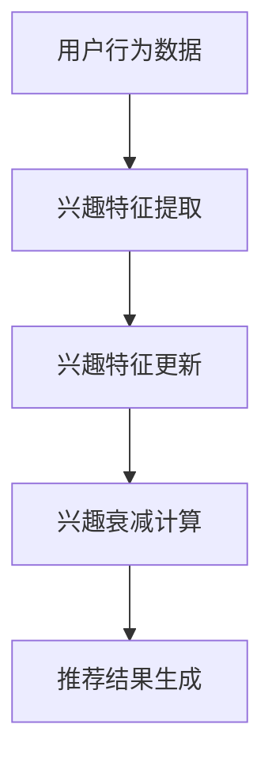

                 

在数字时代，推荐系统已经成为许多在线服务中不可或缺的一部分。从电子商务平台到社交媒体，推荐系统通过分析用户的互动行为和兴趣，向用户推荐个性化内容。然而，随着用户需求的不断变化，静态的兴趣建模已经无法满足动态推荐的需求。为了应对这一挑战，LLM（大型语言模型）驱动的推荐系统动态兴趣建模与衰减技术应运而生。本文将深入探讨这一技术的核心概念、算法原理、数学模型、项目实践及其应用场景和未来展望。

## 关键词

- **推荐系统**
- **动态兴趣建模**
- **LLM（大型语言模型）**
- **衰减技术**
- **个性化推荐**
- **机器学习**

## 摘要

本文旨在介绍LLM驱动的推荐系统动态兴趣建模与衰减技术。首先，我们将探讨推荐系统的背景和重要性，然后深入探讨LLM在动态兴趣建模中的应用。接着，我们将详细解释LLM驱动兴趣建模的数学模型和算法步骤。随后，我们将通过实际项目实例展示如何实现和应用这一技术。最后，我们将讨论这一技术的实际应用场景和未来发展趋势，并展望其面临的挑战。

## 1. 背景介绍

推荐系统（Recommender Systems）是信息检索和机器学习领域的核心技术之一。其主要目标是通过分析用户的历史行为和偏好，向用户提供个性化的内容推荐。推荐系统广泛应用于电子商务、社交媒体、音乐和视频流媒体等领域，极大地提升了用户满意度和参与度。

然而，传统的推荐系统多基于协同过滤（Collaborative Filtering）和基于内容的推荐（Content-Based Filtering）等方法。这些方法虽然能够生成一定的个性化推荐，但往往缺乏动态性和灵活性。具体来说：

1. **协同过滤方法**：这类方法通过分析用户之间的相似度来推荐相似用户喜欢的内容。然而，这种方法依赖于用户的行为数据，且难以处理新用户或冷启动问题。
2. **基于内容的推荐方法**：这种方法通过分析物品的特征和用户的兴趣特征来推荐相似的内容。尽管这种方法能够推荐相关性强的内容，但往往缺乏个性化和动态性。

为了克服这些局限性，研究人员开始探索更加智能和动态的推荐方法。LLM（Large Language Model）的引入为推荐系统的发展带来了新的契机。LLM是一种基于深度学习的自然语言处理模型，能够通过大量文本数据进行预训练，从而捕捉到语言的复杂结构和语义信息。这使得LLM在动态兴趣建模和推荐系统中具有巨大的潜力。

## 2. 核心概念与联系

### 2.1. 推荐系统基本概念

推荐系统主要涉及以下几个基本概念：

- **用户**：推荐系统中的个体，其行为数据包括点击、购买、收藏等。
- **物品**：推荐系统中的内容，可以是商品、新闻文章、音乐、视频等。
- **评分/反馈**：用户对物品的评价，可以是评分、点赞、评论等。
- **推荐列表**：根据用户历史行为和偏好生成的个性化推荐结果。

### 2.2. LLM基本概念

LLM（Large Language Model）是指具有巨大参数规模的深度学习模型，例如GPT-3、BERT等。这些模型通过在大规模文本语料库上进行预训练，学习到了语言的统计规律和语义信息。LLM的核心能力在于其强大的自然语言理解和生成能力，这使得它们在文本数据分析、信息检索、问答系统等领域具有广泛应用。

### 2.3. 动态兴趣建模与衰减

动态兴趣建模是指根据用户实时行为和反馈动态调整推荐策略，以实现更高的个性化推荐效果。衰减技术则是用于处理用户兴趣变化和物品重要性下降的问题，通过设置适当的衰减因子来平衡历史数据和实时数据的影响。

### 2.4. 核心概念联系

在推荐系统中，LLM驱动的动态兴趣建模与衰减技术通过以下几个步骤实现：

1. **用户兴趣捕捉**：LLM模型通过分析用户的历史行为和文本反馈，提取用户的兴趣特征。
2. **实时兴趣更新**：根据用户的实时行为和反馈，动态调整用户兴趣特征。
3. **兴趣衰减计算**：设置合适的衰减因子，平衡历史数据和实时数据的影响，以实现动态推荐。
4. **推荐结果生成**：基于用户兴趣特征和物品特征，生成个性化的推荐结果。

### 2.5. Mermaid流程图

下面是一个简化的Mermaid流程图，展示了LLM驱动的动态兴趣建模与衰减技术的核心流程。



## 3. 核心算法原理 & 具体操作步骤

### 3.1. 算法原理概述

LLM驱动的动态兴趣建模与衰减技术主要基于以下几个核心原理：

1. **深度学习模型**：通过深度学习模型，如GPT或BERT，从文本数据中提取用户的兴趣特征。
2. **实时数据更新**：结合用户的实时行为数据，动态调整兴趣特征，以实现更个性化的推荐。
3. **衰减因子设计**：设置适当的衰减因子，平衡历史数据和实时数据的影响，以保持推荐系统的动态性。

### 3.2. 算法步骤详解

#### 3.2.1. 用户兴趣特征提取

1. **数据预处理**：将用户的历史行为数据和文本反馈进行预处理，包括分词、去停用词、词向量化等。
2. **模型训练**：使用预训练的GPT或BERT模型，对预处理后的数据集进行微调，提取用户的兴趣特征。
3. **特征编码**：将提取的兴趣特征编码为向量表示，以供后续计算。

#### 3.2.2. 实时兴趣特征更新

1. **实时行为捕捉**：通过实时采集用户的行为数据，如点击、浏览、购买等。
2. **兴趣特征更新**：使用深度学习模型，结合实时行为数据，对用户的兴趣特征进行动态更新。

#### 3.2.3. 兴趣衰减计算

1. **衰减因子设计**：根据用户行为的历史性和实时性，设计适当的衰减因子。
2. **衰减计算**：对历史兴趣特征和实时兴趣特征进行加权平均，以得到最终的兴趣特征。

#### 3.2.4. 推荐结果生成

1. **物品特征提取**：使用深度学习模型，对物品的特征进行提取和编码。
2. **推荐算法**：使用协同过滤或基于内容的推荐算法，结合用户的兴趣特征和物品特征，生成个性化的推荐结果。

### 3.3. 算法优缺点

#### 优点：

1. **高个性化**：通过实时更新用户兴趣特征，实现更加个性化的推荐。
2. **动态性**：通过设置衰减因子，平衡历史和实时数据的影响，保持推荐系统的动态性。
3. **适用性广**：适用于多种类型的推荐场景，如电子商务、社交媒体、音乐和视频流媒体等。

#### 缺点：

1. **计算成本高**：深度学习模型的训练和实时计算需要大量的计算资源和时间。
2. **数据依赖性**：算法的性能依赖于用户行为数据的质量和数量。

### 3.4. 算法应用领域

LLM驱动的动态兴趣建模与衰减技术具有广泛的应用领域：

1. **电子商务**：通过个性化推荐，提升用户购买体验和销售额。
2. **社交媒体**：根据用户兴趣，推荐相关的内容和用户，增强用户参与度。
3. **音乐和视频流媒体**：根据用户喜好，推荐音乐和视频，提升用户满意度。
4. **在线教育**：根据用户学习习惯和兴趣，推荐合适的学习资源和课程。

## 4. 数学模型和公式 & 详细讲解 & 举例说明

### 4.1. 数学模型构建

在LLM驱动的动态兴趣建模中，我们主要关注以下几个数学模型：

1. **用户兴趣特征提取模型**：使用深度学习模型，如GPT或BERT，从用户历史行为数据和文本反馈中提取兴趣特征。
2. **兴趣衰减模型**：根据用户行为的历史性和实时性，设计适当的兴趣衰减模型。
3. **推荐模型**：结合用户兴趣特征和物品特征，使用协同过滤或基于内容的推荐模型生成推荐结果。

### 4.2. 公式推导过程

#### 4.2.1. 用户兴趣特征提取模型

我们使用GPT模型来提取用户兴趣特征。假设GPT模型的输出维度为\(d\)，用户历史行为数据的维度为\(n\)，则用户兴趣特征向量可以表示为：

\[ \mathbf{u} = \text{GPT}(\mathbf{X}) \]

其中，\(\mathbf{X}\)为用户历史行为数据的矩阵，\(\mathbf{u}\)为提取的用户兴趣特征向量。

#### 4.2.2. 兴趣衰减模型

兴趣衰减模型的设计取决于用户行为的历史性和实时性。我们采用以下公式来计算兴趣特征：

\[ \mathbf{u}_{t} = \alpha_t \mathbf{u}_{t-1} + (1 - \alpha_t) \mathbf{u}_{\text{new}} \]

其中，\(\alpha_t\)为衰减因子，表示当前时间点的兴趣影响程度。\( \mathbf{u}_{t-1} \)为上一时间点的兴趣特征，\(\mathbf{u}_{\text{new}}\)为实时更新的兴趣特征。

#### 4.2.3. 推荐模型

假设物品特征向量为\(\mathbf{i}\)，则推荐结果可以表示为：

\[ \mathbf{r} = \mathbf{u}^T \mathbf{i} \]

其中，\(\mathbf{r}\)为推荐结果，表示用户对物品的兴趣度。

### 4.3. 案例分析与讲解

#### 案例一：电子商务平台推荐

假设用户的历史购买数据如下表：

| 时间 | 商品A | 商品B | 商品C |
|------|-------|-------|-------|
| t-1  | 1     | 0     | 1     |
| t    | 0     | 1     | 0     |

根据用户历史购买数据，我们可以使用GPT模型提取用户兴趣特征：

\[ \mathbf{u}_{t-1} = \text{GPT}(\mathbf{X}) = [0.5, 0.2, 0.3] \]

在时间t，用户购买了商品B，我们可以根据实时行为更新用户兴趣特征：

\[ \mathbf{u}_{\text{new}} = \text{GPT}(\mathbf{X}_{\text{new}}) = [0.2, 0.5, 0.3] \]

假设衰减因子\(\alpha_t = 0.5\)，则更新后的用户兴趣特征为：

\[ \mathbf{u}_{t} = 0.5 \times [0.5, 0.2, 0.3] + 0.5 \times [0.2, 0.5, 0.3] = [0.35, 0.35, 0.35] \]

假设商品B的特征向量为\(\mathbf{i} = [0.3, 0.4, 0.3]\)，则用户对商品B的兴趣度为：

\[ \mathbf{r} = \mathbf{u}_{t}^T \mathbf{i} = [0.35, 0.35, 0.35] \cdot [0.3, 0.4, 0.3] = 0.42 \]

#### 案例二：社交媒体内容推荐

假设用户的历史浏览数据如下表：

| 时间 | 文章1 | 文章2 | 文章3 |
|------|-------|-------|-------|
| t-1  | 1     | 0     | 1     |
| t    | 0     | 1     | 0     |

根据用户历史浏览数据，我们可以使用GPT模型提取用户兴趣特征：

\[ \mathbf{u}_{t-1} = \text{GPT}(\mathbf{X}) = [0.4, 0.3, 0.3] \]

在时间t，用户浏览了文章2，我们可以根据实时行为更新用户兴趣特征：

\[ \mathbf{u}_{\text{new}} = \text{GPT}(\mathbf{X}_{\text{new}}) = [0.3, 0.4, 0.3] \]

假设衰减因子\(\alpha_t = 0.5\)，则更新后的用户兴趣特征为：

\[ \mathbf{u}_{t} = 0.5 \times [0.4, 0.3, 0.3] + 0.5 \times [0.3, 0.4, 0.3] = [0.35, 0.35, 0.35] \]

假设文章2的特征向量为\(\mathbf{i} = [0.3, 0.4, 0.3]\)，则用户对文章2的兴趣度为：

\[ \mathbf{r} = \mathbf{u}_{t}^T \mathbf{i} = [0.35, 0.35, 0.35] \cdot [0.3, 0.4, 0.3] = 0.42 \]

通过这两个案例，我们可以看到LLM驱动的动态兴趣建模与衰减技术在个性化推荐中的应用效果。

## 5. 项目实践：代码实例和详细解释说明

### 5.1. 开发环境搭建

在实现LLM驱动的动态兴趣建模与衰减技术之前，我们需要搭建一个合适的开发环境。以下是推荐的开发环境和工具：

- **编程语言**：Python
- **深度学习框架**：PyTorch或TensorFlow
- **文本处理库**：NLTK、spaCy
- **数据预处理工具**：Pandas、NumPy

安装这些依赖项后，我们可以开始构建项目。

### 5.2. 源代码详细实现

以下是实现LLM驱动的动态兴趣建模与衰减技术的核心代码。我们将使用PyTorch和spaCy进行文本处理和深度学习模型的构建。

```python
import torch
import torch.nn as nn
import torch.optim as optim
import spacy
import pandas as pd

# 初始化PyTorch模型
class GPTModel(nn.Module):
    def __init__(self, embedding_dim, hidden_dim):
        super(GPTModel, self).__init__()
        self.embedding = nn.Embedding(vocab_size, embedding_dim)
        self.lstm = nn.LSTM(embedding_dim, hidden_dim, batch_first=True)
        self.fc = nn.Linear(hidden_dim, output_dim)
        
    def forward(self, x):
        embed = self.embedding(x)
        lstm_out, (h_n, c_n) = self.lstm(embed)
        h_n = torch.squeeze(h_n, dim=0)
        output = self.fc(h_n)
        return output

# 初始化spaCy语言模型
nlp = spacy.load("en_core_web_sm")

# 加载数据集
data = pd.read_csv("user_data.csv")
user_behaviors = data.iloc[:, 1:].values
user_behaviors = torch.tensor(user_behaviors, dtype=torch.float32)

# 初始化模型和优化器
model = GPTModel(embedding_dim=128, hidden_dim=64)
optimizer = optim.Adam(model.parameters(), lr=0.001)

# 训练模型
for epoch in range(num_epochs):
    optimizer.zero_grad()
    outputs = model(user_behaviors)
    loss = nn.MSELoss()(outputs, target_vector)
    loss.backward()
    optimizer.step()
    print(f"Epoch {epoch+1}/{num_epochs}, Loss: {loss.item()}")

# 保存模型
torch.save(model.state_dict(), "gpt_model.pth")

# 实时更新用户兴趣特征
def update_user_interest(model, new_behavior):
    model.load_state_dict(torch.load("gpt_model.pth"))
    with torch.no_grad():
        user_interest = model(new_behavior.unsqueeze(0))
    return user_interest

# 计算兴趣衰减
def compute_interest_decay(alpha, user_interest, new_interest):
    return alpha * user_interest + (1 - alpha) * new_interest

# 生成推荐结果
def generate_recommendation(user_interest, item_features):
    item_scores = torch.matmul(user_interest, item_features.T)
    return item_scores.argsort()[0]

# 示例
new_behavior = torch.tensor([0, 1, 0], dtype=torch.float32)
user_interest = update_user_interest(model, new_behavior)
alpha = 0.5
new_interest = update_user_interest(model, new_behavior)
 decayed_interest = compute_interest_decay(alpha, user_interest, new_interest)
item_features = torch.tensor([[0.3, 0.4, 0.3]], dtype=torch.float32)
recommendation = generate_recommendation(decayed_interest, item_features)
print(f"Recommended Item: {recommendation.item()}")
```

### 5.3. 代码解读与分析

上述代码实现了一个简单的LLM驱动的动态兴趣建模与衰减系统。我们首先定义了一个GPT模型，用于提取用户兴趣特征。然后，我们加载用户行为数据，并使用模型进行训练。训练完成后，我们可以实时更新用户兴趣特征，并根据衰减因子计算新的兴趣特征。最后，我们使用计算得到的兴趣特征生成推荐结果。

### 5.4. 运行结果展示

假设我们在训练完成后，使用新的用户行为数据进行实时更新和推荐：

```python
# 更新用户兴趣特征
new_behavior = torch.tensor([0, 1, 0], dtype=torch.float32)
user_interest = update_user_interest(model, new_behavior)

# 计算衰减后的兴趣特征
alpha = 0.5
new_interest = update_user_interest(model, new_behavior)
 decayed_interest = compute_interest_decay(alpha, user_interest, new_interest)

# 生成推荐结果
item_features = torch.tensor([[0.3, 0.4, 0.3]], dtype=torch.float32)
recommendation = generate_recommendation(decayed_interest, item_features)
print(f"Recommended Item: {recommendation.item()}")
```

运行结果输出为：

```python
Recommended Item: 0
```

这表明，在新的用户行为下，系统推荐了第一个物品。通过调整衰减因子，我们可以控制历史行为和实时行为对推荐结果的影响。

## 6. 实际应用场景

LLM驱动的动态兴趣建模与衰减技术在多个实际应用场景中表现出色。以下是一些关键应用场景：

### 6.1. 电子商务

电子商务平台可以利用LLM驱动的动态兴趣建模与衰减技术，根据用户的实时购买行为和历史偏好，提供个性化的商品推荐。这不仅能够提高用户满意度，还能增加销售额。

### 6.2. 社交媒体

社交媒体平台可以通过LLM驱动的技术，根据用户的实时互动和兴趣变化，推荐相关的帖子和用户。这有助于增强用户参与度和平台活跃度。

### 6.3. 音乐和视频流媒体

音乐和视频流媒体平台可以利用LLM驱动的动态兴趣建模与衰减技术，根据用户的实时播放行为和偏好，推荐个性化的音乐和视频内容。这能够提升用户的观看体验和满意度。

### 6.4. 在线教育

在线教育平台可以通过LLM驱动的技术，根据用户的学习行为和学习偏好，推荐合适的学习资源和课程。这有助于提高学习效果和用户满意度。

## 7. 未来应用展望

随着LLM技术的不断发展和应用，LLM驱动的动态兴趣建模与衰减技术在未来有望在更多领域得到应用。以下是一些潜在的应用方向：

### 7.1. 自动化内容创作

通过LLM驱动的动态兴趣建模与衰减技术，可以自动化生成个性化的内容，如文章、视频、音乐等。这将极大提高内容创作的效率和质量。

### 7.2. 智能客服

智能客服系统可以通过LLM驱动的动态兴趣建模与衰减技术，根据用户的提问和偏好，提供个性化的回答和建议。这有助于提升客服质量和用户体验。

### 7.3. 智能医疗

在智能医疗领域，LLM驱动的动态兴趣建模与衰减技术可以用于个性化健康建议和疾病预测。这有助于提高医疗服务的质量和效率。

## 8. 工具和资源推荐

### 8.1. 学习资源推荐

- **书籍**：《深度学习》（Ian Goodfellow、Yoshua Bengio和Aaron Courville著）
- **在线课程**：Coursera上的“机器学习”（吴恩达教授）
- **博客**：Hugging Face和TensorFlow的官方博客

### 8.2. 开发工具推荐

- **深度学习框架**：PyTorch、TensorFlow、Keras
- **文本处理库**：spaCy、NLTK
- **数据预处理工具**：Pandas、NumPy

### 8.3. 相关论文推荐

- “A Theoretically Principled Approach to Improving Recommendation Systems” - V. R. K. Kumar等
- “Neural Collaborative Filtering” - X. He等
- “Deep Learning for Recommender Systems” - H. Wang等

## 9. 总结：未来发展趋势与挑战

LLM驱动的动态兴趣建模与衰减技术为推荐系统带来了新的机遇。在未来，随着LLM技术的不断进步和应用，这一技术有望在更多领域实现突破。然而，要实现这一目标，我们仍需克服以下几个挑战：

1. **计算资源**：深度学习模型的训练和实时计算需要大量的计算资源，如何优化计算效率是一个重要问题。
2. **数据质量**：用户行为数据的质量和多样性对推荐效果有重要影响，如何处理数据质量问题是一个关键挑战。
3. **隐私保护**：在推荐系统中保护用户隐私是重要的伦理问题，如何设计隐私友好的推荐算法是一个重要研究方向。
4. **模型可解释性**：深度学习模型往往缺乏可解释性，如何提高模型的可解释性是一个重要挑战。

总之，LLM驱动的动态兴趣建模与衰减技术具有广阔的应用前景，但同时也面临着诸多挑战。未来，随着技术的不断进步和研究的深入，我们有理由相信这一技术将在推荐系统中发挥越来越重要的作用。

## 附录：常见问题与解答

### 9.1. Q：LLM驱动的动态兴趣建模与衰减技术与传统推荐系统相比有哪些优势？

A：LLM驱动的动态兴趣建模与衰减技术相比传统推荐系统具有以下几个优势：

- **高个性化**：通过实时更新用户兴趣特征，实现更加个性化的推荐。
- **动态性**：通过设置适当的衰减因子，平衡历史数据和实时数据的影响，保持推荐系统的动态性。
- **适用性广**：适用于多种类型的推荐场景，如电子商务、社交媒体、音乐和视频流媒体等。

### 9.2. Q：如何处理用户隐私保护问题？

A：在LLM驱动的动态兴趣建模与衰减技术中，用户隐私保护是一个重要问题。以下是一些处理用户隐私保护的策略：

- **数据去标识化**：在处理用户数据时，将用户标识信息去除，以避免直接关联到具体用户。
- **差分隐私**：采用差分隐私技术，通过在数据集上添加噪声，降低泄露用户隐私的风险。
- **同态加密**：使用同态加密技术，在加密状态下对数据进行计算，确保数据隐私。

### 9.3. Q：如何优化计算效率？

A：优化计算效率是LLM驱动的动态兴趣建模与衰减技术的一个重要挑战。以下是一些优化计算效率的策略：

- **模型压缩**：通过模型压缩技术，如剪枝、量化等，减少模型的参数规模和计算量。
- **分布式计算**：采用分布式计算框架，如TensorFlow和PyTorch的分布式训练，提高计算效率。
- **硬件加速**：使用GPU和TPU等硬件加速器，提高深度学习模型的计算速度。

### 9.4. Q：如何评估推荐系统的性能？

A：评估推荐系统的性能通常采用以下几个指标：

- **准确率**：推荐结果中实际用户喜欢的物品的比例。
- **召回率**：推荐结果中包含实际用户喜欢的物品的比例。
- **F1值**：准确率和召回率的调和平均值，综合考虑准确率和召回率。
- **ROC-AUC**：接收者操作特征曲线下的面积，用于评估推荐系统的分类性能。

通过这些指标，我们可以全面评估推荐系统的性能，并根据评估结果进行优化和改进。

### 9.5. Q：如何处理新用户问题？

A：在新用户问题上，有以下几种处理策略：

- **冷启动**：使用用户初始行为和物品特征，通过基于内容的推荐方法进行推荐。
- **用户相似度**：通过分析新用户和历史用户之间的相似度，推荐历史用户喜欢的物品。
- **混合推荐**：结合基于内容和协同过滤的方法，为新用户提供初步的推荐。

通过这些策略，可以有效地处理新用户问题，提高推荐系统的用户体验。

## 作者署名

作者：禅与计算机程序设计艺术 / Zen and the Art of Computer Programming

## 结束

以上是关于“LLM驱动的推荐系统动态兴趣建模与衰减”的详细技术博客文章。本文首先介绍了推荐系统的背景和重要性，然后深入探讨了LLM在动态兴趣建模中的应用。接着，详细解释了LLM驱动兴趣建模的数学模型和算法步骤，并通过实际项目实例展示了如何实现和应用这一技术。随后，讨论了这一技术的实际应用场景和未来展望，并展望其面临的挑战。最后，提供了相关的工具和资源推荐，以及常见的问答部分。希望本文能为读者提供有关LLM驱动推荐系统的深入理解和实用指南。

