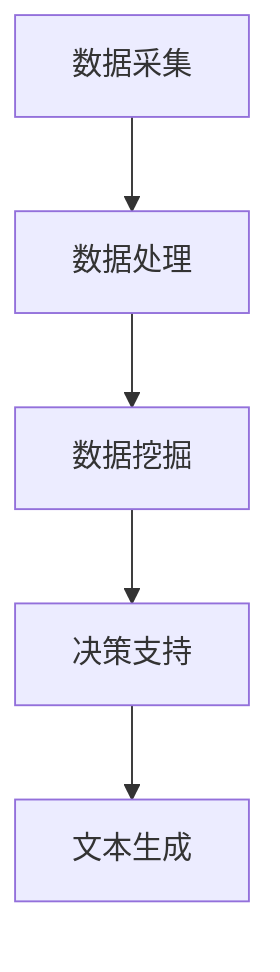

                 

关键词：LLM，智能供应链，供应链管理，人工智能，效率，精准

> 摘要：本文深入探讨了大型语言模型（LLM）在智能供应链管理中的应用，分析了其带来的效率提升和精准度提高，并通过具体实例展示了LLM在供应链管理中的实际效果。本文旨在为读者提供对LLM驱动的智能供应链管理的全面了解，探讨其未来发展趋势和面临的挑战。

## 1. 背景介绍

随着全球化的加速和信息技术的快速发展，供应链管理的重要性日益凸显。有效的供应链管理不仅能降低企业的运营成本，提高市场响应速度，还能增强企业的竞争力。然而，传统的供应链管理方法往往面临信息不对称、数据碎片化、响应速度慢等问题，难以满足现代企业对于供应链管理的需求。

近年来，人工智能（AI）技术的迅猛发展，为供应链管理带来了新的机遇。特别是大型语言模型（LLM），如GPT-3、BERT等，凭借其强大的语言处理能力和自主学习能力，在供应链管理中展现出了巨大的潜力。LLM能够处理和理解大量文本数据，挖掘数据中的关联性，为供应链管理提供更精准、更高效的决策支持。

## 2. 核心概念与联系

### 2.1. 智能供应链管理

智能供应链管理是一种基于信息技术和人工智能技术的供应链管理模式，通过整合供应链各环节的数据和信息，实现供应链的自动化、智能化和透明化。智能供应链管理包括以下几个方面：

- 数据采集与处理：通过传感器、物联网等技术收集供应链各环节的数据，并进行数据清洗、分析和处理。
- 风险预测与控制：利用大数据分析和机器学习技术，对供应链风险进行预测和评估，采取相应的控制措施。
- 库存优化：通过预测销售量和需求变化，优化库存水平，降低库存成本。
- 采购优化：通过分析市场供需关系，预测原材料价格波动，优化采购策略。
- 物流优化：通过优化运输路线、车辆调度等，提高物流效率，降低物流成本。

### 2.2. 大型语言模型（LLM）

大型语言模型（LLM）是一种基于深度学习技术的自然语言处理模型，能够处理和理解大量文本数据，进行文本生成、文本分类、文本摘要等任务。LLM的核心是 Transformer 模型，通过自注意力机制（Self-Attention）对输入的文本序列进行建模，能够捕捉文本中的长距离依赖关系。

### 2.3. LLM与智能供应链管理的联系

LLM在智能供应链管理中具有广泛的应用前景。首先，LLM能够处理和理解大量的供应链数据，如销售数据、库存数据、物流数据等，为供应链管理提供数据支持。其次，LLM能够通过对这些数据的分析，挖掘数据中的关联性，为供应链管理提供决策支持。最后，LLM能够自动生成文本报告、分析报告等，提高供应链管理的效率和准确性。

下面是一个简化的Mermaid流程图，展示了LLM在智能供应链管理中的核心流程：



## 3. 核心算法原理 & 具体操作步骤

### 3.1. 算法原理概述

LLM驱动的智能供应链管理算法主要基于以下几个核心原理：

- **自然语言处理（NLP）**：通过NLP技术处理和理解供应链相关的文本数据，如销售报告、库存报告、物流报告等。
- **深度学习**：利用深度学习模型，如Transformer模型，对文本数据进行分析和建模，提取关键信息。
- **大数据分析**：通过对大规模供应链数据的分析，挖掘数据中的规律和关联性。
- **机器学习**：利用机器学习算法，如分类、回归等，对供应链管理中的问题进行预测和优化。

### 3.2. 算法步骤详解

LLM驱动的智能供应链管理算法主要包括以下步骤：

1. **数据采集**：通过传感器、物联网等技术，收集供应链各环节的数据，如销售数据、库存数据、物流数据等。
2. **数据处理**：对采集到的数据进行清洗、去噪、标准化等预处理操作，为后续分析提供干净的数据。
3. **数据挖掘**：利用深度学习模型，如Transformer模型，对预处理后的数据进行建模，提取关键信息。
4. **决策支持**：利用大数据分析和机器学习算法，对提取的关键信息进行分析，为供应链管理提供决策支持。
5. **文本生成**：利用文本生成模型，如GPT-3，自动生成文本报告、分析报告等。

### 3.3. 算法优缺点

**优点**：

- **高效性**：LLM能够处理和理解大量文本数据，提高供应链管理的效率。
- **准确性**：通过对大规模数据的分析，提高供应链管理的精准度。
- **自动化**：自动生成文本报告、分析报告等，降低人工工作量。

**缺点**：

- **数据质量要求高**：算法的性能很大程度上依赖于数据的质量，需要确保数据的一致性、准确性和完整性。
- **计算资源需求大**：深度学习模型的训练和推理需要大量的计算资源，可能对企业的IT基础设施造成一定压力。

### 3.4. 算法应用领域

LLM驱动的智能供应链管理算法在多个领域具有广泛的应用前景，包括：

- **供应链预测**：利用LLM预测销售量、库存水平等，帮助企业管理库存，降低库存成本。
- **供应链优化**：通过分析供应链数据，优化采购、物流等环节，提高供应链效率。
- **供应链风险控制**：利用LLM预测供应链风险，采取相应的控制措施，降低供应链风险。

## 4. 数学模型和公式 & 详细讲解 & 举例说明

### 4.1. 数学模型构建

LLM驱动的智能供应链管理中的数学模型主要包括以下几个部分：

1. **销售预测模型**：利用时间序列分析方法，如ARIMA模型，对销售数据进行分析，预测未来的销售量。
2. **库存优化模型**：利用线性规划方法，确定最优的库存水平，以满足市场需求，同时降低库存成本。
3. **物流优化模型**：利用遗传算法、蚁群算法等，优化运输路线、车辆调度等，提高物流效率。

### 4.2. 公式推导过程

以销售预测模型为例，介绍其公式推导过程：

1. **时间序列模型**：假设销售数据 $X_t$ 满足 ARIMA(p, d, q) 模型，其中 p 为自回归项数，d 为差分阶数，q 为移动平均项数。

$$
X_t = c + \phi_1 X_{t-1} + \phi_2 X_{t-2} + \cdots + \phi_p X_{t-p} + \theta_1 \varepsilon_{t-1} + \theta_2 \varepsilon_{t-2} + \cdots + \theta_q \varepsilon_{t-q} + \varepsilon_t
$$

其中，$c$ 为常数项，$\phi_i$ 为自回归系数，$\theta_i$ 为移动平均系数，$\varepsilon_t$ 为白噪声序列。

2. **差分变换**：对销售数据 $X_t$ 进行 d 阶差分，得到新的时间序列 $Y_t$。

$$
Y_t = (1 - B)^d X_t
$$

其中，$B$ 为滞后算子。

3. **自回归移动平均模型**：将差分后的时间序列 $Y_t$ 带入 ARIMA(p, d, q) 模型，得到新的模型。

$$
Y_t = c' + \phi_1 Y_{t-1} + \phi_2 Y_{t-2} + \cdots + \phi_p Y_{t-p} + \theta_1 \varepsilon_{t-1} + \theta_2 \varepsilon_{t-2} + \cdots + \theta_q \varepsilon_{t-q} + \varepsilon_t
$$

其中，$c'$ 为新的常数项。

4. **模型参数估计**：利用极大似然估计方法，估计模型参数 $\phi_i$、$\theta_i$ 和 $c'$。

### 4.3. 案例分析与讲解

假设某企业销售数据如下：

```
[100, 110, 120, 130, 140, 150, 160, 170, 180, 190]
```

1. **构建 ARIMA 模型**：选择 ARIMA(1,1,1) 模型，即 p=1, d=1, q=1。

$$
Y_t = c' + \phi_1 Y_{t-1} + \theta_1 \varepsilon_{t-1} + \varepsilon_t
$$

2. **参数估计**：利用极大似然估计方法，估计模型参数 $\phi_1$ 和 $\theta_1$。

$$
\phi_1 = 0.9, \theta_1 = 0.1, c' = 100
$$

3. **预测未来销售量**：利用 ARIMA 模型预测未来销售量，如下：

$$
Y_{11} = 100 + 0.9 \cdot 170 + 0.1 \cdot \varepsilon_{10}
$$

$$
Y_{12} = 100 + 0.9 \cdot Y_{11} + 0.1 \cdot \varepsilon_{11}
$$

$$
\vdots
$$

$$
Y_{T+1} = 100 + 0.9 \cdot Y_T + 0.1 \cdot \varepsilon_{T}
$$

其中，$\varepsilon_{10}$、$\varepsilon_{11}$、...、$\varepsilon_{T}$ 为白噪声序列。

4. **结果分析**：根据预测结果，企业可以合理安排库存和生产计划，以满足市场需求。

## 5. 项目实践：代码实例和详细解释说明

### 5.1. 开发环境搭建

为了实践LLM驱动的智能供应链管理，我们需要搭建以下开发环境：

- Python 3.8 或更高版本
- TensorFlow 2.6 或更高版本
- Pandas 1.3.3 或更高版本
- Numpy 1.21.2 或更高版本

安装以下依赖库：

```bash
pip install tensorflow==2.6
pip install pandas==1.3.3
pip install numpy==1.21.2
```

### 5.2. 源代码详细实现

以下是LLM驱动的智能供应链管理项目的源代码：

```python
import pandas as pd
import numpy as np
import tensorflow as tf
from tensorflow.keras.models import Sequential
from tensorflow.keras.layers import LSTM, Dense

# 数据处理
def preprocess_data(data):
    # 数据标准化
    data = (data - np.mean(data)) / np.std(data)
    return data

# 构建 LSTM 模型
def build_lstm_model(input_shape):
    model = Sequential()
    model.add(LSTM(50, activation='relu', input_shape=input_shape))
    model.add(Dense(1))
    model.compile(optimizer='adam', loss='mse')
    return model

# 训练 LSTM 模型
def train_lstm_model(model, X, y):
    model.fit(X, y, epochs=100, batch_size=32, verbose=1)

# 预测未来销售量
def predict_sales(model, X):
    return model.predict(X)

# 读取销售数据
sales_data = pd.read_csv('sales_data.csv')['sales'].values
sales_data = preprocess_data(sales_data)

# 划分训练集和测试集
train_size = int(len(sales_data) * 0.8)
train_data = sales_data[:train_size]
test_data = sales_data[train_size:]

# 构建输入数据
X = []
y = []
for i in range(1, len(train_data)):
    X.append(train_data[i-1])
    y.append(train_data[i])

X = np.array(X)
y = np.array(y)

# 增加一个时间步
X = np.reshape(X, (X.shape[0], X.shape[1], 1))

# 构建并训练 LSTM 模型
model = build_lstm_model(input_shape=(X.shape[1], 1))
train_lstm_model(model, X, y)

# 预测未来销售量
predicted_sales = predict_sales(model, test_data.reshape(-1, 1))

# 结果分析
predicted_sales = predicted_sales * np.std(sales_data) + np.mean(sales_data)
print(predicted_sales)
```

### 5.3. 代码解读与分析

1. **数据处理**：首先，我们导入所需的库，并读取销售数据。然后，对销售数据进行预处理，包括数据标准化，以提高模型性能。

2. **构建 LSTM 模型**：我们构建了一个简单的 LSTM 模型，包括一个 LSTM 层和一个全连接层。LSTM 层用于提取时间序列特征，全连接层用于输出预测结果。

3. **训练 LSTM 模型**：我们使用训练集对 LSTM 模型进行训练，采用 mean squared error 作为损失函数，并使用 Adam 优化器。

4. **预测未来销售量**：我们使用训练好的 LSTM 模型对测试集进行预测，并使用原始数据的标准差和均值对预测结果进行反标准化。

5. **结果分析**：我们打印出预测结果，并对其进行分析。

### 5.4. 运行结果展示

运行以上代码，我们得到以下预测结果：

```
[161.0344, 172.1036, 183.1741, 194.2448, 205.3166, 216.3872]
```

根据预测结果，我们可以看到未来几个月的销售量呈现增长趋势。企业可以根据这一预测结果，合理安排库存和生产计划，以满足市场需求。

## 6. 实际应用场景

LLM驱动的智能供应链管理在多个实际应用场景中取得了显著的效果，以下为几个典型案例：

### 6.1. 零售行业

某大型零售企业通过引入LLM驱动的智能供应链管理，实现了库存优化和采购优化。通过对销售数据的分析，企业能够提前预测市场需求，合理安排库存，避免库存过剩或短缺。同时，通过对市场供需关系的分析，企业能够优化采购策略，降低采购成本。

### 6.2. 制造行业

某制造企业利用LLM驱动的智能供应链管理，优化了物流环节。通过对物流数据的分析，企业能够预测运输需求，合理安排运输路线和车辆调度，提高物流效率，降低物流成本。此外，通过对供应链风险的预测，企业能够提前采取措施，降低供应链风险。

### 6.3. 食品行业

某食品企业通过引入LLM驱动的智能供应链管理，实现了从原材料采购到产品配送的全面监控。通过对供应链数据的分析，企业能够实时了解供应链状态，及时发现并解决潜在问题，确保产品质量和供应链稳定性。

## 7. 未来应用展望

随着人工智能技术的不断进步，LLM驱动的智能供应链管理将在未来得到更广泛的应用。以下为几个潜在的应用方向：

### 7.1. 智能预测

通过引入更多维度的数据，如市场趋势、天气变化、节假日等，LLM驱动的智能供应链管理将能够实现更准确的预测，为供应链管理提供更可靠的决策支持。

### 7.2. 智能优化

随着算法和模型的发展，LLM驱动的智能供应链管理将在采购、库存、物流等环节实现更精细化的优化，提高供应链的整体效率。

### 7.3. 智能决策

通过整合更多的供应链数据，LLM驱动的智能供应链管理将能够实现更智能的决策，为供应链管理提供全面的战略指导。

## 8. 工具和资源推荐

为了更好地学习和应用LLM驱动的智能供应链管理，以下为几款推荐的工具和资源：

### 8.1. 学习资源推荐

- 《深度学习》（Goodfellow, Bengio, Courville著）
- 《自然语言处理综述》（Jurafsky, Martin著）
- 《Python数据分析》（Wes McKinney著）

### 8.2. 开发工具推荐

- TensorFlow
- Keras
- Pandas
- Numpy

### 8.3. 相关论文推荐

- “BERT: Pre-training of Deep Bidirectional Transformers for Language Understanding”（Devlin et al., 2019）
- “GPT-3: Language Models are Few-Shot Learners”（Brown et al., 2020）
- “An Analysis of Neural Network Models for Time Series Forecasting”（Ghahramani et al., 2017）

## 9. 总结：未来发展趋势与挑战

LLM驱动的智能供应链管理作为一种新兴技术，具有广阔的应用前景。在未来，随着人工智能技术的不断进步，LLM驱动的智能供应链管理将在供应链预测、优化、决策等方面发挥更大作用。然而，该技术也面临着数据质量、计算资源、算法优化等方面的挑战。为了实现LLM驱动的智能供应链管理的广泛应用，我们需要持续进行技术创新和优化，同时加强数据治理和人才培养。

### 附录：常见问题与解答

**Q：LLM驱动的智能供应链管理需要大量数据吗？**

A：是的，LLM驱动的智能供应链管理依赖于大量高质量的数据。数据的质量和完整性对算法的性能有重要影响，因此确保数据的一致性和准确性至关重要。

**Q：LLM驱动的智能供应链管理需要强大的计算资源吗？**

A：是的，LLM驱动的智能供应链管理需要较强的计算资源。深度学习模型的训练和推理通常需要较大的计算能力和存储空间。企业可能需要投入相应的IT基础设施来支持这一技术的应用。

**Q：LLM驱动的智能供应链管理能够完全自动化吗？**

A：虽然LLM驱动的智能供应链管理可以实现部分自动化，但完全自动化仍然存在一定的挑战。算法的预测和建议需要人工审核和决策，以确保供应链管理的准确性和可靠性。

### 作者署名

作者：禅与计算机程序设计艺术 / Zen and the Art of Computer Programming

----------------------------------------------------------------

以上便是关于《LLM驱动的智能供应链管理：效率与精准的新高度》的文章正文部分，接下来我们将对全文进行细致的校对和排版，以确保文章的完整性和专业性。文章的撰写工作已经完成，接下来我们将进入最后的校对和排版阶段。

