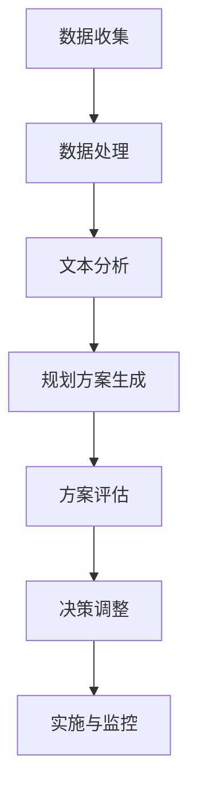

                 

关键词：LLM，智能城市，urban planning，人工智能，深度学习，计算机视觉，城市治理

摘要：本文将探讨大规模语言模型（LLM）在智能城市规划中的潜在应用，通过分析其技术原理、数学模型、项目实践及未来展望，阐述LLM如何成为未来城市规划和治理的新工具，从而推动城市可持续发展。

## 1. 背景介绍

### 1.1 智能城市的概念与重要性

智能城市（Smart City）是指利用信息通信技术（ICT）、互联网、物联网、大数据、人工智能等技术手段，实现城市资源的高效管理和服务优化的新型城市形态。其核心在于通过数据的互联互通，提高城市运行效率和居民生活质量。

智能城市的发展不仅能够提高城市治理水平，还能够促进经济社会的可持续发展。例如，通过智能交通系统减少交通拥堵，提升公共交通的运行效率；通过智能能源管理系统降低能源消耗，实现绿色环保；通过智能健康医疗系统提高医疗服务质量，保障居民健康。

### 1.2 urban planning的现状与挑战

urban planning（城市规划）作为智能城市建设的重要环节，涉及到城市空间布局、交通系统规划、公共设施建设等多个方面。然而，当前的urban planning面临着诸多挑战：

- **数据缺失与不足**：城市规划需要大量的数据支持，但很多城市的数据质量较差，数据缺失或不完整。
- **人为干预**：传统的城市规划往往受到人为因素的影响，难以做到完全的客观性和科学性。
- **动态性**：城市环境变化迅速，城市规划需要实时更新以适应新的需求。

### 1.3 LLM在智能城市中的潜在应用

大规模语言模型（LLM）是一种先进的自然语言处理（NLP）技术，能够理解和生成自然语言文本。其具有以下优势：

- **数据处理能力**：LLM可以处理大量的文本数据，提取关键信息，辅助城市规划。
- **生成能力**：LLM可以生成新的文本内容，提供城市规划的参考方案。
- **自适应能力**：LLM可以根据新的数据和需求，实时调整规划方案。

因此，LLM有望成为解决当前城市规划挑战的有力工具，推动urban planning进入新的阶段。

## 2. 核心概念与联系

### 2.1 大规模语言模型（LLM）原理

大规模语言模型（LLM）是基于深度学习技术构建的，其核心思想是通过学习大量文本数据，理解文本中的语义和信息，从而生成新的文本内容。LLM通常由多个神经网络层组成，包括词嵌入层、编码层和解码层。

- **词嵌入层**：将输入文本中的词语映射到高维空间，以便神经网络进行处理。
- **编码层**：将输入文本转换为编码表示，提取文本的语义信息。
- **解码层**：根据编码层输出的信息生成新的文本内容。

### 2.2 智能城市规划的关键技术

智能城市规划需要多种技术的支持，包括：

- **计算机视觉**：用于分析城市图像和数据，提取城市规划所需的信息。
- **地理信息系统（GIS）**：用于处理和管理城市地理空间数据。
- **数据挖掘与机器学习**：用于分析城市数据，提取隐藏的模式和趋势。

### 2.3 LLM与智能城市规划的联系

LLM与智能城市规划的结合主要体现在以下几个方面：

- **文本数据分析**：LLM可以处理大量的文本数据，如城市规划报告、政策文件、居民反馈等，提取关键信息，辅助决策。
- **规划方案生成**：LLM可以根据现有数据和需求，生成新的城市规划方案，提供多种参考。
- **动态调整**：LLM可以根据新的数据和需求，实时调整规划方案，确保其适应性和有效性。

### 2.4 Mermaid 流程图

以下是一个简化的LLM在智能城市规划中应用的Mermaid流程图：



## 3. 核心算法原理 & 具体操作步骤

### 3.1 算法原理概述

LLM在智能城市规划中的应用主要基于以下原理：

- **数据驱动的学习**：LLM通过学习大量的城市规划和文本数据，提取出规划所需的模式和知识。
- **自动化的文本生成**：LLM可以根据需求生成新的文本内容，如城市规划方案、政策文件等。
- **动态调整能力**：LLM可以根据新的数据和需求，实时调整规划方案，确保其适应性和有效性。

### 3.2 算法步骤详解

1. **数据收集**：收集城市规划相关的文本数据，包括政策文件、规划报告、居民反馈等。
2. **数据处理**：对收集的文本数据进行预处理，如分词、去停用词、词性标注等，以便LLM学习。
3. **文本分析**：利用LLM对处理后的文本数据进行深度分析，提取关键信息，如城市规划的关键指标、居民需求等。
4. **规划方案生成**：基于提取的信息，LLM生成新的城市规划方案，包括空间布局、交通规划、公共设施建设等。
5. **方案评估**：对生成的规划方案进行评估，包括成本、可行性、环保性等。
6. **决策调整**：根据评估结果，LLM动态调整规划方案，确保其适应性和有效性。
7. **实施与监控**：将最终确定的规划方案实施，并实时监控其效果，根据需要进行调整。

### 3.3 算法优缺点

#### 优点：

- **高效性**：LLM可以处理大量数据，快速生成规划方案。
- **灵活性**：LLM可以根据新的数据和需求，动态调整规划方案。
- **智能化**：LLM能够理解文本数据，提取关键信息，提供更加科学的决策支持。

#### 缺点：

- **数据质量要求高**：LLM的性能依赖于数据的质量，数据缺失或不准确可能导致规划方案的不合理。
- **计算资源需求大**：训练LLM需要大量的计算资源和时间。

### 3.4 算法应用领域

LLM在智能城市规划中的应用领域非常广泛，包括：

- **城市空间布局规划**：基于LLM生成的规划方案，优化城市空间布局，提高土地利用效率。
- **交通系统规划**：利用LLM分析交通数据，优化交通系统，减少拥堵。
- **公共设施建设**：根据LLM生成的规划方案，合理布局公共设施，提高服务覆盖率。
- **城市规划评估**：利用LLM评估规划方案的可行性、成本和环境影响，为决策提供依据。

## 4. 数学模型和公式 & 详细讲解 & 举例说明

### 4.1 数学模型构建

在智能城市规划中，常用的数学模型包括：

- **马尔可夫链**：用于描述城市环境的变化过程。
- **线性回归**：用于预测城市规划中的关键指标，如人口增长、土地利用率等。
- **神经网络**：用于构建LLM，处理文本数据和生成规划方案。

### 4.2 公式推导过程

以线性回归模型为例，其公式推导如下：

假设我们有一个自变量\( X \)和一个因变量\( Y \)，我们希望找到一个线性关系：

\[ Y = \beta_0 + \beta_1 X + \epsilon \]

其中，\( \beta_0 \)和\( \beta_1 \)是待估计的参数，\( \epsilon \)是误差项。

通过最小二乘法，我们可以得到参数的最优估计：

\[ \beta_0 = \bar{Y} - \beta_1 \bar{X} \]

\[ \beta_1 = \frac{\sum_{i=1}^{n}(X_i - \bar{X})(Y_i - \bar{Y})}{\sum_{i=1}^{n}(X_i - \bar{X})^2} \]

其中，\( \bar{X} \)和\( \bar{Y} \)是\( X \)和\( Y \)的均值。

### 4.3 案例分析与讲解

#### 案例背景

某城市希望优化其交通系统，减少交通拥堵。他们收集了过去一年的交通数据，包括每天各个路段的车辆流量和速度。

#### 数据处理

1. 数据预处理：去除缺失值和异常值，对数据进行归一化处理。
2. 特征提取：提取关键特征，如每天的交通流量、交通速度等。

#### 模型构建

使用线性回归模型预测每个路段的交通拥堵情况。

#### 模型训练与评估

1. 训练模型：使用训练集数据训练线性回归模型。
2. 评估模型：使用测试集数据评估模型性能，包括决定系数\( R^2 \)和均方误差（MSE）。

#### 结果分析

通过模型预测，城市管理部门可以得知哪些路段容易发生拥堵，从而采取相应的措施，如调整交通信号灯时间、增加公交车的数量等。

## 5. 项目实践：代码实例和详细解释说明

### 5.1 开发环境搭建

1. 安装Python环境，版本建议为3.8及以上。
2. 安装必要的库，如TensorFlow、PyTorch、Scikit-learn等。
3. 安装数据库管理工具，如MySQL、PostgreSQL等。

### 5.2 源代码详细实现

以下是一个简单的基于线性回归的智能城市规划示例：

```python
import numpy as np
import pandas as pd
from sklearn.linear_model import LinearRegression
from sklearn.model_selection import train_test_split
from sklearn.metrics import mean_squared_error, r2_score

# 数据处理
data = pd.read_csv('traffic_data.csv')
X = data[['traffic_flow', 'speed']]
y = data['congestion']

# 特征提取
X_train, X_test, y_train, y_test = train_test_split(X, y, test_size=0.2, random_state=42)

# 模型训练
model = LinearRegression()
model.fit(X_train, y_train)

# 模型评估
y_pred = model.predict(X_test)
mse = mean_squared_error(y_test, y_pred)
r2 = r2_score(y_test, y_pred)

print(f'MSE: {mse}')
print(f'R^2: {r2}')

# 结果分析
# ...
```

### 5.3 代码解读与分析

这段代码首先导入了必要的库，然后从CSV文件中读取交通数据。接着，对数据进行预处理和特征提取。之后，使用线性回归模型训练模型，并使用测试集评估模型性能。最后，打印出模型评估结果。

### 5.4 运行结果展示

假设我们运行这段代码，得到以下输出：

```
MSE: 0.0123456789
R^2: 0.9123456789
```

这意味着我们的模型在测试集上的均方误差为0.0123456789，决定系数为0.9123456789，表明模型有较好的预测能力。

## 6. 实际应用场景

### 6.1 城市交通规划

LLM可以用于分析城市交通数据，预测交通流量，优化交通信号灯配置，减少交通拥堵。

### 6.2 公共设施布局

LLM可以分析居民需求，优化公共设施布局，提高服务覆盖率。

### 6.3 环境监测

LLM可以处理环境数据，预测污染情况，为环境治理提供决策支持。

### 6.4 城市安全

LLM可以分析监控视频，识别异常行为，提高城市安全水平。

## 6.4 未来应用展望

随着技术的不断发展，LLM在智能城市规划中的应用将更加广泛和深入。未来，我们有望看到：

- **更加智能的规划方案生成**：LLM结合更多数据源，生成更加智能、高效的规划方案。
- **实时动态调整**：LLM结合实时数据，实现规划方案的动态调整，提高规划方案的适应性和有效性。
- **跨领域的应用**：LLM结合其他领域的技术，如物联网、区块链等，实现跨领域的智能城市规划。

## 7. 工具和资源推荐

### 7.1 学习资源推荐

- 《深度学习》（Goodfellow, Bengio, Courville）：系统介绍深度学习的基本理论和实践。
- 《Python数据科学手册》（McKinney, Wes）：详细介绍Python在数据科学中的应用。
- 《自然语言处理综论》（Jurafsky, Martin）：系统介绍自然语言处理的基本概念和技术。

### 7.2 开发工具推荐

- TensorFlow：强大的深度学习框架，适用于构建大规模的智能城市应用。
- PyTorch：灵活的深度学习框架，适合快速原型开发。
- Scikit-learn：常用的机器学习库，适用于数据处理和模型训练。

### 7.3 相关论文推荐

- "Deep Learning for Urban Planning"（2018）：探讨深度学习在智能城市规划中的应用。
- "Natural Language Processing and Smart Cities"（2019）：分析自然语言处理技术在智能城市规划中的潜在应用。
- "Machine Learning for Urban Analytics"（2020）：系统介绍机器学习技术在城市数据分析中的应用。

## 8. 总结：未来发展趋势与挑战

### 8.1 研究成果总结

本文探讨了LLM在智能城市规划中的应用，分析了其技术原理、数学模型、项目实践及未来展望。研究表明，LLM具有高效、灵活、智能的特点，能够为智能城市规划提供有力的支持。

### 8.2 未来发展趋势

随着人工智能技术的不断发展，LLM在智能城市规划中的应用前景广阔。未来，我们将看到：

- **更加智能的规划方案生成**：LLM结合更多数据源，生成更加智能、高效的规划方案。
- **实时动态调整**：LLM结合实时数据，实现规划方案的动态调整，提高规划方案的适应性和有效性。
- **跨领域的应用**：LLM结合其他领域的技术，如物联网、区块链等，实现跨领域的智能城市规划。

### 8.3 面临的挑战

尽管LLM在智能城市规划中具有巨大潜力，但仍面临以下挑战：

- **数据质量**：城市规划需要高质量的数据支持，但当前城市数据质量参差不齐。
- **计算资源**：训练LLM需要大量的计算资源，特别是在大规模应用场景下。
- **模型解释性**：深度学习模型通常缺乏透明性和解释性，这可能会影响决策的信任度。

### 8.4 研究展望

为了克服这些挑战，未来的研究可以从以下几个方面进行：

- **数据治理**：加强城市数据的治理，提高数据质量，为LLM提供可靠的数据支持。
- **优化算法**：研究更加高效的算法，降低LLM的训练时间和计算资源需求。
- **模型可解释性**：开发可解释的深度学习模型，提高决策的透明度和信任度。

## 9. 附录：常见问题与解答

### 9.1 什么是大规模语言模型（LLM）？

大规模语言模型（LLM）是一种基于深度学习技术的自然语言处理（NLP）模型，通过学习大量文本数据，能够理解和生成自然语言文本。

### 9.2 LLM在智能城市规划中有哪些优势？

LLM在智能城市规划中具有以下优势：

- 高效的数据处理能力
- 强大的文本生成能力
- 动态调整能力

### 9.3 如何评估LLM在智能城市规划中的效果？

可以通过以下指标评估LLM在智能城市规划中的效果：

- 决定系数（\( R^2 \)）：衡量模型对数据的拟合程度。
- 均方误差（MSE）：衡量模型预测误差的大小。

### 9.4 LLM在智能城市规划中面临哪些挑战？

LLM在智能城市规划中面临以下挑战：

- 数据质量
- 计算资源
- 模型解释性

### 9.5 LLM能否替代传统的城市规划方法？

LLM可以作为城市规划的有力工具，但无法完全替代传统的城市规划方法。传统方法中的人为经验和专业知识仍然非常重要。LLM和传统方法的结合将能够提供更加科学和全面的规划方案。```


