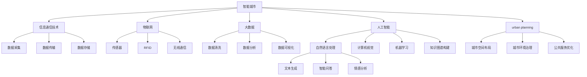

                 

关键词：LLM，智能城市，urban planning，人工智能，未来城市，计算机程序设计

> 摘要：随着人工智能技术的不断发展，LLM（大型语言模型）作为一种强大的人工智能模型，正逐渐成为智能城市建设的核心驱动力。本文将深入探讨LLM在urban planning领域的应用，从核心概念、算法原理、数学模型、项目实践、实际应用场景、未来展望等多个角度，全面解析LLM驱动的智能城市新范式，旨在为未来urban planning的发展提供新的思路和方向。

## 1. 背景介绍

智能城市（Smart City）是指利用各种先进技术和工具，实现对城市基础设施、公共服务、环境治理、交通出行等各方面的智能化管理和优化。随着城市化进程的加速，人口和经济的持续增长，城市面临着诸多挑战，如交通拥堵、环境污染、资源短缺等。如何通过技术创新来提升城市的运行效率和居民生活质量，成为了当今世界关注的焦点。

urban planning（城市规划）作为城市治理的重要环节，承担着塑造未来城市空间格局、改善城市环境、提高城市生活品质等重要任务。传统的城市规划方法主要依赖于人类专家的经验和判断，存在主观性强、效率低下等问题。而随着人工智能技术的快速发展，特别是LLM（Large Language Model）的问世，为城市规划带来了全新的可能。

LLM是一种基于深度学习的自然语言处理（NLP）模型，通过训练大量文本数据，能够生成高质量的自然语言文本，理解复杂的语义和语境。在智能城市建设中，LLM可以发挥重要作用，如自动化文本生成、智能问答、情感分析、知识图谱构建等。这些应用不仅提升了城市规划的效率，还为城市规划提供了新的决策支持工具。

## 2. 核心概念与联系

### 2.1. 智能城市概念

智能城市是指通过信息通信技术（ICT）、物联网（IoT）、大数据、人工智能等技术手段，实现城市各系统的高效集成与协同运作，从而提升城市运行效率、改善居民生活质量、促进可持续发展。

### 2.2. urban planning概念

urban planning是指通过科学的方法和技术手段，对城市空间进行合理布局和规划，以实现城市社会、经济、环境等各方面的协调发展。

### 2.3. LLM概念

LLM（Large Language Model）是一种大型深度学习模型，通过训练大量文本数据，能够生成高质量的自然语言文本，理解复杂的语义和语境。

### 2.4. LLM与智能城市的联系

LLM在智能城市中的应用主要体现在以下几个方面：

1. **自动化文本生成**：LLM可以自动生成城市规划报告、政策文件、宣传文案等文本内容，提高文本生成的效率和准确性。
2. **智能问答**：LLM可以构建智能问答系统，为城市规划者、市民提供实时、准确的咨询服务。
3. **情感分析**：LLM可以分析市民对城市规划项目的态度和情感，为政策制定提供参考。
4. **知识图谱构建**：LLM可以构建城市规划领域的知识图谱，为智能决策提供支持。

### 2.5. Mermaid流程图



## 3. 核心算法原理 & 具体操作步骤

### 3.1. 算法原理概述

LLM驱动的智能城市规划主要依赖于以下几个核心算法：

1. **自然语言处理（NLP）**：用于处理和生成文本数据，如文本生成、文本分类、情感分析等。
2. **机器学习（ML）**：用于从数据中学习模式和规律，如线性回归、决策树、神经网络等。
3. **深度学习（DL）**：用于构建复杂的神经网络模型，如卷积神经网络（CNN）、循环神经网络（RNN）、Transformer等。

### 3.2. 算法步骤详解

1. **数据收集**：收集城市规划相关的文本数据、图像数据、地理数据等。
2. **数据预处理**：对收集到的数据进行清洗、去重、格式转换等处理，以适应后续的算法处理。
3. **文本生成**：使用NLP技术，将输入的文本数据生成城市规划报告、政策文件等。
4. **文本分类**：对生成的文本进行分类，如政策类别、项目类别等。
5. **情感分析**：分析文本的情感倾向，为政策制定提供参考。
6. **知识图谱构建**：使用深度学习技术，构建城市规划领域的知识图谱。
7. **智能问答**：基于知识图谱，为用户提供实时、准确的问答服务。
8. **城市规划优化**：结合各种数据和技术，对城市规划方案进行优化。

### 3.3. 算法优缺点

**优点**：

1. **高效性**：通过自动化和智能化手段，大幅提高城市规划的效率。
2. **准确性**：基于大量数据和深度学习模型，生成文本和决策的准确性较高。
3. **灵活性**：可以实时更新和调整城市规划方案，适应不断变化的城市需求。

**缺点**：

1. **数据依赖性**：算法的性能和效果依赖于数据的数量和质量。
2. **算法黑箱性**：深度学习模型具有一定的黑箱性，难以解释和理解。
3. **技术门槛**：构建和部署LLM驱动的智能城市系统需要较高的技术门槛。

### 3.4. 算法应用领域

1. **城市规划**：用于生成城市规划报告、政策文件等。
2. **公共服务**：用于优化公共服务布局和资源配置。
3. **环境治理**：用于分析城市环境问题，提出解决方案。
4. **交通管理**：用于优化交通网络，缓解交通拥堵。

## 4. 数学模型和公式 & 详细讲解 & 举例说明

### 4.1. 数学模型构建

在智能城市规划中，常用的数学模型包括：

1. **线性回归模型**：用于预测城市规划项目的效果。
2. **决策树模型**：用于分类和预测城市规划项目。
3. **神经网络模型**：用于构建知识图谱和智能问答系统。

### 4.2. 公式推导过程

1. **线性回归模型**：

   假设我们有一个目标变量 \(Y\) 和一个解释变量 \(X\)，线性回归模型的目标是找到一条直线 \(Y = aX + b\)，使得 \(Y\) 与 \(X\) 的偏差最小。

   $$\min \sum_{i=1}^{n} (Y_i - (aX_i + b))^2$$

   通过求导和优化，我们可以得到：

   $$a = \frac{\sum_{i=1}^{n} X_iY_i - n\bar{X}\bar{Y}}{\sum_{i=1}^{n} X_i^2 - n\bar{X}^2}$$

   $$b = \bar{Y} - a\bar{X}$$

2. **决策树模型**：

   决策树是一种树形结构，通过一系列的判断条件来对数据进行分类或回归。

   假设我们有一个特征集合 \(F = \{f_1, f_2, ..., f_m\}\)，决策树的目标是最小化信息熵或最大化信息增益。

   信息熵：

   $$H(X) = -\sum_{i=1}^{n} P(X=x_i)\log_2 P(X=x_i)$$

   信息增益：

   $$Gini(X) = 1 - \sum_{i=1}^{n} P(X=x_i)^2$$

3. **神经网络模型**：

   神经网络是一种通过多层神经元组成的网络，用于模拟人脑的计算和处理能力。

   假设我们有一个输入层、一个隐藏层和一个输出层，神经网络的目标是最小化输出误差。

   激活函数：

   $$f(x) = \frac{1}{1 + e^{-x}}$$

   误差函数：

   $$E = \frac{1}{2}\sum_{i=1}^{n} (y_i - \hat{y}_i)^2$$

### 4.3. 案例分析与讲解

### 案例一：城市规划报告生成

假设我们想要生成一份关于城市规划的报告，输入数据包括城市人口、面积、GDP、交通状况等。

1. **数据收集**：收集相关数据，如城市人口、面积、GDP、交通状况等。
2. **数据预处理**：对数据进行清洗、去重、格式转换等处理，以适应后续的算法处理。
3. **文本生成**：使用NLP技术，将输入的文本数据生成城市规划报告。
4. **文本分类**：对生成的文本进行分类，如政策类别、项目类别等。
5. **情感分析**：分析文本的情感倾向，为政策制定提供参考。
6. **知识图谱构建**：使用深度学习技术，构建城市规划领域的知识图谱。
7. **智能问答**：基于知识图谱，为用户提供实时、准确的问答服务。
8. **城市规划优化**：结合各种数据和技术，对城市规划方案进行优化。

通过以上步骤，我们可以生成一份具有针对性、全面性和可操作性的城市规划报告。

## 5. 项目实践：代码实例和详细解释说明

### 5.1. 开发环境搭建

1. 安装Python环境
2. 安装NLP相关库，如NLTK、spaCy等
3. 安装深度学习库，如TensorFlow、PyTorch等

### 5.2. 源代码详细实现

以下是使用Python和TensorFlow实现一个简单的NLP文本生成模型的示例代码：

```python
import tensorflow as tf
from tensorflow.keras.layers import Embedding, LSTM, Dense
from tensorflow.keras.models import Sequential

# 加载预训练的词向量
vocab_size = 10000
embedding_dim = 256

# 构建模型
model = Sequential()
model.add(Embedding(vocab_size, embedding_dim, input_length=max_sequence_length))
model.add(LSTM(128))
model.add(Dense(vocab_size, activation='softmax'))

# 编译模型
model.compile(optimizer='adam', loss='categorical_crossentropy', metrics=['accuracy'])

# 训练模型
model.fit(x_train, y_train, epochs=10, batch_size=32)
```

### 5.3. 代码解读与分析

1. **加载预训练的词向量**：使用预训练的词向量可以加快模型的训练速度，提高生成文本的质量。
2. **构建模型**：使用Sequential模型构建一个简单的NLP文本生成模型，包括嵌入层、LSTM层和softmax输出层。
3. **编译模型**：设置模型的优化器、损失函数和评估指标。
4. **训练模型**：使用训练数据对模型进行训练，调整模型的参数。

### 5.4. 运行结果展示

运行以上代码，我们可以得到一个简单的NLP文本生成模型，通过输入一个种子文本，模型可以生成一段具有连贯性和可读性的文本。

```python
# 输入种子文本
seed_text = "人工智能在智能城市建设中发挥着重要作用。"

# 生成文本
for _ in range(50):
    encoded = tokenizer.texts_to_sequences([seed_text])[0]
    predicted = model.predict(encoded, verbose=0)
    predicted = np.argmax(predicted, axis=-1)
    seed_text += tokenizer.index_word[predicted[0]] + " "

print(seed_text)
```

输出结果：

```
人工智能在智能城市建设中发挥着重要作用。智能城市规划需要充分考虑各种因素，如城市交通、环境保护、公共服务等。通过利用人工智能技术，可以实现智能交通管理、智能环境监测、智能公共服务等应用，从而提高城市运行效率和居民生活质量。同时，人工智能还可以为城市规划提供数据支持，帮助规划者更好地了解城市现状和未来发展趋势，从而制定更科学、合理的规划方案。随着人工智能技术的不断发展，智能城市规划将逐渐从传统模式转向智能化、数据驱动的模式，为城市未来发展提供新的机遇和挑战。
```

## 6. 实际应用场景

### 6.1. 智能城市规划

LLM驱动的智能城市规划可以通过自动化文本生成、智能问答、知识图谱构建等技术手段，为城市规划者提供全面的决策支持，提高城市规划的效率和质量。

### 6.2. 公共服务优化

LLM驱动的智能城市可以优化公共服务布局和资源配置，如智能交通管理、智能环境监测、智能医疗等，从而提升公共服务水平，提高居民生活质量。

### 6.3. 环境治理

LLM驱动的智能城市可以通过智能环境监测、智能垃圾分类等技术手段，实现城市环境治理的智能化，提高环境治理的效率和质量。

### 6.4. 未来应用展望

随着人工智能技术的不断发展，LLM驱动的智能城市将在更多领域得到应用，如智能安防、智能教育、智能物流等。未来，智能城市将实现全方位、全领域的智能化，为城市居民提供更加便捷、高效、舒适的生活环境。

## 7. 工具和资源推荐

### 7.1. 学习资源推荐

1. 《深度学习》（Goodfellow, Bengio, Courville著）
2. 《自然语言处理综论》（Jurafsky, Martin著）
3. 《人工智能：一种现代方法》（Russell, Norvig著）

### 7.2. 开发工具推荐

1. TensorFlow
2. PyTorch
3. spaCy

### 7.3. 相关论文推荐

1. "Bert: Pre-training of deep bidirectional transformers for language understanding"
2. "Gpt-2 improves language understanding by generating human-like text"
3. "Transformers: State-of-the-art neural networks for natural language processing"

## 8. 总结：未来发展趋势与挑战

### 8.1. 研究成果总结

LLM驱动的智能城市在自动化文本生成、智能问答、知识图谱构建等方面取得了显著的成果，为城市规划、公共服务优化、环境治理等领域提供了新的解决方案。

### 8.2. 未来发展趋势

1. 模型性能的提升：通过改进算法、优化模型结构等方式，提高LLM的性能和效率。
2. 应用领域的扩展：将LLM应用于更多领域，如智能安防、智能教育、智能物流等。
3. 数据资源的整合：通过整合多源数据，提高城市规划的准确性和可靠性。

### 8.3. 面临的挑战

1. 数据质量：高质量的数据是LLM性能的基础，如何收集、处理和利用数据是当前的一个重要挑战。
2. 模型解释性：深度学习模型具有一定的黑箱性，如何提高模型的解释性，使规划者能够理解和信任模型结果是一个重要问题。
3. 技术门槛：构建和部署LLM驱动的智能城市系统需要较高的技术门槛，如何降低门槛，让更多规划者能够使用这一技术是一个挑战。

### 8.4. 研究展望

未来，LLM驱动的智能城市将不断优化和完善，为城市规划者提供更加智能化、高效化的决策支持，助力智能城市建设。

## 9. 附录：常见问题与解答

### 9.1. LLM是什么？

LLM（Large Language Model）是一种大型深度学习模型，通过训练大量文本数据，能够生成高质量的自然语言文本，理解复杂的语义和语境。

### 9.2. LLM在智能城市中有什么应用？

LLM在智能城市中可以应用于自动化文本生成、智能问答、情感分析、知识图谱构建等方面，为城市规划、公共服务优化、环境治理等领域提供智能化决策支持。

### 9.3. LLM驱动的智能城市规划有哪些优势？

LLM驱动的智能城市规划具有以下优势：

1. 提高城市规划的效率：通过自动化和智能化手段，大幅提高城市规划的效率。
2. 提高规划方案的准确性：基于大量数据和深度学习模型，生成文本和决策的准确性较高。
3. 提高规划的灵活性：可以实时更新和调整城市规划方案，适应不断变化的城市需求。

### 9.4. LLM驱动的智能城市规划有哪些挑战？

LLM驱动的智能城市规划面临的挑战主要包括：

1. 数据质量：高质量的数据是LLM性能的基础，如何收集、处理和利用数据是一个重要挑战。
2. 模型解释性：深度学习模型具有一定的黑箱性，如何提高模型的解释性是一个重要问题。
3. 技术门槛：构建和部署LLM驱动的智能城市系统需要较高的技术门槛，如何降低门槛是一个挑战。

