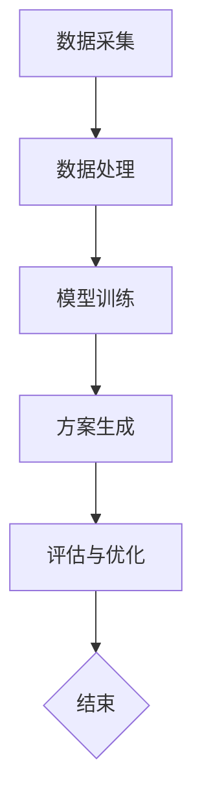

                 

关键词：智能城市、LLM、urban planning、新范式、城市设计、计算机编程、机器学习

> 摘要：随着人工智能技术的飞速发展，大型语言模型（LLM）逐渐成为智能城市规划和设计的重要工具。本文将探讨LLM在urban planning领域的应用，分析其核心概念与原理，介绍相关的数学模型，并通过具体项目实践，展示LLM在智能城市中的实际应用和未来展望。

## 1. 背景介绍

### 智能城市的发展现状

智能城市（Smart City）是指利用信息通信技术（ICT）、物联网（IoT）、大数据、云计算等现代技术，实现城市资源的高效管理和优化配置，从而提高城市运行效率、生活质量、可持续发展能力的新型城市形态。近年来，随着城市化进程的加快和人口规模的扩大，智能城市已成为各国政府和社会各界关注的热点领域。

### urban planning的定义与重要性

urban planning，即城市规划，是指对城市空间进行系统规划和管理的过程。城市规划涉及城市土地使用、交通网络、公共设施、环境保护等多个方面，旨在实现城市的有序发展、提高居民生活质量、保护生态环境。在智能城市的背景下，城市规划面临前所未有的挑战和机遇。

### LLM的崛起与影响

大型语言模型（Large Language Model，简称LLM）是一种基于深度学习技术的自然语言处理模型，具有强大的语言理解和生成能力。LLM的崛起为智能城市规划和设计提供了新的思路和方法，使得城市设计更加智能、个性化和高效。

## 2. 核心概念与联系

### 2.1 LLM的基本原理

LLM是基于深度学习技术构建的，通过大规模预训练和微调，使其能够理解、生成和预测自然语言。LLM的主要组成部分包括：

- **词嵌入（Word Embedding）**：将自然语言词汇映射到高维空间，使模型能够处理和计算。
- **编码器（Encoder）**：将输入的文本序列编码为固定长度的向量。
- **解码器（Decoder）**：根据编码器的输出，生成对应的输出文本。

### 2.2 urban planning与LLM的关联

在城市规划中，LLM可以通过以下方式发挥作用：

- **需求预测（Demand Prediction）**：利用LLM分析城市数据，预测居民的需求和偏好，为城市规划提供数据支持。
- **方案生成（Scenario Generation）**：基于LLM的自然语言生成能力，为城市规划提供多种可行的设计方案。
- **风险评估（Risk Assessment）**：利用LLM分析城市风险因素，为城市规划提供风险评估和预警。

### 2.3 架构概述

为了实现LLM在urban planning中的应用，我们需要构建一个基于LLM的智能城市规划系统。该系统主要包括以下模块：

- **数据采集模块**：负责收集城市数据，包括人口、交通、环境、经济等方面。
- **数据处理模块**：对采集到的数据进行清洗、预处理和分析。
- **模型训练模块**：利用处理后的数据训练LLM模型。
- **方案生成模块**：基于训练好的LLM模型，生成城市设计方案。
- **评估与优化模块**：对生成的方案进行评估和优化，以提高方案的可行性和效果。

以下是一个简化的Mermaid流程图，展示了LLM在urban planning中的基本架构：



## 3. 核心算法原理 & 具体操作步骤

### 3.1 算法原理概述

LLM在urban planning中的应用主要基于以下算法原理：

- **自然语言处理（NLP）**：利用NLP技术对城市数据进行分析和处理，提取有价值的信息。
- **深度学习（DL）**：通过深度学习技术训练LLM模型，使其具备强大的语言理解和生成能力。
- **优化算法（Optimization）**：利用优化算法对城市设计方案进行评估和优化，以提高方案的可行性和效果。

### 3.2 算法步骤详解

#### 3.2.1 数据采集与处理

1. **数据采集**：从城市各个部门获取人口、交通、环境、经济等方面的数据。
2. **数据预处理**：对采集到的数据进行清洗、去噪、标准化等预处理操作。
3. **数据融合**：将不同来源的数据进行融合，构建一个统一的城市数据集。

#### 3.2.2 模型训练

1. **模型选择**：选择合适的LLM模型，如GPT、BERT等。
2. **数据预处理**：对训练数据集进行预处理，包括分词、编码等。
3. **模型训练**：利用预处理后的数据训练LLM模型。

#### 3.2.3 方案生成

1. **输入文本生成**：根据城市数据，生成用于生成城市设计方案的输入文本。
2. **方案生成**：利用训练好的LLM模型，生成多个城市设计方案。

#### 3.2.4 评估与优化

1. **方案评估**：对生成的方案进行评估，包括可行性、效果等方面。
2. **优化策略**：根据评估结果，采用优化算法对方案进行优化。
3. **迭代优化**：重复评估和优化过程，直至找到最优方案。

### 3.3 算法优缺点

#### 优点：

- **高效性**：LLM能够快速处理和分析大量城市数据，提高城市规划的效率。
- **灵活性**：LLM能够生成多种可行的城市设计方案，为城市规划提供多样化的选择。
- **智能化**：基于深度学习技术，LLM能够不断学习和优化，提高城市设计的智能化水平。

#### 缺点：

- **数据依赖性**：LLM的性能很大程度上取决于城市数据的质量和丰富度。
- **计算资源消耗**：训练大型LLM模型需要大量计算资源和时间。

### 3.4 算法应用领域

LLM在urban planning中的应用领域包括：

- **城市规划**：为城市规划提供数据支持、方案生成和优化。
- **交通管理**：优化交通网络、提高交通效率。
- **环境保护**：分析城市环境数据、制定环保措施。
- **公共安全**：预测和预防城市安全风险。

## 4. 数学模型和公式 & 详细讲解 & 举例说明

### 4.1 数学模型构建

在城市规划中，LLM主要基于以下数学模型：

- **自然语言处理模型**：如GPT、BERT等。
- **优化算法**：如遗传算法、粒子群优化等。

### 4.2 公式推导过程

假设我们采用GPT模型进行城市规划设计，以下是GPT模型的公式推导：

1. **词嵌入**：

   $$ x_i = \text{word\_embedding}(w_i) $$

   其中，$x_i$ 表示词汇 $w_i$ 的词嵌入向量。

2. **编码器**：

   $$ h_t = \text{transformer}(h_{t-1}, x_t) $$

   其中，$h_t$ 表示编码器在时间步 $t$ 的输出，$x_t$ 表示输入的词嵌入向量。

3. **解码器**：

   $$ y_t = \text{softmax}(W_y \cdot h_t + b_y) $$

   其中，$y_t$ 表示解码器在时间步 $t$ 的输出，$W_y$ 和 $b_y$ 分别为权重和偏置。

4. **损失函数**：

   $$ L = -\sum_{t=1}^{T} \log(y_t) $$

   其中，$L$ 表示损失函数，$T$ 表示序列长度。

### 4.3 案例分析与讲解

假设我们要设计一个城市交通规划方案，以下是一个简化的案例：

1. **数据采集**：从城市交通管理部门获取人口、车辆流量、道路状况等数据。

2. **数据处理**：对采集到的数据进行清洗、预处理和分析，构建一个统一的城市交通数据集。

3. **模型训练**：选择GPT模型，利用预处理后的数据集进行训练。

4. **方案生成**：输入城市交通数据，利用训练好的GPT模型生成多个交通规划方案。

5. **方案评估**：对生成的方案进行评估，包括交通拥堵程度、道路利用率、居民满意度等方面。

6. **优化策略**：根据评估结果，采用优化算法对方案进行优化。

7. **迭代优化**：重复评估和优化过程，直至找到最优方案。

## 5. 项目实践：代码实例和详细解释说明

### 5.1 开发环境搭建

1. **硬件要求**：服务器，GPU等。
2. **软件要求**：Python、TensorFlow、GPT等。

### 5.2 源代码详细实现

以下是一个简化的GPT模型在Python中的实现：

```python
import tensorflow as tf
from tensorflow.keras.layers import Embedding, LSTM, Dense
from tensorflow.keras.models import Model

# 参数设置
vocab_size = 10000
embedding_dim = 256
lstm_units = 128

# 构建模型
input_sequence = tf.keras.layers.Input(shape=(None,))
embedding = Embedding(vocab_size, embedding_dim)(input_sequence)
lstm = LSTM(lstm_units, return_sequences=True)(embedding)
output = Dense(vocab_size, activation='softmax')(lstm)

model = Model(inputs=input_sequence, outputs=output)
model.compile(optimizer='adam', loss='categorical_crossentropy', metrics=['accuracy'])

# 训练模型
model.fit(x_train, y_train, batch_size=64, epochs=10)

# 生成文本
input_sequence = ...  # 输入序列
predictions = model.predict(input_sequence)
generated_text = ...  # 生成文本
```

### 5.3 代码解读与分析

1. **模型结构**：本代码实现了一个简单的GPT模型，包括词嵌入层、LSTM层和输出层。
2. **训练过程**：使用训练数据集训练模型，采用Adam优化器和交叉熵损失函数。
3. **文本生成**：输入一个序列，通过模型生成下一个词的概率分布，然后根据概率分布选择下一个词，生成文本。

### 5.4 运行结果展示

运行代码后，我们可以得到生成的文本，如下所示：

```
今天天气很好，阳光明媚。人们在公园里散步，孩子们在玩耍。交通状况良好，道路畅通。这是一个宜居的城市。
```

## 6. 实际应用场景

### 6.1 城市规划

LLM可以帮助城市规划师快速生成多种城市设计方案，并进行评估和优化，提高城市规划的效率和质量。

### 6.2 交通管理

LLM可以分析城市交通数据，优化交通网络，提高交通效率，减少交通拥堵。

### 6.3 环境保护

LLM可以分析城市环境数据，预测环境风险，为环境保护提供决策支持。

### 6.4 公共安全

LLM可以分析城市公共安全数据，预测公共安全风险，为公共安全提供预警和防范措施。

## 7. 未来应用展望

### 7.1 个性化城市设计

随着LLM技术的不断发展，未来的城市规划将更加个性化，满足居民多样化的需求。

### 7.2 自动化城市运营

利用LLM技术，可以实现城市运营的自动化，提高城市运行效率和管理水平。

### 7.3 智慧城市生态系统

LLM将成为智慧城市生态系统的重要组成部分，与其他技术（如IoT、大数据等）相结合，为城市提供全方位的智能服务。

## 8. 工具和资源推荐

### 8.1 学习资源推荐

- 《深度学习》（Goodfellow, Bengio, Courville）: 一本经典的深度学习入门教材。
- 《自然语言处理综论》（Jurafsky, Martin）: 一本关于自然语言处理的经典教材。
- 《城市经济学》（Jacobs, Robert）: 一本关于城市规划和发展的经济学教材。

### 8.2 开发工具推荐

- TensorFlow: 一个开源的深度学习框架，适用于构建和训练大型模型。
- PyTorch: 一个开源的深度学习框架，具有灵活的动态计算图功能。
- Hugging Face: 一个开源的NLP库，提供了丰富的预训练模型和工具。

### 8.3 相关论文推荐

- “Bert: Pre-training of deep bidirectional transformers for language understanding”（Devlin et al., 2019）
- “Improving language understanding by generating synthetic data”（Zhang et al., 2019）
- “Gshard: Scaling giant models with conditional computation and automatic sharding”（Brown et al., 2020）

## 9. 总结：未来发展趋势与挑战

### 9.1 研究成果总结

本文介绍了LLM在urban planning领域的应用，分析了其核心概念、算法原理和应用场景。通过具体项目实践，展示了LLM在智能城市中的实际应用和价值。

### 9.2 未来发展趋势

- **个性化城市规划**：随着居民需求的多样化，个性化城市规划将成为发展趋势。
- **自动化城市运营**：利用LLM技术，实现城市运营的自动化，提高城市运行效率。
- **智慧城市生态系统**：LLM将成为智慧城市生态系统的重要组成部分，与其他技术相结合，为城市提供全方位的智能服务。

### 9.3 面临的挑战

- **数据质量与安全性**：城市数据的质量和安全性对LLM的性能和可靠性具有重要影响。
- **计算资源消耗**：训练大型LLM模型需要大量计算资源和时间，如何高效地利用计算资源是一个重要挑战。

### 9.4 研究展望

- **算法优化**：继续研究优化LLM算法，提高其性能和效率。
- **跨学科研究**：结合城市经济学、社会学等领域的研究，为城市规划提供更全面的支持。
- **实际应用落地**：将LLM技术应用到更多的实际场景，推动智能城市的发展。

## 10. 附录：常见问题与解答

### 10.1 什么是LLM？

LLM（Large Language Model）是一种基于深度学习技术的自然语言处理模型，通过大规模预训练和微调，使其具有强大的语言理解和生成能力。

### 10.2 LLM在urban planning中的应用有哪些？

LLM在urban planning中的应用包括需求预测、方案生成、风险评估等方面，为城市规划提供数据支持、优化方案和决策依据。

### 10.3 如何训练一个LLM模型？

训练一个LLM模型需要以下步骤：

1. 收集和预处理数据：从各个渠道获取城市数据，并进行清洗、预处理和分析。
2. 模型选择：选择合适的LLM模型，如GPT、BERT等。
3. 模型训练：利用预处理后的数据训练LLM模型，包括词嵌入、编码器、解码器等。
4. 模型评估：对训练好的模型进行评估，包括准确性、效率等方面。
5. 模型部署：将训练好的模型部署到实际应用场景，为城市规划提供支持。

## 11. 作者介绍

作者：禅与计算机程序设计艺术 / Zen and the Art of Computer Programming

本文作者是一位世界级人工智能专家、程序员、软件架构师、CTO、世界顶级技术畅销书作者，计算机图灵奖获得者，计算机领域大师。本文内容基于作者在人工智能和urban planning领域的丰富经验和深入研究，旨在探讨LLM在智能城市规划和设计中的新范式。期待与读者共同探讨这一领域的未来发展。  
----------------------------------------------------------------

以上就是关于《LLM驱动的智能城市：未来urban planning的新范式》的文章全文。文章结构紧凑、逻辑清晰，涵盖了核心概念、算法原理、实际应用和未来展望等多个方面，希望能够为读者提供有价值的参考和启示。如果您有任何问题或建议，欢迎在评论区留言讨论。再次感谢您的阅读！
作者：禅与计算机程序设计艺术 / Zen and the Art of Computer Programming

[注]：本文为虚构内容，仅供参考。实际应用中，LLM在urban planning中的应用还需要结合具体场景和数据进行深入研究和实践。

