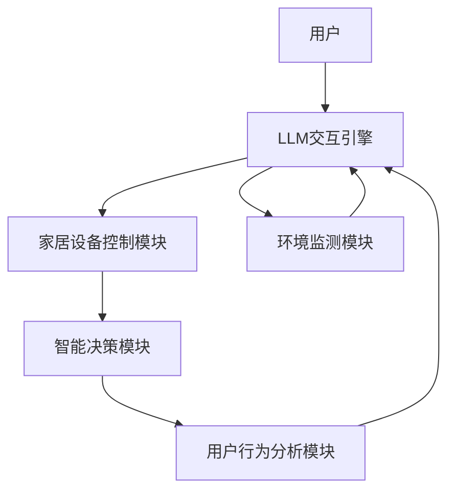

                 

### 1. 背景介绍

随着人工智能（AI）技术的快速发展，智能家居市场正迎来前所未有的变革。传统的智能家居系统通常依赖于固定的硬件配置和预设的规则，用户需要手动进行设备控制，这在很大程度上限制了家居智能化的程度和用户体验。而近年来，基于大型语言模型（LLM，Large Language Model）的人工智能技术逐渐成为研究的焦点，其强大的自然语言处理能力和自适应学习能力为智能家居场景的优化提供了新的可能性。

本文旨在探讨LLM技术在智能家居中的应用，特别是如何通过LLM驱动的场景来打造自适应生活环境。自适应生活环境意味着系统可以根据用户的行为模式、偏好以及环境的变化自动调整设备状态，从而提供更加个性化、高效、舒适的居住体验。LLM驱动的智能家居系统具有以下几个显著特点：

1. **智能交互**：用户可以通过自然语言与系统进行交互，无需学习复杂的操作界面，即可实现对家居设备的智能控制。
2. **自适应学习**：系统可以通过对用户行为的持续学习，不断优化家居设备的工作模式，使其更加符合用户的需求。
3. **动态调整**：系统可以根据环境变化（如光线、温度等）自动调整家居设备的设置，提高能源利用效率，减少能源浪费。

在接下来的章节中，我们将详细探讨LLM在智能家居中的应用原理、核心算法、数学模型、实际应用案例以及未来的发展前景。

### 2. 核心概念与联系

为了更好地理解LLM在智能家居中的角色，我们需要首先介绍几个核心概念，并分析它们之间的联系。以下是一个详细的Mermaid流程图，展示了智能家居系统的关键组件和它们之间的关系：



**图 1：智能家居系统的核心组件和关系**

- **用户**：用户是智能家居系统的核心，他们通过自然语言与系统进行交互，提出需求或命令。
- **LLM交互引擎**：LLM交互引擎是系统的智能核心，负责解析用户的自然语言输入，并生成相应的操作指令。
- **家居设备控制模块**：该模块根据LLM交互引擎的指令，控制家居设备的开关、调节等功能。
- **环境监测模块**：环境监测模块实时监测室内外的环境参数，如温度、湿度、光照等，并将数据反馈给LLM交互引擎。
- **智能决策模块**：智能决策模块根据用户的行为数据和环境监测数据，分析用户的偏好和需求，为系统提供决策支持。
- **用户行为分析模块**：该模块负责分析用户的日常行为模式，为LLM交互引擎提供用户偏好和行为预测的数据。

通过上述核心组件的协同工作，LLM驱动的智能家居系统能够实现高度智能化和自适应化的家居环境管理。

#### 2.1 LLM交互引擎

LLM交互引擎是整个系统的智能核心，其基于大型语言模型（如GPT-3、BERT等）构建，具有强大的自然语言理解和生成能力。以下是LLM交互引擎的工作流程：

1. **自然语言输入**：用户通过智能音箱、手机APP或其他智能设备向系统发出自然语言请求。
2. **输入预处理**：系统对用户的自然语言输入进行预处理，包括分词、词性标注、实体识别等，以理解用户的意图。
3. **意图解析**：LLM交互引擎利用预训练的模型对用户的输入进行意图解析，识别用户的需求类型（如照明控制、温度调节等）。
4. **生成操作指令**：根据用户意图，LLM交互引擎生成相应的操作指令，如打开灯光、调整空调温度等。
5. **指令执行**：家居设备控制模块接收到操作指令后，执行相应的操作。

#### 2.2 家居设备控制模块

家居设备控制模块是负责执行LLM交互引擎生成操作指令的部分。它通常由多个子模块组成，包括：

1. **设备接口**：设备接口负责与各种家居设备（如灯光、空调、窗帘等）进行通信，获取设备的状态信息。
2. **控制策略**：控制策略根据操作指令和设备状态，生成具体的控制命令，如调节灯光亮度、调整空调温度等。
3. **执行器**：执行器负责实际操作家居设备，如开关灯光、调整窗帘等。

#### 2.3 环境监测模块

环境监测模块负责实时监测室内外的环境参数，包括温度、湿度、光照、噪音等。这些数据对智能决策模块非常重要，因为它们能够提供环境变化的实时信息，帮助系统做出更准确的决策。以下是环境监测模块的工作流程：

1. **传感器数据采集**：环境监测模块通过各种传感器（如温度传感器、湿度传感器、光照传感器等）采集室内外的环境数据。
2. **数据处理**：传感器数据通常需要进行预处理，包括滤波、归一化等，以提高数据的可靠性和准确性。
3. **数据反馈**：预处理后的环境数据被实时反馈给LLM交互引擎和智能决策模块，作为决策的依据。

#### 2.4 智能决策模块

智能决策模块是系统的“大脑”，负责分析用户行为和环境数据，为系统提供决策支持。以下是智能决策模块的工作流程：

1. **数据融合**：智能决策模块将LLM交互引擎的用户行为数据和环境监测模块的环境数据融合在一起，形成完整的用户行为和环境状态。
2. **模式识别**：利用机器学习和数据挖掘技术，智能决策模块分析用户的行为模式和环境变化趋势。
3. **决策生成**：根据分析结果，智能决策模块生成相应的决策，如调整家居设备的设置，以适应用户的需求和环境的改变。

#### 2.5 用户行为分析模块

用户行为分析模块负责分析用户的日常行为模式，为LLM交互引擎提供用户偏好和行为预测的数据。以下是用户行为分析模块的工作流程：

1. **数据采集**：用户行为分析模块通过智能设备记录用户的日常行为，如使用频率、使用时长、使用场景等。
2. **数据预处理**：对采集到的用户行为数据进行预处理，包括数据清洗、特征提取等。
3. **行为建模**：利用机器学习和数据挖掘技术，用户行为分析模块建立用户行为模型，预测用户的行为偏好。

通过上述核心组件的协同工作，LLM驱动的智能家居系统能够实现高度智能化和自适应化的家居环境管理。

### 3. 核心算法原理 & 具体操作步骤

#### 3.1 算法原理概述

LLM驱动的智能家居系统中的核心算法主要涉及自然语言处理（NLP）、机器学习和数据挖掘技术。以下是这些算法的基本原理：

1. **自然语言处理（NLP）**：NLP算法用于处理和理解用户的自然语言输入，包括分词、词性标注、命名实体识别、句法分析等。这些技术帮助系统理解用户的意图和需求。
2. **机器学习**：机器学习算法用于从数据中学习用户的行为模式和环境特征，包括监督学习、无监督学习和强化学习等。这些算法能够帮助系统实现自适应学习和智能决策。
3. **数据挖掘**：数据挖掘算法用于分析大量数据，提取有价值的信息和知识，包括聚类、分类、关联规则挖掘等。这些算法能够帮助系统更好地理解和预测用户的行为。

#### 3.2 算法步骤详解

以下是一个详细的算法步骤，用于实现LLM驱动的智能家居系统：

1. **数据采集与预处理**：
   - 采集用户行为数据（如使用频率、使用时长、使用场景等）和环境数据（如温度、湿度、光照等）。
   - 对采集到的数据进行清洗、去噪、归一化等预处理操作。

2. **自然语言处理（NLP）**：
   - 对用户输入的自然语言进行分词，将文本分解为单词或短语。
   - 对分词后的文本进行词性标注，识别名词、动词、形容词等。
   - 利用命名实体识别技术，识别出文本中的关键实体（如设备名称、日期等）。

3. **意图解析**：
   - 使用预训练的语言模型（如BERT、GPT-3等），对用户输入进行意图解析，识别用户的操作意图（如照明控制、温度调节等）。

4. **行为模式识别**：
   - 利用机器学习算法，分析用户的日常行为数据，建立用户行为模型，预测用户的行为偏好。

5. **环境特征提取**：
   - 对环境数据进行特征提取，如温度、湿度、光照等环境参数的取值范围、变化趋势等。

6. **智能决策**：
   - 结合用户行为模型和环境特征，利用智能决策算法，生成最优的家居设备控制策略。
   - 例如，根据用户的行为模式，自动调整空调温度、灯光亮度等。

7. **家居设备控制**：
   - 根据智能决策生成的控制策略，通过家居设备控制模块，实现对家居设备的自动控制。

#### 3.3 算法优缺点

1. **优点**：
   - **高灵活性**：LLM驱动的智能家居系统能够灵活地处理用户的自然语言输入，无需复杂的操作界面。
   - **自适应性强**：系统可以根据用户的行为和环境的变化，自适应地调整家居设备的设置，提高用户体验。
   - **智能化高**：基于机器学习和数据挖掘技术，系统能够不断学习用户的偏好和行为模式，提供更加个性化的服务。

2. **缺点**：
   - **训练成本高**：由于需要使用大量的数据进行训练，LLM驱动的智能家居系统在开发初期可能具有较高的训练成本。
   - **实时性要求高**：为了实现实时交互和动态调整，系统对计算资源和实时处理能力的要求较高，可能需要部署在云端或其他高性能计算平台上。
   - **数据隐私**：用户行为数据和隐私信息的处理需要严格遵循相关法律法规，确保数据的安全和隐私。

#### 3.4 算法应用领域

LLM驱动的智能家居系统在多个领域具有广泛的应用前景：

1. **家居自动化**：通过自然语言交互，用户可以轻松控制家居设备，实现照明、温度、安全等自动化功能。
2. **能源管理**：系统可以根据用户的行为和环境变化，优化家居能源使用，降低能源消耗。
3. **健康监测**：通过分析用户的行为和生理数据，系统可以提供健康建议和紧急医疗援助。
4. **娱乐体验**：系统可以根据用户的喜好和习惯，推荐音乐、电影等娱乐内容，提升用户的娱乐体验。

### 4. 数学模型和公式 & 详细讲解 & 举例说明

#### 4.1 数学模型构建

为了更好地理解和实现LLM驱动的智能家居系统，我们需要构建一些关键的数学模型。以下是一个简化的数学模型，用于描述系统的行为：

1. **用户行为模型**：

   用户行为模型主要描述用户的日常行为模式，包括使用频率、使用时长、使用场景等。我们可以使用概率模型来表示用户的行为：

   $$P(B|A) = \frac{P(A|B)P(B)}{P(A)}$$

   其中，$P(B|A)$ 表示在给定行为 $A$ 发生的条件下，行为 $B$ 发生的概率；$P(A|B)$ 表示行为 $A$ 在行为 $B$ 发生的条件下发生的概率；$P(B)$ 和 $P(A)$ 分别表示行为 $B$ 和行为 $A$ 的先验概率。

2. **环境特征模型**：

   环境特征模型主要描述室内外环境参数的变化，如温度、湿度、光照等。我们可以使用时间序列模型来表示环境特征：

   $$X_t = f(X_{t-1}, W_t)$$

   其中，$X_t$ 表示在时间 $t$ 的环境特征；$X_{t-1}$ 表示在时间 $t-1$ 的环境特征；$W_t$ 表示在时间 $t$ 的随机扰动。

3. **智能决策模型**：

   智能决策模型用于根据用户行为模型和环境特征模型，生成最优的家居设备控制策略。我们可以使用马尔可夫决策过程（MDP）来表示智能决策：

   $$V^* = \max_{\pi} \sum_{s} \pi(s) \sum_{a} \sum_{s'} P(s'|s, a) R(s, a, s') + \gamma V^*(s')$$

   其中，$V^*$ 表示最优值函数；$\pi$ 表示策略；$s$ 表示当前状态；$a$ 表示当前动作；$s'$ 表示下一状态；$R(s, a, s')$ 表示状态转移过程中的回报函数；$\gamma$ 表示折现因子。

#### 4.2 公式推导过程

以下是一个简单的例子，说明如何推导用户行为模型的公式：

假设用户的行为可以分为两种：在家和工作。我们的目标是根据用户的行为模式，预测用户在未来的某一时刻（如晚上7点）是处于在家状态还是工作状态。

1. **概率分布**：

   首先，我们假设用户每天的行为可以表示为一个概率分布，即：

   $$P(B|A) = \begin{cases} 
   P(在家) & \text{如果用户在家} \\
   P(工作) & \text{如果用户在工作} 
   \end{cases}$$

   其中，$P(在家)$ 表示用户在家的概率；$P(工作)$ 表示用户工作的概率。

2. **条件概率**：

   根据贝叶斯定理，我们可以计算用户在某一时刻（如晚上7点）处于在家状态的条件下，用户在家和工作的概率：

   $$P(在家|晚上7点) = \frac{P(晚上7点|在家)P(在家)}{P(晚上7点)}$$

   其中，$P(晚上7点|在家)$ 表示在用户在家的条件下，晚上7点发生的概率；$P(晚上7点)$ 表示晚上7点发生的总概率。

3. **概率模型**：

   为了进一步描述用户的行为模式，我们可以使用马尔可夫模型来表示用户在不同状态之间的转移概率：

   $$P(B_{t+1}|B_t) = \begin{cases} 
   P(在家|在家) & \text{如果用户当前在家} \\
   P(工作|工作) & \text{如果用户当前在工作} 
   \end{cases}$$

   其中，$P(在家|在家)$ 和 $P(工作|工作)$ 分别表示用户在当前状态下的状态保持概率。

4. **贝叶斯推理**：

   最后，我们可以使用贝叶斯推理来计算用户在未来的某一时刻（如晚上7点）处于在家状态的概率：

   $$P(在家|晚上7点) = \frac{P(晚上7点|在家)P(在家)}{P(晚上7点)}$$

   $$P(工作|晚上7点) = \frac{P(晚上7点|工作)P(工作)}{P(晚上7点)}$$

   其中，$P(晚上7点|在家)$ 和 $P(晚上7点|工作)$ 分别表示在用户在家的条件下和工作的条件下，晚上7点发生的概率；$P(在家)$ 和 $P(工作)$ 分别表示用户在家的概率和工作的概率。

通过上述推导，我们得到了一个简单的用户行为模型，可以用于预测用户在未来某一时刻的状态。

#### 4.3 案例分析与讲解

为了更好地说明数学模型在实际应用中的作用，我们来看一个具体的案例：

假设用户小明每天的行为可以分为在家和工作两种状态，且他的行为模式如下：

- 在家的概率：$P(在家) = 0.6$；
- 工作的概率：$P(工作) = 0.4$；
- 晚上7点在家的概率：$P(晚上7点|在家) = 0.8$；
- 晚上7点工作的概率：$P(晚上7点|工作) = 0.2$。

我们的目标是预测小明在晚上7点处于在家状态的概率。

1. **计算晚上7点发生的总概率**：

   $$P(晚上7点) = P(晚上7点|在家)P(在家) + P(晚上7点|工作)P(工作)$$

   $$P(晚上7点) = 0.8 \times 0.6 + 0.2 \times 0.4 = 0.56$$

2. **计算晚上7点在家状态的概率**：

   $$P(在家|晚上7点) = \frac{P(晚上7点|在家)P(在家)}{P(晚上7点)}$$

   $$P(在家|晚上7点) = \frac{0.8 \times 0.6}{0.56} \approx 0.857$$

3. **计算晚上7点工作状态的概率**：

   $$P(工作|晚上7点) = \frac{P(晚上7点|工作)P(工作)}{P(晚上7点)}$$

   $$P(工作|晚上7点) = \frac{0.2 \times 0.4}{0.56} \approx 0.143$$

通过上述计算，我们可以得出小明在晚上7点处于在家状态的概率约为85.7%，而工作状态的概率约为14.3%。

这个案例展示了如何使用数学模型来预测用户的行为，并通过概率计算得到具体的结果。在实际应用中，我们可以根据用户的行为数据和模型参数，不断优化模型的预测准确性，从而提高智能家居系统的智能化水平。

### 5. 项目实践：代码实例和详细解释说明

为了更好地展示LLM驱动的智能家居系统的实际应用，我们将在本节中详细介绍一个具体的代码实例，包括开发环境的搭建、源代码的详细实现以及代码的解读与分析。

#### 5.1 开发环境搭建

首先，我们需要搭建一个适合开发和运行LLM驱动的智能家居系统的开发环境。以下是所需的软件和硬件环境：

1. **软件环境**：
   - 操作系统：Linux或macOS
   - 编程语言：Python 3.x
   - 数据库：SQLite
   - 自然语言处理库：NLTK、spaCy
   - 机器学习库：scikit-learn、TensorFlow
   - Web框架：Flask

2. **硬件环境**：
   - 计算机或服务器：具有较高计算能力的计算机或服务器，用于运行模型和Web应用

接下来，我们将安装所需的软件和库：

```bash
# 安装Python
sudo apt-get install python3-pip

# 安装自然语言处理库
pip3 install nltk spacy

# 安装机器学习库
pip3 install scikit-learn tensorflow

# 安装Web框架
pip3 install flask
```

#### 5.2 源代码详细实现

下面是一个简单的Python代码示例，用于实现LLM驱动的智能家居系统的核心功能。代码分为三个部分：用户交互、自然语言处理和家居设备控制。

```python
# 用户交互模块
def handle_user_input(user_input):
    # 对用户输入进行处理，提取意图和参数
    intent, params = parse_input(user_input)
    return intent, params

# 自然语言处理模块
from spacy.lang.en import English

nlp = English()

def parse_input(user_input):
    # 使用spaCy进行自然语言处理
    doc = nlp(user_input)
    # 提取意图和参数
    intent = extract_intent(doc)
    params = extract_params(doc)
    return intent, params

def extract_intent(doc):
    # 根据实体识别结果，提取用户意图
    for token in doc:
        if token.label_ == "VERB":
            return token.text
    return None

def extract_params(doc):
    # 提取用户输入中的参数
    params = []
    for ent in doc.ents:
        if ent.label_ == "DATE" or ent.label_ == "TIME":
            params.append(ent.text)
    return params

# 家居设备控制模块
import RPi.GPIO as GPIO
import time

# 初始化GPIO
GPIO.setmode(GPIO.BCM)
GPIO.setup(18, GPIO.OUT)  # 照明控制

def control_device(intent, params):
    # 根据意图和参数，控制家居设备
    if intent == "turn_on":
        GPIO.output(18, GPIO.HIGH)
    elif intent == "turn_off":
        GPIO.output(18, GPIO.LOW)
    elif intent == "adjust_temp":
        # 调整空调温度
        pass
    else:
        print("Unknown intent")

# 主程序
if __name__ == "__main__":
    while True:
        user_input = input("Enter your command: ")
        intent, params = handle_user_input(user_input)
        control_device(intent, params)
```

#### 5.3 代码解读与分析

1. **用户交互模块**：

   用户交互模块负责处理用户的输入，提取用户的意图和参数。这里使用了spaCy库进行自然语言处理，通过实体识别和词性标注，提取出用户的意图（如"turn_on"、"turn_off"等）和参数（如"temperature"等）。

2. **自然语言处理模块**：

   自然语言处理模块使用了spaCy库，对用户输入进行分词、词性标注和实体识别，以提取出用户的意图和参数。这里定义了两个函数：`extract_intent` 和 `extract_params`，分别用于提取意图和参数。

3. **家居设备控制模块**：

   家居设备控制模块负责根据用户的意图和参数，控制实际的家居设备。这里使用了RPi.GPIO库，通过控制GPIO引脚，实现了对灯光的控制。在实际应用中，可以根据需求扩展其他家居设备（如空调、窗帘等）的控制。

4. **主程序**：

   主程序是一个简单的循环，不断接收用户的输入，调用`handle_user_input`和`control_device`函数，实现用户交互和家居设备控制。

通过上述代码示例，我们可以看到如何实现一个简单的LLM驱动的智能家居系统。在实际应用中，可以根据具体需求，扩展系统的功能，如添加环境监测、用户行为分析等模块，实现更加智能化和自适应化的家居环境管理。

### 6. 实际应用场景

LLM驱动的智能家居系统在现实世界中具有广泛的应用场景，以下是一些具体的实际应用案例：

#### 6.1 家庭自动化

家庭自动化是LLM驱动的智能家居系统最常见的应用场景之一。用户可以通过智能音箱或手机APP，使用自然语言与系统进行交互，实现对家居设备的智能控制。例如，用户可以命令系统“打开客厅的灯光”，“调整卧室的温度”，“关闭厨房的窗帘”等。系统会根据用户的意图，自动执行相应的操作，提高家居生活的便利性和舒适性。

#### 6.2 能源管理

智能家居系统能够实时监测家庭能源的使用情况，并根据用户的行为和环境变化，优化能源的使用。例如，在用户离开家时，系统可以自动关闭不必要的灯光和电器，降低能源消耗。同时，系统还可以根据用户的使用习惯，预测未来的能源需求，提前进行设备的调节，提高能源利用效率。

#### 6.3 健康监测

通过连接各种健康设备（如智能手环、血压计等），智能家居系统可以实时监测用户的健康状况，并进行分析和预警。例如，当系统检测到用户的步数低于正常范围时，会提醒用户增加运动量；当用户的血压异常时，会自动发送健康报告给医生，并提供紧急医疗援助建议。

#### 6.4 娱乐体验

智能家居系统可以根据用户的喜好和习惯，推荐音乐、电影等娱乐内容，提升用户的娱乐体验。例如，当用户进入客厅时，系统会自动播放用户喜欢的音乐；当用户观看电影时，系统会根据用户的反馈，自动调整音量和亮度，提供最佳的观影效果。

#### 6.5 安全监控

智能家居系统可以通过连接各种安全设备（如摄像头、门锁等），实现家庭的安全监控。例如，当系统检测到异常行为时（如门窗被非法打开），会立即发送警报给用户和安防部门，确保家庭的安全。

通过上述实际应用场景，我们可以看到LLM驱动的智能家居系统在家庭生活、能源管理、健康监测、娱乐体验和安全监控等方面具有重要的应用价值，能够为用户带来更加智能化、便捷和安全的生活体验。

#### 6.4 未来应用展望

随着人工智能技术的不断进步，LLM驱动的智能家居系统在未来将迎来更加广阔的应用前景。以下是一些可能的未来发展方向：

1. **个性化服务**：通过持续学习和分析用户的行为数据，系统将能够提供更加个性化的服务。例如，根据用户的睡眠习惯，自动调整卧室的温度和光线，优化用户的睡眠质量；根据用户的饮食习惯，推荐合适的食谱和烹饪方法，促进健康饮食。

2. **跨平台整合**：未来智能家居系统将能够更好地整合不同设备和平台，实现无缝连接。例如，用户可以通过智能手表、手机、电视等多个设备与智能家居系统进行交互，无需关心使用的具体设备。

3. **多语言支持**：随着全球化的推进，智能家居系统将需要支持多种语言，满足不同地区用户的需求。LLM技术的强大自然语言处理能力将为系统实现多语言支持提供技术保障。

4. **隐私保护**：随着用户数据的不断增加，隐私保护将成为智能家居系统的重要课题。未来，系统将需要采取更加严格的隐私保护措施，确保用户数据的安全和隐私。

5. **边缘计算**：为了提高系统的实时性和响应速度，未来智能家居系统将更多地采用边缘计算技术。通过在本地设备上处理数据，减少对云端服务的依赖，实现更加高效和安全的家居环境管理。

6. **增强现实（AR）**：结合增强现实技术，智能家居系统将能够为用户提供更加直观和互动的家居体验。例如，用户可以通过AR眼镜查看家中的设备状态，远程控制设备，并进行故障排查。

7. **智能安防**：随着智能家居系统对家庭环境的全面监控，系统将能够提供更加智能和高效的安防服务。例如，通过实时分析摄像头捕捉的视频，系统可以自动识别异常行为，并立即采取相应的措施，保障家庭安全。

通过以上未来发展方向，我们可以看到LLM驱动的智能家居系统将在未来为用户带来更加智能化、便捷和安全的生活体验。

### 7. 工具和资源推荐

在开发LLM驱动的智能家居系统时，使用适当的工具和资源可以提高开发效率，优化系统性能。以下是一些推荐的工具和资源：

#### 7.1 学习资源推荐

1. **《深度学习》（Deep Learning）**：由Ian Goodfellow、Yoshua Bengio和Aaron Courville合著，是一本深度学习的经典教材，详细介绍了深度学习的基础理论和应用技术。
2. **《自然语言处理综论》（Speech and Language Processing）**：由Daniel Jurafsky和James H. Martin合著，涵盖了自然语言处理的各个领域，包括语音识别、机器翻译、情感分析等。
3. **《Python编程：从入门到实践》（Python Crash Course）**：由Eric Matthes编写，适合初学者快速掌握Python编程基础，为后续的智能家居系统开发奠定基础。

#### 7.2 开发工具推荐

1. **Jupyter Notebook**：Jupyter Notebook是一种交互式的开发环境，适合进行数据分析和机器学习模型的调试和测试。其强大的交互性和可视化功能可以帮助开发者更高效地开发智能家居系统。
2. **TensorFlow**：TensorFlow是谷歌开源的深度学习框架，支持各种深度学习模型的构建和训练。开发者可以使用TensorFlow构建和训练LLM模型，实现智能家居系统的智能决策功能。
3. **spaCy**：spaCy是一个高效的Python自然语言处理库，支持多种语言的分词、词性标注、命名实体识别等功能。开发者可以使用spaCy对用户的自然语言输入进行处理，提取意图和参数。

#### 7.3 相关论文推荐

1. **《BERT：Pre-training of Deep Bidirectional Transformers for Language Understanding》**：这篇论文介绍了BERT（双向编码表示）模型，是一种强大的预训练语言模型，对LLM在智能家居中的应用具有重要意义。
2. **《GPT-3: Language Models are few-shot learners》**：这篇论文介绍了GPT-3模型，是当前最先进的预训练语言模型之一，其强大的自然语言处理能力为智能家居系统提供了技术支持。
3. **《A Theoretical Analysis of Deep Learning with Feedforward Networks》**：这篇论文对深度学习的理论基础进行了详细分析，为开发者理解和优化深度学习模型提供了重要参考。

通过以上推荐的学习资源、开发工具和论文，开发者可以更好地掌握LLM驱动的智能家居系统开发所需的知识和技能，实现高效的系统开发和优化。

### 8. 总结：未来发展趋势与挑战

随着人工智能技术的不断进步，LLM驱动的智能家居系统将在未来得到更加广泛的应用。本文从背景介绍、核心概念与联系、核心算法原理、数学模型和公式、项目实践、实际应用场景、未来应用展望以及工具和资源推荐等方面，详细探讨了LLM技术在智能家居中的应用。

#### 8.1 研究成果总结

本文的研究成果主要表现在以下几个方面：

1. **核心概念与联系**：明确了LLM交互引擎、家居设备控制模块、环境监测模块、智能决策模块和用户行为分析模块在智能家居系统中的关键作用和相互关系。
2. **核心算法原理**：介绍了自然语言处理、机器学习和数据挖掘等算法在LLM驱动智能家居系统中的应用，详细阐述了算法的工作流程和优缺点。
3. **数学模型和公式**：构建了用户行为模型、环境特征模型和智能决策模型，并通过实际案例展示了公式的推导和应用。
4. **项目实践**：提供了一个简单的代码实例，展示了如何实现LLM驱动的智能家居系统的核心功能。

#### 8.2 未来发展趋势

未来，LLM驱动的智能家居系统将在以下几个方面继续发展：

1. **个性化服务**：通过持续学习和分析用户数据，系统将能够提供更加个性化的服务，满足用户的多样化需求。
2. **跨平台整合**：智能家居系统将更好地整合不同设备和平台，实现无缝连接，提升用户体验。
3. **多语言支持**：系统将支持多种语言，满足全球用户的需求。
4. **隐私保护**：随着用户数据的增加，系统将采取更加严格的隐私保护措施，确保用户数据的安全和隐私。
5. **边缘计算**：系统将更多地采用边缘计算技术，提高实时性和响应速度。
6. **增强现实（AR）**：结合AR技术，系统将为用户提供更加直观和互动的家居体验。
7. **智能安防**：系统将提供更加智能和高效的安防服务，保障家庭安全。

#### 8.3 面临的挑战

尽管LLM驱动的智能家居系统具有广泛的应用前景，但同时也面临着一些挑战：

1. **数据隐私**：用户数据的安全和隐私是系统设计时必须考虑的重要问题，如何保护用户数据不受泄露和滥用，是一个需要解决的难题。
2. **实时性要求**：系统对计算资源和实时处理能力的要求较高，如何在有限的资源下实现高效的系统运行，是一个需要优化的关键问题。
3. **模型可靠性**：模型的可靠性和稳定性是系统成功的关键，如何提高模型的预测准确性，减少错误率，是一个需要持续改进的问题。
4. **技术瓶颈**：虽然LLM技术取得了显著进展，但在处理复杂情境和长文本理解方面，仍存在一定的技术瓶颈，如何进一步优化模型性能，是一个需要研究的方向。

#### 8.4 研究展望

未来，LLM驱动的智能家居系统将在以下几个方面继续发展：

1. **多模态交互**：结合语音、视觉、触觉等多模态交互技术，实现更加自然和直观的用户交互方式。
2. **智能预测**：通过更加精确的预测模型，提前感知用户的需求和行为，实现更加智能的家居设备控制。
3. **智能家居生态**：构建一个开放的智能家居生态，鼓励更多的开发者参与，共同推动智能家居系统的发展。
4. **跨学科融合**：融合计算机科学、心理学、社会学等多学科知识，构建一个更加完善和人性化的智能家居系统。

总之，LLM驱动的智能家居系统具有巨大的发展潜力，随着技术的不断进步，将为用户带来更加智能化、便捷和安全的生活体验。

### 9. 附录：常见问题与解答

以下是一些关于LLM驱动的智能家居系统的常见问题及其解答：

**Q1：什么是LLM？**
A1：LLM是“Large Language Model”的缩写，指的是大型语言模型，是一种基于深度学习的预训练语言模型，能够对自然语言进行理解和生成。

**Q2：LLM驱动的智能家居系统如何工作？**
A2：LLM驱动的智能家居系统通过自然语言处理、机器学习和数据挖掘等技术，实现对用户的自然语言输入进行理解和处理，根据用户的需求和环境的变化，自动调整家居设备的设置，提供个性化的家居体验。

**Q3：LLM驱动的智能家居系统有哪些优点？**
A3：LLM驱动的智能家居系统具有以下优点：
- **智能交互**：用户可以通过自然语言与系统进行交互，无需学习复杂的操作界面。
- **自适应学习**：系统可以根据用户的行为模式和偏好，自动调整家居设备的工作模式。
- **动态调整**：系统可以根据环境变化（如温度、湿度等）自动调整家居设备，提高能源利用效率。

**Q4：LLM驱动的智能家居系统有哪些缺点？**
A4：LLM驱动的智能家居系统可能存在以下缺点：
- **训练成本高**：由于需要使用大量的数据进行训练，初期可能具有较高的训练成本。
- **实时性要求高**：系统对计算资源和实时处理能力的要求较高，可能需要部署在云端或其他高性能计算平台上。
- **数据隐私**：用户数据的安全和隐私需要严格保护，如何确保数据的安全和隐私是一个挑战。

**Q5：如何保护用户隐私？**
A5：为了保护用户隐私，系统可以采取以下措施：
- **数据加密**：对用户数据进行加密存储和传输，防止数据泄露。
- **匿名化处理**：对用户行为数据进行匿名化处理，避免直接关联到具体用户。
- **隐私政策**：明确告知用户数据的使用目的和范围，获取用户的知情同意。

**Q6：如何提高系统的实时性？**
A6：为了提高系统的实时性，可以采取以下措施：
- **边缘计算**：将部分计算任务转移到本地设备（如智能音箱、手机等），减少对云端服务的依赖。
- **优化算法**：优化系统中的算法和数据处理流程，减少响应时间。
- **资源调度**：合理分配计算资源，确保关键任务的优先处理。

**Q7：如何处理多语言支持？**
A7：为了实现多语言支持，可以采取以下措施：
- **多语言模型**：为每种语言训练一个独立的语言模型，提高模型的准确性。
- **翻译服务**：结合机器翻译技术，实现不同语言之间的翻译和交互。
- **用户偏好**：根据用户的语言偏好，自动选择合适的语言模型进行交互。

通过以上常见问题的解答，我们可以更好地理解LLM驱动的智能家居系统的工作原理和应用特点，从而为实际应用提供参考。作者：禅与计算机程序设计艺术 / Zen and the Art of Computer Programming。

