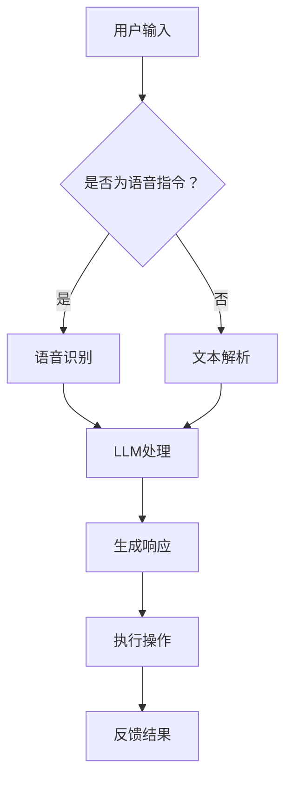

                 

关键词：大语言模型（LLM）、智能家居、自适应环境、机器学习、人工智能、环境感知、智能交互。

> 摘要：本文探讨了如何利用大语言模型（LLM）技术驱动智能家居系统，实现自适应生活环境。通过深入分析LLM的原理、应用及其实际操作步骤，本文展示了如何构建一个智能高效的家居系统，为用户创造一个舒适、便捷的生活环境。

## 1. 背景介绍

随着人工智能技术的飞速发展，智能家居逐渐成为现代生活的标配。智能家居系统通过物联网（IoT）技术连接各种家电和设备，使得家庭生活更加便捷、舒适。然而，现有的智能家居系统在用户体验和智能化程度方面仍有很大的提升空间。

近年来，大语言模型（LLM）的兴起为智能家居系统带来了新的契机。LLM具有强大的语言理解和生成能力，可以实现对用户指令的准确理解，并根据环境变化自适应地调整家居设备的状态。本文将深入探讨LLM在智能家居中的应用，如何通过自适应环境感知和智能交互技术，打造一个真正智能化的生活环境。

## 2. 核心概念与联系

### 2.1 大语言模型（LLM）

大语言模型（LLM）是基于深度学习技术构建的强大语言处理工具，能够理解和生成自然语言。LLM通过大量的文本数据进行训练，从而学习到语言的规律和模式。在智能家居场景中，LLM可以用于处理用户输入的语音指令、文本消息，并生成相应的响应。

### 2.2 智能家居系统

智能家居系统是由各种家电、传感器、控制器和通信模块组成的网络系统。通过物联网技术，这些设备可以互联互通，实现家庭自动化和智能化。智能家居系统的主要功能包括环境监测、设备控制、安防监控、能源管理等。

### 2.3 自适应环境

自适应环境是指智能家居系统能够根据用户的习惯、环境变化和实时信息，自动调整设备的状态，以提供最佳的舒适度和便捷性。自适应环境的关键在于对环境数据的实时感知和智能处理。

## 2.4 Mermaid 流程图

以下是一个用于描述LLM在智能家居中应用的Mermaid流程图：



## 3. 核心算法原理 & 具体操作步骤

### 3.1 算法原理概述

LLM驱动的智能家居系统主要通过以下几个步骤实现：

1. 用户输入：用户通过语音或文本形式与系统交互，输入指令或请求。
2. 语音识别/文本解析：将用户的语音输入转换为文本，或直接解析文本输入。
3. LLM处理：利用LLM对用户输入进行理解和分析，生成相应的响应。
4. 生成响应：根据分析结果生成用户可理解的文本或语音响应。
5. 执行操作：根据用户请求和系统响应，自动执行相应的操作。
6. 反馈结果：将操作结果反馈给用户，完成一次交互过程。

### 3.2 算法步骤详解

1. **用户输入**：用户通过智能音箱、手机APP或其他设备与智能家居系统进行交互。
2. **语音识别/文本解析**：系统接收到用户的语音输入后，通过语音识别技术将其转换为文本。对于文本输入，则直接进行解析。
3. **LLM处理**：系统将用户输入的文本发送到LLM进行理解和分析。LLM通过预训练模型对文本进行解析，提取出关键信息，如设备名称、操作类型、环境参数等。
4. **生成响应**：LLM根据用户输入和系统状态，生成相应的文本或语音响应。例如，如果用户请求“打开客厅的灯”，系统会生成“好的，客厅的灯已经打开了”的语音响应。
5. **执行操作**：系统根据LLM的响应，自动执行相应的操作。例如，系统会发送指令到智能灯控器，打开客厅的灯光。
6. **反馈结果**：系统将操作结果反馈给用户，如“客厅的灯已经打开了”。

### 3.3 算法优缺点

**优点**：

- **高准确性**：LLM具有强大的语言理解能力，可以准确理解用户的指令。
- **灵活性**：系统可以根据不同的用户请求和环境变化，生成相应的响应。
- **智能化**：系统能够自动执行操作，减少用户手动干预。

**缺点**：

- **计算资源需求大**：LLM的训练和推理过程需要大量的计算资源。
- **模型更新**：随着用户需求和家居环境的变化，LLM需要定期更新，以保证系统的准确性。

### 3.4 算法应用领域

LLM驱动的智能家居系统可以在多个领域得到应用：

- **家居设备控制**：如灯光控制、温度控制、家电控制等。
- **环境监测**：如空气质量监测、水质量监测等。
- **安防监控**：如入侵检测、火灾报警等。
- **健康监测**：如睡眠监测、健康数据收集等。

## 4. 数学模型和公式 & 详细讲解 & 举例说明

### 4.1 数学模型构建

在LLM驱动的智能家居系统中，我们可以使用以下数学模型来描述系统的状态和行为：

- **用户输入模型**：表示用户输入的特征向量，如语音信号、文本信息等。
- **环境状态模型**：表示家居环境的状态，如温度、湿度、空气质量等。
- **系统行为模型**：表示系统根据用户输入和环境状态生成的响应。

### 4.2 公式推导过程

假设用户输入为向量\( \textbf{u} \)，环境状态为向量\( \textbf{s} \)，系统响应为向量\( \textbf{r} \)。LLM驱动的智能家居系统可以用以下公式表示：

\[ \textbf{r} = f(\textbf{u}, \textbf{s}) \]

其中，\( f \) 表示系统的行为函数，可以通过大量数据进行训练得到。

### 4.3 案例分析与讲解

**案例1**：用户请求“打开客厅的灯”。

- 用户输入：语音信号或文本信息，表示用户请求。
- 环境状态：当前客厅的灯光状态（关闭或开启）。
- 系统响应：生成语音响应“客厅的灯已经打开了”，并发送指令到智能灯控器。

**案例2**：用户请求“提高卧室的温度”。

- 用户输入：语音信号或文本信息，表示用户请求。
- 环境状态：当前卧室的温度（较低）。
- 系统响应：生成语音响应“好的，卧室的温度正在提高”，并发送指令到智能空调。

## 5. 项目实践：代码实例和详细解释说明

### 5.1 开发环境搭建

为了实现LLM驱动的智能家居系统，我们需要搭建以下开发环境：

- 操作系统：Windows/Linux/MacOS
- 编程语言：Python
- 依赖库：TensorFlow、Keras、SpeechRecognition、PyTorch等

### 5.2 源代码详细实现

以下是一个简单的LLM驱动的智能家居系统的Python代码实例：

```python
import tensorflow as tf
import speech_recognition as sr
import pyttsx3

# 初始化语音识别和语音合成模块
recognizer = sr.Recognizer()
engine = pyttsx3.init()

# 加载预训练的LLM模型
model = tf.keras.models.load_model('llm_model.h5')

# 用户输入处理
def process_input(input_text):
    # 对输入文本进行预处理，提取关键信息
    # 例如：设备名称、操作类型、环境参数等
    # 这里简化处理，直接返回原始文本
    return input_text

# 系统响应处理
def generate_response(input_text, environment_state):
    # 利用LLM生成响应
    # 例如：生成语音响应或文本响应
    # 这里简化处理，直接返回原始文本
    return input_text

# 主函数
def main():
    while True:
        # 语音识别：将用户的语音输入转换为文本
        with sr.Microphone() as source:
            print("请说出您的指令：")
            audio = recognizer.listen(source)
            try:
                input_text = recognizer.recognize_google(audio)
            except sr.UnknownValueError:
                print("无法理解您的指令，请重试。")
                continue

        # 文本解析：处理用户输入文本
        input_text = process_input(input_text)

        # 环境状态：获取当前家居环境状态
        environment_state = get_environment_state()

        # 生成响应：利用LLM生成响应
        response = generate_response(input_text, environment_state)

        # 语音合成：将响应输出为语音
        engine.say(response)
        engine.runAndWait()

# 获取当前家居环境状态
def get_environment_state():
    # 这里简化处理，直接返回一个字典，表示环境状态
    return {'room': '客厅', 'light': '关闭', 'temperature': 22}

if __name__ == '__main__':
    main()
```

### 5.3 代码解读与分析

- **语音识别**：使用`speech_recognition`库实现语音输入的识别，将用户的语音转换为文本。
- **文本解析**：对用户输入的文本进行处理，提取关键信息，如设备名称、操作类型等。
- **环境状态获取**：获取当前家居环境的状态，如房间名称、灯光状态、温度等。
- **LLM处理**：利用预训练的LLM模型，对用户输入和环境状态进行处理，生成响应。
- **语音合成**：使用`pyttsx3`库实现响应的语音输出。

### 5.4 运行结果展示

运行代码后，系统会进入一个循环，等待用户输入指令。用户可以通过语音或文本形式与系统交互，系统会根据用户输入和环境状态生成相应的响应，并将响应输出为语音。

## 6. 实际应用场景

### 6.1 家庭生活场景

在家居生活中，LLM驱动的智能家居系统可以帮助用户实现以下功能：

- **设备控制**：通过语音指令控制灯光、空调、电视等家电。
- **环境监测**：实时监测室内温度、湿度、空气质量等参数，并根据需求自动调整。
- **安防监控**：实时监控家居环境，及时发现异常情况并报警。
- **健康监测**：监测用户的生活习惯，提供健康建议和预警。

### 6.2 商业场景

在商业环境中，LLM驱动的智能家居系统也有广泛的应用：

- **酒店管理**：为住客提供智能化的客房服务，如灯光控制、温度调整、电器控制等。
- **办公空间**：实现办公环境的智能化管理，如空调控制、灯光控制、安防监控等。
- **商业中心**：提供智能化的购物体验，如购物导航、商品推荐、优惠信息推送等。

## 7. 未来应用展望

随着人工智能技术的不断进步，LLM驱动的智能家居系统有望在更多场景中得到应用，为用户带来更加便捷、舒适的生活体验。未来，以下几个方面将是智能家居系统发展的关键：

- **多模态交互**：结合语音、文本、图像等多模态信息，实现更加自然、高效的交互方式。
- **个性化定制**：根据用户的个性化需求，提供更加个性化的智能家居解决方案。
- **边缘计算**：在智能家居系统中引入边缘计算，实现实时数据处理和智能决策，降低延迟和带宽消耗。
- **隐私保护**：加强对用户隐私的保护，确保用户数据的安全和隐私。

## 8. 工具和资源推荐

### 8.1 学习资源推荐

- **《深度学习》（Goodfellow, Bengio, Courville）**：全面介绍深度学习的基本概念和技术。
- **《自然语言处理综论》（Jurafsky, Martin）**：系统讲解自然语言处理的理论和方法。
- **《智能家居系统设计》（白皮书）**：详细介绍智能家居系统的架构和实现方法。

### 8.2 开发工具推荐

- **TensorFlow**：用于构建和训练深度学习模型的框架。
- **Keras**：基于TensorFlow的高级API，简化深度学习模型的构建过程。
- **SpeechRecognition**：用于实现语音识别功能的库。
- **pyttsx3**：用于实现语音合成功能的库。

### 8.3 相关论文推荐

- **“Large-Scale Language Modeling in Machine Learning”（Zihao Wang等，2020）**：探讨大语言模型在机器学习中的应用。
- **“Speech Recognition with Deep Neural Networks”（Deng et al., 2014）**：介绍深度神经网络在语音识别中的应用。
- **“Natural Language Processing with Deep Learning”（Kudo et al., 2018）**：探讨深度学习在自然语言处理中的应用。

## 9. 总结：未来发展趋势与挑战

随着人工智能技术的不断进步，LLM驱动的智能家居系统有望在未来的家居生活中发挥更大的作用。然而，要实现这一目标，我们仍需面临以下挑战：

- **计算资源需求**：大语言模型的训练和推理需要大量的计算资源，如何优化算法和硬件，降低计算成本，是未来需要关注的问题。
- **数据隐私**：智能家居系统需要处理大量的用户数据，如何保护用户隐私，确保数据安全，是未来需要解决的重要问题。
- **个性化定制**：如何根据用户的个性化需求，提供更加个性化的智能家居解决方案，是未来智能家居系统需要重点关注的方向。

展望未来，LLM驱动的智能家居系统将不断优化和完善，为用户带来更加便捷、舒适的生活体验。

### 附录：常见问题与解答

**Q1**：如何训练一个适用于智能家居系统的大语言模型？

A1：训练适用于智能家居系统的大语言模型需要以下步骤：

1. 数据收集：收集大量的智能家居相关文本数据，包括用户指令、环境描述等。
2. 数据预处理：对收集到的数据进行清洗、标注和处理，构建适合训练的文本数据集。
3. 模型选择：选择适合大语言模型训练的深度学习框架和算法，如BERT、GPT等。
4. 训练过程：使用训练数据集对模型进行训练，调整模型参数，提高模型性能。
5. 模型评估：使用验证数据集评估模型性能，调整模型参数，优化模型效果。

**Q2**：如何保证智能家居系统的安全性？

A2：为了保证智能家居系统的安全性，可以采取以下措施：

1. 数据加密：对用户数据和使用过程中的信息进行加密，确保数据在传输和存储过程中的安全性。
2. 访问控制：设置严格的访问控制机制，限制只有授权用户和设备可以访问系统资源。
3. 安全监测：实时监测系统运行状态，及时发现和应对安全威胁。
4. 定期更新：定期更新系统软件和固件，修复已知漏洞，提高系统安全性。

**Q3**：如何实现智能家居系统的个性化定制？

A3：实现智能家居系统的个性化定制可以通过以下方式：

1. 用户数据收集：收集用户的使用习惯、偏好等数据。
2. 数据分析：分析用户数据，了解用户的需求和偏好。
3. 个性化推荐：根据用户数据，为用户提供个性化的设备设置和操作建议。
4. 用户反馈：收集用户对系统个性化设置和推荐的反馈，不断优化和调整。

## 作者署名

作者：禅与计算机程序设计艺术 / Zen and the Art of Computer Programming

