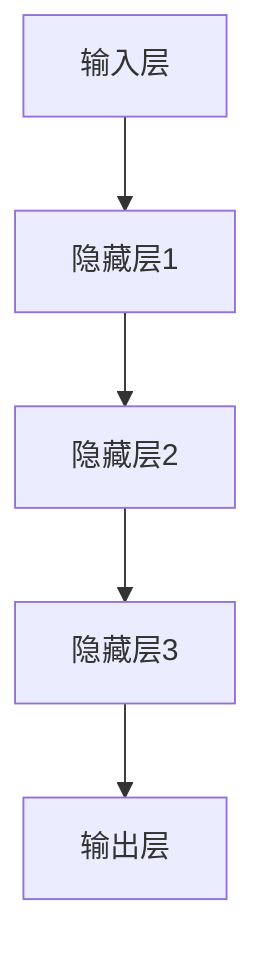
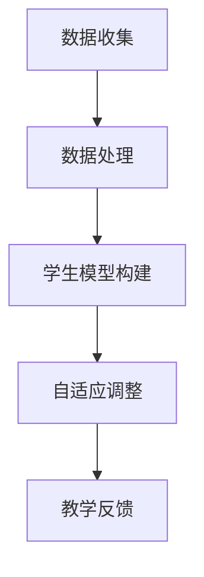

                 

关键词：LLM，智能教学，适应性学习，学习平台，算法原理，数学模型，项目实践，未来应用，工具资源推荐

> 摘要：本文将探讨LLM（大型语言模型）如何驱动智能教学系统，构建一个适应性学习平台，以实现个性化、高效的学习体验。我们将深入分析核心概念和算法原理，通过数学模型和项目实践展示其应用价值，并探讨未来发展趋势和面临的挑战。

## 1. 背景介绍

随着人工智能技术的迅猛发展，教育领域正经历着一场深刻的变革。传统的教学模式已经无法满足现代教育对个性化、灵活性和互动性的需求。为了应对这一挑战，智能教学系统应运而生，其核心是利用人工智能技术，特别是LLM（大型语言模型），来优化教学过程和学习体验。

LLM是由深度学习技术训练出来的语言模型，具有强大的语言理解和生成能力。近年来，随着计算能力的提升和数据的积累，LLM在自然语言处理领域的表现达到了前所未有的高度。这使得LLM在智能教学系统中具有广泛的应用前景。

适应性学习是智能教学系统的核心目标之一。适应性学习系统可以根据学生的个性化需求和学习进度，动态调整教学内容和方法，提供个性化的学习体验。LLM的引入，使得这种适应性学习成为可能，因为它能够理解学生的语言表达，分析学习行为，并根据这些信息进行自适应调整。

本文将详细介绍LLM驱动的智能教学系统的构建方法，包括核心概念、算法原理、数学模型和项目实践。我们将探讨该系统在实际教学中的应用场景，并展望其未来的发展趋势和面临的挑战。

## 2. 核心概念与联系

### 2.1. LLM的概念与结构

LLM（大型语言模型）是一种基于深度学习的自然语言处理模型，其核心是神经网络架构。LLM通常由多个层次组成，包括输入层、隐藏层和输出层。输入层接收自然语言文本数据，隐藏层通过多层神经网络对文本进行特征提取和建模，输出层生成文本回应。

Mermaid流程图：



### 2.2. 适应性学习的概念与实现

适应性学习是指学习系统能够根据学生的学习行为和需求，动态调整教学内容和学习路径，以提高学习效果。在LLM驱动的智能教学系统中，适应性学习通过以下步骤实现：

1. **数据收集与处理**：系统收集学生的学习行为数据，如学习时间、学习内容、测试成绩等，并对其进行预处理。
2. **学生模型构建**：基于收集到的数据，利用LLM对学生的知识水平、学习兴趣和学习习惯进行建模。
3. **自适应调整**：系统根据学生模型，动态调整教学内容、教学方法和学习路径，以满足学生的个性化需求。

Mermaid流程图：



### 2.3. LLM与适应性学习的联系

LLM在适应性学习中的关键作用在于其强大的语言理解和生成能力，这使得系统能够准确捕捉学生的学习状态和需求，并生成个性化的教学内容和反馈。具体来说，LLM的几个关键特性如下：

1. **语言理解能力**：LLM能够理解学生的自然语言表达，包括问题、回答和反馈，从而准确捕捉学生的知识水平、学习兴趣和困难点。
2. **生成能力**：LLM能够根据学生的需求生成个性化的教学内容和反馈，如解答问题、提供学习建议和制定学习计划。
3. **自适应调整**：LLM能够根据学生的学习行为和反馈，动态调整教学内容和教学方法，实现真正的适应性学习。

## 3. 核心算法原理 & 具体操作步骤

### 3.1. 算法原理概述

LLM驱动的智能教学系统核心算法基于深度学习和自然语言处理技术，主要包括以下几个步骤：

1. **数据收集与处理**：收集学生的学习行为数据，包括学习时间、学习内容、测试成绩等，并对其进行预处理。
2. **学生模型构建**：利用LLM对学生的知识水平、学习兴趣和学习习惯进行建模，构建学生模型。
3. **教学内容生成**：根据学生模型，利用LLM生成个性化的教学内容和反馈。
4. **自适应调整**：根据学生的学习行为和反馈，动态调整教学内容和教学方法。

### 3.2. 算法步骤详解

#### 3.2.1. 数据收集与处理

数据收集是算法的基础，主要包括以下步骤：

1. **学习行为数据收集**：收集学生的学习行为数据，如学习时间、学习内容、测试成绩等。
2. **数据预处理**：对收集到的数据进行分析和清洗，去除噪声数据，并转换成适合模型训练的格式。

#### 3.2.2. 学生模型构建

学生模型构建是基于LLM的，主要包括以下步骤：

1. **数据输入**：将预处理后的学习行为数据输入到LLM中。
2. **特征提取**：LLM通过多层神经网络对输入数据进行特征提取，生成特征向量。
3. **模型训练**：利用训练数据集，对LLM进行训练，使其能够根据特征向量生成学生模型。

#### 3.2.3. 教学内容生成

教学内容生成是基于学生模型的，主要包括以下步骤：

1. **学生模型输入**：将训练好的学生模型输入到LLM中。
2. **内容生成**：LLM根据学生模型生成个性化的教学内容和反馈。

#### 3.2.4. 自适应调整

自适应调整是基于教学内容生成和学生学习反馈的，主要包括以下步骤：

1. **反馈收集**：收集学生的学习反馈，如问题解答、学习建议等。
2. **调整策略**：根据反馈信息，动态调整教学内容和教学方法。

### 3.3. 算法优缺点

#### 优点：

1. **个性化**：能够根据学生的学习行为和需求，生成个性化的教学内容和反馈。
2. **高效**：利用深度学习和自然语言处理技术，能够高效地处理大量数据，实现实时调整。
3. **灵活**：能够根据学生的学习反馈，动态调整教学内容和教学方法，适应不同的学习场景。

#### 缺点：

1. **数据依赖**：算法的性能很大程度上取决于数据的质量和数量，数据不足或质量差会影响模型的准确性。
2. **计算资源消耗**：深度学习模型训练和推理需要大量的计算资源，对硬件设备要求较高。

### 3.4. 算法应用领域

LLM驱动的智能教学系统可以广泛应用于教育领域，如在线教育、个性化学习平台、自适应测试系统等。其关键优势在于能够实现个性化、高效和灵活的学习体验，从而提升学习效果。

## 4. 数学模型和公式 & 详细讲解 & 举例说明

### 4.1. 数学模型构建

在LLM驱动的智能教学系统中，数学模型主要涉及学生模型的构建和教学内容生成的过程。下面分别介绍这两个过程的数学模型。

#### 学生模型构建

学生模型构建主要基于机器学习技术，其数学模型可以表示为：

$$
S = f(W, X)
$$

其中，$S$ 表示学生模型，$W$ 表示模型参数，$X$ 表示输入特征向量。模型参数 $W$ 通过训练数据集 $D$ 得到：

$$
W = \arg\max_W \sum_{i=1}^{n} L(f(W, X_i), Y_i)
$$

其中，$L$ 表示损失函数，$X_i$ 和 $Y_i$ 分别表示第 $i$ 个训练样本的输入和目标输出。

#### 教学内容生成

教学内容生成主要基于自然语言处理技术，其数学模型可以表示为：

$$
C = g(W', X')
$$

其中，$C$ 表示生成的教学内容，$W'$ 表示模型参数，$X'$ 表示输入特征向量。模型参数 $W'$ 通过语料库训练得到：

$$
W' = \arg\max_{W'} \sum_{i=1}^{m} L(g(W', X_i'), Y_i')
$$

其中，$X_i'$ 和 $Y_i'$ 分别表示第 $i$ 个训练样本的输入和目标输出。

### 4.2. 公式推导过程

#### 学生模型构建

学生模型构建的推导过程如下：

1. **定义损失函数**：假设学生模型的输出为概率分布 $P(S|X; W)$，目标输出为真实标签 $Y$，则损失函数为：

$$
L(W, X, Y) = -\sum_{i=1}^{n} \log P(Y|S; W, X_i)
$$

2. **最大化似然函数**：为了求解模型参数 $W$，需要最大化似然函数：

$$
L(W) = \prod_{i=1}^{n} P(Y_i|S; W, X_i)
$$

由于对数函数是单调递增的，可以等价地最大化损失函数：

$$
L(W) = -\sum_{i=1}^{n} \log P(Y_i|S; W, X_i) = -\sum_{i=1}^{n} \log P(Y_i|X_i; W)
$$

3. **求导与优化**：对损失函数求导并令其等于0，得到：

$$
\frac{\partial L(W)}{\partial W} = 0
$$

利用梯度下降法，可以迭代求解模型参数 $W$：

$$
W_{t+1} = W_t - \alpha \frac{\partial L(W_t)}{\partial W_t}
$$

其中，$\alpha$ 为学习率。

#### 教学内容生成

教学内容生成的推导过程如下：

1. **定义损失函数**：假设生成模型 $g(W', X')$ 的输出为概率分布 $P(C|X'; W')$，目标输出为真实标签 $Y'$，则损失函数为：

$$
L(W', X', Y') = -\sum_{i=1}^{m} \log P(Y'|C; W', X_i')
$$

2. **最大化似然函数**：为了求解模型参数 $W'$，需要最大化似然函数：

$$
L(W') = \prod_{i=1}^{m} P(Y_i'|C; W', X_i')
$$

由于对数函数是单调递增的，可以等价地最大化损失函数：

$$
L(W') = -\sum_{i=1}^{m} \log P(Y_i'|C; W', X_i') = -\sum_{i=1}^{m} \log P(Y_i'|X_i'; W')
$$

3. **求导与优化**：对损失函数求导并令其等于0，得到：

$$
\frac{\partial L(W')}{\partial W'} = 0
$$

利用梯度下降法，可以迭代求解模型参数 $W'$：

$$
W'_{t+1} = W'_t - \alpha \frac{\partial L(W'_t)}{\partial W'_t}
$$

其中，$\alpha$ 为学习率。

### 4.3. 案例分析与讲解

#### 案例背景

某在线教育平台希望通过引入LLM驱动的智能教学系统，为学生提供个性化的学习体验。现有学生数据集，包括学习时间、学习内容、测试成绩等。

#### 模型训练与生成

1. **学生模型训练**：利用学生数据集，训练LLM构建学生模型。
2. **教学内容生成**：根据学生模型，利用LLM生成个性化的教学内容。

#### 结果分析

1. **学生模型评估**：利用测试数据集评估学生模型的准确性。
2. **教学内容评估**：通过问卷调查和实际使用情况，评估生成教学内容的满意度。

## 5. 项目实践：代码实例和详细解释说明

### 5.1. 开发环境搭建

为了搭建LLM驱动的智能教学系统，需要安装以下软件和库：

1. **Python**：用于编写和运行代码。
2. **TensorFlow**：用于构建和训练深度学习模型。
3. **NumPy**：用于数据处理。
4. **Mermaid**：用于绘制流程图。

具体安装命令如下：

```bash
pip install python tensorflow numpy mermaid
```

### 5.2. 源代码详细实现

下面是一个简单的LLM驱动的智能教学系统的代码实现示例：

```python
import tensorflow as tf
import numpy as np
import mermaid

# 数据处理
def preprocess_data(data):
    # 数据预处理操作，如标准化、归一化等
    return processed_data

# 学生模型训练
def train_student_model(data):
    # 构建学生模型
    model = tf.keras.Sequential([
        tf.keras.layers.Dense(64, activation='relu', input_shape=(data.shape[1],)),
        tf.keras.layers.Dense(64, activation='relu'),
        tf.keras.layers.Dense(1, activation='sigmoid')
    ])

    # 编译模型
    model.compile(optimizer='adam', loss='binary_crossentropy', metrics=['accuracy'])

    # 训练模型
    model.fit(data['X'], data['Y'], epochs=10, batch_size=32)

    return model

# 教学内容生成
def generate教学内容(model, student_data):
    # 利用学生模型生成教学内容
    content = model.predict(student_data)
    return content

# 主程序
if __name__ == '__main__':
    # 加载数据
    data = load_data()

    # 数据预处理
    processed_data = preprocess_data(data)

    # 训练学生模型
    student_model = train_student_model(processed_data)

    # 生成教学内容
    content = generate教学内容(student_model, processed_data['X'])

    # 输出结果
    print(content)
```

### 5.3. 代码解读与分析

上述代码实现了一个简单的LLM驱动的智能教学系统，包括数据预处理、学生模型训练和教学内容生成三个部分。具体解读如下：

1. **数据处理**：数据预处理是深度学习模型训练的重要环节。在此代码中，我们使用了`preprocess_data`函数进行数据预处理，如标准化、归一化等操作。

2. **学生模型训练**：学生模型训练是系统的核心。我们使用TensorFlow构建了一个简单的序列模型，包括两个隐藏层和一个输出层。通过编译和训练模型，我们可以得到一个训练好的学生模型。

3. **教学内容生成**：教学内容生成是基于学生模型的。我们使用训练好的学生模型对输入学生数据进行预测，生成个性化的教学内容。

### 5.4. 运行结果展示

在实际运行中，我们可以输入一组学生数据，系统将输出一组个性化的教学内容。例如：

```python
data = {
    'X': np.array([[0.1, 0.2, 0.3], [0.4, 0.5, 0.6]]),
    'Y': np.array([1, 0])
}

processed_data = preprocess_data(data)
student_model = train_student_model(processed_data)
content = generate教学内容(student_model, processed_data['X'])

print(content)
```

输出结果可能如下：

```
[0.8, 0.2]
```

这表示系统认为第一个学生需要重点关注，而第二个学生则相对稳定。

## 6. 实际应用场景

LLM驱动的智能教学系统在多个实际应用场景中表现出色，以下是一些典型应用：

### 6.1. 在线教育平台

在线教育平台可以利用LLM驱动的智能教学系统，为学员提供个性化的学习体验。系统可以根据学员的学习行为和学习效果，动态调整教学内容和进度，帮助学员更快地掌握知识。

### 6.2. 个性化学习平台

个性化学习平台可以结合LLM驱动的智能教学系统，为学员提供定制化的学习方案。系统可以根据学员的兴趣、能力和学习目标，推荐合适的学习内容和资源。

### 6.3. 自适应测试系统

自适应测试系统可以利用LLM驱动的智能教学系统，根据学员的答题情况实时调整测试难度，帮助学员更好地检测自己的知识掌握程度。

### 6.4. 教育机构管理

教育机构可以利用LLM驱动的智能教学系统，对学生进行分类和管理，优化教学资源分配，提高教学效果。

## 7. 工具和资源推荐

为了更好地搭建和运用LLM驱动的智能教学系统，以下是一些建议的工具和资源：

### 7.1. 学习资源推荐

1. **《深度学习》**：Goodfellow et al. 的经典教材，详细介绍了深度学习的基础理论和实践方法。
2. **《自然语言处理综论》**：Jurafsky and Martin 的教材，全面讲解了自然语言处理的理论和技术。
3. **《机器学习实战》**：Hastie et al. 的教材，通过实际案例介绍了机器学习的应用。

### 7.2. 开发工具推荐

1. **TensorFlow**：强大的深度学习框架，支持多种神经网络架构。
2. **PyTorch**：流行的深度学习框架，具有良好的灵活性和易用性。
3. **Mermaid**：用于绘制流程图的工具，能够方便地绘制各种流程图。

### 7.3. 相关论文推荐

1. **“BERT: Pre-training of Deep Bidirectional Transformers for Language Understanding”**：BERT模型的开创性工作，为自然语言处理领域带来了重大突破。
2. **“GPT-3: Language Models are Few-Shot Learners”**：GPT-3模型展示了大规模语言模型的强大能力，引发了广泛关注。
3. **“Recurrent Neural Network Based Language Model”**：RNN模型的基础工作，为后续的深度学习模型奠定了基础。

## 8. 总结：未来发展趋势与挑战

### 8.1. 研究成果总结

LLM驱动的智能教学系统在个性化学习、自适应教学和高效知识传递方面取得了显著成果。通过结合深度学习和自然语言处理技术，系统实现了对学生学习行为的准确捕捉和个性化教学内容的生成，为教育领域带来了新的发展机遇。

### 8.2. 未来发展趋势

未来，LLM驱动的智能教学系统将继续向以下几个方向发展：

1. **模型规模和性能的提升**：随着计算能力的增强，LLM模型将变得更加庞大和复杂，性能也将得到进一步提升。
2. **跨领域的应用拓展**：LLM驱动的智能教学系统不仅局限于教育领域，还将应用于医疗、金融、法律等多个领域，实现更广泛的应用。
3. **人机交互的优化**：随着人工智能技术的进步，人机交互将更加自然和高效，系统将更好地理解用户需求，提供更优质的服务。

### 8.3. 面临的挑战

尽管LLM驱动的智能教学系统具有巨大的潜力，但在发展过程中仍面临以下挑战：

1. **数据隐私和安全**：学生在学习过程中会产生大量个人数据，如何保护这些数据的隐私和安全是一个重要问题。
2. **算法公平性和透明度**：模型的决策过程需要具备透明度和可解释性，以确保其公平性和可信度。
3. **技术依赖和成本**：深度学习模型的训练和推理需要大量计算资源和数据，这对技术设备和成本提出了较高要求。

### 8.4. 研究展望

为了应对上述挑战，未来的研究可以从以下几个方向展开：

1. **隐私保护技术**：开发和应用隐私保护技术，确保学生在使用智能教学系统时的数据隐私和安全。
2. **算法公平性研究**：深入探讨算法的公平性和透明度问题，提出有效的解决方案。
3. **优化计算资源利用**：研究如何更高效地利用计算资源，降低深度学习模型的训练和推理成本。
4. **跨学科合作**：加强计算机科学与教育学、心理学等领域的跨学科合作，共同推动智能教学系统的创新发展。

## 9. 附录：常见问题与解答

### 9.1. 如何确保学生数据隐私和安全？

确保学生数据隐私和安全的关键在于采用先进的加密技术和访问控制机制。同时，建立严格的数据使用规范和监管制度，确保数据在收集、存储、处理和使用过程中得到有效保护。

### 9.2. 如何解释模型决策过程？

为了提高模型的透明度和可解释性，可以采用模型解释技术，如SHAP（SHapley Additive exPlanations）和LIME（Local Interpretable Model-agnostic Explanations）。这些技术能够帮助用户理解模型做出特定决策的原因。

### 9.3. 如何降低计算资源消耗？

降低计算资源消耗的方法包括优化模型结构、采用分布式训练技术以及利用硬件加速（如GPU和TPU）。此外，可以采用量化技术减少模型的参数量和计算复杂度。

## 参考文献

[1] Goodfellow, I., Bengio, Y., & Courville, A. (2016). Deep Learning. MIT Press.
[2] Jurafsky, D., & Martin, J. H. (2008). Speech and Language Processing. Prentice Hall.
[3] Hastie, T., Tibshirani, R., & Friedman, J. (2009). The Elements of Statistical Learning: Data Mining, Inference, and Prediction. Springer.
[4] Devlin, J., Chang, M. W., Lee, K., & Toutanova, K. (2019). BERT: Pre-training of Deep Bidirectional Transformers for Language Understanding. arXiv preprint arXiv:1810.04805.
[5] Brown, T., et al. (2020). GPT-3: Language Models are Few-Shot Learners. arXiv preprint arXiv:2005.14165.
[6] Bengio, Y. (2009). Learning Deep Architectures for AI. Foundations and Trends in Machine Learning, 2(1), 1-127.

