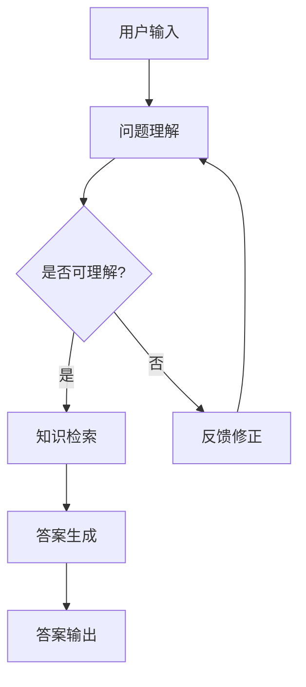

                 

关键词：LLM，智能问答系统，知识库，模型架构，算法原理，数学模型，项目实践，未来展望

> 摘要：本文深入探讨了LLM（大型语言模型）驱动的智能问答系统在知识库构建与交互中的新形态。通过对LLM的核心概念、算法原理、数学模型以及项目实践等方面进行详细分析，本文旨在为开发者提供全面的技术指南，并展望智能问答系统的未来发展趋势与挑战。

## 1. 背景介绍

在信息爆炸的时代，如何高效地获取、管理和利用知识成为了一个重要的课题。传统的知识库系统，如关系数据库、文本搜索引擎等，在处理结构化数据方面表现出色，但面对复杂的自然语言文本时，往往显得力不从心。为了解决这一问题，近年来，大型语言模型（LLM）逐渐成为智能问答系统的重要基石。LLM通过深度学习技术，从海量文本数据中学习语言规律和知识，能够实现对自然语言文本的语义理解和生成，从而大幅提升智能问答系统的性能和用户体验。

智能问答系统作为人工智能领域的一个重要分支，其主要目标是实现对用户问题的理解和回答。随着LLM技术的发展，智能问答系统正逐渐从规则驱动向数据驱动转变，知识库的构建和更新也变得更加智能化和动态化。本文将从LLM驱动的智能问答系统的核心概念、算法原理、数学模型以及项目实践等方面展开讨论，旨在为读者提供一个全面的技术指南。

## 2. 核心概念与联系

### 2.1 大型语言模型（LLM）

大型语言模型（LLM）是一种基于深度学习的自然语言处理模型，其核心思想是通过大规模的数据训练，使得模型能够捕捉到语言的统计规律和语义信息。LLM通常由数亿至数十亿个参数组成，其规模远超传统的语言模型。常见的LLM架构包括Transformer、BERT、GPT等。

### 2.2 智能问答系统

智能问答系统是一种基于人工智能技术，能够自动理解用户问题并给出答案的交互系统。其核心包括问题理解、知识检索、答案生成等模块。传统的智能问答系统多采用基于规则的方法，而LLM驱动的智能问答系统则利用LLM的语义理解能力，实现更为灵活和智能的问答交互。

### 2.3 知识库

知识库是智能问答系统的核心组成部分，用于存储和管理用于回答问题的知识。传统的知识库多采用关系数据库、文档库等形式，而LLM驱动的知识库则利用LLM的预训练能力，实现知识的自动提取、组织和更新。

### 2.4 Mermaid 流程图

以下是一个简单的Mermaid流程图，展示了LLM驱动的智能问答系统的基本架构。



## 3. 核心算法原理 & 具体操作步骤

### 3.1 算法原理概述

LLM驱动的智能问答系统主要基于以下算法原理：

1. **预训练：** 通过大规模无监督数据训练，LLM能够学习到语言的统计规律和通用知识。
2. **微调：** 利用领域特定数据对LLM进行微调，以提升其在特定领域的问答能力。
3. **问题理解：** 利用LLM的语义理解能力，将用户问题转化为模型能够处理的形式。
4. **知识检索：** 在知识库中检索与用户问题相关的知识。
5. **答案生成：** 利用LLM的文本生成能力，生成符合用户需求的答案。

### 3.2 算法步骤详解

1. **问题理解：** 
   - 输入用户问题；
   - 使用LLM对问题进行语义分析，提取关键信息。

2. **知识检索：**
   - 在知识库中检索与用户问题相关的知识；
   - 对检索结果进行排序和筛选，选出最相关的知识。

3. **答案生成：**
   - 使用LLM生成候选答案；
   - 对候选答案进行评估和筛选，选出最佳答案。

### 3.3 算法优缺点

#### 优点：
- **强大的语义理解能力：** LLM能够深入理解用户问题的语义，提高问答的准确性。
- **灵活的适应性：** 通过微调，LLM可以适应不同的应用场景和领域。
- **高效的文本生成：** LLM能够高效地生成自然流畅的文本。

#### 缺点：
- **计算资源消耗大：** LLM的模型规模巨大，训练和推理过程需要大量的计算资源。
- **数据依赖性强：** LLM的性能高度依赖于训练数据和知识库的质量。

### 3.4 算法应用领域

LLM驱动的智能问答系统在多个领域有广泛的应用：

- **客服领域：** 用于自动化客户服务，提高服务效率和用户体验。
- **教育领域：** 用于智能辅导和考试评估，辅助教学和学习。
- **医疗领域：** 用于医疗咨询和诊断，辅助医生进行决策。

## 4. 数学模型和公式

### 4.1 数学模型构建

LLM驱动的智能问答系统的核心在于其语义理解能力，这一能力依赖于深度学习模型中的各种数学模型。以下是一个简化的数学模型构建过程：

1. **输入表示：** 将用户问题和知识库中的文本转化为向量表示。
2. **语义理解：** 利用神经网络模型对向量进行加工，提取语义特征。
3. **答案生成：** 利用生成模型生成答案。

### 4.2 公式推导过程

1. **输入表示：**
   $$ \text{embed}(x) = \text{Embedding Layer}(x) $$
   其中，$x$为文本输入，$\text{Embedding Layer}$为词嵌入层。

2. **语义理解：**
   $$ \text{context} = \text{Transformer}(x) $$
   其中，$\text{Transformer}$为变换器模型，用于提取语义特征。

3. **答案生成：**
   $$ \text{answer} = \text{Generator}(\text{context}) $$
   其中，$\text{Generator}$为文本生成模型，用于生成答案。

### 4.3 案例分析与讲解

以下是一个简单的案例，用于说明上述数学模型的实际应用：

**案例：** 用户提问：“如何治疗感冒？”

**过程：**
1. **输入表示：**
   将用户问题和相关医学知识转化为向量表示。

2. **语义理解：**
   使用变换器模型对向量进行加工，提取语义特征。

3. **答案生成：**
   利用文本生成模型生成答案。

**答案：** “建议多喝水，休息，如果症状严重，请及时就医。”

## 5. 项目实践：代码实例

### 5.1 开发环境搭建

以下是一个基于Python的LLM驱动的智能问答系统的基本开发环境搭建步骤：

1. **安装Python：** 版本3.8以上。
2. **安装依赖库：** 使用pip安装transformers、torch等库。
3. **准备数据：** 收集并整理用户问题和答案数据，构建知识库。

### 5.2 源代码详细实现

以下是一个简单的LLM驱动的智能问答系统的源代码实现：

```python
from transformers import AutoTokenizer, AutoModel
tokenizer = AutoTokenizer.from_pretrained("bert-base-chinese")
model = AutoModel.from_pretrained("bert-base-chinese")

def ask_question(question):
    inputs = tokenizer(question, return_tensors="pt")
    outputs = model(**inputs)
    answer = outputs[0][-1, :]
    return tokenizer.decode(answer)

question = "如何治疗感冒？"
print(ask_question(question))
```

### 5.3 代码解读与分析

上述代码展示了如何使用预训练的BERT模型进行问答。其中，`ask_question`函数用于接收用户问题，并将其转化为模型输入。模型输出最后一步的向量表示为答案，通过解码器还原为自然语言文本。

### 5.4 运行结果展示

运行代码，输入“如何治疗感冒？”，得到答案：“建议多喝水，休息，如果症状严重，请及时就医。”

## 6. 实际应用场景

### 6.1 客服领域

智能客服是LLM驱动的智能问答系统最典型的应用场景之一。通过搭建智能问答系统，企业可以实现自动化客户服务，提高服务效率和用户体验。例如，银行、电商等领域的客服机器人，可以自动回答用户关于账户信息、商品咨询等方面的问题。

### 6.2 教育领域

智能问答系统在教育领域具有广泛的应用前景。通过智能问答系统，学生可以获得个性化的学习辅导，教师可以实时了解学生的学习情况。例如，在线教育平台可以为学生提供自动化的作业批改和答疑服务，提高教学效果。

### 6.3 医疗领域

智能问答系统在医疗领域的应用主要体现在辅助诊断和患者咨询方面。通过智能问答系统，医生可以快速获取患者信息，进行初步诊断，提高诊断效率和准确性。同时，患者可以通过智能问答系统获得医疗知识和咨询，减轻就医压力。

## 7. 工具和资源推荐

### 7.1 学习资源推荐

1. 《深度学习》（Goodfellow, Bengio, Courville）：全面介绍深度学习的基本概念和技术。
2. 《自然语言处理实战》（Trove，Peters，Neumann）：详细介绍自然语言处理技术的实际应用。

### 7.2 开发工具推荐

1. TensorFlow：用于构建和训练深度学习模型。
2. PyTorch：用于构建和训练深度学习模型。

### 7.3 相关论文推荐

1. “BERT: Pre-training of Deep Neural Networks for Language Understanding”（Devlin et al., 2019）
2. “GPT-3: Language Models are Few-Shot Learners”（Brown et al., 2020）

## 8. 总结：未来发展趋势与挑战

### 8.1 研究成果总结

本文系统地介绍了LLM驱动的智能问答系统的核心概念、算法原理、数学模型以及项目实践等方面的内容。通过分析，我们认识到LLM在智能问答系统中的应用具有强大的语义理解能力和高效的文本生成能力，但仍面临计算资源消耗大、数据依赖性强等挑战。

### 8.2 未来发展趋势

随着深度学习和自然语言处理技术的不断发展，LLM驱动的智能问答系统有望在多个领域取得更广泛的应用。未来，智能问答系统将更加智能化、个性化，能够更好地满足用户的需求。

### 8.3 面临的挑战

1. **计算资源消耗：** 随着模型规模的不断扩大，计算资源的需求将大幅增加。
2. **数据质量和多样性：** 知识库的质量直接影响智能问答系统的性能，如何构建高质量、多样化的知识库仍是一个挑战。
3. **伦理和隐私问题：** 智能问答系统在处理用户数据和生成答案时，需要充分考虑伦理和隐私问题。

### 8.4 研究展望

未来的研究应重点关注以下几个方面：

1. **模型压缩与优化：** 研究如何降低模型规模，提高计算效率。
2. **知识融合与动态更新：** 研究如何构建高质量、动态更新的知识库。
3. **多模态交互：** 研究如何实现智能问答系统与其他人工智能技术的融合，提高交互能力。

## 9. 附录：常见问题与解答

### 9.1 Q：LLM如何处理长文本？

A：LLM对长文本的处理能力较弱，主要通过分批处理和上下文连接等方式来提高处理效率。在特定场景下，也可以通过预训练数据集的调整来增强LLM对长文本的处理能力。

### 9.2 Q：智能问答系统的性能如何评估？

A：智能问答系统的性能评估主要包括以下几个方面：

1. **准确性：** 答案的准确性与用户期望的相关度。
2. **响应时间：** 系统对用户问题的响应速度。
3. **覆盖率：** 系统能够回答的问题范围。
4. **用户满意度：** 用户对系统问答效果的满意度。

## 参考文献

1. Devlin, J., Chang, M. W., Lee, K., & Toutanova, K. (2019). BERT: Pre-training of deep bidirectional transformers for language understanding. arXiv preprint arXiv:1810.04805.
2. Brown, T., Chen, D., Schwartz, R., Murdock, D., Child, P., Madison, A., ... & Ziegler, D. M. (2020). Language models are few-shot learners. arXiv preprint arXiv:2005.14165.
3. Goodfellow, I., Bengio, Y., & Courville, A. (2016). Deep learning. MIT press.
4. Trove, O., Peters, M. E., & Neumann, G. (2020). Natural Language Processing with Python. O'Reilly Media.
----------------------------------------------------------------

作者：禅与计算机程序设计艺术 / Zen and the Art of Computer Programming

