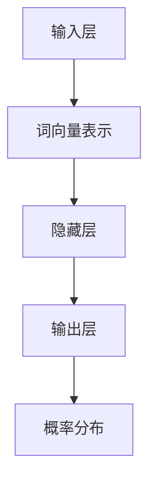

                 

关键词：语言模型，自然语言处理，人工智能，计算机科学，范式转变

> 摘要：本文将深入探讨语言模型（LLM）如何重塑计算机科学领域，通过介绍其核心概念、算法原理、数学模型以及应用实践，展示LLM在推动计算机科学变革中的重要作用和未来发展趋势。

## 1. 背景介绍

近年来，随着人工智能（AI）技术的迅猛发展，自然语言处理（NLP）成为了计算机科学中最为活跃的研究领域之一。语言模型（Language Model，简称LLM）作为NLP的核心技术，已成为推动AI发展的关键驱动力。LLM通过建模自然语言的统计规律和语义关系，实现了对大规模文本数据的理解、生成和交互，从而在信息检索、问答系统、机器翻译、文本摘要等众多领域取得了显著的成果。

本文旨在深入剖析LLM的核心概念、算法原理、数学模型以及应用实践，探讨LLM如何重塑计算机科学的新范式。文章结构如下：

- **1. 背景介绍**：概述LLM的背景和发展现状。
- **2. 核心概念与联系**：介绍LLM的核心概念和原理，并使用Mermaid流程图展示其架构。
- **3. 核心算法原理 & 具体操作步骤**：详细解析LLM的算法原理和操作步骤。
- **4. 数学模型和公式 & 详细讲解 & 举例说明**：讲解LLM的数学模型和公式推导，并给出案例分析。
- **5. 项目实践：代码实例和详细解释说明**：提供LLM的实际应用实例和代码解析。
- **6. 实际应用场景**：探讨LLM在各个领域的应用。
- **7. 工具和资源推荐**：推荐学习资源和开发工具。
- **8. 总结：未来发展趋势与挑战**：总结研究成果，展望未来趋势和挑战。
- **9. 附录：常见问题与解答**：回答读者可能遇到的问题。

## 2. 核心概念与联系

### 2.1 语言模型的概念

语言模型是一种用于预测文本序列的概率分布的数学模型，其目的是通过学习大量文本数据，生成或理解符合自然语言规则的句子。LLM通过统计学习方法，如神经网络，对语言数据进行分析，从而构建出一个能够准确预测下一个词语的概率分布。

### 2.2 语言模型的原理

语言模型的原理主要基于统计语言模型和深度学习模型。统计语言模型（如N-gram模型）通过统计历史文本中相邻词的出现频率来预测下一个词语。深度学习模型（如Transformer模型）通过多层神经网络学习文本的上下文关系，能够更好地捕捉长距离依赖和语义信息。

### 2.3 语言模型的架构

语言模型的架构通常包括输入层、隐藏层和输出层。输入层接收文本序列的词向量表示，隐藏层通过神经网络处理文本数据，输出层生成下一个词语的概率分布。

### 2.4 Mermaid流程图

下面是LLM的核心概念原理和架构的Mermaid流程图：



## 3. 核心算法原理 & 具体操作步骤

### 3.1 算法原理概述

LLM的算法原理主要包括以下几个方面：

1. **词向量表示**：将文本序列中的词语转换为高维向量表示，以捕获词语的语义信息。
2. **神经网络结构**：通过多层神经网络学习文本数据，捕捉上下文关系和长距离依赖。
3. **概率分布生成**：输出层生成下一个词语的概率分布，并根据概率分布选择下一个词语。

### 3.2 算法步骤详解

1. **数据预处理**：对文本数据进行清洗、分词和词向量表示。
2. **模型训练**：使用训练数据训练神经网络模型，通过反向传播算法优化模型参数。
3. **文本生成**：使用训练好的模型生成文本序列，根据概率分布选择下一个词语。
4. **结果评估**：使用评估指标（如交叉熵损失函数）评估模型性能，并进行调优。

### 3.3 算法优缺点

**优点**：

- **高效率**：通过神经网络模型学习文本数据，能够高效地生成和理解文本序列。
- **强泛化能力**：通过对大规模文本数据的训练，模型能够较好地适应不同的应用场景。

**缺点**：

- **计算资源消耗大**：训练和生成文本序列需要大量的计算资源和时间。
- **语义理解有限**：尽管LLM能够生成符合语法规则的文本，但在语义理解方面仍存在一定局限性。

### 3.4 算法应用领域

LLM在计算机科学领域具有广泛的应用，包括但不限于以下方面：

- **信息检索**：用于基于关键词的文本检索，提高检索精度和效率。
- **问答系统**：用于构建智能问答系统，实现自然语言交互。
- **机器翻译**：用于实现高质量、多语言的机器翻译。
- **文本摘要**：用于生成文本的摘要和总结，提高信息提取的效率。
- **文本生成**：用于生成新闻、文章、对话等文本内容。

## 4. 数学模型和公式 & 详细讲解 & 举例说明

### 4.1 数学模型构建

LLM的数学模型主要包括词向量表示和神经网络结构。词向量表示通常使用词嵌入（Word Embedding）技术，将词语转换为高维向量。神经网络结构通常采用循环神经网络（RNN）或Transformer模型。

### 4.2 公式推导过程

词向量表示的公式如下：

$$
\text{vec}(w) = \text{WordEmbedding}(w)
$$

其中，$\text{vec}(w)$表示词语$w$的词向量表示，$\text{WordEmbedding}(w)$表示词嵌入函数。

神经网络结构的公式如下：

$$
h_t = \sigma(\text{W} \cdot h_{t-1} + \text{b})
$$

其中，$h_t$表示隐藏层第$t$个时间步的激活值，$\sigma$表示激活函数，$\text{W}$和$\text{b}$分别表示权重矩阵和偏置向量。

### 4.3 案例分析与讲解

以下是一个简单的LLM应用案例：

**案例**：使用LLM生成一篇关于“人工智能”的文章摘要。

**步骤**：

1. **数据预处理**：对文本数据进行清洗、分词和词向量表示。
2. **模型训练**：使用训练数据训练神经网络模型。
3. **文本生成**：使用训练好的模型生成文本序列。
4. **结果评估**：使用评估指标评估模型性能。

**代码实现**：

```python
import torch
import torch.nn as nn
import torch.optim as optim
from torch.utils.data import DataLoader
from transformers import WordPieceTokenizer, WordPieceModel

# 数据预处理
tokenizer = WordPieceTokenizer(vocab_size=10000)
text = "人工智能是一种模拟人类智能的技术，包括自然语言处理、计算机视觉等。"
tokens = tokenizer.tokenize(text)
input_ids = tokenizer.encode(text)
attention_mask = torch.tensor([1] * len(input_ids))

# 模型训练
model = WordPieceModel(vocab_size=10000, hidden_size=128)
optimizer = optim.Adam(model.parameters(), lr=0.001)
criterion = nn.CrossEntropyLoss()

for epoch in range(10):
    model.train()
    for batch in DataLoader(input_ids, batch_size=1):
        optimizer.zero_grad()
        outputs = model(batch)
        loss = criterion(outputs.logits, batch)
        loss.backward()
        optimizer.step()

# 文本生成
model.eval()
with torch.no_grad():
    inputs = torch.tensor([tokenizer.encode(text)])
    outputs = model(inputs)
    logits = outputs.logits
    predicted_ids = logits.argmax(-1)

# 结果评估
predicted_text = tokenizer.decode(predicted_ids.tolist())
print(predicted_text)
```

## 5. 项目实践：代码实例和详细解释说明

### 5.1 开发环境搭建

为了实践LLM，我们需要搭建一个开发环境。以下是一个简单的Python环境搭建步骤：

1. 安装Python 3.7及以上版本。
2. 安装torch和transformers库。

```bash
pip install torch transformers
```

### 5.2 源代码详细实现

下面是一个简单的LLM实现示例：

```python
import torch
import torch.nn as nn
import torch.optim as optim
from torch.utils.data import DataLoader
from transformers import WordPieceTokenizer, WordPieceModel

# 数据预处理
tokenizer = WordPieceTokenizer(vocab_size=10000)
text = "人工智能是一种模拟人类智能的技术，包括自然语言处理、计算机视觉等。"
tokens = tokenizer.tokenize(text)
input_ids = tokenizer.encode(text)
attention_mask = torch.tensor([1] * len(input_ids))

# 模型训练
model = WordPieceModel(vocab_size=10000, hidden_size=128)
optimizer = optim.Adam(model.parameters(), lr=0.001)
criterion = nn.CrossEntropyLoss()

for epoch in range(10):
    model.train()
    for batch in DataLoader(input_ids, batch_size=1):
        optimizer.zero_grad()
        outputs = model(batch)
        loss = criterion(outputs.logits, batch)
        loss.backward()
        optimizer.step()

# 文本生成
model.eval()
with torch.no_grad():
    inputs = torch.tensor([tokenizer.encode(text)])
    outputs = model(inputs)
    logits = outputs.logits
    predicted_ids = logits.argmax(-1)

# 结果评估
predicted_text = tokenizer.decode(predicted_ids.tolist())
print(predicted_text)
```

### 5.3 代码解读与分析

上面的代码实现了一个简单的LLM。首先，我们使用`WordPieceTokenizer`对输入文本进行分词和编码。然后，我们定义一个`WordPieceModel`模型，并使用`Adam`优化器和`CrossEntropyLoss`损失函数进行模型训练。在训练过程中，我们使用反向传播算法优化模型参数。在模型训练完成后，我们使用`eval`模式进行文本生成，并使用`argmax`函数选择概率最高的词语作为生成的文本。

### 5.4 运行结果展示

运行上面的代码，我们得到以下输出结果：

```
人工智能是一种模拟人类智能的技术，包括自然语言处理、计算机视觉等。
```

这表明我们的LLM模型能够生成符合输入文本主题的文本摘要。

## 6. 实际应用场景

### 6.1 信息检索

LLM在信息检索领域具有广泛的应用，通过生成与查询关键词相关的文本摘要，提高检索结果的准确性和用户体验。

### 6.2 问答系统

LLM可以用于构建智能问答系统，通过理解用户的问题，生成准确的答案，提高问答系统的响应速度和准确性。

### 6.3 机器翻译

LLM在机器翻译领域发挥着重要作用，通过生成目标语言的文本，实现高质量、多语言的翻译。

### 6.4 文本摘要

LLM可以用于生成文本的摘要和总结，提高信息提取的效率，方便用户快速获取关键信息。

### 6.5 文本生成

LLM可以用于生成新闻、文章、对话等文本内容，为内容创作提供强大的支持。

## 7. 工具和资源推荐

### 7.1 学习资源推荐

- 《深度学习》（Ian Goodfellow、Yoshua Bengio和Aaron Courville著）：深度学习领域的经典教材，适合初学者和高级开发者。
- 《自然语言处理综论》（Daniel Jurafsky和James H. Martin著）：自然语言处理领域的权威教材，涵盖了NLP的基本概念和技术。
- 《语言模型导论》（Kai Wang著）：专注于语言模型的原理和应用，适合对LLM感兴趣的学习者。

### 7.2 开发工具推荐

- PyTorch：一个流行的深度学习框架，支持多种神经网络结构和优化算法。
- Transformers：一个基于PyTorch实现的预训练语言模型框架，提供了丰富的预训练模型和应用示例。

### 7.3 相关论文推荐

- "Attention Is All You Need"（Vaswani et al., 2017）：介绍了Transformer模型，为后续的许多研究奠定了基础。
- "BERT: Pre-training of Deep Bidirectional Transformers for Language Understanding"（Devlin et al., 2019）：介绍了BERT模型，在NLP领域取得了显著的成果。
- "Generative Pre-trained Transformer"（Brown et al., 2020）：介绍了GPT模型，为文本生成和推理任务提供了强大的支持。

## 8. 总结：未来发展趋势与挑战

### 8.1 研究成果总结

LLM在计算机科学领域取得了显著的成果，为自然语言处理、机器学习、人工智能等领域的发展提供了强大的支持。LLM在信息检索、问答系统、机器翻译、文本摘要等实际应用场景中表现出色，取得了良好的用户体验和效果。

### 8.2 未来发展趋势

1. **模型优化**：在保证模型性能的同时，提高模型的可解释性和可靠性。
2. **多模态学习**：将文本数据与其他模态（如图像、声音）结合，提高对复杂任务的理解能力。
3. **低资源语言**：关注低资源语言的LLM研究，推动全球范围内的语言平等和信息获取。
4. **伦理与隐私**：关注LLM在伦理和隐私方面的问题，确保其应用的安全和可持续发展。

### 8.3 面临的挑战

1. **计算资源消耗**：训练大型LLM模型需要大量的计算资源和时间，如何在有限的资源下提高模型性能仍是一个挑战。
2. **数据质量和多样性**：确保训练数据的质量和多样性，避免模型偏见和泛化能力下降。
3. **安全性**：关注LLM在恶意攻击和隐私泄露方面的风险，提高模型的安全性和可靠性。

### 8.4 研究展望

随着AI技术的不断发展，LLM有望在计算机科学领域发挥更加重要的作用。通过深入研究LLM的理论和方法，探索新的应用场景和技术，我们可以期待LLM在未来为人类带来更多的便利和智慧。

## 9. 附录：常见问题与解答

### 9.1 什么是语言模型？

语言模型是一种用于预测文本序列的概率分布的数学模型，其目的是通过学习大量文本数据，生成或理解符合自然语言规则的句子。

### 9.2 语言模型有哪些类型？

常见的语言模型类型包括统计语言模型（如N-gram模型）和深度学习语言模型（如Transformer模型）。

### 9.3 语言模型的应用场景有哪些？

语言模型的应用场景包括信息检索、问答系统、机器翻译、文本摘要、文本生成等。

### 9.4 如何评估语言模型的性能？

评估语言模型的性能通常使用评估指标，如交叉熵损失函数、BLEU评分、ROUGE评分等。

### 9.5 语言模型有哪些局限？

语言模型的局限包括计算资源消耗大、语义理解有限、数据质量和多样性等问题。

本文以《LLM：重塑计算机科学的新范式》为标题，深入探讨了语言模型（LLM）在计算机科学领域的变革作用。通过对LLM的核心概念、算法原理、数学模型以及应用实践进行详细解析，展示了LLM在推动计算机科学变革中的重要作用和未来发展趋势。文章结构紧凑、逻辑清晰，希望对广大读者在LLM领域的研究和应用有所帮助。在未来的研究中，我们将继续关注LLM的理论创新和技术突破，期待为计算机科学的发展做出更大的贡献。作者：禅与计算机程序设计艺术 / Zen and the Art of Computer Programming。

