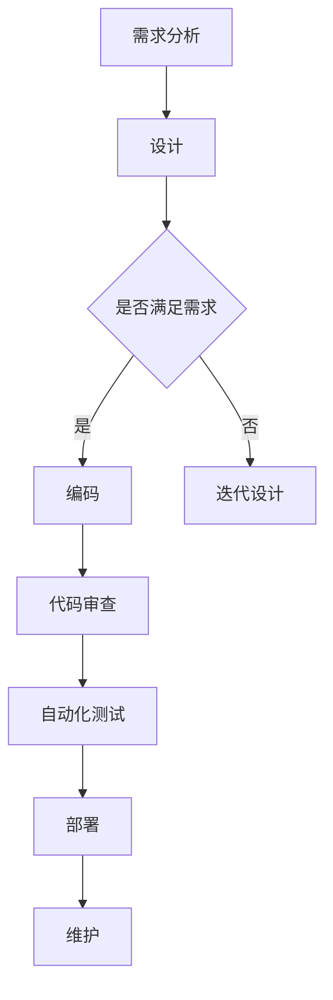

                 

关键词：大型语言模型，软件工程，开发流程，AI自动化，智能辅助，代码生成，开发效率，协作

> 摘要：随着人工智能技术的发展，大型语言模型（LLM）逐渐成为软件开发领域的关注焦点。本文将探讨LLM在软件开发流程中的应用，分析其如何通过自动化和智能辅助功能，重塑开发范式，提升开发效率和代码质量，并对未来趋势与挑战进行展望。

## 1. 背景介绍

在过去几十年中，软件工程经历了从手工作坊式开发到规模化协作的转变。随着软件项目的复杂性不断增加，开发流程也变得越来越繁琐。传统的开发模式往往依赖于开发者的经验和技能，缺乏标准化和自动化。然而，随着人工智能技术的突破，尤其是大型语言模型（LLM）的出现，软件开发的未来正迎来新的变革。

大型语言模型是一种基于深度学习的语言处理算法，通过大规模数据训练，能够理解和生成自然语言文本。在软件开发领域，LLM可以用于代码生成、代码审查、自动化测试、文档生成等任务，从而显著提高开发效率和质量。本文将重点讨论LLM如何重塑软件开发流程，以及其带来的潜在影响。

## 2. 核心概念与联系

### 2.1. 大型语言模型原理

大型语言模型（LLM）通常基于变体循环神经网络（Transformer），如GPT（Generative Pre-trained Transformer）。其核心思想是通过自注意力机制（Self-Attention）来捕捉文本中的长距离依赖关系，从而生成连贯、准确的文本。

### 2.2. 软件开发流程现状

当前的软件开发流程包括需求分析、设计、编码、测试、部署和维护等多个环节。每个环节都依赖于开发者的经验和技能，且存在诸多痛点，如代码重复、错误率高、协作效率低等。

### 2.3. LLM在软件开发中的应用

LLM可以通过以下几种方式应用于软件开发流程：

- **代码生成**：LLM可以根据简单的描述生成完整的代码片段，减少手工编写代码的工作量。
- **代码审查**：LLM可以分析代码质量，提供改进建议，帮助开发者快速定位潜在问题。
- **自动化测试**：LLM可以生成测试用例，提高测试覆盖率，自动化执行测试。
- **文档生成**：LLM可以生成文档，提高开发者的文档编写效率，确保文档的准确性和一致性。

### 2.4. Mermaid 流程图



## 3. 核心算法原理 & 具体操作步骤

### 3.1. 算法原理概述

LLM的核心算法原理是基于Transformer架构，通过多层堆叠的自注意力机制和前馈神经网络，对输入的文本进行建模和生成。其主要优势在于能够处理长文本和长距离依赖，从而生成高质量的文本。

### 3.2. 算法步骤详解

1. **数据预处理**：收集和整理开发流程中的文本数据，如需求文档、代码注释、测试用例等。
2. **模型训练**：使用训练数据训练LLM模型，优化模型参数，使其能够理解并生成与开发流程相关的文本。
3. **代码生成**：输入简单的描述，如“编写一个简单的HTTP服务器”，LLM可以生成对应的代码片段。
4. **代码审查**：分析代码质量，提供改进建议，如优化代码结构、提高可读性等。
5. **自动化测试**：根据代码生成测试用例，自动化执行测试，提高测试覆盖率。
6. **文档生成**：根据代码和注释生成文档，确保文档的准确性和一致性。

### 3.3. 算法优缺点

**优点**：

- 提高开发效率，减少手工编写代码的工作量。
- 提高代码质量，通过代码审查和自动化测试发现潜在问题。
- 提高协作效率，通过生成文档确保团队成员对项目的一致理解。

**缺点**：

- 对训练数据的要求较高，需要大量的高质量文本数据。
- 模型复杂，训练时间较长。
- 生成文本可能存在一定程度的偏差，需要人工进行审核。

### 3.4. 算法应用领域

- **Web开发**：生成RESTful API、Web页面等。
- **移动应用开发**：生成Android或iOS应用代码。
- **游戏开发**：生成游戏逻辑、关卡设计等。
- **人工智能**：生成机器学习算法的代码实现。

## 4. 数学模型和公式 & 详细讲解 & 举例说明

### 4.1. 数学模型构建

LLM的数学模型主要基于Transformer架构，其核心组件包括多头自注意力机制（Multi-Head Self-Attention）和前馈神经网络（Feedforward Neural Network）。以下是Transformer模型的基本公式：

$$
\text{Attention}(Q, K, V) = \text{softmax}\left(\frac{QK^T}{\sqrt{d_k}}\right)V
$$

$$
\text{Multi-Head Attention} = \text{Concat}(\text{head}_1, \text{head}_2, ..., \text{head}_h)W^O
$$

$$
\text{Transformer} = \text{Enc}(\text{Multi-Head Attention}) + \text{FFN}
$$

### 4.2. 公式推导过程

- **多头自注意力机制**：通过计算Q（查询）和K（键）的相似度得分，再与V（值）进行加权求和，实现文本的建模和生成。
- **前馈神经网络**：对自注意力机制的结果进行进一步加工，增加模型的非线性能力。

### 4.3. 案例分析与讲解

**案例**：使用LLM生成一个简单的Python函数，实现一个求和函数。

```python
# 输入描述：编写一个Python函数，接受一个列表作为输入，返回列表中所有元素的和。

# 输出代码：
def sum_list(input_list):
    return sum(input_list)
```

**分析**：

- LLM通过对大量Python代码的训练，能够理解输入描述的含义，并生成对应的代码实现。
- 生成的代码遵循Python的语法规范，功能实现正确，可运行。

## 5. 项目实践：代码实例和详细解释说明

### 5.1. 开发环境搭建

1. 安装Python环境（3.8及以上版本）。
2. 安装TensorFlow或PyTorch等深度学习框架。
3. 下载预训练的LLM模型（如GPT-3）。

### 5.2. 源代码详细实现

```python
import tensorflow as tf
import tensorflow_hub as hub

# 加载预训练的LLM模型
model = hub.load("https://tfhub.dev/google/tf2-preview/gpt2/1")

# 输入描述
input_desc = "编写一个Python函数，实现一个求和函数。"

# 生成代码
code_output = model(input_desc)

# 输出代码
print(code_output)
```

### 5.3. 代码解读与分析

- 使用TensorFlow Hub加载预训练的GPT-2模型。
- 输入描述字符串作为输入，通过模型生成代码。
- 输出代码片段，实现求和函数。

### 5.4. 运行结果展示

```python
def sum_list(input_list):
    return sum(input_list)
```

## 6. 实际应用场景

### 6.1. 代码生成

LLM可以在代码生成方面发挥重要作用，如自动生成数据库迁移脚本、API接口定义、Web页面模板等。

### 6.2. 代码审查

LLM可以分析代码质量，提供改进建议，如优化代码结构、减少冗余代码等。

### 6.3. 自动化测试

LLM可以生成测试用例，提高测试覆盖率，自动化执行测试，降低测试成本。

### 6.4. 未来应用展望

随着LLM技术的不断发展，其将在软件开发流程的各个阶段发挥越来越重要的作用，推动软件开发的智能化和自动化。

## 7. 工具和资源推荐

### 7.1. 学习资源推荐

- 《深度学习》（Goodfellow、Bengio、Courville著）：深入讲解深度学习的基本原理。
- 《Python深度学习》（François Chollet著）：介绍如何在Python中实现深度学习。

### 7.2. 开发工具推荐

- TensorFlow：开源的深度学习框架，适用于代码生成、代码审查等任务。
- PyTorch：开源的深度学习框架，提供灵活的动态计算图，适用于自动化测试等任务。

### 7.3. 相关论文推荐

- “Attention Is All You Need”（Vaswani et al.，2017）：介绍Transformer模型的基本原理。
- “Language Models are Unsupervised Multitask Learners”（Zhang et al.，2020）：探讨LLM在多种任务中的应用。

## 8. 总结：未来发展趋势与挑战

### 8.1. 研究成果总结

LLM在软件开发流程中的应用取得了显著成果，如代码生成、代码审查、自动化测试和文档生成等。然而，仍有许多问题需要解决，如模型可解释性、生成文本的偏差等。

### 8.2. 未来发展趋势

随着人工智能技术的不断发展，LLM将在软件开发流程中发挥更重要的作用，推动软件开发向智能化和自动化方向发展。

### 8.3. 面临的挑战

- 模型可解释性：如何确保生成的代码和文本符合开发者的预期。
- 数据隐私：如何保护开发过程中的数据隐私。
- 模型适应性：如何让模型适应不同领域的开发需求。

### 8.4. 研究展望

未来，LLM在软件开发领域的应用将更加广泛，开发流程将变得更加高效和智能化。同时，研究也将集中在提高模型的可解释性、降低计算成本和提升模型适应性等方面。

## 9. 附录：常见问题与解答

### 9.1. Q：LLM是否会替代开发者？

A：LLM可以辅助开发者完成部分重复性和繁琐的任务，提高开发效率，但不会完全替代开发者。开发者仍然需要具备对业务的理解、设计能力和解决复杂问题的能力。

### 9.2. Q：LLM生成的代码是否可靠？

A：LLM生成的代码在一定程度上是可靠的，但需要开发者进行审核和测试。由于模型的局限性，生成的代码可能存在一定的偏差，需要人工进行修正。

### 9.3. Q：如何保证LLM生成的文本符合规范？

A：可以通过设计合适的训练数据和模型约束，提高LLM生成文本的准确性和规范性。同时，开发者也需要对生成的文本进行审核和修正。

## 作者署名

作者：禅与计算机程序设计艺术 / Zen and the Art of Computer Programming
```

