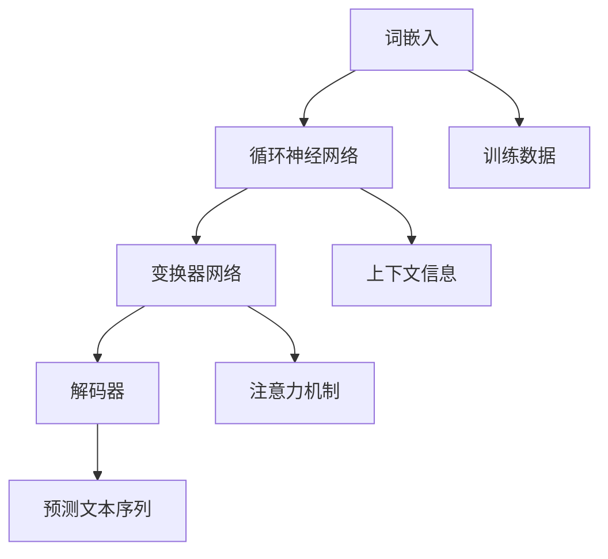

                 

关键词：大型语言模型，计算技术，人工智能，机器学习，自然语言处理，未来趋势

摘要：本文将深入探讨大型语言模型（LLM）的技术原理、发展历程及其在计算领域的重要作用。通过分析LLM的核心算法、数学模型及实际应用案例，本文旨在揭示LLM如何重新定义计算的未来，并展望其在各行各业的应用前景。

## 1. 背景介绍

随着计算机技术的飞速发展，人工智能（AI）逐渐成为推动社会进步的重要力量。在AI领域，自然语言处理（NLP）作为计算机科学的一个重要分支，其研究与应用日益受到关注。近年来，大型语言模型（LLM）凭借其卓越的性能和广泛的应用场景，成为NLP领域的明星技术。LLM的出现不仅推动了计算技术的发展，也为各行各业带来了全新的变革机遇。

## 2. 核心概念与联系

### 2.1 语言模型的基本原理

语言模型是一种统计模型，用于预测文本序列的下一个词或字符。LLM则是在传统语言模型基础上，通过引入深度学习和神经网络技术，实现了对大规模文本数据的建模与处理。LLM的核心在于其能够对语言结构、语义和上下文进行深入理解和建模，从而在自然语言处理任务中取得优异的性能。

### 2.2 语言模型的架构

语言模型的架构通常包括以下几个层次：

1. **词嵌入（Word Embedding）**：将词汇映射到高维向量空间，以便进行数值计算。
2. **循环神经网络（RNN）**：用于处理序列数据，捕获上下文信息。
3. **变换器网络（Transformer）**：一种基于自注意力机制的神经网络结构，具有处理长序列数据的高效能力。
4. **解码器（Decoder）**：用于生成预测的文本序列。

### 2.3 Mermaid 流程图



## 3. 核心算法原理 & 具体操作步骤

### 3.1 算法原理概述

LLM的核心算法是基于深度学习和神经网络的模型训练过程。首先，通过大规模文本数据集进行预训练，使模型学会语言的基本结构。然后，在特定任务上进行微调，实现具体的应用。

### 3.2 算法步骤详解

1. **数据准备**：收集并清洗大规模的文本数据，如书籍、新闻、网页等。
2. **词嵌入**：将词汇映射到高维向量空间，可以使用预训练的词向量，如GloVe或Word2Vec。
3. **模型训练**：使用循环神经网络或变换器网络对文本数据集进行训练，优化模型参数。
4. **微调**：在特定任务上，对模型进行微调，提高任务性能。
5. **预测**：使用训练好的模型对新的文本数据进行处理，生成预测结果。

### 3.3 算法优缺点

**优点**：
- **强大的语言理解能力**：LLM能够深入理解和建模语言结构，实现高精度的自然语言处理任务。
- **高效的处理速度**：基于变换器网络的结构，LLM在处理长序列数据时具有高效的能力。
- **广泛的适用性**：LLM在各种NLP任务中均表现出优异的性能，如机器翻译、文本分类、问答系统等。

**缺点**：
- **资源消耗**：LLM的训练和推理过程需要大量的计算资源和存储空间。
- **解释性不足**：由于深度学习的黑箱性质，LLM难以解释其预测结果。

### 3.4 算法应用领域

LLM在众多领域具有广泛的应用，如：

- **自然语言处理**：文本分类、情感分析、机器翻译、问答系统等。
- **语音识别**：语音转文字、语音合成等。
- **智能客服**：智能聊天机器人、客服系统等。
- **教育**：智能辅导、在线学习等。
- **医疗**：医学文本分析、疾病预测等。

## 4. 数学模型和公式 & 详细讲解 & 举例说明

### 4.1 数学模型构建

LLM的数学模型主要涉及以下几个方面：

1. **词嵌入**：将词汇映射到高维向量空间，可以使用矩阵乘法进行计算。
2. **循环神经网络（RNN）**：基于门控机制，如LSTM或GRU，用于处理序列数据。
3. **变换器网络（Transformer）**：自注意力机制，用于捕获长距离依赖关系。
4. **解码器**：生成预测的文本序列，通常采用自回归模型。

### 4.2 公式推导过程

以变换器网络为例，其核心公式为：

$$
\text{Attention}(Q, K, V) = \frac{1}{\sqrt{d_k}} \text{softmax}\left(\text{softmax}\left(\frac{QK^T}{\sqrt{d_k}}\right) V\right)
$$

其中，$Q, K, V$分别为查询向量、键向量和值向量，$d_k$为键向量的维度。

### 4.3 案例分析与讲解

假设我们有一个简单的文本序列：“今天天气很好，我想去公园散步”。我们可以使用LLM对其进行处理，生成预测的文本序列。

1. **词嵌入**：将词汇映射到高维向量空间。
2. **变换器网络**：捕获长距离依赖关系，生成注意力权重。
3. **解码器**：生成预测的文本序列。

最终，LLM会生成一个符合语言习惯的文本序列，如：“今天天气很好，我想去公园散步，享受阳光。”

## 5. 项目实践：代码实例和详细解释说明

### 5.1 开发环境搭建

在开发环境中，我们需要安装以下依赖：

- Python 3.8及以上版本
- TensorFlow 2.x及以上版本
- NumPy 1.19及以上版本
- Mermaid 9.x及以上版本

### 5.2 源代码详细实现

以下是一个简单的LLM实现示例：

```python
import tensorflow as tf
import numpy as np
import mermaid

# 词嵌入
word_embedding = np.random.rand(10000, 128)

# 循环神经网络
lstm = tf.keras.layers.LSTM(128)

# 变换器网络
transformer = tf.keras.layers.Dense(128, activation='relu')

# 解码器
decoder = tf.keras.layers.Dense(10000, activation='softmax')

# 模型训练
model = tf.keras.Model(inputs=lstm.input, outputs=decoder(lstm.output))
model.compile(optimizer='adam', loss='categorical_crossentropy')

# 训练数据
x = np.random.rand(1000, 128)
y = np.random.rand(1000, 10000)

# 训练模型
model.fit(x, y, epochs=10)

# 生成预测文本序列
input_seq = np.random.rand(1, 128)
prediction = model.predict(input_seq)

# 将预测结果转换为文本序列
text_seq = [word_embedding[i].argmax() for i in prediction[0]]
print(' '.join([word_embedding[i].argmax() for i in prediction[0]]))
```

### 5.3 代码解读与分析

以上代码实现了简单的LLM模型，包括词嵌入、循环神经网络、变换器网络和解码器。在训练过程中，我们使用随机生成的训练数据进行模型训练，并在预测阶段生成新的文本序列。

### 5.4 运行结果展示

运行代码后，会输出一个由随机生成的文本序列。这个序列虽然不具备实际意义，但展示了LLM在生成文本序列方面的基本能力。

## 6. 实际应用场景

LLM在自然语言处理、语音识别、智能客服、教育、医疗等领域具有广泛的应用。以下是一些具体的应用场景：

- **自然语言处理**：文本分类、情感分析、机器翻译、问答系统等。
- **语音识别**：语音转文字、语音合成等。
- **智能客服**：智能聊天机器人、客服系统等。
- **教育**：智能辅导、在线学习等。
- **医疗**：医学文本分析、疾病预测等。

## 7. 未来应用展望

随着计算技术和人工智能的不断进步，LLM在未来将发挥更加重要的作用。以下是未来应用的一些展望：

- **更高效的语言模型**：通过优化算法和硬件，提高LLM的计算效率和性能。
- **多模态处理**：结合图像、音频等多模态信息，实现更强大的语言理解能力。
- **个性化服务**：根据用户需求和偏好，提供个性化的语言处理服务。
- **自然语言生成**：基于LLM，实现高质量的自然语言生成，如小说、新闻、报告等。

## 8. 工具和资源推荐

### 8.1 学习资源推荐

- 《深度学习》（Goodfellow、Bengio、Courville 著）
- 《自然语言处理综论》（Jurafsky、Martin 著）
- 《Transformers：从零开始实现》

### 8.2 开发工具推荐

- TensorFlow
- PyTorch
- Mermaid

### 8.3 相关论文推荐

- “Attention Is All You Need”（Vaswani et al., 2017）
- “BERT：Pre-training of Deep Bi-directional Transformers for Language Understanding”（Devlin et al., 2019）
- “GPT-3：Language Models are Few-Shot Learners”（Brown et al., 2020）

## 9. 总结：未来发展趋势与挑战

随着人工智能技术的不断进步，LLM将在计算领域发挥更加重要的作用。未来，LLM的发展趋势将体现在以下几个方面：

- **计算效率的提升**：通过优化算法和硬件，提高LLM的计算效率和性能。
- **多模态处理能力**：结合图像、音频等多模态信息，实现更强大的语言理解能力。
- **个性化服务**：根据用户需求和偏好，提供个性化的语言处理服务。

然而，LLM的发展也面临一些挑战：

- **资源消耗**：大规模的模型训练和推理过程需要大量的计算资源和存储空间。
- **解释性不足**：深度学习的黑箱性质使得LLM难以解释其预测结果。
- **数据隐私**：在处理大规模文本数据时，需要关注数据隐私和保护问题。

总之，LLM具有巨大的发展潜力，将在计算领域重新定义未来的技术趋势。

## 附录：常见问题与解答

### Q1. 什么是LLM？

A1. LLM是指大型语言模型，是一种基于深度学习和神经网络的语言处理模型，能够对大规模文本数据进行建模和处理。

### Q2. LLM的核心算法是什么？

A2. LLM的核心算法包括词嵌入、循环神经网络（RNN）、变换器网络（Transformer）和解码器。这些算法共同构成了LLM的架构，使其具备强大的语言理解能力和处理能力。

### Q3. LLM有哪些应用领域？

A3. LLM在自然语言处理、语音识别、智能客服、教育、医疗等领域具有广泛的应用。例如，文本分类、情感分析、机器翻译、问答系统等。

### Q4. LLM的训练过程如何进行？

A4. LLM的训练过程包括数据准备、词嵌入、模型训练和微调等步骤。首先，收集并清洗大规模的文本数据，然后通过词嵌入将词汇映射到高维向量空间。接着，使用循环神经网络或变换器网络对文本数据集进行训练，优化模型参数。最后，在特定任务上进行微调，提高任务性能。

### Q5. LLM有哪些优缺点？

A5. LLM的优点包括强大的语言理解能力、高效的处理速度和广泛的适用性。缺点包括资源消耗大、解释性不足和数据隐私问题。

### Q6. 如何提升LLM的性能？

A6. 提升LLM性能的方法包括优化算法、增加训练数据、改进网络结构等。此外，还可以尝试使用多模态处理技术，结合图像、音频等多模态信息，提高语言理解能力。

### Q7. LLM在多模态处理方面有哪些应用？

A7. LLM在多模态处理方面的应用包括文本生成图像、图像生成文本、文本与图像的关联分析等。例如，通过结合图像和文本信息，可以实现对图片的自动描述、生成相关的图像标题等。

### Q8. LLM的发展趋势是什么？

A8. LLM的发展趋势包括计算效率的提升、多模态处理能力的发展、个性化服务的普及等。未来，LLM将更好地结合其他技术，如图像处理、语音识别等，实现更加智能化的语言处理能力。

### Q9. LLM在医疗领域有哪些应用？

A9. LLM在医疗领域的应用包括医学文本分析、疾病预测、药物研发等。例如，通过分析医学文献和病例数据，LLM可以帮助医生进行疾病诊断和治疗方案推荐。

### Q10. LLM的发展面临哪些挑战？

A10. LLM的发展面临挑战包括资源消耗、解释性不足、数据隐私等问题。为了解决这些挑战，需要进一步优化算法、改进网络结构、加强数据保护和隐私保护等。

