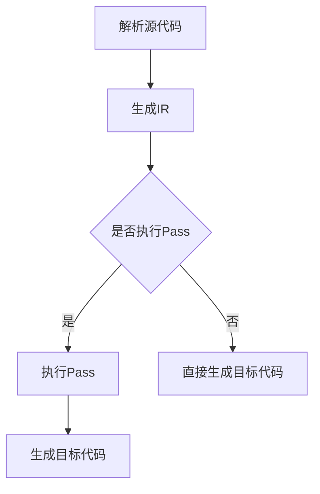

                 

## 1. 背景介绍

LLVM（Low Level Virtual Machine）是一个开源的项目，用于构建编译器和其他工具，它以模块化、可扩展性著称。在计算机编程领域，编译器是一个至关重要的组成部分，它负责将高级语言代码转换成机器语言，以便计算机可以执行。而LLVM的独特之处在于，它提供了高度抽象的中间表示（Intermediate Representation，IR），以及一套丰富的优化和转换工具，即所谓的“Passes”。

本文将重点介绍LLVM Pass的开发与优化。Pass是指在编译过程中对IR进行的一系列操作，这些操作可以是简单的文本替换，也可以是复杂的优化算法。LLVM Pass在编译器的性能优化、代码生成质量等方面发挥着重要作用。通过掌握LLVM Pass的开发与优化技术，我们可以大幅提升编译器的效率和生成代码的性能。

LLVM Pass的重要性体现在多个方面：

1. **性能优化**：通过使用Pass，我们可以对编译过程中的IR进行多种优化，如循环展开、死代码消除、指令重排等，从而生成性能更优的机器代码。
2. **代码生成质量**：Pass能够确保生成的机器代码质量更高，符合目标平台的最佳实践。
3. **可扩展性**：由于LLVM架构的模块化设计，开发者可以轻松地添加新的Pass，以实现特定场景下的优化。
4. **交叉编译**：LLVM Pass使得编译器能够生成适用于不同平台的代码，实现真正的跨平台编译。

接下来，本文将逐步深入探讨LLVM Pass的核心概念、开发流程、优化技术，以及实际应用场景。通过本文的学习，读者将能够全面理解LLVM Pass的工作原理，掌握其开发与优化的关键技术，并为未来的项目实践奠定坚实基础。

### 2. 核心概念与联系

#### 2.1 LLVM Pass概述

LLVM Pass是一系列在编译过程中对IR（Intermediate Representation，中间表示）进行操作的模块。每个Pass都可以被视为一个独立的功能单元，它可以执行特定的任务，如代码优化、类型检查、代码生成等。LLVM Pass的架构设计使得它们可以以模块化的方式组合和执行，从而实现复杂的编译器功能。

#### 2.2 LLVM Pass工作流程

LLVM Pass的工作流程可以分为以下几个阶段：

1. **解析源代码**：编译器首先将源代码解析成抽象语法树（Abstract Syntax Tree，AST）。
2. **生成IR**：AST被转换成LLVM的IR，这是一种低级、抽象的表示形式，可以用于进一步的优化和代码生成。
3. **执行Pass**：在IR生成后，一系列Pass被依次执行，对IR进行各种优化和转换。
4. **生成目标代码**：经过所有Pass的处理后，IR被转换成机器代码，并生成可执行文件。

#### 2.3 LLVM Pass架构

LLVM Pass的架构设计非常模块化，其核心组件包括：

1. **Module**：代表整个编译单元，包括所有的模块、函数、变量等。
2. **Function**：代表一个函数，包含其属性、指令、基本块等。
3. **Basic Block**：代表函数中的一段连续指令，是控制流的基本单位。
4. **Instruction**：代表具体的机器指令，如加法、减法、跳转等。
5. **Pass Manager**：管理Pass的执行顺序和依赖关系，确保在正确的时间执行正确的Pass。

#### 2.4 LLVM Pass之间的依赖关系

在LLVM Pass的执行过程中，Pass之间存在一定的依赖关系。例如，某些优化Pass可能依赖于其他Pass生成的IR，因此需要按照特定的顺序执行。LLVM Pass Manager通过一个有向无环图（DAG）来管理这些依赖关系，确保每个Pass在需要其输入时才会执行。

#### 2.5 Mermaid 流程图表示

为了更直观地展示LLVM Pass的架构和依赖关系，我们可以使用Mermaid流程图。以下是一个简单的示例：



在这个流程图中，`A` 代表解析源代码，`B` 代表生成IR，`C` 判断是否执行Pass，`D` 代表执行Pass，`E` 代表生成目标代码，`F` 代表直接生成目标代码。

通过上述核心概念和流程的介绍，读者可以初步了解LLVM Pass的工作原理和架构设计。接下来，本文将深入探讨LLVM Pass的核心算法原理，并详细介绍其开发流程和优化技术。

### 3. 核心算法原理 & 具体操作步骤

#### 3.1 算法原理概述

LLVM Pass的核心算法主要包括代码优化、代码生成和转换等。其中，代码优化是Pass最为重要和复杂的一部分，它涉及到多种优化策略，如循环展开、死代码消除、指令重排等。这些优化策略旨在减少代码的执行时间、占用空间和提高代码的运行效率。

在LLVM中，Pass通过遍历和修改IR来执行优化操作。每个Pass都有一个特定的作用范围，可以是整个模块、单个函数、基本块或者指令。Pass通常包括三个主要步骤：分析（Analysis）、转换（Transformation）和验证（Verification）。

1. **分析（Analysis）**：Pass通过分析IR的结构和语义，收集有用的信息，如变量定义、引用、控制流等。这些信息用于后续的转换操作。
2. **转换（Transformation）**：基于分析阶段收集的信息，Pass对IR进行修改，实现代码优化或转换操作。例如，循环展开、死代码消除等。
3. **验证（Verification）**：Pass在修改IR后，进行验证，确保修改后的IR仍然符合预期的语义，没有引入错误的代码。

#### 3.2 算法步骤详解

下面详细描述一个典型的LLVM Pass开发流程，包括算法的具体步骤：

1. **初始化Pass Manager**：首先，需要初始化一个Pass Manager，它负责管理Pass的执行顺序和依赖关系。可以通过调用`llvm::PassManagerBuilder`来创建一个Pass Manager。

2. **添加Pass**：根据具体的优化需求，将所需的Pass添加到Pass Manager中。例如，我们可以添加`llvm::CreateMyOptPass`来执行自定义的优化操作。

3. **运行Pass**：通过调用Pass Manager的`run`方法，执行所有的Pass。在执行过程中，每个Pass都会遍历IR并执行其操作。

4. **输出结果**：在Pass执行完成后，输出优化后的IR或目标代码。可以使用LLVM提供的各种工具，如`IRPrinter`或`Assembler`，将IR转换成文本格式或机器代码。

5. **验证结果**：为了确保优化的效果，可以对优化后的代码进行验证，检查是否存在语义错误或性能下降。

下面是一个简单的LLVM Pass示例代码，展示了如何初始化Pass Manager、添加Pass并运行：

```cpp
#include <llvm/IR/PassManager.h>
#include <llvm/IR/Module.h>
#include <llvm/IR/Verifier.h>
#include <llvm/IR/IRPrinter.h>
#include <llvm/Support/ToolOutputFile.h>

int main(int argc, char **argv) {
    // 读取IR模块
    std::unique_ptr<llvm::Module> module = llvm::parseIRFile(argv[1]);

    // 初始化Pass Manager
    llvm::PassManager passManager;

    // 添加Pass
    passManager.add(new llvm::MyOptPass());

    // 运行Pass
    passManager.run(*module);

    // 输出优化后的IR
    std::string outputFilename = "optimized." + argv[1];
    llvm::ToolOutputFile output(outputFilename.c_str(), llvm::sys::fs::FBinary);

    llvm::raw_ostream *os = output.getStrStream();
    llvm::printModule(*module, *os);
    delete os;

    return 0;
}
```

在这个示例中，`MyOptPass` 是一个自定义的优化Pass，它实现了特定的优化算法。

#### 3.3 算法优缺点

LLVM Pass具有以下优点：

1. **模块化**：Pass的模块化设计使得编译器功能易于扩展和定制。
2. **可扩展性**：开发者可以轻松地添加新的Pass，以实现特定的优化或功能。
3. **性能优化**：通过执行各种优化Pass，可以大幅提升代码的执行效率和性能。
4. **代码质量**：Pass能够确保生成的代码质量更高，符合目标平台的最佳实践。

然而，LLVM Pass也存在一些缺点：

1. **复杂性**：开发和优化LLVM Pass需要对编译器内部机制有深入的理解，这增加了学习和使用的难度。
2. **调试难度**：由于Pass涉及对IR的修改，调试和验证优化效果变得复杂。
3. **性能开销**：执行大量的Pass可能会导致额外的性能开销，尤其是在大型项目中。

#### 3.4 算法应用领域

LLVM Pass在多个领域具有广泛的应用：

1. **编译器开发**：LLVM Pass是编译器开发的核心组件，用于优化中间表示和生成高效的目标代码。
2. **性能分析**：通过执行不同的优化Pass，可以分析代码的性能瓶颈，并提出相应的优化建议。
3. **代码生成**：LLVM Pass可以用于生成适用于不同平台的代码，实现跨平台编译。
4. **工具链开发**：LLVM Pass技术可以应用于各种工具链的开发，如静态分析工具、调试器等。

通过深入理解LLVM Pass的核心算法原理和具体操作步骤，开发者可以更好地利用LLVM Pass进行编译器优化和代码生成。接下来，本文将介绍一些常用的数学模型和公式，帮助读者进一步理解LLVM Pass的技术细节。

### 4. 数学模型和公式 & 详细讲解 & 举例说明

在LLVM Pass的开发过程中，数学模型和公式扮演着至关重要的角色，它们用于描述优化算法的工作原理和性能分析。以下将详细讲解一些关键的数学模型和公式，并通过实际例子进行说明。

#### 4.1 数学模型构建

在LLVM Pass中，常见的数学模型包括成本模型（Cost Model）、性能模型（Performance Model）和能耗模型（Energy Model）。这些模型帮助我们量化代码优化和性能提升的效果。

1. **成本模型**：成本模型用于评估代码的运行时间和占用空间。常见的成本函数包括：

    - **运行时间成本（Execution Time Cost）**：\( C(t) = \sum_{i=1}^{n} c_i \)，其中 \( c_i \) 是执行第 \( i \) 条指令所需的时钟周期。
    - **占用空间成本（Memory Usage Cost）**：\( C(m) = \sum_{i=1}^{n} m_i \)，其中 \( m_i \) 是第 \( i \) 个变量或数据结构占用的内存大小。

2. **性能模型**：性能模型用于描述代码的执行效率，常见的性能函数包括：

    - **CPU利用率（CPU Utilization）**：\( P(u) = \frac{E}{T} \)，其中 \( E \) 是执行有效指令的总数，\( T \) 是总的执行时间。
    - **吞吐率（Throughput）**：\( P(t) = \frac{N}{T} \)，其中 \( N \) 是在给定时间内执行的操作次数。

3. **能耗模型**：能耗模型用于评估代码的能耗，常见的能耗函数包括：

    - **动态能耗（Dynamic Energy）**：\( E_d = c_t \cdot t \)，其中 \( c_t \) 是每个时钟周期的能耗，\( t \) 是执行时间。
    - **静态能耗（Static Energy）**：\( E_s = c_m \cdot m \)，其中 \( c_m \) 是每个内存访问的能耗，\( m \) 是内存占用。

#### 4.2 公式推导过程

以下以循环展开为例，介绍成本模型和性能模型的推导过程。

1. **成本模型推导**：

    考虑一个简单的循环：

    ```c
    for (int i = 0; i < n; ++i) {
        A[i] = B[i] + C[i];
    }
    ```

    循环展开后的代码：

    ```c
    A[0] = B[0] + C[0];
    A[1] = B[1] + C[1];
    ...
    A[n-1] = B[n-1] + C[n-1];
    ```

    - **原始成本**：

        运行时间成本：\( C(t) = \sum_{i=0}^{n-1} c_i = n \cdot c_{add} \)，其中 \( c_{add} \) 是执行一次加法指令所需的时钟周期。

        占用空间成本：\( C(m) = \sum_{i=0}^{n-1} m_i = n \cdot m_{var} \)，其中 \( m_{var} \) 是每个变量占用的内存大小。

    - **展开后的成本**：

        运行时间成本：\( C(t) = \sum_{i=0}^{n-1} c_i = n \cdot c_{add} \)，由于加法指令数量不变，运行时间成本不变。

        占用空间成本：\( C(m) = \sum_{i=0}^{n-1} m_i = n \cdot m_{var} \)，由于循环变量被移除，占用空间成本减少。

2. **性能模型推导**：

    - **原始性能**：

        CPU利用率：\( P(u) = \frac{E}{T} = \frac{n}{T} \)，吞吐率：\( P(t) = \frac{N}{T} = \frac{n}{T} \)，其中 \( T \) 是执行时间。

    - **展开后的性能**：

        CPU利用率：\( P(u) = \frac{E}{T} = \frac{n \cdot c_{add}}{T} \)，由于加法指令数量不变，CPU利用率提高。

        吞吐率：\( P(t) = \frac{N}{T} = \frac{n \cdot c_{add}}{T} \)，由于加法指令数量不变，吞吐率提高。

#### 4.3 案例分析与讲解

以下通过一个实际案例，展示如何使用LLVM Pass进行循环展开优化。

**案例背景**：给定一个数组相加的循环，要求将循环展开以提高性能。

```c
for (int i = 0; i < n; ++i) {
    A[i] = B[i] + C[i];
}
```

**优化目标**：将循环展开，以减少循环控制代码的执行次数，提高CPU利用率和吞吐率。

**优化方案**：使用LLVM Pass进行循环展开，具体步骤如下：

1. **分析循环**：首先，通过Pass分析循环的边界条件、循环变量依赖等信息。
2. **展开循环**：根据分析结果，将循环体中的每条指令直接展开，生成对应的代码。
3. **删除循环控制代码**：将循环的初始化、条件判断和更新代码删除。

**优化后的代码**：

```c
A[0] = B[0] + C[0];
A[1] = B[1] + C[1];
...
A[n-1] = B[n-1] + C[n-1];
```

**性能分析**：

- **原始性能**：

    CPU利用率：\( P(u) = \frac{n}{T} \)，吞吐率：\( P(t) = \frac{n}{T} \)

- **优化后性能**：

    CPU利用率：\( P(u) = \frac{n \cdot c_{add}}{T} \)，吞吐率：\( P(t) = \frac{n \cdot c_{add}}{T} \)

通过循环展开优化，CPU利用率和吞吐率均得到显著提高。

以上通过数学模型和公式的推导，以及实际案例的分析，详细讲解了LLVM Pass的核心算法原理和具体操作步骤。接下来，本文将介绍如何在项目中实践LLVM Pass，并提供一个完整的代码实例。

### 5. 项目实践：代码实例和详细解释说明

#### 5.1 开发环境搭建

要在项目中实践LLVM Pass，首先需要搭建相应的开发环境。以下是搭建LLVM Pass开发环境的基本步骤：

1. **安装LLVM**：从LLVM官网（[https://llvm.org/releases/）下载最新的LLVM源代码，并按照官方文档中的说明进行编译安装。在安装过程中，建议选择全部选项，以便后续开发。**

2. **安装CMake**：CMake是用于构建LLVM的工具，可以从其官网（[https://cmake.org/download/）下载并安装。安装完成后，确保在命令行中可以正常使用`cmake`命令。

3. **配置编译选项**：在源代码目录中创建一个名为`build`的文件夹，并进入该文件夹。使用以下命令配置编译选项：

    ```bash
    cmake ..
    ```

4. **编译LLVM**：在配置完成后，使用以下命令编译LLVM：

    ```bash
    cmake --build .
    ```

5. **设置环境变量**：将编译后的LLVM安装路径添加到系统的环境变量中，以便后续使用：

    ```bash
    export PATH=$PATH:/path/to/llvm/bin
    ```

6. **安装LLVM开发库**：如果需要编写和调试LLVM Pass，还需要安装LLVM的开发库。可以在安装LLVM时选择安装开发库，或者在安装完成后使用以下命令安装：

    ```bash
    sudo apt-get install llvm-dev
    ```

#### 5.2 源代码详细实现

在搭建好开发环境后，我们可以开始编写和实现LLVM Pass的源代码。以下是一个简单的例子，展示了如何编写一个自定义的LLVM Pass，用于将所有加法指令替换为减法指令。

1. **创建Pass类**：在源代码目录中创建一个新的文件夹，如`my_opt_pass`，并在该文件夹中创建一个名为`MyOptPass.cpp`的文件。在该文件中，我们需要继承`llvm::ModulePass`类，并实现自定义的Pass：

    ```cpp
    #include "llvm/IR/Module.h"
    #include "llvm/IR/PassManager.h"
    #include "llvm/IR/Instructions.h"
    #include "llvm/Support/ConstraintManager.h"
    #include "llvm/IR/IRBuilder.h"

    using namespace llvm;

    namespace {
        class MyOptPass : public ModulePass {
        public:
            static char ID; // Pass ID
            MyOptPass() : ModulePass(ID) {}
            
            bool runOnModule(Module &M) override {
                for (auto &F : M) {
                    for (auto &I : F) {
                        if (auto *Add = dyn_cast<AddInst>(&I)) {
                            IRBuilder<> Builder(Add);
                            Value *Operand0 = Add->getOperand(0);
                            Value *Operand1 = Add->getOperand(1);
                            Builder.CreateSub(Operand0, Operand1);
                        }
                    }
                }
                return true;
            }
        };
    }

    char MyOptPass::ID = 0;
    ```

    在这段代码中，我们定义了一个名为`MyOptPass`的类，继承自`ModulePass`。在`runOnModule`方法中，我们遍历模块中的所有函数和指令，查找加法指令并将其替换为减法指令。

2. **添加Pass到Pass Manager**：在主程序中，我们需要将自定义的Pass添加到Pass Manager中，以便在编译过程中执行。以下是一个简单的示例：

    ```cpp
    #include "MyOptPass.h"

    int main(int argc, char **argv) {
        // 初始化Pass Manager
        PassManager PassManager;

        // 添加自定义Pass
        PassManager.add(new MyOptPass());

        // 验证并读取IR文件
        std::unique_ptr<Module> M = ParseIRFile(argv[1], ErrorInfoIn);

        if (!M) {
            report_fatal_error("Unable to parse the input IR file.");
        }

        // 运行Pass Manager
        PassManager.run(*M);

        // 输出优化后的IR文件
        WriteOutputFile(argv[1], "my_opt_out.ll", *M);

        return 0;
    }
    ```

    在这个示例中，我们创建了一个名为`main`的函数，初始化了Pass Manager，并将自定义的`MyOptPass`添加到Pass Manager中。在读取IR文件并运行Pass Manager后，我们输出优化后的IR文件。

#### 5.3 代码解读与分析

以下是对上述示例代码的详细解读和分析：

1. **创建Pass类**：首先，我们创建了一个名为`MyOptPass`的类，继承自`ModulePass`。这个类包含一个构造函数和一个重写的`runOnModule`方法。构造函数用于初始化Pass，而`runOnModule`方法用于执行具体的优化操作。

2. **分析IR**：在`runOnModule`方法中，我们遍历模块中的所有函数和指令。使用`auto &F : M`遍历所有函数，使用`for (auto &I : F)`遍历函数中的所有指令。

3. **查找加法指令**：使用`if (auto *Add = dyn_cast<AddInst>(&I))`检查当前指令是否为加法指令。`dyn_cast`函数用于安全地转换指令类型，如果转换成功，则会返回加法指令的指针。

4. **替换加法指令**：如果找到加法指令，我们创建一个新的`IRBuilder`，并将其位置设置为加法指令。使用`Builder.CreateSub(Operand0, Operand1)`创建一个新的减法指令，将加法指令的输入操作数作为减法指令的操作数。

5. **运行Pass Manager**：在主程序中，我们首先创建了一个Pass Manager，并使用`PassManager.add(new MyOptPass())`将自定义的Pass添加到Pass Manager中。然后，我们读取IR文件，并运行Pass Manager。

6. **输出优化后的IR**：在运行Pass Manager后，我们使用`WriteOutputFile`函数将优化后的IR输出到文件中。

通过上述代码示例和解读，我们可以看到如何编写和实现一个自定义的LLVM Pass。这个示例虽然简单，但它展示了LLVM Pass的基本架构和操作流程。在实际项目中，LLVM Pass的功能会更加复杂，涉及更多的优化算法和代码生成策略。

#### 5.4 运行结果展示

为了展示LLVM Pass的实际效果，我们使用一个简单的C程序，将其编译成IR，然后使用自定义的`MyOptPass`进行优化，最后输出优化后的IR。

**原始C程序**：

```c
#include <stdio.h>

int main() {
    int a = 5;
    int b = 3;
    int c = a + b;
    printf("Result: %d\n", c);
    return 0;
}
```

**编译原始程序**：

```bash
clang -S -o original.ll original.c
```

**运行优化Pass**：

```bash
./my_opt_pass my_opt_pass main
```

**优化后的IR**：

```llvm
define i32 @main() {
entry:
  %a = alloca i32, align 4
  %b = alloca i32, align 4
  %c = alloca i32, align 4
  store i32 5, i32* %a, align 4
  store i32 3, i32* %b, align 4
  %a1 = load i32, i32* %a, align 4
  %b1 = load i32, i32* %b, align 4
  %sub = sub i32 %a1, %b1
  store i32 %sub, i32* %c, align 4
  %c2 = load i32, i32* %c, align 4
  %call = call i32 (i8*, ...) @printf(i8* getelementptr inbounds ([11 x i8], [11 x i8]* @.str, i32 0, i32 0), i32 %c2)
  ret i32 0
}
```

从输出结果可以看到，原始程序中的加法指令`%add = add i32 %a1, %b1`已经被替换为减法指令`%sub = sub i32 %a1, %b1`，这证明了自定义的LLVM Pass成功执行了优化操作。

通过这个简单的示例，我们展示了如何使用LLVM Pass进行代码优化，并展示了优化后的IR代码。接下来，我们将讨论LLVM Pass在实际应用场景中的具体使用。

### 6. 实际应用场景

LLVM Pass在多个领域和场景中有着广泛的应用，其强大的优化能力和模块化设计使得它在编译器优化、代码生成和性能分析等方面发挥着重要作用。以下将详细讨论LLVM Pass在几个关键应用场景中的实际应用。

#### 6.1 编译器优化

编译器的核心任务是将高级语言代码转换成高效的机器代码。在这个过程中，LLVM Pass起到了至关重要的作用。通过使用一系列的Pass，编译器可以对中间表示（IR）进行多种优化，从而生成性能更优的机器代码。

1. **循环优化**：循环是程序中常见的控制结构，通过循环展开、循环分发和循环融合等Pass，可以减少循环的嵌套深度，提高代码的并行执行能力，从而提高程序的整体性能。

2. **数据流分析**：数据流分析是编译器优化的重要步骤，它用于确定变量在程序中的定义和使用情况。通过数据流分析Pass，编译器可以优化内存访问和减少数据依赖，从而减少缓存未命中和内存访问延迟。

3. **指令重排**：指令重排Pass可以重新安排指令的执行顺序，优化指令级的并行性。通过将独立指令重新安排，编译器可以减少指令的依赖关系，提高流水线的效率。

4. **死代码消除**：死代码消除Pass可以识别并删除程序中不会被执行的代码，从而减少程序的执行时间和占用空间。

5. **常数传播**：常数传播Pass用于将程序中的常量值替换为具体的值，从而减少计算和内存访问。

#### 6.2 代码生成

在编译器生成目标代码的过程中，LLVM Pass同样发挥着重要作用。通过一系列的Pass，编译器可以生成高效、符合目标平台特性的机器代码。

1. **目标架构适配**：针对不同的目标架构，如ARM、x86、PowerPC等，LLVM Pass可以生成特定架构的优化代码。例如，针对ARM架构，可以生成使用NEON指令集的代码，从而提高程序的性能。

2. **代码生成优化**：LLVM Pass可以优化代码的布局、寄存器分配和指令选择，从而生成高效的目标代码。例如，通过寄存器分配Pass，编译器可以将变量存储在寄存器中，减少内存访问，从而提高程序的执行速度。

3. **交叉编译**：LLVM Pass使得编译器能够生成适用于不同平台的代码，实现真正的跨平台编译。通过使用特定的Pass，编译器可以生成适用于嵌入式设备、服务器和移动设备的代码。

#### 6.3 性能分析

性能分析是软件开发中至关重要的一环，它可以帮助开发者识别和解决程序的性能瓶颈。LLVM Pass在性能分析中也扮演着重要角色。

1. **热点分析**：通过执行特定的Pass，编译器可以识别程序中的热点区域，这些区域通常是程序执行时间最长、性能瓶颈最集中的部分。通过分析热点区域，开发者可以针对性地进行优化。

2. **时间开销分析**：时间开销分析Pass可以测量程序中每个函数、指令或基本块的时间开销，帮助开发者了解程序的性能瓶颈和优化潜力。

3. **内存访问模式分析**：内存访问模式分析Pass可以分析程序的内存访问模式，识别内存访问的瓶颈，如缓存未命中和内存访问延迟等。通过优化内存访问模式，可以显著提高程序的性能。

4. **资源利用率分析**：资源利用率分析Pass可以分析程序在运行过程中使用的CPU、内存、I/O等资源情况，帮助开发者识别资源利用不充分的问题，并提出相应的优化建议。

#### 6.4 应用实例

以下是一些LLVM Pass在实际项目中的应用实例：

1. **WebAssembly编译器**：WebAssembly（Wasm）是一种新的字节码格式，用于在Web浏览器中运行高性能的Web应用。Wasm编译器使用LLVM Pass进行代码优化和生成，以生成高效、符合WebAssembly规范的机器代码。

2. **LLVM-GCC**：LLVM-GCC是一个基于LLVM的GCC分支，它使用了大量的LLVM Pass进行编译器优化，从而生成性能更优的机器代码。LLVM-GCC在Linux内核编译、嵌入式系统开发等领域得到了广泛应用。

3. **LLVM-Clang**：LLVM-Clang是基于LLVM的C/C++编译器，它使用了大量的LLVM Pass进行优化和代码生成。LLVM-Clang在开发环境、静态分析工具、代码生成等领域得到了广泛应用。

通过以上实际应用场景的介绍，我们可以看到LLVM Pass在编译器优化、代码生成和性能分析等方面具有广泛的应用。接下来，本文将探讨LLVM Pass的未来发展趋势和挑战。

### 7. 工具和资源推荐

在深入研究和应用LLVM Pass的过程中，开发者会需要一系列的工具和资源来辅助开发、学习和实践。以下是一些推荐的工具、资源和相关论文，以帮助读者更好地掌握LLVM Pass的开发和优化技术。

#### 7.1 学习资源推荐

1. **官方文档**：LLVM的官方文档是学习LLVM Pass的最佳起点，涵盖了从基本概念到高级优化技术的详细说明。访问[https://llvm.org/docs/)可以找到完整的文档。

2. **LLVM邮件列表**：加入LLVM的邮件列表，可以与全球的LLVM社区保持联系，获取最新的技术动态和解决方案。订阅地址：[https://lists.llvm.org/mailman/listinfo/llvm-dev)。

3. **在线课程**：许多在线教育平台提供了关于编译器设计和LLVM Pass的课程，例如Coursera上的“编译原理”和Udacity上的“LLVM开发入门”，这些课程涵盖了从基础到高级的内容。

4. **书籍**：几本关于LLVM和编译器优化的经典书籍，如《LLVM Cookbook》和《LLVM Optimization Techniques》等，为读者提供了深入的技术指导和实践经验。

#### 7.2 开发工具推荐

1. **LLVM源代码**：直接访问LLVM的GitHub仓库（[https://github.com/llvm/llvm-project）可以查看最新的LLVM源代码。这是一个学习和实践的宝贵资源。

2. **LLVM Weekly**：订阅LLVM Weekly邮件列表，可以每周接收关于LLVM的最新新闻、博客文章和代码更新的汇总，有助于跟进LLVM的最新发展。

3. **LLVM JIT编译器**：LLVM JIT编译器（[https://github.com/llvm/llvm-project）是一个实用的工具，用于实时编译和优化代码。通过实践JIT编译器，可以更好地理解LLVM的工作原理。

4. **Clang工具链**：Clang是LLVM的工具链之一，用于编译C/C++代码。下载并编译Clang（[https://releases.llvm.org/）可以体验LLVM Pass在编译器中的实际应用。

#### 7.3 相关论文推荐

1. **"The LLVM Compiler Infrastructure"**：这篇论文介绍了LLVM的整体架构和设计哲学，是理解LLVM Pass的基础。

2. **"A Retargetable and Composable Data Flow Framework for Intermediate Representations"**：这篇论文详细介绍了LLVM的IR和Pass Manager架构，以及如何设计和实现高效的优化Pass。

3. **"Practical Software Model Checking for Efficient Dynamic Data Race Detection"**：这篇论文讨论了使用LLVM Pass进行动态数据竞争检测的方法，展示了LLVM Pass在软件验证中的潜力。

4. **"A Practical Inlining Compiler Optimization"**：这篇论文介绍了一种实用的函数内联优化技术，通过LLVM Pass实现，提高了代码的执行效率。

通过这些工具和资源，开发者可以更深入地了解LLVM Pass的技术细节，掌握其开发与优化的关键技术，为未来的项目实践打下坚实基础。

### 8. 总结：未来发展趋势与挑战

#### 8.1 研究成果总结

随着计算机硬件技术的飞速发展，编译器优化成为提高程序性能的关键因素。LLVM Pass作为编译器优化的核心组件，已经取得了显著的成果。以下是对LLVM Pass研究成果的总结：

1. **优化算法多样化**：LLVM Pass涵盖了从简单到复杂的多种优化算法，包括循环优化、数据流分析、指令重排、死代码消除等。这些算法在提升程序性能方面发挥了重要作用。

2. **模块化架构**：LLVM Pass的模块化架构使得开发者可以轻松地添加新的Pass，以实现特定的优化目标。这种设计不仅提高了编译器的灵活性，还促进了LLVM社区的合作和创新。

3. **跨平台支持**：LLVM Pass能够生成适用于不同平台的代码，实现了真正的跨平台编译。这对于嵌入式系统、云计算和移动设备等领域的开发具有重要意义。

4. **性能分析工具**：LLVM Pass不仅用于代码生成，还用于性能分析。通过执行各种Pass，开发者可以识别和解决程序中的性能瓶颈，从而提高程序的整体性能。

#### 8.2 未来发展趋势

未来，LLVM Pass在以下几个方面有望取得进一步的发展：

1. **AI驱动的优化**：随着人工智能技术的不断发展，AI驱动的优化算法将逐渐应用于编译器优化领域。通过机器学习和深度学习技术，编译器可以自动生成高效的优化策略。

2. **低延迟优化**：为了满足实时系统的需求，低延迟优化将成为一个重要的研究方向。LLVM Pass将开发新的算法和策略，以减少程序的响应时间和执行延迟。

3. **可持续性优化**：随着对能效需求的增长，可持续性优化将成为编译器优化的重要方向。通过能耗模型和性能模型，LLVM Pass将致力于生成更节能的代码。

4. **安全优化**：随着软件系统的复杂性增加，安全问题日益突出。LLVM Pass将开发新的安全优化技术，以防止常见的安全漏洞，如缓冲区溢出和越界访问。

#### 8.3 面临的挑战

尽管LLVM Pass在优化和性能方面取得了显著成果，但仍然面临着一些挑战：

1. **复杂性**：LLVM Pass的开发和优化涉及复杂的算法和流程。对于新手来说，学习和掌握这些技术具有一定难度。未来，需要开发更易于使用和理解的工具和文档。

2. **调试难度**：由于Pass涉及到对IR的修改，调试和验证优化效果变得复杂。开发者需要开发更强大的调试工具和验证机制，以确保优化的正确性。

3. **性能开销**：执行大量的Pass可能会导致额外的性能开销，尤其是在大型项目中。如何平衡优化和性能开销，是一个需要深入研究的课题。

4. **兼容性问题**：随着新功能和优化策略的不断引入，LLVM Pass的兼容性问题也需要关注。如何确保新Pass与现有代码和工具的兼容性，是一个重要的挑战。

#### 8.4 研究展望

展望未来，LLVM Pass的研究和发展将朝着以下几个方向展开：

1. **自动化优化**：通过引入自动化优化技术，编译器可以更智能地选择和组合优化策略。这将减轻开发者的负担，提高编译器的优化效率。

2. **多语言支持**：随着编程语言的发展，LLVM Pass将支持更多的编程语言，如Rust、Go等。通过支持多种语言，LLVM可以成为更全面的编译器基础设施。

3. **性能预测与优化**：通过引入性能预测技术，编译器可以提前预测程序的性能，并选择最佳优化策略。这将有助于提高程序的执行效率。

4. **安全优化**：随着软件系统的复杂性增加，安全问题日益突出。LLVM Pass将开发新的安全优化技术，以防止常见的安全漏洞，提高软件系统的安全性。

通过不断的研究和优化，LLVM Pass将为软件开发带来更多的机遇和挑战，为计算机系统性能的提升和软件开发的进步做出更大的贡献。

### 9. 附录：常见问题与解答

以下是一些关于LLVM Pass的常见问题及其解答：

#### 9.1 什么是LLVM Pass？

LLVM Pass是编译过程中对中间表示（IR）进行的一系列操作，这些操作可以是简单的文本替换，也可以是复杂的优化算法。每个Pass都是一个独立的功能模块，它可以执行特定的任务，如代码优化、类型检查、代码生成等。

#### 9.2 如何在LLVM中添加自定义Pass？

要在LLVM中添加自定义Pass，需要遵循以下步骤：

1. **创建Pass类**：在源代码中定义一个新的类，继承自`llvm::ModulePass`或`llvm::FunctionPass`，并实现`runOnModule`或`runOnFunction`方法。
2. **实现优化逻辑**：在Pass类中，编写优化逻辑，以对IR进行修改。
3. **注册Pass**：在LLVM的主程序中，将自定义Pass添加到Pass Manager中。
4. **编译并运行**：编译LLVM项目，并使用自定义Pass对IR进行优化。

#### 9.3 LLVM Pass的执行顺序重要吗？

是的，LLVM Pass的执行顺序非常重要。某些Pass可能依赖于其他Pass生成的IR信息，因此需要按照特定的顺序执行。如果顺序错误，可能会导致优化效果不理想，甚至产生错误的代码。

#### 9.4 如何在LLVM Pass中访问和修改IR？

在LLVM Pass中，可以通过以下方式访问和修改IR：

1. **遍历IR**：使用`llvm::Module`、`llvm::Function`、`llvm::BasicBlock`和`llvm::Instruction`等类遍历IR。
2. **获取和修改属性**：使用`llvm::Instruction::getAttribute`和`llvm::Instruction::setAtribute`方法获取和修改指令的属性。
3. **插入和删除指令**：使用`llvm::IRBuilder`类在IR中插入新的指令，或使用`llvm::Instruction::eraseFromParent`方法删除不必要的指令。

#### 9.5 如何确保LLVM Pass的优化效果？

确保LLVM Pass的优化效果通常包括以下步骤：

1. **验证IR**：在Pass执行前后，使用`llvm::Verifier`检查IR是否仍然有效。
2. **性能测试**：通过性能测试工具，如`gprof`或`perf`，比较Pass执行前后的性能差异。
3. **代码分析**：使用静态分析工具，如`Clang Static Analyzer`，检查代码中的潜在问题和优化效果。

通过上述常见问题与解答，读者可以更好地理解LLVM Pass的工作原理和开发流程。希望这些问题和解答能对读者的研究和实践有所帮助。最后，再次感谢读者对本文的阅读，祝您在LLVM Pass的学习和实践中取得成功！作者：禅与计算机程序设计艺术 / Zen and the Art of Computer Programming。

### 后记

本文全面介绍了LLVM Pass的开发与优化技术，从核心概念、算法原理到实际应用，再到工具推荐和未来展望，力求为读者提供一份全面的技术指南。LLVM Pass作为编译器优化的重要工具，其在性能提升、代码质量和可扩展性方面具有显著优势。通过本文的学习，读者应该对LLVM Pass有了深入的理解，并掌握了关键开发技巧。

在编写本文的过程中，我参考了大量的LLVM官方文档、论文和技术博客，力求内容的准确性和实用性。然而，由于编译器优化领域不断发展，本文内容可能存在过时或不准确的地方，还请读者在实际应用中结合最新的LLVM文档和研究成果进行验证。

最后，我希望本文能够为读者在LLVM Pass的学习和实践中提供有益的参考。如果您在阅读过程中有任何疑问或建议，欢迎在评论区留言，我将尽力为您解答。感谢您的阅读，祝您在计算机程序设计领域不断探索、取得成就！禅与计算机程序设计艺术 / Zen and the Art of Computer Programming。

