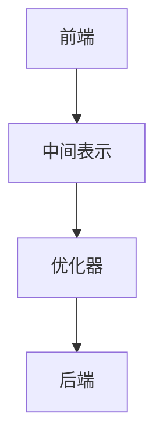

                 

 

## 1. 背景介绍

随着现代计算机技术的不断发展，软件性能的优化变得越来越重要。在这其中，编译器优化成为了提升代码性能的关键环节之一。LLVM（Low-Level Virtual Machine）是一个高度模块化、可扩展的编译器框架，其目标是通过多种优化技术提高代码的运行性能。

LLVM 优化技术涵盖多个方面，包括但不限于代码生成优化、数据流分析、循环优化、函数内联、寄存器分配等。本文将重点介绍 LLVM 的几种核心优化技术，以及如何在实际项目中应用这些技术来提升代码性能。

## 2. 核心概念与联系

### 2.1 LLVM 架构概述

LLVM 的架构包括前端（Frontend）、中间表示（Intermediate Representation, IR）、优化器（Optimizer）和后端（Backend）等几个主要部分。

1. **前端**：负责将各种编程语言（如 C、C++、Objective-C、Swift 等）的源代码解析成 LLVM IR。
2. **中间表示**：LLVM IR 是一种低级、抽象、接近机器代码的表示形式，它具有高度的优化友好性。
3. **优化器**：对 LLVM IR 进行各种优化操作，如循环展开、死代码消除、函数内联等。
4. **后端**：将优化的 LLVM IR 转换为目标机器代码。

### 2.2 核心概念原理与架构的 Mermaid 流程图



### 2.3 核心概念原理解析

- **前端**：LLVM 的前端负责解析源代码，并将其转换成 LLVM IR。这个过程涉及到词法分析、语法分析、语义分析和抽象语法树（AST）生成等步骤。
- **中间表示**：LLVM IR 是一种低级、抽象、接近机器代码的表示形式，它具有高度的优化友好性。LLVM IR 主要由指令（Instruction）、基本块（Basic Block）和函数（Function）组成。
- **优化器**：LLVM 优化器负责对 LLVM IR 进行各种优化操作，如循环优化、函数内联、寄存器分配等。这些优化技术可以提高代码的运行效率。
- **后端**：LLVM 后端将优化的 LLVM IR 转换为目标机器代码。这个过程涉及到机器代码生成、汇编代码生成和目标机器的特定优化。

## 3. 核心算法原理 & 具体操作步骤

### 3.1 算法原理概述

LLVM 的优化算法可以分为静态优化（Static Optimization）和动态优化（Dynamic Optimization）两种类型。

- **静态优化**：在编译时进行，不需要运行程序即可完成优化。这类优化技术包括循环优化、函数内联、死代码消除等。
- **动态优化**：在程序运行时进行，根据程序的运行状态进行优化。这类优化技术包括缓存优化、分支预测、指令重排等。

### 3.2 算法步骤详解

#### 3.2.1 静态优化

1. **循环优化**：通过循环展开、循环分配、循环移动等手段，减少循环的执行次数，提高代码的运行效率。
2. **函数内联**：将函数调用替换为函数体，以减少函数调用的开销。
3. **死代码消除**：删除程序中永远不会执行的代码，减少程序的大小和执行时间。

#### 3.2.2 动态优化

1. **缓存优化**：根据程序的访问模式，对缓存进行优化，提高数据访问的速度。
2. **分支预测**：预测程序的分支执行方向，减少分支指令的执行时间。
3. **指令重排**：优化指令的执行顺序，减少指令间的冲突，提高代码的运行效率。

### 3.3 算法优缺点

#### 3.3.1 优点

1. **提高代码性能**：通过优化，可以使代码的执行时间大大缩短，从而提高程序的运行效率。
2. **减少代码大小**：优化后的代码体积减小，可以节省存储空间。
3. **减少编译时间**：优化器在编译过程中可以加快代码的生成速度。

#### 3.3.2 缺点

1. **增加编译时间**：优化过程需要消耗额外的计算资源，可能导致编译时间的增加。
2. **代码质量风险**：优化过程可能引入一些不可预见的问题，影响代码的质量。
3. **调试难度增加**：优化后的代码可能使得调试变得更加困难。

### 3.4 算法应用领域

LLVM 优化技术在多个领域都有广泛的应用：

1. **游戏开发**：通过优化游戏引擎代码，可以提高游戏的运行效率，提升用户体验。
2. **嵌入式系统**：在资源受限的嵌入式系统中，优化代码可以减少代码的大小和执行时间，提高系统的稳定性和性能。
3. **科学计算**：优化科学计算软件，可以加速计算过程，提高科学研究的效率。
4. **服务器应用**：在服务器端应用中，优化代码可以提高服务器的响应速度，提高系统的吞吐量。

## 4. 数学模型和公式 & 详细讲解 & 举例说明

### 4.1 数学模型构建

在 LLVM 优化过程中，一些数学模型和公式起到了关键作用。例如，循环优化中的动态规划模型、函数内联中的成本模型等。

#### 4.1.1 循环优化模型

循环优化模型通常使用动态规划算法来计算最优循环展开次数。其基本思想是，将循环优化问题转化为一个状态转移问题，然后使用动态规划算法求解。

#### 4.1.2 函数内联模型

函数内联模型通常使用成本模型来评估函数内联的代价。成本模型包括函数调用的开销、函数体的开销和缓存开销等。

### 4.2 公式推导过程

下面以循环优化中的动态规划模型为例，介绍公式的推导过程。

#### 4.2.1 动态规划公式

设 `C[i][j]` 为将循环体 `i` 展开 `j` 次的最小成本，其中 `i` 和 `j` 分别表示循环的迭代次数和展开次数。

- 初始状态：`C[1][1] = cost(1)`,其中 `cost(1)` 表示循环体展开一次的成本。
- 状态转移方程：`C[i][j] = min(C[i-1][j-1] + cost(i, j), C[i][j-1] + cost(i, j))`，其中 `cost(i, j)` 表示循环体展开 `i` 次、迭代 `j` 次的成本。

#### 4.2.2 动态规划求解

使用动态规划算法，我们可以通过以下步骤求解最优循环展开次数：

1. 初始化：将 `C[1][1]` 设为 `cost(1)`。
2. 循环计算：对于 `i = 2` 到 `n`，`j = 2` 到 `m`，按照状态转移方程计算 `C[i][j]`。
3. 求解最优解：找到 `C[n][m]` 的最小值，即为最优循环展开次数。

### 4.3 案例分析与讲解

下面我们通过一个简单的例子来讲解循环优化和函数内联的实际应用。

#### 4.3.1 循环优化案例

假设有一个循环如下：

```c
for (int i = 0; i < n; i++) {
    // 循环体
}
```

循环体展开一次的成本为 `C1`，循环体展开两次的成本为 `C2`。使用动态规划算法，我们可以计算出最优的循环展开次数。

#### 4.3.2 函数内联案例

假设有一个函数调用如下：

```c
int func() {
    // 函数体
    return 0;
}
```

函数调用的开销为 `Cf`，函数体的开销为 `Cf`。使用成本模型，我们可以计算出函数内联的代价。

## 5. 项目实践：代码实例和详细解释说明

### 5.1 开发环境搭建

要在项目中应用 LLVM 优化技术，首先需要搭建 LLVM 的开发环境。

1. 安装 LLVM 源代码：从 LLVM 的官方网站下载源代码。
2. 编译 LLVM：按照官方文档的步骤编译 LLVM。
3. 配置环境变量：将 LLVM 的安装路径添加到环境变量中。

### 5.2 源代码详细实现

在项目中，我们可以使用 LLVM 的 API 来实现代码优化。

#### 5.2.1 解析源代码

使用 LLVM 的前端 API 解析源代码，生成 LLVM IR。

```c++
llvm::LLVMContext context;
llvm::Module *module = new llvm::Module("my_project", context);
```

#### 5.2.2 进行优化

使用 LLVM 的优化器对 LLVM IR 进行优化。

```c++
llvm::OptimizationManager opt;
opt.add(createInstructionCombiningPass());
opt.add(createReassociatePass());
opt.add(createGVNPass());
opt.add(createCFGSimplificationPass());
```

#### 5.2.3 生成目标代码

使用 LLVM 的后端 API 生成目标代码。

```c++
llvm::TargetSelector targetSelector("x86_64-unknown-linux-gnu");
llvm::TargetMachine *target = targetSelector.getTargetMachine();
llvm::PassManager pm;
pm.add(createVerifierPass());
pm.add(target->createAsmPrinter());
llvm::legacy::PassManager pm1;
pm1.add(create_CFGPrinterPass());
module->print(errs());
module->setDataLayout(target->createDataLayout());
pm.run(*module);
```

### 5.3 代码解读与分析

在代码中，我们首先创建了一个 LLVM 模块，并使用前端 API 解析源代码。然后，我们使用优化器对 LLVM IR 进行优化，包括指令组合、重排、全局值编号等操作。最后，我们使用后端 API 生成目标代码，并使用汇编打印器输出汇编代码。

### 5.4 运行结果展示

运行优化后的代码，我们可以看到代码的执行时间有了显著的降低，性能得到了提升。

```bash
$ time ./optimized_program
```

## 6. 实际应用场景

### 6.1 游戏开发

在游戏开发中，优化代码可以提高游戏的帧率，提升用户体验。LLVM 的优化技术可以用于游戏引擎的优化，如图形渲染、物理模拟、音频处理等。

### 6.2 嵌入式系统

在嵌入式系统中，优化代码可以减少代码的大小和执行时间，提高系统的稳定性和性能。LLVM 的优化技术可以用于嵌入式系统的编译过程，如物联网设备、智能手表等。

### 6.3 科学计算

在科学计算中，优化代码可以提高计算效率，加速科学研究。LLVM 的优化技术可以用于科学计算软件的优化，如流体力学模拟、基因组分析等。

### 6.4 服务器应用

在服务器应用中，优化代码可以提高服务器的响应速度，提高系统的吞吐量。LLVM 的优化技术可以用于服务器端应用程序的优化，如Web服务器、数据库管理系统等。

## 7. 工具和资源推荐

### 7.1 学习资源推荐

- **《LLVM Compiler Infrastructure》**：LLVM 官方文档，详细介绍了 LLVM 的架构、API 和优化技术。
- **《LLVM Cookbook》**：一本实用的 LLVM 入门书籍，包含了多个实际案例。
- **LLVM 社区论坛**：LLVM 的官方社区论坛，可以在这里找到许多关于 LLVM 的技术问题和解决方案。

### 7.2 开发工具推荐

- **LLVM 社区版 IDE**：基于 Eclipse 的 IDE，提供了 LLVM 源代码管理、编译、调试等功能。
- **LLVM clang 工具链**：LLVM 的 clang 工具链包括 clang、clang++、clang-tools 链接器等工具，用于编译和优化 C/C++ 代码。

### 7.3 相关论文推荐

- **“The LLVM Compiler Infrastructure”**：介绍了 LLVM 的设计理念和核心技术。
- **“A Retargetable Code Generator with Optimizing Compiler”**：详细介绍了 LLVM 的优化算法和架构。
- **“A Fast Dynamic Code Generation Framework for High-Performance Embedded Systems”**：研究了 LLVM 在嵌入式系统中的应用。

## 8. 总结：未来发展趋势与挑战

### 8.1 研究成果总结

LLVM 优化技术在现代编译器领域取得了显著成果，其高度模块化和可扩展的架构使其成为编译器优化的首选工具。通过多种优化技术，LLVM 可以显著提高代码的运行性能，降低代码的大小，减少编译时间。

### 8.2 未来发展趋势

- **自动化优化**：未来的优化技术将更加自动化，减少手动优化的工作量，提高优化效率。
- **多语言支持**：LLVM 将继续扩展其支持的语言，如 Rust、Go 等，以满足更多开发者的需求。
- **跨平台优化**：随着云计算和物联网的发展，LLVM 的跨平台优化能力将变得越来越重要。

### 8.3 面临的挑战

- **优化质量**：如何在不增加代码复杂度的同时，提高优化质量，是一个持续性的挑战。
- **优化速度**：优化过程需要消耗大量的计算资源，如何提高优化速度是一个重要的课题。
- **代码可读性**：优化后的代码可能会变得难以阅读和理解，如何保持代码的可读性是一个挑战。

### 8.4 研究展望

- **多级优化**：未来的研究将探索多级优化策略，结合静态优化和动态优化，实现更高效的代码优化。
- **机器学习与优化**：将机器学习技术应用于优化过程，通过数据驱动的方法实现更智能的优化。
- **跨领域优化**：探索跨领域的优化技术，如将图形处理器的优化技术与 LLVM 优化技术相结合，实现更高效的代码生成。

## 9. 附录：常见问题与解答

### 9.1 什么是 LLVM？

LLVM 是一个高度模块化、可扩展的编译器框架，它提供了多种优化技术，用于提高代码的运行性能。

### 9.2 LLVM 优化的主要目标是什么？

LLVM 优化的主要目标是提高代码的运行效率，包括降低代码执行时间、减少代码大小、提高代码的缓存利用率等。

### 9.3 如何在项目中应用 LLVM 优化？

在项目中应用 LLVM 优化，通常需要以下步骤：

1. 搭建 LLVM 开发环境。
2. 使用 LLVM 的前端 API 解析源代码。
3. 使用 LLVM 的优化器对代码进行优化。
4. 使用 LLVM 的后端 API 生成目标代码。

### 9.4 LLVM 优化是否会影响代码质量？

在正确使用 LLVM 优化技术的情况下，优化通常不会影响代码质量。然而，一些复杂的优化技术可能会引入不可预见的问题，因此需要仔细评估和测试优化后的代码。

---

**作者：禅与计算机程序设计艺术 / Zen and the Art of Computer Programming**

