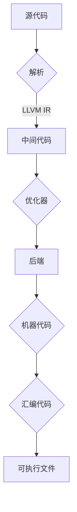

                 

 关键词：编译器、LLVM、Clang、前端、后端、中间代码、优化、性能

> 摘要：本文旨在深入探讨LLVM/Clang这一现代编译器基础设施的核心概念、架构设计以及在实际应用中的重要性。我们将详细解读其前端与后端的工作机制，剖析关键算法原理，并通过具体实例分析其在现代软件开发中的广泛运用和未来发展趋势。

## 1. 背景介绍

编译器，作为计算机科学中不可或缺的一部分，是连接源代码与机器代码的桥梁。在现代软件开发中，编译器的性能和功能直接影响到软件的开发效率和运行性能。LLVM（Low-Level Virtual Machine）是一个模块化、可扩展的编译器基础设施，由Chris Lattner等人于2000年左右开发。它以C++语言实现，提供了高度抽象的编译器架构，支持多种编程语言和目标平台。

Clang是LLVM的一部分，是一个基于LLVM的前端编译器。它支持多种编程语言，包括C、C++和Objective-C，并且具备强大的静态分析能力。Clang的出现，极大地提升了编译器的开发效率和代码质量。

本文将围绕LLVM/Clang的核心概念和架构设计展开，深入探讨其前端与后端的工作机制，以及在实际应用中的关键算法和数学模型。通过具体的代码实例和案例分析，我们将全面了解LLVM/Clang在现代编译器领域的地位和作用。

## 2. 核心概念与联系

### 2.1. 前端与后端的分工

编译器的工作流程大致可以分为前端和后端两个主要阶段。前端负责解析源代码，将其转换为中间代码（IR，Intermediate Representation），而后端则负责对中间代码进行优化和转换，最终生成目标平台上的机器代码。

### 2.2. 中间代码（IR）

中间代码是编译器工作流程中的一个重要概念。它是一种抽象的代码表示，独立于具体的编程语言和目标平台。LLVM采用了一种叫做LLVM IR的中间代码格式，它具有以下特点：

- **高度抽象**：LLVM IR不依赖于任何特定的编程语言或目标平台，因此可以在不同的编程语言和目标平台之间进行转换。
- **易于优化**：LLVM IR的抽象程度较高，使得编译器能够更容易地对其中的代码进行各种优化。
- **模块化**：LLVM IR支持模块化，可以方便地将其中的代码拆分成多个部分，便于管理和优化。

### 2.3. 优化器

优化器是编译器中的一个关键组件，负责对中间代码进行各种优化，以提高代码的执行效率和可维护性。LLVM/Clang的优化器体系结构非常灵活和模块化，支持多种优化策略，包括：

- **常量折叠**：将常量表达式在编译时计算为具体值。
- **死代码消除**：消除那些在程序运行过程中不会被执行的代码。
- **循环优化**：对循环结构进行各种优化，如循环展开、迭代移动等。
- **函数内联**：将调用函数的代码替换为被调用函数的实现。

### 2.4. 后端

后端负责将优化的中间代码转换为特定目标平台上的机器代码。LLVM支持多种目标平台，包括x86、ARM、MIPS等。后端的工作主要包括：

- **机器代码生成**：根据目标平台的指令集和汇编语法，将中间代码转换为机器代码。
- **汇编代码生成**：生成汇编代码，方便开发者进行调试和性能分析。
- **链接器**：将多个编译单元的机器代码和库文件链接在一起，生成可执行文件。

### 2.5. Mermaid 流程图

以下是LLVM/Clang前端与后端的Mermaid流程图：



## 3. 核心算法原理 & 具体操作步骤

### 3.1. 算法原理概述

LLVM/Clang的核心算法主要包括以下几个步骤：

1. **词法分析**：将源代码中的字符序列转换为标记序列。
2. **语法分析**：将标记序列转换为抽象语法树（AST）。
3. **语义分析**：对AST进行语义检查和类型推断。
4. **代码生成**：将AST转换为LLVM IR。
5. **优化器**：对LLVM IR进行各种优化。
6. **后端**：将优化的LLVM IR转换为特定目标平台上的机器代码。

### 3.2. 算法步骤详解

#### 3.2.1. 词法分析

词法分析是编译器的第一个阶段，主要负责将源代码中的字符序列转换为标记序列。具体操作步骤如下：

1. **字符流读取**：从源代码中逐个读取字符。
2. **标记生成**：根据字符的语义和语法规则，生成相应的标记。

#### 3.2.2. 语法分析

语法分析的主要任务是确定源代码的结构，将其转换为抽象语法树（AST）。具体操作步骤如下：

1. **语法规则定义**：定义源代码的语法规则，如词法规则、语句结构等。
2. **AST构建**：根据语法规则，将标记序列转换为AST。

#### 3.2.3. 语义分析

语义分析是编译器的一个重要阶段，主要负责检查AST的语义正确性，并进行类型推断。具体操作步骤如下：

1. **类型检查**：检查AST中的变量和表达式是否具有合法的类型。
2. **类型推断**：根据AST的结构和语义信息，推断变量和表达式的类型。

#### 3.2.4. 代码生成

代码生成阶段将AST转换为LLVM IR。具体操作步骤如下：

1. **IR构建**：根据AST的结构和语义信息，构建LLVM IR。
2. **函数调用**：处理函数调用，生成对应的LLVM IR指令。

#### 3.2.5. 优化器

优化器对LLVM IR进行各种优化，以提高代码的执行效率和可维护性。具体操作步骤如下：

1. **常量折叠**：将常量表达式在编译时计算为具体值。
2. **死代码消除**：消除那些在程序运行过程中不会被执行的代码。
3. **循环优化**：对循环结构进行各种优化，如循环展开、迭代移动等。
4. **函数内联**：将调用函数的代码替换为被调用函数的实现。

#### 3.2.6. 后端

后端将优化的LLVM IR转换为特定目标平台上的机器代码。具体操作步骤如下：

1. **机器代码生成**：根据目标平台的指令集和汇编语法，将LLVM IR转换为机器代码。
2. **汇编代码生成**：生成汇编代码，方便开发者进行调试和性能分析。
3. **链接器**：将多个编译单元的机器代码和库文件链接在一起，生成可执行文件。

### 3.3. 算法优缺点

LLVM/Clang的核心算法具有以下优缺点：

- **优点**：
  - **模块化**：LLVM/Clang的模块化设计使其易于扩展和维护。
  - **高度抽象**：LLVM IR的高度抽象使得编译器能够方便地进行各种优化。
  - **支持多种编程语言和目标平台**：LLVM/Clang支持多种编程语言和目标平台，具有较强的通用性。

- **缺点**：
  - **学习曲线较陡**：由于LLVM/Clang的模块化和复杂性，初学者可能需要较长的时间来学习和掌握。
  - **资源消耗较大**：LLVM/Clang的模块化和优化器体系结构可能需要较大的系统资源。

### 3.4. 算法应用领域

LLVM/Clang的核心算法在多个领域得到广泛应用，包括：

- **高性能计算**：LLVM/Clang能够对高性能计算程序进行优化，提高其执行效率。
- **嵌入式系统**：LLVM/Clang支持多种嵌入式系统平台，可用于开发嵌入式应用程序。
- **Web开发**：LLVM/Clang的静态分析能力使其在Web开发中具有广泛的应用前景。
- **自动化工具**：LLVM/Clang的模块化设计使其能够方便地构建自动化工具，如代码分析工具、静态检查工具等。

## 4. 数学模型和公式 & 详细讲解 & 举例说明

### 4.1. 数学模型构建

在编译器优化过程中，常用的数学模型包括：

1. **时间复杂度**：描述算法执行的时间开销。
2. **空间复杂度**：描述算法执行的空间开销。
3. **动态规划**：用于解决最优子结构问题。

### 4.2. 公式推导过程

以下是一个简单的动态规划公式推导示例：

**问题**：给定一个数组`A`，求最大子序列和。

**动态规划公式**：

$$
f(i) = \max(f(i-1) + A[i], A[i])
$$

**推导过程**：

1. **状态定义**：`f(i)`表示以`A[i]`为结尾的最大子序列和。
2. **状态转移方程**：根据最大子序列和的定义，`f(i)`可以分为两部分：`f(i-1) + A[i]`和`A[i]`。取两者中的最大值即为当前状态的最大子序列和。
3. **边界条件**：`f(0) = A[0]`，即第一个元素本身就是最大子序列和。

### 4.3. 案例分析与讲解

假设我们有以下数组：

```
A = [3, -2, 5, -1, 8]
```

使用动态规划公式求解最大子序列和：

1. **初始化**：
   ```
   f(0) = A[0] = 3
   ```
2. **状态转移**：
   ```
   f(1) = \max(f(0) + A[1], A[1]) = \max(3 - 2, -2) = 1
   f(2) = \max(f(1) + A[2], A[2]) = \max(1 + 5, 5) = 6
   f(3) = \max(f(2) + A[3], A[3]) = \max(6 - 1, -1) = 5
   f(4) = \max(f(3) + A[4], A[4]) = \max(5 + 8, 8) = 13
   ```
3. **结果**：
   ```
   最大子序列和为 13
   ```

## 5. 项目实践：代码实例和详细解释说明

### 5.1. 开发环境搭建

在开始编写LLVM/Clang的代码之前，我们需要搭建一个合适的开发环境。以下是搭建开发环境的基本步骤：

1. **安装LLVM**：从LLVM官网下载并安装LLVM。
2. **安装Clang**：安装Clang，可以使用LLVM自带的包管理器`llvm-config`进行安装。
3. **配置编译器**：将Clang的路径添加到系统的环境变量中，以便在命令行中直接使用。

### 5.2. 源代码详细实现

下面是一个简单的例子，展示了如何使用Clang编译器进行源代码编译和生成汇编代码：

```cpp
// example.cpp
#include <iostream>

int main() {
    std::cout << "Hello, World!" << std::endl;
    return 0;
}
```

使用Clang编译器编译上述代码：

```bash
clang -S -o example.s example.cpp
```

该命令将生成名为`example.s`的汇编代码文件。

### 5.3. 代码解读与分析

生成的汇编代码如下：

```asm
; example.s
    .file   "example.cpp"
    .section    .rodata
.LC0:
    .string "Hello, World!"
    .section    .text
    .global _main
    .type   _main, @function
_main:
    .LFB0:
    .cfi_startproc
    pushq   %rbp
    .cfi_def_cfa_offset 16
    .cfi_offset 6, -16
    movq    %rsp, %rbp
    .cfi_def_cfa_register 6
    movl    $0, %eax
    leave
    .cfi_restore 6
    ret
    .cfi_endproc
```

这段汇编代码展示了Clang编译器如何将C++源代码编译成机器代码的过程。具体分析如下：

- **段定义**：`.file`和`.section`指令定义了源文件和代码段。
- **字符串常量**：`.LC0`指令定义了字符串常量`"Hello, World!"`。
- **函数定义**：`_main`指令定义了`main`函数。
- **函数体**：汇编代码中的`pushq`、`movq`和`leave`指令分别实现了函数的压栈、变量分配和出栈操作。
- **返回值**：`ret`指令表示函数的返回。

### 5.4. 运行结果展示

使用以下命令运行编译后的可执行文件：

```bash
./example
```

输出结果为：

```
Hello, World!
```

这表明Clang编译器成功地将C++源代码编译并运行，展示了LLVM/Clang在实际应用中的强大功能。

## 6. 实际应用场景

### 6.1. 高性能计算

LLVM/Clang在高性能计算领域具有广泛应用。例如，在深度学习框架中，LLVM/Clang被用于编译和优化CUDA代码，从而提高GPU的计算效率。

### 6.2. 嵌入式系统

嵌入式系统对编译器的性能要求非常高。LLVM/Clang支持多种嵌入式系统平台，可以用于开发嵌入式应用程序，提高其运行效率和稳定性。

### 6.3. Web开发

LLVM/Clang的静态分析能力在Web开发中具有重要应用。例如，在Web前端优化中，LLVM/Clang可以用于分析JavaScript代码，进行优化和压缩，提高网页加载速度。

### 6.4. 未来应用展望

随着计算机硬件的发展，LLVM/Clang在未来有望在更多领域得到应用。例如，在量子计算领域，LLVM/Clang可以用于编译和优化量子计算程序，提高其执行效率。

## 7. 工具和资源推荐

### 7.1. 学习资源推荐

- **官方文档**：LLVM/Clang的官方文档是学习这两个工具的最佳资源，涵盖了从基本概念到高级特性的详细说明。
- **在线教程**：许多在线平台提供了关于LLVM/Clang的教程和课程，适合不同水平的读者。
- **技术博客**：一些技术博客和论坛中经常分享关于LLVM/Clang的实际经验和技巧。

### 7.2. 开发工具推荐

- **Visual Studio**：Visual Studio提供了对LLVM/Clang的集成支持，方便开发者进行编译和调试。
- **Eclipse**：Eclipse是一个开源集成开发环境，也支持LLVM/Clang，适合大型项目开发。
- **CLion**：CLion是一个专注于C/C++开发的IDE，内置了对LLVM/Clang的支持。

### 7.3. 相关论文推荐

- **"The LLVM Compiler Infrastructure"**：这是一篇介绍LLVM编译器架构的权威论文，全面阐述了LLVM的设计理念和实现细节。
- **"Clang: A C/C++ Compiler for the Linux Kernel"**：这篇论文介绍了Clang在Linux内核开发中的应用，展示了其在性能和稳定性方面的优势。
- **"Optimizing Compilers for the GPU"**：这篇论文探讨了如何在GPU上优化编译器，提高了深度学习等应用的执行效率。

## 8. 总结：未来发展趋势与挑战

### 8.1. 研究成果总结

LLVM/Clang作为现代编译器基础设施，已经在多个领域取得了显著的研究成果。其模块化、高度抽象的设计理念，使得编译器能够方便地进行扩展和优化。此外，LLVM/Clang的静态分析能力在软件质量保证和性能优化方面具有重要应用价值。

### 8.2. 未来发展趋势

随着计算机硬件的发展，编译器在性能优化和能效提升方面的需求日益增加。未来，LLVM/Clang有望在以下几个方面取得进展：

- **多核处理器优化**：针对多核处理器的特点，LLVM/Clang将加强并行优化和任务调度策略。
- **异构计算优化**：随着GPU和量子计算的发展，LLVM/Clang将加强对异构计算平台的优化支持。
- **自动化优化**：利用机器学习和人工智能技术，实现自动化优化，提高编译器的优化效果。

### 8.3. 面临的挑战

虽然LLVM/Clang取得了许多研究成果，但其在实际应用中仍面临一些挑战：

- **学习曲线**：LLVM/Clang的模块化和复杂性可能导致学习曲线较陡，需要开发者具备一定的编程基础和编译器知识。
- **性能优化**：随着硬件的发展，编译器的性能优化需求不断提高，如何高效地进行优化成为一大挑战。
- **生态支持**：尽管LLVM/Clang已经成为许多开源项目的基础，但其在商业应用中的生态支持仍有待加强。

### 8.4. 研究展望

未来，LLVM/Clang的研究将朝着以下方向发展：

- **模块化设计**：进一步优化LLVM/Clang的模块化设计，提高其可扩展性和可维护性。
- **性能优化**：探索新型优化算法和策略，提高编译器的性能优化效果。
- **跨平台支持**：加强对多种编程语言和目标平台的优化支持，提高编译器的通用性。

## 9. 附录：常见问题与解答

### 9.1. 如何安装LLVM/Clang？

- **Linux**：在大多数Linux发行版中，可以通过包管理器安装LLVM/Clang。例如，在Ubuntu系统中，可以使用以下命令：

  ```bash
  sudo apt-get install llvm clang
  ```

- **Windows**：可以从LLVM官网下载预编译的二进制包，或者使用Visual Studio进行安装。

### 9.2. 如何使用Clang进行编译和优化？

- **编译**：使用`clang`命令进行编译，例如：

  ```bash
  clang -o program program.c
  ```

- **优化**：可以使用`-O`选项指定优化级别，例如：

  ```bash
  clang -O2 -o program program.c
  ```

### 9.3. 如何生成汇编代码？

- 使用`-S`选项将源代码编译成汇编代码，例如：

  ```bash
  clang -S -o program.s program.c
  ```

  生成的汇编代码将存储在名为`program.s`的文件中。

### 9.4. 如何进行静态分析？

- Clang提供了一系列静态分析工具，如`clang-tidy`和`scan-build`。例如，使用`scan-build`进行静态分析：

  ```bash
  scan-build --use-latest-pch clang -c program.c
  ```

  这将生成静态分析报告，帮助开发者发现潜在的问题。 

---

作者：禅与计算机程序设计艺术 / Zen and the Art of Computer Programming

