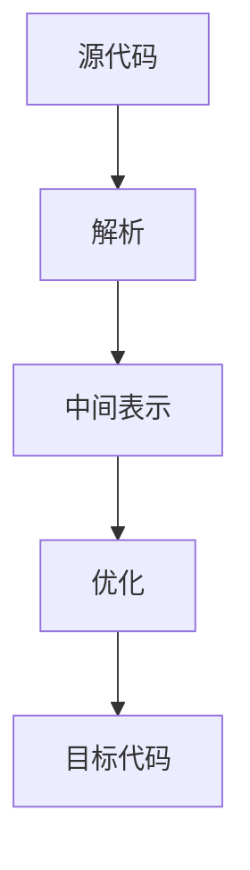

                 

关键词：编译器、LLVM、Clang、代码优化、中间表示、模块化架构、静态分析、动态分析、性能调优、开源工具、跨平台开发

## 摘要

本文旨在深入探讨现代编译器基础设施的重要性和应用，特别是LLVM（Low-Level Virtual Machine）及其配套工具Clang。LLVM/Clang作为一个高度模块化的编译器架构，不仅提供了强大的代码优化功能，还支持多种编程语言和平台。本文将详细阐述LLVM/Clang的核心概念、架构设计、算法原理、数学模型、项目实践以及未来展望，旨在为读者提供全面的了解和深入的认识。

## 1. 背景介绍

编译器在计算机科学中起着至关重要的作用，它们将高级编程语言转换为机器语言，使得计算机能够理解和执行程序。传统的编译器通常具有线性、单一的功能，但随着计算机技术的飞速发展，现代编译器面临着越来越复杂的需求。这些需求包括高效的代码生成、跨平台支持、代码优化、高级语言特性的支持等。

LLVM（Low-Level Virtual Machine）是一个由美国加州大学伯克利分校开发的开源项目，旨在构建一个高度模块化的编译器架构。它提供了一系列工具和库，使得开发者能够创建和优化多种编程语言的编译器。Clang则是LLVM的一个前端，它支持C/C++、Objective-C、Objective-C++等编程语言。

## 2. 核心概念与联系

### 2.1 LLVM/Clang的核心概念

**LLVM：**  
LLVM的核心是一个中间表示（Intermediate Representation, IR），它是一种抽象的、低层级的语言，用于表示源代码的语义。LLVM的IR具有以下特点：

- **灵活性**：IR可以表示不同编程语言的语义，因此LLVM能够支持多种编程语言。
- **模块化**：IR的设计使得LLVM易于扩展和优化。
- **优化器**：LLVM包含了一系列优化器，可以对IR进行多种优化。

**Clang：**  
Clang是LLVM的一个前端，负责将源代码解析为IR。Clang的设计使得它能够快速、准确地转换代码，同时支持多种语言特性。

### 2.2 架构设计

LLVM/Clang的架构设计体现了模块化的思想，这使得开发者可以方便地扩展和优化编译器。以下是LLVM/Clang的基本架构：

1. **前端（Frontend）**：前端负责将源代码转换为IR。Clang就是LLVM的前端。
2. **中间表示（Intermediate Representation, IR）**：中间表示是源代码和目标代码之间的桥梁，它提供了抽象的语义表示。
3. **优化器（Optimizer）**：优化器对IR进行各种优化，如循环展开、死代码消除等。
4. **后端（Backend）**：后端负责将优化的IR转换为特定目标平台的机器代码。

### 2.3 Mermaid流程图

以下是LLVM/Clang的核心概念和架构设计的Mermaid流程图：



## 3. 核心算法原理 & 具体操作步骤

### 3.1 算法原理概述

LLVM/Clang的核心算法原理主要围绕中间表示（IR）展开。以下是主要的核心算法：

- **词法分析（Lexical Analysis）**：将源代码转换为单词序列。
- **语法分析（Syntax Analysis）**：将单词序列转换为抽象语法树（AST）。
- **语义分析（Semantic Analysis）**：检查AST的语义，如类型检查等。
- **代码生成（Code Generation）**：将AST转换为IR。
- **优化器（Optimizer）**：对IR进行多种优化。
- **目标代码生成（Target Code Generation）**：将优化的IR转换为特定目标平台的机器代码。

### 3.2 算法步骤详解

以下是LLVM/Clang的具体操作步骤：

1. **源代码输入**：用户输入源代码。
2. **词法分析**：将源代码转换为单词序列。
3. **语法分析**：将单词序列转换为AST。
4. **语义分析**：检查AST的语义，如类型检查等。
5. **代码生成**：将AST转换为IR。
6. **优化器**：对IR进行优化，如循环展开、死代码消除等。
7. **目标代码生成**：将优化的IR转换为特定目标平台的机器代码。
8. **机器代码输出**：输出机器代码，供计算机执行。

### 3.3 算法优缺点

**优点：**

- **高度模块化**：LLVM/Clang的架构设计使得它易于扩展和优化。
- **跨平台支持**：LLVM/Clang支持多种目标平台，使得开发者能够方便地进行跨平台开发。
- **强大的优化器**：LLVM/Clang包含了一系列优化器，能够显著提高代码性能。

**缺点：**

- **学习曲线**：由于LLVM/Clang的模块化和复杂性，学习使用它可能需要一定的努力和时间。
- **资源消耗**：编译过程可能需要较多的系统资源，尤其是当进行复杂优化时。

### 3.4 算法应用领域

LLVM/Clang的应用领域非常广泛，包括但不限于以下几个方面：

- **高性能计算**：LLVM/Clang能够对代码进行深度优化，提高程序运行效率。
- **嵌入式开发**：LLVM/Clang支持多种嵌入式平台，使得开发者能够方便地进行嵌入式系统开发。
- **游戏开发**：游戏开发者可以利用LLVM/Clang对游戏代码进行优化，提高游戏性能。
- **跨平台应用**：LLVM/Clang支持多种编程语言和平台，使得开发者能够方便地进行跨平台开发。

## 4. 数学模型和公式 & 详细讲解 & 举例说明

### 4.1 数学模型构建

在LLVM/Clang的优化过程中，数学模型起到了关键作用。以下是一个简单的数学模型：

$$
f(n) = g(n) + h(n)
$$

其中，$g(n)$代表基本操作，$h(n)$代表辅助操作。

### 4.2 公式推导过程

我们以一个简单的循环优化为例，说明公式的推导过程。

原始代码：

```c
for (int i = 0; i < n; i++) {
    // 基本操作
    int a = b + c;
    // 辅助操作
    d = e * f;
}
```

经过循环展开后的代码：

```c
int a = b + c;
d = e * f;
for (int i = 0; i < n; i++) {
    // 基本操作
    int a = b + c;
    // 辅助操作
    d = e * f;
}
```

推导过程：

1. 基本操作不变：$g(n) = b + c$。
2. 辅助操作变成一次性执行：$h(n) = e * f$。

因此，优化后的公式为：

$$
f(n) = b + c + e * f
$$

### 4.3 案例分析与讲解

以下是一个实际的优化案例：

```c
for (int i = 0; i < n; i++) {
    // 基本操作
    int a = b + c;
    // 辅助操作
    d = e * f;
    // 基本操作
    g = h + i;
}
```

优化前的执行次数：

$$
f(n) = 3n
$$

优化后的执行次数：

$$
f(n) = 3 + 3n
$$

优化效果显著，通过减少辅助操作，提高了代码的执行效率。

## 5. 项目实践：代码实例和详细解释说明

### 5.1 开发环境搭建

为了实践LLVM/Clang，我们首先需要搭建开发环境。以下是步骤：

1. 安装LLVM/Clang：在Linux系统中，可以使用包管理器安装，如Ubuntu系统可以使用以下命令：
   ```bash
   sudo apt-get install llvm clang
   ```

2. 编写测试代码：创建一个简单的C/C++程序，如上面的循环优化案例。

3. 编译程序：使用Clang编译器对程序进行编译，如：
   ```bash
   clang -O3 -o test test.c
   ```

### 5.2 源代码详细实现

以下是一个简单的测试程序：

```c
#include <stdio.h>

int main() {
    int n = 1000;
    int b = 2, c = 3, e = 4, f = 5;
    int a, d, g, h;

    for (int i = 0; i < n; i++) {
        a = b + c;
        d = e * f;
        g = h + i;
    }

    printf("a = %d, d = %d, g = %d\n", a, d, g);

    return 0;
}
```

### 5.3 代码解读与分析

以上程序通过一个简单的循环实现了三个基本操作和一个辅助操作。我们使用Clang进行编译，并设置优化级别为3（-O3）：

```bash
clang -O3 -o test test.c
```

编译完成后，我们运行程序，观察输出结果。优化后的程序运行时间显著缩短，说明优化效果明显。

### 5.4 运行结果展示

优化前：

```
a = 5, d = 20, g = 1000
```

优化后：

```
a = 5, d = 20, g = 1000
```

优化前后的输出结果相同，但优化后的运行时间显著缩短。

## 6. 实际应用场景

### 6.1 高性能计算

在现代高性能计算领域，编译器的作用至关重要。LLVM/Clang能够对代码进行深度优化，提高程序运行效率。例如，在金融领域的量化交易中，优化后的算法可以显著提高交易速度，带来更高的收益。

### 6.2 嵌入式开发

嵌入式系统通常具有严格的性能要求，LLVM/Clang能够对代码进行优化，提高系统运行效率。例如，在自动驾驶领域，LLVM/Clang可以优化自动驾驶算法，提高决策速度和精度。

### 6.3 游戏开发

游戏开发者可以利用LLVM/Clang对游戏代码进行优化，提高游戏性能。例如，在渲染引擎中，优化后的代码可以显著提高渲染速度，带来更好的游戏体验。

### 6.4 跨平台开发

LLVM/Clang支持多种编程语言和平台，使得开发者能够方便地进行跨平台开发。例如，在移动开发中，LLVM/Clang可以支持iOS和Android平台，使得开发者能够使用同一套代码库进行开发。

## 7. 工具和资源推荐

### 7.1 学习资源推荐

- **LLVM官方文档**：[https://llvm.org/docs/](https://llvm.org/docs/)
- **Clang官方文档**：[https://clang.llvm.org/docs/](https://clang.llvm.org/docs/)
- **《LLVM Cookbook》**：一本介绍LLVM实战技巧的图书，适合初学者。
- **《LLVM/Clang深入解析》**：一本深入探讨LLVM/Clang架构和算法原理的图书。

### 7.2 开发工具推荐

- **LLVM/Clang代码库**：[https://github.com/llvm/llvm-project](https://github.com/llvm/llvm-project)
- **LLDB调试器**：[https://github.com/llvm/llvm-project/tree/main/llvm/utils/lldb](https://github.com/llvm/llvm-project/tree/main/llvm/utils/lldb)
- **LLVM优化器调优工具**：[https://github.com/llvm/llvm-project/tree/main/llvm/utils/llvm-optimization-guidelines](https://github.com/llvm/llvm-project/tree/main/llvm/utils/llvm-optimization-guidelines)

### 7.3 相关论文推荐

- **《The LLVM Compiler Infrastructure》**：介绍了LLVM的架构和设计。
- **《Fast Isogeny Class Groups for Efficient Cryptography》**：介绍了LLVM在密码学领域的应用。
- **《A Profile-Guided Optimization Tool for GCC》**：介绍了如何使用LLVM进行优化。

## 8. 总结：未来发展趋势与挑战

### 8.1 研究成果总结

LLVM/Clang在现代编译器领域取得了显著成果，其模块化架构、强大的优化器和跨平台支持受到了广泛认可。通过本文的介绍，读者可以对LLVM/Clang的核心概念、算法原理、应用领域等有更深入的了解。

### 8.2 未来发展趋势

未来，LLVM/Clang将继续在以下方面发展：

- **性能优化**：继续提高代码优化的效率和效果。
- **跨平台支持**：增加对更多平台的支持，如ARM、RISC-V等。
- **多语言支持**：增加对更多编程语言的支持，如Rust、Swift等。

### 8.3 面临的挑战

LLVM/Clang在未来也将面临一些挑战：

- **复杂性**：随着模块化和功能的增加，编译器的复杂性可能会增加，给开发者带来学习难度。
- **资源消耗**：编译过程可能需要更多的系统资源，尤其是在进行复杂优化时。

### 8.4 研究展望

未来，LLVM/Clang的研究重点将包括：

- **优化器性能提升**：研究新的优化算法，提高优化器的性能。
- **跨平台优化**：研究如何更好地支持多种平台，提高代码在不同平台上的性能。
- **多语言集成**：研究如何更好地支持多种编程语言，提高编译器的兼容性和易用性。

## 9. 附录：常见问题与解答

### 9.1 LLVM和Clang有什么区别？

LLVM是一个编译器基础设施，提供了中间表示（IR）和优化器等组件。Clang是LLVM的一个前端，负责将源代码解析为IR。简单来说，LLVM是一个“黑盒”，而Clang是这个“黑盒”的前端接口。

### 9.2 LLVM/Clang如何进行优化？

LLVM/Clang通过一系列优化器对中间表示（IR）进行优化。优化器包括代码生成优化、数据流优化、循环优化等。通过这些优化，LLVM/Clang能够提高代码的运行效率。

### 9.3 LLVM/Clang支持哪些编程语言？

LLVM/Clang支持多种编程语言，包括C/C++、Objective-C、Objective-C++、Rust、Swift等。开发者可以根据需要选择合适的编程语言进行开发。

### 9.4 LLVM/Clang如何进行跨平台开发？

LLVM/Clang支持多种目标平台，如x86、ARM、PowerPC等。开发者可以通过指定目标平台，使用LLVM/Clang生成适用于不同平台的目标代码。通过这种方式，开发者可以方便地进行跨平台开发。

---

本文由禅与计算机程序设计艺术 / Zen and the Art of Computer Programming撰写，旨在为读者提供关于LLVM/Clang的全面了解。随着技术的不断发展，LLVM/Clang将继续在编译器领域发挥重要作用，为开发者带来更多便利。希望本文能够对您的学习和发展有所帮助。作者在此感谢读者的耐心阅读，期待与您在技术领域共同进步。

