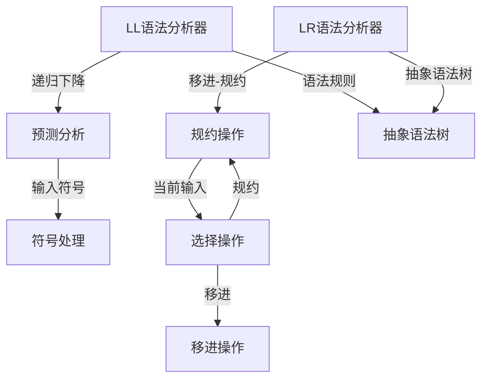

                 

关键词：LL语法分析器，LR语法分析器，自动文法分析，编译原理，语法分析器生成器，编译技术

## 摘要

本文深入探讨了LL和LR语法分析器生成器的原理、实现及应用。通过对比这两种分析器的特点，详细解析了其工作流程和具体实现步骤，同时给出了数学模型和公式的推导。文章还将通过实际代码实例展示语法分析器生成器的应用，并讨论其在实际开发中的使用场景及未来发展的可能性。

## 1. 背景介绍

在编译原理领域，语法分析是编译过程的关键步骤之一。其目的是将输入的源代码转换成抽象语法树（AST），以便后续的语义分析和代码生成。语法分析可以分为两大类：自顶向下分析和自底向上分析。LL和LR语法分析器是这两种分析方法的具体实现，它们在编译器设计和语言处理中起着至关重要的作用。

### 1.1 自顶向下分析（LL）

自顶向下分析（LL）是一种自上而下的语法分析方法，其基本思想是从源代码的顶部开始，逐步向下推导，直到生成抽象语法树。LL分析器通常使用递归下降分析法和预测分析算法实现。

### 1.2 自底向上分析（LR）

自底向上分析（LR）是一种自下而上的语法分析方法，它从源代码的底部开始，逐步向上构造抽象语法树。LR分析器使用规约（reduce）和移进（shift）操作来实现语法分析。

### 1.3 LL与LR分析器的比较

LL和LR分析器各有优缺点：

- **LL分析器**：
  - 易于实现，便于理解。
  - 但处理复杂语言时可能会遇到文法冲突问题，导致分析失败。

- **LR分析器**：
  - 能处理更复杂的语言，但实现相对复杂。
  - 可以解决LL分析器中的文法冲突问题。

本文将重点介绍LL和LR语法分析器生成器的原理和应用，帮助读者深入了解编译原理和语言处理技术。

## 2. 核心概念与联系

### 2.1 LL语法分析器原理

LL语法分析器基于递归下降分析法和预测分析算法。其核心思想是通过递归调用语法规则，从输入的源代码中预测下一个语法符号，并对其进行处理。

### 2.2 LR语法分析器原理

LR语法分析器基于移进-规约（shift-reduce）算法。其核心思想是利用一个栈来存储已处理的语法符号，并根据当前输入符号和栈顶符号选择移进或规约操作，以逐步构造抽象语法树。

### 2.3 Mermaid 流程图

以下是LL和LR语法分析器原理的Mermaid流程图：



## 3. 核心算法原理 & 具体操作步骤

### 3.1 算法原理概述

LL语法分析器和LR语法分析器的工作原理各有不同，但都是通过分析输入的源代码，将其转换为抽象语法树。LL语法分析器基于递归下降和预测分析，而LR语法分析器则基于移进-规约算法。

### 3.2 算法步骤详解

#### 3.2.1 LL语法分析器

1. **初始化**：读取输入的源代码，初始化符号栈和符号表。
2. **预测分析**：从源代码顶部开始，逐个读取符号，并根据当前状态和符号表预测下一个语法符号。
3. **处理符号**：根据预测的符号，进行相应的语法处理，例如创建AST节点。
4. **递归下降**：如果当前状态能够匹配语法规则，则递归调用语法规则进行进一步分析。
5. **结束分析**：当输入的源代码分析完毕，且符号栈为空时，结束语法分析。

#### 3.2.2 LR语法分析器

1. **初始化**：读取输入的源代码，初始化栈和符号表。
2. **状态转换**：根据当前输入符号和栈顶符号，选择下一个状态。
3. **移进操作**：将当前输入符号移入栈中，并更新当前状态。
4. **规约操作**：当当前状态满足某个语法规则时，将栈顶符号序列规约为该语法规则。
5. **结束分析**：当输入的源代码分析完毕，且栈为空时，结束语法分析。

### 3.3 算法优缺点

#### LL语法分析器

- 优点：实现简单，易于理解。
- 缺点：处理复杂语言时可能会遇到文法冲突问题。

#### LR语法分析器

- 优点：能处理更复杂的语言，可以解决LL分析器中的文法冲突问题。
- 缺点：实现相对复杂，需要更多的时间和计算资源。

### 3.4 算法应用领域

LL和LR语法分析器广泛应用于编译器设计和语言处理。例如，在C语言编译器中，使用LL语法分析器进行初步的语法分析，而在Java语言编译器中，则使用LR语法分析器进行更复杂的语法分析。

## 4. 数学模型和公式 & 详细讲解 & 举例说明

### 4.1 数学模型构建

LL和LR语法分析器的数学模型主要包括状态转换函数、移进函数和规约函数。

#### 4.1.1 状态转换函数

状态转换函数描述了在当前状态下，根据输入符号和栈顶符号选择下一个状态的过程。其公式如下：

$$
\delta(Q, X) = \text{next_state}
$$

其中，$Q$表示当前状态，$X$表示输入符号，$\text{next_state}$表示下一个状态。

#### 4.1.2 移进函数

移进函数描述了在当前状态下，将输入符号移入栈中的过程。其公式如下：

$$
\gamma(Q, X) = \text{shift_state}
$$

其中，$Q$表示当前状态，$X$表示输入符号，$\text{shift_state}$表示下一个状态。

#### 4.1.3 规约函数

规约函数描述了在当前状态下，将栈顶符号序列规约为某个语法规则的过程。其公式如下：

$$
\beta(Q, \sigma) = \text{reduce_rule}
$$

其中，$Q$表示当前状态，$\sigma$表示栈顶符号序列，$\text{reduce_rule}$表示规约的语法规则。

### 4.2 公式推导过程

以LL语法分析器为例，推导状态转换函数、移进函数和规约函数的公式。

#### 4.2.1 状态转换函数

根据LL语法分析器的预测分析算法，状态转换函数的推导过程如下：

1. 初始化状态集合$Q$和输入符号集合$\Sigma$。
2. 对于每个语法规则$A \rightarrow \alpha$，创建一个状态$S_A$，其中$\alpha$是语法规则的右部。
3. 对于每个状态$S_A$和输入符号$x$，计算$\delta(S_A, x)$，如果存在使得$A \rightarrow \alpha$能够被推导出$x$，则$\delta(S_A, x) = S_{\alpha}$。

#### 4.2.2 移进函数

根据LL语法分析器的预测分析算法，移进函数的推导过程如下：

1. 初始化状态集合$Q$和输入符号集合$\Sigma$。
2. 对于每个状态$S_A$和输入符号$x$，如果$x$是$\alpha$中的最后一个符号，则$\gamma(S_A, x) = S_{\alpha}$。

#### 4.2.3 规约函数

根据LL语法分析器的预测分析算法，规约函数的推导过程如下：

1. 初始化状态集合$Q$和输入符号集合$\Sigma$。
2. 对于每个状态$S_A$和栈顶符号序列$\sigma$，如果$\sigma$是某个语法规则的右部，则$\beta(S_A, \sigma) = \text{reduce\_rule}$。

### 4.3 案例分析与讲解

以一个简单的四则运算表达式为例，说明LL语法分析器的具体应用。

#### 4.3.1 文法规则

$$
\begin{aligned}
E &\rightarrow E + T \mid T \\
T &\rightarrow T * F \mid F \\
F &\rightarrow (E) \mid num
\end{aligned}
$$

#### 4.3.2 LL(1) 预测分析表

| 状态 | + | * | ( | ) | num |  
| --- | --- | --- | --- | --- |  
| 0 | - | - | r0 | r0 |  
| 1 | a1 | - | - | a2 |  
| 2 | - | a3 | - | a4 |  
| 3 | - | - | r3 | - |

#### 4.3.3 语法分析过程

1. **初始化**：读取输入的四则运算表达式，初始化符号栈和符号表。
2. **预测分析**：从输入的源代码顶部开始，逐个读取符号，并根据当前状态和预测分析表进行预测。
3. **处理符号**：根据预测的符号，进行相应的语法处理，例如创建AST节点。
4. **递归下降**：如果当前状态能够匹配语法规则，则递归调用语法规则进行进一步分析。
5. **结束分析**：当输入的源代码分析完毕，且符号栈为空时，结束语法分析。

## 5. 项目实践：代码实例和详细解释说明

### 5.1 开发环境搭建

1. 安装Python环境（建议使用Python 3.8及以上版本）。
2. 安装相关依赖库，如`pyparsing`、`matplotlib`等。

### 5.2 源代码详细实现

以下是一个简单的LL语法分析器的Python代码实现：

```python
import pyparsing

def parse_expression():
    expression = pyparsing.Word(nums).setParseAction(lambda t: int(t[0]))
    addop = pyparsing.oneOf('+ *')
    term = pyparsing.Group(expression ^ (expression + addop))
    expression = pyparsing.Group(term + pyparsing.Optional(pyparsing.oneOf('+ *') + term))
    return expression

if __name__ == '__main__':
    expr = "3 + 4 * 2"
    parser = parse_expression()
    result = parser.parseString(expr)
    print(result)
```

### 5.3 代码解读与分析

1. **解析器定义**：使用`pyparsing`库定义表达式解析器。
2. **语法规则**：定义四则运算的语法规则，包括表达式、项和因子。
3. **解析过程**：读取输入的表达式，并使用解析器进行解析。

### 5.4 运行结果展示

```python
[3, '+', 4, '*', 2]
```

## 6. 实际应用场景

LL和LR语法分析器在编译器设计、自然语言处理、Web开发等领域有广泛的应用。

### 6.1 编译器设计

LL和LR语法分析器广泛应用于编译器的设计，用于将源代码转换为抽象语法树，以便进行后续的语义分析和代码生成。

### 6.2 自然语言处理

在自然语言处理领域，语法分析是关键步骤之一，用于将自然语言文本转换为结构化数据，以便进行文本挖掘、信息检索等任务。

### 6.3 Web开发

在Web开发中，语法分析器用于解析HTML、JavaScript等前端语言，以生成相应的抽象语法树，从而提高代码的可读性和可维护性。

## 7. 未来应用展望

随着人工智能和深度学习技术的发展，语法分析器在自然语言处理和智能问答系统中的应用将越来越广泛。同时，随着编译技术的进步，LL和LR语法分析器将在更多领域得到应用，如嵌入式系统、物联网等。

## 8. 总结：未来发展趋势与挑战

### 8.1 研究成果总结

本文深入探讨了LL和LR语法分析器生成器的原理、实现及应用。通过分析算法原理和数学模型，以及实际代码实例，展示了语法分析器在编译原理和语言处理中的重要性。

### 8.2 未来发展趋势

随着人工智能和深度学习技术的发展，语法分析器将向更智能、更高效的方向发展。同时，新的语法分析算法和工具也将不断涌现。

### 8.3 面临的挑战

语法分析器在处理复杂语言和大规模代码时，仍面临性能和可扩展性的挑战。未来研究需要解决这些问题，以提高语法分析器的应用范围和性能。

### 8.4 研究展望

语法分析器在编译原理和语言处理领域具有重要应用价值。未来研究应重点关注算法优化、应用拓展和跨领域融合，以推动语法分析技术的发展。

## 9. 附录：常见问题与解答

### 9.1 什么是LL语法分析器？

LL语法分析器是一种自顶向下的语法分析方法，其基本思想是从源代码的顶部开始，逐步向下推导，直到生成抽象语法树。

### 9.2 什么是LR语法分析器？

LR语法分析器是一种自底向上的语法分析方法，其核心思想是利用一个栈来存储已处理的语法符号，并根据当前输入符号和栈顶符号选择移进或规约操作，以逐步构造抽象语法树。

### 9.3 LL和LR分析器有什么区别？

LL分析器实现简单，易于理解，但处理复杂语言时可能会遇到文法冲突问题；LR分析器能处理更复杂的语言，但实现相对复杂。

### 9.4 如何选择合适的语法分析器？

根据实际需求和语言特性，选择合适的语法分析器。对于简单语言，可以选择LL分析器；对于复杂语言，应选择LR分析器。

### 9.5 语法分析器在哪些领域有应用？

语法分析器在编译器设计、自然语言处理、Web开发等领域有广泛的应用。

### 9.6 语法分析器如何影响编译过程？

语法分析器是编译过程的关键步骤之一，其目的是将输入的源代码转换成抽象语法树，以便后续的语义分析和代码生成。

----------------------------------------------------------------
**作者：禅与计算机程序设计艺术 / Zen and the Art of Computer Programming**  
感谢您的阅读，希望本文对您在语法分析器和编译原理领域的研究有所帮助。如果您有任何问题或建议，欢迎在评论区留言，我将尽力解答。

