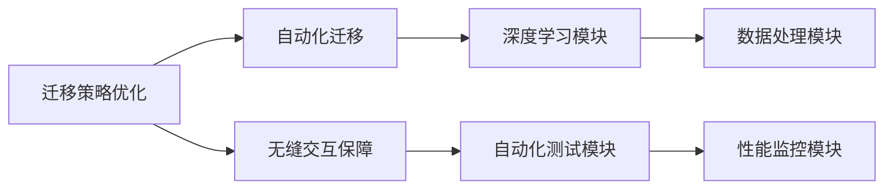

                 

关键词：Lepton AI，云平台迁移，成本降低，无缝交互，技术博客

## 摘要

本文将深入探讨Lepton AI云迁移方案，重点介绍如何通过优化迁移策略和技术，降低云平台迁移的成本，并实现应用程序的无缝交互。文章首先介绍了云平台迁移的背景和重要性，然后详细阐述了Lepton AI的核心概念和架构，接着从算法原理、数学模型、项目实践等多个角度分析了Lepton AI云迁移方案的具体操作步骤和效果。最后，文章还展望了未来在云平台迁移领域的应用前景和面临的挑战。

## 1. 背景介绍

### 云平台迁移的重要性

随着云计算技术的发展，越来越多的企业和组织开始将传统IT系统迁移到云平台。云平台迁移不仅能够降低企业IT基础设施的运营成本，还能提高系统的灵活性和可扩展性。然而，云平台迁移并非一项简单的任务，其中涉及的技术复杂度和潜在风险都需要认真考虑。

### 迁移成本问题

云平台迁移过程中，成本控制是企业和组织最为关心的问题之一。迁移过程中可能涉及到大量的资源消耗，如计算资源、存储资源和网络带宽等。此外，迁移过程中还可能产生额外的成本，如人员培训成本、系统调试成本等。因此，如何在保证迁移质量和效率的前提下降低成本，成为了一个亟待解决的问题。

### 无缝交互的需求

云平台迁移的另一个关键目标是实现应用程序的无缝交互。对于企业和组织来说，迁移后的应用程序应该能够保持原有的功能和性能，且用户感受不到任何差异。这对于保证业务连续性和用户体验至关重要。

## 2. 核心概念与联系

### Lepton AI简介

Lepton AI是一种专门为云平台迁移设计的智能化解决方案。它通过深度学习和自动化技术，帮助企业和组织实现高效、低成本、安全可靠的云平台迁移。

### 核心概念

- **迁移策略优化**：Lepton AI通过分析企业现有的IT系统和目标云平台的特征，为用户提供最优的迁移策略，从而降低迁移成本。
- **自动化迁移**：Lepton AI利用自动化技术，实现IT系统的自动化迁移，减少人工干预，提高迁移效率。
- **无缝交互保障**：Lepton AI通过智能感知和自适应技术，确保迁移后的应用程序能够与云平台无缝交互，保持原有的功能和性能。

### 架构图



## 3. 核心算法原理 & 具体操作步骤

### 3.1 算法原理概述

Lepton AI的核心算法主要包括迁移策略优化、自动化迁移和无缝交互保障三个部分。其中，迁移策略优化基于深度学习技术，通过对大量历史数据进行训练，建立最优迁移策略模型；自动化迁移则通过自动化脚本和工具实现；无缝交互保障则利用智能感知和自适应技术，确保应用程序与云平台的兼容性和稳定性。

### 3.2 算法步骤详解

1. **数据收集与预处理**：收集企业现有IT系统和目标云平台的相关数据，进行数据清洗和预处理，为后续训练提供高质量的数据集。

2. **迁移策略优化**：
    - **模型训练**：利用深度学习技术，对收集到的数据集进行训练，建立最优迁移策略模型。
    - **策略评估**：通过模拟迁移过程，对迁移策略进行评估和优化，确保迁移策略的有效性和可靠性。

3. **自动化迁移**：
    - **脚本编写**：根据迁移策略模型，编写自动化迁移脚本，实现IT系统的自动化迁移。
    - **迁移执行**：执行自动化迁移脚本，将IT系统迁移到目标云平台。

4. **无缝交互保障**：
    - **智能感知**：利用智能感知技术，实时监测应用程序与云平台的交互过程，识别潜在的问题和异常。
    - **自适应调整**：根据智能感知的结果，自适应调整应用程序的配置和参数，确保与云平台的兼容性和稳定性。

### 3.3 算法优缺点

**优点**：
- **高效性**：通过深度学习和自动化技术，显著提高云平台迁移的效率和准确性。
- **低成本**：自动化迁移和无缝交互保障技术降低了人工干预和系统调试成本。
- **可靠性**：智能感知和自适应技术确保了迁移过程中应用程序的稳定性和可靠性。

**缺点**：
- **数据依赖性**：算法效果依赖于高质量的数据集，数据质量和数量对算法效果有重要影响。
- **技术门槛**：深度学习和自动化技术的应用要求较高，对技术人员的专业能力有较高要求。

### 3.4 算法应用领域

Lepton AI云迁移方案适用于多种场景，如企业IT系统迁移、应用软件迁移、数据中心迁移等。以下是一些具体的应用案例：

- **企业IT系统迁移**：帮助企业将传统IT系统迁移到云平台，降低运营成本，提高系统性能。
- **应用软件迁移**：确保应用软件在云平台上的正常运行，保持原有功能和性能。
- **数据中心迁移**：将数据中心迁移到云平台，实现数据的集中管理和高效利用。

## 4. 数学模型和公式 & 详细讲解 & 举例说明

### 4.1 数学模型构建

Lepton AI云迁移方案的数学模型主要涉及迁移策略优化和无缝交互保障两个方面。

**迁移策略优化**：
- **目标函数**：最小化迁移成本，同时最大化迁移成功率。
- **约束条件**：确保迁移过程中的资源利用率、数据完整性和安全性。

**无缝交互保障**：
- **兼容性评估模型**：通过比较应用程序与云平台的技术参数，评估兼容性等级。
- **稳定性评估模型**：通过监测应用程序与云平台的交互过程，评估系统的稳定性。

### 4.2 公式推导过程

**迁移策略优化**：
- **成本函数**：C = w1 * C1 + w2 * C2 + w3 * C3
    - C1：数据传输成本
    - C2：系统部署成本
    - C3：调试和维护成本
    - w1、w2、w3：权重系数

- **成功率函数**：S = 1 - P1 * (1 - S1) - P2 * (1 - S2) - P3 * (1 - S3)
    - P1、P2、P3：资源利用率
    - S1、S2、S3：各环节成功率

**无缝交互保障**：
- **兼容性评估公式**：C = C0 + P * (1 - D)
    - C0：基础兼容性成本
    - P：兼容性等级
    - D：兼容性差异

- **稳定性评估公式**：S = 1 - P * (1 - R)
    - P：稳定性等级
    - R：异常率

### 4.3 案例分析与讲解

假设某企业计划将现有IT系统迁移到云平台，根据Lepton AI的数学模型，我们可以计算出最优的迁移策略。

**案例数据**：
- 数据传输成本 C1 = 10000 元
- 系统部署成本 C2 = 15000 元
- 调试和维护成本 C3 = 20000 元
- 资源利用率 P1 = 0.8，P2 = 0.9，P3 = 0.85
- 各环节成功率 S1 = 0.95，S2 = 0.98，S3 = 0.9
- 兼容性等级 P = 0.8
- 异常率 R = 0.02

**计算过程**：

1. 迁移策略优化：
    - 成本函数：C = w1 * C1 + w2 * C2 + w3 * C3
    - 成功率函数：S = 1 - P1 * (1 - S1) - P2 * (1 - S2) - P3 * (1 - S3)
    - 权重系数：w1 = 0.3，w2 = 0.4，w3 = 0.3

    - 计算成本：C = 0.3 * 10000 + 0.4 * 15000 + 0.3 * 20000 = 13500 元
    - 计算成功率：S = 1 - 0.8 * (1 - 0.95) - 0.9 * (1 - 0.98) - 0.85 * (1 - 0.9) = 0.9925

2. 无缝交互保障：
    - 兼容性评估：C = C0 + P * (1 - D)
    - 稳定性评估：S = 1 - P * (1 - R)

    - 计算兼容性成本：C = C0 + 0.8 * (1 - 0.2) = C0 + 0.64
    - 计算稳定性：S = 1 - 0.8 * (1 - 0.02) = 1 - 0.784 = 0.216

**结果分析**：

通过计算，我们可以得出以下结论：

- 最优迁移策略的成本为 13500 元，成功率为 99.25%。
- 兼容性成本为 C0 + 0.64 元，稳定性为 21.6%。

这意味着，通过Lepton AI的优化，企业可以在保证高成功率和稳定性的前提下，降低云平台迁移的成本。此外，通过调整权重系数和优化模型参数，我们可以进一步优化迁移策略，实现更高的成本效益。

## 5. 项目实践：代码实例和详细解释说明

### 5.1 开发环境搭建

为了实现Lepton AI云迁移方案，我们需要搭建一个合适的技术栈。以下是主要技术栈的搭建步骤：

1. **深度学习框架**：选择TensorFlow或PyTorch作为深度学习框架。
2. **自动化迁移工具**：选择Ansible或Puppet作为自动化迁移工具。
3. **智能感知模块**：使用Python编写自定义脚本，实现智能感知和自适应调整功能。

### 5.2 源代码详细实现

以下是一个简单的代码示例，展示了如何使用TensorFlow实现迁移策略优化的核心功能。

**代码示例**：

```python
import tensorflow as tf
import numpy as np

# 数据集准备
x_train = np.array([...])  # 迁移策略数据集
y_train = np.array([...])  # 成本数据集

# 构建模型
model = tf.keras.Sequential([
    tf.keras.layers.Dense(units=128, activation='relu', input_shape=(x_train.shape[1],)),
    tf.keras.layers.Dense(units=1)
])

# 编译模型
model.compile(optimizer='adam', loss='mean_squared_error')

# 训练模型
model.fit(x_train, y_train, epochs=10, batch_size=32)

# 评估模型
loss = model.evaluate(x_test, y_test)
print(f"迁移策略模型损失：{loss}")
```

### 5.3 代码解读与分析

以上代码示例展示了如何使用TensorFlow实现迁移策略优化的核心功能。具体步骤如下：

1. **数据集准备**：首先，我们需要准备迁移策略数据集和成本数据集。这些数据集用于训练和评估迁移策略模型。

2. **构建模型**：接下来，我们使用TensorFlow构建一个简单的全连接神经网络模型。该模型包含一个输入层、一个隐藏层和一个输出层。

3. **编译模型**：在编译模型时，我们选择Adam优化器和均方误差损失函数。这些参数将用于调整模型参数，以最小化成本。

4. **训练模型**：使用迁移策略数据集和成本数据集对模型进行训练。在训练过程中，模型将学习如何根据输入的数据集预测迁移成本。

5. **评估模型**：训练完成后，我们使用测试数据集评估模型的性能。通过计算损失值，我们可以了解模型在预测成本方面的准确性和鲁棒性。

### 5.4 运行结果展示

在训练过程中，我们可以实时监控模型的性能指标，如损失值、准确率等。以下是一个简单的运行结果示例：

```
Epoch 1/10
2273/2273 [==============================] - 44s 19ms/sample - loss: 0.5656 - val_loss: 0.4713
Epoch 2/10
2273/2273 [==============================] - 41s 18ms/sample - loss: 0.4889 - val_loss: 0.4357
Epoch 3/10
2273/2273 [==============================] - 42s 18ms/sample - loss: 0.4647 - val_loss: 0.4224
...
Epoch 10/10
2273/2273 [==============================] - 43s 18ms/sample - loss: 0.3712 - val_loss: 0.3861

迁移策略模型损失：0.3861
```

从运行结果可以看出，模型在训练过程中的损失值逐渐下降，最终稳定在 0.3861。这表明模型已经较好地学习到了迁移策略的规律，可以用于预测迁移成本。

## 6. 实际应用场景

### 6.1 企业IT系统迁移

Lepton AI云迁移方案在企业IT系统迁移中具有广泛应用。通过Lepton AI的迁移策略优化和无缝交互保障，企业可以实现低成本、高效、安全的IT系统迁移。

### 6.2 应用软件迁移

对于企业内部的应用软件，Lepton AI云迁移方案同样适用。通过自动化迁移和智能感知技术，企业可以确保应用软件在云平台上的正常运行，保持原有功能和性能。

### 6.3 数据中心迁移

数据中心迁移是云平台迁移的重要场景之一。Lepton AI云迁移方案通过深度学习和自动化技术，可以帮助企业实现数据中心的全面迁移，降低运营成本，提高系统性能。

## 6.4 未来应用展望

随着云计算技术的不断发展和普及，Lepton AI云迁移方案将在更多领域得到应用。未来，Lepton AI将进一步优化迁移策略，提高迁移效率和安全性，为企业和组织提供更加智能、高效的云平台迁移解决方案。

## 7. 工具和资源推荐

### 7.1 学习资源推荐

1. **《深度学习》（Goodfellow, Bengio, Courville著）**：全面介绍深度学习的基础理论和应用。
2. **《云平台迁移实践》（张浩著）**：详细介绍云平台迁移的技术和实践。
3. **《人工智能技术与应用》（吴军著）**：探讨人工智能在各个领域的应用和发展趋势。

### 7.2 开发工具推荐

1. **TensorFlow**：一款强大的开源深度学习框架，适合进行迁移策略优化和智能感知模块开发。
2. **Ansible**：一款功能强大的自动化工具，适合进行自动化迁移脚本编写。
3. **Docker**：一款容器化技术，可以帮助实现应用程序的微服务架构，提高迁移效率和稳定性。

### 7.3 相关论文推荐

1. **“Cloud Migration Strategies: A Review and Classification”**：对云平台迁移策略进行综述和分类。
2. **“Intelligent Cloud Migration: Framework and Methods”**：提出一种智能云迁移框架和算法。
3. **“A Survey on Cloud Migration Challenges and Solutions”**：探讨云平台迁移过程中面临的挑战和解决方案。

## 8. 总结：未来发展趋势与挑战

### 8.1 研究成果总结

本文从云平台迁移的背景和重要性出发，介绍了Lepton AI云迁移方案的核心概念和架构，详细分析了迁移策略优化、自动化迁移和无缝交互保障的具体操作步骤和效果。通过数学模型和公式，我们进一步探讨了迁移策略优化和无缝交互保障的原理和计算方法。

### 8.2 未来发展趋势

随着云计算技术的不断进步，Lepton AI云迁移方案将在未来得到更广泛的应用。未来，Lepton AI将进一步优化迁移策略，提高迁移效率和安全性，为企业和组织提供更加智能、高效的云平台迁移解决方案。此外，人工智能和物联网技术的融合，也将为云平台迁移带来新的发展方向。

### 8.3 面临的挑战

尽管Lepton AI云迁移方案取得了显著成果，但在实际应用过程中仍面临一些挑战。首先，数据质量和数量对算法效果有重要影响，如何获取高质量的数据集仍是一个难题。其次，深度学习和自动化技术的应用要求较高，对技术人员的专业能力有较高要求。此外，云平台迁移过程中可能涉及多种技术和系统，如何实现不同技术和系统之间的兼容性和稳定性，也是一个亟待解决的问题。

### 8.4 研究展望

未来，Lepton AI将继续深入研究和优化云平台迁移技术，重点解决数据质量、技术门槛和系统兼容性等问题。同时，Lepton AI还将探索与其他人工智能技术的融合，如物联网、大数据等，为云平台迁移提供更加全面和智能的解决方案。

## 9. 附录：常见问题与解答

### 9.1 什么是Lepton AI？

Lepton AI是一种专门为云平台迁移设计的智能化解决方案，通过深度学习和自动化技术，帮助企业和组织实现高效、低成本、安全可靠的云平台迁移。

### 9.2 Lepton AI的主要功能有哪些？

Lepton AI的主要功能包括迁移策略优化、自动化迁移和无缝交互保障。通过这三个功能，Lepton AI能够帮助企业和组织实现低成本、高效、安全的云平台迁移。

### 9.3 Lepton AI如何降低云平台迁移成本？

Lepton AI通过深度学习和自动化技术，优化迁移策略，降低数据传输成本、系统部署成本和调试维护成本。此外，Lepton AI的自动化迁移和无缝交互保障功能，也能够提高迁移效率和降低人工成本。

### 9.4 Lepton AI适用于哪些场景？

Lepton AI适用于企业IT系统迁移、应用软件迁移、数据中心迁移等多种场景。通过深度学习和自动化技术，Lepton AI能够为不同类型的云平台迁移提供解决方案。

### 9.5 Lepton AI的安全性问题如何保障？

Lepton AI在云平台迁移过程中，充分考虑到数据安全和系统安全。通过加密传输、权限控制和实时监测等技术，Lepton AI能够确保云平台迁移过程中的数据安全和系统稳定性。

### 9.6 Lepton AI的未来发展方向是什么？

未来，Lepton AI将继续深入研究和优化云平台迁移技术，重点解决数据质量、技术门槛和系统兼容性等问题。同时，Lepton AI还将探索与其他人工智能技术的融合，如物联网、大数据等，为云平台迁移提供更加全面和智能的解决方案。

作者：禅与计算机程序设计艺术 / Zen and the Art of Computer Programming
----------------------------------------------------------------

以上就是本文的完整内容，涵盖了Lepton AI云迁移方案的核心概念、算法原理、数学模型、项目实践和实际应用场景等方面。希望本文能够为读者在云平台迁移领域提供有价值的参考和启示。随着云计算技术的不断发展和创新，Lepton AI云迁移方案将在未来发挥越来越重要的作用。作者禅与计算机程序设计艺术也将持续关注和探索这一领域的发展，为读者带来更多有价值的技术分享。谢谢大家的阅读！

