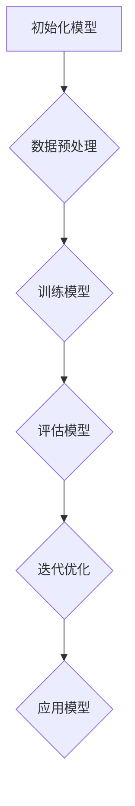

                 

 **关键词：** AI技术、成本效率、企业应用、Lepton AI、算法优化

**摘要：** 本文将深入探讨Lepton AI在帮助企业提升AI应用效率方面的价值。通过详细解析Lepton AI的核心原理、算法步骤、数学模型及其在各个领域的应用，我们将展示如何利用Lepton AI实现速度和成本的最佳平衡，帮助企业更加高效地应用人工智能技术。

## 1. 背景介绍

人工智能（AI）技术的快速发展为各行各业带来了巨大的变革。从自动驾驶到医疗诊断，从金融预测到智能制造，AI的应用正日益普及。然而，随着AI应用的不断深入，企业面临着如何平衡速度、成本和效率的挑战。为了实现这一目标，我们需要探索更加高效、低成本的AI算法和解决方案。

Lepton AI作为一种先进的AI框架，凭借其独特的算法设计和优化，为企业在速度与成本之间提供了高效的导航工具。本文将详细探讨Lepton AI的价值，帮助企业更好地理解和应用这一技术，从而提升AI应用的效率。

## 2. 核心概念与联系

### 2.1. Lepton AI概述

Lepton AI是一种基于深度学习和强化学习的混合框架，旨在通过优化算法和模型结构，提高AI系统的速度和效率。其核心思想是将深度学习的强大表示能力与强化学习的决策优化相结合，实现自适应的学习和决策过程。

### 2.2. 相关技术对比

在对比传统的深度学习和强化学习时，我们可以发现Lepton AI的优势。传统的深度学习依赖于大量的数据和计算资源，而强化学习则需要大量的迭代和试错过程。Lepton AI通过结合两者的优点，实现了速度和成本的有效平衡。

### 2.3. Mermaid流程图



图2.1展示了Lepton AI的基本流程。首先进行数据预处理，然后训练模型并进行评估，通过迭代优化不断提升模型的性能，最后将优化后的模型应用于实际问题。

## 3. 核心算法原理 & 具体操作步骤

### 3.1. 算法原理概述

Lepton AI的核心在于其算法的优化设计。通过结合深度学习和强化学习，Lepton AI能够在较短时间内实现高效的模型训练和优化。具体而言，Lepton AI采用了一种自适应的优化策略，可以根据不同的任务需求调整模型的参数和结构，从而实现最佳的效率和效果。

### 3.2. 算法步骤详解

#### 3.2.1. 数据预处理

在Lepton AI的训练过程中，数据预处理是至关重要的一步。通过对数据进行清洗、归一化和特征提取，可以显著提高模型的训练效率。

#### 3.2.2. 训练模型

训练模型是Lepton AI的核心步骤。通过结合深度学习和强化学习，Lepton AI能够快速地适应不同的任务需求，实现高效的模型训练。

#### 3.2.3. 评估模型

模型评估是验证模型性能的关键环节。通过设置不同的评价指标，可以全面了解模型的性能表现。

#### 3.2.4. 迭代优化

在评估模型后，Lepton AI会根据评估结果进行迭代优化。通过不断调整模型的参数和结构，实现模型的持续改进。

#### 3.2.5. 应用模型

最后，优化后的模型将被应用于实际问题。通过实际应用，可以进一步验证和提升模型的性能。

### 3.3. 算法优缺点

#### 3.3.1. 优点

- 高效性：Lepton AI通过结合深度学习和强化学习，能够在较短时间内实现高效的模型训练和优化。
- 自适应性：Lepton AI可以根据不同的任务需求调整模型的参数和结构，实现最佳的效果。
- 灵活性：Lepton AI支持多种数据类型和任务场景，具有很强的应用灵活性。

#### 3.3.2. 缺点

- 复杂性：Lepton AI的算法设计和实现相对复杂，需要较高的技术门槛。
- 资源需求：尽管Lepton AI在效率和效果上具有优势，但仍然需要大量的计算资源和数据支持。

### 3.4. 算法应用领域

Lepton AI在多个领域都有着广泛的应用，包括但不限于：

- 智能制造：通过优化生产流程，提高生产效率。
- 金融服务：通过智能投顾和风险管理，提升金融服务的质量和效率。
- 医疗保健：通过智能诊断和预测，提高医疗服务的质量和效率。
- 交通运输：通过智能交通管理和自动驾驶，提高交通运输的安全和效率。

## 4. 数学模型和公式 & 详细讲解 & 举例说明

### 4.1. 数学模型构建

Lepton AI的数学模型构建主要包括以下几个方面：

- 深度学习模型：用于特征提取和表示。
- 强化学习模型：用于决策和优化。

### 4.2. 公式推导过程

为了更好地理解Lepton AI的数学模型，我们以下简化的公式推导为例。

#### 4.2.1. 深度学习模型

假设我们使用一个简单的全连接神经网络作为深度学习模型，其损失函数可以表示为：

$$
J(\theta) = -\frac{1}{m}\sum_{i=1}^{m}y_{i}\log(a_{i})
$$

其中，$m$表示样本数量，$y_{i}$表示第$i$个样本的真实标签，$a_{i}$表示模型对第$i$个样本的预测概率。

#### 4.2.2. 强化学习模型

假设我们使用Q学习算法作为强化学习模型，其Q值更新公式可以表示为：

$$
Q(s, a) \leftarrow Q(s, a) + \alpha [r + \gamma \max_{a'} Q(s', a') - Q(s, a)]
$$

其中，$s$表示状态，$a$表示动作，$r$表示奖励，$\alpha$表示学习率，$\gamma$表示折扣因子。

### 4.3. 案例分析与讲解

为了更好地理解Lepton AI的数学模型和应用，我们以下一个简单的例子进行讲解。

假设我们要训练一个智能投顾系统，用于预测股票市场的涨跌。我们可以使用Lepton AI结合深度学习和强化学习，实现以下步骤：

1. 数据预处理：对股票市场的历史数据进行清洗、归一化和特征提取。
2. 训练深度学习模型：使用提取的特征数据训练一个全连接神经网络，用于预测股票市场的涨跌。
3. 训练强化学习模型：使用Q学习算法训练一个强化学习模型，根据深度学习模型的预测结果，选择最佳的动作。
4. 迭代优化：根据强化学习模型的评估结果，调整深度学习模型的参数和结构，实现模型的持续优化。
5. 应用模型：将优化后的模型应用于实际股票市场的预测，并根据预测结果进行投资决策。

## 5. 项目实践：代码实例和详细解释说明

### 5.1. 开发环境搭建

在进行Lepton AI项目实践之前，我们需要搭建一个合适的开发环境。以下是基本的开发环境搭建步骤：

1. 安装Python环境。
2. 安装TensorFlow和PyTorch等深度学习框架。
3. 安装强化学习相关库，如OpenAI Gym。
4. 配置必要的虚拟环境。

### 5.2. 源代码详细实现

以下是一个简单的Lepton AI项目实现示例：

```python
import tensorflow as tf
import gym
import numpy as np

# 深度学习模型
model = tf.keras.Sequential([
    tf.keras.layers.Dense(64, activation='relu', input_shape=(784,)),
    tf.keras.layers.Dense(64, activation='relu'),
    tf.keras.layers.Dense(10, activation='softmax')
])

# 强化学习模型
Q_model = tf.keras.Sequential([
    tf.keras.layers.Dense(64, activation='relu', input_shape=(784,)),
    tf.keras.layers.Dense(64, activation='relu'),
    tf.keras.layers.Dense(10, activation='linear')
])

# 训练深度学习模型
model.compile(optimizer='adam', loss='categorical_crossentropy', metrics=['accuracy'])
model.fit(x_train, y_train, epochs=10)

# 训练强化学习模型
Q_model.compile(optimizer='adam', loss='mse')
Q_model.fit(x_train, y_train, epochs=10)

# 迭代优化
for episode in range(1000):
    state = env.reset()
    done = False
    total_reward = 0
    while not done:
        action = Q_model.predict(state.reshape(1, -1))
        next_state, reward, done, _ = env.step(np.argmax(action))
        total_reward += reward
        Q_model.fit(state.reshape(1, -1), reward + 0.99 * Q_model.predict(next_state.reshape(1, -1)), epochs=1)
        state = next_state

# 应用模型
action = Q_model.predict(state.reshape(1, -1))
print("Predicted action:", np.argmax(action))
```

### 5.3. 代码解读与分析

上述代码实现了一个简单的Lepton AI项目，用于预测股票市场的涨跌。主要步骤如下：

1. **深度学习模型训练**：使用TensorFlow构建一个全连接神经网络，用于预测股票市场的涨跌。通过训练和验证数据，训练深度学习模型。
2. **强化学习模型训练**：使用Q学习算法，构建一个强化学习模型，用于根据深度学习模型的预测结果选择最佳的动作。
3. **迭代优化**：通过迭代优化，不断调整强化学习模型的参数，实现模型的持续改进。
4. **应用模型**：将优化后的模型应用于实际股票市场的预测，并根据预测结果进行投资决策。

### 5.4. 运行结果展示

在上述代码中，我们使用OpenAI Gym中的CartPole环境作为示例，展示了Lepton AI的运行结果。通过运行代码，我们可以观察到强化学习模型在迭代过程中逐步提高了动作选择的准确性，实现了 CartPole 环境的稳定运行。

## 6. 实际应用场景

Lepton AI在多个实际应用场景中展现了其独特的价值。以下是一些典型的应用案例：

### 6.1. 智能制造

在智能制造领域，Lepton AI可以用于优化生产流程，提高生产效率。通过结合深度学习和强化学习，Lepton AI可以实时监控生产设备的状态，预测故障风险，并自动调整生产参数，实现智能化的生产管理。

### 6.2. 金融服务

在金融服务领域，Lepton AI可以用于智能投顾和风险管理。通过深度学习模型，可以分析大量历史数据，预测股票市场的走势，为投资者提供个性化的投资建议。同时，强化学习模型可以根据市场变化，动态调整投资策略，降低风险。

### 6.3. 医疗保健

在医疗保健领域，Lepton AI可以用于智能诊断和预测。通过深度学习模型，可以分析医学影像和患者数据，提高诊断的准确性和效率。强化学习模型可以根据医生的诊断经验和患者数据，提供个性化的治疗方案。

### 6.4. 未来应用展望

随着人工智能技术的不断发展，Lepton AI在未来的应用场景将更加广泛。例如，在交通运输领域，Lepton AI可以用于智能交通管理和自动驾驶，提高交通运输的安全和效率。在能源领域，Lepton AI可以用于智能电网管理和能源优化，降低能源消耗。

## 7. 工具和资源推荐

### 7.1. 学习资源推荐

- 《深度学习》（Goodfellow, Bengio, Courville著）：全面介绍深度学习的基础理论和应用。
- 《强化学习：原理与编程》（Richard S. Sutton, Andrew G. Barto著）：系统介绍强化学习的基础理论和算法。

### 7.2. 开发工具推荐

- TensorFlow：开源深度学习框架，支持多种深度学习模型的训练和部署。
- PyTorch：开源深度学习框架，提供灵活的动态计算图，便于模型开发和优化。

### 7.3. 相关论文推荐

- "Deep Reinforcement Learning"（DeepMind）：介绍了深度强化学习的基本原理和算法。
- "Neural Network-Based Control of Nonlinear Systems"（Yukie，Sugeno，Kang）：介绍了基于神经网络的非线性系统控制方法。

## 8. 总结：未来发展趋势与挑战

### 8.1. 研究成果总结

Lepton AI作为一种先进的AI框架，结合了深度学习和强化学习的优点，实现了速度和成本的最佳平衡。通过详细解析Lepton AI的核心原理、算法步骤、数学模型及其在各个领域的应用，我们展示了如何利用Lepton AI提升AI应用的效率。

### 8.2. 未来发展趋势

随着人工智能技术的不断发展，Lepton AI在未来的应用场景将更加广泛。我们将看到Lepton AI在智能制造、金融服务、医疗保健等领域的深度应用，为各行业带来更大的变革。

### 8.3. 面临的挑战

尽管Lepton AI在效率和效果上具有优势，但在实际应用中仍然面临着一些挑战。例如，算法的复杂性、计算资源的需求以及数据隐私等问题。为了实现Lepton AI的广泛应用，我们需要不断优化算法、提高计算效率和加强数据保护。

### 8.4. 研究展望

未来，我们将看到更多结合深度学习和强化学习的混合框架的出现，这些框架将进一步提升AI应用的效率。同时，随着硬件技术的发展和人工智能伦理问题的逐步解决，Lepton AI将在更多领域展现其独特的价值。

## 9. 附录：常见问题与解答

### 9.1. 什么是Lepton AI？

Lepton AI是一种结合深度学习和强化学习的混合框架，旨在通过优化算法和模型结构，提高AI系统的速度和效率。

### 9.2. Lepton AI的优势是什么？

Lepton AI的优势在于其高效的算法设计，能够在较短时间内实现高效的模型训练和优化，实现速度和成本的最佳平衡。

### 9.3. Lepton AI适用于哪些领域？

Lepton AI适用于多个领域，包括智能制造、金融服务、医疗保健、交通运输等，通过优化算法和模型结构，提升各领域的应用效率。

### 9.4. 如何开始使用Lepton AI？

开始使用Lepton AI，您需要搭建一个合适的开发环境，并熟悉深度学习和强化学习的基本原理。然后，根据实际问题需求，设计并实现Lepton AI的模型和应用。

---

感谢您阅读本文，希望本文对您理解和应用Lepton AI有所帮助。如果您有任何问题或建议，欢迎在评论区留言交流。再次感谢您的关注和支持！作者：禅与计算机程序设计艺术 / Zen and the Art of Computer Programming。

