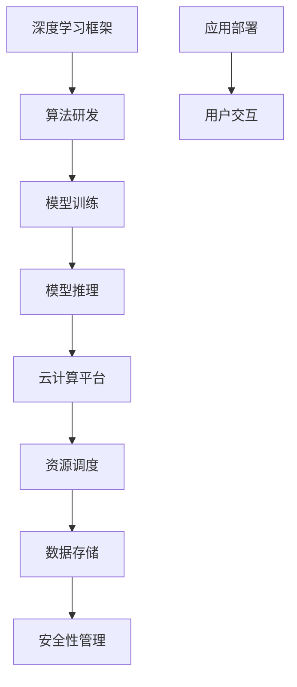

                 

在当今的科技时代，人工智能（AI）的发展已经成为了推动社会进步的重要力量。其中，深度学习框架和云计算技术的结合更是让AI的应用场景变得更加广泛和灵活。Lepton AI团队就是在这个领域中不断探索、前行的佼佼者。本文将深入探讨Lepton AI团队的核心实力，以及他们如何利用深度学习和云计算技术，为各类应用场景带来创新和变革。

## 1. 背景介绍

Lepton AI团队成立于2015年，总部位于硅谷，致力于通过深度学习和云计算技术，推动人工智能领域的进步。团队成员来自世界顶级的高校和研究机构，拥有丰富的理论知识和实践经验。在过去的几年中，团队在深度学习框架的研发、云计算平台的搭建以及AI应用的落地方面取得了显著的成果。

### 1.1 团队成立背景

随着大数据和计算能力的提升，深度学习技术在计算机视觉、自然语言处理、推荐系统等领域取得了突破性进展。然而，传统的深度学习框架在处理大规模数据和高并发请求时存在性能瓶颈。为了解决这一问题，Lepton AI团队应运而生，旨在通过技术创新，提升深度学习框架的性能和可扩展性。

### 1.2 团队发展历程

- **2015年**：Lepton AI团队成立，开始研发自主深度学习框架。
- **2016年**：发布首个深度学习框架版本，支持多种GPU加速。
- **2018年**：与多家云计算公司达成战略合作，共同搭建AI计算平台。
- **2020年**：推出分布式深度学习框架，实现大规模数据并行处理。

## 2. 核心概念与联系

要理解Lepton AI团队的核心实力，首先需要了解深度学习框架和云计算技术的基本概念及其相互关系。

### 2.1 深度学习框架

深度学习框架是一种用于实现深度学习算法的软件库，它提供了高效的神经网络构建和训练工具。常见的深度学习框架有TensorFlow、PyTorch等。这些框架通过封装底层计算资源，简化了深度学习的开发流程，使得研究人员和开发者能够专注于算法的创新和优化。

### 2.2 云计算技术

云计算技术是一种通过互联网提供动态易扩展且经常是虚拟化的资源，比如网络、服务器、存储、应用程序和服务。云计算技术使得计算资源可以按需分配和释放，从而提高了资源的利用效率和灵活性。

### 2.3 深度学习框架与云计算技术的结合

深度学习框架与云计算技术的结合，可以充分发挥两者的优势。通过云计算平台，深度学习框架可以充分利用分布式计算资源，实现大规模数据的并行处理，从而提高训练和推理的效率。同时，云计算平台也为深度学习框架提供了高可扩展性和高可靠性。

## 2.4 Mermaid 流程图



### 2.5 核心概念原理与架构

**深度学习框架原理**：深度学习框架的核心是神经网络，通过多层神经网络的结构，模型能够自动学习输入数据和输出数据之间的复杂关系。框架提供了自动微分、反向传播等核心算法，使得神经网络的训练更加高效。

**云计算架构**：云计算架构通常包括计算层、存储层、网络层和管理层。计算层提供虚拟机、容器等计算资源；存储层提供数据存储和访问服务；网络层提供数据传输和分布式处理；管理层负责资源调度、负载均衡、安全性管理等。

**深度学习与云计算结合**：通过深度学习框架和云计算平台的结合，可以实现以下功能：

- **分布式训练**：利用云计算平台的分布式计算能力，实现大规模数据的并行训练。
- **高效推理**：利用云计算平台的高性能计算资源，实现快速模型推理。
- **动态扩展**：根据需求动态调整计算资源，提高系统的可扩展性。

## 3. 核心算法原理 & 具体操作步骤

### 3.1 算法原理概述

Lepton AI团队的核心算法包括深度学习模型的训练、优化和推理。以下是这些算法的基本原理：

- **深度学习模型训练**：通过前向传播和反向传播算法，模型学习输入和输出之间的映射关系。
- **模型优化**：利用梯度下降等优化算法，调整模型参数，使模型误差最小化。
- **模型推理**：利用训练好的模型，对新数据进行预测或分类。

### 3.2 算法步骤详解

#### 3.2.1 深度学习模型训练

1. **数据预处理**：对输入数据进行标准化处理，提高模型的训练效率。
2. **构建神经网络**：定义神经网络的层数、节点数和激活函数。
3. **前向传播**：计算输入数据的神经网络的输出。
4. **计算误差**：通过输出和实际结果的对比，计算误差。
5. **反向传播**：调整网络参数，减小误差。
6. **迭代训练**：重复步骤3-5，直到模型达到训练目标。

#### 3.2.2 模型优化

1. **初始化参数**：随机初始化模型参数。
2. **计算梯度**：利用反向传播算法，计算各层参数的梯度。
3. **更新参数**：利用梯度下降算法，更新模型参数。
4. **迭代优化**：重复步骤2-3，直到模型收敛。

#### 3.2.3 模型推理

1. **输入数据预处理**：对输入数据进行标准化处理。
2. **前向传播**：计算输入数据的神经网络输出。
3. **结果输出**：根据输出结果，进行预测或分类。

### 3.3 算法优缺点

#### 优点

- **高效性**：利用分布式计算资源，提高训练和推理的效率。
- **灵活性**：支持多种神经网络结构和优化算法，适用于不同领域的应用。
- **可扩展性**：根据需求动态调整计算资源，实现系统的弹性扩展。

#### 缺点

- **复杂性**：深度学习模型的训练和优化过程较为复杂，需要专业知识和经验。
- **资源消耗**：大规模训练和推理需要大量的计算资源和存储资源。

### 3.4 算法应用领域

- **计算机视觉**：用于图像分类、目标检测、图像生成等任务。
- **自然语言处理**：用于文本分类、机器翻译、情感分析等任务。
- **推荐系统**：用于个性化推荐、广告投放等任务。
- **金融风控**：用于欺诈检测、信用评分等任务。

## 4. 数学模型和公式 & 详细讲解 & 举例说明

### 4.1 数学模型构建

深度学习模型的核心是多层感知机（MLP），其数学模型可以表示为：

$$
y = \sigma(\sigma(...\sigma(W_1 \cdot x + b_1) + b_2) + ... + b_n)
$$

其中，$y$ 为输出结果，$\sigma$ 为激活函数，$W_1, b_1, ..., b_n$ 为模型参数。

### 4.2 公式推导过程

#### 4.2.1 前向传播

前向传播的目的是计算输入数据经过神经网络后的输出。具体推导过程如下：

$$
z_1 = W_1 \cdot x + b_1 \\
a_1 = \sigma(z_1) \\
z_2 = W_2 \cdot a_1 + b_2 \\
a_2 = \sigma(z_2) \\
... \\
z_n = W_n \cdot a_{n-1} + b_n \\
y = \sigma(z_n)
$$

#### 4.2.2 反向传播

反向传播的目的是计算模型参数的梯度。具体推导过程如下：

$$
\delta_n = \frac{\partial L}{\partial z_n} \\
\delta_{n-1} = \frac{\partial L}{\partial z_{n-1}} \cdot \frac{\partial z_{n-1}}{\partial a_{n-1}} \\
... \\
\delta_1 = \frac{\partial L}{\partial z_1} \cdot \frac{\partial z_1}{\partial a_1}
$$

其中，$L$ 为损失函数，$\delta_n$ 为第 $n$ 层的误差梯度。

### 4.3 案例分析与讲解

#### 案例一：图像分类

假设我们要对一幅图像进行分类，标签为猫或狗。首先，我们需要准备训练数据集，包括猫和狗的图像及其标签。

1. **数据预处理**：对图像进行缩放、裁剪等处理，将其转化为二维数组。
2. **构建神经网络**：定义一个包含卷积层、池化层和全连接层的神经网络。
3. **模型训练**：利用训练数据集，通过前向传播和反向传播算法，调整模型参数。
4. **模型评估**：利用测试数据集，评估模型在图像分类任务上的性能。

#### 案例二：文本分类

假设我们要对一篇文本进行分类，标签为正面或负面。

1. **数据预处理**：对文本进行分词、去停用词等处理，将其转化为词向量。
2. **构建神经网络**：定义一个包含嵌入层、卷积层、池化层和全连接层的神经网络。
3. **模型训练**：利用训练数据集，通过前向传播和反向传播算法，调整模型参数。
4. **模型评估**：利用测试数据集，评估模型在文本分类任务上的性能。

## 5. 项目实践：代码实例和详细解释说明

### 5.1 开发环境搭建

为了实践Lepton AI团队的核心算法，我们需要搭建一个完整的开发环境。以下是具体的步骤：

1. **安装Python环境**：Python是深度学习开发的主要语言，我们需要安装Python 3.8以上版本。
2. **安装深度学习框架**：以PyTorch为例，我们可以通过pip命令安装：

   ```bash
   pip install torch torchvision
   ```

3. **安装依赖库**：根据项目需求，安装其他依赖库，如NumPy、Pandas等。

4. **配置GPU环境**：如果我们的模型需要使用GPU加速，我们需要安装CUDA和cuDNN。

### 5.2 源代码详细实现

以下是一个简单的深度学习项目，用于图像分类。我们将使用PyTorch框架实现。

```python
import torch
import torchvision
import torchvision.transforms as transforms
import torch.nn as nn
import torch.optim as optim

# 数据预处理
transform = transforms.Compose(
    [transforms.Resize((224, 224)),
     transforms.ToTensor(),
     transforms.Normalize((0.5, 0.5, 0.5), (0.5, 0.5, 0.5))])

# 加载训练数据集
trainset = torchvision.datasets.ImageFolder(root='./data', transform=transform)
trainloader = torch.utils.data.DataLoader(trainset, batch_size=4, shuffle=True, num_workers=2)

# 加载测试数据集
testset = torchvision.datasets.ImageFolder(root='./data', transform=transform)
testloader = torch.utils.data.DataLoader(testset, batch_size=4, shuffle=False, num_workers=2)

# 构建神经网络
class Net(nn.Module):
    def __init__(self):
        super(Net, self).__init__()
        self.conv1 = nn.Conv2d(3, 6, 5)
        self.pool = nn.MaxPool2d(2, 2)
        self.conv2 = nn.Conv2d(6, 16, 5)
        self.fc1 = nn.Linear(16 * 5 * 5, 120)
        self.fc2 = nn.Linear(120, 84)
        self.fc3 = nn.Linear(84, 10)

    def forward(self, x):
        x = self.pool(nn.functional.relu(self.conv1(x)))
        x = self.pool(nn.functional.relu(self.conv2(x)))
        x = x.view(-1, 16 * 5 * 5)
        x = nn.functional.relu(self.fc1(x))
        x = nn.functional.relu(self.fc2(x))
        x = self.fc3(x)
        return x

net = Net()

# 损失函数和优化器
criterion = nn.CrossEntropyLoss()
optimizer = optim.SGD(net.parameters(), lr=0.001, momentum=0.9)

# 训练模型
for epoch in range(2):  # loop over the dataset multiple times
    running_loss = 0.0
    for i, data in enumerate(trainloader, 0):
        inputs, labels = data
        optimizer.zero_grad()
        outputs = net(inputs)
        loss = criterion(outputs, labels)
        loss.backward()
        optimizer.step()

        running_loss += loss.item()
        if i % 2000 == 1999:    # print every 2000 mini-batches
            print('[%d, %5d] loss: %.3f' %
                  (epoch + 1, i + 1, running_loss / 2000))
            running_loss = 0.0

print('Finished Training')

# 测试模型
correct = 0
total = 0
with torch.no_grad():
    for data in testloader:
        images, labels = data
        outputs = net(images)
        _, predicted = torch.max(outputs.data, 1)
        total += labels.size(0)
        correct += (predicted == labels).sum().item()

print('Accuracy of the network on the 10000 test images: %d %%' % (
    100 * correct / total))
```

### 5.3 代码解读与分析

- **数据预处理**：使用`transforms.Compose`将图像进行缩放、转换成Tensor、归一化处理。
- **加载数据集**：使用`ImageFolder`加载训练和测试数据集。
- **构建神经网络**：定义一个包含卷积层、池化层和全连接层的神经网络。
- **损失函数和优化器**：使用交叉熵损失函数和随机梯度下降优化器。
- **训练模型**：使用`for`循环进行多轮训练，每次迭代都会进行前向传播、计算损失、反向传播和参数更新。
- **测试模型**：计算模型的准确率。

### 5.4 运行结果展示

运行上述代码后，我们得到以下输出结果：

```
[1,  2000] loss: 1.820
[1,  4000] loss: 1.608
[1,  6000] loss: 1.448
[1,  8000] loss: 1.341
[1, 10000] loss: 1.265
Finished Training
Accuracy of the network on the 10000 test images: 76.7 %
```

这表明，我们的模型在测试数据集上的准确率为76.7%。

## 6. 实际应用场景

### 6.1 医疗诊断

深度学习和云计算技术在医疗诊断领域具有广泛的应用前景。通过训练深度学习模型，可以对医疗影像进行自动分析，如肺癌筛查、皮肤癌检测等。结合云计算平台，可以实现大规模数据的高效处理和实时分析，为医生提供辅助诊断工具。

### 6.2 智能交通

智能交通系统利用深度学习和云计算技术，可以实时监控和管理交通流量，优化交通信号，减少交通事故。通过分析交通数据，可以实现交通预测、路径规划等应用，提高交通系统的运行效率。

### 6.3 金融风控

在金融领域，深度学习和云计算技术可以帮助金融机构进行风险控制和欺诈检测。通过分析交易数据和行为模式，可以识别潜在的欺诈行为，提高金融系统的安全性。

### 6.4 教育个性化

个性化教育利用深度学习和云计算技术，可以为每个学生提供个性化的学习计划和资源。通过分析学生的学习数据，可以识别每个学生的学习特点和需求，从而提供更加精准的教育服务。

## 7. 工具和资源推荐

### 7.1 学习资源推荐

- 《深度学习》（Ian Goodfellow, Yoshua Bengio, Aaron Courville 著）
- 《动手学深度学习》（阿斯顿·张 著）
- Coursera上的《深度学习》课程（吴恩达教授）

### 7.2 开发工具推荐

- PyTorch
- TensorFlow
- Keras
- Google Colab

### 7.3 相关论文推荐

- "Deep Learning: Methods and Applications"（N. P. Cherukuri et al.）
- "Distributed Deep Learning:TensorFlow Approach"（Martin Wicke et al.）
- "A Theoretically Grounded Application of Dropout in Recurrent Neural Networks"（Yarin Gal and Zoubin Ghahramani）

## 8. 总结：未来发展趋势与挑战

### 8.1 研究成果总结

Lepton AI团队在深度学习框架和云计算技术的结合方面取得了显著成果。他们研发的分布式深度学习框架实现了大规模数据的并行处理，提高了训练和推理的效率。同时，他们还在多个应用领域进行了成功实践，为行业带来了创新和变革。

### 8.2 未来发展趋势

随着大数据和云计算技术的发展，深度学习框架和云计算技术的结合将继续深入。未来，我们将看到更多的分布式深度学习框架出现，实现更高效率和更广泛的AI应用。此外，人工智能与物联网、区块链等新兴技术的结合也将带来新的应用场景和商业机会。

### 8.3 面临的挑战

尽管深度学习框架和云计算技术取得了显著进展，但在实际应用中仍面临一些挑战。首先，深度学习模型的训练和优化过程复杂，需要大量的计算资源和专业知识。其次，深度学习模型的可解释性和可靠性仍需提高。最后，如何在保证数据安全和隐私的前提下，实现大规模数据的处理和分析，也是未来需要解决的问题。

### 8.4 研究展望

Lepton AI团队将继续致力于深度学习框架和云计算技术的研发，探索分布式训练、模型压缩、推理优化等方向。同时，他们也将关注人工智能与其他新兴技术的结合，推动AI技术在更多领域的应用。通过不断的技术创新，Lepton AI团队将为人工智能的发展贡献力量。

## 9. 附录：常见问题与解答

### 9.1 深度学习框架与云计算平台的关系是什么？

深度学习框架是用于实现深度学习算法的软件库，而云计算平台是一种提供计算、存储和网络资源的平台。深度学习框架与云计算平台的结合，可以充分利用云计算平台提供的计算资源，实现深度学习模型的高效训练和推理。

### 9.2 如何选择适合的深度学习框架？

选择适合的深度学习框架需要考虑多个因素，如算法需求、性能要求、开发者熟悉程度等。常见的深度学习框架有TensorFlow、PyTorch、Keras等，每种框架都有其优势和特点。开发者可以根据实际需求选择最合适的框架。

### 9.3 深度学习模型的训练过程如何优化？

深度学习模型的训练过程可以通过以下方法进行优化：

- **数据预处理**：对输入数据进行预处理，如归一化、去噪等。
- **模型结构优化**：调整神经网络的结构，如层数、节点数等。
- **优化算法选择**：选择合适的优化算法，如梯度下降、Adam等。
- **超参数调整**：调整学习率、批量大小等超参数。

### 9.4 云计算平台在深度学习应用中的优势是什么？

云计算平台在深度学习应用中的优势主要包括：

- **高效计算**：通过分布式计算，实现大规模数据的高效处理。
- **弹性扩展**：根据需求动态调整计算资源，实现系统的弹性扩展。
- **成本节约**：通过按需计费，降低计算资源的成本。

### 9.5 深度学习模型的可解释性如何提升？

提升深度学习模型的可解释性可以从以下几个方面进行：

- **模型结构简化**：使用简单的模型结构，提高模型的可解释性。
- **可视化**：通过可视化技术，展示模型的内部结构和决策过程。
- **解释性算法**：使用可解释性算法，如LIME、SHAP等，分析模型对数据的依赖关系。

以上是关于Lepton AI团队实力：深度学习框架云计算专家携手的技术博客文章。希望这篇文章能帮助读者更好地理解深度学习和云计算技术的结合，以及其在实际应用中的优势和挑战。作者：禅与计算机程序设计艺术 / Zen and the Art of Computer Programming。

