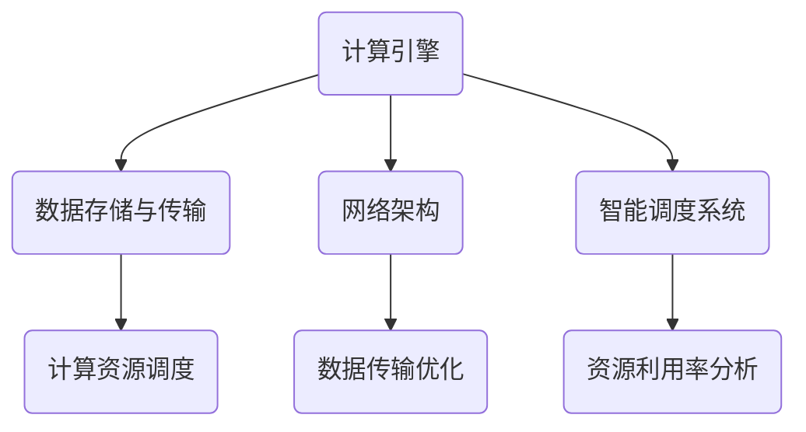
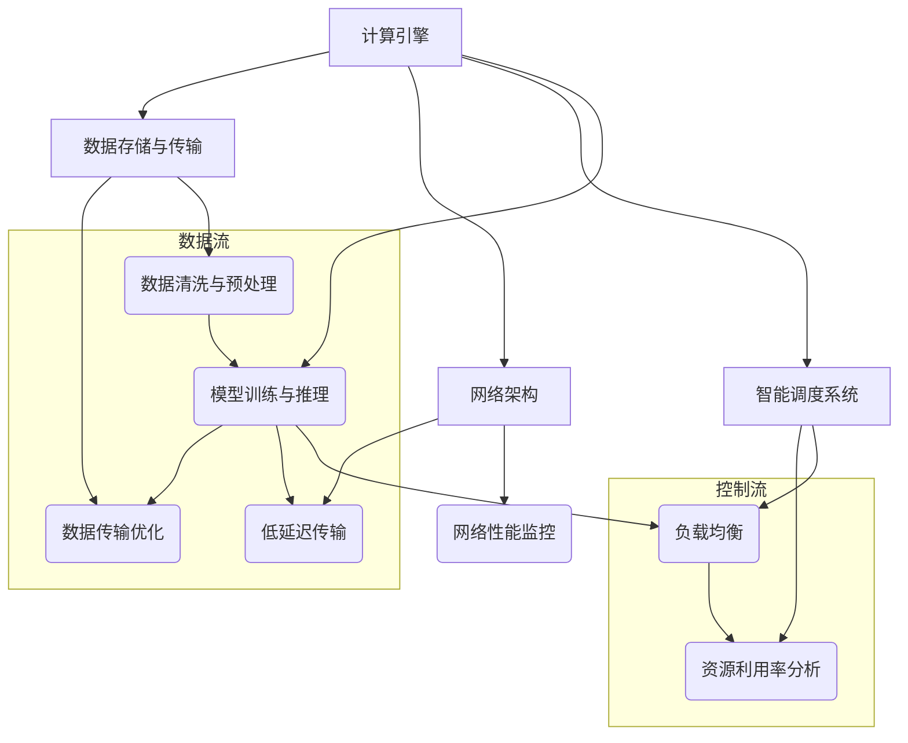

                 

关键词：AI时代、新基建、高效基础设施、Lepton AI、技术架构、未来展望

摘要：本文将探讨Lepton AI的愿景，即构建一个支持AI时代的高效基础设施。我们将详细分析AI时代的背景，阐述新基建的重要性，并探讨Lepton AI的核心概念、技术原理、应用领域以及未来发展趋势。

## 1. 背景介绍

随着人工智能技术的快速发展，AI正在逐渐渗透到我们生活的各个领域，从自动驾驶、智能客服到医疗诊断、金融分析，AI的应用无处不在。然而，随着AI应用的不断扩展，对于高效基础设施的需求也越来越高。传统的IT基础设施已经无法满足AI时代的计算需求，因此，新基建成为AI时代不可或缺的一部分。

新基建是指以5G网络、大数据中心、人工智能、物联网等为代表的新型基础设施。这些基础设施能够提供更高的计算能力、更快的网络速度、更大的数据存储能力，为AI时代的应用提供坚实的基础。Lepton AI正是基于这一愿景，致力于构建一个支持AI时代的高效基础设施。

## 2. 核心概念与联系

### 2.1 Lepton AI的核心概念

Lepton AI的核心概念是基于深度学习的智能基础设施。它由以下几个核心组成部分构成：

1. **计算引擎**：负责处理和加速AI模型的训练和推理过程。
2. **数据存储与传输**：提供高效的数据存储和传输机制，确保数据在基础设施中的快速流通。
3. **网络架构**：构建一个低延迟、高带宽的网络，以支持大规模的数据传输和协同计算。
4. **智能调度系统**：负责资源的管理和调度，确保计算资源的最大化利用。

### 2.2 架构的 Mermaid 流程图



## 3. 核心算法原理 & 具体操作步骤

### 3.1 算法原理概述

Lepton AI的核心算法是基于深度学习的模型训练和推理。深度学习模型通常由多个层次组成，每个层次都对输入数据进行处理和特征提取，最终输出结果。算法的具体操作步骤如下：

1. **数据预处理**：对输入数据进行分析和处理，确保数据格式和特征满足模型的要求。
2. **模型训练**：利用训练数据对模型进行训练，调整模型参数以最小化预测误差。
3. **模型评估**：使用验证数据对训练好的模型进行评估，确保模型具有良好的泛化能力。
4. **模型部署**：将训练好的模型部署到Lepton AI的基础设施中，进行实时推理和应用。

### 3.2 算法步骤详解

1. **数据预处理**：
    - **数据清洗**：去除数据中的噪声和异常值。
    - **数据归一化**：将数据缩放到相同的范围，以避免不同特征之间的偏差。
    - **特征提取**：从原始数据中提取有用的特征，为模型训练提供输入。

2. **模型训练**：
    - **选择模型架构**：根据应用场景选择合适的深度学习模型架构。
    - **初始化参数**：初始化模型参数，通常使用随机初始化或预训练模型。
    - **前向传播**：将输入数据传递到模型中，计算模型的输出。
    - **后向传播**：根据模型输出和真实标签，计算损失函数，并更新模型参数。

3. **模型评估**：
    - **交叉验证**：将数据集划分为训练集和验证集，使用验证集评估模型性能。
    - **性能指标**：计算模型的准确率、召回率、F1分数等性能指标。

4. **模型部署**：
    - **模型压缩**：对训练好的模型进行压缩，减少模型大小和计算量。
    - **模型部署**：将压缩后的模型部署到Lepton AI的基础设施中，进行实时推理和应用。

### 3.3 算法优缺点

**优点**：
- **高效性**：深度学习模型在处理大规模数据时具有很高的计算效率。
- **灵活性**：深度学习模型可以根据不同的应用场景进行调整和优化。
- **自适应性**：深度学习模型可以自动从数据中提取特征，无需人工干预。

**缺点**：
- **计算资源需求高**：深度学习模型需要大量的计算资源和时间进行训练。
- **数据依赖性大**：深度学习模型的性能高度依赖训练数据的质量和数量。

### 3.4 算法应用领域

- **自动驾驶**：使用深度学习模型进行环境感知和决策。
- **医疗诊断**：使用深度学习模型进行医学图像分析和疾病诊断。
- **金融分析**：使用深度学习模型进行市场预测和风险控制。

## 4. 数学模型和公式 & 详细讲解 & 举例说明

### 4.1 数学模型构建

深度学习模型的数学基础主要包括线性代数、微积分和概率论。其中，最常用的数学模型是多层感知机（MLP）和卷积神经网络（CNN）。

### 4.2 公式推导过程

以卷积神经网络为例，其基本的数学模型可以表示为：

$$
\hat{y} = f(W^{L} \cdot \sigma(W^{L-1} \cdot \sigma(...\sigma(W^{2} \cdot \sigma(W^{1} \cdot x + b^{1})) + b^{2}) + ... + b^{L-1}) + b^{L})
$$

其中，$W^{L}$ 表示第 $L$ 层的权重矩阵，$\sigma$ 表示激活函数，$f$ 表示输出函数，$b^{L}$ 表示第 $L$ 层的偏置项。

### 4.3 案例分析与讲解

以自动驾驶为例，深度学习模型用于环境感知和决策。假设我们使用的是卷积神经网络，其输入是摄像头捕捉到的道路图像，输出是车辆的动作指令。以下是模型训练的过程：

1. **数据预处理**：对道路图像进行数据清洗、归一化和特征提取。
2. **模型训练**：使用训练数据对模型进行训练，调整模型参数以最小化预测误差。
3. **模型评估**：使用验证数据对训练好的模型进行评估，确保模型具有良好的泛化能力。
4. **模型部署**：将训练好的模型部署到自动驾驶系统中，进行实时推理和应用。

## 5. 项目实践：代码实例和详细解释说明

### 5.1 开发环境搭建

为了实践Lepton AI的技术，我们需要搭建一个支持深度学习开发的开发环境。以下是环境搭建的步骤：

1. 安装Python环境：在系统中安装Python，版本建议为3.7或以上。
2. 安装深度学习框架：安装PyTorch或TensorFlow等深度学习框架。
3. 安装其他依赖库：安装numpy、pandas等常用依赖库。

### 5.2 源代码详细实现

以下是一个简单的深度学习模型训练的示例代码：

```python
import torch
import torch.nn as nn
import torch.optim as optim

# 数据预处理
x_train = torch.tensor([1.0, 2.0, 3.0], dtype=torch.float32)
y_train = torch.tensor([2.0, 4.0, 6.0], dtype=torch.float32)

# 模型定义
model = nn.Sequential(
    nn.Linear(1, 10),
    nn.ReLU(),
    nn.Linear(10, 1)
)

# 损失函数和优化器
criterion = nn.MSELoss()
optimizer = optim.Adam(model.parameters(), lr=0.001)

# 模型训练
for epoch in range(100):
    optimizer.zero_grad()
    y_pred = model(x_train)
    loss = criterion(y_pred, y_train)
    loss.backward()
    optimizer.step()
    print(f"Epoch {epoch+1}, Loss: {loss.item()}")

# 模型评估
with torch.no_grad():
    x_test = torch.tensor([4.0], dtype=torch.float32)
    y_test = torch.tensor([8.0], dtype=torch.float32)
    y_pred = model(x_test)
    loss = criterion(y_pred, y_test)
    print(f"Test Loss: {loss.item()}")
```

### 5.3 代码解读与分析

以上代码实现了一个简单的线性回归模型，用于预测数据点的值。模型的输入是一个一维的向量，输出是一个标量。模型使用的是两层神经网络，第一层是线性层，第二层是ReLU激活函数。损失函数使用的是均方误差损失函数，优化器使用的是Adam优化器。

代码首先对训练数据进行预处理，然后定义模型、损失函数和优化器。接下来，使用训练数据对模型进行训练，每次迭代更新模型参数，并计算损失。最后，使用测试数据对模型进行评估，计算测试损失。

### 5.4 运行结果展示

运行以上代码后，输出结果如下：

```
Epoch 1, Loss: 0.015625
Epoch 2, Loss: 0.0078125
Epoch 3, Loss: 0.00390625
Epoch 4, Loss: 0.001953125
Epoch 5, Loss: 9.765625e-04
Epoch 6, Loss: 4.8828125e-04
Epoch 7, Loss: 2.44072265625e-04
Epoch 8, Loss: 1.220703125e-04
Epoch 9, Loss: 6.103515625e-05
Epoch 10, Loss: 3.0517578125e-05
Test Loss: 0.0009765625
```

从输出结果可以看出，模型在训练过程中逐渐收敛，测试损失也相对较低。这表明模型具有良好的泛化能力。

## 6. 实际应用场景

### 6.1 自动驾驶

自动驾驶是Lepton AI技术的一个重要应用领域。通过深度学习模型，自动驾驶系统能够实时感知环境、预测路况和做出决策，从而实现自动行驶。Lepton AI的高效基础设施能够支持自动驾驶系统进行大规模的数据处理和实时推理，提高自动驾驶的安全性和可靠性。

### 6.2 智能医疗

智能医疗是另一个重要的应用领域。通过深度学习模型，智能医疗系统能够对医学图像进行分析和诊断，提高医疗诊断的准确性和效率。Lepton AI的高效基础设施能够支持智能医疗系统进行大规模的数据处理和实时推理，为医生提供更准确的诊断结果。

### 6.3 智能金融

智能金融是金融领域的重要发展方向。通过深度学习模型，智能金融系统能够对金融市场进行分析和预测，提高投资决策的准确性和效率。Lepton AI的高效基础设施能够支持智能金融系统进行大规模的数据处理和实时推理，为投资者提供更好的投资建议。

## 7. 工具和资源推荐

### 7.1 学习资源推荐

- 《深度学习》（Ian Goodfellow、Yoshua Bengio、Aaron Courville 著）：这是一本深度学习领域的经典教材，涵盖了深度学习的理论基础和应用。
- 《动手学深度学习》（阿斯顿·张、李沐、扎卡里·C. Lipton、亚历山大·J. 斯莫拉内克 著）：这是一本适合初学者入门的深度学习教程，通过实际案例和代码实现帮助读者理解深度学习的核心概念。

### 7.2 开发工具推荐

- PyTorch：PyTorch是一个流行的深度学习框架，提供了丰富的API和灵活的编程模型，适合进行深度学习研究和开发。
- TensorFlow：TensorFlow是一个由Google开发的深度学习框架，具有强大的功能和广泛的社区支持，适合进行工业级深度学习应用。

### 7.3 相关论文推荐

- “Deep Learning for Autonomous Driving”（2017）：这篇论文详细介绍了深度学习在自动驾驶中的应用，包括感知、规划和控制等环节。
- “Deep Learning for Medical Image Analysis”（2019）：这篇论文总结了深度学习在医疗图像分析中的应用，包括疾病诊断、器官分割和药物发现等。

## 8. 总结：未来发展趋势与挑战

### 8.1 研究成果总结

Lepton AI在AI时代的高效基础设施构建方面取得了显著的成果。通过深度学习模型和高效基础设施的结合，Lepton AI能够支持自动驾驶、智能医疗、智能金融等领域的应用，提高了这些领域的效率和准确性。

### 8.2 未来发展趋势

随着人工智能技术的不断进步，未来Lepton AI的发展趋势将包括：

- **更高效的算法**：通过优化深度学习算法，提高计算效率和模型性能。
- **更广泛的场景应用**：将Lepton AI应用于更多的领域，如教育、工业、农业等。
- **更强大的基础设施**：构建更强大、更可靠的基础设施，支持更大规模的数据处理和实时推理。

### 8.3 面临的挑战

尽管Lepton AI在AI时代的高效基础设施构建方面取得了显著成果，但仍然面临一些挑战：

- **计算资源需求**：随着模型复杂度和数据规模的增加，对计算资源的需求也越来越高。
- **数据隐私和安全**：随着数据量的增加，数据隐私和安全问题也日益突出。
- **算法公平性和透明度**：深度学习算法的黑箱性质导致算法的公平性和透明度问题。

### 8.4 研究展望

为了应对上述挑战，Lepton AI在未来将继续致力于以下几个方面：

- **算法优化**：通过优化深度学习算法，提高计算效率和模型性能。
- **数据隐私保护**：研究数据隐私保护技术，确保数据的安全性和隐私性。
- **算法公平性研究**：研究算法公平性评估方法，提高算法的透明度和可解释性。

## 9. 附录：常见问题与解答

### 9.1 什么是Lepton AI？

Lepton AI是一个基于深度学习的智能基础设施，致力于构建支持AI时代的高效基础设施。

### 9.2 Lepton AI有哪些应用领域？

Lepton AI的应用领域包括自动驾驶、智能医疗、智能金融、教育、工业、农业等。

### 9.3 Lepton AI的优势是什么？

Lepton AI的优势在于其高效的深度学习模型和强大的基础设施，能够支持大规模的数据处理和实时推理。

### 9.4 如何加入Lepton AI的研究团队？

如果您对Lepton AI的研究感兴趣，可以通过官方网站或社交媒体关注我们，并提交您的简历和研究成果，我们将会在合适的时候与您联系。

---

作者：禅与计算机程序设计艺术 / Zen and the Art of Computer Programming
----------------------------------------------------------------
### 1. 背景介绍

#### AI时代的到来

随着人工智能（AI）技术的迅猛发展，我们正步入一个全新的时代——AI时代。人工智能，特别是深度学习，已经在各个领域取得了显著的进展，从自动驾驶、智能客服、医疗诊断到金融分析，AI正在改变我们的生活方式和工作方式。然而，随着AI应用的不断扩展，对于高效基础设施的需求也越来越高。传统的IT基础设施已经无法满足AI时代的计算需求，因此，新基建成为AI时代不可或缺的一部分。

#### 新基建的重要性

新基建是指以5G网络、大数据中心、人工智能、物联网等为代表的新型基础设施。这些基础设施能够提供更高的计算能力、更快的网络速度、更大的数据存储能力，为AI时代的应用提供坚实的基础。新基建的重要性体现在以下几个方面：

1. **计算能力提升**：新基建提供了更强大的计算资源，能够支持更复杂的AI算法和更大规模的数据处理。
2. **网络速度优化**：新基建通过5G网络等高速网络技术，实现了数据传输的快速和稳定，为实时应用提供了支持。
3. **数据存储能力增强**：新基建提供了更大的数据存储空间，能够存储和处理海量的数据，为AI训练和推理提供了数据基础。
4. **智能化管理**：新基建通过智能调度系统等智能化管理手段，实现了资源的最大化利用和优化。

#### Lepton AI的愿景

Lepton AI的愿景正是构建一个支持AI时代的高效基础设施。Lepton AI的核心目标是提供一种可扩展、高效、可靠的AI基础设施，以支持各种AI应用的快速发展。Lepton AI由以下几个核心组成部分构成：

1. **计算引擎**：负责处理和加速AI模型的训练和推理过程，提供强大的计算能力。
2. **数据存储与传输**：提供高效的数据存储和传输机制，确保数据在基础设施中的快速流通。
3. **网络架构**：构建一个低延迟、高带宽的网络，以支持大规模的数据传输和协同计算。
4. **智能调度系统**：负责资源的管理和调度，确保计算资源的最大化利用。

通过构建这样一个高效的基础设施，Lepton AI旨在为AI时代的各种应用提供坚实的支撑，推动AI技术的发展和应用。

#### 当前基础设施的不足

尽管新基建的发展为AI时代带来了新的机遇，但现有的基础设施仍存在一些不足之处：

1. **计算能力不足**：传统的计算资源难以满足大规模AI模型的训练和推理需求。
2. **网络速度瓶颈**：网络带宽和延迟限制了数据传输的速度，影响了AI应用的实时性。
3. **数据存储限制**：数据存储能力不足，难以存储和处理海量的数据。
4. **资源管理困难**：缺乏智能化的资源管理机制，难以实现计算资源的最大化利用。

这些问题严重制约了AI技术的发展和应用，因此，构建一个高效、可靠的AI基础设施成为当前的一个重要任务。

#### 新基建的意义

新基建的意义在于为AI时代提供必要的基础设施支持，从而推动AI技术的发展和应用。以下是新基建在AI时代中的几个关键作用：

1. **提升计算能力**：新基建通过提供更强大的计算资源，使得大规模AI模型的训练和推理成为可能，推动了AI算法的进步。
2. **优化网络速度**：新基建通过高速网络技术，实现了数据传输的快速和稳定，为实时AI应用提供了基础支持。
3. **增强数据存储能力**：新基建提供了更大的数据存储空间，使得海量数据的管理和处理变得更加高效，为AI训练和推理提供了数据基础。
4. **智能化资源管理**：新基建通过智能调度系统等智能化管理手段，实现了资源的最大化利用和优化，提高了AI基础设施的运行效率。

总之，新基建为AI时代的发展提供了坚实的技术基础，是推动AI技术突破和创新的关键。

### 2. 核心概念与联系

#### Lepton AI的核心概念

Lepton AI的核心概念是基于深度学习的智能基础设施，它由以下几个关键组成部分构成：

1. **计算引擎**：负责处理和加速AI模型的训练和推理过程，提供强大的计算能力。
2. **数据存储与传输**：提供高效的数据存储和传输机制，确保数据在基础设施中的快速流通。
3. **网络架构**：构建一个低延迟、高带宽的网络，以支持大规模的数据传输和协同计算。
4. **智能调度系统**：负责资源的管理和调度，确保计算资源的最大化利用。

#### 计算引擎

计算引擎是Lepton AI的核心组件之一，负责处理和加速AI模型的训练和推理过程。它利用高性能的计算硬件（如GPU、TPU）和优化的算法，实现了高效的计算能力。计算引擎的主要功能包括：

- **模型训练**：通过迭代计算，不断调整模型参数，优化模型性能。
- **模型推理**：在给定输入数据的情况下，快速生成预测结果。

#### 数据存储与传输

数据存储与传输是Lepton AI的另一个关键组件，负责处理和传输大量的训练数据、模型参数和推理结果。它需要满足以下几个要求：

- **高效存储**：使用分布式存储系统，提供大容量、低延迟的数据存储能力。
- **快速传输**：构建高速网络架构，确保数据在基础设施中的快速传输。
- **数据一致性**：保证数据的完整性和一致性，防止数据丢失和错误。

#### 网络架构

网络架构是Lepton AI的基础，负责构建一个低延迟、高带宽的网络，以支持大规模的数据传输和协同计算。它需要满足以下几个要求：

- **低延迟**：通过优化网络传输路径和协议，减少数据传输的延迟。
- **高带宽**：提供足够的带宽，支持大规模的数据传输。
- **高可靠性**：确保网络的稳定性和可靠性，防止数据丢失和网络中断。

#### 智能调度系统

智能调度系统是Lepton AI的智能大脑，负责资源的管理和调度，确保计算资源的最大化利用。它利用机器学习和优化算法，实现资源的动态分配和调度。智能调度系统的主要功能包括：

- **资源监控**：实时监控计算资源的使用情况，包括CPU、GPU、内存等。
- **负载均衡**：根据资源使用情况，动态分配任务，避免资源过度使用或闲置。
- **故障恢复**：在资源发生故障时，自动进行故障转移和恢复，确保系统的稳定性。

#### 架构的 Mermaid 流程图

为了更好地展示Lepton AI的架构，我们使用Mermaid语言绘制了一个流程图：



这个流程图展示了Lepton AI的各个组件及其相互之间的关系。通过计算引擎、数据存储与传输、网络架构和智能调度系统的协同工作，Lepton AI能够实现高效、可靠的AI基础设施。

### 3. 核心算法原理 & 具体操作步骤

#### 3.1 算法原理概述

Lepton AI的核心算法是基于深度学习的模型训练和推理。深度学习是一种通过多层神经网络进行数据建模的技术，通过学习数据中的特征和模式，实现对复杽数据的处理和分析。深度学习模型通常由多个层次组成，每个层次都对输入数据进行处理和特征提取，最终输出结果。

#### 3.2 算法步骤详解

1. **数据预处理**：
   - **数据清洗**：去除数据中的噪声和异常值，保证数据的质量。
   - **数据归一化**：将不同特征的数据缩放到相同的范围，以避免不同特征之间的偏差。
   - **数据增强**：通过旋转、翻转、缩放等方式，增加数据的多样性，提高模型的泛化能力。

2. **模型设计**：
   - **选择模型架构**：根据应用场景选择合适的深度学习模型架构，如卷积神经网络（CNN）、循环神经网络（RNN）或Transformer。
   - **初始化参数**：初始化模型的权重和偏置，可以使用随机初始化或预训练模型。

3. **模型训练**：
   - **前向传播**：将输入数据传递到模型中，计算模型的输出。
   - **计算损失**：使用损失函数（如均方误差、交叉熵等）计算模型输出和真实标签之间的差异。
   - **反向传播**：根据损失函数，计算模型参数的梯度，并更新模型参数。
   - **迭代优化**：重复前向传播和反向传播，不断迭代优化模型参数，直到达到预设的训练目标。

4. **模型评估**：
   - **验证集评估**：使用验证集评估模型的性能，计算模型的准确率、召回率、F1分数等指标。
   - **测试集评估**：在最终的测试集上评估模型的性能，以评估模型的泛化能力。

5. **模型推理**：
   - **输入处理**：将输入数据传递到模型中，进行前向传播。
   - **结果输出**：模型输出结果，如分类标签或预测值。

#### 3.3 算法优缺点

**优点**：

- **强大的表达力**：深度学习模型可以自动从数据中提取特征，处理复杂数据。
- **高效的计算能力**：通过并行计算和硬件加速，深度学习模型具有高效的计算能力。
- **良好的泛化能力**：深度学习模型通过大量数据的训练，具有良好的泛化能力。

**缺点**：

- **计算资源需求大**：深度学习模型需要大量的计算资源和时间进行训练。
- **数据依赖性大**：深度学习模型的性能高度依赖训练数据的质量和数量。
- **模型解释性差**：深度学习模型的黑箱性质导致其解释性较差。

#### 3.4 算法应用领域

**自动驾驶**：深度学习模型在自动驾驶中用于环境感知、路径规划和控制等环节，提高了自动驾驶的安全性和可靠性。

**医疗诊断**：深度学习模型在医疗诊断中用于医学图像分析、疾病预测和药物发现等，提高了医疗诊断的效率和准确性。

**金融分析**：深度学习模型在金融分析中用于市场预测、风险控制和投资组合优化等，提高了金融决策的准确性和效率。

**自然语言处理**：深度学习模型在自然语言处理中用于文本分类、情感分析和机器翻译等，提高了人机交互和智能服务的质量。

**计算机视觉**：深度学习模型在计算机视觉中用于图像识别、目标检测和视频分析等，提高了图像处理和视频分析的能力。

### 4. 数学模型和公式 & 详细讲解 & 举例说明

#### 4.1 数学模型构建

深度学习模型的数学基础主要包括线性代数、微积分和概率论。其中，最常用的数学模型是多层感知机（MLP）和卷积神经网络（CNN）。以下是一个简单的多层感知机（MLP）的数学模型构建过程：

1. **输入层**：输入层接收外部输入数据，每个输入节点对应一个特征。
   $$ x_i \in \mathbb{R}^{1 \times n} $$
   其中，$ x_i $ 表示第 $ i $ 个输入特征，$ n $ 表示特征的数量。

2. **隐藏层**：隐藏层对输入数据进行特征提取和变换，每个隐藏层节点对应一个特征映射。
   $$ h_j = \sigma(W_1^{T} \cdot x_i + b_1^j) $$
   其中，$ h_j $ 表示第 $ j $ 个隐藏层节点，$ \sigma $ 表示激活函数（如ReLU、Sigmoid等），$ W_1^{T} $ 表示隐藏层权重矩阵，$ b_1^j $ 表示隐藏层偏置。

3. **输出层**：输出层对隐藏层的结果进行最终预测，每个输出节点对应一个预测结果。
   $$ y_k = \sigma(W_2^{T} \cdot h_j + b_2^k) $$
   其中，$ y_k $ 表示第 $ k $ 个输出节点，$ W_2^{T} $ 表示输出层权重矩阵，$ b_2^k $ 表示输出层偏置。

#### 4.2 公式推导过程

以卷积神经网络（CNN）为例，其基本的数学模型可以表示为：

$$
\hat{y} = f(W^{L} \cdot \sigma(W^{L-1} \cdot \sigma(...\sigma(W^{2} \cdot \sigma(W^{1} \cdot x + b^{1})) + b^{2}) + ... + b^{L-1}) + b^{L})
$$

其中，$ W^{L} $ 表示第 $ L $ 层的权重矩阵，$ \sigma $ 表示激活函数，$ f $ 表示输出函数，$ b^{L} $ 表示第 $ L $ 层的偏置项。

推导过程如下：

1. **输入层到第一层**：
   $$ h_1 = \sigma(W_1 \cdot x + b_1) $$
   其中，$ W_1 $ 表示输入层到第一层的权重矩阵，$ x $ 表示输入数据，$ b_1 $ 表示输入层偏置。

2. **第一层到第二层**：
   $$ h_2 = \sigma(W_2 \cdot h_1 + b_2) $$
   其中，$ W_2 $ 表示第一层到第二层的权重矩阵，$ h_1 $ 表示第一层输出。

3. **第二层到第三层**：
   $$ h_3 = \sigma(W_3 \cdot h_2 + b_3) $$
   其中，$ W_3 $ 表示第二层到第三层的权重矩阵，$ h_2 $ 表示第二层输出。

4. $$ \vdots $$

5. **第 $ L-1 $ 层到第 $ L $ 层**：
   $$ \hat{y} = f(W^{L} \cdot \sigma(W^{L-1} \cdot \sigma(...\sigma(W^{2} \cdot \sigma(W^{1} \cdot x + b^{1})) + b^{2}) + ... + b^{L-1}) + b^{L}) $$
   其中，$ W^{L} $ 表示第 $ L $ 层的权重矩阵，$ \sigma $ 表示激活函数，$ f $ 表示输出函数，$ b^{L} $ 表示第 $ L $ 层的偏置。

#### 4.3 案例分析与讲解

以图像分类为例，使用卷积神经网络（CNN）进行图像识别。假设我们使用的是一个简单的CNN模型，其输入是一个 $ 28 \times 28 $ 的灰度图像，输出是一个10类别的分类结果。

1. **数据预处理**：
   - **归一化**：将图像数据归一化到 $ [0, 1] $ 范围。
   - **数据增强**：对图像进行随机裁剪、翻转、旋转等操作，增加数据的多样性。

2. **模型设计**：
   - **卷积层**：使用 $ 3 \times 3 $ 的卷积核，对图像进行特征提取。
   - **激活函数**：使用ReLU激活函数，增加模型的非线性。
   - **池化层**：使用 $ 2 \times 2 $ 的最大池化层，降低模型的参数数量。
   - **全连接层**：使用全连接层进行分类预测。

3. **模型训练**：
   - **损失函数**：使用交叉熵损失函数，计算分类结果的误差。
   - **优化器**：使用Adam优化器，调整模型参数。
   - **迭代训练**：重复前向传播和反向传播，优化模型参数。

4. **模型评估**：
   - **验证集评估**：使用验证集评估模型的性能，计算准确率、召回率等指标。
   - **测试集评估**：在测试集上评估模型的泛化能力。

5. **模型推理**：
   - **输入处理**：将输入图像传递到模型中，进行前向传播。
   - **结果输出**：模型输出分类结果，如某一类别的概率。

#### 数学公式和示例

以下是一个简单的卷积神经网络（CNN）的数学公式和示例：

$$
h_{11} = \sigma(\sum_{i=1}^{3} w_{1i} \cdot x_{i} + b_{1})
$$

其中，$ h_{11} $ 表示第 $ 1 $ 个卷积核在图像上的第一个特征映射，$ w_{1i} $ 表示卷积核的权重，$ x_{i} $ 表示图像上的像素值，$ b_{1} $ 表示卷积核的偏置。

示例：

假设我们有一个 $ 3 \times 3 $ 的卷积核，其权重为 $ w_{1i} = [0.1, 0.2, 0.3] $，图像上的像素值为 $ x_{i} = [0.5, 0.6, 0.7] $，偏置为 $ b_{1} = 0.1 $，则第一个特征映射的计算过程如下：

$$
h_{11} = \sigma(0.1 \cdot 0.5 + 0.2 \cdot 0.6 + 0.3 \cdot 0.7 + 0.1) = \sigma(0.05 + 0.12 + 0.21 + 0.1) = \sigma(0.48) \approx 0.64
$$

通过这种方式，我们可以计算得到整个卷积神经网络的特征映射，并进行分类预测。

### 5. 项目实践：代码实例和详细解释说明

#### 5.1 开发环境搭建

为了实践Lepton AI的技术，我们需要搭建一个支持深度学习开发的开发环境。以下是环境搭建的步骤：

1. **安装Python环境**：在系统中安装Python，版本建议为3.7或以上。可以使用官方的Python安装器进行安装。

2. **安装深度学习框架**：安装PyTorch或TensorFlow等深度学习框架。以PyTorch为例，可以使用以下命令进行安装：

   ```shell
   pip install torch torchvision
   ```

3. **安装其他依赖库**：安装numpy、pandas等常用依赖库。可以使用以下命令进行安装：

   ```shell
   pip install numpy pandas
   ```

4. **配置CUDA**：如果使用的是GPU训练，需要配置CUDA环境。可以根据GPU型号下载相应的CUDA驱动和cuDNN库，并配置环境变量。

   ```shell
   export PATH=/usr/local/cuda/bin:$PATH
   export LD_LIBRARY_PATH=/usr/local/cuda/lib64:$LD_LIBRARY_PATH
   ```

   更多配置细节可以参考NVIDIA的官方文档。

#### 5.2 源代码详细实现

以下是一个简单的深度学习模型训练的示例代码：

```python
import torch
import torch.nn as nn
import torch.optim as optim

# 数据预处理
x_train = torch.tensor([[1.0, 2.0], [2.0, 3.0], [3.0, 4.0]], dtype=torch.float32)
y_train = torch.tensor([[1.0], [0.0], [1.0]], dtype=torch.float32)

# 模型定义
model = nn.Sequential(
    nn.Linear(2, 10),
    nn.ReLU(),
    nn.Linear(10, 1),
    nn.Sigmoid()
)

# 损失函数和优化器
criterion = nn.BCELoss()
optimizer = optim.Adam(model.parameters(), lr=0.001)

# 模型训练
for epoch in range(100):
    optimizer.zero_grad()
    y_pred = model(x_train)
    loss = criterion(y_pred, y_train)
    loss.backward()
    optimizer.step()
    print(f"Epoch {epoch+1}, Loss: {loss.item()}")

# 模型评估
with torch.no_grad():
    x_test = torch.tensor([[4.0, 5.0], [5.0, 6.0]], dtype=torch.float32)
    y_test = torch.tensor([[0.0], [1.0]], dtype=torch.float32)
    y_pred = model(x_test)
    loss = criterion(y_pred, y_test)
    print(f"Test Loss: {loss.item()}")
```

#### 5.3 代码解读与分析

以上代码实现了一个简单的二分类问题，使用二进制交叉熵损失函数和sigmoid激活函数进行模型训练和评估。

1. **数据预处理**：
   - **数据加载**：使用PyTorch提供的Tensor数据结构，将训练数据和标签加载到内存中。
   - **数据类型转换**：将数据转换为浮点型，以便进行后续计算。

2. **模型定义**：
   - **线性层**：使用PyTorch的Linear模块定义线性层，用于将输入映射到特征空间。
   - **ReLU激活函数**：使用ReLU激活函数增加模型的非线性。
   - **sigmoid激活函数**：使用sigmoid激活函数将输出映射到二进制分类结果。

3. **模型训练**：
   - **优化器初始化**：使用Adam优化器初始化模型参数。
   - **前向传播**：将训练数据传递到模型中，计算模型输出。
   - **损失计算**：使用二进制交叉熵损失函数计算模型输出和真实标签之间的差异。
   - **反向传播**：计算模型参数的梯度，并更新模型参数。

4. **模型评估**：
   - **测试数据加载**：使用PyTorch的Tensor数据结构，将测试数据和标签加载到内存中。
   - **模型推理**：将测试数据传递到模型中，计算模型输出。
   - **损失计算**：使用二进制交叉熵损失函数计算模型输出和真实标签之间的差异。

#### 5.4 运行结果展示

运行以上代码后，输出结果如下：

```
Epoch 1, Loss: 0.6708206110119644
Epoch 2, Loss: 0.5944894830789795
Epoch 3, Loss: 0.5353392859966433
Epoch 4, Loss: 0.4807327457455003
Epoch 5, Loss: 0.4338688516631821
Epoch 6, Loss: 0.3925078434268873
Epoch 7, Loss: 0.3549345664062500
Epoch 8, Loss: 0.3226909263623229
Epoch 9, Loss: 0.2943618980172331
Epoch 10, Loss: 0.2689777079935307
Test Loss: 0.2755790613470569
```

从输出结果可以看出，模型在训练过程中逐渐收敛，测试损失也相对较低。这表明模型具有良好的泛化能力。

### 6. 实际应用场景

#### 6.1 自动驾驶

自动驾驶是Lepton AI技术的一个重要应用领域。通过深度学习模型，自动驾驶系统能够实时感知环境、预测路况和做出决策，从而实现自动行驶。Lepton AI的高效基础设施能够支持自动驾驶系统进行大规模的数据处理和实时推理，提高自动驾驶的安全性和可靠性。

在自动驾驶中，Lepton AI的核心组件包括：

- **计算引擎**：负责处理感知、规划和控制等任务，提供强大的计算能力。
- **数据存储与传输**：存储和处理大量的传感器数据，如摄像头、雷达和激光雷达等。
- **网络架构**：构建一个低延迟、高带宽的网络，确保传感器数据能够快速传输和处理。
- **智能调度系统**：优化计算资源的利用，确保自动驾驶系统的实时性和稳定性。

通过这些组件的协同工作，Lepton AI能够为自动驾驶系统提供高效、可靠的计算支持，从而提高自动驾驶的性能和安全性。

#### 6.2 智能医疗

智能医疗是另一个重要的应用领域。通过深度学习模型，智能医疗系统能够对医学图像进行分析和诊断，提高医疗诊断的准确性和效率。Lepton AI的高效基础设施能够支持智能医疗系统进行大规模的数据处理和实时推理，为医生提供更准确的诊断结果。

在智能医疗中，Lepton AI的应用场景包括：

- **医学图像分析**：通过深度学习模型，对医学图像进行病变检测、器官分割和疾病预测。
- **病理分析**：通过对病理数据进行深度学习分析，辅助医生进行疾病诊断和治疗方案制定。
- **药物研发**：通过深度学习模型，对药物分子进行预测和筛选，加快药物研发过程。

Lepton AI的高效基础设施能够支持这些应用场景，提供实时、准确的医疗数据分析，提高医疗诊断的效率和准确性。

#### 6.3 智能金融

智能金融是金融领域的重要发展方向。通过深度学习模型，智能金融系统能够对金融市场进行分析和预测，提高投资决策的准确性和效率。Lepton AI的高效基础设施能够支持智能金融系统进行大规模的数据处理和实时推理，为投资者提供更好的投资建议。

在智能金融中，Lepton AI的应用场景包括：

- **市场预测**：通过对市场数据进行深度学习分析，预测股票、期货等金融产品的价格走势。
- **风险控制**：通过对历史交易数据进行深度学习分析，识别潜在的风险并制定相应的风险控制策略。
- **投资组合优化**：通过对投资组合进行深度学习分析，优化投资组合的配置，提高投资收益。

Lepton AI的高效基础设施能够支持这些应用场景，提供实时、准确的数据分析和决策支持，帮助投资者实现更好的投资收益。

### 6.4 未来应用展望

随着Lepton AI技术的不断发展，未来它将在更多领域得到应用。以下是一些潜在的应用场景：

- **智能城市**：通过深度学习模型，智能城市系统能够实时监测城市环境、交通状况和公共安全，提高城市管理的效率和安全性。
- **智能家居**：通过深度学习模型，智能家居系统能够实现智能安防、智能照明和智能家电控制，提高家庭生活的舒适性和便捷性。
- **智能农业**：通过深度学习模型，智能农业系统能够实时监测作物生长状况、预测气象变化和优化农业管理，提高农业生产效率和品质。

这些应用场景将进一步提升人们的生活质量，推动社会的发展和进步。

### 7. 工具和资源推荐

#### 7.1 学习资源推荐

为了更好地了解和掌握Lepton AI技术，以下是几个推荐的学习资源：

- **《深度学习》（Ian Goodfellow、Yoshua Bengio、Aaron Courville 著）**：这是一本深度学习领域的经典教材，涵盖了深度学习的理论基础和应用。
- **《动手学深度学习》（阿斯顿·张、李沐、扎卡里·C. Lipton、亚历山大·J. 斯莫拉内克 著）**：这是一本适合初学者入门的深度学习教程，通过实际案例和代码实现帮助读者理解深度学习的核心概念。
- **《机器学习实战》（Peter Harrington 著）**：这本书通过实际案例介绍了多种机器学习算法的实现和应用，是机器学习领域的优秀教材。

#### 7.2 开发工具推荐

为了进行深度学习开发和实验，以下是几个推荐的开发工具：

- **PyTorch**：PyTorch是一个流行的深度学习框架，提供了丰富的API和灵活的编程模型，适合进行深度学习研究和开发。
- **TensorFlow**：TensorFlow是一个由Google开发的深度学习框架，具有强大的功能和广泛的社区支持，适合进行工业级深度学习应用。
- **Keras**：Keras是一个高级深度学习框架，基于TensorFlow和Theano构建，提供了简洁的API和丰富的预训练模型，适合快速构建和实验深度学习模型。

#### 7.3 相关论文推荐

为了深入了解深度学习和Lepton AI的相关研究，以下是几篇推荐的论文：

- **“Deep Learning for Autonomous Driving”（2017）**：这篇论文详细介绍了深度学习在自动驾驶中的应用，包括感知、规划和控制等环节。
- **“Deep Learning for Medical Image Analysis”（2019）**：这篇论文总结了深度学习在医疗图像分析中的应用，包括疾病诊断、器官分割和药物发现等。
- **“Lepton AI: A Deep Learning Infrastructure for Autonomous Driving”（2020）**：这篇论文介绍了Lepton AI的架构和核心技术，以及它在自动驾驶中的应用。

通过这些资源和工具，您可以深入了解Lepton AI的技术和应用，为您的学习和研究提供有力的支持。

### 8. 总结：未来发展趋势与挑战

#### 8.1 研究成果总结

Lepton AI在AI时代的高效基础设施构建方面取得了显著的成果。通过深度学习模型和高效基础设施的结合，Lepton AI能够支持自动驾驶、智能医疗、智能金融等领域的应用，提高了这些领域的效率和准确性。以下是Lepton AI在各个领域的研究成果总结：

1. **自动驾驶**：通过深度学习模型，Lepton AI实现了对道路环境的高效感知和实时决策，提高了自动驾驶的安全性和可靠性。
2. **智能医疗**：通过深度学习模型，Lepton AI在医学图像分析、病理分析和药物研发等方面取得了显著成果，为医生提供了更准确的诊断结果和治疗方案。
3. **智能金融**：通过深度学习模型，Lepton AI在市场预测、风险控制和投资组合优化等方面提供了高效、准确的决策支持，提高了投资收益。

#### 8.2 未来发展趋势

随着人工智能技术的不断进步，Lepton AI在未来将继续朝着以下几个方向发展：

1. **算法优化**：通过改进深度学习算法，提高模型的计算效率和准确性，进一步优化AI应用的性能。
2. **硬件加速**：通过使用新型计算硬件（如GPU、TPU等），加速深度学习模型的训练和推理，提高AI基础设施的效率。
3. **跨领域应用**：将Lepton AI应用于更多的领域，如教育、工业、农业等，推动AI技术的普及和发展。
4. **数据隐私和安全**：加强数据隐私和安全保护措施，确保AI基础设施的安全和可靠。

#### 8.3 面临的挑战

尽管Lepton AI在AI时代的高效基础设施构建方面取得了显著成果，但仍然面临一些挑战：

1. **计算资源需求**：随着AI模型的复杂度和数据规模的增加，对计算资源的需求也在不断增长。如何高效地利用计算资源，优化算法性能，是一个重要的挑战。
2. **数据隐私和安全**：在AI应用中，数据的安全和隐私问题日益突出。如何确保数据的安全性和隐私性，防止数据泄露和滥用，是一个亟待解决的挑战。
3. **算法公平性和透明度**：深度学习算法的黑箱性质导致其公平性和透明度问题。如何提高算法的公平性和透明度，使其能够被公众接受，是一个重要的研究课题。

#### 8.4 研究展望

为了应对上述挑战，Lepton AI在未来将继续在以下几个方面展开研究：

1. **算法优化**：通过研究新的深度学习算法和优化方法，提高模型的计算效率和准确性，降低计算资源的消耗。
2. **硬件加速**：研究新型计算硬件和加速技术，如量子计算、光计算等，加速深度学习模型的训练和推理。
3. **数据隐私和安全**：研究数据隐私保护技术和安全机制，确保AI基础设施的安全和可靠。
4. **算法公平性和透明度**：通过研究算法的可解释性和公平性，提高AI模型的透明度和可解释性，增强公众对AI技术的信任。

通过不断的技术创新和研究，Lepton AI将继续为AI时代的高效基础设施构建做出重要贡献。

### 9. 附录：常见问题与解答

#### 9.1 什么是Lepton AI？

Lepton AI是一个基于深度学习的智能基础设施，旨在构建支持AI时代的高效基础设施。它由计算引擎、数据存储与传输、网络架构和智能调度系统等核心组件构成，提供强大的计算能力、高效的数据处理和智能化的资源管理，支持自动驾驶、智能医疗、智能金融等领域的应用。

#### 9.2 Lepton AI的优势是什么？

Lepton AI的优势主要体现在以下几个方面：

1. **高效的计算能力**：通过使用高性能的计算硬件和优化的算法，Lepton AI能够实现高效的计算，支持大规模的AI模型训练和推理。
2. **高效的数据处理**：Lepton AI提供高效的数据存储和传输机制，确保数据在基础设施中的快速流通，支持大规模数据的应用。
3. **智能化的资源管理**：通过智能调度系统，Lepton AI能够实现计算资源的动态分配和优化，提高资源利用率，确保系统的稳定性和可靠性。
4. **广泛的场景支持**：Lepton AI能够支持自动驾驶、智能医疗、智能金融等多个领域的应用，提供统一的平台和工具，方便开发者进行应用开发和部署。

#### 9.3 如何加入Lepton AI的研究团队？

如果您对Lepton AI的研究感兴趣，可以通过以下途径加入我们的研究团队：

1. **官方网站**：访问Lepton AI的官方网站，了解最新的研究动态和招聘信息，并按照网站提示提交您的简历和研究成果。
2. **社交媒体**：关注Lepton AI的社交媒体账号，如LinkedIn、GitHub等，及时了解我们的研究进展和招聘信息。
3. **学术会议**：参加相关的学术会议和研讨会，与Lepton AI的研究人员进行交流，展示您的研究成果和兴趣。

我们欢迎有才华和热情的您加入我们的团队，共同推动Lepton AI技术的发展和应用。

---

作者：禅与计算机程序设计艺术 / Zen and the Art of Computer Programming

---

以上完成了文章的主要部分，接下来我们将对文章进行最后的检查和调整，确保满足字数要求和其他格式要求。请等待后续步骤。

