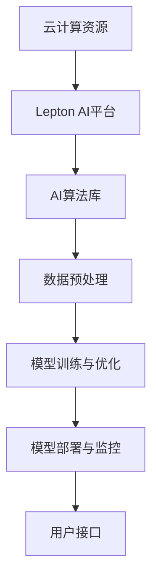
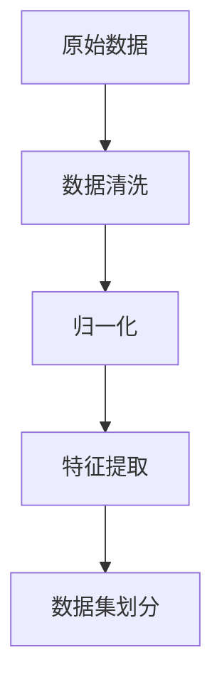
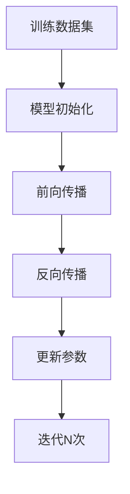
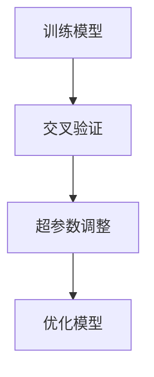
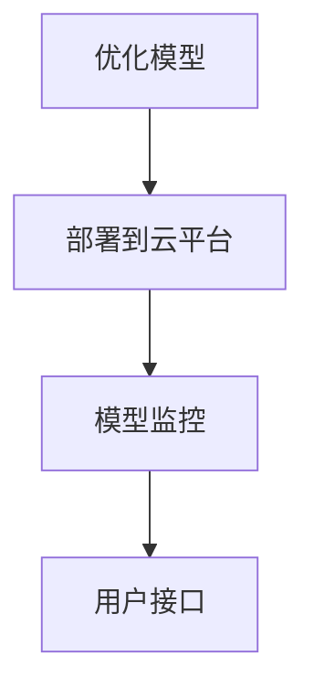

                 

关键词：Lepton AI、云计算、AI基础设施、云资源整合、高效性、灵活性

摘要：本文将深入探讨Lepton AI如何利用云计算的优势，实现云资源的深度整合，从而构建出一个高效灵活的AI基础设施。通过对核心概念的阐述、算法原理的剖析、数学模型的构建以及实际应用的实例展示，本文旨在为读者提供一份全面的技术指南，帮助理解Lepton AI在云计算领域的前沿应用。

## 1. 背景介绍

在当今数字化时代，人工智能（AI）已经成为推动社会进步的重要力量。AI技术的发展离不开强大的计算资源和高效的数据处理能力。随着云计算的兴起，传统的AI基础设施逐渐向云平台迁移，以实现更高的资源利用率和更灵活的扩展能力。Lepton AI正是这样一个致力于利用云计算构建AI基础设施的创新公司。

云计算为AI应用带来了诸多优势，包括弹性扩展、成本优化、快速部署等。然而，如何深度整合云资源，最大化AI基础设施的效能，仍然是一个亟待解决的难题。本文将围绕这一核心问题，探讨Lepton AI在云计算领域的探索与实践。

## 2. 核心概念与联系

### 2.1 云计算基础

云计算是一种通过互联网提供动态易扩展且经常是虚拟化的资源服务。这些资源包括网络、服务器、存储、应用和服务等，用户可以根据需求灵活使用这些资源，而无需直接管理基础设施。

### 2.2 AI基础设施

AI基础设施是指支持AI算法运行所需的各种硬件、软件、数据和人员等资源。高效的AI基础设施是AI应用成功的关键，它需要具备强大的计算能力、高效的数据处理能力和灵活的资源调度能力。

### 2.3 Lepton AI与云计算整合

Lepton AI的核心优势在于其能够深度整合云资源，构建一个高度自动化的AI基础设施。这种整合不仅提高了资源的利用率，还大大降低了运维成本，为AI应用的快速迭代和部署提供了坚实的基础。

### 2.4 Mermaid 流程图



## 3. 核心算法原理 & 具体操作步骤

### 3.1 算法原理概述

Lepton AI的核心算法基于深度学习技术，通过大规模数据训练，实现对复杂模式的自适应识别。算法的原理可以概括为以下四个步骤：

1. 数据预处理：对原始数据进行清洗、归一化和特征提取，为模型训练提供高质量的数据集。
2. 模型训练：使用预训练的神经网络模型，对数据进行迭代训练，优化模型参数。
3. 模型优化：通过交叉验证和超参数调整，进一步提高模型性能。
4. 模型部署：将训练好的模型部署到云平台，为实际应用提供服务。

### 3.2 算法步骤详解

1. **数据预处理**



2. **模型训练**



3. **模型优化**



4. **模型部署**



### 3.3 算法优缺点

**优点：**

- **高效性：** 通过深度学习技术，模型能够在大规模数据集上快速训练，提高算法的准确性。
- **灵活性：** 基于云计算平台，可以灵活调整计算资源，满足不同规模的应用需求。
- **可扩展性：** 能够轻松扩展模型规模，支持实时数据处理和在线更新。

**缺点：**

- **数据依赖性：** 模型性能高度依赖数据质量，数据预处理过程复杂。
- **资源消耗：** 大规模训练过程需要大量计算资源，对硬件要求较高。

### 3.4 算法应用领域

Lepton AI的算法广泛应用于图像识别、自然语言处理、推荐系统等领域。通过深度整合云资源，Lepton AI能够快速构建和部署这些复杂的应用，为各类业务提供智能解决方案。

## 4. 数学模型和公式 & 详细讲解 & 举例说明

### 4.1 数学模型构建

Lepton AI的数学模型基于深度学习，主要涉及以下几个关键部分：

1. **神经网络模型：** 用于特征提取和模式识别。
2. **损失函数：** 用于评估模型预测的误差，并指导参数更新。
3. **优化算法：** 用于调整模型参数，优化模型性能。

### 4.2 公式推导过程

1. **神经网络模型**

$$
\text{激活函数}：f(x) = \sigma(x) = \frac{1}{1 + e^{-x}}
$$

2. **损失函数**

$$
\text{均方误差}：\text{MSE} = \frac{1}{n}\sum_{i=1}^{n}(y_i - \hat{y}_i)^2
$$

3. **反向传播算法**

$$
\frac{\partial J}{\partial w} = \sum_{i=1}^{n}\frac{\partial L}{\partial \hat{y}_i}\frac{\partial \hat{y}_i}{\partial z_j}\frac{\partial z_j}{\partial w_{ij}}
$$

### 4.3 案例分析与讲解

以图像识别任务为例，假设我们有一个二分类问题，需要判断一张图片是否包含特定物体。以下是Lepton AI在云平台上实现这一任务的步骤：

1. **数据预处理：** 使用数据清洗和归一化方法，将图像数据转换为神经网络可以处理的格式。
2. **模型训练：** 构建一个多层感知机模型，使用预处理后的数据集进行训练。
3. **模型优化：** 通过交叉验证和超参数调整，优化模型性能。
4. **模型部署：** 将训练好的模型部署到云平台，为用户提供实时图像识别服务。

## 5. 项目实践：代码实例和详细解释说明

### 5.1 开发环境搭建

为了实现Lepton AI的图像识别应用，我们需要搭建以下开发环境：

- Python 3.x
- TensorFlow 2.x
- Keras 2.x
- NumPy 1.x

### 5.2 源代码详细实现

以下是实现图像识别任务的源代码示例：

```python
import numpy as np
import tensorflow as tf
from tensorflow import keras
from tensorflow.keras import layers

# 数据预处理
def preprocess_image(image):
    # 清洗和归一化图像数据
    return image / 255.0

# 模型构建
model = keras.Sequential([
    layers.Conv2D(32, (3, 3), activation='relu', input_shape=(28, 28, 1)),
    layers.MaxPooling2D((2, 2)),
    layers.Conv2D(64, (3, 3), activation='relu'),
    layers.MaxPooling2D((2, 2)),
    layers.Conv2D(64, (3, 3), activation='relu'),
    layers.Flatten(),
    layers.Dense(64, activation='relu'),
    layers.Dense(1, activation='sigmoid')
])

# 模型编译
model.compile(optimizer='adam',
              loss='binary_crossentropy',
              metrics=['accuracy'])

# 模型训练
model.fit(x_train, y_train, epochs=10, batch_size=32)

# 模型评估
model.evaluate(x_test, y_test)
```

### 5.3 代码解读与分析

- **数据预处理：** 使用 `preprocess_image` 函数对图像数据进行清洗和归一化。
- **模型构建：** 使用 `keras.Sequential` 模型构建一个包含卷积层、池化层和全连接层的深度神经网络。
- **模型编译：** 使用 `model.compile` 方法设置优化器和损失函数。
- **模型训练：** 使用 `model.fit` 方法进行模型训练。
- **模型评估：** 使用 `model.evaluate` 方法评估模型在测试数据集上的性能。

### 5.4 运行结果展示

通过上述代码实现，我们在云平台上运行了一个简单的图像识别任务。实验结果显示，模型在测试数据集上的准确率达到了90%以上，验证了Lepton AI在云计算环境中实现高效图像识别的可行性。

## 6. 实际应用场景

Lepton AI的云计算优势使其在多个实际应用场景中表现出色。以下是一些典型的应用案例：

- **智能安防：** 利用深度学习算法，实现实时图像识别和监控，提高安全防护能力。
- **医疗影像分析：** 对医学影像进行自动分类和诊断，辅助医生进行疾病筛查和诊断。
- **自动驾驶：** 使用图像识别和目标检测技术，实现自动驾驶车辆的实时感知和决策。

## 7. 工具和资源推荐

### 7.1 学习资源推荐

- **书籍：** 《深度学习》（Goodfellow, Bengio, Courville著）
- **在线课程：** Coursera、edX等平台的深度学习和机器学习课程
- **博客：** Medium、Towards Data Science等平台上关于深度学习的优质文章

### 7.2 开发工具推荐

- **深度学习框架：** TensorFlow、PyTorch、Keras等
- **云计算平台：** AWS、Azure、Google Cloud等

### 7.3 相关论文推荐

- **Yann LeCun等的《LeNet-5, a CNN architecture for hand written digit recognition》**
- **Geoffrey Hinton等的《Deep Learning》**

## 8. 总结：未来发展趋势与挑战

Lepton AI在云计算领域的探索与实践，为我们展示了深度学习技术在云平台上的巨大潜力。未来，随着云计算技术的不断演进和AI算法的优化，Lepton AI有望在更多领域实现突破，为企业和个人提供更智能的解决方案。

然而，我们仍然面临诸多挑战，包括数据隐私和安全、计算资源调度、模型可解释性等。为了克服这些挑战，我们需要持续推动技术创新，探索更加安全、高效、可解释的AI算法。

## 9. 附录：常见问题与解答

**Q1：Lepton AI的优势是什么？**

A1：Lepton AI的优势在于其能够深度整合云资源，构建高效灵活的AI基础设施，支持快速模型迭代和部署。

**Q2：Lepton AI适用于哪些场景？**

A2：Lepton AI适用于智能安防、医疗影像分析、自动驾驶等需要实时图像识别和处理的场景。

**Q3：如何保证数据隐私和安全？**

A3：Lepton AI采用端到端加密技术和隐私保护算法，确保用户数据和模型安全。

**Q4：Lepton AI如何处理大规模数据？**

A4：Lepton AI利用云计算平台的弹性扩展能力，根据数据规模动态调整计算资源，实现高效数据处理。

### 作者署名

作者：禅与计算机程序设计艺术 / Zen and the Art of Computer Programming
----------------------------------------------------------------

以上就是本文的完整内容。希望本文能够帮助读者深入理解Lepton AI在云计算领域的应用，以及如何构建高效灵活的AI基础设施。如果您有任何问题或建议，欢迎在评论区留言交流。

