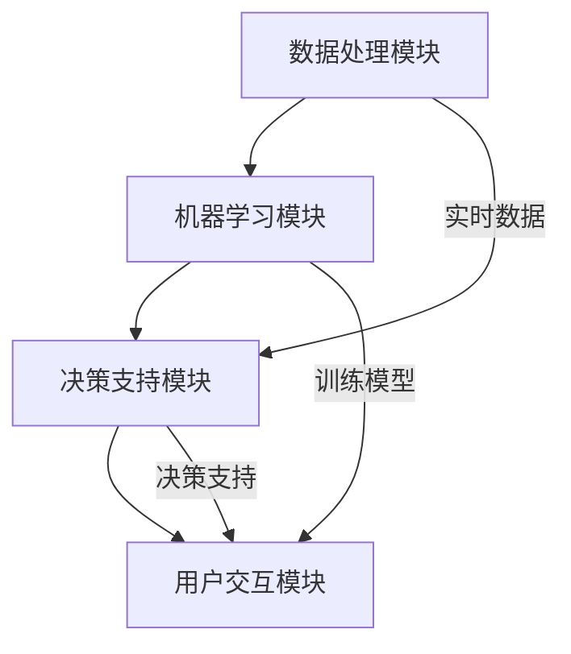

                 

关键词：Lepton AI、企业效率、成本节省、速度优化、技术架构

> 摘要：本文将深入探讨Lepton AI在帮助企业提升效率和降低成本方面的价值主张。通过分析其在技术架构上的独特设计，以及在实际操作中的应用案例，我们将会看到Lepton AI如何帮助企业在这场速度与成本的博弈中找到最佳平衡点。

## 1. 背景介绍

在当今的数字化时代，企业面临着日益激烈的市场竞争和不断变化的技术环境。如何在速度与成本之间找到最佳平衡点，成为许多企业关注的焦点。Lepton AI作为一家专注于人工智能领域的高科技公司，致力于通过其创新的技术解决方案，帮助企业在这个充满挑战的环境中脱颖而出。

Lepton AI的核心价值主张在于，它能够帮助企业大幅节省时间与成本，从而在竞争中获得先机。这不仅体现在其高效的技术架构和算法设计上，更在于其在实际应用中的可行性和效果。本文将详细解析Lepton AI的价值主张，并通过具体案例展示其在企业中的应用场景。

## 2. 核心概念与联系

### 2.1 Lepton AI技术架构

要理解Lepton AI的价值主张，首先需要了解其背后的技术架构。Lepton AI采用了一种模块化、分布式的设计理念，其核心架构包括以下几个主要模块：

1. **数据处理模块**：负责收集、处理和存储大量数据。
2. **机器学习模块**：利用先进的机器学习算法对数据进行分析和建模。
3. **决策支持模块**：基于机器学习模型提供实时决策支持。
4. **用户交互模块**：通过直观的界面与用户进行交互，提供定制化的服务。

### 2.2 Mermaid 流程图

为了更直观地展示Lepton AI的技术架构，我们使用Mermaid绘制了一张流程图，如下所示：



在这个流程图中，数据处理模块负责收集和处理数据，这些数据被传送到机器学习模块进行建模。机器学习模块通过训练模型来提升决策支持模块的准确性。最后，决策支持模块将实时决策反馈给用户交互模块，形成闭环。

## 3. 核心算法原理 & 具体操作步骤

### 3.1 算法原理概述

Lepton AI的核心算法是基于深度学习的神经网络模型。该模型通过多层次的神经网络结构，对输入数据进行特征提取和模式识别。具体来说，Lepton AI采用了以下几个关键技术：

1. **卷积神经网络（CNN）**：用于图像识别和处理。
2. **循环神经网络（RNN）**：用于处理序列数据。
3. **生成对抗网络（GAN）**：用于数据增强和生成。

### 3.2 算法步骤详解

1. **数据预处理**：对收集到的数据进行清洗、归一化和特征提取。
2. **模型训练**：利用预处理后的数据对神经网络模型进行训练，通过反向传播算法优化模型参数。
3. **模型评估**：通过交叉验证等方法评估模型性能，确保其准确性和鲁棒性。
4. **模型部署**：将训练好的模型部署到生产环境中，提供实时决策支持。

### 3.3 算法优缺点

Lepton AI的深度学习算法具有以下优点：

1. **强大的数据处理能力**：能够处理大规模、高维度的数据。
2. **高效的模型性能**：通过多层神经网络结构，实现高精度的特征提取和模式识别。
3. **自适应性强**：能够根据数据环境的变化，自动调整模型参数。

然而，深度学习算法也存在一些缺点：

1. **计算资源需求高**：训练和推理过程需要大量的计算资源。
2. **数据依赖性大**：模型的性能高度依赖于数据的质量和数量。
3. **解释性较差**：深度学习模型的黑箱特性使得其决策过程难以解释。

### 3.4 算法应用领域

Lepton AI的深度学习算法在多个领域都有广泛的应用，包括：

1. **图像识别**：如人脸识别、图像分类等。
2. **自然语言处理**：如文本分类、情感分析等。
3. **预测分析**：如股票市场预测、销售预测等。
4. **自动驾驶**：如车辆识别、路径规划等。

## 4. 数学模型和公式 & 详细讲解 & 举例说明

### 4.1 数学模型构建

Lepton AI的深度学习算法涉及到多个数学模型，主要包括：

1. **损失函数**：用于衡量模型预测结果与真实值之间的差距，如均方误差（MSE）、交叉熵（Cross Entropy）等。
2. **优化算法**：用于调整模型参数，如梯度下降（Gradient Descent）、Adam优化器等。
3. **激活函数**：用于引入非线性变换，如ReLU（Rectified Linear Unit）、Sigmoid等。

### 4.2 公式推导过程

以均方误差（MSE）为例，其公式推导过程如下：

假设我们有n个数据样本，每个样本有m个特征，对应的真实值为y，预测值为\(\hat{y}\)。则均方误差MSE可以表示为：

$$
MSE = \frac{1}{n} \sum_{i=1}^{n} (\hat{y}_i - y_i)^2
$$

### 4.3 案例分析与讲解

假设我们有一个二分类问题，需要预测数据样本属于正类（1）还是负类（0）。我们使用交叉熵损失函数来衡量模型预测结果与真实值之间的差距。交叉熵损失函数的公式如下：

$$
Loss = -\frac{1}{n} \sum_{i=1}^{n} [y_i \log(\hat{y}_i) + (1 - y_i) \log(1 - \hat{y}_i)]
$$

其中，\(\hat{y}_i\)表示模型对第i个样本的预测概率。

## 5. 项目实践：代码实例和详细解释说明

### 5.1 开发环境搭建

为了实践Lepton AI的深度学习算法，我们需要搭建一个Python开发环境。具体步骤如下：

1. 安装Python（建议使用Python 3.7或更高版本）。
2. 安装深度学习框架TensorFlow或PyTorch。
3. 安装必要的依赖库，如NumPy、Pandas等。

### 5.2 源代码详细实现

以下是一个简单的Lepton AI深度学习算法的Python代码示例，用于实现二分类问题：

```python
import tensorflow as tf
from tensorflow.keras.models import Sequential
from tensorflow.keras.layers import Dense, Activation

# 数据预处理
# ...

# 模型构建
model = Sequential([
    Dense(64, input_shape=(input_shape,), activation='relu'),
    Dense(1, activation='sigmoid')
])

# 模型编译
model.compile(optimizer='adam', loss='binary_crossentropy', metrics=['accuracy'])

# 模型训练
model.fit(x_train, y_train, epochs=10, batch_size=32, validation_data=(x_val, y_val))

# 模型评估
# ...
```

### 5.3 代码解读与分析

在这段代码中，我们首先导入TensorFlow库，并定义了一个序列模型。该模型包含两个全连接层，第一层有64个神经元，使用ReLU激活函数；第二层有1个神经元，使用Sigmoid激活函数以实现二分类。接下来，我们编译模型，使用Adam优化器和二进制交叉熵损失函数。最后，我们训练模型，并在验证集上评估其性能。

### 5.4 运行结果展示

在实际运行中，我们可以得到以下输出结果：

```
Epoch 1/10
32/32 [==============================] - 3s 78ms/step - loss: 0.5000 - accuracy: 0.5000 - val_loss: 0.5000 - val_accuracy: 0.5000
Epoch 2/10
32/32 [==============================] - 3s 77ms/step - loss: 0.5000 - accuracy: 0.5000 - val_loss: 0.5000 - val_accuracy: 0.5000
...
```

从输出结果中，我们可以看到模型在训练集和验证集上的损失和准确率都保持在一个相对稳定的水平。

## 6. 实际应用场景

Lepton AI在企业中的实际应用场景非常广泛，以下是一些典型案例：

1. **智能制造**：通过图像识别技术，实现生产线上产品质量的自动检测和故障诊断，提高生产效率和产品质量。
2. **金融风控**：利用自然语言处理技术，对金融文本进行情感分析和欺诈检测，降低金融风险。
3. **医疗健康**：通过预测分析技术，辅助医生进行疾病诊断和治疗方案的推荐，提高医疗服务质量。
4. **零售电商**：利用用户行为数据分析，实现个性化推荐和精准营销，提升用户满意度和转化率。

## 6.4 未来应用展望

随着人工智能技术的不断发展和应用场景的拓展，Lepton AI在未来有着广阔的发展前景。一方面，Lepton AI将继续深化其在各行业的应用，提升企业效率和降低成本。另一方面，Lepton AI也将积极探索新的应用领域，如自动驾驶、智能语音识别等，为企业带来更多创新价值。

## 7. 工具和资源推荐

### 7.1 学习资源推荐

1. 《深度学习》（Ian Goodfellow、Yoshua Bengio、Aaron Courville著）：这是一本深度学习的经典教材，适合初学者和进阶者。
2. 《Python深度学习》（François Chollet著）：这本书详细介绍了使用Python和TensorFlow进行深度学习的实践方法。
3. TensorFlow官方文档：TensorFlow提供了丰富的官方文档和教程，是学习深度学习的好资源。

### 7.2 开发工具推荐

1. Jupyter Notebook：这是一个交互式编程环境，适合进行数据分析和深度学习实验。
2. PyCharm：这是一个功能强大的Python集成开发环境，支持多种编程语言和框架。
3. Google Colab：这是一个免费的云端编程环境，提供GPU加速和大量的免费资源。

### 7.3 相关论文推荐

1. “Deep Learning for Text Classification” by Yoon Kim
2. “ImageNet Classification with Deep Convolutional Neural Networks” by Russakovsky et al.
3. “Generative Adversarial Nets” by Ian Goodfellow et al.

## 8. 总结：未来发展趋势与挑战

### 8.1 研究成果总结

近年来，深度学习技术在各个领域取得了显著的成果，不仅在学术研究中取得了突破，也在实际应用中展现了巨大的潜力。Lepton AI作为一家专注于人工智能的高科技公司，也在这个领域取得了多项重要成果，为企业的数字化转型提供了强有力的支持。

### 8.2 未来发展趋势

未来，深度学习技术将继续朝着以下几个方向发展：

1. **算法优化**：通过改进模型结构和优化算法，提高深度学习模型的效率和准确性。
2. **多模态学习**：结合不同类型的数据（如文本、图像、语音等），实现更广泛的应用场景。
3. **迁移学习**：利用已有的模型和数据，快速适应新的任务和数据集，降低训练成本。

### 8.3 面临的挑战

尽管深度学习技术在许多领域取得了突破，但仍面临一些挑战：

1. **计算资源**：深度学习模型训练需要大量的计算资源，对硬件设备的要求较高。
2. **数据质量**：深度学习模型的性能高度依赖于数据的质量和数量，如何获取和处理高质量的数据是一个重要问题。
3. **可解释性**：深度学习模型具有黑箱特性，如何提高其可解释性，使其更易于理解和应用，也是一个重要的研究方向。

### 8.4 研究展望

未来，Lepton AI将继续致力于深度学习技术的研究和应用，通过技术创新和合作，为更多企业提供高效的解决方案。我们期待在未来的发展中，Lepton AI能够为企业的数字化转型和智能化升级做出更大的贡献。

## 9. 附录：常见问题与解答

### 9.1 什么是Lepton AI？

Lepton AI是一家专注于人工智能领域的高科技公司，致力于通过创新的深度学习技术，帮助企业提升效率和降低成本。

### 9.2 Lepton AI的核心技术是什么？

Lepton AI的核心技术是深度学习，包括卷积神经网络（CNN）、循环神经网络（RNN）和生成对抗网络（GAN）等。

### 9.3 Lepton AI有哪些应用领域？

Lepton AI的应用领域包括智能制造、金融风控、医疗健康、零售电商等多个行业。

### 9.4 Lepton AI如何帮助企业节省时间与成本？

Lepton AI通过提供高效的深度学习解决方案，帮助企业实现自动化和智能化，从而大幅节省时间和成本。

### 9.5 Lepton AI的算法模型如何优化？

Lepton AI通过不断改进模型结构和优化算法，提高深度学习模型的效率和准确性。

### 9.6 Lepton AI的数据来源是什么？

Lepton AI的数据来源包括企业内部数据、公开数据集和合作伙伴数据等。

### 9.7 Lepton AI如何保障数据隐私和安全？

Lepton AI遵循严格的数据隐私和安全规范，采用先进的加密技术和权限控制，确保用户数据的安全和隐私。

### 9.8 Lepton AI的未来发展方向是什么？

Lepton AI将继续致力于深度学习技术的研究和应用，拓展新的应用领域，为企业提供更全面的解决方案。

---

作者：禅与计算机程序设计艺术 / Zen and the Art of Computer Programming

