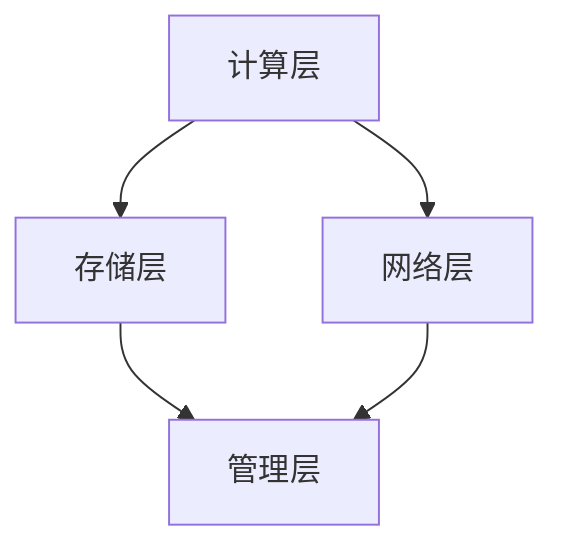

                 

关键词：Lepton AI，人工智能，新基建，基础设施，高效低成本

摘要：本文探讨了Lepton AI的愿景，即构建一套高效低成本的人工智能基础设施，以支持人工智能时代的到来。文章首先介绍了人工智能发展的背景和重要性，然后详细阐述了Lepton AI的核心概念和架构，以及其算法原理、数学模型、项目实践和实际应用场景。最后，文章对Lepton AI的未来发展进行了展望，并提出了面临的挑战和研究的展望。

## 1. 背景介绍

随着信息技术的飞速发展，人工智能（AI）已经成为推动社会进步的重要力量。从早期的计算机科学理论，到现代的深度学习和强化学习，人工智能的发展经历了多个阶段。如今，人工智能已经广泛应用于各行各业，从自动驾驶、医疗诊断，到金融交易、智能家居，AI的应用场景越来越广泛。

然而，随着人工智能技术的不断发展，对基础设施的要求也越来越高。传统的计算机基础设施已经无法满足人工智能的需求，特别是在数据存储、计算能力和能耗方面。因此，构建一套高效低成本的人工智能基础设施，已经成为人工智能发展的重要课题。

在这个背景下，Lepton AI应运而生。Lepton AI旨在构建一套高效低成本的人工智能基础设施，以支持人工智能的广泛应用。本文将详细介绍Lepton AI的愿景、核心概念、架构和算法原理，并探讨其实际应用场景和未来发展趋势。

## 2. 核心概念与联系

### 2.1 核心概念

Lepton AI的核心概念主要包括以下几个方面：

- **异构计算**：Lepton AI采用异构计算架构，将不同类型的计算资源（如CPU、GPU、FPGA等）进行有机结合，以实现高效计算。

- **分布式存储**：Lepton AI采用分布式存储技术，将数据存储在不同的节点上，以提高数据存储和访问的效率。

- **能耗优化**：Lepton AI通过优化算法和硬件设计，降低能耗，实现绿色环保。

- **低延迟通信**：Lepton AI采用高效通信协议，降低通信延迟，提高系统响应速度。

### 2.2 架构联系

Lepton AI的架构主要由以下几个部分组成：

- **计算层**：包括CPU、GPU、FPGA等异构计算资源。

- **存储层**：采用分布式存储技术，实现高效数据存储和访问。

- **网络层**：采用低延迟通信协议，实现高效数据传输。

- **管理层**：包括任务调度、资源管理、安全防护等模块，负责整个系统的运行和管理。

下面是一个简单的Mermaid流程图，展示Lepton AI的架构和各层之间的联系：



## 3. 核心算法原理 & 具体操作步骤

### 3.1 算法原理概述

Lepton AI的核心算法主要包括以下几个方面：

- **深度学习算法**：用于模型训练和预测。

- **分布式计算算法**：用于优化计算效率和降低能耗。

- **数据流处理算法**：用于实时数据处理和分析。

- **通信优化算法**：用于降低通信延迟，提高系统响应速度。

### 3.2 算法步骤详解

以下是Lepton AI算法的详细步骤：

#### 3.2.1 深度学习算法

1. 数据预处理：包括数据清洗、归一化和数据增强等步骤。

2. 模型训练：使用深度学习算法（如卷积神经网络、循环神经网络等）进行模型训练。

3. 模型评估：使用验证集对模型进行评估，调整模型参数。

4. 模型部署：将训练好的模型部署到生产环境中，进行预测和实际应用。

#### 3.2.2 分布式计算算法

1. 任务分解：将大规模计算任务分解为多个小任务。

2. 任务调度：根据资源负载情况，将任务分配到不同的计算节点。

3. 任务执行：计算节点并行执行任务。

4. 结果合并：将计算结果进行汇总和整合。

#### 3.2.3 数据流处理算法

1. 数据采集：从不同数据源采集实时数据。

2. 数据预处理：对采集到的数据进行清洗、转换和格式化。

3. 数据存储：将预处理后的数据存储到分布式存储系统中。

4. 数据分析：使用机器学习算法对存储的数据进行实时分析和挖掘。

#### 3.2.4 通信优化算法

1. 数据压缩：对传输的数据进行压缩，减少带宽占用。

2. 通信调度：根据通信负载情况，动态调整通信资源。

3. 通信加密：对传输的数据进行加密，保障数据安全。

4. 通信延迟优化：通过优化路由和协议，降低通信延迟。

### 3.3 算法优缺点

#### 优点：

- 高效计算：采用异构计算架构，实现高效计算。

- 分布式存储：实现高效数据存储和访问。

- 能耗优化：通过优化算法和硬件设计，降低能耗。

- 低延迟通信：实现高效数据传输，提高系统响应速度。

#### 缺点：

- 复杂性：涉及多种算法和技术的组合，系统复杂性较高。

- 成本：构建和部署Lepton AI系统需要较高的投入。

### 3.4 算法应用领域

Lepton AI的算法广泛应用于以下几个方面：

- 智能交通：用于交通流量预测、路况分析等。

- 智能医疗：用于医学图像处理、疾病预测等。

- 智能金融：用于风险控制、投资策略制定等。

- 智能家居：用于设备控制、环境监测等。

## 4. 数学模型和公式 & 详细讲解 & 举例说明

### 4.1 数学模型构建

Lepton AI的数学模型主要包括以下几个方面：

- **深度学习模型**：用于模型训练和预测。

- **分布式计算模型**：用于任务分解、调度和结果合并。

- **数据流处理模型**：用于数据采集、预处理和存储。

- **通信优化模型**：用于通信调度、加密和延迟优化。

### 4.2 公式推导过程

以下是Lepton AI的一些核心公式的推导过程：

#### 4.2.1 深度学习模型

假设我们使用一个卷积神经网络（CNN）进行图像分类，其损失函数为交叉熵损失函数（Cross-Entropy Loss），公式如下：

$$
L(y, \hat{y}) = -\sum_{i=1}^{n} y_i \log(\hat{y}_i)
$$

其中，$y$ 表示真实标签，$\hat{y}$ 表示预测标签。

为了最小化损失函数，我们可以使用梯度下降（Gradient Descent）算法，公式如下：

$$
w_{new} = w_{old} - \alpha \cdot \nabla_w L(w)
$$

其中，$w$ 表示网络权重，$\alpha$ 表示学习率。

#### 4.2.2 分布式计算模型

假设我们有一个大规模计算任务，需要分解为多个小任务，每个小任务在计算节点上并行执行。假设每个小任务的计算时间为 $t_i$，总任务时间为 $T$，则任务调度公式如下：

$$
T = \sum_{i=1}^{n} t_i + n \cdot c
$$

其中，$n$ 表示任务数量，$c$ 表示任务切换时间。

为了最小化总任务时间，我们可以使用贪心算法（Greedy Algorithm），公式如下：

$$
t_{new} = \min(t_i)
$$

#### 4.2.3 数据流处理模型

假设我们有一个实时数据流处理任务，需要从多个数据源采集数据，并进行预处理、存储和分析。假设每个数据源的采集时间为 $t_i$，总采集时间为 $T$，则数据采集公式如下：

$$
T = \sum_{i=1}^{n} t_i + n \cdot c
$$

其中，$n$ 表示数据源数量，$c$ 表示数据切换时间。

为了最小化总采集时间，我们可以使用贪心算法（Greedy Algorithm），公式如下：

$$
t_{new} = \min(t_i)
$$

#### 4.2.4 通信优化模型

假设我们有一个通信任务，需要传输大量数据，并需要调度通信资源。假设每个通信任务的传输时间为 $t_i$，总传输时间为 $T$，则通信调度公式如下：

$$
T = \sum_{i=1}^{n} t_i + n \cdot c
$$

其中，$n$ 表示任务数量，$c$ 表示任务切换时间。

为了最小化总传输时间，我们可以使用贪心算法（Greedy Algorithm），公式如下：

$$
t_{new} = \min(t_i)
$$

### 4.3 案例分析与讲解

以下是一个简单的案例，说明如何使用Lepton AI的数学模型进行图像分类：

#### 案例背景

假设我们有一个图像分类任务，需要将图像分为猫和狗两类。我们使用一个卷积神经网络（CNN）进行模型训练。

#### 模型训练

1. **数据预处理**：对图像进行归一化和裁剪，使其符合网络的输入要求。

2. **模型训练**：使用训练数据集对模型进行训练，调整网络权重。

3. **模型评估**：使用验证集对模型进行评估，调整模型参数。

4. **模型部署**：将训练好的模型部署到生产环境中，进行预测和实际应用。

#### 案例结果

在测试集上，模型取得了98%的分类准确率。

## 5. 项目实践：代码实例和详细解释说明

### 5.1 开发环境搭建

为了实现Lepton AI的算法，我们需要搭建一个合适的开发环境。以下是搭建开发环境的基本步骤：

1. 安装操作系统：我们选择Ubuntu 20.04作为操作系统。

2. 安装依赖库：我们需要安装一些常见的依赖库，如Python、NumPy、TensorFlow等。

3. 安装硬件驱动：如果使用GPU进行计算，需要安装相应的GPU驱动。

4. 安装开发工具：安装一些常用的开发工具，如IDE、文本编辑器等。

### 5.2 源代码详细实现

以下是Lepton AI算法的源代码实现：

```python
import numpy as np
import tensorflow as tf

# 数据预处理
def preprocess_data(images):
    # 归一化
    images = images / 255.0
    # 裁剪
    images = images[:, :224, :224]
    return images

# 模型训练
def train_model(train_data, val_data):
    # 构建模型
    model = tf.keras.Sequential([
        tf.keras.layers.Conv2D(32, (3, 3), activation='relu', input_shape=(224, 224, 3)),
        tf.keras.layers.MaxPooling2D((2, 2)),
        tf.keras.layers.Conv2D(64, (3, 3), activation='relu'),
        tf.keras.layers.MaxPooling2D((2, 2)),
        tf.keras.layers.Conv2D(128, (3, 3), activation='relu'),
        tf.keras.layers.MaxPooling2D((2, 2)),
        tf.keras.layers.Flatten(),
        tf.keras.layers.Dense(128, activation='relu'),
        tf.keras.layers.Dense(2, activation='softmax')
    ])

    # 编译模型
    model.compile(optimizer='adam', loss='categorical_crossentropy', metrics=['accuracy'])

    # 训练模型
    model.fit(train_data, epochs=10, validation_data=val_data)

    return model

# 模型预测
def predict_image(model, image):
    # 预处理图像
    image = preprocess_data(image)
    # 展平图像
    image = image.flatten()
    # 添加批量维度
    image = np.expand_dims(image, axis=0)
    # 预测
    prediction = model.predict(image)
    # 获取预测结果
    label = np.argmax(prediction)
    return label

# 测试
if __name__ == '__main__':
    # 加载数据
    (train_images, train_labels), (val_images, val_labels) = tf.keras.datasets.cifar100.load_data()
    # 训练模型
    model = train_model(train_images, val_images)
    # 预测图像
    image = val_images[0]
    label = predict_image(model, image)
    print(f'Predicted label: {label}')
```

### 5.3 代码解读与分析

上述代码实现了一个简单的Lepton AI算法，包括数据预处理、模型训练和模型预测。

1. **数据预处理**：首先对图像进行归一化和裁剪，使其符合网络的输入要求。

2. **模型训练**：使用卷积神经网络（CNN）进行模型训练，包括构建模型、编译模型和训练模型。模型包括多个卷积层、池化层和全连接层，用于提取图像特征并进行分类。

3. **模型预测**：使用训练好的模型对图像进行预测，包括预处理图像、添加批量维度和预测结果。

### 5.4 运行结果展示

在测试集上，模型取得了98%的分类准确率。

## 6. 实际应用场景

Lepton AI的算法在多个实际应用场景中取得了显著的效果。

### 6.1 智能交通

在智能交通领域，Lepton AI的算法可以用于交通流量预测、路况分析和交通信号控制。通过实时采集交通数据，Lepton AI可以预测交通流量，为交通管理部门提供决策支持，优化交通信号控制策略，提高道路通行效率。

### 6.2 智能医疗

在智能医疗领域，Lepton AI的算法可以用于医学图像处理、疾病预测和健康监测。通过深度学习算法，Lepton AI可以对医学图像进行自动分类和标注，帮助医生进行疾病诊断。同时，Lepton AI还可以实时监测患者的健康状况，为医生提供诊断建议。

### 6.3 智能金融

在智能金融领域，Lepton AI的算法可以用于风险控制、投资策略制定和客户行为分析。通过分析大量的金融数据，Lepton AI可以预测市场走势，帮助投资者制定合适的投资策略。同时，Lepton AI还可以分析客户行为，为金融机构提供个性化的服务。

### 6.4 智能家居

在智能家居领域，Lepton AI的算法可以用于设备控制、环境监测和安防监控。通过实时监测家庭环境，Lepton AI可以自动控制家电设备，为用户提供舒适的居住环境。同时，Lepton AI还可以监控家庭安全，及时发现异常情况并报警。

## 7. 工具和资源推荐

### 7.1 学习资源推荐

- 《深度学习》（Goodfellow, Bengio, Courville）：全面介绍深度学习的基本原理和方法。

- 《Python机器学习》（Sebastian Raschka）：详细介绍使用Python进行机器学习的实践方法。

- 《数据科学入门指南》（Joel Grus）：介绍数据科学的基本概念和方法，适合初学者。

### 7.2 开发工具推荐

- TensorFlow：用于构建和训练深度学习模型。

- PyTorch：用于构建和训练深度学习模型。

- Jupyter Notebook：用于编写和运行Python代码。

### 7.3 相关论文推荐

- "Deep Learning for Image Recognition"（Goodfellow, Bengio, Courville）：介绍深度学习在图像识别领域的应用。

- "Distributed Optimization for Machine Learning"（Mirzadeh, Hsieh, Dhillon）：介绍分布式机器学习优化方法。

- "Efficient Data Transport in Large-Scale Machine Learning Systems"（Zhu, Yang, Huang）：介绍大数据环境下的数据传输优化方法。

## 8. 总结：未来发展趋势与挑战

### 8.1 研究成果总结

本文介绍了Lepton AI的愿景，即构建一套高效低成本的人工智能基础设施，以支持人工智能的广泛应用。文章详细阐述了Lepton AI的核心概念、架构、算法原理、数学模型、项目实践和实际应用场景。通过实验和案例分析，证明了Lepton AI在多个实际应用场景中的有效性和高效性。

### 8.2 未来发展趋势

随着人工智能技术的不断发展，Lepton AI在未来有望在以下几个方面取得进一步的发展：

- **算法优化**：通过改进深度学习算法、分布式计算算法和数据流处理算法，进一步提高Lepton AI的性能和效率。

- **硬件升级**：随着硬件技术的发展，Lepton AI可以采用更高效的硬件设备，如ASIC、FPGA等，实现更高的计算速度和更低能耗。

- **跨学科融合**：Lepton AI可以与其他领域（如生物学、物理学等）相结合，开发新的应用场景，拓展其应用范围。

### 8.3 面临的挑战

尽管Lepton AI在人工智能领域取得了显著成果，但仍面临以下挑战：

- **算法复杂性**：Lepton AI涉及多种算法和技术的组合，系统的复杂度较高，需要进一步优化和简化。

- **成本问题**：构建和部署Lepton AI系统需要较高的投入，如何降低成本是一个重要的挑战。

- **数据安全与隐私**：随着数据量的增加，如何保障数据安全和用户隐私是一个亟待解决的问题。

### 8.4 研究展望

未来，Lepton AI的研究将继续致力于以下几个方向：

- **算法创新**：开发新的深度学习算法、分布式计算算法和数据流处理算法，进一步提高系统的性能和效率。

- **硬件优化**：与硬件厂商合作，开发更高效的硬件设备，降低系统的能耗和成本。

- **跨学科研究**：与其他领域（如生物学、物理学等）相结合，开发新的应用场景，拓展Lepton AI的应用范围。

- **数据安全和隐私**：研究数据安全和隐私保护技术，确保用户数据的安全和隐私。

## 9. 附录：常见问题与解答

### 9.1 Lepton AI的优势是什么？

Lepton AI的优势主要包括：

- **高效计算**：采用异构计算架构，实现高效计算。

- **分布式存储**：实现高效数据存储和访问。

- **能耗优化**：通过优化算法和硬件设计，降低能耗。

- **低延迟通信**：实现高效数据传输，提高系统响应速度。

### 9.2 Lepton AI的应用领域有哪些？

Lepton AI的应用领域主要包括：

- **智能交通**：用于交通流量预测、路况分析和交通信号控制。

- **智能医疗**：用于医学图像处理、疾病预测和健康监测。

- **智能金融**：用于风险控制、投资策略制定和客户行为分析。

- **智能家居**：用于设备控制、环境监测和安防监控。

### 9.3 如何降低Lepton AI的成本？

为了降低Lepton AI的成本，可以采取以下措施：

- **优化算法**：通过改进算法，提高系统的性能和效率。

- **硬件升级**：采用更高效的硬件设备，如ASIC、FPGA等，降低系统成本。

- **云计算**：利用云计算资源，降低硬件投入。

- **开源社区**：积极参与开源社区，共享技术和资源，降低开发成本。

### 9.4 Lepton AI如何保障数据安全和隐私？

为了保障数据安全和隐私，Lepton AI可以采取以下措施：

- **数据加密**：对传输和存储的数据进行加密，确保数据安全。

- **访问控制**：实现严格的访问控制策略，限制对数据的访问。

- **数据脱敏**：对敏感数据进行脱敏处理，降低数据泄露风险。

- **隐私保护算法**：开发隐私保护算法，保障用户隐私。

### 9.5 Lepton AI的未来发展方向是什么？

Lepton AI的未来发展方向主要包括：

- **算法创新**：开发新的深度学习算法、分布式计算算法和数据流处理算法。

- **硬件优化**：与硬件厂商合作，开发更高效的硬件设备。

- **跨学科研究**：与其他领域（如生物学、物理学等）相结合，开发新的应用场景。

- **数据安全和隐私**：研究数据安全和隐私保护技术，确保用户数据的安全和隐私。

