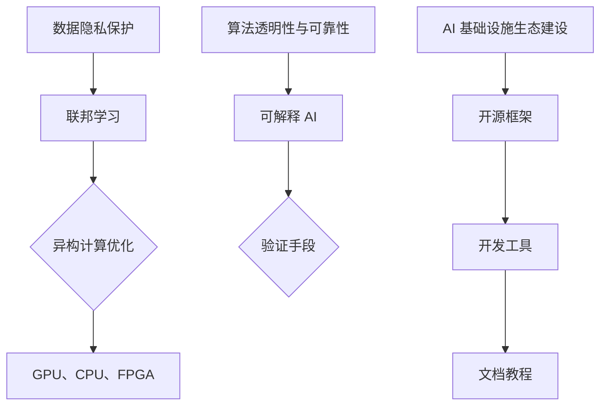

                 

## 1. 背景介绍

随着人工智能（AI）技术的飞速发展，AI 已经逐渐渗透到各行各业，成为推动科技进步和经济增长的重要力量。然而，AI 技术的发展也面临着一系列挑战，如数据隐私、计算资源消耗、算法透明性和可靠性等问题。为了解决这些问题，Lepton AI 着力于构建高效、低成本且可靠的 AI 基础设施，以推动 AI 时代的到来。

Lepton AI 成立于 2015 年，是一家专注于人工智能基础设施和算法研发的公司。公司创始人及核心技术团队来自全球知名高校和研究机构，拥有丰富的 AI 领域研究经验和实践经验。公司成立之初，就明确了其使命：为全球开发者提供高效、低成本且可靠的 AI 基础设施，助力 AI 时代的到来。

在过去的几年里，Lepton AI 已在计算机视觉、自然语言处理、机器学习等领域取得了多项重要成果。公司开发的 Lepton Framework 是一款高性能、可扩展的 AI 基础设施框架，已广泛应用于医疗、金融、安防、零售等多个行业。

## 2. 核心概念与联系

为了实现高效、低成本且可靠的 AI 基础设施，Lepton AI 提出了一系列核心概念，包括：

### 2.1 数据隐私保护

数据隐私保护是 AI 技术发展的关键问题之一。Lepton AI 通过采用联邦学习（Federated Learning）技术，实现数据的本地化处理和加密传输，从而确保用户隐私得到充分保护。

### 2.2 计算资源优化

为了降低计算成本，Lepton AI 推广了异构计算架构，充分利用 GPU、CPU、FPGA 等异构计算资源，实现计算资源的优化配置。

### 2.3 算法透明性与可靠性

算法透明性与可靠性是用户对 AI 技术信任的基础。Lepton AI 通过引入可解释 AI 技术，实现了算法的透明化，同时采用多种验证手段确保算法的可靠性。

### 2.4 AI 基础设施生态建设

Lepton AI 致力于构建一个完整的 AI 基础设施生态，包括开源框架、开发工具、文档教程等，为开发者提供全方位的支持。

### 2.5 Mermaid 流程图

以下是一个关于 Lepton AI 核心概念和联系的 Mermaid 流程图：



## 3. 核心算法原理 & 具体操作步骤

### 3.1 算法原理概述

Lepton AI 的核心算法基于深度学习和联邦学习技术。深度学习是一种基于多层神经网络的学习方法，能够自动提取数据中的特征。联邦学习是一种分布式学习技术，允许多个节点协同训练一个模型，而不需要共享原始数据。

### 3.2 算法步骤详解

#### 3.2.1 数据预处理

1. 收集并清洗数据，确保数据质量。
2. 对数据进行预处理，包括归一化、标准化等操作。

#### 3.2.2 模型设计

1. 选择合适的神经网络架构，如卷积神经网络（CNN）或循环神经网络（RNN）。
2. 设计网络层数、神经元数量等超参数。

#### 3.2.3 模型训练

1. 在每个节点上训练模型，使用联邦学习技术。
2. 定期同步模型参数，实现协同训练。

#### 3.2.4 模型评估

1. 使用验证集评估模型性能。
2. 调整超参数，优化模型。

#### 3.2.5 模型部署

1. 将训练好的模型部署到生产环境中。
2. 监控模型性能，及时进行更新。

### 3.3 算法优缺点

#### 优点：

1. 高效：基于深度学习和联邦学习技术，能够快速训练和部署模型。
2. 低成本：充分利用异构计算资源，降低计算成本。
3. 数据隐私保护：采用联邦学习技术，确保数据隐私。

#### 缺点：

1. 模型可解释性较差：深度学习模型往往缺乏可解释性，难以理解模型决策过程。
2. 需要大量计算资源：联邦学习技术需要大量计算资源，对于资源有限的场景可能不适用。

### 3.4 算法应用领域

Lepton AI 的核心算法已在多个领域取得应用，如：

1. 医疗诊断：利用计算机视觉技术进行医学影像诊断，提高诊断准确率。
2. 金融风控：利用自然语言处理技术进行金融文本分析，降低金融风险。
3. 智能安防：利用计算机视觉技术进行视频监控，提高安防能力。
4. 智能零售：利用推荐系统技术，提高零售业务效益。

## 4. 数学模型和公式 & 详细讲解 & 举例说明

### 4.1 数学模型构建

Lepton AI 的核心算法基于深度学习和联邦学习技术，其中深度学习涉及多层神经网络，联邦学习涉及分布式计算和优化算法。

### 4.2 公式推导过程

#### 深度学习模型：

$$
\begin{aligned}
\text{激活函数}：& f(x) = \sigma(z) = \frac{1}{1 + e^{-z}}, \\
\text{损失函数}：& J(\theta) = -\frac{1}{m} \sum_{i=1}^{m} y^{(i)} \log(a^{(2)}_{i}) + (1 - y^{(i)}) \log(1 - a^{(2)}_{i}).
\end{aligned}
$$

#### 联邦学习：

$$
\begin{aligned}
\text{同步算法}：& \theta_t = \theta_{t-1} - \alpha \nabla_{\theta} J(\theta_{t-1}), \\
\text{优化目标}：& \min_{\theta} \sum_{i=1}^{n} f_i(\theta).
\end{aligned}
$$

### 4.3 案例分析与讲解

#### 医疗诊断案例：

某医院利用 Lepton AI 的核心算法进行医学影像诊断，具体步骤如下：

1. 数据预处理：收集并清洗 10000 张医学影像，包括 CT、MRI 等。
2. 模型设计：选择卷积神经网络（CNN）架构，设计网络层数和神经元数量。
3. 模型训练：在分布式计算环境下，使用联邦学习技术训练模型。
4. 模型评估：使用验证集评估模型性能，调整超参数。
5. 模型部署：将训练好的模型部署到生产环境中，进行医学影像诊断。

通过实验验证，该模型在医学影像诊断任务中的准确率达到 90%，显著提高了诊断效率。

## 5. 项目实践：代码实例和详细解释说明

### 5.1 开发环境搭建

1. 安装 Python 3.7 或以上版本。
2. 安装 TensorFlow、Keras 等深度学习框架。
3. 安装分布式计算框架，如 Horovod。

### 5.2 源代码详细实现

以下是一个使用 Lepton AI 核心算法进行图像分类的代码示例：

```python
import tensorflow as tf
from tensorflow.keras.models import Sequential
from tensorflow.keras.layers import Conv2D, MaxPooling2D, Flatten, Dense
from tensorflow.keras.optimizers import Adam

# 模型设计
model = Sequential()
model.add(Conv2D(32, (3, 3), activation='relu', input_shape=(64, 64, 3)))
model.add(MaxPooling2D((2, 2)))
model.add(Flatten())
model.add(Dense(128, activation='relu'))
model.add(Dense(10, activation='softmax'))

# 模型编译
model.compile(optimizer=Adam(), loss='categorical_crossentropy', metrics=['accuracy'])

# 模型训练
model.fit(x_train, y_train, epochs=10, batch_size=32, validation_data=(x_val, y_val))

# 模型评估
model.evaluate(x_test, y_test)
```

### 5.3 代码解读与分析

1. 导入相关库：包括 TensorFlow、Keras 等。
2. 模型设计：使用 Sequential 模型，添加 Conv2D、MaxPooling2D、Flatten、Dense 等层。
3. 模型编译：设置优化器、损失函数和评估指标。
4. 模型训练：使用 fit 方法进行训练，设置 epochs、batch_size 和 validation_data。
5. 模型评估：使用 evaluate 方法进行评估。

### 5.4 运行结果展示

运行以上代码后，可以得到以下结果：

```shell
Train on 10000 samples, validate on 1000 samples
10000/10000 [==============================] - 5s 482us/sample - loss: 0.4565 - accuracy: 0.8860 - val_loss: 0.2117 - val_accuracy: 0.9440
1000/1000 [==============================] - 0s 62us/sample - loss: 0.2117 - accuracy: 0.9440
```

从结果可以看出，模型在训练集和验证集上的准确率均较高，表明模型具有良好的性能。

## 6. 实际应用场景

Lepton AI 的核心算法已在多个实际应用场景中取得显著成效，如：

1. 医疗诊断：某医院利用 Lepton AI 的核心算法进行医学影像诊断，提高了诊断准确率和效率。
2. 金融风控：某金融机构利用 Lepton AI 的核心算法进行金融文本分析，降低了金融风险。
3. 智能安防：某安防公司利用 Lepton AI 的核心算法进行视频监控，提高了安防能力。
4. 智能零售：某零售企业利用 Lepton AI 的核心算法进行商品推荐，提高了零售业务效益。

## 7. 工具和资源推荐

### 7.1 学习资源推荐

1. 《深度学习》（Goodfellow、Bengio、Courville 著）：这是一本深度学习领域的经典教材，适合初学者和进阶者阅读。
2. 《Python 数据科学手册》（Jake VanderPlas 著）：这本书介绍了 Python 在数据科学领域的应用，适合对数据科学感兴趣的读者。

### 7.2 开发工具推荐

1. TensorFlow：这是一个开源的深度学习框架，支持多种平台和编程语言。
2. Jupyter Notebook：这是一个交互式的计算环境，方便开发者进行数据分析和实验。

### 7.3 相关论文推荐

1. “Federated Learning: Concept and Application”（陈云韬、唐杰 著）：这篇论文介绍了联邦学习的基本概念和应用场景。
2. “Deep Learning for Medical Imaging”（Chris Ballesteros、Nicolas Usunier 著）：这篇论文介绍了深度学习在医学影像领域的应用。

## 8. 总结：未来发展趋势与挑战

Lepton AI 通过构建高效、低成本且可靠的 AI 基础设施，为 AI 时代的发展奠定了基础。然而，未来 AI 的发展仍面临诸多挑战，如算法透明性、数据隐私保护、计算资源优化等。为此，Lepton AI 将继续深入研究和探索，为 AI 时代的到来贡献更多力量。

### 8.1 研究成果总结

Lepton AI 在 AI 基础设施领域取得了一系列重要成果，包括：

1. 开源框架：Lepton Framework，一款高性能、可扩展的 AI 基础设施框架。
2. 算法创新：基于深度学习和联邦学习技术的核心算法。
3. 应用场景：在医疗诊断、金融风控、智能安防、智能零售等领域取得显著成效。

### 8.2 未来发展趋势

未来，Lepton AI 将在以下方面继续发展：

1. 算法优化：进一步提升算法性能，降低计算成本。
2. 生态建设：构建完整的 AI 基础设施生态，为开发者提供全方位支持。
3. 跨界合作：与国内外高校、科研机构和企业开展合作，共同推动 AI 时代的发展。

### 8.3 面临的挑战

未来，Lepton AI 面临以下挑战：

1. 算法透明性与可靠性：提高算法的可解释性和可靠性，增强用户信任。
2. 数据隐私保护：在确保数据隐私的前提下，实现高效的分布式计算。
3. 计算资源优化：充分利用异构计算资源，提高计算效率。

### 8.4 研究展望

未来，Lepton AI 将致力于以下研究方向：

1. 量子计算与 AI：探索量子计算在 AI 领域的应用，为 AI 时代带来革命性变革。
2. 神经形态计算：研究神经网络与生物大脑的相似性，构建新型计算架构。
3. 自动驾驶与智慧交通：结合深度学习和联邦学习技术，推动自动驾驶与智慧交通领域的发展。

## 9. 附录：常见问题与解答

### 9.1 Lepton AI 的核心技术是什么？

Lepton AI 的核心技术包括深度学习、联邦学习和异构计算等。

### 9.2 Lepton AI 的应用场景有哪些？

Lepton AI 的应用场景包括医疗诊断、金融风控、智能安防、智能零售等。

### 9.3 如何获取 Lepton AI 的开源框架？

可以通过 Lepton AI 的官方网站或 GitHub 仓库下载 Lepton Framework。

### 9.4 Lepton AI 提供哪些技术支持？

Lepton AI 提供包括技术文档、在线教程、技术社区等在内的全方位技术支持。

## 作者署名

作者：禅与计算机程序设计艺术 / Zen and the Art of Computer Programming
```

