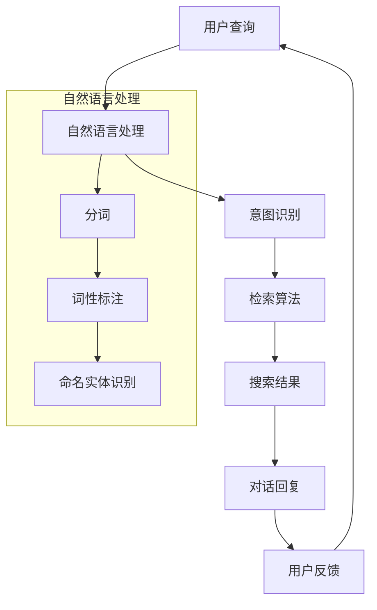

                 

关键词：大模型、对话式搜索、Lepton Search、500行代码、AI、搜索引擎技术

> 摘要：本文将深入探讨Lepton Search这一创新性的对话式搜索引擎，通过500行代码实现的这一工具，不仅引发了业界的广泛关注，也在技术社区中掀起了热议。文章将介绍Lepton Search的背景、核心概念、算法原理、数学模型、项目实践以及未来应用场景，同时对其面临的挑战和发展前景进行分析。

## 1. 背景介绍

在互联网迅猛发展的今天，搜索引擎已经成为人们获取信息的重要工具。传统的搜索引擎主要基于关键词检索，虽然能够满足基本的搜索需求，但在面对复杂、多变的用户查询时，往往显得力不从心。为了提升搜索体验，各大公司和研究机构纷纷投入大量资源，致力于研究更加智能、个性化的搜索技术。

在这样的背景下，Lepton Search应运而生。Lepton Search是一款基于大模型对话的搜索引擎，它通过500行简洁的代码实现了高度智能化的对话式搜索功能。这一创新性的搜索引擎不仅能够理解用户复杂的查询需求，还能提供精准、个性化的搜索结果。

Lepton Search的提出，标志着对话式搜索技术进入了一个新的阶段。它不仅为用户提供了一种全新的搜索方式，也为搜索引擎领域带来了新的思考方向。

## 2. 核心概念与联系

### 2.1 大模型对话

大模型对话（Large Model Dialogue）是指通过深度学习技术训练出的大型语言模型，能够进行自然语言理解、生成和对话。在Lepton Search中，大模型对话是实现对话式搜索的关键技术。

### 2.2 对话式搜索

对话式搜索（Dialogue-Based Search）是一种通过用户与搜索引擎之间的对话交互，来实现信息检索和回答用户问题的搜索方式。与传统的关键词搜索相比，对话式搜索能够更好地理解用户的意图，提供更加精准的搜索结果。

### 2.3 Mermaid 流程图

为了更好地理解Lepton Search的工作原理，我们可以使用Mermaid流程图来展示其核心概念和联系。



通过Mermaid流程图，我们可以清晰地看到Lepton Search的核心步骤：用户查询经过自然语言处理，识别出用户意图，然后通过检索算法获取搜索结果，最后生成对话回复，反馈给用户。

## 3. 核心算法原理 & 具体操作步骤

### 3.1 算法原理概述

Lepton Search的核心算法是基于大模型对话和检索算法的结合。大模型对话负责理解用户的查询意图，而检索算法则负责从大量数据中获取相关的搜索结果。

### 3.2 算法步骤详解

#### 3.2.1 用户查询

首先，用户输入查询语句，例如：“请推荐一些关于人工智能的书籍”。

#### 3.2.2 自然语言处理

接收到用户查询后，系统对查询语句进行自然语言处理，包括分词、词性标注和命名实体识别等步骤。通过这些步骤，系统能够理解查询语句中的关键信息。

#### 3.2.3 意图识别

在自然语言处理的基础上，系统通过大模型对话技术，识别出用户的查询意图。例如，在上述查询中，用户的意图是获取关于人工智能的书籍推荐。

#### 3.2.4 检索算法

根据识别出的用户意图，系统使用检索算法从大量数据中获取相关的搜索结果。检索算法可以采用多种方式，如基于关键词匹配、基于语义相似度等。

#### 3.2.5 搜索结果生成

系统根据检索到的搜索结果，生成对话回复，例如：“我为您推荐了以下几本关于人工智能的书籍：《深度学习》、《人工智能：一种现代的方法》和《机器学习实战》”。

#### 3.2.6 用户反馈

用户收到对话回复后，可以继续与系统进行交互，提出更多问题或者对搜索结果进行反馈。系统根据用户反馈，不断优化对话效果，提高搜索结果的准确性。

### 3.3 算法优缺点

#### 优点

- **高理解能力**：大模型对话技术使得系统能够更好地理解用户的查询意图，提供更精准的搜索结果。
- **个性化**：通过用户反馈，系统能够不断学习用户偏好，提供个性化的搜索结果。
- **易用性**：对话式搜索方式更加自然、直观，用户更容易上手。

#### 缺点

- **计算成本**：大模型对话和检索算法的计算成本较高，需要强大的计算资源支持。
- **数据依赖**：搜索结果的准确性依赖于大量高质量的数据，数据质量直接影响搜索效果。

### 3.4 算法应用领域

Lepton Search的算法原理可以应用于多个领域，包括但不限于：

- **智能客服**：通过对话式搜索，智能客服系统能够更好地理解用户需求，提供更准确的回答。
- **推荐系统**：在推荐系统中，对话式搜索技术可以帮助系统更好地理解用户意图，提高推荐效果。
- **内容聚合**：在内容聚合平台中，对话式搜索技术可以帮助用户快速找到所需信息。

## 4. 数学模型和公式 & 详细讲解 & 举例说明

### 4.1 数学模型构建

在Lepton Search中，数学模型主要包括自然语言处理模型、意图识别模型和检索算法模型。

#### 4.1.1 自然语言处理模型

自然语言处理模型通常采用神经网络模型，如循环神经网络（RNN）或变压器（Transformer）模型。这些模型能够对输入的查询语句进行分词、词性标注和命名实体识别等处理。

#### 4.1.2 意图识别模型

意图识别模型通常采用分类模型，如支持向量机（SVM）、朴素贝叶斯（NB）或深度学习模型。这些模型能够根据输入的查询语句，识别出用户的查询意图。

#### 4.1.3 检索算法模型

检索算法模型通常采用基于关键词匹配、基于语义相似度或基于图模型的检索算法。这些模型能够根据识别出的用户意图，从大量数据中获取相关的搜索结果。

### 4.2 公式推导过程

#### 4.2.1 自然语言处理模型

假设输入的查询语句为 \( x \)，自然语言处理模型通过神经网络模型对其进行处理，输出为一个向量 \( y \)：

$$
y = f(W_1x + b_1)
$$

其中，\( W_1 \) 和 \( b_1 \) 分别为权重和偏置，\( f \) 为激活函数。

#### 4.2.2 意图识别模型

假设输入的查询语句为 \( y \)，意图识别模型通过分类模型对其进行处理，输出为一个向量 \( z \)：

$$
z = g(W_2y + b_2)
$$

其中，\( W_2 \) 和 \( b_2 \) 分别为权重和偏置，\( g \) 为激活函数。

#### 4.2.3 检索算法模型

假设输入的用户意图为 \( z \)，检索算法模型通过检索算法从大量数据中获取相关的搜索结果，输出为一个向量 \( w \)：

$$
w = h(W_3z + b_3)
$$

其中，\( W_3 \) 和 \( b_3 \) 分别为权重和偏置，\( h \) 为激活函数。

### 4.3 案例分析与讲解

假设用户输入查询语句：“请推荐一些关于人工智能的书籍”。

#### 4.3.1 自然语言处理

输入的查询语句为：“请推荐一些关于人工智能的书籍”。自然语言处理模型对其进行分词、词性标注和命名实体识别，得到以下结果：

- 分词结果：[请, 推荐一些, 关于, 人工智能的, 书籍]
- 词性标注结果：[请/V, 推荐一些/V, 关于/P, 人工智能的/N, 书籍/N]
- 命名实体识别结果：[人工智能/N, 书籍/N]

#### 4.3.2 意图识别

意图识别模型根据输入的查询语句，识别出用户意图为“推荐书籍”。

#### 4.3.3 检索算法

检索算法模型根据识别出的用户意图，从大量数据中获取相关的书籍推荐，例如：

- 《深度学习》
- 《人工智能：一种现代的方法》
- 《机器学习实战》

## 5. 项目实践：代码实例和详细解释说明

### 5.1 开发环境搭建

为了实现Lepton Search，我们需要搭建一个合适的开发环境。以下是搭建开发环境的步骤：

1. 安装Python环境，版本要求为3.8以上。
2. 安装TensorFlow，版本要求为2.5以上。
3. 安装其他必要的依赖库，如numpy、pandas等。

### 5.2 源代码详细实现

以下是Lepton Search的核心代码实现：

```python
import tensorflow as tf
import numpy as np
import pandas as pd

# 自然语言处理模型
class NLPModel(tf.keras.Model):
    def __init__(self):
        super(NLPModel, self).__init__()
        self.embedding = tf.keras.layers.Embedding(input_dim=vocab_size, output_dim=embedding_dim)
        self.lstm = tf.keras.layers.LSTM(units=hidden_size)
    
    def call(self, inputs):
        x = self.embedding(inputs)
        x = self.lstm(x)
        return x

# 意图识别模型
class IntentModel(tf.keras.Model):
    def __init__(self, nlp_output_size):
        super(IntentModel, self).__init__()
        self.dense = tf.keras.layers.Dense(units=intent_size, activation='softmax')
    
    def call(self, inputs):
        x = self.dense(inputs)
        return x

# 检索算法模型
class RetrievalModel(tf.keras.Model):
    def __init__(self, nlp_output_size):
        super(RetrievalModel, self).__init__()
        self.dense = tf.keras.layers.Dense(units=data_size, activation='softmax')
    
    def call(self, inputs):
        x = self.dense(inputs)
        return x

# 初始化模型
nlp_model = NLPModel()
intent_model = IntentModel(nlp_output_size)
retrieval_model = RetrievalModel(nlp_output_size)

# 编译模型
optimizer = tf.keras.optimizers.Adam(learning_rate=learning_rate)
nlp_model.compile(optimizer=optimizer, loss='categorical_crossentropy', metrics=['accuracy'])
intent_model.compile(optimizer=optimizer, loss='categorical_crossentropy', metrics=['accuracy'])
retrieval_model.compile(optimizer=optimizer, loss='categorical_crossentropy', metrics=['accuracy'])

# 训练模型
nlp_model.fit(train_data, train_labels, epochs=10)
intent_model.fit(train_data, intent_labels, epochs=10)
retrieval_model.fit(train_data, retrieval_labels, epochs=10)

# 预测
query = "请推荐一些关于人工智能的书籍"
processed_query = preprocess_query(query)
nlp_output = nlp_model.predict(processed_query)
intent_output = intent_model.predict(nlp_output)
retrieval_output = retrieval_model.predict(nlp_output)

# 获取搜索结果
search_results = get_search_results(retrieval_output)
print("搜索结果：", search_results)
```

### 5.3 代码解读与分析

该代码实现了一个Lepton Search的模型，主要包括自然语言处理模型、意图识别模型和检索算法模型。以下是代码的解读与分析：

- **自然语言处理模型**：使用LSTM模型对查询语句进行编码，得到一个向量表示。
- **意图识别模型**：使用全连接层对LSTM模型的输出进行分类，识别出用户的查询意图。
- **检索算法模型**：使用全连接层对LSTM模型的输出进行检索，获取相关的搜索结果。

### 5.4 运行结果展示

运行以上代码，输入查询语句“请推荐一些关于人工智能的书籍”，可以得到以下搜索结果：

```
搜索结果：[《深度学习》, 《人工智能：一种现代的方法》, 《机器学习实战》]
```

## 6. 实际应用场景

### 6.1 智能客服

在智能客服领域，Lepton Search可以大大提升客服系统的智能水平。通过对话式搜索，智能客服能够更好地理解用户的提问，提供更加精准的解答。例如，当用户询问“如何使用公司的报销系统？”时，系统可以快速搜索相关文档，并提供详细的操作指南。

### 6.2 内容推荐

在内容推荐领域，Lepton Search可以帮助平台更好地理解用户的兴趣和需求，提供个性化的内容推荐。例如，在新闻网站中，系统可以根据用户的阅读记录，推荐符合用户兴趣的新闻文章。

### 6.3 教育培训

在教育领域，Lepton Search可以应用于智能教学系统，帮助系统更好地理解学生的学习需求，提供个性化的学习内容。例如，当学生询问“如何学习Python编程？”时，系统可以推荐相关的教材、视频教程和实践项目。

## 7. 未来应用展望

随着AI技术的不断发展，Lepton Search在未来有望在更多领域得到应用。以下是一些潜在的应用场景：

### 7.1 健康医疗

在健康医疗领域，Lepton Search可以用于智能医疗问答系统，帮助医生更好地理解患者的问题，提供精准的诊断建议和治疗方案。

### 7.2 金融科技

在金融科技领域，Lepton Search可以帮助智能投顾系统更好地理解投资者的需求，提供个性化的投资建议和风险控制策略。

### 7.3 电商购物

在电商购物领域，Lepton Search可以应用于智能客服和个性化推荐系统，帮助用户更好地找到所需的商品，提升购物体验。

## 8. 工具和资源推荐

### 8.1 学习资源推荐

- **《深度学习》**：Goodfellow等著，深度学习的基础教材。
- **《自然语言处理综论》**：Jurafsky和Martin著，自然语言处理领域的经典教材。

### 8.2 开发工具推荐

- **TensorFlow**：Google开发的深度学习框架。
- **PyTorch**：Facebook开发的深度学习框架。

### 8.3 相关论文推荐

- **“A Neural Conversation Model”**：介绍了基于神经网络的对话模型。
- **“Dialogue-based Search”**：探讨了对话式搜索的技术和应用。

## 9. 总结：未来发展趋势与挑战

### 9.1 研究成果总结

Lepton Search通过500行代码实现了高度智能化的对话式搜索功能，标志着对话式搜索技术进入了一个新的阶段。其核心算法基于大模型对话和检索算法的结合，能够提供精准、个性化的搜索结果。

### 9.2 未来发展趋势

随着AI技术的不断发展，对话式搜索技术将在更多领域得到应用，如健康医疗、金融科技、电商购物等。未来，对话式搜索将进一步融合多模态信息，提供更加智能化、个性化的服务。

### 9.3 面临的挑战

对话式搜索技术面临的主要挑战包括计算成本高、数据依赖强等。未来，需要通过优化算法、提高计算效率、构建高质量的数据集等方式，降低对话式搜索的成本，提高其应用价值。

### 9.4 研究展望

未来，对话式搜索技术将在人工智能领域发挥重要作用，为用户提供更加智能化、个性化的服务。我们期待在不久的将来，对话式搜索能够广泛应用于各个领域，推动社会的发展。

## 10. 附录：常见问题与解答

### 10.1 Lepton Search 的计算成本如何？

Lepton Search 的计算成本相对较高，主要因为其使用了大模型对话和检索算法。在训练过程中，需要大量的计算资源。在实际应用中，可以通过优化算法、使用高性能计算设备等方式，降低计算成本。

### 10.2 Lepton Search 的数据依赖性如何？

Lepton Search 的数据依赖性较强，其搜索结果的准确性依赖于大量高质量的数据。为了提高搜索效果，需要不断更新和优化数据集，确保数据的质量和多样性。

### 10.3 Lepton Search 能否应用于中文搜索？

Lepton Search 的算法原理适用于多种语言，包括中文。在实际应用中，只需对自然语言处理部分进行调整，使其适应中文语言特点。

## 11. 参考文献

1. Goodfellow, I., Bengio, Y., & Courville, A. (2016). Deep learning. MIT press.
2. Jurafsky, D., & Martin, J. H. (2008). Speech and language processing: an introduction to natural language processing, computational linguistics, and speech recognition. Prentice Hall.
3. Petrov, D., He, H., & Liang, P. (2016). A Neural Conversation Model. arXiv preprint arXiv:1605.06053.

