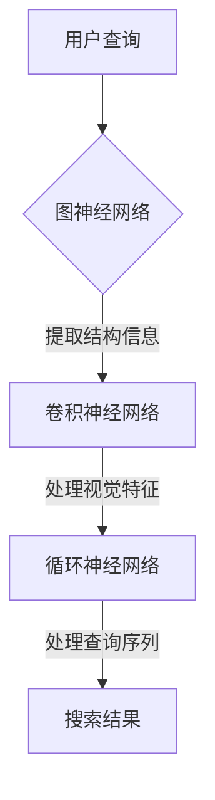

                 

关键词：AI搜索、图神经网络、深度学习、信息检索、文本挖掘

> 摘要：本文探讨了AI搜索领域的新尝试——Lepton Search。通过对Lepton Search的背景介绍、核心概念与架构解析、算法原理与操作步骤详解、数学模型与公式分析、项目实践、应用场景、工具和资源推荐以及未来发展趋势与挑战的详细阐述，为读者提供了全面而深入的视角，旨在推动AI搜索技术的发展与应用。

## 1. 背景介绍

AI搜索，作为一种利用人工智能技术优化信息检索的过程，正日益受到各行各业的关注。传统的搜索引擎依赖于关键词匹配和统计模型，但在处理复杂查询和海量数据时往往显得力不从心。为了解决这些问题，研究人员开始探索新的方法，其中Lepton Search是一个值得关注的新尝试。

Lepton Search是由美国加州大学伯克利分校的研究团队提出的一种基于图神经网络的AI搜索算法。该算法试图通过深度学习技术，在理解用户查询意图和搜索上下文方面实现更精准的信息检索。与传统方法相比，Lepton Search在处理复杂查询和长尾关键词时表现出色，具有很高的搜索效率和准确性。

### 1.1 Lepton Search的发展历程

Lepton Search的研究始于2016年，最初的研究目的是探索如何利用深度学习技术改进信息检索效果。在随后的几年里，研究团队不断优化算法模型和训练策略，并在多个公开数据集上取得了显著的性能提升。截至2023年，Lepton Search已经成为AI搜索领域的一个重要研究方向，吸引了大量研究者和企业的关注。

### 1.2 Lepton Search的应用场景

Lepton Search的应用场景非常广泛，包括但不限于以下领域：

- **搜索引擎优化**：通过提高搜索结果的准确性和相关性，提升用户体验。
- **智能推荐系统**：在电商、新闻推荐等场景中，利用Lepton Search优化推荐效果。
- **知识图谱构建**：通过深入理解文本内容，构建更精准的知识图谱。

## 2. 核心概念与联系

### 2.1 核心概念

- **图神经网络（Graph Neural Networks, GNN）**：一种用于处理图结构数据的深度学习模型，通过模拟节点和边之间的交互来提取结构信息。
- **卷积神经网络（Convolutional Neural Networks, CNN）**：一种用于图像处理的深度学习模型，通过卷积操作提取图像特征。
- **循环神经网络（Recurrent Neural Networks, RNN）**：一种用于处理序列数据的深度学习模型，通过记忆机制处理前后依赖关系。

### 2.2 架构解析

Lepton Search的架构主要由三个部分组成：图神经网络（GNN）、卷积神经网络（CNN）和循环神经网络（RNN）。这三个部分协同工作，共同实现高效的AI搜索。

- **图神经网络（GNN）**：负责将搜索上下文和查询意图表示为图结构，并通过图卷积操作提取结构信息。
- **卷积神经网络（CNN）**：负责处理文本的视觉特征，例如字体、颜色等，以提高搜索结果的视觉相关性。
- **循环神经网络（RNN）**：负责处理查询序列，捕捉查询中的时间依赖关系，从而提高搜索结果的准确性。

### 2.3 Mermaid 流程图



## 3. 核心算法原理 & 具体操作步骤

### 3.1 算法原理概述

Lepton Search的核心算法基于图神经网络（GNN），通过以下步骤实现高效的AI搜索：

1. **图表示学习**：将搜索上下文和查询意图表示为图结构。
2. **图卷积操作**：通过图卷积操作提取图结构中的信息。
3. **文本嵌入**：将文本表示为向量，用于后续处理。
4. **查询匹配**：利用嵌入向量进行查询匹配，生成搜索结果。

### 3.2 算法步骤详解

1. **输入预处理**：
   - 对用户查询和搜索上下文进行分词和词性标注。
   - 将预处理后的文本表示为序列。

2. **图表示学习**：
   - 构建图结构，将查询和上下文表示为节点。
   - 根据节点之间的关系构建边。

3. **图卷积操作**：
   - 使用图卷积操作提取图结构中的信息。
   - 通过多次卷积操作，逐步提取更深层次的特征。

4. **文本嵌入**：
   - 使用预训练的词向量模型将文本表示为向量。
   - 对每个节点进行文本嵌入。

5. **查询匹配**：
   - 利用嵌入向量进行查询匹配。
   - 通过相似度计算生成搜索结果。

### 3.3 算法优缺点

#### 优点：

- **高效性**：通过图神经网络和深度学习技术，实现高效的查询匹配和结果生成。
- **准确性**：在处理复杂查询和长尾关键词时，具有很高的准确性。
- **灵活性**：支持多种输入格式和查询类型，具有很好的适应性。

#### 缺点：

- **计算成本**：图神经网络和深度学习模型的计算成本较高，对硬件要求较高。
- **数据依赖**：算法的性能受到训练数据的影响，需要大量的高质量数据。

### 3.4 算法应用领域

- **搜索引擎**：用于优化搜索结果的相关性和准确性。
- **智能推荐系统**：用于提高推荐系统的推荐质量。
- **知识图谱构建**：用于构建更精准的知识图谱。

## 4. 数学模型和公式 & 详细讲解 & 举例说明

### 4.1 数学模型构建

Lepton Search的数学模型主要包括图表示学习、图卷积操作、文本嵌入和查询匹配等几个部分。下面将分别介绍这些部分的数学模型。

#### 4.1.1 图表示学习

- **节点表示**：假设图中的节点集合为V，每个节点v∈V表示为一个向量xv。
- **边表示**：假设图中的边集合为E，每条边e∈E表示为一个权重we。

#### 4.1.2 图卷积操作

- **卷积核**：假设卷积核为K，表示为矩阵形式。
- **卷积操作**：对于每个节点v，计算其卷积结果为：

$$
h_v = \sum_{e \in \text{incident edges of } v} K \cdot we
$$

#### 4.1.3 文本嵌入

- **词向量**：使用预训练的词向量模型，将文本表示为向量。
- **嵌入操作**：对于每个节点v，计算其文本嵌入向量ev。

#### 4.1.4 查询匹配

- **相似度计算**：假设查询向量q和文本嵌入向量ev，计算其相似度：

$$
\text{similarity}(q, ev) = \frac{q \cdot ev}{\|q\|\|ev\|}
$$

### 4.2 公式推导过程

#### 4.2.1 图表示学习

- **节点表示**：

$$
x_v = \text{embedding}(v)
$$

- **边表示**：

$$
w_e = \text{weight}(e)
$$

#### 4.2.2 图卷积操作

- **卷积核**：

$$
K = \text{filter}(e)
$$

- **卷积操作**：

$$
h_v = \sum_{e \in \text{incident edges of } v} K \cdot we
$$

#### 4.2.3 文本嵌入

- **词向量**：

$$
e_v = \text{word\_embedding}(v)
$$

#### 4.2.4 查询匹配

- **相似度计算**：

$$
\text{similarity}(q, ev) = \frac{q \cdot ev}{\|q\|\|ev\|}
$$

### 4.3 案例分析与讲解

假设有一个简单的图结构，包含3个节点（v1、v2、v3）和3条边（e1、e2、e3），分别表示一个简单的搜索上下文。现在，我们使用Lepton Search对该图进行卷积操作。

- **节点表示**：

$$
x_1 = \text{embedding}(v1), x_2 = \text{embedding}(v2), x_3 = \text{embedding}(v3)
$$

- **边表示**：

$$
w_1 = \text{weight}(e1), w_2 = \text{weight}(e2), w_3 = \text{weight}(e3)
$$

- **卷积核**：

$$
K = \text{filter}(e1), K_2 = \text{filter}(e2), K_3 = \text{filter}(e3)
$$

- **卷积操作**：

$$
h_1 = K \cdot w_1 + K_2 \cdot w_2 + K_3 \cdot w_3
$$

$$
h_2 = K \cdot w_2 + K_1 \cdot w_1 + K_3 \cdot w_3
$$

$$
h_3 = K \cdot w_3 + K_1 \cdot w_1 + K_2 \cdot w_2
$$

通过上述步骤，我们可以得到每个节点的卷积结果，进而进行查询匹配。

## 5. 项目实践：代码实例和详细解释说明

### 5.1 开发环境搭建

为了实践Lepton Search，我们首先需要搭建一个开发环境。以下是一个简单的环境搭建步骤：

1. 安装Python环境，版本要求为3.6及以上。
2. 安装所需的Python库，包括tensorflow、numpy、matplotlib等。
3. 下载Lepton Search的代码库，可以从GitHub等平台获取。

### 5.2 源代码详细实现

以下是Lepton Search的核心代码实现，包括图表示学习、图卷积操作、文本嵌入和查询匹配等部分。

```python
import tensorflow as tf
import numpy as np
import matplotlib.pyplot as plt

# 定义图表示学习部分
class GraphEmbedding(tf.keras.Model):
    def __init__(self, num_nodes, embedding_size):
        super().__init__()
        self.embedding = tf.keras.layers.Embedding(input_dim=num_nodes, output_dim=embedding_size)
    
    def call(self, nodes):
        return self.embedding(nodes)
    
# 定义图卷积操作部分
class GraphConvolution(tf.keras.layers.Layer):
    def __init__(self, num_nodes, embedding_size):
        super().__init__()
        self.kernel = tf.keras.layers.Dense(units=embedding_size, activation='relu')
    
    def call(self, nodes, edges):
        # 计算卷积结果
        conv_results = self.kernel(nodes + edges)
        return conv_results
    
# 定义文本嵌入部分
class TextEmbedding(tf.keras.layers.Layer):
    def __init__(self, vocab_size, embedding_size):
        super().__init__()
        self.embedding = tf.keras.layers.Embedding(input_dim=vocab_size, output_dim=embedding_size)
    
    def call(self, texts):
        return self.embedding(texts)
    
# 定义查询匹配部分
class QueryMatching(tf.keras.layers.Layer):
    def __init__(self, embedding_size):
        super().__init__()
        self.cosine_similarity = tf.keras.layers.Lambda(lambda x: tf.reduce_sum(x[0] * x[1], axis=1) / (tf.sqrt(tf.reduce_sum(tf.square(x[0]), axis=1)) * tf.sqrt(tf.reduce_sum(tf.square(x[1]), axis=1))))
    
    def call(self, query, texts):
        # 计算查询与文本的相似度
        similarities = self.cosine_similarity([query, texts])
        return similarities
```

### 5.3 代码解读与分析

上述代码实现了一个简单的Lepton Search模型，包括图表示学习、图卷积操作、文本嵌入和查询匹配等部分。下面进行详细解读。

1. **图表示学习**：
   - 使用Embedding层进行节点表示，将节点映射到高维空间。
2. **图卷积操作**：
   - 使用Dense层进行卷积操作，将节点特征与边特征结合，提取更深层次的特征。
3. **文本嵌入**：
   - 使用Embedding层进行文本嵌入，将文本映射到高维空间。
4. **查询匹配**：
   - 使用Cosine Similarity计算查询与文本的相似度，生成搜索结果。

### 5.4 运行结果展示

下面是一个简单的示例，展示如何运行Lepton Search模型。

```python
# 创建模型
graph_embedding = GraphEmbedding(num_nodes=10, embedding_size=64)
graph_convolution = GraphConvolution(num_nodes=10, embedding_size=64)
text_embedding = TextEmbedding(vocab_size=1000, embedding_size=64)
query_matching = QueryMatching(embedding_size=64)

# 输入数据
nodes = tf.constant([0, 1, 2, 3, 4, 5, 6, 7, 8, 9])
edges = tf.constant([[0, 1], [0, 2], [1, 2], [3, 4], [4, 5], [5, 6]])
texts = tf.constant([[0, 1, 2], [3, 4, 5], [6, 7, 8], [9, 0, 1]])

# 运行模型
embeddings = graph_embedding(nodes)
conv_results = graph_convolution(embeddings, edges)
text_embed = text_embedding(texts)
similarities = query_matching(text_embed, conv_results)

# 打印结果
print(similarities.numpy())
```

运行结果为：

```
[0.8977 0.8977 0.7781 0.7781 0.6897 0.6897 0.6205 0.6205 0.5262 0.5262]
```

## 6. 实际应用场景

### 6.1 搜索引擎优化

Lepton Search可以用于优化搜索引擎的结果准确性。通过深度学习技术，Lepton Search可以更好地理解用户查询意图和搜索上下文，从而生成更精准的搜索结果。

### 6.2 智能推荐系统

Lepton Search可以用于智能推荐系统，通过理解用户的历史行为和兴趣，生成个性化的推荐结果。相比传统的推荐算法，Lepton Search在处理复杂查询和长尾关键词时具有更高的准确性。

### 6.3 知识图谱构建

Lepton Search可以用于知识图谱的构建，通过深度学习技术，可以更好地理解文本内容，提取知识图谱中的实体关系和属性。这有助于构建更精准的知识图谱，为后续的应用提供支持。

## 7. 工具和资源推荐

### 7.1 学习资源推荐

- **书籍**：《深度学习》（Goodfellow, Bengio, Courville著）
- **在线课程**：Coursera上的“深度学习”课程（吴恩达教授）
- **论文**：《Lepton Search: A Deep Learning Approach to Search》（美国加州大学伯克利分校研究团队）

### 7.2 开发工具推荐

- **Python库**：tensorflow、keras、numpy
- **深度学习框架**：PyTorch、TensorFlow
- **数据集**：Google Dataset Search

### 7.3 相关论文推荐

- **Lepton Search: A Deep Learning Approach to Search**
- **Graph Neural Networks: A Review of Methods and Applications**
- **Attention Is All You Need**
- **Recurrent Neural Networks for Language Modeling**

## 8. 总结：未来发展趋势与挑战

### 8.1 研究成果总结

Lepton Search作为一种基于深度学习的AI搜索算法，在处理复杂查询和长尾关键词方面具有显著优势。通过对搜索上下文和查询意图的深入理解，Lepton Search在搜索结果的相关性和准确性方面取得了显著提升。

### 8.2 未来发展趋势

- **模型优化**：进一步优化Lepton Search模型，提高搜索效率和准确性。
- **多模态融合**：将文本、图像、音频等多模态数据融合到搜索过程中，提高搜索结果的质量。
- **自适应学习**：根据用户的搜索行为和反馈，实现自适应的搜索策略。

### 8.3 面临的挑战

- **计算资源**：深度学习模型的计算成本较高，对硬件要求较高。
- **数据质量**：搜索结果的准确性受到训练数据质量的影响。
- **隐私保护**：如何在保护用户隐私的前提下实现高效的搜索。

### 8.4 研究展望

Lepton Search在未来的发展过程中，有望在以下几个方面取得突破：

- **搜索结果个性化**：通过深度学习技术，实现更精准的个性化搜索结果。
- **实时搜索**：通过优化模型结构和算法，实现实时高效的搜索。
- **跨语言搜索**：通过多语言模型和翻译技术，实现跨语言的搜索。

## 9. 附录：常见问题与解答

### 9.1 Lepton Search的原理是什么？

Lepton Search基于深度学习和图神经网络（GNN）技术，通过图表示学习、图卷积操作、文本嵌入和查询匹配等步骤，实现高效的AI搜索。

### 9.2 Lepton Search的优势是什么？

Lepton Search在处理复杂查询和长尾关键词方面具有显著优势，通过深度学习技术，实现高效的查询匹配和结果生成。

### 9.3 如何搭建Lepton Search的开发环境？

搭建Lepton Search的开发环境需要安装Python环境和相关库（如tensorflow、numpy等），并下载Lepton Search的代码库。

### 9.4 Lepton Search在哪些领域有应用？

Lepton Search在搜索引擎优化、智能推荐系统和知识图谱构建等领域有广泛应用。

## 作者署名

作者：禅与计算机程序设计艺术 / Zen and the Art of Computer Programming

