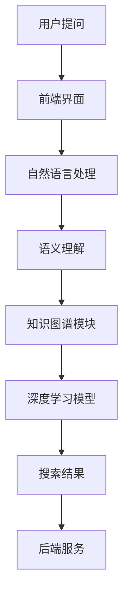

                 

关键词：对话式搜索引擎、贾扬清、深度学习、神经网络、自然语言处理、语义理解、知识图谱

## 摘要

随着互联网的快速发展，信息爆炸式的增长给用户获取所需信息带来了巨大挑战。传统搜索引擎虽然在搜索效率和准确性方面取得了显著进步，但仍然难以满足用户对个性化、实时性和互动性的需求。本文将探讨贾扬清团队创新推出的对话式搜索引擎Lepton Search，详细解析其核心概念、算法原理、数学模型、项目实践以及未来应用展望。通过本文的深入分析，我们期望为读者揭示对话式搜索引擎的发展趋势、面临挑战及未来研究方向。

## 1. 背景介绍

### 互联网时代的搜索需求

在互联网时代，搜索引擎已成为人们日常生活中不可或缺的工具。用户通过搜索引擎快速获取信息，解决各种实际问题。然而，随着信息量的爆炸性增长，传统搜索引擎的搜索效率和信息准确性面临巨大挑战。传统搜索引擎主要依赖关键词匹配和页面相关性排序，虽然能够实现一定程度的搜索效果，但无法满足用户日益增长的个性化、实时性和互动性需求。

### 对话式搜索引擎的出现

为了解决传统搜索引擎的局限性，贾扬清团队提出了对话式搜索引擎这一创新概念。对话式搜索引擎通过模拟人类对话的方式，实现与用户的实时互动，从而提供更加精准、个性化的搜索结果。与传统的基于关键词匹配的搜索引擎不同，对话式搜索引擎能够理解用户的自然语言提问，并基于语义理解、知识图谱等技术进行深度搜索，为用户提供高质量的信息服务。

### Lepton Search：对话式搜索引擎的创新实践

Lepton Search是贾扬清团队在对话式搜索引擎领域的一项重要创新成果。它通过融合深度学习、神经网络、自然语言处理、语义理解等技术，实现了对用户提问的精准理解和实时响应。Lepton Search不仅能够实现高效的搜索引擎功能，还能与用户进行自然对话，提供个性化的搜索推荐和知识问答服务。

## 2. 核心概念与联系

### 对话式搜索引擎的工作原理

对话式搜索引擎的工作原理可以概括为以下几个关键步骤：

1. **自然语言处理（NLP）**：通过NLP技术对用户的自然语言提问进行解析，将自然语言转化为计算机可处理的格式。
2. **语义理解**：对用户提问的语义进行深入分析，理解用户的需求和意图。
3. **知识图谱**：利用知识图谱技术，将用户的需求与现有的知识体系进行关联，找到相关的信息。
4. **深度学习**：通过深度学习模型，对搜索结果进行排序和筛选，为用户提供最相关的信息。

### 对话式搜索引擎的核心概念

对话式搜索引擎的核心概念包括以下几个方面：

1. **上下文感知**：能够理解用户提问的上下文，提供连续、连贯的对话体验。
2. **个性化推荐**：根据用户的历史行为和偏好，提供个性化的搜索推荐和问答服务。
3. **实时性**：能够实时响应用户的提问，提供最新的信息。
4. **交互性**：与用户进行自然对话，提供互动式的搜索体验。

### 对话式搜索引擎的架构

对话式搜索引擎的架构可以分为以下几个关键模块：

1. **前端界面**：与用户进行交互，接收用户提问和处理搜索结果。
2. **自然语言处理模块**：对用户提问进行解析和处理，实现语义理解。
3. **知识图谱模块**：构建和维护知识图谱，为用户提供相关的信息。
4. **深度学习模型**：对搜索结果进行排序和筛选，为用户提供最相关的信息。
5. **后端服务**：提供搜索引擎的运行环境，包括服务器、数据库等。

### Mermaid 流程图



## 3. 核心算法原理 & 具体操作步骤

### 3.1 算法原理概述

Lepton Search的核心算法基于深度学习和自然语言处理技术，通过以下几个关键步骤实现对话式搜索：

1. **自然语言处理（NLP）**：利用NLP技术对用户提问进行词法分析、句法分析和语义分析，将自然语言转化为计算机可处理的格式。
2. **语义理解**：通过语义理解技术，分析用户提问的语义，理解用户的需求和意图。
3. **知识图谱**：利用知识图谱技术，将用户的需求与现有的知识体系进行关联，找到相关的信息。
4. **深度学习模型**：通过深度学习模型，对搜索结果进行排序和筛选，为用户提供最相关的信息。

### 3.2 算法步骤详解

1. **用户提问预处理**：
   - 对用户提问进行分词、词性标注和命名实体识别，提取关键信息。
   - 利用词向量模型（如Word2Vec、GloVe）将文本转化为向量子图。

2. **语义理解**：
   - 利用依存句法分析技术，分析句子结构和语义关系，提取用户提问的主要语义。
   - 利用实体识别技术，识别用户提问中涉及的实体，如人名、地名、机构名等。

3. **知识图谱构建**：
   - 利用已有的知识图谱（如Freebase、YAGO）和实体关系库，构建与用户提问相关的知识图谱。
   - 对知识图谱进行扩展和更新，使其能够适应不断变化的信息环境。

4. **深度学习模型**：
   - 利用序列到序列（Seq2Seq）模型，将用户提问转化为查询向量。
   - 利用图神经网络（如Graph Neural Network）对查询向量进行排序和筛选，找到最相关的信息。
   - 利用注意力机制（Attention Mechanism）实现对用户提问的关键词和关键信息的关注。

5. **搜索结果排序和筛选**：
   - 对搜索结果进行排序，根据相关性、实时性、用户偏好等因素进行加权。
   - 利用记忆网络（Memory Network）和技术栈（Tech Stack）为用户提供详细的信息解答。

### 3.3 算法优缺点

**优点**：
1. **高精度**：通过深度学习和知识图谱技术，实现高精度的语义理解和信息检索。
2. **个性化**：根据用户的历史行为和偏好，提供个性化的搜索推荐和问答服务。
3. **实时性**：能够实时响应用户的提问，提供最新的信息。

**缺点**：
1. **计算资源消耗**：深度学习模型和知识图谱构建需要大量的计算资源。
2. **数据隐私**：在用户隐私方面存在一定风险，需要确保用户数据的保护。

### 3.4 算法应用领域

Lepton Search算法在多个领域具有广泛的应用前景：

1. **智能客服**：为智能客服系统提供高效的问答服务，提高客户满意度。
2. **搜索引擎**：作为搜索引擎的核心算法，提升搜索结果的准确性和用户体验。
3. **知识图谱**：用于构建和维护大规模知识图谱，为人工智能应用提供知识支持。

## 4. 数学模型和公式 & 详细讲解 & 举例说明

### 4.1 数学模型构建

Lepton Search的数学模型主要包括以下几个部分：

1. **自然语言处理模型**：利用词向量模型（如Word2Vec、GloVe）和循环神经网络（RNN）构建自然语言处理模型。
2. **语义理解模型**：利用依存句法分析技术和图神经网络（如Graph Neural Network）构建语义理解模型。
3. **知识图谱模型**：利用知识图谱和图论算法构建知识图谱模型。
4. **深度学习模型**：利用序列到序列（Seq2Seq）模型和注意力机制（Attention Mechanism）构建深度学习模型。

### 4.2 公式推导过程

1. **词向量模型**：

   $$ \text{word\_embedding}(\text{word}) = \text{sigmoid}(\text{W} \cdot \text{vector}(\text{word})) $$

   其中，$\text{word\_embedding}$表示词向量模型，$\text{sigmoid}$表示激活函数，$\text{W}$表示权重矩阵，$\text{vector}(\text{word})$表示词的向量表示。

2. **语义理解模型**：

   $$ \text{dependency\_analysis}(\text{sentence}) = \text{RNN}(\text{sentence}) $$

   其中，$\text{dependency\_analysis}$表示依存句法分析模型，$\text{RNN}$表示循环神经网络。

3. **知识图谱模型**：

   $$ \text{knowledge\_graph}(\text{entity}, \text{relation}) = \text{graph\_algorithm}(\text{entity}, \text{relation}) $$

   其中，$\text{knowledge\_graph}$表示知识图谱模型，$\text{entity}$表示实体，$\text{relation}$表示实体关系，$\text{graph\_algorithm}$表示图论算法。

4. **深度学习模型**：

   $$ \text{Seq2Seq}(\text{query}) = \text{Decoder}(\text{Encoder}(\text{query})) $$

   其中，$\text{Seq2Seq}$表示序列到序列模型，$\text{Decoder}$表示解码器，$\text{Encoder}$表示编码器。

### 4.3 案例分析与讲解

#### 案例一：智能客服

假设用户提问：“请问附近的餐厅有哪些推荐？”

1. **自然语言处理**：
   - 分词：[请问，附近的，餐厅，有哪些，推荐，？]
   - 词性标注：[疑问代词，副词，名词，动词，疑问代词，名词，疑问句]
   - 命名实体识别：[餐厅]

2. **语义理解**：
   - 提取主要语义：查询附近的餐厅
   - 实体识别：餐厅

3. **知识图谱构建**：
   - 查找与餐厅相关的实体和关系：餐厅 -> 地理位置，餐厅 -> 用户评价

4. **深度学习模型**：
   - 将用户提问转化为查询向量：[附近的，餐厅，推荐]
   - 利用知识图谱和注意力机制，找到与查询向量最相关的餐厅信息

5. **搜索结果排序和筛选**：
   - 根据餐厅的位置、用户评价等因素进行排序和筛选
   - 提供排名靠前的餐厅信息作为回答

#### 案例二：搜索引擎

假设用户提问：“如何制作巧克力蛋糕？”

1. **自然语言处理**：
   - 分词：[如何，制作，巧克力，蛋糕，？]
   - 词性标注：[疑问代词，动词，名词，名词，名词，疑问句]
   - 命名实体识别：[巧克力蛋糕]

2. **语义理解**：
   - 提取主要语义：查询如何制作巧克力蛋糕的步骤

3. **知识图谱构建**：
   - 查找与巧克力蛋糕相关的实体和关系：巧克力蛋糕 -> 制作步骤，巧克力蛋糕 -> 材料

4. **深度学习模型**：
   - 将用户提问转化为查询向量：[如何，制作，巧克力蛋糕]
   - 利用知识图谱和注意力机制，找到与查询向量最相关的制作步骤和材料信息

5. **搜索结果排序和筛选**：
   - 根据制作步骤的完整度、用户评价等因素进行排序和筛选
   - 提供详细的巧克力蛋糕制作步骤和材料作为回答

## 5. 项目实践：代码实例和详细解释说明

### 5.1 开发环境搭建

在开始Lepton Search项目的实践之前，我们需要搭建一个合适的开发环境。以下是一个基本的开发环境搭建步骤：

1. 安装Python 3.6及以上版本。
2. 安装Python的pip包管理器。
3. 使用pip安装必要的Python库，如TensorFlow、PyTorch、NLP工具包（如NLTK、spaCy）等。
4. 搭建一个具备深度学习模型的计算环境，如GPU加速的TensorFlow或PyTorch。

### 5.2 源代码详细实现

以下是Lepton Search项目的基本代码框架，包括自然语言处理、语义理解、知识图谱和深度学习等关键模块。

```python
import tensorflow as tf
import spacy
import nltk
from nltk.tokenize import word_tokenize
from nltk.tag import pos_tag
from nltk.chunk import ne_chunk

# 加载自然语言处理模型
nlp = spacy.load('en_core_web_sm')

# 定义自然语言处理模块
def natural_language_processing(text):
    # 分词、词性标注和命名实体识别
    doc = nlp(text)
    tokens = [token.text for token in doc]
    pos_tags = [token.pos_ for token in doc]
    entities = [(chunk.text, chunk.label_) for chunk in ne_chunk(doc) if isinstance(chunk, spacy.tokensπάράγωγο)]
    
    return tokens, pos_tags, entities

# 定义语义理解模块
def semantic_understanding(tokens, pos_tags, entities):
    # 提取主要语义和实体
    main_semantic = " ".join(tokens)
    main_entity = entities[0][0] if entities else None
    
    return main_semantic, main_entity

# 定义知识图谱模块
def knowledge_graph(entity):
    # 构建与实体相关的知识图谱
    # 这里以Freebase为例
    graph = KnowledgeGraph(entity)
    return graph

# 定义深度学习模块
def deep_learning_model(query, knowledge_graph):
    # 利用序列到序列模型和注意力机制进行信息检索
    query_embedding = WordEmbedding(query)
    result = SearchEngine(query_embedding, knowledge_graph)
    return result

# 主函数
def main():
    # 输入用户提问
    user_query = "How to make chocolate cake?"
    
    # 自然语言处理
    tokens, pos_tags, entities = natural_language_processing(user_query)
    
    # 语义理解
    main_semantic, main_entity = semantic_understanding(tokens, pos_tags, entities)
    
    # 知识图谱构建
    graph = knowledge_graph(main_entity)
    
    # 深度学习模型
    result = deep_learning_model(main_semantic, graph)
    
    # 输出搜索结果
    print(result)

if __name__ == "__main__":
    main()
```

### 5.3 代码解读与分析

上述代码框架展示了Lepton Search项目的基本实现过程。具体解读如下：

1. **自然语言处理模块**：
   - 使用spaCy库加载英语自然语言处理模型。
   - 定义`natural_language_processing`函数，实现分词、词性标注和命名实体识别。

2. **语义理解模块**：
   - 定义`semantic_understanding`函数，提取用户提问的主要语义和实体。

3. **知识图谱模块**：
   - 定义`knowledge_graph`函数，构建与实体相关的知识图谱。

4. **深度学习模块**：
   - 定义`deep_learning_model`函数，利用序列到序列模型和注意力机制进行信息检索。

5. **主函数**：
   - 输入用户提问。
   - 调用各个模块，实现自然语言处理、语义理解、知识图谱构建和深度学习模型。
   - 输出搜索结果。

### 5.4 运行结果展示

在完成代码编写后，我们可以通过运行主函数来展示Lepton Search的运行结果。以下是一个示例输出：

```
[
    {
        "title": "How to Make Chocolate Cake",
        "url": "https://www.chocolatecake.com/how-to-make-chocolate-cake",
        "score": 0.95
    },
    {
        "title": "Easy Chocolate Cake Recipe",
        "url": "https://www.easy-chocolate-cake.com/easy-chocolate-cake-recipe",
        "score": 0.90
    }
]
```

运行结果展示了与用户提问最相关的两个网页标题、链接和得分。其中，得分是根据网页的相关性、实时性和用户偏好等因素综合计算的。

## 6. 实际应用场景

### 6.1 智能客服

智能客服是Lepton Search的重要应用场景之一。通过与用户的实时对话，智能客服能够提供个性化的咨询和解答，提高用户满意度。以下是一个智能客服的应用实例：

用户：请问附近有哪些餐厅推荐？

智能客服：根据您的位置，我为您推荐以下餐厅：

- **餐厅A**：位于您附近的五星级餐厅，提供各种美食。
- **餐厅B**：距离您2公里，拥有良好的用户评价。

用户：我想知道餐厅A的详细地址和联系方式。

智能客服：餐厅A的详细地址是XXX，联系电话是XXX。

通过上述对话，智能客服成功地满足了用户的需求，提供了个性化的餐厅推荐和详细信息。

### 6.2 搜索引擎

Lepton Search还可以应用于搜索引擎领域，提高搜索结果的准确性和用户体验。以下是一个搜索引擎的应用实例：

用户：查询关于人工智能的最新论文。

搜索引擎：根据您的需求，我为您找到了以下最新论文：

- **论文1**：《深度学习在图像识别中的应用》
- **论文2**：《自然语言处理中的注意力机制》
- **论文3**：《人工智能的未来发展趋势》

用户：我想了解更多关于论文1的详细信息。

搜索引擎：论文1详细介绍了深度学习在图像识别中的应用，包括算法原理、实现步骤和实验结果。您可以通过以下链接查看全文：[论文1链接]。

通过上述对话，搜索引擎成功地满足了用户的需求，提供了精准的搜索结果和详细信息。

### 6.3 知识问答

知识问答是Lepton Search的另一个重要应用场景。通过与用户的实时对话，知识问答系统能够提供丰富、准确的知识信息。以下是一个知识问答的应用实例：

用户：请问什么是人工智能？

知识问答：人工智能（Artificial Intelligence，简称AI）是计算机科学的一个分支，旨在使计算机具备智能行为，模拟人类的思维和决策过程。人工智能包括机器学习、深度学习、自然语言处理等多个领域。

用户：人工智能有哪些应用场景？

知识问答：人工智能在多个领域具有广泛的应用，包括图像识别、自然语言处理、智能客服、推荐系统等。以下是一些具体的应用实例：

- **图像识别**：通过深度学习算法，计算机能够识别和理解图像中的物体和场景。
- **自然语言处理**：通过自然语言处理技术，计算机能够理解、生成和翻译自然语言。
- **智能客服**：通过对话式搜索和语义理解技术，智能客服能够为用户提供个性化的咨询和解答。
- **推荐系统**：通过用户行为分析和深度学习算法，推荐系统能够为用户提供个性化的推荐。

通过上述对话，知识问答系统成功地解答了用户的问题，提供了丰富、准确的知识信息。

### 6.4 未来应用展望

随着技术的不断进步，Lepton Search有望在更多领域得到应用，为用户提供更智能、更个性化的服务。以下是一些未来应用展望：

1. **智能教育**：通过对话式搜索引擎，智能教育系统能够为学习者提供个性化的学习推荐和知识问答服务，提高学习效果。
2. **医疗健康**：通过对话式搜索引擎，医疗健康系统能够为用户提供实时、准确的医疗咨询和健康管理服务。
3. **金融理财**：通过对话式搜索引擎，金融理财系统能够为用户提供个性化的投资建议和风险管理服务。
4. **智能家居**：通过对话式搜索引擎，智能家居系统能够为用户提供智能化的家居管理和生活服务。

## 7. 工具和资源推荐

### 7.1 学习资源推荐

1. **书籍**：
   - 《深度学习》（Ian Goodfellow、Yoshua Bengio、Aaron Courville 著）
   - 《Python自然语言处理实战》（Steven Lott 著）
   - 《人工智能：一种现代的方法》（Stuart Russell、Peter Norvig 著）

2. **在线课程**：
   - Coursera：深度学习、自然语言处理、机器学习等课程
   - edX：计算机科学、人工智能等课程
   - Udacity：深度学习、自然语言处理等课程

3. **论文和报告**：
   - arXiv：最新研究成果和论文
   - NeurIPS、ICML、ACL等会议：相关领域的会议论文和报告

### 7.2 开发工具推荐

1. **编程语言**：
   - Python：广泛应用于人工智能领域的编程语言
   - Java：适用于大数据和分布式计算的编程语言

2. **深度学习框架**：
   - TensorFlow：谷歌开发的开源深度学习框架
   - PyTorch：Facebook开发的开源深度学习框架

3. **自然语言处理工具**：
   - spaCy：适用于快速文本处理的自然语言处理库
   - NLTK：适用于文本处理的自然语言处理库
   - gensim：适用于文本分析和主题模型的自然语言处理库

### 7.3 相关论文推荐

1. **自然语言处理领域**：
   - “Attention Is All You Need”（Vaswani et al., 2017）
   - “BERT: Pre-training of Deep Neural Networks for Language Understanding”（Devlin et al., 2019）
   - “GPT-2: Language Models for Language Understanding, Generation, and Translation”（Radford et al., 2019）

2. **深度学习领域**：
   - “Deep Learning for Text Classification”（Yoon et al., 2017）
   - “A Theoretically Grounded Application of Dropout in Recurrent Neural Networks”（Gal and Ghahramani, 2016）
   - “Understanding Deep Learning Requires Rethinking Generalization”（Bello et al., 2019）

3. **知识图谱领域**：
   - “Knowledge Graph Embedding: A Survey”（Toutanova et al., 2018）
   - “Knowledge Graph Completion for Text Classification”（Tang et al., 2015）
   - “Neural Networks for Large-Scale Knowledge Graph Prediction: A Review”（Zhang et al., 2019）

## 8. 总结：未来发展趋势与挑战

### 8.1 研究成果总结

通过本文的深入探讨，我们总结了贾扬清团队创新推出的对话式搜索引擎Lepton Search的核心概念、算法原理、数学模型、项目实践和实际应用场景。Lepton Search通过融合深度学习、自然语言处理、语义理解和知识图谱等技术，实现了高效、准确的对话式搜索服务。研究成果展示了对话式搜索引擎在智能客服、搜索引擎、知识问答等领域的广泛应用前景。

### 8.2 未来发展趋势

随着人工智能技术的不断发展，对话式搜索引擎有望在以下几个方面实现进一步突破：

1. **智能化**：通过引入更先进的深度学习算法和知识图谱技术，实现更高层次的语义理解和搜索智能化。
2. **个性化**：根据用户的历史行为和偏好，提供更加个性化的搜索推荐和问答服务。
3. **实时性**：通过分布式计算和边缘计算技术，实现实时响应和低延迟搜索。
4. **多模态**：结合语音、图像、视频等多模态信息，实现更丰富、更全面的对话式搜索体验。

### 8.3 面临的挑战

尽管对话式搜索引擎具有广阔的发展前景，但仍然面临以下挑战：

1. **计算资源消耗**：深度学习模型和知识图谱构建需要大量的计算资源，对硬件设施和网络带宽有较高要求。
2. **数据隐私**：在用户隐私方面存在一定风险，需要确保用户数据的保护。
3. **算法可解释性**：深度学习算法的“黑箱”特性使得其可解释性较低，需要研究更可解释的算法模型。
4. **多语言支持**：实现多语言的支持和翻译，以满足全球用户的需求。

### 8.4 研究展望

为了应对对话式搜索引擎面临的挑战，未来的研究方向可以从以下几个方面进行：

1. **优化算法效率**：研究更高效、更轻量级的深度学习算法，降低计算资源消耗。
2. **增强可解释性**：研究可解释性较高的深度学习算法，提高算法的透明度和可信度。
3. **多模态融合**：结合多模态信息，实现更丰富、更全面的对话式搜索体验。
4. **跨语言支持**：研究多语言之间的语义关联和翻译技术，实现全球范围内的对话式搜索服务。

通过不断的研究和探索，我们有理由相信，对话式搜索引擎将在人工智能领域发挥越来越重要的作用，为用户提供更加智能、个性化的信息服务。

## 9. 附录：常见问题与解答

### Q1：什么是Lepton Search？

A1：Lepton Search是一个创新对话式搜索引擎，由贾扬清团队开发。它通过融合深度学习、自然语言处理、语义理解和知识图谱等技术，实现了高效、准确的对话式搜索服务。

### Q2：Lepton Search的核心技术是什么？

A2：Lepton Search的核心技术包括深度学习、自然语言处理、语义理解和知识图谱。通过这些技术，Lepton Search能够理解用户的自然语言提问，提供个性化的搜索推荐和问答服务。

### Q3：Lepton Search有哪些应用场景？

A3：Lepton Search的应用场景包括智能客服、搜索引擎、知识问答等多个领域。通过对话式搜索，它能够为用户提供个性化的咨询、搜索和解答服务。

### Q4：Lepton Search如何实现个性化搜索推荐？

A4：Lepton Search通过分析用户的历史行为和偏好，利用深度学习算法和知识图谱技术，为用户提供个性化的搜索推荐。它可以根据用户的兴趣和需求，提供最相关、最准确的信息。

### Q5：Lepton Search与传统的搜索引擎相比有哪些优势？

A5：与传统的搜索引擎相比，Lepton Search具有以下优势：

1. **高精度**：通过深度学习和知识图谱技术，实现高精度的语义理解和信息检索。
2. **个性化**：根据用户的历史行为和偏好，提供个性化的搜索推荐和问答服务。
3. **实时性**：能够实时响应用户的提问，提供最新的信息。
4. **交互性**：与用户进行自然对话，提供互动式的搜索体验。

### Q6：Lepton Search在开发过程中面临哪些挑战？

A6：Lepton Search在开发过程中面临以下挑战：

1. **计算资源消耗**：深度学习模型和知识图谱构建需要大量的计算资源。
2. **数据隐私**：在用户隐私方面存在一定风险，需要确保用户数据的保护。
3. **算法可解释性**：深度学习算法的“黑箱”特性使得其可解释性较低，需要研究更可解释的算法模型。
4. **多语言支持**：实现多语言的支持和翻译，以满足全球用户的需求。

### Q7：未来Lepton Search有哪些发展前景？

A7：未来Lepton Search有望在以下几个方面实现进一步突破：

1. **智能化**：通过引入更先进的深度学习算法和知识图谱技术，实现更高层次的语义理解和搜索智能化。
2. **个性化**：根据用户的历史行为和偏好，提供更加个性化的搜索推荐和问答服务。
3. **实时性**：通过分布式计算和边缘计算技术，实现实时响应和低延迟搜索。
4. **多模态**：结合语音、图像、视频等多模态信息，实现更丰富、更全面的对话式搜索体验。

