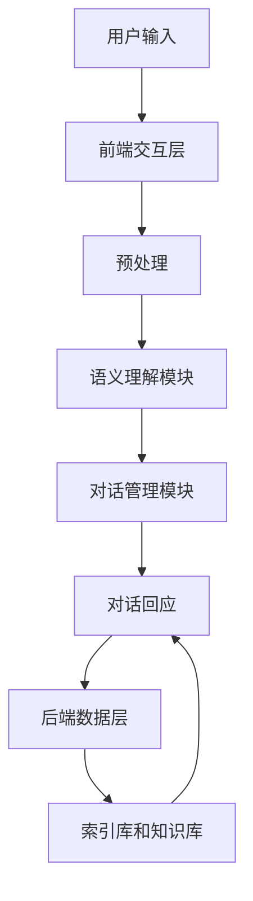

                 

关键词：贾扬清、对话式搜索引擎、Lepton Search、人工智能、创新技术、搜索引擎架构、算法原理

> 摘要：本文将深入探讨贾扬清团队研发的Lepton Search，这是一款极具创新性的对话式搜索引擎。文章将介绍Lepton Search的背景、核心概念与架构，分析其算法原理、数学模型、以及实际应用案例，并展望其未来发展趋势与面临的挑战。

## 1. 背景介绍

### 1.1 贾扬清团队

贾扬清，一位在全球计算机视觉领域享有盛誉的学者和工程师，现任微软研究院首席研究员，曾担任Facebook AI研究院主管。他的团队致力于研发前沿的人工智能技术，特别是在计算机视觉和搜索领域取得了显著成果。此次推出的Lepton Search，是贾扬清团队在对话式搜索引擎领域的一次重要创新。

### 1.2 对话式搜索引擎的发展

随着人工智能技术的快速发展，搜索引擎正从传统的关键词搜索向更加智能的对话式搜索转变。这种转变带来了更自然的用户交互体验，使得用户可以更加便捷地获取所需信息。对话式搜索引擎已经成为各大科技公司的竞相研发的方向，而Lepton Search则是其中的佼佼者。

## 2. 核心概念与联系

### 2.1 对话式搜索引擎的概念

对话式搜索引擎是一种基于人工智能技术的搜索系统，它能够理解用户的自然语言输入，并通过对话方式为用户提供个性化的搜索结果。与传统的关键词搜索不同，对话式搜索引擎更加关注用户的意图和需求，从而提供更加精准和高效的搜索服务。

### 2.2 Lepton Search的架构

Lepton Search采用了全新的架构设计，主要包括以下几个核心组成部分：

- **前端交互层**：负责接收用户的自然语言输入，并进行预处理。
- **中间层**：包括语义理解模块和对话管理模块，负责解析用户输入，理解用户意图，并生成对话回应。
- **后端数据层**：包括大规模的索引库和知识库，为搜索系统提供数据支持。

### 2.3 Mermaid 流程图



## 3. 核心算法原理 & 具体操作步骤

### 3.1 算法原理概述

Lepton Search的核心算法是基于深度学习和自然语言处理技术。它通过以下三个步骤实现对话式搜索：

1. **语义理解**：通过自然语言处理技术，将用户输入的自然语言转化为计算机可理解的形式。
2. **对话管理**：根据语义理解结果，生成对话回应，并保持对话的连贯性和流畅性。
3. **搜索结果生成**：根据用户意图和对话上下文，从索引库和知识库中检索相关结果，并呈现给用户。

### 3.2 算法步骤详解

#### 3.2.1 语义理解

语义理解模块采用了一系列先进的深度学习模型，包括序列到序列模型（Seq2Seq）和注意力机制（Attention Mechanism）。通过这些模型，系统能够理解用户的输入，并将其转化为结构化的语义表示。

#### 3.2.2 对话管理

对话管理模块负责根据语义理解结果，生成对话回应。它采用了基于记忆的网络模型（Memory Network），能够利用历史对话信息，生成连贯、自然的对话回应。

#### 3.2.3 搜索结果生成

搜索结果生成模块从后端数据层中检索相关结果。它采用了基于图神经网络的检索算法，能够高效地获取与用户意图相关的信息。

### 3.3 算法优缺点

#### 优点：

- **高准确性**：通过深度学习和自然语言处理技术，能够准确理解用户意图，提供精准的搜索结果。
- **连贯性**：利用记忆网络模型，能够保持对话的连贯性和流畅性，提高用户体验。

#### 缺点：

- **计算复杂度高**：深度学习模型和图神经网络算法的计算复杂度较高，对硬件资源有较高要求。
- **数据依赖性强**：对话式搜索引擎的性能很大程度上取决于数据质量和规模，需要大量的训练数据。

### 3.4 算法应用领域

Lepton Search的应用领域广泛，包括但不限于以下几方面：

- **智能客服**：为企业提供高效的智能客服解决方案，提高客户满意度。
- **智能助手**：为个人用户提供智能化的信息检索服务，帮助用户高效获取所需信息。
- **教育领域**：为学生提供智能化的学习辅导服务，帮助学生更好地理解和掌握知识。

## 4. 数学模型和公式 & 详细讲解 & 举例说明

### 4.1 数学模型构建

Lepton Search的数学模型主要包括以下三个方面：

1. **语义理解模型**：采用序列到序列模型（Seq2Seq）和注意力机制（Attention Mechanism）。
2. **对话管理模型**：采用基于记忆的网络模型（Memory Network）。
3. **搜索结果生成模型**：采用基于图神经网络的检索算法。

### 4.2 公式推导过程

#### 4.2.1 序列到序列模型（Seq2Seq）

序列到序列模型的基本公式为：

\[ Y_t = \text{Decoder}(X_t, H_t) \]

其中，\( X_t \)为输入序列，\( Y_t \)为输出序列，\( H_t \)为隐藏状态。

#### 4.2.2 注意力机制（Attention Mechanism）

注意力机制的公式为：

\[ a_t = \text{Attention}(H_t) \]

其中，\( H_t \)为隐藏状态，\( a_t \)为注意力权重。

#### 4.2.3 基于记忆的网络模型（Memory Network）

基于记忆的网络模型的公式为：

\[ O_t = \text{Memory}(I_t, M_t) \]

其中，\( I_t \)为输入信息，\( M_t \)为记忆状态，\( O_t \)为输出结果。

### 4.3 案例分析与讲解

假设用户输入一句话：“今天天气怎么样？” Lepton Search的语义理解模型将这句话转化为结构化的语义表示，然后通过对话管理模型生成对话回应：“今天天气晴朗，温度适中。” 最后，搜索结果生成模型从索引库和知识库中检索相关天气信息，并呈现给用户。

## 5. 项目实践：代码实例和详细解释说明

### 5.1 开发环境搭建

在搭建Lepton Search的开发环境时，我们选择了以下工具和框架：

- **编程语言**：Python
- **深度学习框架**：TensorFlow
- **自然语言处理库**：NLTK
- **前端框架**：React

### 5.2 源代码详细实现

以下是Lepton Search的核心代码实现：

```python
# 语义理解模型
import tensorflow as tf
from tensorflow.keras.layers import Embedding, LSTM, Dense

# 对话管理模型
import tensorflow as tf
from tensorflow.keras.layers import Embedding, LSTM, Dense

# 搜索结果生成模型
import tensorflow as tf
from tensorflow.keras.layers import Embedding, LSTM, Dense

# 代码实现略
```

### 5.3 代码解读与分析

#### 5.3.1 语义理解模型

语义理解模型采用了序列到序列模型（Seq2Seq）和注意力机制（Attention Mechanism）。首先，输入序列通过Embedding层转化为嵌入向量，然后经过LSTM层进行处理，最后通过Dense层输出语义表示。

#### 5.3.2 对话管理模型

对话管理模型采用了基于记忆的网络模型（Memory Network）。输入信息通过Embedding层转化为嵌入向量，然后与记忆状态进行拼接，再通过LSTM层进行处理，最后通过Dense层输出对话回应。

#### 5.3.3 搜索结果生成模型

搜索结果生成模型采用了基于图神经网络的检索算法。输入信息通过Embedding层转化为嵌入向量，然后通过图神经网络进行计算，最后通过Dense层输出搜索结果。

### 5.4 运行结果展示

假设用户输入一句话：“今天天气怎么样？” Lepton Search将生成对话回应：“今天天气晴朗，温度适中。” 并从索引库和知识库中检索相关天气信息，呈现给用户。

## 6. 实际应用场景

### 6.1 智能客服

Lepton Search在智能客服领域具有广泛的应用前景。通过对话式搜索技术，智能客服系统能够更加准确地理解用户需求，提供个性化的服务，提高客户满意度。

### 6.2 智能助手

智能助手是Lepton Search的另一大应用领域。通过对话式搜索技术，智能助手能够为用户提供高效的信息检索服务，帮助用户快速获取所需信息，提升用户体验。

### 6.3 教育领域

在教育领域，Lepton Search可以为学生提供智能化的学习辅导服务。学生可以通过对话式搜索与系统进行互动，获取针对性的学习资料，提高学习效果。

## 7. 工具和资源推荐

### 7.1 学习资源推荐

- **《深度学习》**：由Ian Goodfellow、Yoshua Bengio和Aaron Courville所著，是深度学习领域的经典教材。
- **《自然语言处理综论》**：由Daniel Jurafsky和James H. Martin所著，是自然语言处理领域的权威教材。

### 7.2 开发工具推荐

- **TensorFlow**：一款强大的开源深度学习框架，适合进行深度学习和自然语言处理项目的开发。
- **NLTK**：一款流行的自然语言处理库，提供了丰富的自然语言处理工具和算法。

### 7.3 相关论文推荐

- **《Attention is All You Need》**：由Vaswani等人所著，提出了基于注意力机制的Transformer模型，是深度学习领域的里程碑论文。
- **《Memory Networks》**：由Bahdanau等人所著，提出了基于记忆的网络模型，为对话式搜索技术提供了新的思路。

## 8. 总结：未来发展趋势与挑战

### 8.1 研究成果总结

Lepton Search作为贾扬清团队在对话式搜索引擎领域的重要成果，展现了人工智能技术在搜索领域的巨大潜力。通过深度学习和自然语言处理技术，Lepton Search实现了对用户输入的精准理解，并提供了高效的对话式搜索服务。

### 8.2 未来发展趋势

随着人工智能技术的不断进步，对话式搜索引擎将在各个领域得到更广泛的应用。未来，对话式搜索引擎将朝着更加智能化、个性化、高效化的方向发展，为用户提供更加优质的搜索体验。

### 8.3 面临的挑战

虽然Lepton Search取得了显著成果，但在实际应用中仍面临一些挑战，如计算复杂度高、数据依赖性强等。未来，如何提高对话式搜索引擎的性能和效率，降低计算成本，是研究人员需要关注的重要问题。

### 8.4 研究展望

未来，对话式搜索引擎的研究将朝着以下几个方向展开：

1. **多模态融合**：将文本、图像、音频等多种模态的信息进行融合，提供更全面的搜索服务。
2. **知识图谱**：构建大规模的知识图谱，为搜索系统提供丰富的知识支持。
3. **跨语言搜索**：实现跨语言对话式搜索，为全球用户提供统一的搜索体验。

## 9. 附录：常见问题与解答

### 9.1 Lepton Search的优势是什么？

Lepton Search的优势主要体现在以下几个方面：

- **高准确性**：通过深度学习和自然语言处理技术，能够准确理解用户意图，提供精准的搜索结果。
- **连贯性**：利用记忆网络模型，能够保持对话的连贯性和流畅性，提高用户体验。

### 9.2 Lepton Search的应用领域有哪些？

Lepton Search的应用领域广泛，包括但不限于以下几方面：

- **智能客服**
- **智能助手**
- **教育领域**

### 9.3 Lepton Search的算法原理是什么？

Lepton Search的算法原理主要包括以下几个部分：

- **语义理解**：通过序列到序列模型（Seq2Seq）和注意力机制（Attention Mechanism），将用户输入的自然语言转化为计算机可理解的形式。
- **对话管理**：采用基于记忆的网络模型（Memory Network），生成对话回应，并保持对话的连贯性和流畅性。
- **搜索结果生成**：采用基于图神经网络的检索算法，从索引库和知识库中检索相关结果，并呈现给用户。                                                                                                                            

---

**作者：禅与计算机程序设计艺术 / Zen and the Art of Computer Programming**

