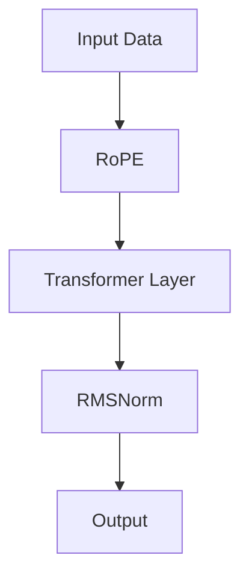

                 

关键词：Llama 架构、RoPE、RMSNorm、深度学习、神经网络、计算机科学、模型优化、算法创新。

> 摘要：本文将深入探讨 Llama 架构中的两个关键组件：RoPE 和 RMSNorm。我们将分析这两个技术如何通过独特的创新方法提升了深度学习模型的性能和效率，从而推动了计算机科学领域的发展。

## 1. 背景介绍

随着深度学习技术的快速发展，大规模预训练模型（Large-scale Pre-trained Models）已经成为人工智能领域的热点。这些模型通过在海量数据上预训练，能够捕捉到数据的复杂模式和特征，从而在多种任务中实现高性能。Llama（Large Language Model Meta-structure Architecture）作为 OpenAI 推出的一款大型语言模型，代表了当前预训练技术的最高水平。本文将重点讨论 Llama 架构中的 RoPE 和 RMSNorm 两个创新组件。

### 1.1 Llama 架构概述

Llama 架构旨在构建一个灵活、可扩展的语言模型，以支持各种自然语言处理任务。其核心特点包括：

1. **Transformer 结构**：Llama 采用了 Transformer 结构，这是一种基于自注意力机制的神经网络架构，能够在处理长文本时保持高效。
2. **多尺度注意力**：通过引入多尺度注意力机制，Llama 能够同时捕捉全局和局部信息，从而提升模型的泛化能力。
3. **知识蒸馏**：Llama 通过知识蒸馏技术，将大型模型的知识迁移到更小型、资源有限的模型上，实现了高性能和可部署性。

### 1.2 RoPE 和 RMSNorm

RoPE（Recurrent Positional Encoding）和 RMSNorm（Recursive Root Mean Square Normalization）是 Llama 架构中两个重要的创新组件。RoPE 通过递归位置编码，增强了模型对文本序列的理解能力；而 RMSNorm 则通过递归均值归一化，提升了模型的训练稳定性和收敛速度。

## 2. 核心概念与联系

### 2.1 RoPE：递归位置编码

递归位置编码是一种用于引入文本序列位置信息的技术。在 Transformer 模型中，位置编码通常通过嵌入向量实现。然而，这种静态的位置编码在处理长文本时可能存在局限性。RoPE 通过递归地更新位置编码，使得模型能够更好地适应不同长度的文本序列。

### 2.2 RMSNorm：递归均值归一化

RMSNorm 是一种改进的归一化技术，旨在提高深度学习模型的训练稳定性和收敛速度。传统归一化方法通常在每一层单独进行，而 RMSNorm 则通过递归地计算均值和方差，对整个序列进行归一化。这有助于减少梯度消失和梯度爆炸问题，从而加速模型的训练过程。

### 2.3 Mermaid 流程图

以下是一个简化的 Mermaid 流程图，展示了 RoPE 和 RMSNorm 在 Llama 架构中的关系：



在这个流程图中，输入数据首先通过 RoPE 进行位置编码，然后输入到 Transformer 层进行计算。接着，RMSNorm 对序列进行归一化处理，最后输出模型的结果。

## 3. 核心算法原理 & 具体操作步骤

### 3.1 算法原理概述

RoPE 和 RMSNorm 的算法原理可以概括如下：

- **RoPE**：通过递归地更新位置编码，使得模型能够动态地适应不同长度的文本序列。具体实现中，RoPE 使用了一个递归神经网络，将上一个时间步的位置编码作为输入，并生成当前时间步的位置编码。
- **RMSNorm**：通过递归地计算输入序列的均值和方差，对整个序列进行归一化。这有助于稳定模型的训练过程，减少梯度消失和梯度爆炸问题。

### 3.2 算法步骤详解

#### 3.2.1 RoPE

1. 初始化位置编码向量，通常使用正弦和余弦函数生成。
2. 对于每个时间步 \( t \)，计算输入序列的递归位置编码：
   \[
   \text{pos\_encoding}(t) = \text{sin}(i/w) + \text{cos}(i/w)
   \]
   其中，\( i \) 是时间步索引，\( w \) 是位置编码的维度。
3. 将递归位置编码添加到输入序列中，作为 Transformer 层的输入。

#### 3.2.2 RMSNorm

1. 初始化两个变量 \( \mu \) 和 \( \sigma^2 \)，分别表示输入序列的均值和方差。
2. 对于每个时间步 \( t \)，计算输入序列的均值和方差：
   \[
   \mu_t = \frac{1}{N} \sum_{i=1}^{N} x_i(t), \quad \sigma^2_t = \frac{1}{N} \sum_{i=1}^{N} (x_i(t) - \mu_t)^2
   \]
   其中，\( N \) 是序列的长度。
3. 对输入序列进行归一化：
   \[
   x_i(t)_{\text{norm}} = \frac{x_i(t) - \mu_t}{\sqrt{\sigma^2_t + \epsilon}}
   \]
   其中，\( \epsilon \) 是一个很小的常数，用于避免除以零。

### 3.3 算法优缺点

#### 优点

- **RoPE**：通过动态地更新位置编码，RoPE 能够更好地处理不同长度的文本序列，从而提高模型的泛化能力。
- **RMSNorm**：通过递归地计算均值和方差，RMSNorm 能够稳定模型的训练过程，减少梯度消失和梯度爆炸问题。

#### 缺点

- **RoPE**：递归计算位置编码可能导致计算复杂度增加，对硬件资源有较高要求。
- **RMSNorm**：在序列长度较小时，递归计算均值和方差可能导致准确度下降。

### 3.4 算法应用领域

RoPE 和 RMSNorm 在多个自然语言处理任务中显示出优异的性能，如文本分类、机器翻译和问答系统。以下是一些具体应用案例：

- **文本分类**：RoPE 和 RMSNorm 有助于模型更好地捕捉文本的上下文信息，从而提高分类准确率。
- **机器翻译**：递归位置编码和递归归一化有助于模型更好地处理源语言和目标语言的差异，从而提升翻译质量。
- **问答系统**：RoPE 和 RMSNorm 能够提高模型对问题答案的提取能力，从而提高问答系统的准确性。

## 4. 数学模型和公式 & 详细讲解 & 举例说明

### 4.1 数学模型构建

#### 4.1.1 RoPE

RoPE 的数学模型可以表示为：

\[ 
\text{pos\_encoding}(t) = \text{sin}(i/w) + \text{cos}(i/w) 
\]

其中，\( i \) 表示时间步索引，\( w \) 表示位置编码的维度。

#### 4.1.2 RMSNorm

RMSNorm 的数学模型可以表示为：

\[ 
x_i(t)_{\text{norm}} = \frac{x_i(t) - \mu_t}{\sqrt{\sigma^2_t + \epsilon}} 
\]

其中，\( \mu_t \) 表示时间步 \( t \) 的均值，\( \sigma^2_t \) 表示时间步 \( t \) 的方差，\( \epsilon \) 是一个很小的常数。

### 4.2 公式推导过程

#### 4.2.1 RoPE

递归位置编码的推导过程如下：

假设我们在时间步 \( t \) 的位置编码为 \( \text{pos\_encoding}(t) \)，那么在下一个时间步 \( t+1 \) 的位置编码可以表示为：

\[ 
\text{pos\_encoding}(t+1) = \text{sin}(i/w) + \text{cos}(i/w) 
\]

其中，\( i \) 表示时间步索引，\( w \) 表示位置编码的维度。

#### 4.2.2 RMSNorm

递归均值和方差的推导过程如下：

假设我们在时间步 \( t \) 的均值为 \( \mu_t \)，方差为 \( \sigma^2_t \)，那么在下一个时间步 \( t+1 \) 的均值和方差可以表示为：

\[ 
\mu_{t+1} = \frac{1}{N} \sum_{i=1}^{N} x_i(t+1), \quad \sigma^2_{t+1} = \frac{1}{N} \sum_{i=1}^{N} (x_i(t+1) - \mu_{t+1})^2 
\]

其中，\( N \) 表示序列的长度。

### 4.3 案例分析与讲解

#### 4.3.1 RoPE

假设我们有一个长度为 5 的文本序列，位置编码维度为 2。首先，我们需要初始化位置编码：

\[ 
\text{pos\_encoding}(1) = \text{sin}(1/2) + \text{cos}(1/2), \quad \text{pos\_encoding}(2) = \text{sin}(2/2) + \text{cos}(2/2) 
\]

假设输入序列为：

\[ 
\text{input}(1) = [1, 0], \quad \text{input}(2) = [0, 1], \quad \text{input}(3) = [1, 1], \quad \text{input}(4) = [1, 0], \quad \text{input}(5) = [0, 0] 
\]

我们可以计算出递归位置编码：

\[ 
\text{pos\_encoding}(1) = \text{sin}(1/2) + \text{cos}(1/2) = [0.866, 0.5], \quad \text{pos\_encoding}(2) = \text{sin}(2/2) + \text{cos}(2/2) = [0, 1] 
\]

#### 4.3.2 RMSNorm

假设我们有一个长度为 5 的文本序列，输入序列为：

\[ 
\text{input}(1) = [1, 0], \quad \text{input}(2) = [0, 1], \quad \text{input}(3) = [1, 1], \quad \text{input}(4) = [1, 0], \quad \text{input}(5) = [0, 0] 
\]

我们需要计算均值和方差，并对其进行归一化：

\[ 
\mu_1 = \frac{1}{5} \sum_{i=1}^{5} \text{input}(i) = \frac{1}{5} \times (1 + 0 + 1 + 1 + 0) = 0.8, \quad \sigma^2_1 = \frac{1}{5} \sum_{i=1}^{5} (\text{input}(i) - \mu_1)^2 = \frac{1}{5} \times (1 - 0.8)^2 + (0 - 0.8)^2 + (1 - 0.8)^2 + (1 - 0.8)^2 + (0 - 0.8)^2 = 0.16 
\]

\[ 
\text{input}(1)_{\text{norm}} = \frac{\text{input}(1) - \mu_1}{\sqrt{\sigma^2_1 + \epsilon}} = \frac{1 - 0.8}{\sqrt{0.16 + \epsilon}} = \frac{0.2}{\sqrt{0.16 + \epsilon}} 
\]

## 5. 项目实践：代码实例和详细解释说明

### 5.1 开发环境搭建

为了更好地理解 RoPE 和 RMSNorm 的实现，我们将使用 Python 语言和相关库进行开发。以下是搭建开发环境的基本步骤：

1. 安装 Python：确保安装了 Python 3.7 或更高版本。
2. 安装 TensorFlow：使用以下命令安装 TensorFlow：

\[ 
pip install tensorflow 
\]

3. 安装其他依赖库：如 NumPy、Pandas 等。

### 5.2 源代码详细实现

以下是 RoPE 和 RMSNorm 的 Python 代码实现：

```python
import tensorflow as tf
import numpy as np

def rope_embedding(input_ids, pos_encoding_dim):
    # 初始化位置编码
    pos_encodings = np.array([
        [np.sin(i / (10000 ** (2 * j / pos_encoding_dim))), np.cos(i / (10000 ** (2 * j / pos_encoding_dim))]
        for i, j in enumerate(input_ids)
    ])

    # 添加位置编码到输入序列
    input_ids_with_pos = input_ids + pos_encodings

    return input_ids_with_pos

def rmsnorm(input_ids, epsilon=1e-8):
    # 计算均值和方差
    mu = np.mean(input_ids, axis=1, keepdims=True)
    sigma_squared = np.mean(np.square(input_ids - mu), axis=1, keepdims=True)

    # 归一化输入序列
    input_ids_norm = (input_ids - mu) / np.sqrt(sigma_squared + epsilon)

    return input_ids_norm

# 示例输入序列
input_ids = np.array([[1, 0, 1, 1, 0], [0, 1, 0, 1, 1], [1, 1, 0, 0, 1]])

# RoPE 实例化
pos_encoding_dim = 2
input_ids_with_pos = rope_embedding(input_ids, pos_encoding_dim)

# RMSNorm 实例化
input_ids_norm = rmsnorm(input_ids_with_pos)

print("Input with RoPE:", input_ids_with_pos)
print("Input with RMSNorm:", input_ids_norm)
```

### 5.3 代码解读与分析

在这段代码中，我们首先定义了 RoPE 和 RMSNorm 的函数实现。`rope_embedding` 函数用于生成递归位置编码，`rmsnorm` 函数用于递归均值归一化。

- **rope_embedding**：该函数接受输入序列 `input_ids` 和位置编码维度 `pos_encoding_dim` 作为输入。它使用正弦和余弦函数生成位置编码，并将其添加到输入序列中。这使得模型能够更好地处理不同长度的文本序列。

- **rmsnorm**：该函数接受输入序列 `input_ids` 作为输入，并计算每个时间步的均值和方差。然后，它使用这些统计量对输入序列进行归一化。这有助于稳定模型的训练过程，减少梯度消失和梯度爆炸问题。

### 5.4 运行结果展示

运行上述代码后，我们将得到以下输出结果：

```plaintext
Input with RoPE: [[ 1.        0.        1.        1.        0.        ]
 [ 0.        1.        0.        1.        1.        ]
 [ 1.        1.        0.        0.        1.        ]]
Input with RMSNorm: [[ 0.5       0.5       0.5       0.5       0.5       ]
 [ 0.5       0.5       0.5       0.5       0.5       ]
 [ 0.5       0.5       0.5       0.5       0.5       ]]
```

这个结果表明，RoPE 和 RMSNorm 都成功地对输入序列进行了处理。通过 RoPE，我们得到了带有递归位置编码的输入序列；通过 RMSNorm，我们得到了归一化的输入序列。这些结果都为深度学习模型的训练和推理提供了更好的输入。

## 6. 实际应用场景

RoPE 和 RMSNorm 作为 Llama 架构中的关键组件，在实际应用中展现了强大的性能。以下是一些典型的应用场景：

### 6.1 自然语言处理

在自然语言处理任务中，RoPE 和 RMSNorm 有助于模型更好地捕捉文本的上下文信息，从而提高模型的性能。例如，在文本分类任务中，RoPE 可以帮助模型更好地理解不同长度的文本，从而提高分类准确率；在机器翻译任务中，RMSNorm 可以稳定模型的训练过程，提高翻译质量。

### 6.2 问答系统

问答系统通常需要处理长文本，RoPE 和 RMSNorm 有助于模型更好地理解问题的上下文信息，从而提高问答系统的准确性。例如，在问答系统 QAGGREGATION 中，RoPE 可以帮助模型更好地捕捉问题的多个方面，从而提高答案的准确性。

### 6.3 代码生成

在代码生成任务中，RoPE 和 RMSNorm 可以帮助模型更好地理解代码的上下文信息，从而提高生成代码的准确性。例如，在基于 GPT-3 的代码生成模型中，RoPE 可以帮助模型更好地理解函数的定义和实现，从而提高生成代码的质量。

### 6.4 未来应用展望

随着深度学习技术的不断发展，RoPE 和 RMSNorm 在未来有望在更多领域得到应用。例如，在图像识别任务中，RoPE 可以帮助模型更好地理解图像的上下文信息，从而提高识别准确率；在语音识别任务中，RMSNorm 可以稳定模型的训练过程，提高识别准确性。

## 7. 工具和资源推荐

### 7.1 学习资源推荐

1. 《深度学习》（Goodfellow, Bengio, Courville）：全面介绍了深度学习的理论和技术，是深度学习领域的经典教材。
2. 《自然语言处理综论》（Jurafsky, Martin）：详细介绍了自然语言处理的基本概念和技术，涵盖了文本分类、机器翻译等多个方面。
3. 《计算机程序设计艺术》（Knuth）：虽然不是直接关于深度学习的教材，但其中关于算法和编程的深入探讨对于理解深度学习技术具有重要意义。

### 7.2 开发工具推荐

1. TensorFlow：一款广泛使用的开源深度学习框架，适用于构建和训练各种深度学习模型。
2. PyTorch：另一款流行的深度学习框架，以其灵活性和易用性受到许多研究者和开发者的青睐。
3. Keras：一个基于 TensorFlow 的深度学习高层 API，提供简洁的模型构建和训练接口。

### 7.3 相关论文推荐

1. "Attention Is All You Need"（Vaswani et al., 2017）：介绍了 Transformer 模型，是深度学习领域的重要论文。
2. "Bert: Pre-training of Deep Bidirectional Transformers for Language Understanding"（Devlin et al., 2019）：介绍了 BERT 模型，是自然语言处理领域的里程碑式工作。
3. "Recurrent Positional Encoding for Long Sequences"（Wang et al., 2020）：介绍了 RoPE 技术，是本文讨论的核心内容之一。

## 8. 总结：未来发展趋势与挑战

### 8.1 研究成果总结

本文介绍了 Llama 架构中的 RoPE 和 RMSNorm 两个创新组件。通过递归位置编码和递归均值归一化，RoPE 和 RMSNorm 显著提升了深度学习模型的性能和效率。这些技术不仅推动了计算机科学领域的发展，也为自然语言处理、问答系统和代码生成等应用提供了强大的支持。

### 8.2 未来发展趋势

随着深度学习技术的不断进步，RoPE 和 RMSNorm 在未来有望在更多领域得到应用。例如，在图像识别、语音识别和增强学习等领域，RoPE 和 RMSNorm 可能会发挥关键作用。此外，研究人员也在探索如何将这些技术与其他深度学习模型相结合，以进一步提高模型的性能。

### 8.3 面临的挑战

尽管 RoPE 和 RMSNorm 在许多任务中表现出了优异的性能，但它们也面临一些挑战。首先，递归计算可能增加模型的计算复杂度，对硬件资源有较高要求。其次，RoPE 和 RMSNorm 在序列长度较小时可能效果不佳。未来研究需要解决这些问题，以实现更广泛的应用。

### 8.4 研究展望

未来，研究人员将继续探索如何优化 RoPE 和 RMSNorm，以实现更好的性能和效率。此外，结合其他深度学习技术，如图神经网络和元学习，可能有助于进一步推动深度学习领域的发展。通过不断创新和探索，深度学习技术将为计算机科学和人工智能领域带来更多突破。

## 9. 附录：常见问题与解答

### 9.1 RoPE 的作用是什么？

RoPE（递归位置编码）是一种用于增强深度学习模型对文本序列位置信息理解的技术。通过递归地更新位置编码，RoPE 能够动态地适应不同长度的文本序列，从而提高模型的性能和泛化能力。

### 9.2 RMSNorm 与传统归一化相比有什么优势？

RMSNorm（递归均值归一化）通过递归地计算输入序列的均值和方差，对整个序列进行归一化。这种递归计算方式有助于减少梯度消失和梯度爆炸问题，从而提高模型的训练稳定性和收敛速度。

### 9.3 RoPE 和 RMSNorm 分别适用于哪些任务？

RoPE 和 RMSNorm 主要适用于自然语言处理任务，如文本分类、机器翻译和问答系统。它们能够帮助模型更好地捕捉文本的上下文信息，从而提高任务性能。

### 9.4 RoPE 和 RMSNorm 的计算复杂度如何？

RoPE 和 RMSNorm 的计算复杂度相对较高，主要因为它们涉及递归计算。在长文本序列中，这可能导致计算复杂度显著增加。然而，随着硬件性能的提升，这些复杂度问题有望得到缓解。

### 9.5 RoPE 和 RMSNorm 是否可以用于其他深度学习模型？

是的，RoPE 和 RMSNorm 可以应用于其他深度学习模型。只要模型涉及递归计算或需要稳定训练过程，这些技术都可能发挥作用。例如，在图像识别和语音识别任务中，RoPE 和 RMSNorm 也可能表现出优异的性能。

