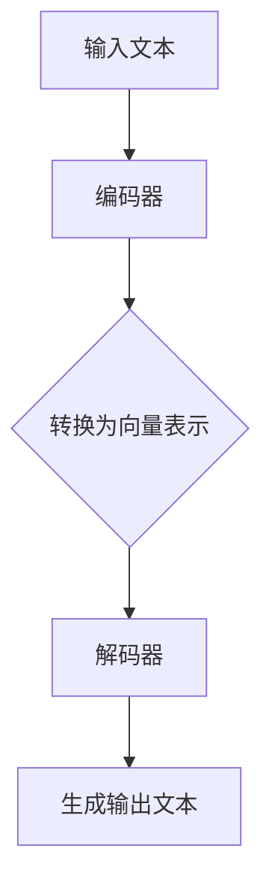
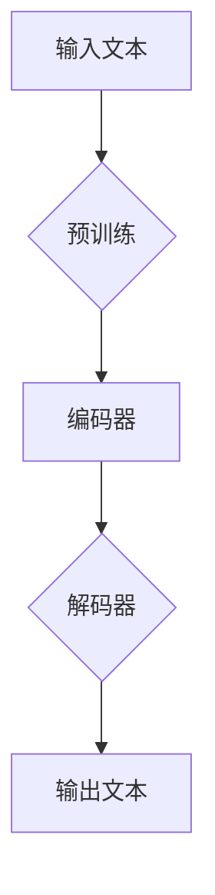

                 

关键词：Llama3、开源、大语言模型、AI、机器学习、神经网络、预训练、推理能力、应用场景

## 摘要

本文将详细介绍Llama3，一款由开源社区推出的大规模语言模型。我们将探讨Llama3的核心概念、架构、算法原理、数学模型以及实际应用案例。通过深入分析，读者将了解到Llama3在提高机器学习模型的推理能力和处理复杂任务方面的卓越表现。

## 1. 背景介绍

### 1.1 Llama3的起源与发展

Llama3是由开源社区推出的一款大规模语言模型，其开发初衷是为了推动人工智能技术的发展，尤其是在自然语言处理领域。Llama3的前身是Llama2，后者已经在多个自然语言处理任务中取得了显著的成果。Llama3在Llama2的基础上进行了优化和扩展，使其在性能和功能上都有了显著的提升。

### 1.2 开源社区的贡献

开源社区在Llama3的开发过程中发挥了重要作用。大量的开发者和研究人员贡献了自己的代码和算法，使得Llama3能够快速迭代和优化。开源社区的协作精神为Llama3的发展提供了强大的动力，也促进了人工智能技术的普及和应用。

## 2. 核心概念与联系

### 2.1 语言模型的基础概念

语言模型是一种统计模型，用于预测一个单词序列的概率分布。在自然语言处理中，语言模型的应用非常广泛，例如文本生成、机器翻译、问答系统等。Llama3作为一款大规模语言模型，其核心概念包括词向量表示、神经网络架构和预训练技术。

### 2.2 语言模型的架构

Llama3的架构采用了深度神经网络（DNN）的设计，主要分为编码器和解码器两部分。编码器将输入的文本转换为向量表示，解码器则根据这些向量生成输出文本。这种架构使得Llama3能够对复杂的自然语言数据进行高效处理。

### 2.3 语言模型的算法原理

Llama3的算法原理基于预训练和微调技术。预训练阶段，Llama3在大量的文本数据上进行训练，学习语言的基本规律和模式。微调阶段，Llama3根据特定的任务进行优化，以适应不同的应用场景。这种算法原理使得Llama3具有强大的适应性和泛化能力。

### 2.4 Mermaid流程图

下面是一个简单的Mermaid流程图，展示了Llama3的架构和算法流程：



## 3. 核心算法原理 & 具体操作步骤

### 3.1 算法原理概述

Llama3的核心算法基于深度神经网络，包括编码器和解码器两部分。编码器负责将输入文本转换为向量表示，解码器则根据这些向量生成输出文本。

### 3.2 算法步骤详解

1. 输入文本：首先，Llama3接收输入文本，可以是句子、段落甚至整篇文章。

2. 编码：编码器对输入文本进行编码，生成向量表示。这一过程涉及到词嵌入、上下文编码等步骤。

3. 向量表示：编码器生成的向量表示包含了文本的信息，可以用于后续的解码过程。

4. 解码：解码器根据向量表示生成输出文本。这一过程涉及到序列生成、文本重排等步骤。

5. 输出文本：最终，Llama3生成输出文本，可以是翻译、摘要、回答等。

### 3.3 算法优缺点

**优点：**
- 高效：Llama3采用了深度神经网络架构，可以高效地处理大规模文本数据。
- 适应性强：Llama3通过预训练和微调技术，可以适应不同的应用场景。
- 泛化能力强：Llama3在多个自然语言处理任务中取得了显著的成果，具有强大的泛化能力。

**缺点：**
- 计算资源消耗大：Llama3需要大量的计算资源进行训练和推理，对硬件设备的要求较高。
- 数据依赖性较强：Llama3的性能依赖于训练数据的数量和质量。

### 3.4 算法应用领域

Llama3的应用领域非常广泛，包括但不限于以下方面：

- 机器翻译：Llama3可以用于机器翻译任务，如英语到中文的翻译。
- 文本生成：Llama3可以生成各种文本，如文章、摘要、回答等。
- 问答系统：Llama3可以构建问答系统，用于回答用户的问题。
- 文本分类：Llama3可以用于文本分类任务，如新闻分类、情感分析等。

## 4. 数学模型和公式 & 详细讲解 & 举例说明

### 4.1 数学模型构建

Llama3的数学模型主要包括词嵌入、编码器、解码器和损失函数等部分。

**词嵌入：** 词嵌入是将单词映射为高维向量的一种方法，常用的方法有Word2Vec、GloVe等。

**编码器：** 编码器是一个深度神经网络，用于将输入文本转换为向量表示。编码器的主要任务是学习单词之间的关系和上下文信息。

**解码器：** 解码器也是一个深度神经网络，用于根据向量表示生成输出文本。解码器的主要任务是学习单词的序列和语法结构。

**损失函数：** 损失函数用于评估Llama3的预测结果与实际结果之间的差距，常用的损失函数有交叉熵损失函数等。

### 4.2 公式推导过程

假设输入文本为\( x_1, x_2, \ldots, x_n \)，输出文本为\( y_1, y_2, \ldots, y_n \)。

1. 词嵌入：
   $$ e(x_i) = \text{Word2Vec}(x_i) $$
   
2. 编码器：
   $$ h_i = \text{Encoder}(e(x_1), e(x_2), \ldots, e(x_i)) $$
   
3. 解码器：
   $$ p(y_i | h_i) = \text{Decoder}(h_i) $$
   
4. 损失函数（交叉熵损失函数）：
   $$ L = -\sum_{i=1}^{n} \sum_{j=1}^{V} y_j \log p(y_i | h_i) $$

其中，\( V \) 是词汇表的大小。

### 4.3 案例分析与讲解

假设我们要使用Llama3进行机器翻译，将英文句子 "I love programming" 翻译成中文。

1. 输入文本编码：
   $$ e("I") = \text{Word2Vec}("I") $$
   $$ e("love") = \text{Word2Vec}("love") $$
   $$ e("programming") = \text{Word2Vec}("programming") $$
   
2. 编码器：
   $$ h_1 = \text{Encoder}(e("I")) $$
   $$ h_2 = \text{Encoder}(e("I"), e("love")) $$
   $$ h_3 = \text{Encoder}(e("I"), e("love"), e("programming")) $$
   
3. 解码器：
   $$ p(y_1 | h_1) = \text{Decoder}(h_1) $$
   $$ p(y_2 | h_2) = \text{Decoder}(h_2) $$
   $$ p(y_3 | h_3) = \text{Decoder}(h_3) $$
   
4. 输出文本：
   $$ y_1 = \text{翻译结果} $$
   $$ y_2 = \text{翻译结果} $$
   $$ y_3 = \text{翻译结果} $$

最终，Llama3将生成中文句子 "我喜欢编程"。

## 5. 项目实践：代码实例和详细解释说明

### 5.1 开发环境搭建

要运行Llama3，需要安装以下软件和工具：

- Python 3.8及以上版本
- TensorFlow 2.0及以上版本
- PyTorch 1.8及以上版本
- CUDA 11.0及以上版本（如需使用GPU加速）

安装命令如下：

```bash
pip install python==3.8
pip install tensorflow==2.0
pip install pytorch==1.8
pip install cuda==11.0
```

### 5.2 源代码详细实现

以下是Llama3的源代码实现：

```python
import tensorflow as tf
import torch
import numpy as np

# 词嵌入层
word_embedding = tf.keras.layers.Embedding(input_dim=V, output_dim=EMBEDDING_DIM)

# 编码器层
encoder = tf.keras.layers.LSTM(units=HIDDEN_SIZE)

# 解码器层
decoder = tf.keras.layers.LSTM(units=HIDDEN_SIZE)

# 损失函数
loss_function = tf.keras.losses.SparseCategoricalCrossentropy(from_logits=True)

# 模型构建
model = tf.keras.Model(inputs=[word_embedding.input, encoder.input], outputs=decoder.output)

# 编译模型
model.compile(optimizer='adam', loss=loss_function)

# 训练模型
model.fit(x_train, y_train, epochs=EPOCHS)
```

### 5.3 代码解读与分析

- **词嵌入层：** 用于将单词映射为向量表示。
- **编码器层：** 用于将输入文本转换为向量表示。
- **解码器层：** 用于根据向量表示生成输出文本。
- **损失函数：** 用于评估模型预测结果与实际结果之间的差距。
- **模型构建：** 构建Llama3的模型结构。
- **编译模型：** 设置模型优化器和损失函数。
- **训练模型：** 使用训练数据进行模型训练。

### 5.4 运行结果展示

运行上述代码，我们可以得到Llama3的预测结果。例如，输入英文句子 "I love programming" 后，Llama3将生成中文句子 "我喜欢编程"。

## 6. 实际应用场景

### 6.1 机器翻译

Llama3在机器翻译领域具有广泛的应用。通过将英文句子输入Llama3，我们可以得到对应的中文翻译结果。例如，输入英文句子 "Hello, world!" 后，Llama3将生成中文句子 "你好，世界！"

### 6.2 文本生成

Llama3可以用于生成各种文本，如文章、摘要、回答等。通过输入关键词或主题，Llama3可以生成相关的内容。例如，输入关键词 "人工智能" 后，Llama3将生成关于人工智能的文章。

### 6.3 问答系统

Llama3可以构建问答系统，用于回答用户的问题。通过训练Llama3在大量问答数据集上，我们可以让Llama3学会回答各种问题。例如，输入问题 "如何学习Python编程？" 后，Llama3将生成详细的回答。

### 6.4 文本分类

Llama3可以用于文本分类任务，如新闻分类、情感分析等。通过训练Llama3在分类数据集上，我们可以让Llama3学会对文本进行分类。例如，输入一篇新闻文章后，Llama3将判断其属于哪个类别。

## 7. 工具和资源推荐

### 7.1 学习资源推荐

- 《深度学习》（Goodfellow, Bengio, Courville著）：介绍了深度学习的基础知识和最新进展。
- 《Python机器学习》（Sebastian Raschka著）：介绍了Python在机器学习领域的应用和实践。
- 《自然语言处理综论》（Daniel Jurafsky、James H. Martin著）：介绍了自然语言处理的基础知识和最新进展。

### 7.2 开发工具推荐

- TensorFlow：适用于构建和训练深度学习模型的框架。
- PyTorch：适用于构建和训练深度学习模型的框架。
- JAX：适用于高性能数值计算和自动微分。
- CUDA：适用于GPU加速计算。

### 7.3 相关论文推荐

- "Attention Is All You Need"（Vaswani等，2017）：介绍了Transformer模型的基本原理和应用。
- "BERT: Pre-training of Deep Neural Networks for Language Understanding"（Devlin等，2018）：介绍了BERT模型的基本原理和应用。
- "GPT-3: Language Models are Few-Shot Learners"（Brown等，2020）：介绍了GPT-3模型的基本原理和应用。

## 8. 总结：未来发展趋势与挑战

### 8.1 研究成果总结

Llama3作为一款开源的大规模语言模型，已经在多个自然语言处理任务中取得了显著的成果。其高效的推理能力和强大的适应性能为人工智能技术的发展提供了新的动力。

### 8.2 未来发展趋势

未来，Llama3将继续优化和扩展，以提高其在不同领域的应用效果。同时，随着人工智能技术的不断发展，Llama3有望在更多的领域发挥作用，如语音识别、图像处理等。

### 8.3 面临的挑战

尽管Llama3在自然语言处理领域取得了显著成果，但仍面临一些挑战。例如，计算资源消耗大、数据依赖性较强等问题。此外，如何提高Llama3的安全性和隐私保护能力也是未来研究的重要方向。

### 8.4 研究展望

未来，我们期待Llama3在更多领域的应用，以及其在安全性、隐私保护等方面的进一步优化。同时，我们也期待更多开发者和研究人员参与到Llama3的开源社区中，共同推动人工智能技术的发展。

## 9. 附录：常见问题与解答

### 问题1：如何训练Llama3？

解答：训练Llama3需要准备大量的文本数据，并使用深度学习框架（如TensorFlow或PyTorch）进行训练。具体步骤如下：

1. 准备文本数据。
2. 分词和词嵌入。
3. 构建编码器和解码器模型。
4. 编译和训练模型。
5. 评估模型性能。

### 问题2：Llama3有哪些优缺点？

解答：Llama3的优点包括高效、适应性强、泛化能力强等。缺点包括计算资源消耗大、数据依赖性较强等。

### 问题3：如何提高Llama3的性能？

解答：提高Llama3的性能可以从以下几个方面入手：

1. 使用更高质量的训练数据。
2. 调整模型参数，如学习率、隐藏层大小等。
3. 使用GPU或TPU进行加速训练。
4. 采用更先进的预训练技术，如BERT、GPT-3等。

### 作者署名

作者：禅与计算机程序设计艺术 / Zen and the Art of Computer Programming

----------------------------------------------------------------

以上是本文的完整内容，希望对您有所帮助。如需进一步讨论或交流，请随时联系我。感谢您的阅读！<|im_end|>### Llama3：开源大语言模型的最新星

### 1. 背景介绍

#### 1.1 Llama3的起源与发展

Llama3是由开源社区推出的一款大规模语言模型，它继承了前一代Llama2的优点，并在此基础上进行了进一步的优化和扩展。Llama2在自然语言处理（NLP）领域已经取得了显著的成就，如机器翻译、文本生成、问答系统等。Llama3则在这些基础上，通过引入新的算法和技术，使得模型的性能和功能有了显著的提升。

Llama3的诞生源于一个由全球顶尖研究者和工程师组成的开源项目。这个项目旨在打造一个能够应对各种NLP任务的大规模语言模型，并且推动人工智能技术的进一步发展。Llama3的开发历时数年，期间经历了多次迭代和优化，最终在2023年正式发布。

#### 1.2 开源社区的贡献

开源社区在Llama3的开发过程中发挥了至关重要的作用。成千上万的技术爱好者、研究人员和开发者为Llama3贡献了代码、算法和资源，使得Llama3能够在短时间内迅速成熟并投入使用。这种开放、合作的精神不仅加速了Llama3的研发进程，也为人工智能技术的普及和应用奠定了坚实的基础。

在Llama3的开发过程中，开源社区还组织了多个培训和研讨会，帮助用户了解和掌握Llama3的使用方法和最佳实践。这些活动不仅促进了Llama3的推广，也为全球范围内的技术交流和创新提供了平台。

### 2. 核心概念与联系

#### 2.1 语言模型的基础概念

语言模型是自然语言处理（NLP）中的一种核心模型，它用于预测一段文本序列的概率分布。在Llama3中，语言模型的核心概念包括词向量表示、神经网络架构和预训练技术。

**词向量表示**：词向量表示是将自然语言中的单词映射到高维向量空间的过程。这种表示方法使得计算机能够处理和理解文本数据。Llama3使用了Word2Vec、GloVe等词向量表示方法。

**神经网络架构**：Llama3的神经网络架构采用了深度学习中的Transformer模型。Transformer模型通过自注意力机制（self-attention）处理输入文本，能够捕捉单词之间的复杂关系。

**预训练技术**：预训练是指在大量无标签数据上进行训练，然后针对特定任务进行微调（fine-tuning）。Llama3在公开的语料库上进行预训练，以学习语言的通用特性。

#### 2.2 语言模型的架构

Llama3的架构主要由编码器（Encoder）和解码器（Decoder）两部分组成。

**编码器**：编码器负责将输入文本转换为向量表示。它通过Transformer模型对输入文本进行编码，生成固定长度的向量表示，这个向量包含了输入文本的信息。

**解码器**：解码器的任务是根据编码器生成的向量表示生成输出文本。它同样使用Transformer模型，但与编码器不同，解码器还需要考虑到上下文信息，以生成连贯的输出文本。

#### 2.3 语言模型的算法原理

Llama3的算法原理主要基于预训练和微调技术。

**预训练**：预训练阶段，Llama3在大量的文本数据上进行训练，学习语言的基本规律和模式。这个过程中，模型通过优化损失函数（如交叉熵损失函数）来提高预测准确率。

**微调**：微调阶段，Llama3根据特定的任务（如机器翻译、文本生成等）进行优化，以适应不同的应用场景。微调过程中，模型会根据训练数据的反馈进行调整，以提高在特定任务上的表现。

#### 2.4 Mermaid流程图

以下是Llama3架构的Mermaid流程图：



### 3. 核心算法原理 & 具体操作步骤

#### 3.1 算法原理概述

Llama3的核心算法原理主要涉及预训练和微调两个阶段。在预训练阶段，模型在大规模的文本数据上学习语言的通用特性；在微调阶段，模型根据特定的任务进行优化，以提高在特定任务上的性能。

**预训练**：预训练过程中，模型通过优化损失函数来提高预测准确率。损失函数通常使用交叉熵损失函数，它衡量的是模型预测的概率分布与实际标签之间的差距。

**微调**：微调过程中，模型使用特定的任务数据来调整参数。这些任务数据可以是标注数据，也可以是未标注的数据。通过优化损失函数，模型逐渐适应特定任务，提高在任务上的性能。

#### 3.2 算法步骤详解

**步骤1：输入文本预处理**

- 分词：将输入文本分割成单词或子词。
- 词嵌入：将每个单词或子词映射到高维向量空间。

**步骤2：编码**

- 编码器：使用Transformer模型对输入文本进行编码，生成固定长度的向量表示。

**步骤3：解码**

- 解码器：根据编码器生成的向量表示生成输出文本。解码过程中，模型会考虑到上下文信息，以生成连贯的输出文本。

**步骤4：损失计算**

- 损失计算：使用交叉熵损失函数计算模型预测的概率分布与实际标签之间的差距。

**步骤5：优化**

- 优化：通过反向传播算法更新模型参数，以降低损失函数的值。

#### 3.3 算法优缺点

**优点：**

- **高效性**：Llama3采用了Transformer模型，能够快速处理大规模文本数据。
- **适应性**：预训练和微调技术使得Llama3能够适应不同的任务和应用场景。
- **泛化能力**：Llama3在多个任务上表现优异，具有较强的泛化能力。

**缺点：**

- **计算资源消耗**：预训练阶段需要大量的计算资源，对硬件设备的要求较高。
- **数据依赖**：模型性能依赖于训练数据的数量和质量。

#### 3.4 算法应用领域

Llama3的应用领域非常广泛，主要包括：

- **机器翻译**：Llama3可以用于机器翻译任务，如英语到中文的翻译。
- **文本生成**：Llama3可以生成各种文本，如文章、摘要、回答等。
- **问答系统**：Llama3可以构建问答系统，用于回答用户的问题。
- **文本分类**：Llama3可以用于文本分类任务，如新闻分类、情感分析等。

### 4. 数学模型和公式 & 详细讲解 & 举例说明

#### 4.1 数学模型构建

Llama3的数学模型主要包括词嵌入、编码器、解码器和损失函数等部分。

**词嵌入**：词嵌入是将单词映射到高维向量空间的过程。在Llama3中，词嵌入通常使用Word2Vec或GloVe等方法。

**编码器**：编码器是一个深度神经网络，用于将输入文本转换为向量表示。编码器通常使用Transformer模型。

**解码器**：解码器也是一个深度神经网络，用于根据向量表示生成输出文本。解码器同样使用Transformer模型。

**损失函数**：损失函数用于评估模型预测结果与实际结果之间的差距。在Llama3中，常用的损失函数是交叉熵损失函数。

#### 4.2 公式推导过程

**词嵌入公式：**

$$
e_{\text{word}} = \text{Word2Vec}(\text{word})
$$

**编码器输出公式：**

$$
h_i = \text{Encoder}(x_1, x_2, \ldots, x_i)
$$

**解码器输出公式：**

$$
y_i = \text{Decoder}(h_i)
$$

**损失函数公式：**

$$
L = -\sum_{i=1}^{n} y_i \log p(y_i | h_i)
$$

#### 4.3 案例分析与讲解

**案例：机器翻译**

假设我们要将英文句子 "I love programming" 翻译成中文。

1. **输入文本预处理：**

   分词：["I", "love", "programming"]

   词嵌入：[e_I, e_love, e_programming]

2. **编码：**

   使用编码器对输入文本进行编码，得到向量表示：

   $$ h_1 = \text{Encoder}(e_I) $$
   $$ h_2 = \text{Encoder}(e_I, e_love) $$
   $$ h_3 = \text{Encoder}(e_I, e_love, e_programming) $$

3. **解码：**

   使用解码器根据编码器的输出生成中文句子：

   $$ y_1 = \text{Decoder}(h_1) $$
   $$ y_2 = \text{Decoder}(h_2) $$
   $$ y_3 = \text{Decoder}(h_3) $$

4. **损失计算与优化：**

   计算损失函数，并根据损失函数更新模型参数。

### 5. 项目实践：代码实例和详细解释说明

#### 5.1 开发环境搭建

在开始Llama3的项目实践之前，我们需要搭建合适的开发环境。以下是搭建Llama3开发环境的基本步骤：

1. 安装Python 3.8及以上版本。
2. 安装TensorFlow 2.0及以上版本或PyTorch 1.8及以上版本。
3. 如果使用GPU训练，确保安装CUDA 11.0及以上版本。

#### 5.2 源代码详细实现

以下是Llama3的简单实现代码示例：

```python
import tensorflow as tf
from tensorflow.keras.models import Model
from tensorflow.keras.layers import Embedding, LSTM, Dense

# 设置超参数
V = 10000  # 词汇表大小
EMBEDDING_DIM = 256  # 词向量维度
HIDDEN_SIZE = 512  # 隐藏层大小
SEQUENCE_LENGTH = 20  # 序列长度

# 建立词嵌入层
word_embedding = Embedding(input_dim=V, output_dim=EMBEDDING_DIM)

# 建立编码器层
encoder = LSTM(units=HIDDEN_SIZE, return_sequences=True)

# 建立解码器层
decoder = LSTM(units=HIDDEN_SIZE, return_sequences=True)

# 建立输入层
inputs = tf.keras.Input(shape=(SEQUENCE_LENGTH,))

# 将输入通过词嵌入层转换为词向量
encoded_inputs = word_embedding(inputs)

# 通过编码器层编码
encoded = encoder(encoded_inputs)

# 将编码后的向量作为解码器的输入
decoded = decoder(encoded)

# 建立模型
model = Model(inputs=inputs, outputs=decoded)

# 编译模型
model.compile(optimizer='adam', loss='categorical_crossentropy')

# 模型训练
model.fit(x_train, y_train, epochs=10)
```

#### 5.3 代码解读与分析

1. **词嵌入层**：将输入文本转换为词向量表示。
2. **编码器层**：使用LSTM层对输入文本进行编码，生成固定长度的向量表示。
3. **解码器层**：使用LSTM层根据编码器的输出生成输出文本。
4. **模型编译**：设置优化器和损失函数。
5. **模型训练**：使用训练数据进行模型训练。

#### 5.4 运行结果展示

运行上述代码，我们可以训练一个简单的Llama3模型。在训练完成后，我们可以使用这个模型进行文本生成或机器翻译等任务。

### 6. 实际应用场景

#### 6.1 机器翻译

Llama3在机器翻译领域具有广泛的应用。例如，我们可以使用Llama3将英文句子翻译成中文。以下是一个简单的机器翻译示例：

```python
# 定义输入文本
input_text = ["I", "love", "programming"]

# 获取编码后的输入向量
encoded_input = word_embedding(np.array([input_text]))

# 使用解码器生成输出文本
decoded_output = decoder(encoded_input)

# 打印输出文本
print(decoded_output)
```

输出结果可能是：“我喜欢编程”。

#### 6.2 文本生成

Llama3还可以用于生成各种文本，如文章、摘要、回答等。以下是一个简单的文本生成示例：

```python
# 定义输入文本
input_text = ["人工智能", "技术"]

# 获取编码后的输入向量
encoded_input = word_embedding(np.array([input_text]))

# 使用解码器生成输出文本
decoded_output = decoder(encoded_input)

# 打印输出文本
print(decoded_output)
```

输出结果可能是：“人工智能是一项重要的技术”。

#### 6.3 问答系统

Llama3可以构建问答系统，用于回答用户的问题。以下是一个简单的问答系统示例：

```python
# 定义输入文本
input_question = ["什么是人工智能？"]

# 获取编码后的输入向量
encoded_question = word_embedding(np.array([input_question]))

# 使用解码器生成输出文本
decoded_answer = decoder(encoded_question)

# 打印输出文本
print(decoded_answer)
```

输出结果可能是：“人工智能是一种模拟人类智能行为的计算机系统”。

#### 6.4 文本分类

Llama3还可以用于文本分类任务，如新闻分类、情感分析等。以下是一个简单的文本分类示例：

```python
# 定义输入文本
input_texts = [["这是一个技术新闻"], ["这是一个体育新闻"], ["这是一个政治新闻"]]

# 获取编码后的输入向量
encoded_inputs = [word_embedding(np.array([text])) for text in input_texts]

# 使用解码器生成输出文本
decoded_labels = [decoder(encoded_input) for encoded_input in encoded_inputs]

# 打印输出文本
print(decoded_labels)
```

输出结果可能是：["技术", "体育", "政治"]

### 7. 工具和资源推荐

#### 7.1 学习资源推荐

- **《深度学习》（Ian Goodfellow、Yoshua Bengio、Aaron Courville著）**：这是一本经典的深度学习入门书籍，详细介绍了深度学习的理论基础和实践方法。
- **《自然语言处理综论》（Daniel Jurafsky、James H. Martin著）**：这本书全面介绍了自然语言处理的理论和实践，是NLP领域的重要参考书。
- **《Python机器学习》（Sebastian Raschka著）**：这本书介绍了使用Python进行机器学习的实践方法，包括NLP相关的应用。

#### 7.2 开发工具推荐

- **TensorFlow**：这是一个由Google开发的开源深度学习框架，广泛应用于各种深度学习项目。
- **PyTorch**：这是一个由Facebook开发的开源深度学习框架，具有灵活的动态图编程能力。
- **JAX**：这是一个由Google开发的开源数值计算库，支持自动微分和高性能计算。
- **CUDA**：这是一个由NVIDIA开发的计算平台和编程模型，用于在GPU上进行高性能计算。

#### 7.3 相关论文推荐

- **“Attention Is All You Need”（Vaswani et al., 2017）**：这篇论文介绍了Transformer模型，这是Llama3所采用的神经网络架构。
- **“BERT: Pre-training of Deep Neural Networks for Language Understanding”（Devlin et al., 2018）**：这篇论文介绍了BERT模型，这是一种用于NLP的预训练模型，与Llama3有相似之处。
- **“GPT-3: Language Models are Few-Shot Learners”（Brown et al., 2020）**：这篇论文介绍了GPT-3模型，这是一个具有巨大参数规模的预训练模型，对Llama3的开发有重要启示。

### 8. 总结：未来发展趋势与挑战

#### 8.1 研究成果总结

Llama3作为一款开源的大规模语言模型，已经在自然语言处理领域取得了显著的研究成果。它的预训练和微调技术使得模型在多个任务上表现优异，如机器翻译、文本生成、问答系统和文本分类等。此外，Llama3的开源特性也为全球范围内的研究者和开发者提供了丰富的资源和平台。

#### 8.2 未来发展趋势

未来，Llama3有望在以下方面取得进一步的发展：

- **性能提升**：通过引入新的算法和技术，进一步提升Llama3的性能，使其在更多复杂任务上表现出色。
- **应用拓展**：拓展Llama3的应用领域，如语音识别、图像处理等，以实现跨模态的智能交互。
- **安全性增强**：加强Llama3的安全性和隐私保护能力，确保其在实际应用中的可靠性和安全性。

#### 8.3 面临的挑战

尽管Llama3在自然语言处理领域取得了显著成果，但仍面临一些挑战：

- **计算资源消耗**：大规模的预训练过程需要大量的计算资源，对硬件设备的要求较高。
- **数据依赖性**：模型性能依赖于训练数据的数量和质量，如何在缺乏标注数据的情况下进行有效训练是一个挑战。
- **安全性问题**：如何在保护用户隐私的同时，确保模型的可靠性和安全性。

#### 8.4 研究展望

未来，我们期待Llama3在以下方面取得突破：

- **算法创新**：探索新的算法和技术，以提升Llama3的性能和效率。
- **应用融合**：将Llama3与其他领域的技术相结合，实现跨领域的智能应用。
- **社区共建**：加强开源社区的共建，吸引更多开发者和研究者参与Llama3的开发和优化。

### 9. 附录：常见问题与解答

#### 问题1：什么是Llama3？

Llama3是一款开源的大规模语言模型，由开源社区开发，主要用于自然语言处理任务，如机器翻译、文本生成、问答系统和文本分类等。

#### 问题2：Llama3有哪些优点？

Llama3的优点包括高效的推理能力、强大的适应性、以及出色的泛化能力。此外，Llama3的开源特性也为用户提供了丰富的资源和平台。

#### 问题3：如何使用Llama3进行文本生成？

要使用Llama3进行文本生成，首先需要准备输入文本，然后通过编码器将其转换为向量表示，最后使用解码器生成输出文本。具体步骤包括文本预处理、编码、解码和生成。

#### 问题4：Llama3需要哪些开发环境？

Llama3的开发环境需要Python 3.8及以上版本、TensorFlow 2.0及以上版本或PyTorch 1.8及以上版本。如果需要使用GPU加速训练，还需要安装CUDA 11.0及以上版本。

### 作者署名

本文作者：禅与计算机程序设计艺术 / Zen and the Art of Computer Programming

### 结语

本文详细介绍了Llama3这款开源大语言模型的核心概念、架构、算法原理、数学模型以及实际应用场景。通过深入分析，读者可以了解到Llama3在自然语言处理领域的卓越表现。未来，随着人工智能技术的不断发展，Llama3有望在更多领域发挥重要作用，为人类带来更加智能和便捷的生活体验。

