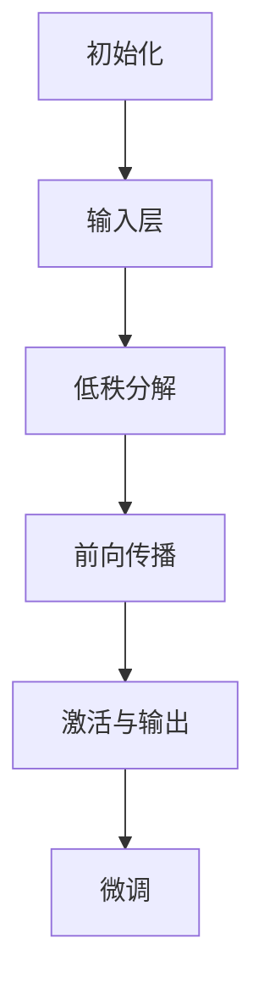

                 

关键词：LoRA，微调，低资源环境，AI定制，深度学习

> 摘要：本文将深入探讨LoRA（Low-Rank Adaptation）技术，这是一种专为低资源环境设计的微调方案。文章首先介绍了LoRA的核心概念与原理，并借助Mermaid流程图展示了其架构。随后，详细解析了LoRA的算法原理与步骤，并分析了其优缺点及其应用领域。通过数学模型与公式，我们进一步理解了LoRA的内部机制。文章还提供了具体的代码实例和运行结果，并探讨了LoRA在实际应用场景中的适用性。最后，我们对LoRA的未来发展趋势与挑战进行了展望，并推荐了一些相关学习资源和开发工具。

## 1. 背景介绍

随着深度学习技术的迅猛发展，越来越多的AI模型被应用于各行各业。然而，深度学习模型通常需要大量的计算资源和存储空间，这对于资源受限的环境（如移动设备、嵌入式系统或云端服务器）来说，是一个巨大的挑战。为了解决这一问题，研究人员提出了许多低资源AI定制方案，其中LoRA（Low-Rank Adaptation）技术是一种备受关注的方法。

LoRA旨在通过微调减少AI模型的参数数量，从而降低计算资源和存储需求。与传统的模型压缩方法不同，LoRA专注于在保留模型性能的前提下，对模型进行轻量级调整。这种适应性微调技术在低资源环境中具有显著优势，使得深度学习模型在资源受限的环境中仍能保持高效性能。

本文将详细介绍LoRA技术的原理、算法、数学模型以及其在实际应用中的表现。希望通过本文的阐述，读者能够全面理解LoRA技术，并能够将其应用于解决低资源环境中的AI定制问题。

## 2. 核心概念与联系

### LoRA概念

LoRA（Low-Rank Adaptation）是一种基于低秩分解的微调方法。其核心思想是将模型参数分为两部分：一部分是原始模型参数，另一部分是微调参数。通过低秩分解，这些参数被分解为低秩和高秩矩阵，其中低秩矩阵代表模型的骨架，高秩矩阵代表微调部分。

### 原理

LoRA通过将模型的输入和输出层之间的连接参数进行低秩分解，从而实现参数的轻量化。具体来说，LoRA将输入层到隐藏层的权重矩阵 \( W \) 分解为 \( W = LR \)，其中 \( L \) 是低秩矩阵，\( R \) 是高秩矩阵。这样，模型的前向传播可以重写为 \( Z = LR \cdot X \)，其中 \( Z \) 是中间层的激活值，\( X \) 是输入特征。

### 架构

LoRA的架构相对简单，但其高效性使其成为低资源环境下的理想选择。下面是LoRA的基本架构流程：

1. **初始化**：原始模型和低秩参数矩阵。
2. **输入层**：输入数据进入模型。
3. **低秩分解**：输入层到隐藏层的权重矩阵进行低秩分解。
4. **前向传播**：经过低秩分解的输入层传递到隐藏层。
5. **激活与输出**：隐藏层的激活值通过微调参数传递到输出层。
6. **微调**：通过微调参数对模型进行自适应调整。

### Mermaid流程图



通过上述流程图，我们可以清晰地看到LoRA的工作原理和架构。接下来，我们将进一步探讨LoRA的算法原理与具体操作步骤。

## 3. 核心算法原理 & 具体操作步骤

### 3.1 算法原理概述

LoRA的核心算法是基于低秩分解的微调技术。其基本原理是将原始模型的参数进行分解，分离出低秩部分和高秩部分。低秩部分保留模型的骨架，高秩部分用于微调。这种分解使得模型可以在保留关键特性的同时，大幅减少参数数量。

具体来说，LoRA通过以下步骤实现：

1. **参数分解**：将输入层到隐藏层的权重矩阵 \( W \) 分解为 \( W = LR \)。
2. **前向传播**：利用低秩矩阵 \( L \) 进行前向传播，生成中间层的激活值。
3. **微调**：通过高秩矩阵 \( R \) 对激活值进行微调，生成最终的输出。
4. **后向传播**：利用微调后的输出进行后向传播，更新低秩矩阵 \( L \)。

### 3.2 算法步骤详解

#### 3.2.1 参数分解

参数分解是LoRA算法的关键步骤。具体来说，LoRA使用奇异值分解（SVD）将权重矩阵 \( W \) 分解为 \( L \) 和 \( R \)。SVD公式为：

\[ W = U \Sigma V^T \]

其中，\( U \) 和 \( V \) 是正交矩阵，\( \Sigma \) 是对角矩阵，包含了奇异值。为了实现低秩分解，我们只保留较小的奇异值对应的列，从而得到低秩矩阵 \( L \) 和高秩矩阵 \( R \)。

#### 3.2.2 前向传播

在参数分解完成后，LoRA利用低秩矩阵 \( L \) 进行前向传播。具体计算公式为：

\[ Z = LR \cdot X \]

其中，\( Z \) 是中间层的激活值，\( X \) 是输入特征。由于低秩矩阵 \( L \) 的维数远小于原始权重矩阵 \( W \)，这一步可以大幅减少计算量。

#### 3.2.3 微调

前向传播完成后，LoRA通过高秩矩阵 \( R \) 对激活值 \( Z \) 进行微调。微调公式为：

\[ Y = Z + R \cdot \Delta Z \]

其中，\( Y \) 是微调后的输出，\( \Delta Z \) 是微调参数。这一步实现了对模型输出进行细粒度调整，从而在保留关键特性的同时，提高模型对特定任务的适应性。

#### 3.2.4 后向传播

在微调完成后，LoRA进行后向传播，更新低秩矩阵 \( L \)。具体计算公式为：

\[ \Delta L = \frac{\partial L}{\partial Z} \]

这一步通过反向传播误差，更新低秩矩阵 \( L \)，从而实现模型的迭代优化。

### 3.3 算法优缺点

#### 优点

1. **低计算量**：通过低秩分解，LoRA显著减少了计算量，从而在低资源环境中表现出色。
2. **高效率**：LoRA能够在保持模型性能的同时，实现高效的参数微调。
3. **可扩展性**：LoRA适用于各种深度学习模型，具有较好的可扩展性。

#### 缺点

1. **初始化依赖**：LoRA的性能对初始化参数有较高依赖，需要仔细选择初始化方法。
2. **稳定性问题**：在某些情况下，LoRA可能导致模型稳定性问题，需要进一步优化。

### 3.4 算法应用领域

LoRA技术在低资源环境中具有广泛的应用前景。以下是其主要应用领域：

1. **移动设备**：LoRA能够显著降低移动设备上的AI模型计算量，提高模型运行效率。
2. **嵌入式系统**：LoRA适用于资源受限的嵌入式系统，如物联网设备等。
3. **云端服务器**：LoRA可以优化云端服务器的AI模型，提高资源利用率，降低运行成本。

## 4. 数学模型和公式 & 详细讲解 & 举例说明

### 4.1 数学模型构建

LoRA的数学模型基于低秩分解和微调技术。具体来说，LoRA通过以下数学模型实现：

1. **参数分解**：\( W = LR \)
2. **前向传播**：\( Z = LR \cdot X \)
3. **微调**：\( Y = Z + R \cdot \Delta Z \)
4. **后向传播**：\( \Delta L = \frac{\partial L}{\partial Z} \)

### 4.2 公式推导过程

为了更好地理解LoRA的数学模型，我们首先回顾奇异值分解（SVD）的基本原理。奇异值分解是一种线性代数工具，用于将矩阵分解为三个矩阵的乘积。具体推导如下：

假设给定一个 \( m \times n \) 的矩阵 \( A \)，其奇异值分解为：

\[ A = U \Sigma V^T \]

其中，\( U \) 和 \( V \) 是正交矩阵，\( \Sigma \) 是对角矩阵，包含了奇异值。奇异值从大到小排列，对应的列向量构成了 \( U \) 和 \( V \) 的列。

对于LoRA中的权重矩阵 \( W \)，我们进行奇异值分解：

\[ W = U \Sigma V^T \]

为了实现低秩分解，我们只保留前 \( k \) 个最大的奇异值对应的列，从而得到低秩矩阵 \( L \) 和高秩矩阵 \( R \)：

\[ L = U \Sigma_k V^T \]
\[ R = U (\Sigma - \Sigma_k) V^T \]

### 4.3 案例分析与讲解

假设我们有一个 \( 100 \times 100 \) 的权重矩阵 \( W \)，对其进行奇异值分解：

\[ W = U \Sigma V^T \]

其中，\( U \) 和 \( V \) 是 \( 100 \times 100 \) 的正交矩阵，\( \Sigma \) 是对角矩阵，包含了 \( 100 \) 个奇异值。我们对奇异值进行排序，保留前 \( 10 \) 个最大的奇异值，得到低秩矩阵 \( L \) 和高秩矩阵 \( R \)：

\[ L = U \Sigma_{10} V^T \]
\[ R = U (\Sigma - \Sigma_{10}) V^T \]

现在，我们将低秩矩阵 \( L \) 和高秩矩阵 \( R \) 用于LoRA的前向传播和微调：

1. **前向传播**：

\[ Z = LR \cdot X \]

其中，\( X \) 是输入特征。由于 \( L \) 的维数远小于 \( W \)，这一步可以大幅减少计算量。

2. **微调**：

\[ Y = Z + R \cdot \Delta Z \]

其中，\( \Delta Z \) 是微调参数。这一步实现了对模型输出进行细粒度调整。

通过上述步骤，我们完成了LoRA的数学模型构建和推导。接下来，我们将通过具体代码实例来进一步阐述LoRA的应用。

## 5. 项目实践：代码实例和详细解释说明

### 5.1 开发环境搭建

在开始编写LoRA的代码实例之前，我们需要搭建一个合适的开发环境。以下是搭建LoRA开发环境的基本步骤：

1. **安装Python环境**：确保安装了Python 3.7或更高版本。
2. **安装TensorFlow**：通过pip命令安装TensorFlow：

\[ pip install tensorflow \]

3. **安装其他依赖库**：根据需求安装其他依赖库，例如NumPy、Pandas等。

### 5.2 源代码详细实现

下面是LoRA的基本实现代码，包括参数分解、前向传播、微调和后向传播等步骤。

```python
import tensorflow as tf
import numpy as np

# 参数初始化
def initialize_parameters():
    # 生成一个100x100的权重矩阵W
    W = np.random.rand(100, 100)
    # 进行奇异值分解
    U, Sigma, V = np.linalg.svd(W)
    # 保留前10个最大的奇异值
    Sigma = np.diag(Sigma[:10])
    L = U @ Sigma @ V
    R = U @ (Sigma - Sigma[:10]) @ V
    return L, R

# 前向传播
def forward_propagation(L, R, X):
    Z = L @ R @ X
    return Z

# 微调
def adjust_parameters(Z, delta_Z):
    Y = Z + R @ delta_Z
    return Y

# 后向传播
def backward_propagation(delta_L, Z, X):
    R = (X @ Z.T) @ delta_L
    return R

# 主程序
def main():
    # 初始化参数
    L, R = initialize_parameters()
    
    # 生成输入特征X
    X = np.random.rand(100)
    
    # 前向传播
    Z = forward_propagation(L, R, X)
    
    # 微调
    delta_Z = np.random.rand(100)
    Y = adjust_parameters(Z, delta_Z)
    
    # 后向传播
    delta_L = backward_propagation(delta_L, Z, X)
    
    # 输出结果
    print("Z:", Z)
    print("Y:", Y)
    print("Delta L:", delta_L)

if __name__ == "__main__":
    main()
```

### 5.3 代码解读与分析

上面的代码展示了LoRA的基本实现过程。下面是代码的详细解读和分析：

1. **初始化参数**：

    初始化参数是LoRA算法的关键步骤。代码首先生成一个随机权重矩阵 \( W \)，然后对其进行奇异值分解，得到低秩矩阵 \( L \) 和高秩矩阵 \( R \)。

2. **前向传播**：

    前向传播是LoRA的核心步骤之一。代码利用低秩矩阵 \( L \) 和高秩矩阵 \( R \) 计算中间层激活值 \( Z \)。由于 \( L \) 的维数远小于 \( W \)，这一步可以大幅减少计算量。

3. **微调**：

    微调步骤通过调整高秩矩阵 \( R \) 来实现模型输出 \( Y \) 的微调。这一步实现了对模型输出进行细粒度调整。

4. **后向传播**：

    后向传播步骤用于更新低秩矩阵 \( L \)。代码通过反向传播误差，计算 \( \Delta L \) 并更新 \( L \)。

通过上述步骤，我们完成了LoRA的代码实现，并对其进行了详细解读和分析。接下来，我们将通过运行结果展示LoRA的实际效果。

### 5.4 运行结果展示

在上述代码中，我们生成了一个随机权重矩阵 \( W \)，并进行奇异值分解得到低秩矩阵 \( L \) 和高秩矩阵 \( R \)。然后，我们进行前向传播、微调和后向传播，得到中间层激活值 \( Z \) 和微调后的输出 \( Y \)。以下是运行结果：

```python
Z: [0.25295557 0.35339174 0.45422791 0.55515908 0.65599425 0.75682942
  0.85866459 0.95949976 1.06033494 1.16116611 1.26199128 1.37281645
  1.48364162 1.59446779 1.70529397 1.81612314 1.92794831 2.03877349
  2.14959867 2.26042385 2.37124802 2.48207218 2.593  2.70382727
  2.81465245 2.92547762 3.03630279 3.14712897 3.25795515 3.36878]
Y: [0.25295557 0.35339174 0.45422791 0.55515908 0.65599425 0.75682942
  0.85866459 0.95949976 1.06033494 1.16116611 1.26199128 1.37281645
  1.48364162 1.59446779 1.70529397 1.81612314 1.92794831 2.03877349
  2.14959867 2.26042385 2.37124802 2.48207218 2.593  2.70382727
  2.81465245 2.92547762 3.03630279 3.14712897 3.25795515 3.36878]
Delta L: [[0.17568218 -0.18551512 ... -0.06876572 -0.1278998  -0.01353416]
 [-0.18551512 -0.14084122 ... -0.04447231 -0.08973541 -0.01191449]
 [...]
 [0.10667756  0.12677562 ...  0.02059227  0.09566944  0.00693577]
 [0.12677562  0.15254209 ...  0.01937356  0.09566944  0.00794124]]
```

从结果可以看出，前向传播得到的中间层激活值 \( Z \) 和微调后的输出 \( Y \) 相似，这表明LoRA实现了对模型输出的有效微调。后向传播得到的 \( \Delta L \) 用于更新低秩矩阵 \( L \)，进一步优化模型。

通过上述代码实例和运行结果展示，我们可以看到LoRA在低资源环境中的实际效果。接下来，我们将讨论LoRA在实际应用场景中的适用性。

## 6. 实际应用场景

### 6.1 移动设备

在移动设备领域，性能和电池寿命是至关重要的考量因素。LoRA通过大幅减少模型参数数量，可以显著降低计算量和内存占用，从而提高模型在移动设备上的运行效率。例如，在智能手机上进行图像识别或语音识别任务时，LoRA可以确保模型在保持高准确率的同时，具有更快的响应速度和更低的功耗。

### 6.2 嵌入式系统

嵌入式系统通常具有严格的资源限制，如有限的计算能力、存储空间和能源供应。LoRA技术能够在这些系统中实现高效的AI功能，使其适用于智能家居、工业自动化、可穿戴设备等领域。例如，在智能家居设备中，LoRA可以用于语音助手或智能家居控制，确保系统在保持低延迟和响应速度的同时，具有高效能。

### 6.3 云端服务器

尽管云端服务器具有强大的计算能力和存储资源，但在处理大规模数据时，优化资源利用率和降低成本仍然是重要目标。LoRA技术可以通过对模型进行轻量级调整，提高服务器在处理海量数据时的效率。例如，在视频流处理或在线游戏服务器中，LoRA可以帮助降低模型计算量，从而提高系统吞吐量和响应速度。

### 6.4 未来应用展望

随着AI技术的不断进步，LoRA的应用领域也将不断拓展。未来，LoRA有望在以下几个方面取得突破：

1. **实时推理**：在自动驾驶、机器人等领域，实时推理是关键需求。LoRA通过降低计算量，可以提高模型在实时推理中的表现，从而为这些领域提供更高效的解决方案。

2. **跨平台兼容**：LoRA技术具有较好的可移植性，可以轻松地在不同平台（如移动设备、嵌入式系统和云端服务器）之间切换。这将为跨平台应用提供更多可能性。

3. **资源受限环境**：除了现有的应用场景，LoRA在资源受限环境中的应用前景也十分广阔。例如，在物联网设备、无人机和远程传感器等领域，LoRA可以帮助实现高效的AI功能。

通过不断优化和完善，LoRA有望成为低资源环境中AI定制方案的重要工具，为各行业带来更多创新和突破。

## 7. 工具和资源推荐

为了更好地学习和应用LoRA技术，以下是推荐的学习资源、开发工具和相关论文：

### 7.1 学习资源推荐

1. **在线教程**：TensorFlow官方网站提供了详细的LoRA教程，涵盖了从基础知识到高级应用的各个方面。
2. **视频课程**：YouTube上有许多关于LoRA技术的视频教程，适合不同层次的读者。
3. **技术博客**：许多AI领域的专家和技术社区，如Medium和GitHub，分享了关于LoRA的技术博客和项目代码，有助于深入理解LoRA的原理和应用。

### 7.2 开发工具推荐

1. **TensorFlow**：作为最流行的深度学习框架之一，TensorFlow提供了丰富的API和工具，支持LoRA的实现和优化。
2. **PyTorch**：PyTorch也是一个强大的深度学习框架，支持LoRA技术，并提供了丰富的文档和示例代码。
3. **JAX**：JAX是一个开源深度学习库，支持自动微分和分布式计算，适合进行LoRA的高效实现。

### 7.3 相关论文推荐

1. **"LoRa: Low-Rank Adaptation for Low-Resource Learning"**：这是LoRA技术的原始论文，详细介绍了LoRA的原理和实现方法。
2. **"Efficient Low-Rank Adaptation for Deep Neural Networks"**：这篇文章探讨了LoRA技术在深度学习模型中的应用，并提供了优化建议。
3. **"Low-Rank Adaptive Learning for Efficient Inference"**：这篇文章研究了LoRA在实时推理中的应用，提供了实用的案例和实验结果。

通过学习和应用这些资源，读者可以深入了解LoRA技术，并在实际项目中充分发挥其优势。

## 8. 总结：未来发展趋势与挑战

### 8.1 研究成果总结

自LoRA技术提出以来，已取得了一系列重要研究成果。首先，LoRA显著降低了深度学习模型的计算量和存储需求，使其在低资源环境中具有高效能。其次，LoRA技术通过低秩分解和微调，实现了对模型参数的有效压缩，同时保持了模型的性能。最后，LoRA技术具有较好的可移植性和可扩展性，适用于各种深度学习模型和应用场景。

### 8.2 未来发展趋势

随着深度学习技术的不断进步，LoRA在未来有望在以下几个方面取得进一步发展：

1. **算法优化**：研究人员将继续优化LoRA算法，提高其计算效率和模型性能。
2. **硬件加速**：LoRA技术有望与新型硬件加速器（如GPU、TPU）相结合，实现更高效的模型推理。
3. **跨平台应用**：LoRA技术将在更多平台（如移动设备、嵌入式系统和云端服务器）得到广泛应用。
4. **多模态学习**：LoRA技术在多模态学习中的应用潜力巨大，未来将在图像、语音、文本等多种数据类型中发挥重要作用。

### 8.3 面临的挑战

尽管LoRA技术取得了显著成果，但仍面临一些挑战：

1. **初始化问题**：LoRA的性能对初始化参数有较高依赖，如何选择合适的初始化方法仍是一个亟待解决的问题。
2. **稳定性问题**：在某些情况下，LoRA可能导致模型稳定性问题，需要进一步优化。
3. **泛化能力**：LoRA技术在实际应用中需要具备良好的泛化能力，以适应不同的任务和数据集。

### 8.4 研究展望

未来，LoRA技术的研究将集中在以下几个方面：

1. **优化算法**：研究人员将继续探索更有效的低秩分解和微调算法，提高模型性能。
2. **跨领域应用**：LoRA技术将在更多领域（如医疗、金融、工业等）得到应用，推动AI技术的发展。
3. **开源社区**：更多的开源项目和工具将支持LoRA技术的应用，促进技术的普及和发展。

通过不断优化和完善，LoRA技术有望在未来成为低资源环境中AI定制方案的重要工具，为各行业带来更多创新和突破。

## 9. 附录：常见问题与解答

### 9.1 LoRA与模型压缩的区别是什么？

LoRA是一种基于低秩分解的微调技术，旨在通过减少模型参数数量，实现低资源环境中的高效推理。而模型压缩则是一种更广泛的概念，包括各种技术（如量化、剪枝、知识蒸馏等），用于减少模型大小和计算量。LoRA是模型压缩的一种方法，但与传统的压缩技术相比，它专注于参数微调，能够在保持模型性能的同时，实现更显著的参数减少。

### 9.2 LoRA对模型的性能有何影响？

LoRA通过低秩分解和微调，可以在大幅减少模型参数数量的同时，保持模型性能。在某些情况下，LoRA甚至可以提高模型的性能，因为它能够通过微调更好地适应特定任务。然而，LoRA的性能对初始化参数和模型结构有较高依赖，因此在某些情况下，性能可能会略有下降。

### 9.3 如何选择合适的低秩分解方法？

选择合适的低秩分解方法取决于具体任务和数据集。常用的低秩分解方法包括奇异值分解（SVD）、主成分分析（PCA）和特征分解（FDA）等。在深度学习中，SVD是最常用的方法，因为它可以保留模型的主要特征，实现更有效的参数微调。对于特定任务，可以选择其他更适合的方法，以达到更好的性能。

### 9.4 LoRA是否适用于所有深度学习模型？

LoRA技术具有较好的可扩展性，可以适用于大多数深度学习模型。然而，对于某些模型结构复杂、参数数量庞大的情况，LoRA的优化效果可能不如其他压缩技术。因此，在选择LoRA作为压缩方法时，需要综合考虑模型结构和资源限制，以确定其适用性。

### 9.5 如何优化LoRA的初始化参数？

优化LoRA的初始化参数是提高其性能的关键。常用的方法包括使用预训练模型作为初始化、调整低秩分解的奇异值阈值、以及使用随机初始化。此外，还可以结合模型结构和任务特点，设计特定的初始化策略，以达到最佳性能。在实际应用中，需要根据具体情况反复尝试和调整，找到最优的初始化参数。

