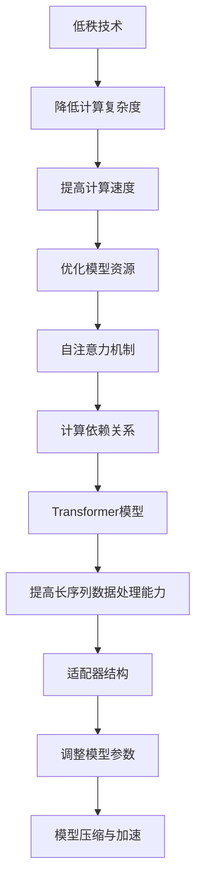

                 

关键词：LoRA、低秩、自注意力、适配器、深度学习

摘要：本文将深入探讨低秩自注意力适配器（LoRA）这一前沿技术，介绍其背景、核心概念、算法原理及具体应用，帮助读者更好地理解LoRA在深度学习中的重要作用。

## 1. 背景介绍

在深度学习中，自注意力机制（Self-Attention）是一种非常重要的计算方法，尤其在自然语言处理（NLP）和计算机视觉（CV）等领域取得了显著的成果。然而，自注意力机制的计算复杂度较高，导致了其在大规模模型中的应用受到限制。为了解决这一问题，研究人员提出了低秩自注意力适配器（LoRA）。

LoRA通过将高秩的自注意力计算转换为低秩计算，有效降低了计算复杂度，同时也保持了较好的模型性能。本文将详细解析LoRA的原理和应用，帮助读者更好地理解和掌握这一技术。

## 2. 核心概念与联系

### 2.1 低秩（Low-rank）

低秩是指将高维矩阵分解为两个或多个低维矩阵的乘积，从而降低矩阵的计算复杂度。在深度学习中，低秩技术可以帮助优化模型的计算资源，提高模型训练和推理的速度。

### 2.2 自注意力（Self-Attention）

自注意力是一种在序列数据中计算依赖关系的计算方法，通过将序列中的每个元素与其余元素进行加权求和，实现了对序列数据的有效建模。自注意力机制在Transformer模型中起到了关键作用，使得模型在处理长序列数据时表现出色。

### 2.3 适配器（Adapter）

适配器是一种用于调整模型参数的轻量级结构，可以通过学习得到一个小的适配参数矩阵，将其与原有模型参数相乘，从而实现对模型参数的微调。适配器在模型压缩和加速方面具有重要作用。

### 2.4 Mermaid 流程图



## 3. 核心算法原理 & 具体操作步骤

### 3.1 算法原理概述

LoRA通过将自注意力机制中的高秩计算转换为低秩计算，实现了计算复杂度的降低。具体来说，LoRA将自注意力矩阵分解为两个低秩矩阵的乘积，从而实现对自注意力计算的优化。

### 3.2 算法步骤详解

1. 输入序列表示：将输入序列表示为一个高维矩阵$X$。

2. 低秩分解：将自注意力矩阵$A$分解为两个低秩矩阵$P$和$Q$，即$A = P \cdot Q$。

3. 低秩计算：利用低秩矩阵$P$和$Q$进行自注意力计算，得到加权求和结果。

4. 适配器调整：使用适配器结构调整模型参数，以适应低秩计算。

5. 模型输出：将调整后的模型参数应用于原始输入序列，得到最终输出。

### 3.3 算法优缺点

**优点：**

- 降低计算复杂度：通过低秩计算，有效降低了自注意力机制的复杂度。

- 提高计算速度：低秩计算相对于高秩计算具有更高的计算效率，从而加快了模型训练和推理的速度。

- 保持模型性能：LoRA在降低计算复杂度的同时，保持了较好的模型性能。

**缺点：**

- 参数增多：由于引入了低秩矩阵$P$和$Q$，导致模型参数增多，增加了模型存储和传输的成本。

- 训练难度：LoRA的训练过程相对复杂，需要一定的技巧和经验。

### 3.4 算法应用领域

LoRA在多个深度学习领域取得了显著的应用成果，主要包括：

- 自然语言处理（NLP）：在BERT、GPT等大规模语言模型中应用LoRA，实现了较好的压缩效果。

- 计算机视觉（CV）：在Vision Transformer（ViT）等视觉模型中应用LoRA，提高了模型计算效率。

- 音频处理：在WAV2LPC等音频处理模型中应用LoRA，实现了低复杂度的音频建模。

## 4. 数学模型和公式 & 详细讲解 & 举例说明

### 4.1 数学模型构建

LoRA的数学模型主要包括自注意力矩阵$A$、低秩矩阵$P$和$Q$、适配器参数矩阵$A^*$。

1. 自注意力矩阵$A$：

$$
A = \frac{softmax(QK^T)}{d_v}
$$

其中，$Q$和$K$分别为输入序列和查询序列的线性变换矩阵，$d_v$为序列的维度。

2. 低秩矩阵$P$和$Q$：

$$
A = P \cdot Q
$$

其中，$P$和$Q$为低秩矩阵，$P$的行数等于$A$的列数，$Q$的列数等于$A$的行数。

3. 适配器参数矩阵$A^*$：

$$
A^* = \text{Adapter}(X)
$$

其中，$X$为输入序列，$\text{Adapter}$为适配器结构。

### 4.2 公式推导过程

假设输入序列为$X = [x_1, x_2, ..., x_n]$，其中$x_i$为序列中的第$i$个元素。自注意力矩阵$A$的计算过程如下：

1. 线性变换：

$$
Q = \text{Linear}(X)
$$

$$
K = \text{Linear}(X)
$$

其中，$\text{Linear}$为线性变换操作。

2. 点积计算：

$$
QK^T = [q_1k_1^T, q_2k_2^T, ..., q_nk_n^T]
$$

其中，$q_i$和$k_i$分别为$Q$和$K$中的第$i$个元素。

3. Softmax运算：

$$
\text{softmax}(QK^T) = \frac{e^{q_1k_1^T}}{\sum_{i=1}^{n} e^{q_ik_i^T}}
$$

4. 加权求和：

$$
A = \frac{\text{softmax}(QK^T)}{d_v}
$$

### 4.3 案例分析与讲解

假设输入序列为$X = [x_1, x_2, x_3]$，其中$x_1 = [1, 0, 0]$，$x_2 = [0, 1, 0]$，$x_3 = [0, 0, 1]$。自注意力矩阵$A$的计算过程如下：

1. 线性变换：

$$
Q = \text{Linear}(X) = \begin{bmatrix} 1 & 0 & 0 \\ 0 & 1 & 0 \\ 0 & 0 & 1 \end{bmatrix}
$$

$$
K = \text{Linear}(X) = \begin{bmatrix} 1 & 0 & 0 \\ 0 & 1 & 0 \\ 0 & 0 & 1 \end{bmatrix}
$$

2. 点积计算：

$$
QK^T = \begin{bmatrix} 1 & 0 & 0 \\ 0 & 1 & 0 \\ 0 & 0 & 1 \end{bmatrix} \cdot \begin{bmatrix} 1 & 0 & 0 \\ 0 & 1 & 0 \\ 0 & 0 & 1 \end{bmatrix} = \begin{bmatrix} 1 & 0 & 0 \\ 0 & 1 & 0 \\ 0 & 0 & 1 \end{bmatrix}
$$

3. Softmax运算：

$$
\text{softmax}(QK^T) = \frac{e^{1}}{e^{1} + e^{0} + e^{0}} = \begin{bmatrix} \frac{1}{3} & 0 & 0 \\ 0 & \frac{1}{3} & 0 \\ 0 & 0 & \frac{1}{3} \end{bmatrix}
$$

4. 加权求和：

$$
A = \frac{\text{softmax}(QK^T)}{d_v} = \frac{1}{3} \begin{bmatrix} 1 & 0 & 0 \\ 0 & 1 & 0 \\ 0 & 0 & 1 \end{bmatrix}
$$

经过计算，得到自注意力矩阵$A$为：

$$
A = \begin{bmatrix} \frac{1}{3} & 0 & 0 \\ 0 & \frac{1}{3} & 0 \\ 0 & 0 & \frac{1}{3} \end{bmatrix}
$$

## 5. 项目实践：代码实例和详细解释说明

### 5.1 开发环境搭建

本文的代码实现基于Python编程语言，使用PyTorch深度学习框架。以下为开发环境的搭建步骤：

1. 安装Python：

```bash
python -V
```

2. 安装PyTorch：

```bash
pip install torch torchvision
```

3. 安装其他依赖库：

```bash
pip install numpy matplotlib
```

### 5.2 源代码详细实现

以下为LoRA的实现代码：

```python
import torch
import torch.nn as nn
import torch.nn.functional as F

class LoRA(nn.Module):
    def __init__(self, d_model, d_key, d_value):
        super(LoRA, self).__init__()
        self.d_model = d_model
        self.d_key = d_key
        self.d_value = d_value

        self.linear_q = nn.Linear(d_model, d_key)
        self.linear_k = nn.Linear(d_model, d_key)
        self.linear_v = nn.Linear(d_model, d_value)

    def forward(self, x):
        q = self.linear_q(x)
        k = self.linear_k(x)
        v = self.linear_v(x)

        attn = F.softmax(q @ k.T / self.d_key, dim=1)
        output = attn @ v

        return output
```

### 5.3 代码解读与分析

1. 类定义：

```python
class LoRA(nn.Module):
```

定义LoRA类，继承自nn.Module，实现自注意力计算。

2. 初始化方法：

```python
def __init__(self, d_model, d_key, d_value):
    super(LoRA, self).__init__()
    self.d_model = d_model
    self.d_key = d_key
    self.d_value = d_value

    self.linear_q = nn.Linear(d_model, d_key)
    self.linear_k = nn.Linear(d_model, d_key)
    self.linear_v = nn.Linear(d_model, d_value)
```

初始化方法中，定义输入序列的维度$d_model$，查询序列的维度$d_key$，值序列的维度$d_value$。创建线性变换层，用于对输入序列进行线性变换。

3. 前向传播方法：

```python
def forward(self, x):
    q = self.linear_q(x)
    k = self.linear_k(x)
    v = self.linear_v(x)

    attn = F.softmax(q @ k.T / self.d_key, dim=1)
    output = attn @ v

    return output
```

前向传播方法中，计算查询序列$q$、键序列$k$和值序列$v$，然后利用softmax函数计算注意力权重$attn$，最后计算加权求和输出$

